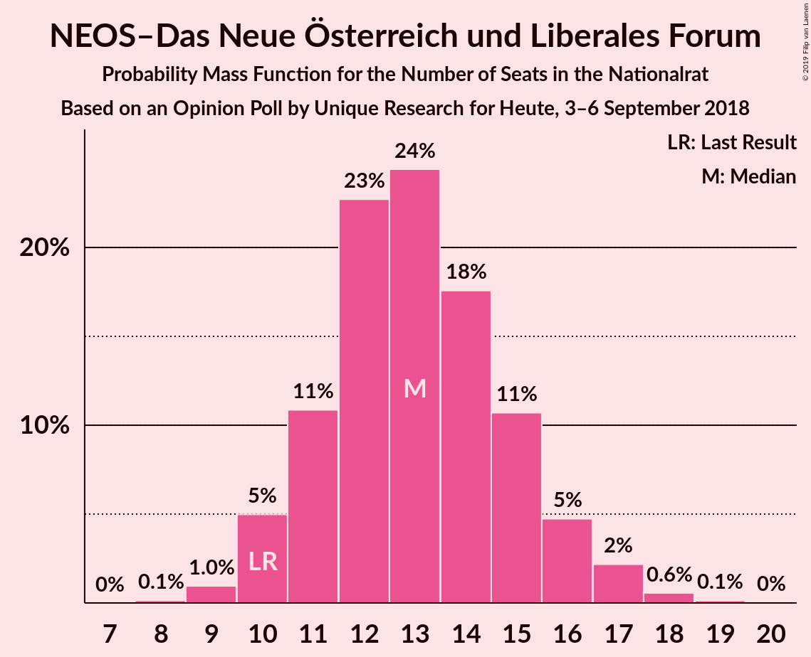
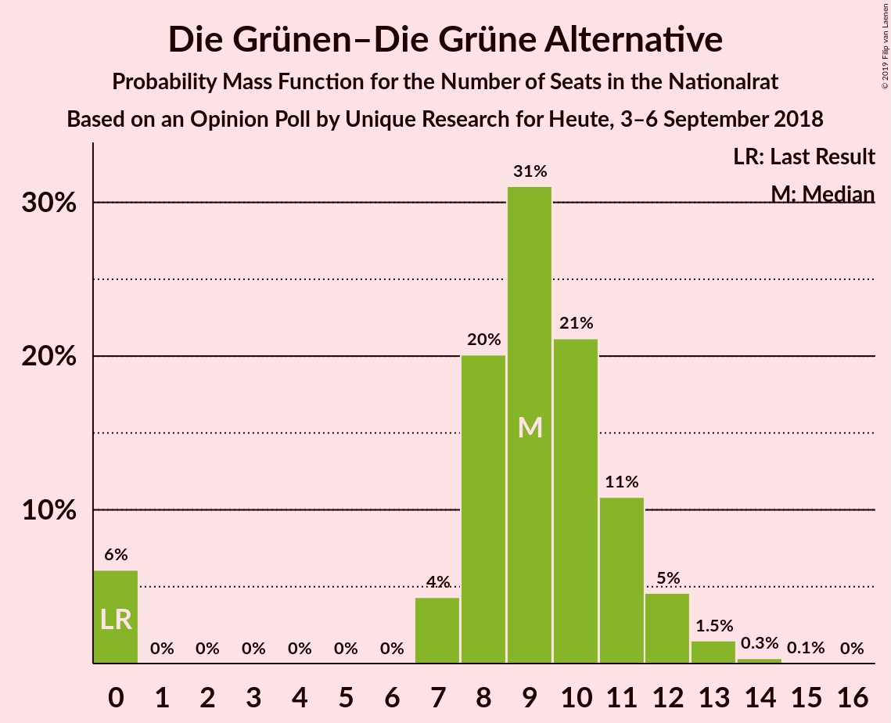
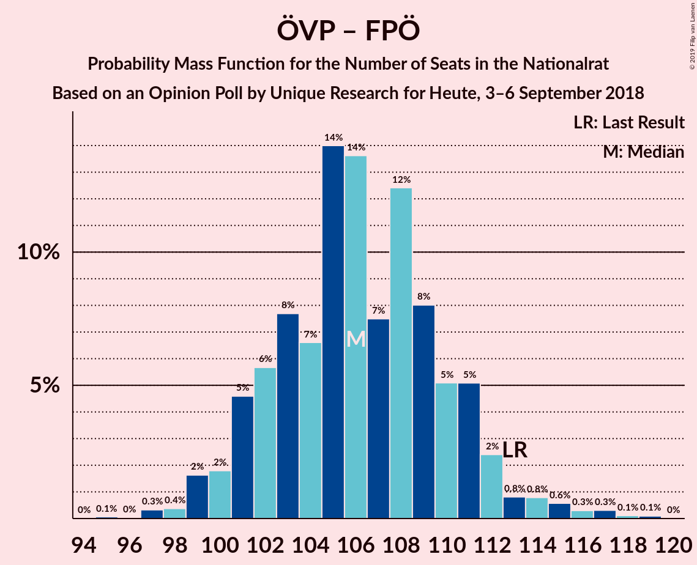

# Opinion Poll by Unique Research for Heute, 3–6 September 2018

<a href="#voting-intentions">Voting Intentions</a> | <a href="#seats">Seats</a> | <a href="#coalitions">Coalitions</a> | <a href="#technical-information">Technical Information</a>

## Voting Intentions

### Confidence Intervals

| Party | Last Result | Poll Result | 80% Confidence Interval | 90% Confidence Interval | 95% Confidence Interval | 99% Confidence Interval |
|:-----:|:-----------:|:-----------:|:-----------------------:|:-----------------------:|:-----------------------:|:-----------------------:|
| Österreichische Volkspartei | 31.5% | 33.0% | 30.9–35.2% |30.3–35.8% |29.8–36.3% |28.8–37.4% |
| Sozialdemokratische Partei Österreichs | 26.9% | 29.0% | 27.0–31.1% |26.4–31.7% |26.0–32.3% |25.0–33.3% |
| Freiheitliche Partei Österreichs | 26.0% | 23.0% | 21.2–25.0% |20.7–25.6% |20.2–26.0% |19.4–27.0% |
| NEOS–Das Neue Österreich und Liberales Forum | 5.3% | 7.0% | 6.0–8.3% |5.7–8.7% |5.4–9.0% |5.0–9.6% |
| Die Grünen–Die Grüne Alternative | 3.8% | 5.0% | 4.1–6.1% |3.9–6.5% |3.7–6.8% |3.3–7.3% |
| JETZT–Liste Pilz | 4.4% | 2.0% | 1.5–2.8% |1.4–3.0% |1.2–3.2% |1.0–3.7% |

*Note:* The poll result column reflects the actual value used in the calculations. Published results may vary slightly, and in addition be rounded to fewer digits.

## Seats

### Confidence Intervals

| Party | Last Result | Median | 80% Confidence Interval | 90% Confidence Interval | 95% Confidence Interval | 99% Confidence Interval |
|:-----:|:-----------:|:------:|:-----------------------:|:-----------------------:|:-----------------------:|:-----------------------:|
| <a href="#österreichische-volkspartei">Österreichische Volkspartei</a> | 62 | 63 | 59–67 |57–68 |56–69 |54–71 |
| <a href="#sozialdemokratische-partei-österreichs">Sozialdemokratische Partei Österreichs</a> | 52 | 55 | 51–59 |50–60 |49–61 |47–64 |
| <a href="#freiheitliche-partei-österreichs">Freiheitliche Partei Österreichs</a> | 51 | 43 | 40–47 |39–48 |38–49 |37–51 |
| <a href="#neos–das-neue-österreich-und-liberales-forum">NEOS–Das Neue Österreich und Liberales Forum</a> | 10 | 13 | 11–15 |10–16 |10–17 |9–18 |
| <a href="#die-grünen–die-grüne-alternative">Die Grünen–Die Grüne Alternative</a> | 0 | 9 | 7–11 |0–12 |0–12 |0–13 |
| <a href="#jetzt–liste-pilz">JETZT–Liste Pilz</a> | 8 | 0 | 0 |0 |0 |0 |

### Österreichische Volkspartei

*For a full overview of the results for this party, see the [Österreichische Volkspartei](party-österreichischevolkspartei.html) page.*

| Number of Seats | Probability | Accumulated | Special Marks |
|:---------------:|:-----------:|:-----------:|:-------------:|
| 53 | 0.1% | 100% |  |
| 54 | 0.4% | 99.8% |  |
| 55 | 0.5% | 99.4% |  |
| 56 | 2% | 99.0% |  |
| 57 | 3% | 97% |  |
| 58 | 4% | 94% |  |
| 59 | 6% | 91% |  |
| 60 | 11% | 84% |  |
| 61 | 8% | 73% |  |
| 62 | 12% | 65% | Last Result |
| 63 | 18% | 53% | Median |
| 64 | 7% | 35% |  |
| 65 | 9% | 28% |  |
| 66 | 8% | 20% |  |
| 67 | 5% | 12% |  |
| 68 | 2% | 6% |  |
| 69 | 2% | 4% |  |
| 70 | 1.0% | 2% |  |
| 71 | 0.5% | 0.9% |  |
| 72 | 0.2% | 0.4% |  |
| 73 | 0.1% | 0.2% |  |
| 74 | 0% | 0.1% |  |
| 75 | 0% | 0% |  |

### Sozialdemokratische Partei Österreichs

*For a full overview of the results for this party, see the [Sozialdemokratische Partei Österreichs](party-sozialdemokratischeparteiösterreichs.html) page.*

| Number of Seats | Probability | Accumulated | Special Marks |
|:---------------:|:-----------:|:-----------:|:-------------:|
| 45 | 0% | 100% |  |
| 46 | 0.1% | 99.9% |  |
| 47 | 0.6% | 99.8% |  |
| 48 | 0.5% | 99.2% |  |
| 49 | 2% | 98.7% |  |
| 50 | 4% | 97% |  |
| 51 | 4% | 92% |  |
| 52 | 13% | 88% | Last Result |
| 53 | 10% | 76% |  |
| 54 | 9% | 66% |  |
| 55 | 16% | 57% | Median |
| 56 | 10% | 41% |  |
| 57 | 8% | 31% |  |
| 58 | 11% | 23% |  |
| 59 | 4% | 12% |  |
| 60 | 4% | 8% |  |
| 61 | 2% | 4% |  |
| 62 | 1.0% | 2% |  |
| 63 | 0.5% | 1.0% |  |
| 64 | 0.3% | 0.5% |  |
| 65 | 0.1% | 0.2% |  |
| 66 | 0.1% | 0.1% |  |
| 67 | 0% | 0% |  |

### Freiheitliche Partei Österreichs

*For a full overview of the results for this party, see the [Freiheitliche Partei Österreichs](party-freiheitlicheparteiösterreichs.html) page.*

| Number of Seats | Probability | Accumulated | Special Marks |
|:---------------:|:-----------:|:-----------:|:-------------:|
| 35 | 0.1% | 100% |  |
| 36 | 0.3% | 99.8% |  |
| 37 | 1.0% | 99.5% |  |
| 38 | 2% | 98.6% |  |
| 39 | 5% | 97% |  |
| 40 | 5% | 92% |  |
| 41 | 9% | 88% |  |
| 42 | 15% | 79% |  |
| 43 | 14% | 64% | Median |
| 44 | 16% | 50% |  |
| 45 | 10% | 34% |  |
| 46 | 11% | 24% |  |
| 47 | 5% | 13% |  |
| 48 | 3% | 8% |  |
| 49 | 2% | 4% |  |
| 50 | 1.0% | 2% |  |
| 51 | 0.6% | 1.0% | Last Result |
| 52 | 0.3% | 0.4% |  |
| 53 | 0.1% | 0.2% |  |
| 54 | 0% | 0.1% |  |
| 55 | 0% | 0% |  |

### NEOS–Das Neue Österreich und Liberales Forum

*For a full overview of the results for this party, see the [NEOS–Das Neue Österreich und Liberales Forum](party-neos–dasneueösterreichundliberalesforum.html) page.*

| Number of Seats | Probability | Accumulated | Special Marks |
|:---------------:|:-----------:|:-----------:|:-------------:|
| 8 | 0.1% | 100% |  |
| 9 | 1.0% | 99.8% |  |
| 10 | 5% | 98.9% | Last Result |
| 11 | 11% | 94% |  |
| 12 | 23% | 83% |  |
| 13 | 24% | 60% | Median |
| 14 | 18% | 36% |  |
| 15 | 11% | 18% |  |
| 16 | 5% | 8% |  |
| 17 | 2% | 3% |  |
| 18 | 0.6% | 0.7% |  |
| 19 | 0.1% | 0.2% |  |
| 20 | 0% | 0% |  |

### Die Grünen–Die Grüne Alternative

*For a full overview of the results for this party, see the [Die Grünen–Die Grüne Alternative](party-diegrünen–diegrünealternative.html) page.*

| Number of Seats | Probability | Accumulated | Special Marks |
|:---------------:|:-----------:|:-----------:|:-------------:|
| 0 | 6% | 100% | Last Result |
| 1 | 0% | 94% |  |
| 2 | 0% | 94% |  |
| 3 | 0% | 94% |  |
| 4 | 0% | 94% |  |
| 5 | 0% | 94% |  |
| 6 | 0% | 94% |  |
| 7 | 4% | 94% |  |
| 8 | 20% | 90% |  |
| 9 | 31% | 70% | Median |
| 10 | 21% | 38% |  |
| 11 | 11% | 17% |  |
| 12 | 5% | 6% |  |
| 13 | 1.5% | 2% |  |
| 14 | 0.3% | 0.4% |  |
| 15 | 0.1% | 0.1% |  |
| 16 | 0% | 0% |  |

### JETZT–Liste Pilz

*For a full overview of the results for this party, see the [JETZT–Liste Pilz](party-jetzt–listepilz.html) page.*

| Number of Seats | Probability | Accumulated | Special Marks |
|:---------------:|:-----------:|:-----------:|:-------------:|
| 0 | 99.9% | 100% | Median |
| 1 | 0% | 0.1% |  |
| 2 | 0% | 0.1% |  |
| 3 | 0% | 0.1% |  |
| 4 | 0% | 0.1% |  |
| 5 | 0% | 0.1% |  |
| 6 | 0% | 0.1% |  |
| 7 | 0% | 0.1% |  |
| 8 | 0% | 0% | Last Result |

## Coalitions

### Confidence Intervals

| Coalition | Last Result | Median | Majority? | 80% Confidence Interval | 90% Confidence Interval | 95% Confidence Interval | 99% Confidence Interval |
|:---------:|:-----------:|:------:|:---------:|:-----------------------:|:-----------------------:|:-----------------------:|:-----------------------:|
| Österreichische Volkspartei – Sozialdemokratische Partei Österreichs | 114 | 118 | 100% | 113–122 | 112–124 | 111–125 | 109–129 |
| Österreichische Volkspartei – Freiheitliche Partei Österreichs | 113 | 106 | 100% | 102–111 | 101–112 | 100–113 | 98–117 |
| Sozialdemokratische Partei Österreichs – Freiheitliche Partei Österreichs | 103 | 98 | 98% | 94–103 | 93–105 | 92–106 | 90–109 |
| Österreichische Volkspartei – NEOS–Das Neue Österreich und Liberales Forum – Die Grünen–Die Grüne Alternative | 72 | 85 | 2% | 80–89 | 78–90 | 77–91 | 74–93 |
| Sozialdemokratische Partei Österreichs – NEOS–Das Neue Österreich und Liberales Forum – Die Grünen–Die Grüne Alternative | 62 | 77 | 0% | 72–81 | 71–82 | 70–83 | 66–85 |
| Österreichische Volkspartei – NEOS–Das Neue Österreich und Liberales Forum | 72 | 76 | 0% | 71–80 | 70–81 | 69–83 | 68–85 |
| Österreichische Volkspartei – Die Grünen–Die Grüne Alternative | 62 | 72 | 0% | 67–76 | 65–77 | 64–78 | 61–80 |
| Österreichische Volkspartei | 62 | 63 | 0% | 59–67 | 57–68 | 56–69 | 54–71 |
| Sozialdemokratische Partei Österreichs | 52 | 55 | 0% | 51–59 | 50–60 | 49–61 | 47–64 |

### Österreichische Volkspartei – Sozialdemokratische Partei Österreichs

| Number of Seats | Probability | Accumulated | Special Marks |
|:---------------:|:-----------:|:-----------:|:-------------:|
| 107 | 0.1% | 100% |  |
| 108 | 0.1% | 99.9% |  |
| 109 | 0.3% | 99.8% |  |
| 110 | 1.1% | 99.4% |  |
| 111 | 2% | 98% |  |
| 112 | 5% | 96% |  |
| 113 | 5% | 91% |  |
| 114 | 3% | 87% | Last Result |
| 115 | 5% | 83% |  |
| 116 | 10% | 78% |  |
| 117 | 11% | 68% |  |
| 118 | 23% | 57% | Median |
| 119 | 14% | 34% |  |
| 120 | 6% | 21% |  |
| 121 | 4% | 15% |  |
| 122 | 2% | 11% |  |
| 123 | 3% | 9% |  |
| 124 | 3% | 7% |  |
| 125 | 2% | 3% |  |
| 126 | 0.7% | 2% |  |
| 127 | 0.2% | 0.9% |  |
| 128 | 0.1% | 0.7% |  |
| 129 | 0.2% | 0.6% |  |
| 130 | 0.2% | 0.3% |  |
| 131 | 0.1% | 0.1% |  |
| 132 | 0% | 0% |  |

### Österreichische Volkspartei – Freiheitliche Partei Österreichs

| Number of Seats | Probability | Accumulated | Special Marks |
|:---------------:|:-----------:|:-----------:|:-------------:|
| 95 | 0.1% | 100% |  |
| 96 | 0% | 99.9% |  |
| 97 | 0.3% | 99.9% |  |
| 98 | 0.4% | 99.5% |  |
| 99 | 2% | 99.2% |  |
| 100 | 2% | 98% |  |
| 101 | 5% | 96% |  |
| 102 | 6% | 91% |  |
| 103 | 8% | 85% |  |
| 104 | 7% | 78% |  |
| 105 | 14% | 71% |  |
| 106 | 14% | 57% | Median |
| 107 | 7% | 44% |  |
| 108 | 12% | 36% |  |
| 109 | 8% | 24% |  |
| 110 | 5% | 16% |  |
| 111 | 5% | 11% |  |
| 112 | 2% | 5% |  |
| 113 | 0.8% | 3% | Last Result |
| 114 | 0.8% | 2% |  |
| 115 | 0.6% | 1.4% |  |
| 116 | 0.3% | 0.8% |  |
| 117 | 0.3% | 0.5% |  |
| 118 | 0.1% | 0.2% |  |
| 119 | 0.1% | 0.1% |  |
| 120 | 0% | 0% |  |

### Sozialdemokratische Partei Österreichs – Freiheitliche Partei Österreichs

| Number of Seats | Probability | Accumulated | Special Marks |
|:---------------:|:-----------:|:-----------:|:-------------:|
| 87 | 0.1% | 100% |  |
| 88 | 0.1% | 99.9% |  |
| 89 | 0.2% | 99.8% |  |
| 90 | 0.5% | 99.7% |  |
| 91 | 1.1% | 99.2% |  |
| 92 | 3% | 98% | Majority |
| 93 | 3% | 95% |  |
| 94 | 3% | 92% |  |
| 95 | 9% | 89% |  |
| 96 | 10% | 80% |  |
| 97 | 8% | 71% |  |
| 98 | 14% | 62% | Median |
| 99 | 9% | 48% |  |
| 100 | 14% | 39% |  |
| 101 | 9% | 26% |  |
| 102 | 5% | 17% |  |
| 103 | 4% | 13% | Last Result |
| 104 | 3% | 9% |  |
| 105 | 2% | 6% |  |
| 106 | 2% | 3% |  |
| 107 | 0.3% | 1.4% |  |
| 108 | 0.6% | 1.1% |  |
| 109 | 0.4% | 0.5% |  |
| 110 | 0.1% | 0.2% |  |
| 111 | 0% | 0.1% |  |
| 112 | 0% | 0.1% |  |
| 113 | 0% | 0% |  |

### Österreichische Volkspartei – NEOS–Das Neue Österreich und Liberales Forum – Die Grünen–Die Grüne Alternative

| Number of Seats | Probability | Accumulated | Special Marks |
|:---------------:|:-----------:|:-----------:|:-------------:|
| 71 | 0% | 100% |  |
| 72 | 0% | 99.9% | Last Result |
| 73 | 0.1% | 99.9% |  |
| 74 | 0.4% | 99.8% |  |
| 75 | 0.6% | 99.5% |  |
| 76 | 0.3% | 98.9% |  |
| 77 | 2% | 98.6% |  |
| 78 | 2% | 97% |  |
| 79 | 3% | 94% |  |
| 80 | 4% | 91% |  |
| 81 | 5% | 87% |  |
| 82 | 9% | 83% |  |
| 83 | 14% | 74% |  |
| 84 | 9% | 61% |  |
| 85 | 14% | 52% | Median |
| 86 | 8% | 38% |  |
| 87 | 10% | 29% |  |
| 88 | 9% | 19% |  |
| 89 | 3% | 11% |  |
| 90 | 3% | 8% |  |
| 91 | 3% | 5% |  |
| 92 | 1.1% | 2% | Majority |
| 93 | 0.5% | 0.8% |  |
| 94 | 0.2% | 0.3% |  |
| 95 | 0.1% | 0.1% |  |
| 96 | 0.1% | 0.1% |  |
| 97 | 0% | 0% |  |

### Sozialdemokratische Partei Österreichs – NEOS–Das Neue Österreich und Liberales Forum – Die Grünen–Die Grüne Alternative

| Number of Seats | Probability | Accumulated | Special Marks |
|:---------------:|:-----------:|:-----------:|:-------------:|
| 62 | 0% | 100% | Last Result |
| 63 | 0% | 100% |  |
| 64 | 0.1% | 100% |  |
| 65 | 0.1% | 99.9% |  |
| 66 | 0.3% | 99.8% |  |
| 67 | 0.3% | 99.4% |  |
| 68 | 0.6% | 99.1% |  |
| 69 | 0.8% | 98.6% |  |
| 70 | 0.8% | 98% |  |
| 71 | 2% | 97% |  |
| 72 | 5% | 95% |  |
| 73 | 5% | 89% |  |
| 74 | 8% | 84% |  |
| 75 | 12% | 76% |  |
| 76 | 7% | 64% |  |
| 77 | 14% | 56% | Median |
| 78 | 14% | 43% |  |
| 79 | 7% | 29% |  |
| 80 | 8% | 22% |  |
| 81 | 6% | 15% |  |
| 82 | 5% | 9% |  |
| 83 | 2% | 4% |  |
| 84 | 2% | 2% |  |
| 85 | 0.4% | 0.8% |  |
| 86 | 0.3% | 0.5% |  |
| 87 | 0% | 0.1% |  |
| 88 | 0.1% | 0.1% |  |
| 89 | 0% | 0% |  |

### Österreichische Volkspartei – NEOS–Das Neue Österreich und Liberales Forum

| Number of Seats | Probability | Accumulated | Special Marks |
|:---------------:|:-----------:|:-----------:|:-------------:|
| 65 | 0.1% | 100% |  |
| 66 | 0.1% | 99.9% |  |
| 67 | 0.2% | 99.7% |  |
| 68 | 1.1% | 99.5% |  |
| 69 | 2% | 98% |  |
| 70 | 4% | 96% |  |
| 71 | 4% | 92% |  |
| 72 | 4% | 89% | Last Result |
| 73 | 8% | 85% |  |
| 74 | 14% | 77% |  |
| 75 | 12% | 63% |  |
| 76 | 15% | 51% | Median |
| 77 | 11% | 36% |  |
| 78 | 5% | 25% |  |
| 79 | 6% | 21% |  |
| 80 | 6% | 14% |  |
| 81 | 4% | 8% |  |
| 82 | 2% | 5% |  |
| 83 | 1.4% | 3% |  |
| 84 | 0.4% | 1.2% |  |
| 85 | 0.4% | 0.8% |  |
| 86 | 0.2% | 0.3% |  |
| 87 | 0.1% | 0.2% |  |
| 88 | 0.1% | 0.1% |  |
| 89 | 0% | 0% |  |

### Österreichische Volkspartei – Die Grünen–Die Grüne Alternative

| Number of Seats | Probability | Accumulated | Special Marks |
|:---------------:|:-----------:|:-----------:|:-------------:|
| 58 | 0% | 100% |  |
| 59 | 0.1% | 99.9% |  |
| 60 | 0.1% | 99.8% |  |
| 61 | 0.3% | 99.7% |  |
| 62 | 0.8% | 99.4% | Last Result |
| 63 | 0.7% | 98.6% |  |
| 64 | 2% | 98% |  |
| 65 | 2% | 96% |  |
| 66 | 2% | 94% |  |
| 67 | 4% | 92% |  |
| 68 | 7% | 88% |  |
| 69 | 9% | 81% |  |
| 70 | 10% | 72% |  |
| 71 | 8% | 62% |  |
| 72 | 15% | 53% | Median |
| 73 | 8% | 38% |  |
| 74 | 9% | 30% |  |
| 75 | 9% | 21% |  |
| 76 | 6% | 12% |  |
| 77 | 3% | 6% |  |
| 78 | 2% | 4% |  |
| 79 | 0.9% | 2% |  |
| 80 | 0.5% | 0.8% |  |
| 81 | 0.2% | 0.3% |  |
| 82 | 0.1% | 0.1% |  |
| 83 | 0% | 0.1% |  |
| 84 | 0% | 0% |  |

### Österreichische Volkspartei

| Number of Seats | Probability | Accumulated | Special Marks |
|:---------------:|:-----------:|:-----------:|:-------------:|
| 53 | 0.1% | 100% |  |
| 54 | 0.4% | 99.8% |  |
| 55 | 0.5% | 99.4% |  |
| 56 | 2% | 99.0% |  |
| 57 | 3% | 97% |  |
| 58 | 4% | 94% |  |
| 59 | 6% | 91% |  |
| 60 | 11% | 84% |  |
| 61 | 8% | 73% |  |
| 62 | 12% | 65% | Last Result |
| 63 | 18% | 53% | Median |
| 64 | 7% | 35% |  |
| 65 | 9% | 28% |  |
| 66 | 8% | 20% |  |
| 67 | 5% | 12% |  |
| 68 | 2% | 6% |  |
| 69 | 2% | 4% |  |
| 70 | 1.0% | 2% |  |
| 71 | 0.5% | 0.9% |  |
| 72 | 0.2% | 0.4% |  |
| 73 | 0.1% | 0.2% |  |
| 74 | 0% | 0.1% |  |
| 75 | 0% | 0% |  |

### Sozialdemokratische Partei Österreichs

| Number of Seats | Probability | Accumulated | Special Marks |
|:---------------:|:-----------:|:-----------:|:-------------:|
| 45 | 0% | 100% |  |
| 46 | 0.1% | 99.9% |  |
| 47 | 0.6% | 99.8% |  |
| 48 | 0.5% | 99.2% |  |
| 49 | 2% | 98.7% |  |
| 50 | 4% | 97% |  |
| 51 | 4% | 92% |  |
| 52 | 13% | 88% | Last Result |
| 53 | 10% | 76% |  |
| 54 | 9% | 66% |  |
| 55 | 16% | 57% | Median |
| 56 | 10% | 41% |  |
| 57 | 8% | 31% |  |
| 58 | 11% | 23% |  |
| 59 | 4% | 12% |  |
| 60 | 4% | 8% |  |
| 61 | 2% | 4% |  |
| 62 | 1.0% | 2% |  |
| 63 | 0.5% | 1.0% |  |
| 64 | 0.3% | 0.5% |  |
| 65 | 0.1% | 0.2% |  |
| 66 | 0.1% | 0.1% |  |
| 67 | 0% | 0% |  |

## Technical Information

### Opinion Poll

+ **Polling firm:** Unique Research
+ **Commissioner(s):** Heute
+ **Fieldwork period:** 3–6 September 2018

### Calculations

+ **Sample size:** 800
+ **Simulations done:** 131,072
+ **Error estimate:** 0.81%

