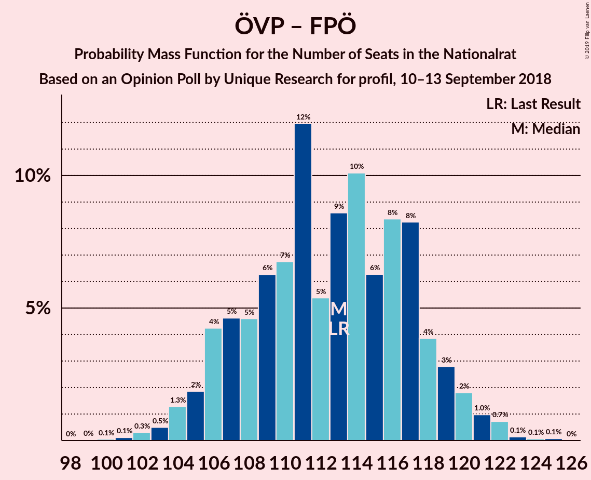

# Opinion Poll by Unique Research for profil, 10–13 September 2018

<a href="#voting-intentions">Voting Intentions</a> | <a href="#seats">Seats</a> | <a href="#coalitions">Coalitions</a> | <a href="#technical-information">Technical Information</a>

## Voting Intentions

### Confidence Intervals

| Party | Last Result | Poll Result | 80% Confidence Interval | 90% Confidence Interval | 95% Confidence Interval | 99% Confidence Interval |
|:-----:|:-----------:|:-----------:|:-----------------------:|:-----------------------:|:-----------------------:|:-----------------------:|
| Österreichische Volkspartei | 31.5% | 34.0% | 31.9–36.2% |31.3–36.8% |30.8–37.4% |29.8–38.4% |
| Sozialdemokratische Partei Österreichs | 26.9% | 28.0% | 26.0–30.1% |25.5–30.7% |25.0–31.2% |24.1–32.3% |
| Freiheitliche Partei Österreichs | 26.0% | 25.0% | 23.1–27.0% |22.6–27.6% |22.1–28.1% |21.2–29.1% |
| NEOS–Das Neue Österreich und Liberales Forum | 5.3% | 7.0% | 6.0–8.3% |5.7–8.7% |5.4–9.0% |5.0–9.6% |
| Die Grünen–Die Grüne Alternative | 3.8% | 4.0% | 3.2–5.0% |3.0–5.3% |2.9–5.6% |2.5–6.1% |
| JETZT–Liste Pilz | 4.4% | 1.0% | 0.7–1.6% |0.6–1.8% |0.5–2.0% |0.4–2.3% |

*Note:* The poll result column reflects the actual value used in the calculations. Published results may vary slightly, and in addition be rounded to fewer digits.

## Seats

### Confidence Intervals

| Party | Last Result | Median | 80% Confidence Interval | 90% Confidence Interval | 95% Confidence Interval | 99% Confidence Interval |
|:-----:|:-----------:|:------:|:-----------------------:|:-----------------------:|:-----------------------:|:-----------------------:|
| <a href="#österreichische-volkspartei">Österreichische Volkspartei</a> | 62 | 68 | 60–68 |60–71 |60–71 |60–72 |
| <a href="#sozialdemokratische-partei-österreichs">Sozialdemokratische Partei Österreichs</a> | 52 | 55 | 52–55 |52–55 |49–55 |49–57 |
| <a href="#freiheitliche-partei-österreichs">Freiheitliche Partei Österreichs</a> | 51 | 47 | 47–48 |46–48 |46–54 |40–54 |
| <a href="#neos–das-neue-österreich-und-liberales-forum">NEOS–Das Neue Österreich und Liberales Forum</a> | 10 | 13 | 12–13 |12–14 |12–14 |12–16 |
| <a href="#die-grünen–die-grüne-alternative">Die Grünen–Die Grüne Alternative</a> | 0 | 0 | 0–9 |0–9 |0–9 |0–11 |
| <a href="#jetzt–liste-pilz">JETZT–Liste Pilz</a> | 8 | 0 | 0 |0 |0 |0 |

### Österreichische Volkspartei

*For a full overview of the results for this party, see the [Österreichische Volkspartei](party-österreichischevolkspartei.html) page.*

| Number of Seats | Probability | Accumulated | Special Marks |
|:---------------:|:-----------:|:-----------:|:-------------:|
| 60 | 15% | 100% |  |
| 61 | 0% | 85% |  |
| 62 | 0% | 85% | Last Result |
| 63 | 1.0% | 85% |  |
| 64 | 0% | 84% |  |
| 65 | 0% | 84% |  |
| 66 | 0% | 84% |  |
| 67 | 0% | 84% |  |
| 68 | 76% | 84% | Median |
| 69 | 0% | 8% |  |
| 70 | 0% | 8% |  |
| 71 | 7% | 8% |  |
| 72 | 0.7% | 0.7% |  |
| 73 | 0% | 0% |  |

### Sozialdemokratische Partei Österreichs

*For a full overview of the results for this party, see the [Sozialdemokratische Partei Österreichs](party-sozialdemokratischeparteiösterreichs.html) page.*

| Number of Seats | Probability | Accumulated | Special Marks |
|:---------------:|:-----------:|:-----------:|:-------------:|
| 48 | 0.3% | 100% |  |
| 49 | 3% | 99.7% |  |
| 50 | 0% | 97% |  |
| 51 | 1.0% | 97% |  |
| 52 | 7% | 96% | Last Result |
| 53 | 0.1% | 89% |  |
| 54 | 12% | 89% |  |
| 55 | 76% | 76% | Median |
| 56 | 0% | 0.8% |  |
| 57 | 0.8% | 0.8% |  |
| 58 | 0% | 0% |  |

### Freiheitliche Partei Österreichs

*For a full overview of the results for this party, see the [Freiheitliche Partei Österreichs](party-freiheitlicheparteiösterreichs.html) page.*

| Number of Seats | Probability | Accumulated | Special Marks |
|:---------------:|:-----------:|:-----------:|:-------------:|
| 40 | 0.7% | 100% |  |
| 41 | 0% | 99.3% |  |
| 42 | 1.0% | 99.3% |  |
| 43 | 0% | 98% |  |
| 44 | 0% | 98% |  |
| 45 | 0% | 98% |  |
| 46 | 7% | 98% |  |
| 47 | 76% | 91% | Median |
| 48 | 12% | 15% |  |
| 49 | 0% | 3% |  |
| 50 | 0% | 3% |  |
| 51 | 0% | 3% | Last Result |
| 52 | 0% | 3% |  |
| 53 | 0.1% | 3% |  |
| 54 | 3% | 3% |  |
| 55 | 0% | 0% |  |

### NEOS–Das Neue Österreich und Liberales Forum

*For a full overview of the results for this party, see the [NEOS–Das Neue Österreich und Liberales Forum](party-neos–dasneueösterreichundliberalesforum.html) page.*

| Number of Seats | Probability | Accumulated | Special Marks |
|:---------------:|:-----------:|:-----------:|:-------------:|
| 9 | 0.2% | 100% |  |
| 10 | 0% | 99.8% | Last Result |
| 11 | 0% | 99.8% |  |
| 12 | 12% | 99.8% |  |
| 13 | 79% | 88% | Median |
| 14 | 8% | 9% |  |
| 15 | 0% | 1.2% |  |
| 16 | 1.0% | 1.2% |  |
| 17 | 0.2% | 0.2% |  |
| 18 | 0% | 0% |  |

### Die Grünen–Die Grüne Alternative

*For a full overview of the results for this party, see the [Die Grünen–Die Grüne Alternative](party-diegrünen–diegrünealternative.html) page.*

| Number of Seats | Probability | Accumulated | Special Marks |
|:---------------:|:-----------:|:-----------:|:-------------:|
| 0 | 84% | 100% | Last Result, Median |
| 1 | 0% | 16% |  |
| 2 | 0% | 16% |  |
| 3 | 0% | 16% |  |
| 4 | 0% | 16% |  |
| 5 | 0% | 16% |  |
| 6 | 0% | 16% |  |
| 7 | 3% | 16% |  |
| 8 | 0.1% | 13% |  |
| 9 | 12% | 13% |  |
| 10 | 0% | 1.0% |  |
| 11 | 1.0% | 1.0% |  |
| 12 | 0% | 0% |  |

### JETZT–Liste Pilz

*For a full overview of the results for this party, see the [JETZT–Liste Pilz](party-jetzt–listepilz.html) page.*

| Number of Seats | Probability | Accumulated | Special Marks |
|:---------------:|:-----------:|:-----------:|:-------------:|
| 0 | 100% | 100% | Median |
| 1 | 0% | 0% |  |
| 2 | 0% | 0% |  |
| 3 | 0% | 0% |  |
| 4 | 0% | 0% |  |
| 5 | 0% | 0% |  |
| 6 | 0% | 0% |  |
| 7 | 0% | 0% |  |
| 8 | 0% | 0% | Last Result |

## Coalitions

### Confidence Intervals

| Coalition | Last Result | Median | Majority? | 80% Confidence Interval | 90% Confidence Interval | 95% Confidence Interval | 99% Confidence Interval |
|:---------:|:-----------:|:------:|:---------:|:-----------------------:|:-----------------------:|:-----------------------:|:-----------------------:|
| Österreichische Volkspartei – Sozialdemokratische Partei Österreichs | 114 | 123 | 100% | 114–123 | 114–123 | 109–123 | 109–129 |
| Österreichische Volkspartei – Freiheitliche Partei Österreichs | 113 | 115 | 100% | 108–115 | 108–117 | 108–117 | 105–117 |
| Sozialdemokratische Partei Österreichs – Freiheitliche Partei Österreichs | 103 | 102 | 100% | 102 | 98–102 | 98–103 | 93–103 |
| Österreichische Volkspartei | 62 | 68 | 0% | 60–68 | 60–71 | 60–71 | 60–72 |
| Sozialdemokratische Partei Österreichs | 52 | 55 | 0% | 52–55 | 52–55 | 49–55 | 49–57 |

### Österreichische Volkspartei – Sozialdemokratische Partei Österreichs

| Number of Seats | Probability | Accumulated | Special Marks |
|:---------------:|:-----------:|:-----------:|:-------------:|
| 108 | 0.1% | 100% |  |
| 109 | 3% | 99.9% |  |
| 110 | 0% | 97% |  |
| 111 | 0% | 97% |  |
| 112 | 0% | 97% |  |
| 113 | 0% | 97% |  |
| 114 | 13% | 97% | Last Result |
| 115 | 0% | 84% |  |
| 116 | 0% | 84% |  |
| 117 | 0% | 84% |  |
| 118 | 0% | 84% |  |
| 119 | 0.2% | 84% |  |
| 120 | 0% | 83% |  |
| 121 | 0.1% | 83% |  |
| 122 | 0.1% | 83% |  |
| 123 | 83% | 83% | Median |
| 124 | 0% | 0.7% |  |
| 125 | 0% | 0.7% |  |
| 126 | 0% | 0.7% |  |
| 127 | 0% | 0.7% |  |
| 128 | 0% | 0.7% |  |
| 129 | 0.7% | 0.7% |  |
| 130 | 0% | 0% |  |

### Österreichische Volkspartei – Freiheitliche Partei Österreichs

| Number of Seats | Probability | Accumulated | Special Marks |
|:---------------:|:-----------:|:-----------:|:-------------:|
| 105 | 1.0% | 100% |  |
| 106 | 0% | 99.0% |  |
| 107 | 0% | 99.0% |  |
| 108 | 12% | 99.0% |  |
| 109 | 0% | 87% |  |
| 110 | 0% | 87% |  |
| 111 | 0% | 87% |  |
| 112 | 0.7% | 87% |  |
| 113 | 0% | 86% | Last Result |
| 114 | 3% | 86% |  |
| 115 | 76% | 83% | Median |
| 116 | 0% | 7% |  |
| 117 | 7% | 7% |  |
| 118 | 0.3% | 0.4% |  |
| 119 | 0% | 0.1% |  |
| 120 | 0% | 0.1% |  |
| 121 | 0.1% | 0.1% |  |
| 122 | 0% | 0% |  |

### Sozialdemokratische Partei Österreichs – Freiheitliche Partei Österreichs

| Number of Seats | Probability | Accumulated | Special Marks |
|:---------------:|:-----------:|:-----------:|:-------------:|
| 93 | 1.0% | 100% |  |
| 94 | 0% | 99.0% |  |
| 95 | 0.2% | 99.0% |  |
| 96 | 0% | 98.8% |  |
| 97 | 0.7% | 98.8% |  |
| 98 | 7% | 98% |  |
| 99 | 0% | 91% |  |
| 100 | 0% | 91% |  |
| 101 | 0% | 91% |  |
| 102 | 88% | 91% | Median |
| 103 | 3% | 3% | Last Result |
| 104 | 0% | 0.2% |  |
| 105 | 0% | 0.2% |  |
| 106 | 0.1% | 0.1% |  |
| 107 | 0% | 0% |  |

### Österreichische Volkspartei

| Number of Seats | Probability | Accumulated | Special Marks |
|:---------------:|:-----------:|:-----------:|:-------------:|
| 60 | 15% | 100% |  |
| 61 | 0% | 85% |  |
| 62 | 0% | 85% | Last Result |
| 63 | 1.0% | 85% |  |
| 64 | 0% | 84% |  |
| 65 | 0% | 84% |  |
| 66 | 0% | 84% |  |
| 67 | 0% | 84% |  |
| 68 | 76% | 84% | Median |
| 69 | 0% | 8% |  |
| 70 | 0% | 8% |  |
| 71 | 7% | 8% |  |
| 72 | 0.7% | 0.7% |  |
| 73 | 0% | 0% |  |

### Sozialdemokratische Partei Österreichs

| Number of Seats | Probability | Accumulated | Special Marks |
|:---------------:|:-----------:|:-----------:|:-------------:|
| 48 | 0.3% | 100% |  |
| 49 | 3% | 99.7% |  |
| 50 | 0% | 97% |  |
| 51 | 1.0% | 97% |  |
| 52 | 7% | 96% | Last Result |
| 53 | 0.1% | 89% |  |
| 54 | 12% | 89% |  |
| 55 | 76% | 76% | Median |
| 56 | 0% | 0.8% |  |
| 57 | 0.8% | 0.8% |  |
| 58 | 0% | 0% |  |

## Technical Information

### Opinion Poll

+ **Polling firm:** Unique Research
+ **Commissioner(s):** profil
+ **Fieldwork period:** 10–13 September 2018

### Calculations

+ **Sample size:** 800
+ **Simulations done:** 1,024
+ **Error estimate:** 1.91%

