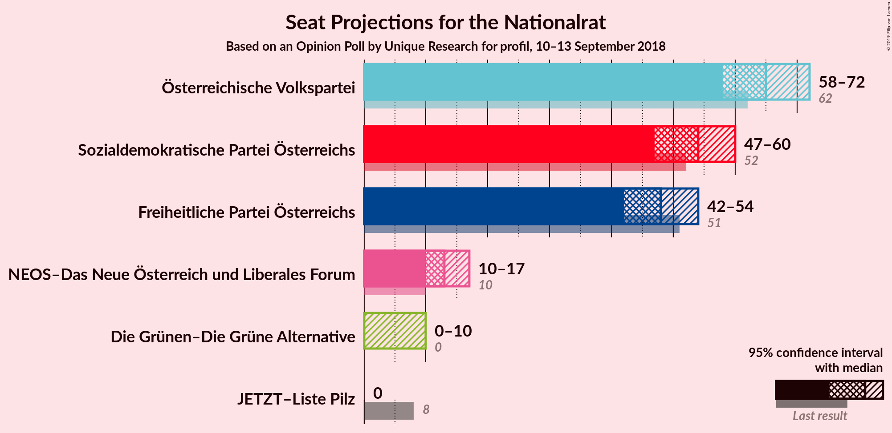
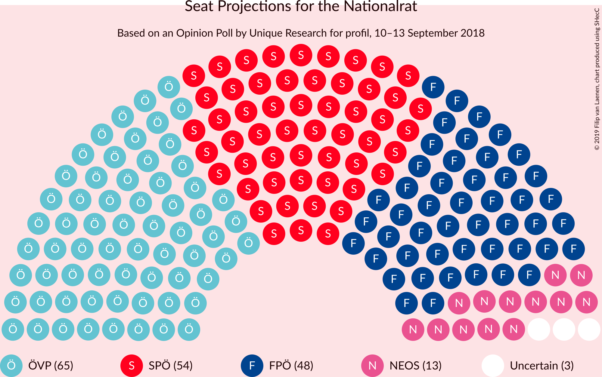
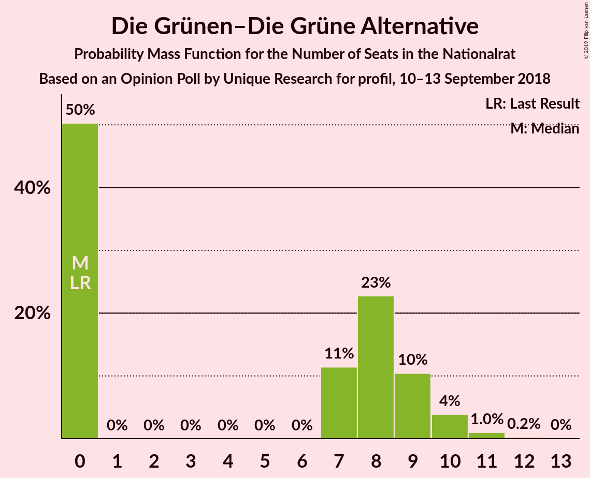
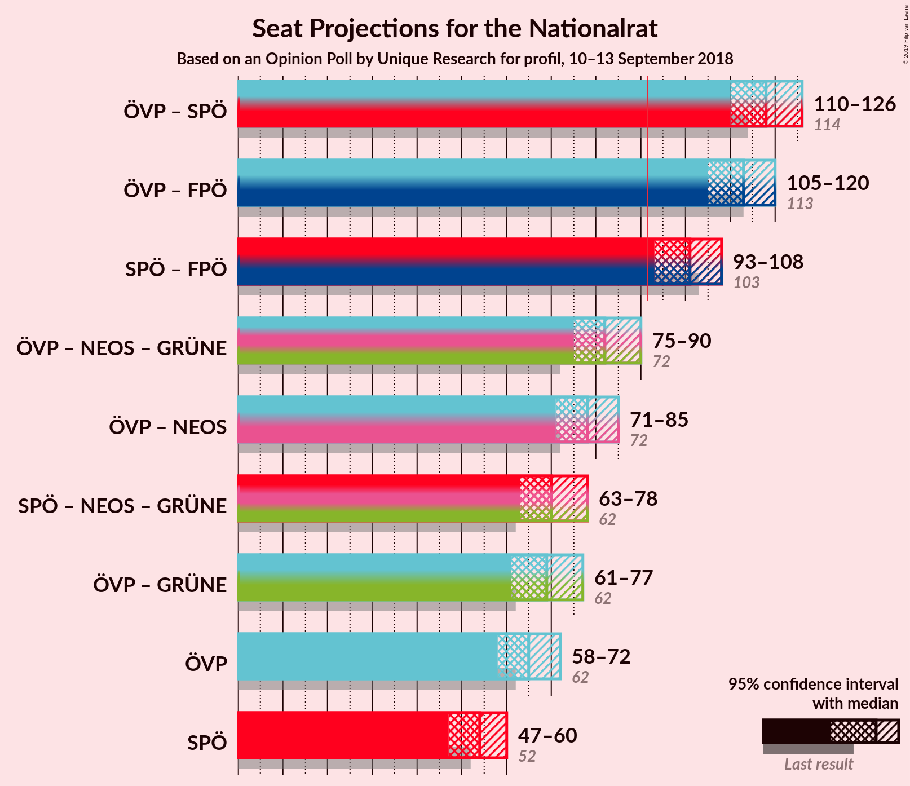
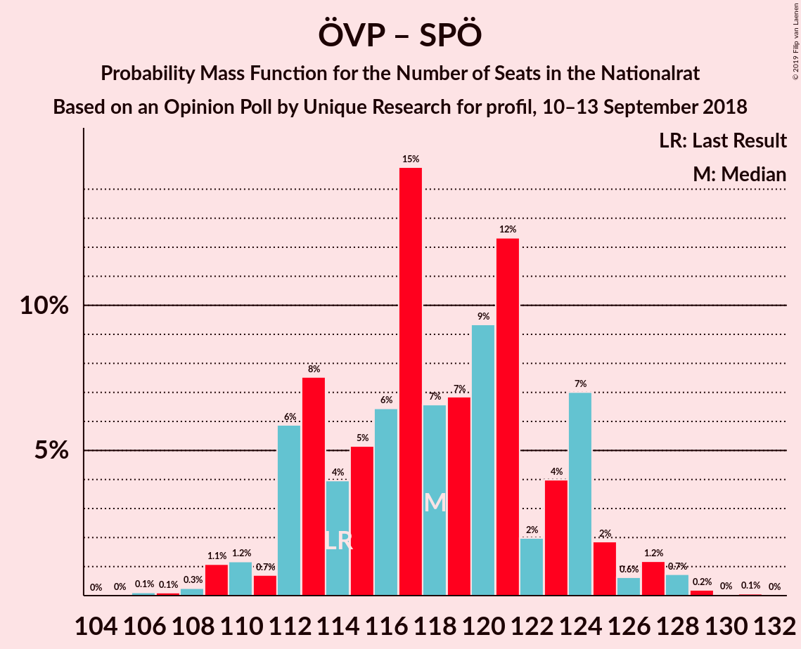
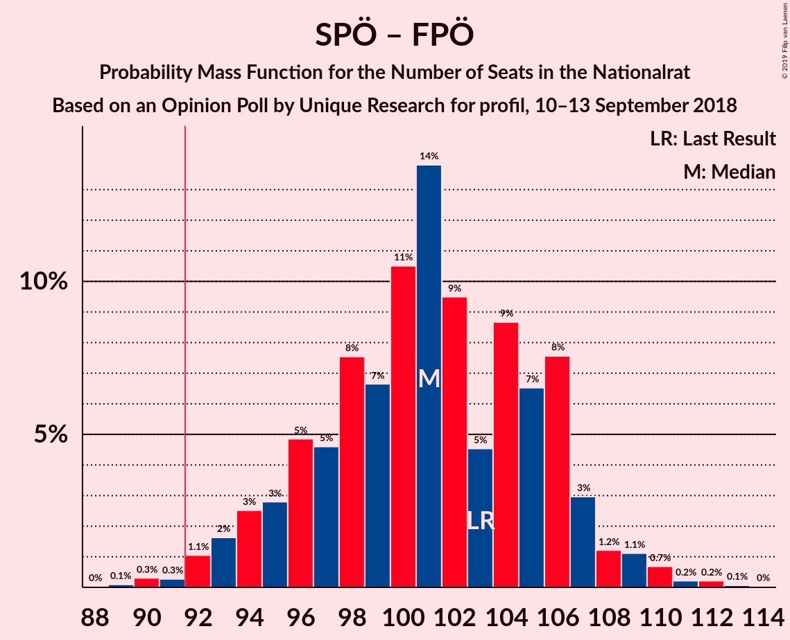
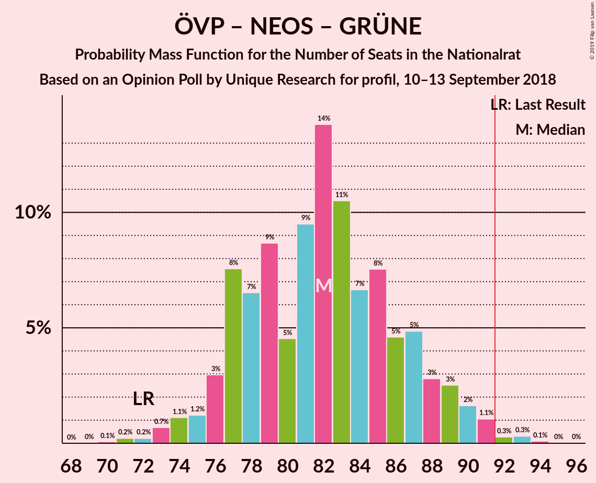
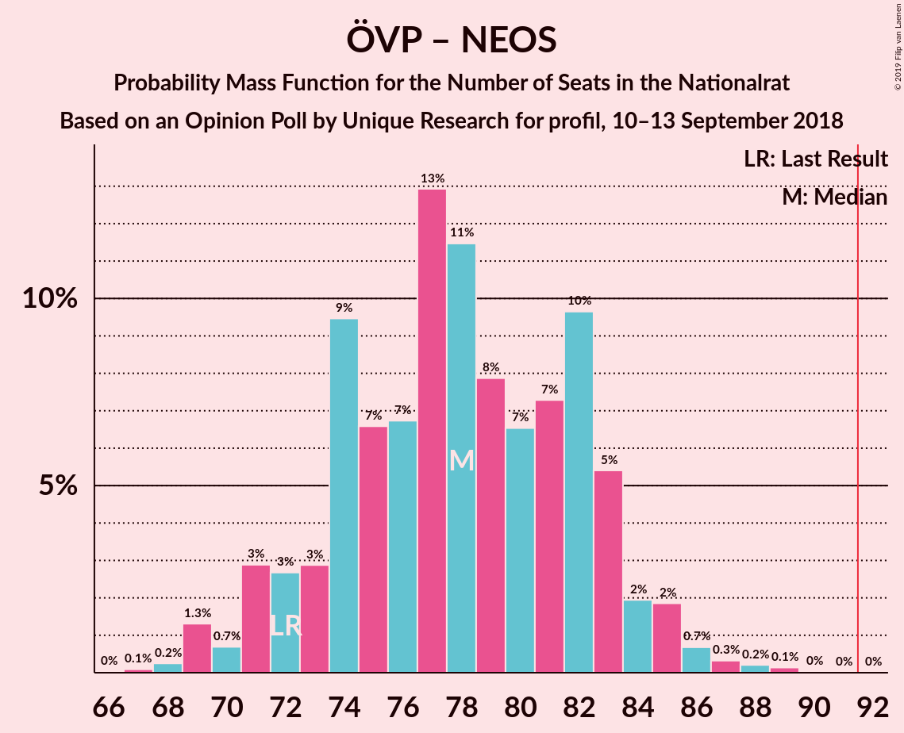
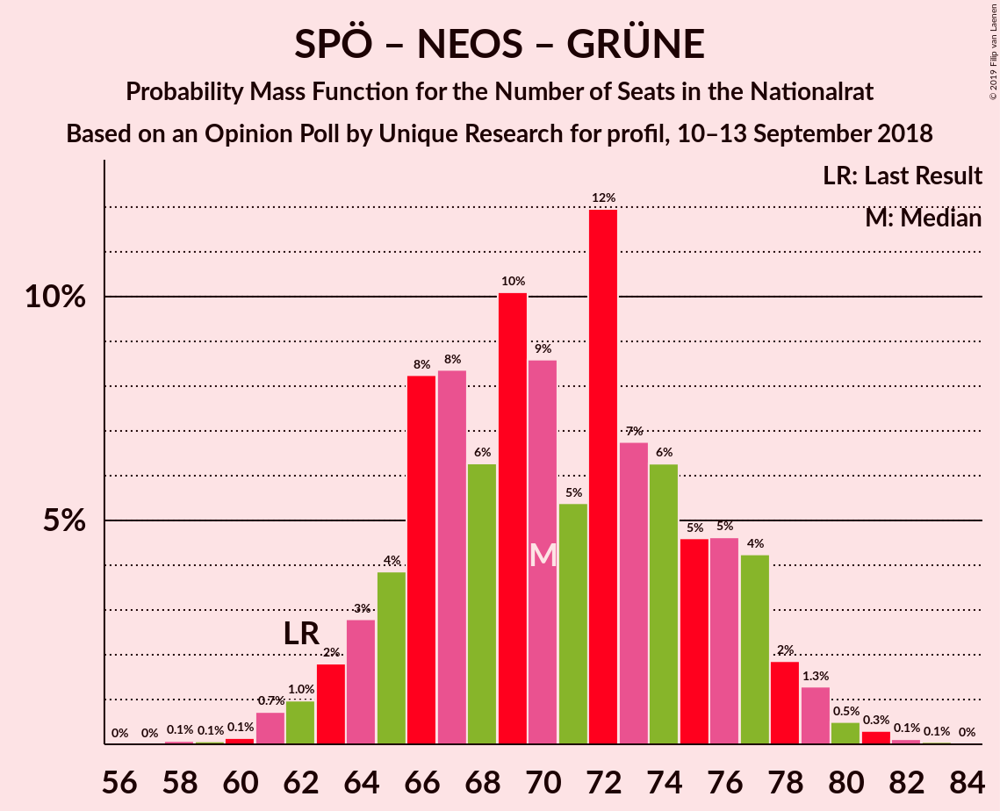
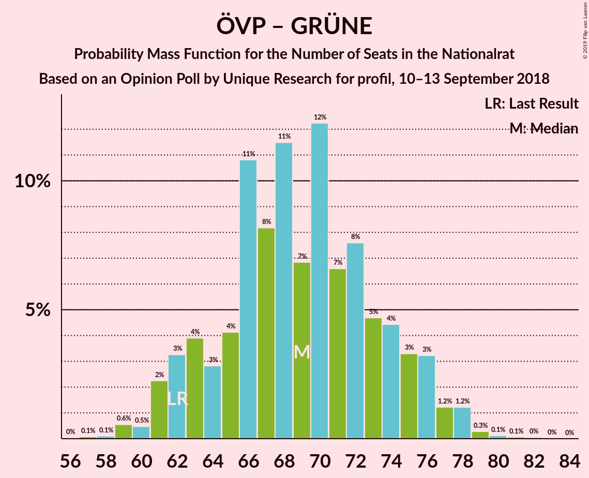

# Opinion Poll by Unique Research for profil, 10–13 September 2018

<a href="#voting-intentions">Voting Intentions</a> | <a href="#seats">Seats</a> | <a href="#coalitions">Coalitions</a> | <a href="#technical-information">Technical Information</a>

## Voting Intentions

### Confidence Intervals

| Party | Last Result | Poll Result | 80% Confidence Interval | 90% Confidence Interval | 95% Confidence Interval | 99% Confidence Interval |
|:-----:|:-----------:|:-----------:|:-----------------------:|:-----------------------:|:-----------------------:|:-----------------------:|
| Österreichische Volkspartei | 31.5% | 34.0% | 31.9–36.2% |31.3–36.8% |30.8–37.4% |29.8–38.4% |
| Sozialdemokratische Partei Österreichs | 26.9% | 28.0% | 26.0–30.1% |25.5–30.7% |25.0–31.2% |24.1–32.3% |
| Freiheitliche Partei Österreichs | 26.0% | 25.0% | 23.1–27.0% |22.6–27.6% |22.1–28.1% |21.2–29.1% |
| NEOS–Das Neue Österreich und Liberales Forum | 5.3% | 7.0% | 6.0–8.3% |5.7–8.7% |5.4–9.0% |5.0–9.6% |
| Die Grünen–Die Grüne Alternative | 3.8% | 4.0% | 3.2–5.0% |3.0–5.3% |2.9–5.6% |2.5–6.1% |
| JETZT–Liste Pilz | 4.4% | 1.0% | 0.7–1.6% |0.6–1.8% |0.5–2.0% |0.4–2.3% |

*Note:* The poll result column reflects the actual value used in the calculations. Published results may vary slightly, and in addition be rounded to fewer digits.

## Seats

### Confidence Intervals

| Party | Last Result | Median | 80% Confidence Interval | 90% Confidence Interval | 95% Confidence Interval | 99% Confidence Interval |
|:-----:|:-----------:|:------:|:-----------------------:|:-----------------------:|:-----------------------:|:-----------------------:|
| <a href="#österreichische-volkspartei">Österreichische Volkspartei</a> | 62 | 65 | 61–69 |59–71 |58–72 |56–74 |
| <a href="#sozialdemokratische-partei-österreichs">Sozialdemokratische Partei Österreichs</a> | 52 | 54 | 49–57 |48–59 |47–60 |46–62 |
| <a href="#freiheitliche-partei-österreichs">Freiheitliche Partei Österreichs</a> | 51 | 48 | 44–52 |43–52 |42–54 |40–56 |
| <a href="#neos–das-neue-österreich-und-liberales-forum">NEOS–Das Neue Österreich und Liberales Forum</a> | 10 | 13 | 11–15 |10–16 |10–17 |9–18 |
| <a href="#die-grünen–die-grüne-alternative">Die Grünen–Die Grüne Alternative</a> | 0 | 0 | 0–9 |0–10 |0–10 |0–11 |
| <a href="#jetzt–liste-pilz">JETZT–Liste Pilz</a> | 8 | 0 | 0 |0 |0 |0 |

### Österreichische Volkspartei

*For a full overview of the results for this party, see the [Österreichische Volkspartei](party-österreichischevolkspartei.html) page.*

| Number of Seats | Probability | Accumulated | Special Marks |
|:---------------:|:-----------:|:-----------:|:-------------:|
| 54 | 0% | 100% |  |
| 55 | 0.1% | 99.9% |  |
| 56 | 0.7% | 99.8% |  |
| 57 | 1.1% | 99.1% |  |
| 58 | 2% | 98% |  |
| 59 | 2% | 96% |  |
| 60 | 3% | 95% |  |
| 61 | 10% | 92% |  |
| 62 | 8% | 81% | Last Result |
| 63 | 12% | 73% |  |
| 64 | 6% | 61% |  |
| 65 | 8% | 55% | Median |
| 66 | 15% | 47% |  |
| 67 | 11% | 32% |  |
| 68 | 10% | 21% |  |
| 69 | 3% | 11% |  |
| 70 | 3% | 8% |  |
| 71 | 3% | 6% |  |
| 72 | 1.2% | 3% |  |
| 73 | 1.3% | 2% |  |
| 74 | 0.4% | 0.6% |  |
| 75 | 0.1% | 0.2% |  |
| 76 | 0.1% | 0.1% |  |
| 77 | 0% | 0.1% |  |
| 78 | 0% | 0% |  |

### Sozialdemokratische Partei Österreichs

*For a full overview of the results for this party, see the [Sozialdemokratische Partei Österreichs](party-sozialdemokratischeparteiösterreichs.html) page.*

| Number of Seats | Probability | Accumulated | Special Marks |
|:---------------:|:-----------:|:-----------:|:-------------:|
| 43 | 0.1% | 100% |  |
| 44 | 0.1% | 99.9% |  |
| 45 | 0.2% | 99.8% |  |
| 46 | 0.7% | 99.6% |  |
| 47 | 2% | 98.8% |  |
| 48 | 5% | 96% |  |
| 49 | 4% | 92% |  |
| 50 | 8% | 88% |  |
| 51 | 7% | 79% |  |
| 52 | 7% | 73% | Last Result |
| 53 | 13% | 65% |  |
| 54 | 21% | 52% | Median |
| 55 | 11% | 32% |  |
| 56 | 7% | 21% |  |
| 57 | 5% | 13% |  |
| 58 | 3% | 9% |  |
| 59 | 2% | 5% |  |
| 60 | 1.3% | 3% |  |
| 61 | 1.0% | 2% |  |
| 62 | 0.4% | 0.7% |  |
| 63 | 0.3% | 0.4% |  |
| 64 | 0% | 0.1% |  |
| 65 | 0% | 0% |  |

### Freiheitliche Partei Österreichs

*For a full overview of the results for this party, see the [Freiheitliche Partei Österreichs](party-freiheitlicheparteiösterreichs.html) page.*

| Number of Seats | Probability | Accumulated | Special Marks |
|:---------------:|:-----------:|:-----------:|:-------------:|
| 38 | 0% | 100% |  |
| 39 | 0.2% | 99.9% |  |
| 40 | 0.5% | 99.8% |  |
| 41 | 2% | 99.3% |  |
| 42 | 3% | 98% |  |
| 43 | 5% | 95% |  |
| 44 | 7% | 90% |  |
| 45 | 6% | 83% |  |
| 46 | 10% | 77% |  |
| 47 | 12% | 67% |  |
| 48 | 16% | 55% | Median |
| 49 | 9% | 38% |  |
| 50 | 9% | 29% |  |
| 51 | 9% | 20% | Last Result |
| 52 | 6% | 11% |  |
| 53 | 2% | 5% |  |
| 54 | 1.4% | 3% |  |
| 55 | 1.0% | 2% |  |
| 56 | 0.6% | 0.8% |  |
| 57 | 0.1% | 0.3% |  |
| 58 | 0.1% | 0.1% |  |
| 59 | 0% | 0% |  |

### NEOS–Das Neue Österreich und Liberales Forum

*For a full overview of the results for this party, see the [NEOS–Das Neue Österreich und Liberales Forum](party-neos–dasneueösterreichundliberalesforum.html) page.*

| Number of Seats | Probability | Accumulated | Special Marks |
|:---------------:|:-----------:|:-----------:|:-------------:|
| 8 | 0.1% | 100% |  |
| 9 | 1.4% | 99.9% |  |
| 10 | 4% | 98% | Last Result |
| 11 | 13% | 94% |  |
| 12 | 19% | 81% |  |
| 13 | 22% | 62% | Median |
| 14 | 18% | 40% |  |
| 15 | 13% | 21% |  |
| 16 | 5% | 8% |  |
| 17 | 2% | 3% |  |
| 18 | 0.8% | 1.0% |  |
| 19 | 0.2% | 0.2% |  |
| 20 | 0% | 0.1% |  |
| 21 | 0% | 0% |  |

### Die Grünen–Die Grüne Alternative

*For a full overview of the results for this party, see the [Die Grünen–Die Grüne Alternative](party-diegrünen–diegrünealternative.html) page.*

| Number of Seats | Probability | Accumulated | Special Marks |
|:---------------:|:-----------:|:-----------:|:-------------:|
| 0 | 50% | 100% | Last Result, Median |
| 1 | 0% | 50% |  |
| 2 | 0% | 50% |  |
| 3 | 0% | 50% |  |
| 4 | 0% | 50% |  |
| 5 | 0% | 50% |  |
| 6 | 0% | 50% |  |
| 7 | 11% | 50% |  |
| 8 | 23% | 38% |  |
| 9 | 10% | 16% |  |
| 10 | 4% | 5% |  |
| 11 | 1.0% | 1.3% |  |
| 12 | 0.2% | 0.3% |  |
| 13 | 0% | 0% |  |

### JETZT–Liste Pilz

*For a full overview of the results for this party, see the [JETZT–Liste Pilz](party-jetzt–listepilz.html) page.*

| Number of Seats | Probability | Accumulated | Special Marks |
|:---------------:|:-----------:|:-----------:|:-------------:|
| 0 | 100% | 100% | Median |
| 1 | 0% | 0% |  |
| 2 | 0% | 0% |  |
| 3 | 0% | 0% |  |
| 4 | 0% | 0% |  |
| 5 | 0% | 0% |  |
| 6 | 0% | 0% |  |
| 7 | 0% | 0% |  |
| 8 | 0% | 0% | Last Result |

## Coalitions

### Confidence Intervals

| Coalition | Last Result | Median | Majority? | 80% Confidence Interval | 90% Confidence Interval | 95% Confidence Interval | 99% Confidence Interval |
|:---------:|:-----------:|:------:|:---------:|:-----------------------:|:-----------------------:|:-----------------------:|:-----------------------:|
| Österreichische Volkspartei – Sozialdemokratische Partei Österreichs | 114 | 118 | 100% | 113–124 | 112–124 | 110–126 | 108–128 |
| Österreichische Volkspartei – Freiheitliche Partei Österreichs | 113 | 113 | 100% | 107–118 | 106–119 | 105–120 | 103–122 |
| Sozialdemokratische Partei Österreichs – Freiheitliche Partei Österreichs | 103 | 101 | 99.3% | 96–106 | 94–107 | 93–108 | 91–111 |
| Österreichische Volkspartei – NEOS–Das Neue Österreich und Liberales Forum – Die Grünen–Die Grüne Alternative | 72 | 82 | 0.7% | 77–87 | 76–89 | 75–90 | 72–92 |
| Österreichische Volkspartei – NEOS–Das Neue Österreich und Liberales Forum | 72 | 78 | 0% | 73–83 | 71–84 | 71–85 | 69–87 |
| Sozialdemokratische Partei Österreichs – NEOS–Das Neue Österreich und Liberales Forum – Die Grünen–Die Grüne Alternative | 62 | 70 | 0% | 65–76 | 64–77 | 63–78 | 61–80 |
| Österreichische Volkspartei – Die Grünen–Die Grüne Alternative | 62 | 69 | 0% | 63–74 | 62–76 | 61–77 | 59–79 |
| Österreichische Volkspartei | 62 | 65 | 0% | 61–69 | 59–71 | 58–72 | 56–74 |
| Sozialdemokratische Partei Österreichs | 52 | 54 | 0% | 49–57 | 48–59 | 47–60 | 46–62 |

### Österreichische Volkspartei – Sozialdemokratische Partei Österreichs

| Number of Seats | Probability | Accumulated | Special Marks |
|:---------------:|:-----------:|:-----------:|:-------------:|
| 106 | 0.1% | 100% |  |
| 107 | 0.1% | 99.9% |  |
| 108 | 0.3% | 99.7% |  |
| 109 | 1.1% | 99.5% |  |
| 110 | 1.2% | 98% |  |
| 111 | 0.7% | 97% |  |
| 112 | 6% | 97% |  |
| 113 | 8% | 91% |  |
| 114 | 4% | 83% | Last Result |
| 115 | 5% | 79% |  |
| 116 | 6% | 74% |  |
| 117 | 15% | 68% |  |
| 118 | 7% | 53% |  |
| 119 | 7% | 46% | Median |
| 120 | 9% | 39% |  |
| 121 | 12% | 30% |  |
| 122 | 2% | 18% |  |
| 123 | 4% | 16% |  |
| 124 | 7% | 12% |  |
| 125 | 2% | 5% |  |
| 126 | 0.6% | 3% |  |
| 127 | 1.2% | 2% |  |
| 128 | 0.7% | 1.1% |  |
| 129 | 0.2% | 0.3% |  |
| 130 | 0% | 0.1% |  |
| 131 | 0.1% | 0.1% |  |
| 132 | 0% | 0% |  |

### Österreichische Volkspartei – Freiheitliche Partei Österreichs

| Number of Seats | Probability | Accumulated | Special Marks |
|:---------------:|:-----------:|:-----------:|:-------------:|
| 100 | 0.1% | 100% |  |
| 101 | 0.1% | 99.9% |  |
| 102 | 0.3% | 99.8% |  |
| 103 | 0.5% | 99.5% |  |
| 104 | 1.3% | 99.0% |  |
| 105 | 2% | 98% |  |
| 106 | 4% | 96% |  |
| 107 | 5% | 92% |  |
| 108 | 5% | 87% |  |
| 109 | 6% | 82% |  |
| 110 | 7% | 76% |  |
| 111 | 12% | 69% |  |
| 112 | 5% | 57% |  |
| 113 | 9% | 52% | Last Result, Median |
| 114 | 10% | 43% |  |
| 115 | 6% | 33% |  |
| 116 | 8% | 27% |  |
| 117 | 8% | 19% |  |
| 118 | 4% | 10% |  |
| 119 | 3% | 7% |  |
| 120 | 2% | 4% |  |
| 121 | 1.0% | 2% |  |
| 122 | 0.7% | 1.0% |  |
| 123 | 0.1% | 0.3% |  |
| 124 | 0.1% | 0.2% |  |
| 125 | 0.1% | 0.1% |  |
| 126 | 0% | 0% |  |

### Sozialdemokratische Partei Österreichs – Freiheitliche Partei Österreichs

| Number of Seats | Probability | Accumulated | Special Marks |
|:---------------:|:-----------:|:-----------:|:-------------:|
| 89 | 0.1% | 100% |  |
| 90 | 0.3% | 99.9% |  |
| 91 | 0.3% | 99.5% |  |
| 92 | 1.1% | 99.3% | Majority |
| 93 | 2% | 98% |  |
| 94 | 3% | 97% |  |
| 95 | 3% | 94% |  |
| 96 | 5% | 91% |  |
| 97 | 5% | 86% |  |
| 98 | 8% | 82% |  |
| 99 | 7% | 74% |  |
| 100 | 11% | 68% |  |
| 101 | 14% | 57% |  |
| 102 | 9% | 43% | Median |
| 103 | 5% | 34% | Last Result |
| 104 | 9% | 29% |  |
| 105 | 7% | 21% |  |
| 106 | 8% | 14% |  |
| 107 | 3% | 7% |  |
| 108 | 1.2% | 4% |  |
| 109 | 1.1% | 2% |  |
| 110 | 0.7% | 1.2% |  |
| 111 | 0.2% | 0.5% |  |
| 112 | 0.2% | 0.3% |  |
| 113 | 0.1% | 0.1% |  |
| 114 | 0% | 0% |  |

### Österreichische Volkspartei – NEOS–Das Neue Österreich und Liberales Forum – Die Grünen–Die Grüne Alternative

| Number of Seats | Probability | Accumulated | Special Marks |
|:---------------:|:-----------:|:-----------:|:-------------:|
| 70 | 0.1% | 100% |  |
| 71 | 0.2% | 99.9% |  |
| 72 | 0.2% | 99.7% | Last Result |
| 73 | 0.7% | 99.5% |  |
| 74 | 1.1% | 98.8% |  |
| 75 | 1.2% | 98% |  |
| 76 | 3% | 96% |  |
| 77 | 8% | 93% |  |
| 78 | 7% | 86% | Median |
| 79 | 9% | 79% |  |
| 80 | 5% | 71% |  |
| 81 | 9% | 66% |  |
| 82 | 14% | 57% |  |
| 83 | 11% | 43% |  |
| 84 | 7% | 32% |  |
| 85 | 8% | 26% |  |
| 86 | 5% | 18% |  |
| 87 | 5% | 14% |  |
| 88 | 3% | 9% |  |
| 89 | 3% | 6% |  |
| 90 | 2% | 3% |  |
| 91 | 1.1% | 2% |  |
| 92 | 0.3% | 0.7% | Majority |
| 93 | 0.3% | 0.5% |  |
| 94 | 0.1% | 0.1% |  |
| 95 | 0% | 0% |  |

### Österreichische Volkspartei – NEOS–Das Neue Österreich und Liberales Forum

| Number of Seats | Probability | Accumulated | Special Marks |
|:---------------:|:-----------:|:-----------:|:-------------:|
| 66 | 0% | 100% |  |
| 67 | 0.1% | 99.9% |  |
| 68 | 0.2% | 99.9% |  |
| 69 | 1.3% | 99.6% |  |
| 70 | 0.7% | 98% |  |
| 71 | 3% | 98% |  |
| 72 | 3% | 95% | Last Result |
| 73 | 3% | 92% |  |
| 74 | 9% | 89% |  |
| 75 | 7% | 80% |  |
| 76 | 7% | 73% |  |
| 77 | 13% | 66% |  |
| 78 | 11% | 53% | Median |
| 79 | 8% | 42% |  |
| 80 | 7% | 34% |  |
| 81 | 7% | 28% |  |
| 82 | 10% | 20% |  |
| 83 | 5% | 11% |  |
| 84 | 2% | 5% |  |
| 85 | 2% | 3% |  |
| 86 | 0.7% | 1.4% |  |
| 87 | 0.3% | 0.7% |  |
| 88 | 0.2% | 0.4% |  |
| 89 | 0.1% | 0.2% |  |
| 90 | 0% | 0.1% |  |
| 91 | 0% | 0% |  |

### Sozialdemokratische Partei Österreichs – NEOS–Das Neue Österreich und Liberales Forum – Die Grünen–Die Grüne Alternative

| Number of Seats | Probability | Accumulated | Special Marks |
|:---------------:|:-----------:|:-----------:|:-------------:|
| 58 | 0.1% | 100% |  |
| 59 | 0.1% | 99.9% |  |
| 60 | 0.1% | 99.8% |  |
| 61 | 0.7% | 99.7% |  |
| 62 | 1.0% | 99.0% | Last Result |
| 63 | 2% | 98% |  |
| 64 | 3% | 96% |  |
| 65 | 4% | 93% |  |
| 66 | 8% | 90% |  |
| 67 | 8% | 81% | Median |
| 68 | 6% | 73% |  |
| 69 | 10% | 67% |  |
| 70 | 9% | 57% |  |
| 71 | 5% | 48% |  |
| 72 | 12% | 43% |  |
| 73 | 7% | 31% |  |
| 74 | 6% | 24% |  |
| 75 | 5% | 18% |  |
| 76 | 5% | 13% |  |
| 77 | 4% | 8% |  |
| 78 | 2% | 4% |  |
| 79 | 1.3% | 2% |  |
| 80 | 0.5% | 1.0% |  |
| 81 | 0.3% | 0.5% |  |
| 82 | 0.1% | 0.2% |  |
| 83 | 0.1% | 0.1% |  |
| 84 | 0% | 0% |  |

### Österreichische Volkspartei – Die Grünen–Die Grüne Alternative

| Number of Seats | Probability | Accumulated | Special Marks |
|:---------------:|:-----------:|:-----------:|:-------------:|
| 57 | 0.1% | 100% |  |
| 58 | 0.1% | 99.9% |  |
| 59 | 0.6% | 99.8% |  |
| 60 | 0.5% | 99.2% |  |
| 61 | 2% | 98.7% |  |
| 62 | 3% | 96% | Last Result |
| 63 | 4% | 93% |  |
| 64 | 3% | 89% |  |
| 65 | 4% | 87% | Median |
| 66 | 11% | 82% |  |
| 67 | 8% | 72% |  |
| 68 | 11% | 63% |  |
| 69 | 7% | 52% |  |
| 70 | 12% | 45% |  |
| 71 | 7% | 33% |  |
| 72 | 8% | 26% |  |
| 73 | 5% | 19% |  |
| 74 | 4% | 14% |  |
| 75 | 3% | 10% |  |
| 76 | 3% | 6% |  |
| 77 | 1.2% | 3% |  |
| 78 | 1.2% | 2% |  |
| 79 | 0.3% | 0.5% |  |
| 80 | 0.1% | 0.3% |  |
| 81 | 0.1% | 0.1% |  |
| 82 | 0% | 0.1% |  |
| 83 | 0% | 0% |  |

### Österreichische Volkspartei

| Number of Seats | Probability | Accumulated | Special Marks |
|:---------------:|:-----------:|:-----------:|:-------------:|
| 54 | 0% | 100% |  |
| 55 | 0.1% | 99.9% |  |
| 56 | 0.7% | 99.8% |  |
| 57 | 1.1% | 99.1% |  |
| 58 | 2% | 98% |  |
| 59 | 2% | 96% |  |
| 60 | 3% | 95% |  |
| 61 | 10% | 92% |  |
| 62 | 8% | 81% | Last Result |
| 63 | 12% | 73% |  |
| 64 | 6% | 61% |  |
| 65 | 8% | 55% | Median |
| 66 | 15% | 47% |  |
| 67 | 11% | 32% |  |
| 68 | 10% | 21% |  |
| 69 | 3% | 11% |  |
| 70 | 3% | 8% |  |
| 71 | 3% | 6% |  |
| 72 | 1.2% | 3% |  |
| 73 | 1.3% | 2% |  |
| 74 | 0.4% | 0.6% |  |
| 75 | 0.1% | 0.2% |  |
| 76 | 0.1% | 0.1% |  |
| 77 | 0% | 0.1% |  |
| 78 | 0% | 0% |  |

### Sozialdemokratische Partei Österreichs

| Number of Seats | Probability | Accumulated | Special Marks |
|:---------------:|:-----------:|:-----------:|:-------------:|
| 43 | 0.1% | 100% |  |
| 44 | 0.1% | 99.9% |  |
| 45 | 0.2% | 99.8% |  |
| 46 | 0.7% | 99.6% |  |
| 47 | 2% | 98.8% |  |
| 48 | 5% | 96% |  |
| 49 | 4% | 92% |  |
| 50 | 8% | 88% |  |
| 51 | 7% | 79% |  |
| 52 | 7% | 73% | Last Result |
| 53 | 13% | 65% |  |
| 54 | 21% | 52% | Median |
| 55 | 11% | 32% |  |
| 56 | 7% | 21% |  |
| 57 | 5% | 13% |  |
| 58 | 3% | 9% |  |
| 59 | 2% | 5% |  |
| 60 | 1.3% | 3% |  |
| 61 | 1.0% | 2% |  |
| 62 | 0.4% | 0.7% |  |
| 63 | 0.3% | 0.4% |  |
| 64 | 0% | 0.1% |  |
| 65 | 0% | 0% |  |

## Technical Information

### Opinion Poll

+ **Polling firm:** Unique Research
+ **Commissioner(s):** profil
+ **Fieldwork period:** 10–13 September 2018

### Calculations

+ **Sample size:** 800
+ **Simulations done:** 131,072
+ **Error estimate:** 1.78%

