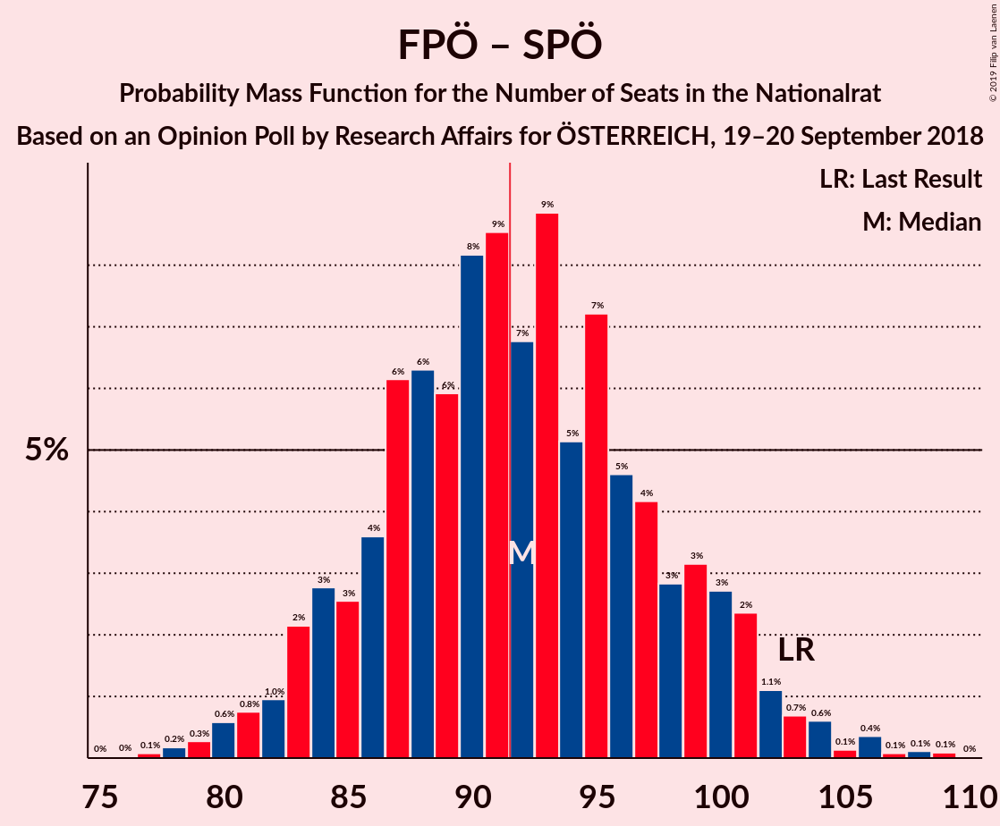

# Opinion Poll by Research Affairs for ÖSTERREICH, 19–20 September 2018

<a href="#voting-intentions">Voting Intentions</a> | <a href="#seats">Seats</a> | <a href="#coalitions">Coalitions</a> | <a href="#technical-information">Technical Information</a>

## Voting Intentions

### Confidence Intervals

| Party | Last Result | Poll Result | 80% Confidence Interval | 90% Confidence Interval | 95% Confidence Interval | 99% Confidence Interval |
|:-----:|:-----------:|:-----------:|:-----------------------:|:-----------------------:|:-----------------------:|:-----------------------:|
| Österreichische Volkspartei | 31.5% | 34.0% | 31.4–36.8% |30.6–37.6% |30.0–38.2% |28.8–39.6% |
| Sozialdemokratische Partei Österreichs | 26.9% | 23.9% | 21.6–26.5% |21.0–27.2% |20.4–27.8% |19.3–29.1% |
| Freiheitliche Partei Österreichs | 26.0% | 23.9% | 21.6–26.5% |21.0–27.2% |20.4–27.8% |19.3–29.1% |
| NEOS–Das Neue Österreich und Liberales Forum | 5.3% | 7.9% | 6.6–9.7% |6.2–10.2% |5.9–10.6% |5.3–11.5% |
| Die Grünen–Die Grüne Alternative | 3.8% | 4.0% | 3.0–5.3% |2.8–5.7% |2.6–6.0% |2.2–6.8% |
| JETZT–Liste Pilz | 4.4% | 2.0% | 1.4–3.0% |1.2–3.3% |1.1–3.6% |0.9–4.2% |

*Note:* The poll result column reflects the actual value used in the calculations. Published results may vary slightly, and in addition be rounded to fewer digits.

## Seats

### Confidence Intervals

| Party | Last Result | Median | 80% Confidence Interval | 90% Confidence Interval | 95% Confidence Interval | 99% Confidence Interval |
|:-----:|:-----------:|:------:|:-----------------------:|:-----------------------:|:-----------------------:|:-----------------------:|
| <a href="#österreichische-volkspartei">Österreichische Volkspartei</a> | 62 | 66 | 61–67 |61–70 |61–70 |61–70 |
| <a href="#sozialdemokratische-partei-österreichs">Sozialdemokratische Partei Österreichs</a> | 52 | 46 | 45–51 |41–52 |39–52 |35–52 |
| <a href="#freiheitliche-partei-österreichs">Freiheitliche Partei Österreichs</a> | 51 | 45 | 41–45 |40–47 |39–47 |38–49 |
| <a href="#neos–das-neue-österreich-und-liberales-forum">NEOS–Das Neue Österreich und Liberales Forum</a> | 10 | 17 | 15–18 |15–18 |14–18 |14–19 |
| <a href="#die-grünen–die-grüne-alternative">Die Grünen–Die Grüne Alternative</a> | 0 | 0 | 0–8 |0–11 |0–11 |0–12 |
| <a href="#jetzt–liste-pilz">JETZT–Liste Pilz</a> | 8 | 0 | 0 |0 |0 |0 |

### Österreichische Volkspartei

*For a full overview of the results for this party, see the [Österreichische Volkspartei](party-österreichischevolkspartei.html) page.*

| Number of Seats | Probability | Accumulated | Special Marks |
|:---------------:|:-----------:|:-----------:|:-------------:|
| 61 | 29% | 100% |  |
| 62 | 2% | 71% | Last Result |
| 63 | 3% | 69% |  |
| 64 | 7% | 67% |  |
| 65 | 1.5% | 59% |  |
| 66 | 25% | 58% | Median |
| 67 | 24% | 33% |  |
| 68 | 0.6% | 9% |  |
| 69 | 1.1% | 8% |  |
| 70 | 7% | 7% |  |
| 71 | 0% | 0% |  |

### Sozialdemokratische Partei Österreichs

*For a full overview of the results for this party, see the [Sozialdemokratische Partei Österreichs](party-sozialdemokratischeparteiösterreichs.html) page.*

| Number of Seats | Probability | Accumulated | Special Marks |
|:---------------:|:-----------:|:-----------:|:-------------:|
| 35 | 0.8% | 100% |  |
| 36 | 0.6% | 99.2% |  |
| 37 | 1.0% | 98.6% |  |
| 38 | 0% | 98% |  |
| 39 | 0.2% | 98% |  |
| 40 | 0.5% | 97% |  |
| 41 | 3% | 97% |  |
| 42 | 0% | 94% |  |
| 43 | 1.0% | 94% |  |
| 44 | 0.1% | 93% |  |
| 45 | 23% | 93% |  |
| 46 | 24% | 70% | Median |
| 47 | 3% | 46% |  |
| 48 | 7% | 43% |  |
| 49 | 1.3% | 37% |  |
| 50 | 13% | 35% |  |
| 51 | 16% | 22% |  |
| 52 | 6% | 6% | Last Result |
| 53 | 0% | 0.4% |  |
| 54 | 0% | 0.4% |  |
| 55 | 0.2% | 0.4% |  |
| 56 | 0% | 0.2% |  |
| 57 | 0% | 0.2% |  |
| 58 | 0.2% | 0.2% |  |
| 59 | 0% | 0% |  |

### Freiheitliche Partei Österreichs

*For a full overview of the results for this party, see the [Freiheitliche Partei Österreichs](party-freiheitlicheparteiösterreichs.html) page.*

| Number of Seats | Probability | Accumulated | Special Marks |
|:---------------:|:-----------:|:-----------:|:-------------:|
| 37 | 0% | 100% |  |
| 38 | 1.0% | 99.9% |  |
| 39 | 2% | 98.9% |  |
| 40 | 3% | 97% |  |
| 41 | 29% | 94% |  |
| 42 | 0.2% | 65% |  |
| 43 | 7% | 65% |  |
| 44 | 5% | 58% |  |
| 45 | 44% | 53% | Median |
| 46 | 0% | 9% |  |
| 47 | 8% | 9% |  |
| 48 | 0.9% | 2% |  |
| 49 | 0.6% | 0.9% |  |
| 50 | 0.3% | 0.3% |  |
| 51 | 0% | 0% | Last Result |

### NEOS–Das Neue Österreich und Liberales Forum

*For a full overview of the results for this party, see the [NEOS–Das Neue Österreich und Liberales Forum](party-neos–dasneueösterreichundliberalesforum.html) page.*

| Number of Seats | Probability | Accumulated | Special Marks |
|:---------------:|:-----------:|:-----------:|:-------------:|
| 10 | 0% | 100% | Last Result |
| 11 | 0% | 100% |  |
| 12 | 0% | 100% |  |
| 13 | 0% | 100% |  |
| 14 | 3% | 100% |  |
| 15 | 29% | 97% |  |
| 16 | 14% | 67% |  |
| 17 | 43% | 53% | Median |
| 18 | 9% | 10% |  |
| 19 | 0.9% | 0.9% |  |
| 20 | 0% | 0% |  |

### Die Grünen–Die Grüne Alternative

*For a full overview of the results for this party, see the [Die Grünen–Die Grüne Alternative](party-diegrünen–diegrünealternative.html) page.*

| Number of Seats | Probability | Accumulated | Special Marks |
|:---------------:|:-----------:|:-----------:|:-------------:|
| 0 | 55% | 100% | Last Result, Median |
| 1 | 0% | 45% |  |
| 2 | 0% | 45% |  |
| 3 | 0% | 45% |  |
| 4 | 0% | 45% |  |
| 5 | 0% | 45% |  |
| 6 | 0% | 45% |  |
| 7 | 14% | 45% |  |
| 8 | 24% | 31% |  |
| 9 | 1.0% | 7% |  |
| 10 | 0.8% | 6% |  |
| 11 | 4% | 5% |  |
| 12 | 1.0% | 1.1% |  |
| 13 | 0% | 0% |  |

### JETZT–Liste Pilz

*For a full overview of the results for this party, see the [JETZT–Liste Pilz](party-jetzt–listepilz.html) page.*

| Number of Seats | Probability | Accumulated | Special Marks |
|:---------------:|:-----------:|:-----------:|:-------------:|
| 0 | 99.8% | 100% | Median |
| 1 | 0% | 0.2% |  |
| 2 | 0% | 0.2% |  |
| 3 | 0% | 0.2% |  |
| 4 | 0% | 0.2% |  |
| 5 | 0% | 0.2% |  |
| 6 | 0% | 0.2% |  |
| 7 | 0.1% | 0.2% |  |
| 8 | 0% | 0.1% | Last Result |
| 9 | 0% | 0% |  |

## Coalitions

### Confidence Intervals

| Coalition | Last Result | Median | Majority? | 80% Confidence Interval | 90% Confidence Interval | 95% Confidence Interval | 99% Confidence Interval |
|:---------:|:-----------:|:------:|:---------:|:-----------------------:|:-----------------------:|:-----------------------:|:-----------------------:|
| Österreichische Volkspartei – Sozialdemokratische Partei Österreichs | 114 | 112 | 100% | 110–116 | 106–118 | 104–118 | 102–118 |
| Österreichische Volkspartei – Freiheitliche Partei Österreichs | 113 | 111 | 100% | 102–112 | 102–117 | 101–117 | 100–118 |
| Freiheitliche Partei Österreichs – Sozialdemokratische Partei Österreichs | 103 | 91 | 29% | 88–95 | 86–95 | 84–95 | 80–95 |
| Österreichische Volkspartei | 62 | 66 | 0% | 61–67 | 61–70 | 61–70 | 61–70 |
| Sozialdemokratische Partei Österreichs | 52 | 46 | 0% | 45–51 | 41–52 | 39–52 | 35–52 |

### Österreichische Volkspartei – Sozialdemokratische Partei Österreichs

| Number of Seats | Probability | Accumulated | Special Marks |
|:---------------:|:-----------:|:-----------:|:-------------:|
| 102 | 1.5% | 100% |  |
| 103 | 0.2% | 98% |  |
| 104 | 1.0% | 98% |  |
| 105 | 2% | 97% |  |
| 106 | 0.3% | 95% |  |
| 107 | 0.8% | 95% |  |
| 108 | 0.6% | 94% |  |
| 109 | 2% | 94% |  |
| 110 | 2% | 92% |  |
| 111 | 36% | 89% |  |
| 112 | 16% | 54% | Median |
| 113 | 23% | 38% |  |
| 114 | 0.5% | 14% | Last Result |
| 115 | 1.2% | 14% |  |
| 116 | 5% | 13% |  |
| 117 | 0% | 7% |  |
| 118 | 7% | 7% |  |
| 119 | 0.1% | 0.3% |  |
| 120 | 0% | 0.2% |  |
| 121 | 0% | 0.2% |  |
| 122 | 0% | 0.2% |  |
| 123 | 0% | 0.2% |  |
| 124 | 0% | 0.2% |  |
| 125 | 0.2% | 0.2% |  |
| 126 | 0% | 0% |  |

### Österreichische Volkspartei – Freiheitliche Partei Österreichs

| Number of Seats | Probability | Accumulated | Special Marks |
|:---------------:|:-----------:|:-----------:|:-------------:|
| 97 | 0% | 100% |  |
| 98 | 0% | 99.9% |  |
| 99 | 0% | 99.9% |  |
| 100 | 1.0% | 99.9% |  |
| 101 | 3% | 99.0% |  |
| 102 | 28% | 96% |  |
| 103 | 0.4% | 68% |  |
| 104 | 0.1% | 68% |  |
| 105 | 0% | 67% |  |
| 106 | 0.4% | 67% |  |
| 107 | 7% | 67% |  |
| 108 | 2% | 60% |  |
| 109 | 2% | 57% |  |
| 110 | 5% | 56% |  |
| 111 | 17% | 51% | Median |
| 112 | 24% | 34% |  |
| 113 | 1.1% | 10% | Last Result |
| 114 | 0% | 9% |  |
| 115 | 0.8% | 9% |  |
| 116 | 0% | 8% |  |
| 117 | 7% | 8% |  |
| 118 | 0.6% | 0.9% |  |
| 119 | 0.3% | 0.3% |  |
| 120 | 0% | 0% |  |

### Freiheitliche Partei Österreichs – Sozialdemokratische Partei Österreichs

| Number of Seats | Probability | Accumulated | Special Marks |
|:---------------:|:-----------:|:-----------:|:-------------:|
| 79 | 0% | 100% |  |
| 80 | 0.7% | 99.9% |  |
| 81 | 0.1% | 99.3% |  |
| 82 | 0.8% | 99.2% |  |
| 83 | 0.8% | 98% |  |
| 84 | 0.2% | 98% |  |
| 85 | 2% | 97% |  |
| 86 | 4% | 95% |  |
| 87 | 0.5% | 91% |  |
| 88 | 0.7% | 90% |  |
| 89 | 5% | 90% |  |
| 90 | 22% | 85% |  |
| 91 | 34% | 63% | Median |
| 92 | 16% | 29% | Majority |
| 93 | 0.4% | 13% |  |
| 94 | 0% | 13% |  |
| 95 | 12% | 13% |  |
| 96 | 0% | 0.2% |  |
| 97 | 0% | 0.2% |  |
| 98 | 0% | 0.2% |  |
| 99 | 0% | 0.2% |  |
| 100 | 0.2% | 0.2% |  |
| 101 | 0% | 0% |  |
| 102 | 0% | 0% |  |
| 103 | 0% | 0% | Last Result |

### Österreichische Volkspartei

| Number of Seats | Probability | Accumulated | Special Marks |
|:---------------:|:-----------:|:-----------:|:-------------:|
| 61 | 29% | 100% |  |
| 62 | 2% | 71% | Last Result |
| 63 | 3% | 69% |  |
| 64 | 7% | 67% |  |
| 65 | 1.5% | 59% |  |
| 66 | 25% | 58% | Median |
| 67 | 24% | 33% |  |
| 68 | 0.6% | 9% |  |
| 69 | 1.1% | 8% |  |
| 70 | 7% | 7% |  |
| 71 | 0% | 0% |  |

### Sozialdemokratische Partei Österreichs

| Number of Seats | Probability | Accumulated | Special Marks |
|:---------------:|:-----------:|:-----------:|:-------------:|
| 35 | 0.8% | 100% |  |
| 36 | 0.6% | 99.2% |  |
| 37 | 1.0% | 98.6% |  |
| 38 | 0% | 98% |  |
| 39 | 0.2% | 98% |  |
| 40 | 0.5% | 97% |  |
| 41 | 3% | 97% |  |
| 42 | 0% | 94% |  |
| 43 | 1.0% | 94% |  |
| 44 | 0.1% | 93% |  |
| 45 | 23% | 93% |  |
| 46 | 24% | 70% | Median |
| 47 | 3% | 46% |  |
| 48 | 7% | 43% |  |
| 49 | 1.3% | 37% |  |
| 50 | 13% | 35% |  |
| 51 | 16% | 22% |  |
| 52 | 6% | 6% | Last Result |
| 53 | 0% | 0.4% |  |
| 54 | 0% | 0.4% |  |
| 55 | 0.2% | 0.4% |  |
| 56 | 0% | 0.2% |  |
| 57 | 0% | 0.2% |  |
| 58 | 0.2% | 0.2% |  |
| 59 | 0% | 0% |  |

## Technical Information

### Opinion Poll

+ **Polling firm:** Research Affairs
+ **Commissioner(s):** ÖSTERREICH
+ **Fieldwork period:** 19–20 September 2018

### Calculations

+ **Sample size:** 506
+ **Simulations done:** 1,024
+ **Error estimate:** 2.48%

