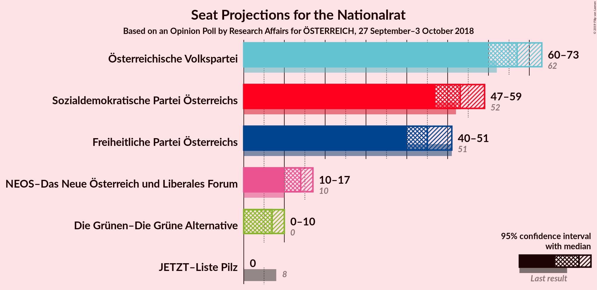
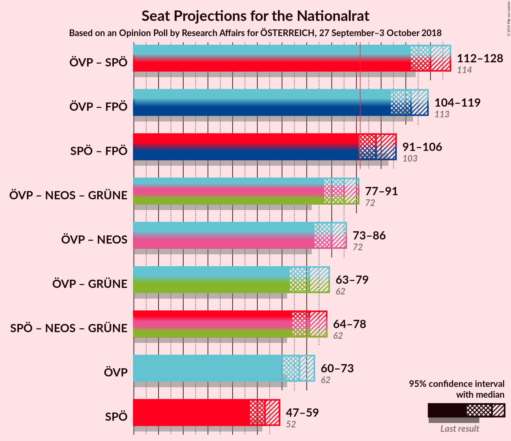

# Opinion Poll by Research Affairs for ÖSTERREICH, 27 September–3 October 2018

<a href="#voting-intentions">Voting Intentions</a> | <a href="#seats">Seats</a> | <a href="#coalitions">Coalitions</a> | <a href="#technical-information">Technical Information</a>

## Voting Intentions

### Confidence Intervals

| Party | Last Result | Poll Result | 80% Confidence Interval | 90% Confidence Interval | 95% Confidence Interval | 99% Confidence Interval |
|:-----:|:-----------:|:-----------:|:-----------------------:|:-----------------------:|:-----------------------:|:-----------------------:|
| Österreichische Volkspartei | 31.5% | 34.0% | 32.1–36.0% |31.6–36.5% |31.1–37.0% |30.2–37.9% |
| Sozialdemokratische Partei Österreichs | 26.9% | 27.0% | 25.3–28.9% |24.8–29.4% |24.4–29.9% |23.5–30.8% |
| Freiheitliche Partei Österreichs | 26.0% | 23.0% | 21.4–24.8% |20.9–25.3% |20.5–25.7% |19.8–26.6% |
| NEOS–Das Neue Österreich und Liberales Forum | 5.3% | 7.0% | 6.0–8.1% |5.8–8.4% |5.6–8.7% |5.1–9.3% |
| Die Grünen–Die Grüne Alternative | 3.8% | 4.0% | 3.3–4.9% |3.1–5.2% |2.9–5.4% |2.6–5.9% |
| JETZT–Liste Pilz | 4.4% | 2.0% | 1.5–2.7% |1.4–2.9% |1.3–3.1% |1.1–3.4% |

*Note:* The poll result column reflects the actual value used in the calculations. Published results may vary slightly, and in addition be rounded to fewer digits.

## Seats

### Confidence Intervals

| Party | Last Result | Median | 80% Confidence Interval | 90% Confidence Interval | 95% Confidence Interval | 99% Confidence Interval |
|:-----:|:-----------:|:------:|:-----------------------:|:-----------------------:|:-----------------------:|:-----------------------:|
| <a href="#österreichische-volkspartei">Österreichische Volkspartei</a> | 62 | 67 | 62–71 |61–72 |60–73 |58–75 |
| <a href="#sozialdemokratische-partei-österreichs">Sozialdemokratische Partei Österreichs</a> | 52 | 53 | 49–57 |48–58 |47–59 |45–60 |
| <a href="#freiheitliche-partei-österreichs">Freiheitliche Partei Österreichs</a> | 51 | 45 | 42–49 |40–50 |40–51 |38–53 |
| <a href="#neos–das-neue-österreich-und-liberales-forum">NEOS–Das Neue Österreich und Liberales Forum</a> | 10 | 14 | 12–16 |11–16 |10–17 |10–18 |
| <a href="#die-grünen–die-grüne-alternative">Die Grünen–Die Grüne Alternative</a> | 0 | 7 | 0–9 |0–9 |0–10 |0–11 |
| <a href="#jetzt–liste-pilz">JETZT–Liste Pilz</a> | 8 | 0 | 0 |0 |0 |0 |

### Österreichische Volkspartei

*For a full overview of the results for this party, see the [Österreichische Volkspartei](party-österreichischevolkspartei.html) page.*

| Number of Seats | Probability | Accumulated | Special Marks |
|:---------------:|:-----------:|:-----------:|:-------------:|
| 56 | 0% | 100% |  |
| 57 | 0.1% | 99.9% |  |
| 58 | 0.4% | 99.8% |  |
| 59 | 0.9% | 99.4% |  |
| 60 | 1.4% | 98% |  |
| 61 | 2% | 97% |  |
| 62 | 5% | 95% | Last Result |
| 63 | 7% | 89% |  |
| 64 | 11% | 82% |  |
| 65 | 10% | 72% |  |
| 66 | 9% | 62% |  |
| 67 | 13% | 53% | Median |
| 68 | 9% | 40% |  |
| 69 | 13% | 32% |  |
| 70 | 6% | 18% |  |
| 71 | 6% | 13% |  |
| 72 | 3% | 7% |  |
| 73 | 2% | 4% |  |
| 74 | 0.9% | 2% |  |
| 75 | 0.6% | 0.8% |  |
| 76 | 0.1% | 0.2% |  |
| 77 | 0.1% | 0.1% |  |
| 78 | 0% | 0% |  |

### Sozialdemokratische Partei Österreichs

*For a full overview of the results for this party, see the [Sozialdemokratische Partei Österreichs](party-sozialdemokratischeparteiösterreichs.html) page.*

| Number of Seats | Probability | Accumulated | Special Marks |
|:---------------:|:-----------:|:-----------:|:-------------:|
| 44 | 0.1% | 100% |  |
| 45 | 0.5% | 99.9% |  |
| 46 | 0.6% | 99.4% |  |
| 47 | 2% | 98.8% |  |
| 48 | 4% | 97% |  |
| 49 | 3% | 93% |  |
| 50 | 9% | 90% |  |
| 51 | 12% | 81% |  |
| 52 | 8% | 69% | Last Result |
| 53 | 20% | 61% | Median |
| 54 | 16% | 41% |  |
| 55 | 3% | 25% |  |
| 56 | 10% | 22% |  |
| 57 | 6% | 12% |  |
| 58 | 2% | 6% |  |
| 59 | 3% | 4% |  |
| 60 | 0.9% | 1.3% |  |
| 61 | 0.1% | 0.4% |  |
| 62 | 0.2% | 0.3% |  |
| 63 | 0.1% | 0.1% |  |
| 64 | 0% | 0% |  |

### Freiheitliche Partei Österreichs

*For a full overview of the results for this party, see the [Freiheitliche Partei Österreichs](party-freiheitlicheparteiösterreichs.html) page.*

| Number of Seats | Probability | Accumulated | Special Marks |
|:---------------:|:-----------:|:-----------:|:-------------:|
| 36 | 0.1% | 100% |  |
| 37 | 0.1% | 99.9% |  |
| 38 | 0.5% | 99.9% |  |
| 39 | 1.1% | 99.3% |  |
| 40 | 3% | 98% |  |
| 41 | 3% | 95% |  |
| 42 | 9% | 92% |  |
| 43 | 11% | 83% |  |
| 44 | 16% | 71% |  |
| 45 | 13% | 55% | Median |
| 46 | 10% | 43% |  |
| 47 | 13% | 33% |  |
| 48 | 9% | 20% |  |
| 49 | 6% | 11% |  |
| 50 | 2% | 5% |  |
| 51 | 2% | 3% | Last Result |
| 52 | 0.6% | 1.2% |  |
| 53 | 0.5% | 0.6% |  |
| 54 | 0.1% | 0.1% |  |
| 55 | 0% | 0.1% |  |
| 56 | 0% | 0% |  |

### NEOS–Das Neue Österreich und Liberales Forum

*For a full overview of the results for this party, see the [NEOS–Das Neue Österreich und Liberales Forum](party-neos–dasneueösterreichundliberalesforum.html) page.*

| Number of Seats | Probability | Accumulated | Special Marks |
|:---------------:|:-----------:|:-----------:|:-------------:|
| 9 | 0.3% | 100% |  |
| 10 | 3% | 99.7% | Last Result |
| 11 | 6% | 97% |  |
| 12 | 23% | 91% |  |
| 13 | 16% | 68% |  |
| 14 | 31% | 52% | Median |
| 15 | 9% | 21% |  |
| 16 | 9% | 12% |  |
| 17 | 1.5% | 3% |  |
| 18 | 1.2% | 1.3% |  |
| 19 | 0.1% | 0.1% |  |
| 20 | 0.1% | 0.1% |  |
| 21 | 0% | 0% |  |

### Die Grünen–Die Grüne Alternative

*For a full overview of the results for this party, see the [Die Grünen–Die Grüne Alternative](party-diegrünen–diegrünealternative.html) page.*

| Number of Seats | Probability | Accumulated | Special Marks |
|:---------------:|:-----------:|:-----------:|:-------------:|
| 0 | 47% | 100% | Last Result |
| 1 | 0% | 53% |  |
| 2 | 0% | 53% |  |
| 3 | 0% | 53% |  |
| 4 | 0% | 53% |  |
| 5 | 0% | 53% |  |
| 6 | 0% | 53% |  |
| 7 | 10% | 53% | Median |
| 8 | 24% | 43% |  |
| 9 | 15% | 20% |  |
| 10 | 4% | 5% |  |
| 11 | 0.9% | 1.0% |  |
| 12 | 0.1% | 0.2% |  |
| 13 | 0% | 0% |  |

### JETZT–Liste Pilz

*For a full overview of the results for this party, see the [JETZT–Liste Pilz](party-jetzt–listepilz.html) page.*

| Number of Seats | Probability | Accumulated | Special Marks |
|:---------------:|:-----------:|:-----------:|:-------------:|
| 0 | 100% | 100% | Median |
| 1 | 0% | 0% |  |
| 2 | 0% | 0% |  |
| 3 | 0% | 0% |  |
| 4 | 0% | 0% |  |
| 5 | 0% | 0% |  |
| 6 | 0% | 0% |  |
| 7 | 0% | 0% |  |
| 8 | 0% | 0% | Last Result |

## Coalitions

### Confidence Intervals

| Coalition | Last Result | Median | Majority? | 80% Confidence Interval | 90% Confidence Interval | 95% Confidence Interval | 99% Confidence Interval |
|:---------:|:-----------:|:------:|:---------:|:-----------------------:|:-----------------------:|:-----------------------:|:-----------------------:|
| Österreichische Volkspartei – Sozialdemokratische Partei Österreichs | 114 | 120 | 100% | 114–125 | 113–126 | 112–128 | 109–130 |
| Österreichische Volkspartei – Freiheitliche Partei Österreichs | 113 | 112 | 100% | 106–117 | 106–119 | 104–119 | 102–122 |
| Sozialdemokratische Partei Österreichs – Freiheitliche Partei Österreichs | 103 | 98 | 96% | 94–103 | 92–104 | 91–106 | 88–107 |
| Österreichische Volkspartei – NEOS–Das Neue Österreich und Liberales Forum – Die Grünen–Die Grüne Alternative | 72 | 85 | 2% | 80–89 | 78–91 | 77–91 | 75–94 |
| Österreichische Volkspartei – NEOS–Das Neue Österreich und Liberales Forum | 72 | 80 | 0.1% | 76–85 | 75–86 | 73–86 | 71–89 |
| Österreichische Volkspartei – Die Grünen–Die Grüne Alternative | 62 | 71 | 0% | 66–76 | 65–78 | 63–79 | 61–81 |
| Sozialdemokratische Partei Österreichs – NEOS–Das Neue Österreich und Liberales Forum – Die Grünen–Die Grüne Alternative | 62 | 71 | 0% | 66–76 | 64–77 | 64–78 | 61–80 |
| Österreichische Volkspartei | 62 | 67 | 0% | 62–71 | 61–72 | 60–73 | 58–75 |
| Sozialdemokratische Partei Österreichs | 52 | 53 | 0% | 49–57 | 48–58 | 47–59 | 45–60 |

### Österreichische Volkspartei – Sozialdemokratische Partei Österreichs

| Number of Seats | Probability | Accumulated | Special Marks |
|:---------------:|:-----------:|:-----------:|:-------------:|
| 106 | 0% | 100% |  |
| 107 | 0.1% | 99.9% |  |
| 108 | 0.3% | 99.9% |  |
| 109 | 0.2% | 99.6% |  |
| 110 | 0.7% | 99.4% |  |
| 111 | 1.1% | 98.7% |  |
| 112 | 2% | 98% |  |
| 113 | 2% | 96% |  |
| 114 | 5% | 94% | Last Result |
| 115 | 5% | 89% |  |
| 116 | 6% | 84% |  |
| 117 | 9% | 78% |  |
| 118 | 9% | 69% |  |
| 119 | 9% | 60% |  |
| 120 | 7% | 51% | Median |
| 121 | 9% | 44% |  |
| 122 | 11% | 35% |  |
| 123 | 6% | 24% |  |
| 124 | 7% | 18% |  |
| 125 | 4% | 12% |  |
| 126 | 3% | 8% |  |
| 127 | 2% | 4% |  |
| 128 | 2% | 3% |  |
| 129 | 0.5% | 1.0% |  |
| 130 | 0.4% | 0.5% |  |
| 131 | 0.1% | 0.1% |  |
| 132 | 0% | 0.1% |  |
| 133 | 0% | 0% |  |

### Österreichische Volkspartei – Freiheitliche Partei Österreichs

| Number of Seats | Probability | Accumulated | Special Marks |
|:---------------:|:-----------:|:-----------:|:-------------:|
| 99 | 0.1% | 100% |  |
| 100 | 0.1% | 99.9% |  |
| 101 | 0.2% | 99.8% |  |
| 102 | 0.3% | 99.6% |  |
| 103 | 1.1% | 99.3% |  |
| 104 | 1.3% | 98% |  |
| 105 | 2% | 97% |  |
| 106 | 6% | 95% |  |
| 107 | 6% | 89% |  |
| 108 | 4% | 83% |  |
| 109 | 12% | 79% |  |
| 110 | 8% | 67% |  |
| 111 | 3% | 58% |  |
| 112 | 11% | 55% | Median |
| 113 | 10% | 44% | Last Result |
| 114 | 6% | 34% |  |
| 115 | 6% | 28% |  |
| 116 | 12% | 22% |  |
| 117 | 3% | 11% |  |
| 118 | 3% | 8% |  |
| 119 | 4% | 5% |  |
| 120 | 0.5% | 2% |  |
| 121 | 0.5% | 1.1% |  |
| 122 | 0.5% | 0.6% |  |
| 123 | 0.1% | 0.1% |  |
| 124 | 0% | 0.1% |  |
| 125 | 0% | 0% |  |

### Sozialdemokratische Partei Österreichs – Freiheitliche Partei Österreichs

| Number of Seats | Probability | Accumulated | Special Marks |
|:---------------:|:-----------:|:-----------:|:-------------:|
| 86 | 0% | 100% |  |
| 87 | 0.1% | 99.9% |  |
| 88 | 0.4% | 99.8% |  |
| 89 | 0.5% | 99.5% |  |
| 90 | 0.9% | 98.9% |  |
| 91 | 2% | 98% |  |
| 92 | 3% | 96% | Majority |
| 93 | 3% | 93% |  |
| 94 | 7% | 91% |  |
| 95 | 7% | 84% |  |
| 96 | 7% | 77% |  |
| 97 | 13% | 69% |  |
| 98 | 12% | 56% | Median |
| 99 | 10% | 44% |  |
| 100 | 11% | 34% |  |
| 101 | 5% | 24% |  |
| 102 | 7% | 19% |  |
| 103 | 3% | 12% | Last Result |
| 104 | 4% | 8% |  |
| 105 | 2% | 4% |  |
| 106 | 2% | 3% |  |
| 107 | 0.5% | 0.8% |  |
| 108 | 0.1% | 0.3% |  |
| 109 | 0.1% | 0.2% |  |
| 110 | 0% | 0.1% |  |
| 111 | 0% | 0% |  |

### Österreichische Volkspartei – NEOS–Das Neue Österreich und Liberales Forum – Die Grünen–Die Grüne Alternative

| Number of Seats | Probability | Accumulated | Special Marks |
|:---------------:|:-----------:|:-----------:|:-------------:|
| 72 | 0% | 100% | Last Result |
| 73 | 0.1% | 100% |  |
| 74 | 0.2% | 99.9% |  |
| 75 | 0.5% | 99.7% |  |
| 76 | 0.7% | 99.2% |  |
| 77 | 2% | 98% |  |
| 78 | 2% | 96% |  |
| 79 | 4% | 94% |  |
| 80 | 4% | 90% |  |
| 81 | 8% | 87% |  |
| 82 | 6% | 79% |  |
| 83 | 10% | 73% |  |
| 84 | 10% | 63% |  |
| 85 | 12% | 52% |  |
| 86 | 13% | 41% |  |
| 87 | 7% | 27% |  |
| 88 | 7% | 20% | Median |
| 89 | 7% | 14% |  |
| 90 | 2% | 7% |  |
| 91 | 3% | 5% |  |
| 92 | 1.0% | 2% | Majority |
| 93 | 0.6% | 1.3% |  |
| 94 | 0.5% | 0.7% |  |
| 95 | 0.2% | 0.3% |  |
| 96 | 0.1% | 0.1% |  |
| 97 | 0% | 0% |  |

### Österreichische Volkspartei – NEOS–Das Neue Österreich und Liberales Forum

| Number of Seats | Probability | Accumulated | Special Marks |
|:---------------:|:-----------:|:-----------:|:-------------:|
| 69 | 0.1% | 100% |  |
| 70 | 0.2% | 99.9% |  |
| 71 | 0.3% | 99.7% |  |
| 72 | 1.0% | 99.4% | Last Result |
| 73 | 1.3% | 98% |  |
| 74 | 2% | 97% |  |
| 75 | 4% | 95% |  |
| 76 | 8% | 91% |  |
| 77 | 8% | 83% |  |
| 78 | 8% | 75% |  |
| 79 | 13% | 67% |  |
| 80 | 8% | 54% |  |
| 81 | 11% | 45% | Median |
| 82 | 6% | 34% |  |
| 83 | 9% | 28% |  |
| 84 | 6% | 18% |  |
| 85 | 7% | 12% |  |
| 86 | 3% | 6% |  |
| 87 | 0.8% | 2% |  |
| 88 | 0.5% | 1.4% |  |
| 89 | 0.5% | 0.8% |  |
| 90 | 0.2% | 0.4% |  |
| 91 | 0.1% | 0.2% |  |
| 92 | 0% | 0.1% | Majority |
| 93 | 0% | 0% |  |

### Österreichische Volkspartei – Die Grünen–Die Grüne Alternative

| Number of Seats | Probability | Accumulated | Special Marks |
|:---------------:|:-----------:|:-----------:|:-------------:|
| 60 | 0.2% | 100% |  |
| 61 | 0.3% | 99.7% |  |
| 62 | 0.8% | 99.5% | Last Result |
| 63 | 2% | 98.6% |  |
| 64 | 1.1% | 97% |  |
| 65 | 4% | 95% |  |
| 66 | 2% | 92% |  |
| 67 | 8% | 89% |  |
| 68 | 5% | 81% |  |
| 69 | 13% | 76% |  |
| 70 | 8% | 64% |  |
| 71 | 10% | 56% |  |
| 72 | 8% | 46% |  |
| 73 | 9% | 38% |  |
| 74 | 8% | 28% | Median |
| 75 | 9% | 20% |  |
| 76 | 4% | 11% |  |
| 77 | 2% | 7% |  |
| 78 | 2% | 5% |  |
| 79 | 2% | 3% |  |
| 80 | 0.4% | 1.0% |  |
| 81 | 0.5% | 0.6% |  |
| 82 | 0% | 0.1% |  |
| 83 | 0% | 0% |  |

### Sozialdemokratische Partei Österreichs – NEOS–Das Neue Österreich und Liberales Forum – Die Grünen–Die Grüne Alternative

| Number of Seats | Probability | Accumulated | Special Marks |
|:---------------:|:-----------:|:-----------:|:-------------:|
| 59 | 0.1% | 100% |  |
| 60 | 0.1% | 99.9% |  |
| 61 | 0.5% | 99.8% |  |
| 62 | 0.6% | 99.2% | Last Result |
| 63 | 0.6% | 98.6% |  |
| 64 | 4% | 98% |  |
| 65 | 3% | 94% |  |
| 66 | 3% | 91% |  |
| 67 | 12% | 88% |  |
| 68 | 6% | 75% |  |
| 69 | 6% | 69% |  |
| 70 | 11% | 63% |  |
| 71 | 12% | 53% |  |
| 72 | 2% | 41% |  |
| 73 | 9% | 39% |  |
| 74 | 12% | 30% | Median |
| 75 | 4% | 18% |  |
| 76 | 6% | 14% |  |
| 77 | 6% | 9% |  |
| 78 | 0.6% | 3% |  |
| 79 | 1.2% | 2% |  |
| 80 | 0.9% | 1.2% |  |
| 81 | 0% | 0.2% |  |
| 82 | 0.1% | 0.2% |  |
| 83 | 0% | 0% |  |

### Österreichische Volkspartei

| Number of Seats | Probability | Accumulated | Special Marks |
|:---------------:|:-----------:|:-----------:|:-------------:|
| 56 | 0% | 100% |  |
| 57 | 0.1% | 99.9% |  |
| 58 | 0.4% | 99.8% |  |
| 59 | 0.9% | 99.4% |  |
| 60 | 1.4% | 98% |  |
| 61 | 2% | 97% |  |
| 62 | 5% | 95% | Last Result |
| 63 | 7% | 89% |  |
| 64 | 11% | 82% |  |
| 65 | 10% | 72% |  |
| 66 | 9% | 62% |  |
| 67 | 13% | 53% | Median |
| 68 | 9% | 40% |  |
| 69 | 13% | 32% |  |
| 70 | 6% | 18% |  |
| 71 | 6% | 13% |  |
| 72 | 3% | 7% |  |
| 73 | 2% | 4% |  |
| 74 | 0.9% | 2% |  |
| 75 | 0.6% | 0.8% |  |
| 76 | 0.1% | 0.2% |  |
| 77 | 0.1% | 0.1% |  |
| 78 | 0% | 0% |  |

### Sozialdemokratische Partei Österreichs

| Number of Seats | Probability | Accumulated | Special Marks |
|:---------------:|:-----------:|:-----------:|:-------------:|
| 44 | 0.1% | 100% |  |
| 45 | 0.5% | 99.9% |  |
| 46 | 0.6% | 99.4% |  |
| 47 | 2% | 98.8% |  |
| 48 | 4% | 97% |  |
| 49 | 3% | 93% |  |
| 50 | 9% | 90% |  |
| 51 | 12% | 81% |  |
| 52 | 8% | 69% | Last Result |
| 53 | 20% | 61% | Median |
| 54 | 16% | 41% |  |
| 55 | 3% | 25% |  |
| 56 | 10% | 22% |  |
| 57 | 6% | 12% |  |
| 58 | 2% | 6% |  |
| 59 | 3% | 4% |  |
| 60 | 0.9% | 1.3% |  |
| 61 | 0.1% | 0.4% |  |
| 62 | 0.2% | 0.3% |  |
| 63 | 0.1% | 0.1% |  |
| 64 | 0% | 0% |  |

## Technical Information

### Opinion Poll

+ **Polling firm:** Research Affairs
+ **Commissioner(s):** ÖSTERREICH
+ **Fieldwork period:** 27 September–3 October 2018

### Calculations

+ **Sample size:** 1003
+ **Simulations done:** 131,072
+ **Error estimate:** 1.08%

