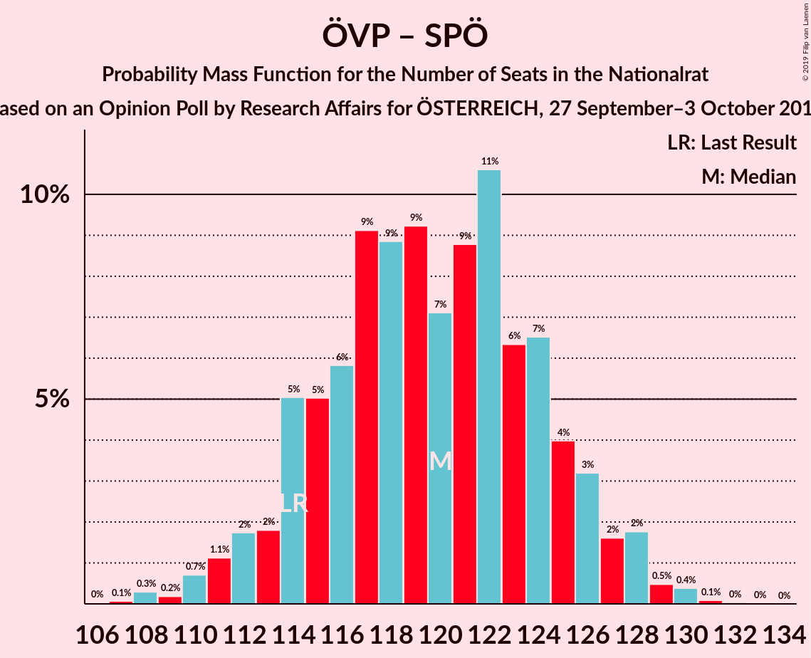

# Opinion Poll by Research Affairs for ÖSTERREICH, 27 September–3 October 2018

<a href="#voting-intentions">Voting Intentions</a> | <a href="#seats">Seats</a> | <a href="#coalitions">Coalitions</a> | <a href="#technical-information">Technical Information</a>

## Voting Intentions

### Confidence Intervals

| Party | Last Result | Poll Result | 80% Confidence Interval | 90% Confidence Interval | 95% Confidence Interval | 99% Confidence Interval |
|:-----:|:-----------:|:-----------:|:-----------------------:|:-----------------------:|:-----------------------:|:-----------------------:|
| Österreichische Volkspartei | 31.5% | 34.0% | 32.1–36.0% |31.6–36.5% |31.1–37.0% |30.2–37.9% |
| Sozialdemokratische Partei Österreichs | 26.9% | 27.0% | 25.3–28.9% |24.8–29.4% |24.4–29.9% |23.5–30.8% |
| Freiheitliche Partei Österreichs | 26.0% | 23.0% | 21.4–24.8% |20.9–25.3% |20.5–25.7% |19.8–26.6% |
| NEOS–Das Neue Österreich und Liberales Forum | 5.3% | 7.0% | 6.0–8.1% |5.8–8.4% |5.6–8.7% |5.1–9.3% |
| Die Grünen–Die Grüne Alternative | 3.8% | 4.0% | 3.3–4.9% |3.1–5.2% |2.9–5.4% |2.6–5.9% |
| JETZT–Liste Pilz | 4.4% | 2.0% | 1.5–2.7% |1.4–2.9% |1.3–3.1% |1.1–3.4% |

*Note:* The poll result column reflects the actual value used in the calculations. Published results may vary slightly, and in addition be rounded to fewer digits.

## Seats

### Confidence Intervals

| Party | Last Result | Median | 80% Confidence Interval | 90% Confidence Interval | 95% Confidence Interval | 99% Confidence Interval |
|:-----:|:-----------:|:------:|:-----------------------:|:-----------------------:|:-----------------------:|:-----------------------:|
| <a href="#österreichische-volkspartei">Österreichische Volkspartei</a> | 62 | 69 | 63–69 |60–71 |59–71 |56–72 |
| <a href="#sozialdemokratische-partei-österreichs">Sozialdemokratische Partei Österreichs</a> | 52 | 51 | 48–52 |47–53 |47–57 |46–64 |
| <a href="#freiheitliche-partei-österreichs">Freiheitliche Partei Österreichs</a> | 51 | 43 | 42–45 |41–50 |41–51 |39–51 |
| <a href="#neos–das-neue-österreich-und-liberales-forum">NEOS–Das Neue Österreich und Liberales Forum</a> | 10 | 12 | 12–19 |12–19 |12–19 |9–19 |
| <a href="#die-grünen–die-grüne-alternative">Die Grünen–Die Grüne Alternative</a> | 0 | 8 | 0–8 |0–10 |0–10 |0–12 |
| <a href="#jetzt–liste-pilz">JETZT–Liste Pilz</a> | 8 | 0 | 0 |0 |0 |0 |

### Österreichische Volkspartei

*For a full overview of the results for this party, see the [Österreichische Volkspartei](party-österreichischevolkspartei.html) page.*

| Number of Seats | Probability | Accumulated | Special Marks |
|:---------------:|:-----------:|:-----------:|:-------------:|
| 54 | 0.1% | 100% |  |
| 55 | 0% | 99.9% |  |
| 56 | 0.5% | 99.9% |  |
| 57 | 0.4% | 99.5% |  |
| 58 | 0% | 99.1% |  |
| 59 | 3% | 99.1% |  |
| 60 | 1.5% | 96% |  |
| 61 | 0% | 95% |  |
| 62 | 4% | 94% | Last Result |
| 63 | 0.9% | 90% |  |
| 64 | 0% | 89% |  |
| 65 | 10% | 89% |  |
| 66 | 5% | 79% |  |
| 67 | 0% | 74% |  |
| 68 | 4% | 74% |  |
| 69 | 64% | 70% | Median |
| 70 | 0% | 6% |  |
| 71 | 5% | 6% |  |
| 72 | 1.4% | 2% |  |
| 73 | 0.2% | 0.4% |  |
| 74 | 0% | 0.2% |  |
| 75 | 0.2% | 0.2% |  |
| 76 | 0% | 0% |  |

### Sozialdemokratische Partei Österreichs

*For a full overview of the results for this party, see the [Sozialdemokratische Partei Österreichs](party-sozialdemokratischeparteiösterreichs.html) page.*

| Number of Seats | Probability | Accumulated | Special Marks |
|:---------------:|:-----------:|:-----------:|:-------------:|
| 43 | 0.1% | 100% |  |
| 44 | 0.1% | 99.8% |  |
| 45 | 0% | 99.7% |  |
| 46 | 0.6% | 99.7% |  |
| 47 | 5% | 99.1% |  |
| 48 | 5% | 94% |  |
| 49 | 4% | 89% |  |
| 50 | 10% | 85% |  |
| 51 | 64% | 75% | Median |
| 52 | 3% | 11% | Last Result |
| 53 | 3% | 8% |  |
| 54 | 0.4% | 5% |  |
| 55 | 0.5% | 4% |  |
| 56 | 1.4% | 4% |  |
| 57 | 1.1% | 3% |  |
| 58 | 0% | 1.5% |  |
| 59 | 0.6% | 1.5% |  |
| 60 | 0% | 0.9% |  |
| 61 | 0% | 0.9% |  |
| 62 | 0% | 0.9% |  |
| 63 | 0% | 0.9% |  |
| 64 | 0.8% | 0.8% |  |
| 65 | 0% | 0% |  |

### Freiheitliche Partei Österreichs

*For a full overview of the results for this party, see the [Freiheitliche Partei Österreichs](party-freiheitlicheparteiösterreichs.html) page.*

| Number of Seats | Probability | Accumulated | Special Marks |
|:---------------:|:-----------:|:-----------:|:-------------:|
| 35 | 0.1% | 100% |  |
| 36 | 0.1% | 99.9% |  |
| 37 | 0.3% | 99.9% |  |
| 38 | 0% | 99.5% |  |
| 39 | 0.1% | 99.5% |  |
| 40 | 0.2% | 99.4% |  |
| 41 | 5% | 99.2% |  |
| 42 | 13% | 95% |  |
| 43 | 65% | 82% | Median |
| 44 | 3% | 17% |  |
| 45 | 4% | 14% |  |
| 46 | 0.2% | 10% |  |
| 47 | 0.2% | 10% |  |
| 48 | 0% | 9% |  |
| 49 | 4% | 9% |  |
| 50 | 1.0% | 5% |  |
| 51 | 4% | 4% | Last Result |
| 52 | 0.4% | 0.5% |  |
| 53 | 0% | 0% |  |

### NEOS–Das Neue Österreich und Liberales Forum

*For a full overview of the results for this party, see the [NEOS–Das Neue Österreich und Liberales Forum](party-neos–dasneueösterreichundliberalesforum.html) page.*

| Number of Seats | Probability | Accumulated | Special Marks |
|:---------------:|:-----------:|:-----------:|:-------------:|
| 9 | 0.6% | 100% |  |
| 10 | 0.2% | 99.4% | Last Result |
| 11 | 0% | 99.2% |  |
| 12 | 68% | 99.2% | Median |
| 13 | 4% | 31% |  |
| 14 | 9% | 27% |  |
| 15 | 0.6% | 18% |  |
| 16 | 0.2% | 18% |  |
| 17 | 5% | 17% |  |
| 18 | 0.1% | 13% |  |
| 19 | 12% | 12% |  |
| 20 | 0% | 0% |  |

### Die Grünen–Die Grüne Alternative

*For a full overview of the results for this party, see the [Die Grünen–Die Grüne Alternative](party-diegrünen–diegrünealternative.html) page.*

| Number of Seats | Probability | Accumulated | Special Marks |
|:---------------:|:-----------:|:-----------:|:-------------:|
| 0 | 11% | 100% | Last Result |
| 1 | 0% | 89% |  |
| 2 | 0% | 89% |  |
| 3 | 0% | 89% |  |
| 4 | 0% | 89% |  |
| 5 | 0% | 89% |  |
| 6 | 0% | 89% |  |
| 7 | 10% | 89% |  |
| 8 | 71% | 79% | Median |
| 9 | 1.2% | 8% |  |
| 10 | 6% | 7% |  |
| 11 | 0% | 1.2% |  |
| 12 | 1.2% | 1.2% |  |
| 13 | 0% | 0% |  |

### JETZT–Liste Pilz

*For a full overview of the results for this party, see the [JETZT–Liste Pilz](party-jetzt–listepilz.html) page.*

| Number of Seats | Probability | Accumulated | Special Marks |
|:---------------:|:-----------:|:-----------:|:-------------:|
| 0 | 100% | 100% | Median |
| 1 | 0% | 0% |  |
| 2 | 0% | 0% |  |
| 3 | 0% | 0% |  |
| 4 | 0% | 0% |  |
| 5 | 0% | 0% |  |
| 6 | 0% | 0% |  |
| 7 | 0% | 0% |  |
| 8 | 0% | 0% | Last Result |

## Coalitions

### Confidence Intervals

| Coalition | Last Result | Median | Majority? | 80% Confidence Interval | 90% Confidence Interval | 95% Confidence Interval | 99% Confidence Interval |
|:---------:|:-----------:|:------:|:---------:|:-----------------------:|:-----------------------:|:-----------------------:|:-----------------------:|
| Österreichische Volkspartei – Sozialdemokratische Partei Österreichs | 114 | 120 | 100% | 114–120 | 111–120 | 111–125 | 107–128 |
| Österreichische Volkspartei – Freiheitliche Partei Österreichs | 113 | 112 | 100% | 107–112 | 107–117 | 105–122 | 102–122 |
| Sozialdemokratische Partei Österreichs – Freiheitliche Partei Österreichs | 103 | 94 | 94% | 92–98 | 89–102 | 89–102 | 89–108 |
| Österreichische Volkspartei | 62 | 69 | 0% | 63–69 | 60–71 | 59–71 | 56–72 |
| Sozialdemokratische Partei Österreichs | 52 | 51 | 0% | 48–52 | 47–53 | 47–57 | 46–64 |

### Österreichische Volkspartei – Sozialdemokratische Partei Österreichs

| Number of Seats | Probability | Accumulated | Special Marks |
|:---------------:|:-----------:|:-----------:|:-------------:|
| 104 | 0.1% | 100% |  |
| 105 | 0% | 99.9% |  |
| 106 | 0.1% | 99.9% |  |
| 107 | 0.5% | 99.9% |  |
| 108 | 0.5% | 99.4% |  |
| 109 | 0.2% | 98.9% |  |
| 110 | 0% | 98.7% |  |
| 111 | 4% | 98.7% |  |
| 112 | 3% | 94% |  |
| 113 | 0.1% | 91% |  |
| 114 | 5% | 91% | Last Result |
| 115 | 11% | 86% |  |
| 116 | 0.2% | 76% |  |
| 117 | 1.0% | 76% |  |
| 118 | 4% | 75% |  |
| 119 | 1.0% | 71% |  |
| 120 | 67% | 70% | Median |
| 121 | 0.2% | 3% |  |
| 122 | 0% | 3% |  |
| 123 | 0.3% | 3% |  |
| 124 | 0% | 3% |  |
| 125 | 0.6% | 3% |  |
| 126 | 0% | 2% |  |
| 127 | 0.9% | 2% |  |
| 128 | 1.4% | 1.4% |  |
| 129 | 0% | 0% |  |

### Österreichische Volkspartei – Freiheitliche Partei Österreichs

| Number of Seats | Probability | Accumulated | Special Marks |
|:---------------:|:-----------:|:-----------:|:-------------:|
| 98 | 0.1% | 100% |  |
| 99 | 0.1% | 99.9% |  |
| 100 | 0% | 99.8% |  |
| 101 | 0.1% | 99.8% |  |
| 102 | 0.5% | 99.7% |  |
| 103 | 2% | 99.1% |  |
| 104 | 0% | 98% |  |
| 105 | 0.8% | 98% |  |
| 106 | 0.2% | 97% |  |
| 107 | 18% | 97% |  |
| 108 | 4% | 79% |  |
| 109 | 0% | 75% |  |
| 110 | 1.1% | 75% |  |
| 111 | 0.2% | 74% |  |
| 112 | 66% | 74% | Median |
| 113 | 0% | 7% | Last Result |
| 114 | 1.4% | 7% |  |
| 115 | 0.6% | 6% |  |
| 116 | 0% | 5% |  |
| 117 | 0.6% | 5% |  |
| 118 | 0% | 5% |  |
| 119 | 0% | 5% |  |
| 120 | 0.1% | 5% |  |
| 121 | 1.1% | 5% |  |
| 122 | 4% | 4% |  |
| 123 | 0% | 0% |  |

### Sozialdemokratische Partei Österreichs – Freiheitliche Partei Österreichs

| Number of Seats | Probability | Accumulated | Special Marks |
|:---------------:|:-----------:|:-----------:|:-------------:|
| 85 | 0.1% | 100% |  |
| 86 | 0% | 99.9% |  |
| 87 | 0.2% | 99.9% |  |
| 88 | 0.1% | 99.7% |  |
| 89 | 5% | 99.6% |  |
| 90 | 0.5% | 94% |  |
| 91 | 0.2% | 94% |  |
| 92 | 10% | 94% | Majority |
| 93 | 0.1% | 84% |  |
| 94 | 68% | 84% | Median |
| 95 | 1.0% | 16% |  |
| 96 | 3% | 15% |  |
| 97 | 0.1% | 12% |  |
| 98 | 6% | 12% |  |
| 99 | 0.1% | 6% |  |
| 100 | 1.0% | 6% |  |
| 101 | 0.2% | 5% |  |
| 102 | 3% | 5% |  |
| 103 | 0.1% | 2% | Last Result |
| 104 | 0.4% | 2% |  |
| 105 | 0% | 1.4% |  |
| 106 | 0.8% | 1.4% |  |
| 107 | 0% | 0.6% |  |
| 108 | 0.6% | 0.6% |  |
| 109 | 0% | 0% |  |

### Österreichische Volkspartei

| Number of Seats | Probability | Accumulated | Special Marks |
|:---------------:|:-----------:|:-----------:|:-------------:|
| 54 | 0.1% | 100% |  |
| 55 | 0% | 99.9% |  |
| 56 | 0.5% | 99.9% |  |
| 57 | 0.4% | 99.5% |  |
| 58 | 0% | 99.1% |  |
| 59 | 3% | 99.1% |  |
| 60 | 1.5% | 96% |  |
| 61 | 0% | 95% |  |
| 62 | 4% | 94% | Last Result |
| 63 | 0.9% | 90% |  |
| 64 | 0% | 89% |  |
| 65 | 10% | 89% |  |
| 66 | 5% | 79% |  |
| 67 | 0% | 74% |  |
| 68 | 4% | 74% |  |
| 69 | 64% | 70% | Median |
| 70 | 0% | 6% |  |
| 71 | 5% | 6% |  |
| 72 | 1.4% | 2% |  |
| 73 | 0.2% | 0.4% |  |
| 74 | 0% | 0.2% |  |
| 75 | 0.2% | 0.2% |  |
| 76 | 0% | 0% |  |

### Sozialdemokratische Partei Österreichs

| Number of Seats | Probability | Accumulated | Special Marks |
|:---------------:|:-----------:|:-----------:|:-------------:|
| 43 | 0.1% | 100% |  |
| 44 | 0.1% | 99.8% |  |
| 45 | 0% | 99.7% |  |
| 46 | 0.6% | 99.7% |  |
| 47 | 5% | 99.1% |  |
| 48 | 5% | 94% |  |
| 49 | 4% | 89% |  |
| 50 | 10% | 85% |  |
| 51 | 64% | 75% | Median |
| 52 | 3% | 11% | Last Result |
| 53 | 3% | 8% |  |
| 54 | 0.4% | 5% |  |
| 55 | 0.5% | 4% |  |
| 56 | 1.4% | 4% |  |
| 57 | 1.1% | 3% |  |
| 58 | 0% | 1.5% |  |
| 59 | 0.6% | 1.5% |  |
| 60 | 0% | 0.9% |  |
| 61 | 0% | 0.9% |  |
| 62 | 0% | 0.9% |  |
| 63 | 0% | 0.9% |  |
| 64 | 0.8% | 0.8% |  |
| 65 | 0% | 0% |  |

## Technical Information

### Opinion Poll

+ **Polling firm:** Research Affairs
+ **Commissioner(s):** ÖSTERREICH
+ **Fieldwork period:** 27 September–3 October 2018

### Calculations

+ **Sample size:** 1003
+ **Simulations done:** 1,024
+ **Error estimate:** 3.02%

