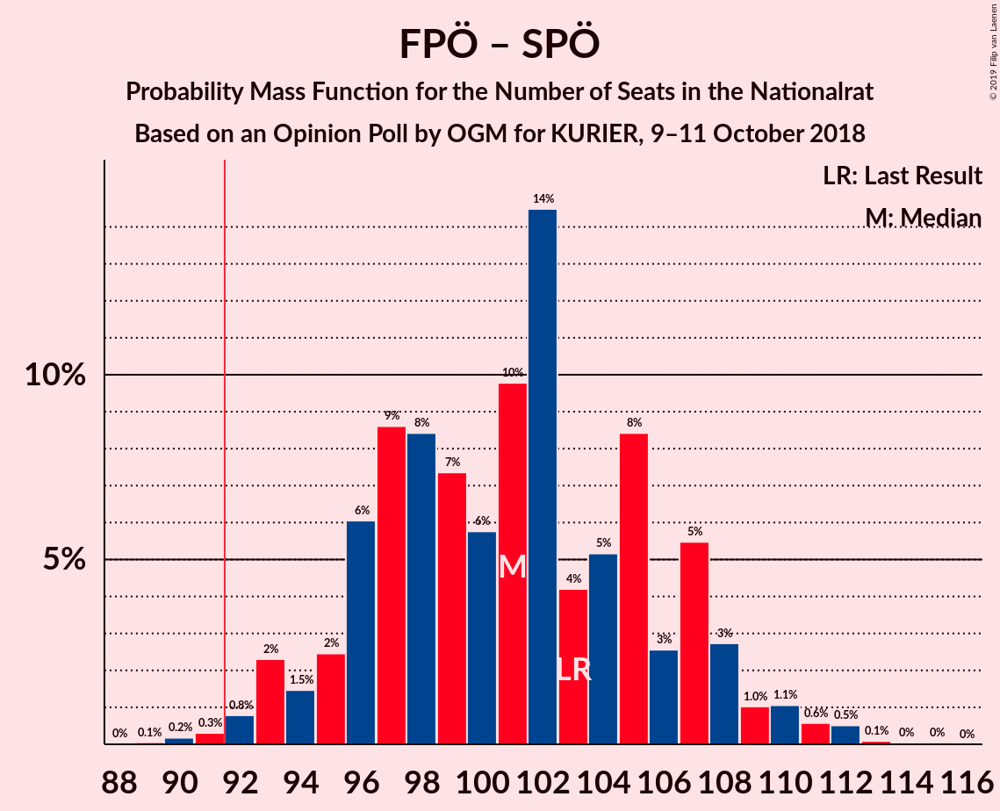
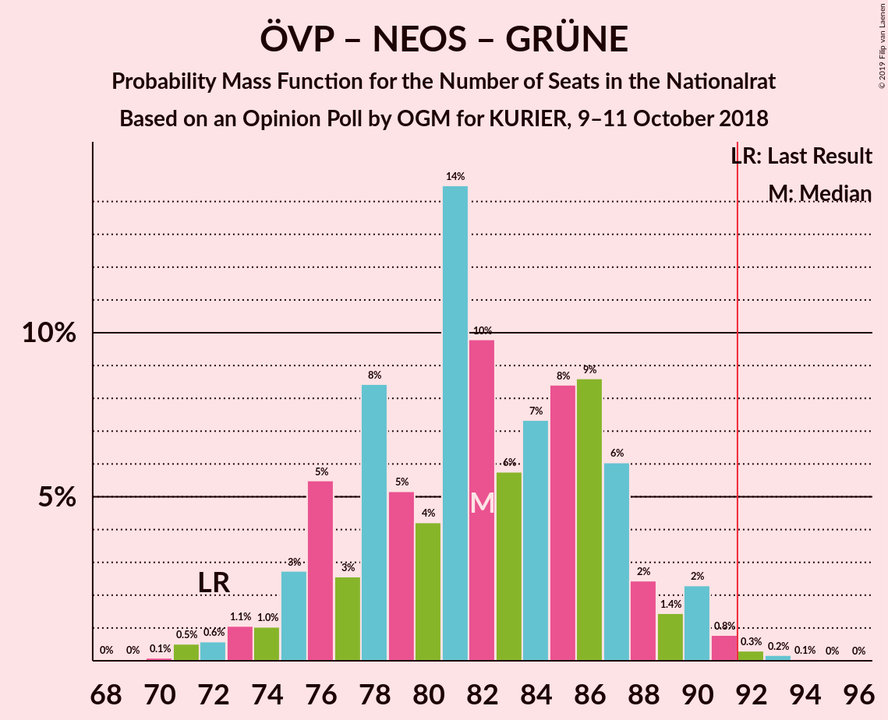
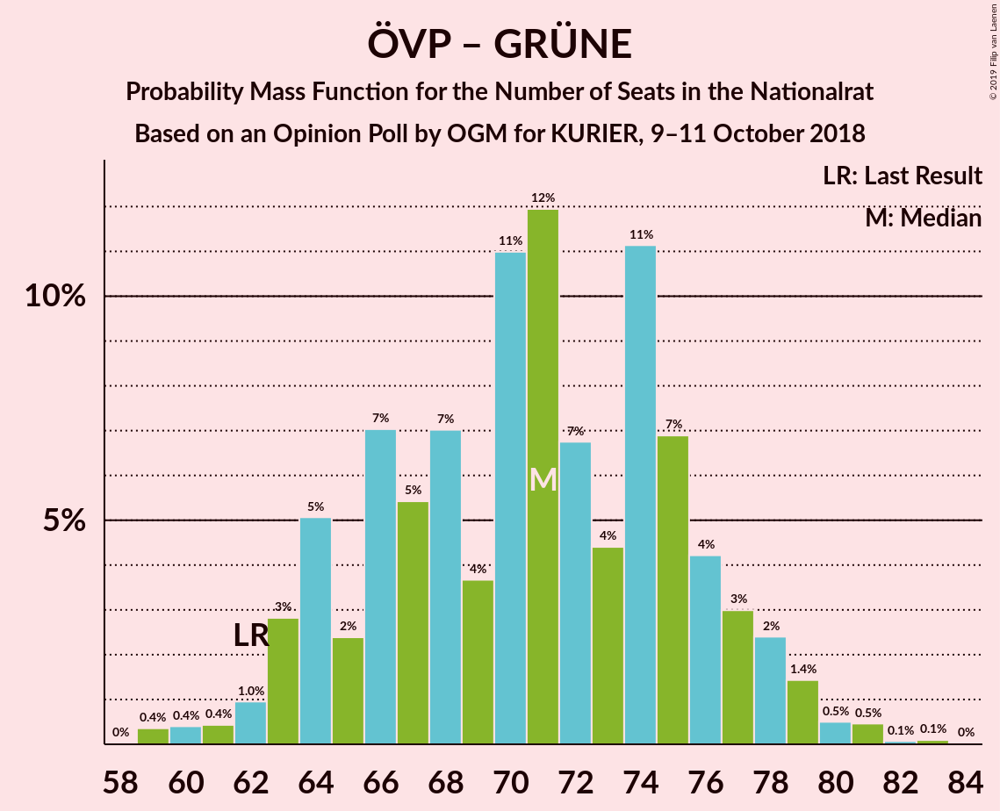
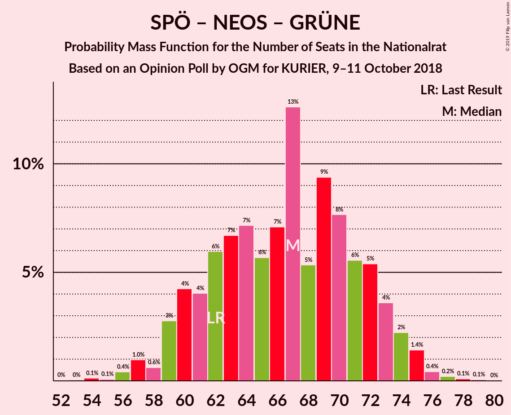

# Opinion Poll by OGM for KURIER, 9–11 October 2018

<a href="#voting-intentions">Voting Intentions</a> | <a href="#seats">Seats</a> | <a href="#coalitions">Coalitions</a> | <a href="#technical-information">Technical Information</a>

## Voting Intentions

### Confidence Intervals

| Party | Last Result | Poll Result | 80% Confidence Interval | 90% Confidence Interval | 95% Confidence Interval | 99% Confidence Interval |
|:-----:|:-----------:|:-----------:|:-----------------------:|:-----------------------:|:-----------------------:|:-----------------------:|
| Österreichische Volkspartei | 31.5% | 34.0% | 31.9–36.2% |31.4–36.9% |30.8–37.4% |29.8–38.5% |
| Sozialdemokratische Partei Österreichs | 26.9% | 26.1% | 24.1–28.1% |23.6–28.7% |23.1–29.2% |22.2–30.2% |
| Freiheitliche Partei Österreichs | 26.0% | 26.1% | 24.1–28.1% |23.6–28.7% |23.1–29.2% |22.2–30.2% |
| NEOS–Das Neue Österreich und Liberales Forum | 5.3% | 6.0% | 5.0–7.2% |4.8–7.5% |4.5–7.8% |4.1–8.5% |
| Die Grünen–Die Grüne Alternative | 3.8% | 4.0% | 3.2–5.0% |3.0–5.3% |2.8–5.6% |2.5–6.1% |
| JETZT–Liste Pilz | 4.4% | 2.0% | 1.5–2.8% |1.3–3.0% |1.2–3.2% |1.0–3.6% |

*Note:* The poll result column reflects the actual value used in the calculations. Published results may vary slightly, and in addition be rounded to fewer digits.

## Seats

### Confidence Intervals

| Party | Last Result | Median | 80% Confidence Interval | 90% Confidence Interval | 95% Confidence Interval | 99% Confidence Interval |
|:-----:|:-----------:|:------:|:-----------------------:|:-----------------------:|:-----------------------:|:-----------------------:|
| <a href="#österreichische-volkspartei">Österreichische Volkspartei</a> | 62 | 66 | 62–71 |60–71 |60–73 |58–75 |
| <a href="#sozialdemokratische-partei-österreichs">Sozialdemokratische Partei Österreichs</a> | 52 | 51 | 47–54 |46–56 |44–57 |43–59 |
| <a href="#freiheitliche-partei-österreichs">Freiheitliche Partei Österreichs</a> | 51 | 50 | 46–54 |45–56 |44–58 |42–59 |
| <a href="#neos–das-neue-österreich-und-liberales-forum">NEOS–Das Neue Österreich und Liberales Forum</a> | 10 | 11 | 9–14 |8–15 |8–15 |7–16 |
| <a href="#die-grünen–die-grüne-alternative">Die Grünen–Die Grüne Alternative</a> | 0 | 8 | 0–9 |0–10 |0–10 |0–11 |
| <a href="#jetzt–liste-pilz">JETZT–Liste Pilz</a> | 8 | 0 | 0 |0 |0 |0 |

### Österreichische Volkspartei

*For a full overview of the results for this party, see the [Österreichische Volkspartei](party-österreichischevolkspartei.html) page.*

| Number of Seats | Probability | Accumulated | Special Marks |
|:---------------:|:-----------:|:-----------:|:-------------:|
| 55 | 0% | 100% |  |
| 56 | 0.1% | 99.9% |  |
| 57 | 0.2% | 99.8% |  |
| 58 | 1.1% | 99.6% |  |
| 59 | 0.9% | 98% |  |
| 60 | 3% | 98% |  |
| 61 | 2% | 95% |  |
| 62 | 10% | 93% | Last Result |
| 63 | 8% | 83% |  |
| 64 | 10% | 75% |  |
| 65 | 6% | 65% |  |
| 66 | 18% | 59% | Median |
| 67 | 13% | 42% |  |
| 68 | 6% | 29% |  |
| 69 | 4% | 22% |  |
| 70 | 7% | 18% |  |
| 71 | 7% | 11% |  |
| 72 | 1.0% | 4% |  |
| 73 | 1.1% | 3% |  |
| 74 | 0.8% | 2% |  |
| 75 | 0.9% | 1.2% |  |
| 76 | 0.2% | 0.3% |  |
| 77 | 0.1% | 0.2% |  |
| 78 | 0% | 0.1% |  |
| 79 | 0% | 0% |  |

### Sozialdemokratische Partei Österreichs

*For a full overview of the results for this party, see the [Sozialdemokratische Partei Österreichs](party-sozialdemokratischeparteiösterreichs.html) page.*

| Number of Seats | Probability | Accumulated | Special Marks |
|:---------------:|:-----------:|:-----------:|:-------------:|
| 41 | 0.2% | 100% |  |
| 42 | 0.2% | 99.8% |  |
| 43 | 0.7% | 99.7% |  |
| 44 | 2% | 99.0% |  |
| 45 | 2% | 97% |  |
| 46 | 5% | 96% |  |
| 47 | 5% | 91% |  |
| 48 | 14% | 86% |  |
| 49 | 9% | 72% |  |
| 50 | 10% | 63% |  |
| 51 | 18% | 53% | Median |
| 52 | 5% | 35% | Last Result |
| 53 | 14% | 30% |  |
| 54 | 6% | 16% |  |
| 55 | 3% | 9% |  |
| 56 | 3% | 6% |  |
| 57 | 0.7% | 3% |  |
| 58 | 2% | 2% |  |
| 59 | 0.3% | 0.6% |  |
| 60 | 0.2% | 0.3% |  |
| 61 | 0.1% | 0.1% |  |
| 62 | 0% | 0% |  |

### Freiheitliche Partei Österreichs

*For a full overview of the results for this party, see the [Freiheitliche Partei Österreichs](party-freiheitlicheparteiösterreichs.html) page.*

| Number of Seats | Probability | Accumulated | Special Marks |
|:---------------:|:-----------:|:-----------:|:-------------:|
| 41 | 0.2% | 100% |  |
| 42 | 0.3% | 99.8% |  |
| 43 | 0.6% | 99.5% |  |
| 44 | 1.4% | 98.9% |  |
| 45 | 4% | 97% |  |
| 46 | 8% | 94% |  |
| 47 | 9% | 86% |  |
| 48 | 6% | 77% |  |
| 49 | 11% | 70% |  |
| 50 | 12% | 59% | Median |
| 51 | 8% | 47% | Last Result |
| 52 | 10% | 39% |  |
| 53 | 8% | 29% |  |
| 54 | 12% | 21% |  |
| 55 | 4% | 10% |  |
| 56 | 2% | 6% |  |
| 57 | 1.3% | 4% |  |
| 58 | 2% | 3% |  |
| 59 | 0.5% | 1.0% |  |
| 60 | 0.3% | 0.4% |  |
| 61 | 0.1% | 0.1% |  |
| 62 | 0% | 0% |  |

### NEOS–Das Neue Österreich und Liberales Forum

*For a full overview of the results for this party, see the [NEOS–Das Neue Österreich und Liberales Forum](party-neos–dasneueösterreichundliberalesforum.html) page.*

| Number of Seats | Probability | Accumulated | Special Marks |
|:---------------:|:-----------:|:-----------:|:-------------:|
| 0 | 0.4% | 100% |  |
| 1 | 0% | 99.6% |  |
| 2 | 0% | 99.6% |  |
| 3 | 0% | 99.6% |  |
| 4 | 0% | 99.6% |  |
| 5 | 0% | 99.6% |  |
| 6 | 0% | 99.6% |  |
| 7 | 0.3% | 99.6% |  |
| 8 | 5% | 99.3% |  |
| 9 | 8% | 95% |  |
| 10 | 21% | 86% | Last Result |
| 11 | 23% | 66% | Median |
| 12 | 16% | 43% |  |
| 13 | 12% | 26% |  |
| 14 | 9% | 14% |  |
| 15 | 4% | 5% |  |
| 16 | 1.1% | 1.3% |  |
| 17 | 0.2% | 0.3% |  |
| 18 | 0% | 0.1% |  |
| 19 | 0% | 0% |  |

### Die Grünen–Die Grüne Alternative

*For a full overview of the results for this party, see the [Die Grünen–Die Grüne Alternative](party-diegrünen–diegrünealternative.html) page.*

| Number of Seats | Probability | Accumulated | Special Marks |
|:---------------:|:-----------:|:-----------:|:-------------:|
| 0 | 45% | 100% | Last Result |
| 1 | 0% | 55% |  |
| 2 | 0% | 55% |  |
| 3 | 0% | 55% |  |
| 4 | 0% | 55% |  |
| 5 | 0% | 55% |  |
| 6 | 0% | 55% |  |
| 7 | 5% | 55% |  |
| 8 | 31% | 50% | Median |
| 9 | 12% | 19% |  |
| 10 | 5% | 6% |  |
| 11 | 1.0% | 1.3% |  |
| 12 | 0.3% | 0.3% |  |
| 13 | 0.1% | 0.1% |  |
| 14 | 0% | 0% |  |

### JETZT–Liste Pilz

*For a full overview of the results for this party, see the [JETZT–Liste Pilz](party-jetzt–listepilz.html) page.*

| Number of Seats | Probability | Accumulated | Special Marks |
|:---------------:|:-----------:|:-----------:|:-------------:|
| 0 | 99.9% | 100% | Median |
| 1 | 0% | 0.1% |  |
| 2 | 0% | 0.1% |  |
| 3 | 0% | 0.1% |  |
| 4 | 0% | 0.1% |  |
| 5 | 0% | 0.1% |  |
| 6 | 0% | 0.1% |  |
| 7 | 0% | 0.1% |  |
| 8 | 0.1% | 0.1% | Last Result |
| 9 | 0% | 0% |  |

## Coalitions

### Confidence Intervals

| Coalition | Last Result | Median | Majority? | 80% Confidence Interval | 90% Confidence Interval | 95% Confidence Interval | 99% Confidence Interval |
|:---------:|:-----------:|:------:|:---------:|:-----------------------:|:-----------------------:|:-----------------------:|:-----------------------:|
| Österreichische Volkspartei – Freiheitliche Partei Österreichs | 113 | 116 | 100% | 111–122 | 110–124 | 109–124 | 107–127 |
| Österreichische Volkspartei – Sozialdemokratische Partei Österreichs | 114 | 116 | 100% | 111–122 | 110–123 | 109–124 | 106–127 |
| Freiheitliche Partei Österreichs – Sozialdemokratische Partei Österreichs | 103 | 101 | 99.4% | 96–107 | 94–108 | 93–109 | 91–112 |
| Österreichische Volkspartei – NEOS–Das Neue Österreich und Liberales Forum – Die Grünen–Die Grüne Alternative | 72 | 82 | 0.6% | 76–87 | 75–89 | 74–90 | 71–92 |
| Österreichische Volkspartei – NEOS–Das Neue Österreich und Liberales Forum | 72 | 77 | 0% | 73–82 | 71–83 | 71–85 | 68–87 |
| Österreichische Volkspartei – Die Grünen–Die Grüne Alternative | 62 | 71 | 0% | 64–76 | 63–78 | 63–79 | 60–81 |
| Sozialdemokratische Partei Österreichs – NEOS–Das Neue Österreich und Liberales Forum – Die Grünen–Die Grüne Alternative | 62 | 67 | 0% | 61–72 | 59–73 | 59–74 | 56–76 |
| Österreichische Volkspartei | 62 | 66 | 0% | 62–71 | 60–71 | 60–73 | 58–75 |
| Sozialdemokratische Partei Österreichs | 52 | 51 | 0% | 47–54 | 46–56 | 44–57 | 43–59 |

### Österreichische Volkspartei – Freiheitliche Partei Österreichs

| Number of Seats | Probability | Accumulated | Special Marks |
|:---------------:|:-----------:|:-----------:|:-------------:|
| 104 | 0.1% | 100% |  |
| 105 | 0.1% | 99.9% |  |
| 106 | 0.2% | 99.8% |  |
| 107 | 0.4% | 99.6% |  |
| 108 | 1.4% | 99.2% |  |
| 109 | 2% | 98% |  |
| 110 | 4% | 95% |  |
| 111 | 5% | 92% |  |
| 112 | 6% | 86% |  |
| 113 | 8% | 81% | Last Result |
| 114 | 9% | 73% |  |
| 115 | 5% | 64% |  |
| 116 | 13% | 59% | Median |
| 117 | 7% | 46% |  |
| 118 | 6% | 39% |  |
| 119 | 7% | 33% |  |
| 120 | 7% | 26% |  |
| 121 | 6% | 19% |  |
| 122 | 4% | 13% |  |
| 123 | 4% | 9% |  |
| 124 | 3% | 5% |  |
| 125 | 0.6% | 2% |  |
| 126 | 1.0% | 2% |  |
| 127 | 0.4% | 0.7% |  |
| 128 | 0.1% | 0.3% |  |
| 129 | 0.1% | 0.2% |  |
| 130 | 0% | 0.1% |  |
| 131 | 0% | 0.1% |  |
| 132 | 0% | 0% |  |

### Österreichische Volkspartei – Sozialdemokratische Partei Österreichs

| Number of Seats | Probability | Accumulated | Special Marks |
|:---------------:|:-----------:|:-----------:|:-------------:|
| 104 | 0.1% | 100% |  |
| 105 | 0.2% | 99.9% |  |
| 106 | 0.3% | 99.7% |  |
| 107 | 0.3% | 99.5% |  |
| 108 | 0.8% | 99.1% |  |
| 109 | 1.4% | 98% |  |
| 110 | 3% | 97% |  |
| 111 | 5% | 94% |  |
| 112 | 6% | 90% |  |
| 113 | 7% | 84% |  |
| 114 | 5% | 77% | Last Result |
| 115 | 10% | 71% |  |
| 116 | 12% | 61% |  |
| 117 | 11% | 49% | Median |
| 118 | 7% | 38% |  |
| 119 | 9% | 31% |  |
| 120 | 4% | 22% |  |
| 121 | 6% | 18% |  |
| 122 | 5% | 12% |  |
| 123 | 3% | 7% |  |
| 124 | 2% | 4% |  |
| 125 | 1.0% | 2% |  |
| 126 | 0.5% | 1.2% |  |
| 127 | 0.2% | 0.7% |  |
| 128 | 0.3% | 0.5% |  |
| 129 | 0.1% | 0.2% |  |
| 130 | 0.1% | 0.1% |  |
| 131 | 0% | 0% |  |

### Freiheitliche Partei Österreichs – Sozialdemokratische Partei Österreichs

| Number of Seats | Probability | Accumulated | Special Marks |
|:---------------:|:-----------:|:-----------:|:-------------:|
| 89 | 0.1% | 100% |  |
| 90 | 0.2% | 99.9% |  |
| 91 | 0.3% | 99.7% |  |
| 92 | 0.8% | 99.4% | Majority |
| 93 | 2% | 98.6% |  |
| 94 | 1.5% | 96% |  |
| 95 | 2% | 95% |  |
| 96 | 6% | 92% |  |
| 97 | 9% | 86% |  |
| 98 | 8% | 78% |  |
| 99 | 7% | 69% |  |
| 100 | 6% | 62% |  |
| 101 | 10% | 56% | Median |
| 102 | 14% | 46% |  |
| 103 | 4% | 32% | Last Result |
| 104 | 5% | 28% |  |
| 105 | 8% | 23% |  |
| 106 | 3% | 14% |  |
| 107 | 5% | 12% |  |
| 108 | 3% | 6% |  |
| 109 | 1.0% | 3% |  |
| 110 | 1.1% | 2% |  |
| 111 | 0.6% | 1.3% |  |
| 112 | 0.5% | 0.7% |  |
| 113 | 0.1% | 0.2% |  |
| 114 | 0% | 0.1% |  |
| 115 | 0% | 0.1% |  |
| 116 | 0% | 0% |  |

### Österreichische Volkspartei – NEOS–Das Neue Österreich und Liberales Forum – Die Grünen–Die Grüne Alternative

| Number of Seats | Probability | Accumulated | Special Marks |
|:---------------:|:-----------:|:-----------:|:-------------:|
| 68 | 0% | 100% |  |
| 69 | 0% | 99.9% |  |
| 70 | 0.1% | 99.9% |  |
| 71 | 0.5% | 99.8% |  |
| 72 | 0.6% | 99.3% | Last Result |
| 73 | 1.1% | 98.7% |  |
| 74 | 1.0% | 98% |  |
| 75 | 3% | 97% |  |
| 76 | 5% | 94% |  |
| 77 | 3% | 88% |  |
| 78 | 8% | 86% |  |
| 79 | 5% | 77% |  |
| 80 | 4% | 72% |  |
| 81 | 14% | 68% |  |
| 82 | 10% | 54% |  |
| 83 | 6% | 44% |  |
| 84 | 7% | 38% |  |
| 85 | 8% | 31% | Median |
| 86 | 9% | 22% |  |
| 87 | 6% | 14% |  |
| 88 | 2% | 8% |  |
| 89 | 1.4% | 5% |  |
| 90 | 2% | 4% |  |
| 91 | 0.8% | 1.4% |  |
| 92 | 0.3% | 0.6% | Majority |
| 93 | 0.2% | 0.3% |  |
| 94 | 0.1% | 0.1% |  |
| 95 | 0% | 0% |  |

### Österreichische Volkspartei – NEOS–Das Neue Österreich und Liberales Forum

| Number of Seats | Probability | Accumulated | Special Marks |
|:---------------:|:-----------:|:-----------:|:-------------:|
| 65 | 0% | 100% |  |
| 66 | 0.1% | 99.9% |  |
| 67 | 0.3% | 99.8% |  |
| 68 | 0.4% | 99.5% |  |
| 69 | 0.7% | 99.1% |  |
| 70 | 0.9% | 98% |  |
| 71 | 3% | 98% |  |
| 72 | 4% | 94% | Last Result |
| 73 | 7% | 90% |  |
| 74 | 6% | 83% |  |
| 75 | 5% | 77% |  |
| 76 | 13% | 72% |  |
| 77 | 11% | 59% | Median |
| 78 | 13% | 48% |  |
| 79 | 9% | 35% |  |
| 80 | 4% | 26% |  |
| 81 | 9% | 23% |  |
| 82 | 7% | 14% |  |
| 83 | 2% | 7% |  |
| 84 | 2% | 5% |  |
| 85 | 0.8% | 3% |  |
| 86 | 1.3% | 2% |  |
| 87 | 0.4% | 0.6% |  |
| 88 | 0.1% | 0.3% |  |
| 89 | 0.1% | 0.2% |  |
| 90 | 0% | 0.1% |  |
| 91 | 0% | 0% |  |

### Österreichische Volkspartei – Die Grünen–Die Grüne Alternative

| Number of Seats | Probability | Accumulated | Special Marks |
|:---------------:|:-----------:|:-----------:|:-------------:|
| 58 | 0% | 100% |  |
| 59 | 0.4% | 99.9% |  |
| 60 | 0.4% | 99.6% |  |
| 61 | 0.4% | 99.2% |  |
| 62 | 1.0% | 98.7% | Last Result |
| 63 | 3% | 98% |  |
| 64 | 5% | 95% |  |
| 65 | 2% | 90% |  |
| 66 | 7% | 88% |  |
| 67 | 5% | 80% |  |
| 68 | 7% | 75% |  |
| 69 | 4% | 68% |  |
| 70 | 11% | 64% |  |
| 71 | 12% | 53% |  |
| 72 | 7% | 41% |  |
| 73 | 4% | 35% |  |
| 74 | 11% | 30% | Median |
| 75 | 7% | 19% |  |
| 76 | 4% | 12% |  |
| 77 | 3% | 8% |  |
| 78 | 2% | 5% |  |
| 79 | 1.4% | 3% |  |
| 80 | 0.5% | 1.2% |  |
| 81 | 0.5% | 0.7% |  |
| 82 | 0.1% | 0.2% |  |
| 83 | 0.1% | 0.1% |  |
| 84 | 0% | 0% |  |

### Sozialdemokratische Partei Österreichs – NEOS–Das Neue Österreich und Liberales Forum – Die Grünen–Die Grüne Alternative

| Number of Seats | Probability | Accumulated | Special Marks |
|:---------------:|:-----------:|:-----------:|:-------------:|
| 52 | 0% | 100% |  |
| 53 | 0% | 99.9% |  |
| 54 | 0.1% | 99.9% |  |
| 55 | 0.1% | 99.8% |  |
| 56 | 0.4% | 99.7% |  |
| 57 | 1.0% | 99.3% |  |
| 58 | 0.6% | 98% |  |
| 59 | 3% | 98% |  |
| 60 | 4% | 95% |  |
| 61 | 4% | 91% |  |
| 62 | 6% | 87% | Last Result |
| 63 | 7% | 81% |  |
| 64 | 7% | 74% |  |
| 65 | 6% | 67% |  |
| 66 | 7% | 61% |  |
| 67 | 13% | 54% |  |
| 68 | 5% | 41% |  |
| 69 | 9% | 36% |  |
| 70 | 8% | 27% | Median |
| 71 | 6% | 19% |  |
| 72 | 5% | 13% |  |
| 73 | 4% | 8% |  |
| 74 | 2% | 4% |  |
| 75 | 1.4% | 2% |  |
| 76 | 0.4% | 0.8% |  |
| 77 | 0.2% | 0.4% |  |
| 78 | 0.1% | 0.2% |  |
| 79 | 0.1% | 0.1% |  |
| 80 | 0% | 0% |  |

### Österreichische Volkspartei

| Number of Seats | Probability | Accumulated | Special Marks |
|:---------------:|:-----------:|:-----------:|:-------------:|
| 55 | 0% | 100% |  |
| 56 | 0.1% | 99.9% |  |
| 57 | 0.2% | 99.8% |  |
| 58 | 1.1% | 99.6% |  |
| 59 | 0.9% | 98% |  |
| 60 | 3% | 98% |  |
| 61 | 2% | 95% |  |
| 62 | 10% | 93% | Last Result |
| 63 | 8% | 83% |  |
| 64 | 10% | 75% |  |
| 65 | 6% | 65% |  |
| 66 | 18% | 59% | Median |
| 67 | 13% | 42% |  |
| 68 | 6% | 29% |  |
| 69 | 4% | 22% |  |
| 70 | 7% | 18% |  |
| 71 | 7% | 11% |  |
| 72 | 1.0% | 4% |  |
| 73 | 1.1% | 3% |  |
| 74 | 0.8% | 2% |  |
| 75 | 0.9% | 1.2% |  |
| 76 | 0.2% | 0.3% |  |
| 77 | 0.1% | 0.2% |  |
| 78 | 0% | 0.1% |  |
| 79 | 0% | 0% |  |

### Sozialdemokratische Partei Österreichs

| Number of Seats | Probability | Accumulated | Special Marks |
|:---------------:|:-----------:|:-----------:|:-------------:|
| 41 | 0.2% | 100% |  |
| 42 | 0.2% | 99.8% |  |
| 43 | 0.7% | 99.7% |  |
| 44 | 2% | 99.0% |  |
| 45 | 2% | 97% |  |
| 46 | 5% | 96% |  |
| 47 | 5% | 91% |  |
| 48 | 14% | 86% |  |
| 49 | 9% | 72% |  |
| 50 | 10% | 63% |  |
| 51 | 18% | 53% | Median |
| 52 | 5% | 35% | Last Result |
| 53 | 14% | 30% |  |
| 54 | 6% | 16% |  |
| 55 | 3% | 9% |  |
| 56 | 3% | 6% |  |
| 57 | 0.7% | 3% |  |
| 58 | 2% | 2% |  |
| 59 | 0.3% | 0.6% |  |
| 60 | 0.2% | 0.3% |  |
| 61 | 0.1% | 0.1% |  |
| 62 | 0% | 0% |  |

## Technical Information

### Opinion Poll

+ **Polling firm:** OGM
+ **Commissioner(s):** KURIER
+ **Fieldwork period:** 9–11 October 2018

### Calculations

+ **Sample size:** 802
+ **Simulations done:** 131,072
+ **Error estimate:** 1.54%

