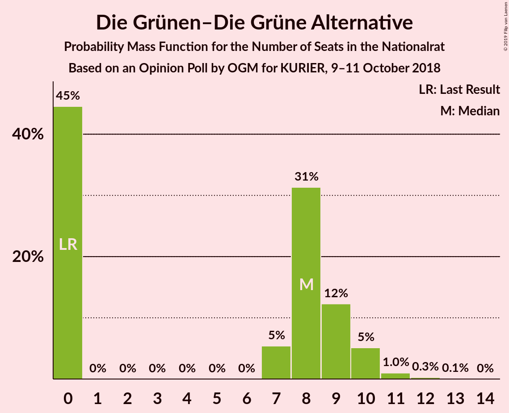
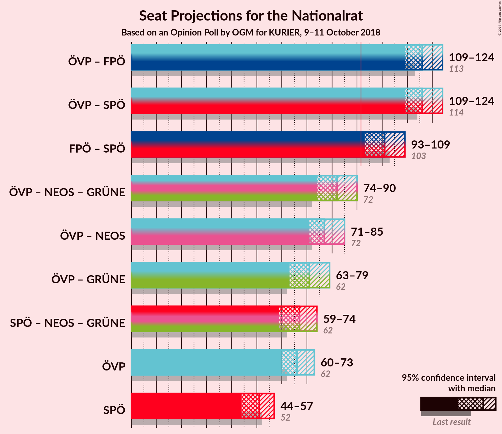

# Opinion Poll by OGM for KURIER, 9–11 October 2018

<a href="#voting-intentions">Voting Intentions</a> | <a href="#seats">Seats</a> | <a href="#coalitions">Coalitions</a> | <a href="#technical-information">Technical Information</a>

## Voting Intentions

### Confidence Intervals

| Party | Last Result | Poll Result | 80% Confidence Interval | 90% Confidence Interval | 95% Confidence Interval | 99% Confidence Interval |
|:-----:|:-----------:|:-----------:|:-----------------------:|:-----------------------:|:-----------------------:|:-----------------------:|
| Österreichische Volkspartei | 31.5% | 34.0% | 31.9–36.2% |31.4–36.9% |30.8–37.4% |29.8–38.5% |
| Sozialdemokratische Partei Österreichs | 26.9% | 26.1% | 24.1–28.1% |23.6–28.7% |23.1–29.2% |22.2–30.2% |
| Freiheitliche Partei Österreichs | 26.0% | 26.1% | 24.1–28.1% |23.6–28.7% |23.1–29.2% |22.2–30.2% |
| NEOS–Das Neue Österreich und Liberales Forum | 5.3% | 6.0% | 5.0–7.2% |4.8–7.5% |4.5–7.8% |4.1–8.5% |
| Die Grünen–Die Grüne Alternative | 3.8% | 4.0% | 3.2–5.0% |3.0–5.3% |2.8–5.6% |2.5–6.1% |
| JETZT–Liste Pilz | 4.4% | 2.0% | 1.5–2.8% |1.3–3.0% |1.2–3.2% |1.0–3.6% |

*Note:* The poll result column reflects the actual value used in the calculations. Published results may vary slightly, and in addition be rounded to fewer digits.

## Seats

### Confidence Intervals

| Party | Last Result | Median | 80% Confidence Interval | 90% Confidence Interval | 95% Confidence Interval | 99% Confidence Interval |
|:-----:|:-----------:|:------:|:-----------------------:|:-----------------------:|:-----------------------:|:-----------------------:|
| <a href="#österreichische-volkspartei">Österreichische Volkspartei</a> | 62 | 66 | 65–67 |65–67 |63–73 |61–74 |
| <a href="#sozialdemokratische-partei-österreichs">Sozialdemokratische Partei Österreichs</a> | 52 | 52 | 49–53 |48–53 |46–53 |45–61 |
| <a href="#freiheitliche-partei-österreichs">Freiheitliche Partei Österreichs</a> | 51 | 46 | 46–47 |46–47 |46–52 |46–53 |
| <a href="#neos–das-neue-österreich-und-liberales-forum">NEOS–Das Neue Österreich und Liberales Forum</a> | 10 | 9 | 9–14 |9–14 |9–14 |8–14 |
| <a href="#die-grünen–die-grüne-alternative">Die Grünen–Die Grüne Alternative</a> | 0 | 9 | 9 |9 |0–9 |0–10 |
| <a href="#jetzt–liste-pilz">JETZT–Liste Pilz</a> | 8 | 0 | 0 |0 |0 |0 |

### Österreichische Volkspartei

*For a full overview of the results for this party, see the [Österreichische Volkspartei](party-österreichischevolkspartei.html) page.*

| Number of Seats | Probability | Accumulated | Special Marks |
|:---------------:|:-----------:|:-----------:|:-------------:|
| 59 | 0.1% | 100% |  |
| 60 | 0% | 99.9% |  |
| 61 | 2% | 99.9% |  |
| 62 | 0% | 98% | Last Result |
| 63 | 1.3% | 98% |  |
| 64 | 0% | 97% |  |
| 65 | 42% | 97% |  |
| 66 | 42% | 55% | Median |
| 67 | 9% | 13% |  |
| 68 | 0% | 3% |  |
| 69 | 0% | 3% |  |
| 70 | 0% | 3% |  |
| 71 | 0% | 3% |  |
| 72 | 0% | 3% |  |
| 73 | 2% | 3% |  |
| 74 | 2% | 2% |  |
| 75 | 0% | 0% |  |

### Sozialdemokratische Partei Österreichs

*For a full overview of the results for this party, see the [Sozialdemokratische Partei Österreichs](party-sozialdemokratischeparteiösterreichs.html) page.*

| Number of Seats | Probability | Accumulated | Special Marks |
|:---------------:|:-----------:|:-----------:|:-------------:|
| 44 | 0% | 100% |  |
| 45 | 1.3% | 99.9% |  |
| 46 | 2% | 98.6% |  |
| 47 | 0% | 97% |  |
| 48 | 4% | 97% |  |
| 49 | 39% | 93% |  |
| 50 | 2% | 54% |  |
| 51 | 0% | 53% |  |
| 52 | 8% | 53% | Last Result, Median |
| 53 | 43% | 45% |  |
| 54 | 0% | 2% |  |
| 55 | 0% | 2% |  |
| 56 | 0% | 2% |  |
| 57 | 0% | 2% |  |
| 58 | 0% | 2% |  |
| 59 | 0% | 2% |  |
| 60 | 0% | 2% |  |
| 61 | 2% | 2% |  |
| 62 | 0% | 0% |  |

### Freiheitliche Partei Österreichs

*For a full overview of the results for this party, see the [Freiheitliche Partei Österreichs](party-freiheitlicheparteiösterreichs.html) page.*

| Number of Seats | Probability | Accumulated | Special Marks |
|:---------------:|:-----------:|:-----------:|:-------------:|
| 46 | 90% | 100% | Median |
| 47 | 5% | 10% |  |
| 48 | 0% | 5% |  |
| 49 | 0% | 5% |  |
| 50 | 0% | 5% |  |
| 51 | 0% | 5% | Last Result |
| 52 | 3% | 5% |  |
| 53 | 2% | 2% |  |
| 54 | 0.1% | 0.1% |  |
| 55 | 0% | 0% |  |

### NEOS–Das Neue Österreich und Liberales Forum

*For a full overview of the results for this party, see the [NEOS–Das Neue Österreich und Liberales Forum](party-neos–dasneueösterreichundliberalesforum.html) page.*

| Number of Seats | Probability | Accumulated | Special Marks |
|:---------------:|:-----------:|:-----------:|:-------------:|
| 8 | 2% | 100% |  |
| 9 | 51% | 98% | Median |
| 10 | 0% | 47% | Last Result |
| 11 | 2% | 47% |  |
| 12 | 2% | 45% |  |
| 13 | 1.3% | 44% |  |
| 14 | 42% | 43% |  |
| 15 | 0% | 0.1% |  |
| 16 | 0% | 0.1% |  |
| 17 | 0% | 0% |  |

### Die Grünen–Die Grüne Alternative

*For a full overview of the results for this party, see the [Die Grünen–Die Grüne Alternative](party-diegrünen–diegrünealternative.html) page.*

| Number of Seats | Probability | Accumulated | Special Marks |
|:---------------:|:-----------:|:-----------:|:-------------:|
| 0 | 5% | 100% | Last Result |
| 1 | 0% | 95% |  |
| 2 | 0% | 95% |  |
| 3 | 0% | 95% |  |
| 4 | 0% | 95% |  |
| 5 | 0% | 95% |  |
| 6 | 0% | 95% |  |
| 7 | 0% | 95% |  |
| 8 | 0% | 95% |  |
| 9 | 94% | 95% | Median |
| 10 | 1.3% | 1.4% |  |
| 11 | 0% | 0.1% |  |
| 12 | 0% | 0.1% |  |
| 13 | 0% | 0.1% |  |
| 14 | 0.1% | 0.1% |  |
| 15 | 0% | 0% |  |

### JETZT–Liste Pilz

*For a full overview of the results for this party, see the [JETZT–Liste Pilz](party-jetzt–listepilz.html) page.*

| Number of Seats | Probability | Accumulated | Special Marks |
|:---------------:|:-----------:|:-----------:|:-------------:|
| 0 | 100% | 100% | Median |
| 1 | 0% | 0% |  |
| 2 | 0% | 0% |  |
| 3 | 0% | 0% |  |
| 4 | 0% | 0% |  |
| 5 | 0% | 0% |  |
| 6 | 0% | 0% |  |
| 7 | 0% | 0% |  |
| 8 | 0% | 0% | Last Result |

## Coalitions

### Confidence Intervals

| Coalition | Last Result | Median | Majority? | 80% Confidence Interval | 90% Confidence Interval | 95% Confidence Interval | 99% Confidence Interval |
|:---------:|:-----------:|:------:|:---------:|:-----------------------:|:-----------------------:|:-----------------------:|:-----------------------:|
| Österreichische Volkspartei – Sozialdemokratische Partei Österreichs | 114 | 119 | 100% | 114–119 | 113–119 | 113–122 | 108–124 |
| Österreichische Volkspartei – Freiheitliche Partei Österreichs | 113 | 112 | 100% | 111–113 | 111–113 | 111–121 | 111–126 |
| Freiheitliche Partei Österreichs – Sozialdemokratische Partei Österreichs | 103 | 98 | 100% | 95–99 | 95–99 | 95–99 | 95–113 |
| Österreichische Volkspartei | 62 | 66 | 0% | 65–67 | 65–67 | 63–73 | 61–74 |
| Sozialdemokratische Partei Österreichs | 52 | 52 | 0% | 49–53 | 48–53 | 46–53 | 45–61 |

### Österreichische Volkspartei – Sozialdemokratische Partei Österreichs

| Number of Seats | Probability | Accumulated | Special Marks |
|:---------------:|:-----------:|:-----------:|:-------------:|
| 108 | 1.3% | 100% |  |
| 109 | 0% | 98.7% |  |
| 110 | 0% | 98.7% |  |
| 111 | 0% | 98.7% |  |
| 112 | 0.1% | 98.7% |  |
| 113 | 4% | 98.6% |  |
| 114 | 39% | 95% | Last Result |
| 115 | 0% | 56% |  |
| 116 | 0% | 56% |  |
| 117 | 0% | 56% |  |
| 118 | 0% | 56% | Median |
| 119 | 51% | 56% |  |
| 120 | 2% | 5% |  |
| 121 | 0% | 3% |  |
| 122 | 2% | 3% |  |
| 123 | 0% | 2% |  |
| 124 | 2% | 2% |  |
| 125 | 0% | 0% |  |

### Österreichische Volkspartei – Freiheitliche Partei Österreichs

| Number of Seats | Probability | Accumulated | Special Marks |
|:---------------:|:-----------:|:-----------:|:-------------:|
| 105 | 0.1% | 100% |  |
| 106 | 0% | 99.9% |  |
| 107 | 0% | 99.9% |  |
| 108 | 0% | 99.9% |  |
| 109 | 0% | 99.9% |  |
| 110 | 0% | 99.9% |  |
| 111 | 39% | 99.9% |  |
| 112 | 46% | 61% | Median |
| 113 | 11% | 15% | Last Result |
| 114 | 0% | 5% |  |
| 115 | 1.3% | 5% |  |
| 116 | 0% | 3% |  |
| 117 | 0% | 3% |  |
| 118 | 0% | 3% |  |
| 119 | 0% | 3% |  |
| 120 | 0% | 3% |  |
| 121 | 2% | 3% |  |
| 122 | 0% | 2% |  |
| 123 | 0% | 2% |  |
| 124 | 0% | 2% |  |
| 125 | 0% | 2% |  |
| 126 | 2% | 2% |  |
| 127 | 0% | 0% |  |

### Freiheitliche Partei Österreichs – Sozialdemokratische Partei Österreichs

| Number of Seats | Probability | Accumulated | Special Marks |
|:---------------:|:-----------:|:-----------:|:-------------:|
| 95 | 42% | 100% |  |
| 96 | 0% | 57% |  |
| 97 | 3% | 57% |  |
| 98 | 8% | 55% | Median |
| 99 | 45% | 47% |  |
| 100 | 0% | 2% |  |
| 101 | 0% | 2% |  |
| 102 | 0% | 2% |  |
| 103 | 0% | 2% | Last Result |
| 104 | 0% | 2% |  |
| 105 | 0% | 2% |  |
| 106 | 0% | 2% |  |
| 107 | 0% | 2% |  |
| 108 | 0% | 2% |  |
| 109 | 0% | 2% |  |
| 110 | 0% | 2% |  |
| 111 | 0% | 2% |  |
| 112 | 0% | 2% |  |
| 113 | 2% | 2% |  |
| 114 | 0% | 0% |  |

### Österreichische Volkspartei

| Number of Seats | Probability | Accumulated | Special Marks |
|:---------------:|:-----------:|:-----------:|:-------------:|
| 59 | 0.1% | 100% |  |
| 60 | 0% | 99.9% |  |
| 61 | 2% | 99.9% |  |
| 62 | 0% | 98% | Last Result |
| 63 | 1.3% | 98% |  |
| 64 | 0% | 97% |  |
| 65 | 42% | 97% |  |
| 66 | 42% | 55% | Median |
| 67 | 9% | 13% |  |
| 68 | 0% | 3% |  |
| 69 | 0% | 3% |  |
| 70 | 0% | 3% |  |
| 71 | 0% | 3% |  |
| 72 | 0% | 3% |  |
| 73 | 2% | 3% |  |
| 74 | 2% | 2% |  |
| 75 | 0% | 0% |  |

### Sozialdemokratische Partei Österreichs

| Number of Seats | Probability | Accumulated | Special Marks |
|:---------------:|:-----------:|:-----------:|:-------------:|
| 44 | 0% | 100% |  |
| 45 | 1.3% | 99.9% |  |
| 46 | 2% | 98.6% |  |
| 47 | 0% | 97% |  |
| 48 | 4% | 97% |  |
| 49 | 39% | 93% |  |
| 50 | 2% | 54% |  |
| 51 | 0% | 53% |  |
| 52 | 8% | 53% | Last Result, Median |
| 53 | 43% | 45% |  |
| 54 | 0% | 2% |  |
| 55 | 0% | 2% |  |
| 56 | 0% | 2% |  |
| 57 | 0% | 2% |  |
| 58 | 0% | 2% |  |
| 59 | 0% | 2% |  |
| 60 | 0% | 2% |  |
| 61 | 2% | 2% |  |
| 62 | 0% | 0% |  |

## Technical Information

### Opinion Poll

+ **Polling firm:** OGM
+ **Commissioner(s):** KURIER
+ **Fieldwork period:** 9–11 October 2018

### Calculations

+ **Sample size:** 802
+ **Simulations done:** 1,024
+ **Error estimate:** 2.62%

