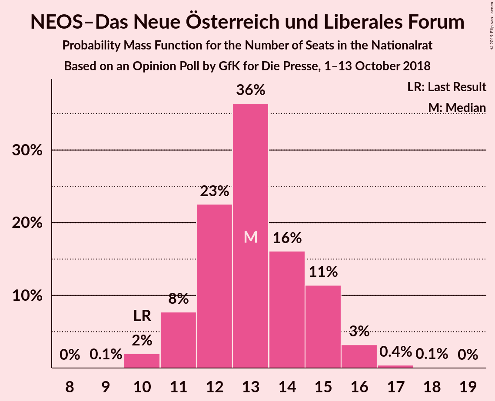
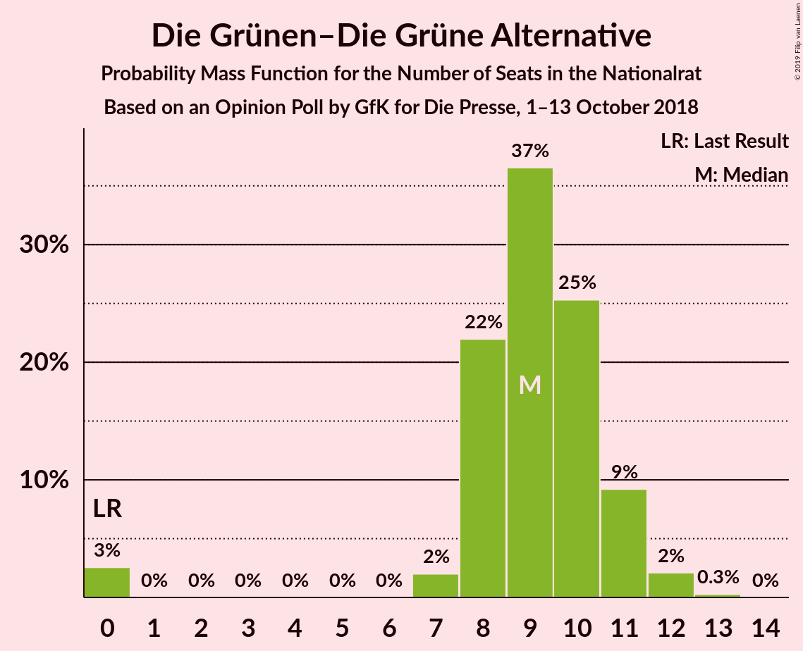
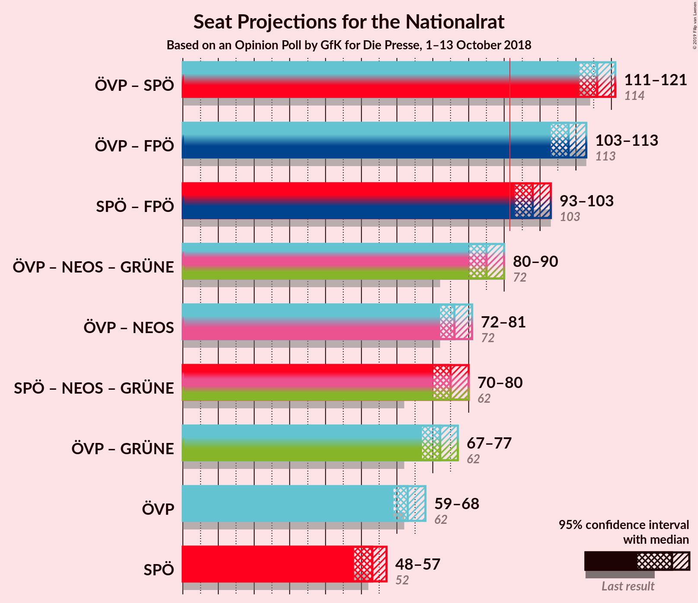
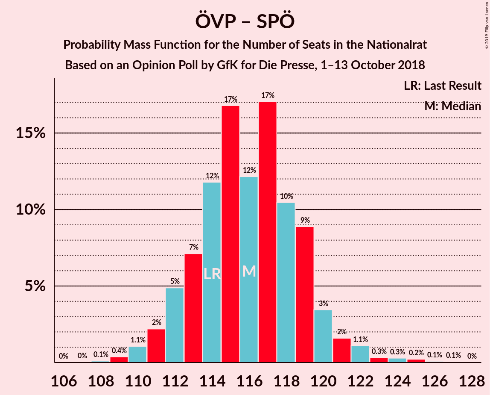

# Opinion Poll by GfK for Die Presse, 1–13 October 2018

<a href="#voting-intentions">Voting Intentions</a> | <a href="#seats">Seats</a> | <a href="#coalitions">Coalitions</a> | <a href="#technical-information">Technical Information</a>

## Voting Intentions

### Confidence Intervals

| Party | Last Result | Poll Result | 80% Confidence Interval | 90% Confidence Interval | 95% Confidence Interval | 99% Confidence Interval |
|:-----:|:-----------:|:-----------:|:-----------------------:|:-----------------------:|:-----------------------:|:-----------------------:|
| Österreichische Volkspartei | 31.5% | 33.0% | 31.5–34.6% |31.0–35.0% |30.7–35.4% |29.9–36.2% |
| Sozialdemokratische Partei Österreichs | 26.9% | 27.5% | 26.1–29.1% |25.7–29.5% |25.3–29.9% |24.6–30.6% |
| Freiheitliche Partei Österreichs | 26.0% | 23.5% | 22.2–25.0% |21.8–25.4% |21.4–25.8% |20.8–26.5% |
| NEOS–Das Neue Österreich und Liberales Forum | 5.3% | 7.0% | 6.2–7.9% |6.0–8.2% |5.8–8.4% |5.5–8.9% |
| Die Grünen–Die Grüne Alternative | 3.8% | 5.0% | 4.3–5.8% |4.2–6.0% |4.0–6.2% |3.7–6.6% |
| JETZT–Liste Pilz | 4.4% | 2.0% | 1.6–2.6% |1.5–2.7% |1.4–2.9% |1.2–3.1% |

*Note:* The poll result column reflects the actual value used in the calculations. Published results may vary slightly, and in addition be rounded to fewer digits.

## Seats

### Confidence Intervals

| Party | Last Result | Median | 80% Confidence Interval | 90% Confidence Interval | 95% Confidence Interval | 99% Confidence Interval |
|:-----:|:-----------:|:------:|:-----------------------:|:-----------------------:|:-----------------------:|:-----------------------:|
| <a href="#österreichische-volkspartei">Österreichische Volkspartei</a> | 62 | 61 | 61–68 |61–68 |61–68 |58–71 |
| <a href="#sozialdemokratische-partei-österreichs">Sozialdemokratische Partei Österreichs</a> | 52 | 55 | 51–55 |51–58 |50–58 |49–58 |
| <a href="#freiheitliche-partei-österreichs">Freiheitliche Partei Österreichs</a> | 51 | 46 | 44–46 |43–46 |41–46 |41–50 |
| <a href="#neos–das-neue-österreich-und-liberales-forum">NEOS–Das Neue Österreich und Liberales Forum</a> | 10 | 12 | 11–15 |11–15 |10–15 |10–16 |
| <a href="#die-grünen–die-grüne-alternative">Die Grünen–Die Grüne Alternative</a> | 0 | 9 | 0–9 |0–10 |0–11 |0–12 |
| <a href="#jetzt–liste-pilz">JETZT–Liste Pilz</a> | 8 | 0 | 0 |0 |0 |0 |

### Österreichische Volkspartei

*For a full overview of the results for this party, see the [Österreichische Volkspartei](party-österreichischevolkspartei.html) page.*

| Number of Seats | Probability | Accumulated | Special Marks |
|:---------------:|:-----------:|:-----------:|:-------------:|
| 57 | 0.1% | 100% |  |
| 58 | 0.4% | 99.8% |  |
| 59 | 0.1% | 99.5% |  |
| 60 | 2% | 99.4% |  |
| 61 | 63% | 98% | Median |
| 62 | 0% | 34% | Last Result |
| 63 | 0.2% | 34% |  |
| 64 | 9% | 34% |  |
| 65 | 0% | 26% |  |
| 66 | 0.3% | 26% |  |
| 67 | 2% | 25% |  |
| 68 | 21% | 23% |  |
| 69 | 0.2% | 2% |  |
| 70 | 1.4% | 2% |  |
| 71 | 0.6% | 0.7% |  |
| 72 | 0.1% | 0.1% |  |
| 73 | 0% | 0% |  |

### Sozialdemokratische Partei Österreichs

*For a full overview of the results for this party, see the [Sozialdemokratische Partei Österreichs](party-sozialdemokratischeparteiösterreichs.html) page.*

| Number of Seats | Probability | Accumulated | Special Marks |
|:---------------:|:-----------:|:-----------:|:-------------:|
| 48 | 0.4% | 100% |  |
| 49 | 0.6% | 99.6% |  |
| 50 | 3% | 98.9% |  |
| 51 | 18% | 96% |  |
| 52 | 2% | 77% | Last Result |
| 53 | 2% | 75% |  |
| 54 | 0.2% | 73% |  |
| 55 | 63% | 72% | Median |
| 56 | 0% | 9% |  |
| 57 | 0% | 9% |  |
| 58 | 9% | 9% |  |
| 59 | 0.3% | 0.4% |  |
| 60 | 0.1% | 0.1% |  |
| 61 | 0% | 0% |  |

### Freiheitliche Partei Österreichs

*For a full overview of the results for this party, see the [Freiheitliche Partei Österreichs](party-freiheitlicheparteiösterreichs.html) page.*

| Number of Seats | Probability | Accumulated | Special Marks |
|:---------------:|:-----------:|:-----------:|:-------------:|
| 40 | 0% | 100% |  |
| 41 | 3% | 99.9% |  |
| 42 | 0% | 97% |  |
| 43 | 3% | 97% |  |
| 44 | 18% | 94% |  |
| 45 | 0% | 76% |  |
| 46 | 73% | 76% | Median |
| 47 | 0.3% | 2% |  |
| 48 | 0% | 2% |  |
| 49 | 0.5% | 2% |  |
| 50 | 2% | 2% |  |
| 51 | 0% | 0% | Last Result |

### NEOS–Das Neue Österreich und Liberales Forum

*For a full overview of the results for this party, see the [NEOS–Das Neue Österreich und Liberales Forum](party-neos–dasneueösterreichundliberalesforum.html) page.*

| Number of Seats | Probability | Accumulated | Special Marks |
|:---------------:|:-----------:|:-----------:|:-------------:|
| 9 | 0.2% | 100% |  |
| 10 | 3% | 99.8% | Last Result |
| 11 | 18% | 97% |  |
| 12 | 65% | 79% | Median |
| 13 | 2% | 13% |  |
| 14 | 0.8% | 12% |  |
| 15 | 11% | 11% |  |
| 16 | 0.1% | 0.5% |  |
| 17 | 0.4% | 0.4% |  |
| 18 | 0% | 0% |  |

### Die Grünen–Die Grüne Alternative

*For a full overview of the results for this party, see the [Die Grünen–Die Grüne Alternative](party-diegrünen–diegrünealternative.html) page.*

| Number of Seats | Probability | Accumulated | Special Marks |
|:---------------:|:-----------:|:-----------:|:-------------:|
| 0 | 11% | 100% | Last Result |
| 1 | 0% | 89% |  |
| 2 | 0% | 89% |  |
| 3 | 0% | 89% |  |
| 4 | 0% | 89% |  |
| 5 | 0% | 89% |  |
| 6 | 0% | 89% |  |
| 7 | 0.1% | 89% |  |
| 8 | 0.7% | 89% |  |
| 9 | 83% | 89% | Median |
| 10 | 1.1% | 6% |  |
| 11 | 3% | 5% |  |
| 12 | 2% | 2% |  |
| 13 | 0.1% | 0.1% |  |
| 14 | 0% | 0% |  |

### JETZT–Liste Pilz

*For a full overview of the results for this party, see the [JETZT–Liste Pilz](party-jetzt–listepilz.html) page.*

| Number of Seats | Probability | Accumulated | Special Marks |
|:---------------:|:-----------:|:-----------:|:-------------:|
| 0 | 100% | 100% | Median |
| 1 | 0% | 0% |  |
| 2 | 0% | 0% |  |
| 3 | 0% | 0% |  |
| 4 | 0% | 0% |  |
| 5 | 0% | 0% |  |
| 6 | 0% | 0% |  |
| 7 | 0% | 0% |  |
| 8 | 0% | 0% | Last Result |

## Coalitions

### Confidence Intervals

| Coalition | Last Result | Median | Majority? | 80% Confidence Interval | 90% Confidence Interval | 95% Confidence Interval | 99% Confidence Interval |
|:---------:|:-----------:|:------:|:---------:|:-----------------------:|:-----------------------:|:-----------------------:|:-----------------------:|
| Österreichische Volkspartei – Sozialdemokratische Partei Österreichs | 114 | 116 | 100% | 116–121 | 116–122 | 112–122 | 110–123 |
| Österreichische Volkspartei – Freiheitliche Partei Österreichs | 113 | 107 | 100% | 107–112 | 107–112 | 106–113 | 104–120 |
| Sozialdemokratische Partei Österreichs – Freiheitliche Partei Österreichs | 103 | 101 | 99.4% | 95–101 | 95–104 | 94–104 | 90–104 |
| Österreichische Volkspartei | 62 | 61 | 0% | 61–68 | 61–68 | 61–68 | 58–71 |
| Sozialdemokratische Partei Österreichs | 52 | 55 | 0% | 51–55 | 51–58 | 50–58 | 49–58 |

### Österreichische Volkspartei – Sozialdemokratische Partei Österreichs

| Number of Seats | Probability | Accumulated | Special Marks |
|:---------------:|:-----------:|:-----------:|:-------------:|
| 109 | 0.1% | 100% |  |
| 110 | 2% | 99.9% |  |
| 111 | 0.1% | 98% |  |
| 112 | 0.5% | 98% |  |
| 113 | 0% | 97% |  |
| 114 | 0.1% | 97% | Last Result |
| 115 | 0% | 97% |  |
| 116 | 63% | 97% | Median |
| 117 | 0.5% | 34% |  |
| 118 | 0% | 34% |  |
| 119 | 20% | 34% |  |
| 120 | 2% | 13% |  |
| 121 | 2% | 11% |  |
| 122 | 8% | 9% |  |
| 123 | 0.6% | 0.7% |  |
| 124 | 0% | 0.1% |  |
| 125 | 0% | 0.1% |  |
| 126 | 0.1% | 0.1% |  |
| 127 | 0% | 0% |  |

### Österreichische Volkspartei – Freiheitliche Partei Österreichs

| Number of Seats | Probability | Accumulated | Special Marks |
|:---------------:|:-----------:|:-----------:|:-------------:|
| 102 | 0.1% | 100% |  |
| 103 | 0.2% | 99.9% |  |
| 104 | 0.4% | 99.8% |  |
| 105 | 0.3% | 99.4% |  |
| 106 | 2% | 99.0% |  |
| 107 | 63% | 97% | Median |
| 108 | 0.1% | 34% |  |
| 109 | 2% | 34% |  |
| 110 | 11% | 32% |  |
| 111 | 0.1% | 21% |  |
| 112 | 19% | 21% |  |
| 113 | 0.4% | 3% | Last Result |
| 114 | 0% | 2% |  |
| 115 | 0.1% | 2% |  |
| 116 | 0% | 2% |  |
| 117 | 0.5% | 2% |  |
| 118 | 0% | 1.4% |  |
| 119 | 0% | 1.4% |  |
| 120 | 1.4% | 1.4% |  |
| 121 | 0% | 0% |  |

### Sozialdemokratische Partei Österreichs – Freiheitliche Partei Österreichs

| Number of Seats | Probability | Accumulated | Special Marks |
|:---------------:|:-----------:|:-----------:|:-------------:|
| 90 | 0.6% | 100% |  |
| 91 | 0% | 99.4% |  |
| 92 | 0.2% | 99.4% | Majority |
| 93 | 0% | 99.2% |  |
| 94 | 2% | 99.1% |  |
| 95 | 21% | 97% |  |
| 96 | 2% | 76% |  |
| 97 | 0.3% | 74% |  |
| 98 | 0.1% | 74% |  |
| 99 | 0.1% | 74% |  |
| 100 | 2% | 74% |  |
| 101 | 63% | 72% | Median |
| 102 | 0% | 9% |  |
| 103 | 0.1% | 9% | Last Result |
| 104 | 9% | 9% |  |
| 105 | 0.3% | 0.3% |  |
| 106 | 0% | 0% |  |

### Österreichische Volkspartei

| Number of Seats | Probability | Accumulated | Special Marks |
|:---------------:|:-----------:|:-----------:|:-------------:|
| 57 | 0.1% | 100% |  |
| 58 | 0.4% | 99.8% |  |
| 59 | 0.1% | 99.5% |  |
| 60 | 2% | 99.4% |  |
| 61 | 63% | 98% | Median |
| 62 | 0% | 34% | Last Result |
| 63 | 0.2% | 34% |  |
| 64 | 9% | 34% |  |
| 65 | 0% | 26% |  |
| 66 | 0.3% | 26% |  |
| 67 | 2% | 25% |  |
| 68 | 21% | 23% |  |
| 69 | 0.2% | 2% |  |
| 70 | 1.4% | 2% |  |
| 71 | 0.6% | 0.7% |  |
| 72 | 0.1% | 0.1% |  |
| 73 | 0% | 0% |  |

### Sozialdemokratische Partei Österreichs

| Number of Seats | Probability | Accumulated | Special Marks |
|:---------------:|:-----------:|:-----------:|:-------------:|
| 48 | 0.4% | 100% |  |
| 49 | 0.6% | 99.6% |  |
| 50 | 3% | 98.9% |  |
| 51 | 18% | 96% |  |
| 52 | 2% | 77% | Last Result |
| 53 | 2% | 75% |  |
| 54 | 0.2% | 73% |  |
| 55 | 63% | 72% | Median |
| 56 | 0% | 9% |  |
| 57 | 0% | 9% |  |
| 58 | 9% | 9% |  |
| 59 | 0.3% | 0.4% |  |
| 60 | 0.1% | 0.1% |  |
| 61 | 0% | 0% |  |

## Technical Information

### Opinion Poll

+ **Polling firm:** GfK
+ **Commissioner(s):** Die Presse
+ **Fieldwork period:** 1–13 October 2018

### Calculations

+ **Sample size:** 1500
+ **Simulations done:** 1,024
+ **Error estimate:** 3.02%

