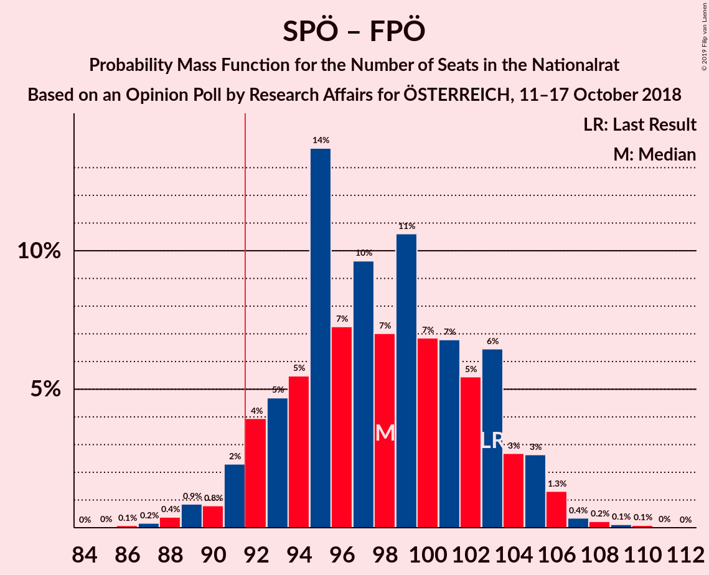

# Opinion Poll by Research Affairs for ÖSTERREICH, 11–17 October 2018

<a href="#voting-intentions">Voting Intentions</a> | <a href="#seats">Seats</a> | <a href="#coalitions">Coalitions</a> | <a href="#technical-information">Technical Information</a>

## Voting Intentions

### Confidence Intervals

| Party | Last Result | Poll Result | 80% Confidence Interval | 90% Confidence Interval | 95% Confidence Interval | 99% Confidence Interval |
|:-----:|:-----------:|:-----------:|:-----------------------:|:-----------------------:|:-----------------------:|:-----------------------:|
| Österreichische Volkspartei | 31.5% | 34.0% | 32.1–35.9% |31.6–36.5% |31.1–37.0% |30.2–37.9% |
| Sozialdemokratische Partei Österreichs | 26.9% | 26.0% | 24.2–27.8% |23.8–28.3% |23.4–28.8% |22.5–29.7% |
| Freiheitliche Partei Österreichs | 26.0% | 24.0% | 22.3–25.8% |21.8–26.3% |21.4–26.7% |20.7–27.6% |
| NEOS–Das Neue Österreich und Liberales Forum | 5.3% | 7.0% | 6.1–8.1% |5.8–8.5% |5.6–8.7% |5.2–9.3% |
| Die Grünen–Die Grüne Alternative | 3.8% | 4.0% | 3.3–4.9% |3.1–5.2% |2.9–5.4% |2.6–5.9% |
| JETZT–Liste Pilz | 4.4% | 2.0% | 1.5–2.7% |1.4–2.9% |1.3–3.1% |1.1–3.4% |

*Note:* The poll result column reflects the actual value used in the calculations. Published results may vary slightly, and in addition be rounded to fewer digits.

## Seats

### Confidence Intervals

| Party | Last Result | Median | 80% Confidence Interval | 90% Confidence Interval | 95% Confidence Interval | 99% Confidence Interval |
|:-----:|:-----------:|:------:|:-----------------------:|:-----------------------:|:-----------------------:|:-----------------------:|
| <a href="#österreichische-volkspartei">Österreichische Volkspartei</a> | 62 | 67 | 62–72 |61–72 |60–73 |59–74 |
| <a href="#sozialdemokratische-partei-österreichs">Sozialdemokratische Partei Österreichs</a> | 52 | 51 | 47–55 |46–56 |45–57 |44–59 |
| <a href="#freiheitliche-partei-österreichs">Freiheitliche Partei Österreichs</a> | 51 | 47 | 43–51 |42–52 |41–53 |40–55 |
| <a href="#neos–das-neue-österreich-und-liberales-forum">NEOS–Das Neue Österreich und Liberales Forum</a> | 10 | 13 | 11–16 |11–16 |10–17 |10–18 |
| <a href="#die-grünen–die-grüne-alternative">Die Grünen–Die Grüne Alternative</a> | 0 | 7 | 0–9 |0–10 |0–10 |0–11 |
| <a href="#jetzt–liste-pilz">JETZT–Liste Pilz</a> | 8 | 0 | 0 |0 |0 |0 |

### Österreichische Volkspartei

*For a full overview of the results for this party, see the [Österreichische Volkspartei](party-österreichischevolkspartei.html) page.*

| Number of Seats | Probability | Accumulated | Special Marks |
|:---------------:|:-----------:|:-----------:|:-------------:|
| 56 | 0.1% | 100% |  |
| 57 | 0.1% | 99.9% |  |
| 58 | 0.3% | 99.8% |  |
| 59 | 0.8% | 99.5% |  |
| 60 | 2% | 98.7% |  |
| 61 | 4% | 97% |  |
| 62 | 6% | 93% | Last Result |
| 63 | 8% | 87% |  |
| 64 | 3% | 79% |  |
| 65 | 8% | 76% |  |
| 66 | 14% | 68% |  |
| 67 | 24% | 54% | Median |
| 68 | 9% | 30% |  |
| 69 | 3% | 21% |  |
| 70 | 0.9% | 18% |  |
| 71 | 6% | 17% |  |
| 72 | 8% | 11% |  |
| 73 | 3% | 4% |  |
| 74 | 0.5% | 0.9% |  |
| 75 | 0% | 0.4% |  |
| 76 | 0.1% | 0.3% |  |
| 77 | 0.1% | 0.2% |  |
| 78 | 0.1% | 0.1% |  |
| 79 | 0% | 0% |  |

### Sozialdemokratische Partei Österreichs

*For a full overview of the results for this party, see the [Sozialdemokratische Partei Österreichs](party-sozialdemokratischeparteiösterreichs.html) page.*

| Number of Seats | Probability | Accumulated | Special Marks |
|:---------------:|:-----------:|:-----------:|:-------------:|
| 42 | 0.1% | 100% |  |
| 43 | 0.2% | 99.8% |  |
| 44 | 1.0% | 99.6% |  |
| 45 | 2% | 98.6% |  |
| 46 | 3% | 97% |  |
| 47 | 7% | 93% |  |
| 48 | 11% | 87% |  |
| 49 | 10% | 76% |  |
| 50 | 13% | 66% |  |
| 51 | 10% | 53% | Median |
| 52 | 14% | 43% | Last Result |
| 53 | 12% | 29% |  |
| 54 | 6% | 17% |  |
| 55 | 3% | 11% |  |
| 56 | 4% | 7% |  |
| 57 | 2% | 4% |  |
| 58 | 0.9% | 1.4% |  |
| 59 | 0.2% | 0.5% |  |
| 60 | 0.2% | 0.3% |  |
| 61 | 0.1% | 0.1% |  |
| 62 | 0% | 0% |  |

### Freiheitliche Partei Österreichs

*For a full overview of the results for this party, see the [Freiheitliche Partei Österreichs](party-freiheitlicheparteiösterreichs.html) page.*

| Number of Seats | Probability | Accumulated | Special Marks |
|:---------------:|:-----------:|:-----------:|:-------------:|
| 38 | 0.1% | 100% |  |
| 39 | 0.2% | 99.9% |  |
| 40 | 0.8% | 99.7% |  |
| 41 | 2% | 98.9% |  |
| 42 | 3% | 97% |  |
| 43 | 7% | 95% |  |
| 44 | 9% | 88% |  |
| 45 | 7% | 79% |  |
| 46 | 16% | 72% |  |
| 47 | 16% | 57% | Median |
| 48 | 11% | 40% |  |
| 49 | 10% | 29% |  |
| 50 | 8% | 19% |  |
| 51 | 5% | 11% | Last Result |
| 52 | 3% | 6% |  |
| 53 | 1.3% | 3% |  |
| 54 | 1.0% | 2% |  |
| 55 | 0.5% | 0.7% |  |
| 56 | 0.1% | 0.2% |  |
| 57 | 0% | 0% |  |

### NEOS–Das Neue Österreich und Liberales Forum

*For a full overview of the results for this party, see the [NEOS–Das Neue Österreich und Liberales Forum](party-neos–dasneueösterreichundliberalesforum.html) page.*

| Number of Seats | Probability | Accumulated | Special Marks |
|:---------------:|:-----------:|:-----------:|:-------------:|
| 9 | 0.4% | 100% |  |
| 10 | 2% | 99.6% | Last Result |
| 11 | 8% | 97% |  |
| 12 | 14% | 89% |  |
| 13 | 30% | 75% | Median |
| 14 | 21% | 45% |  |
| 15 | 13% | 24% |  |
| 16 | 7% | 10% |  |
| 17 | 2% | 3% |  |
| 18 | 0.7% | 1.1% |  |
| 19 | 0.3% | 0.3% |  |
| 20 | 0% | 0.1% |  |
| 21 | 0% | 0% |  |

### Die Grünen–Die Grüne Alternative

*For a full overview of the results for this party, see the [Die Grünen–Die Grüne Alternative](party-diegrünen–diegrünealternative.html) page.*

| Number of Seats | Probability | Accumulated | Special Marks |
|:---------------:|:-----------:|:-----------:|:-------------:|
| 0 | 45% | 100% | Last Result |
| 1 | 0% | 55% |  |
| 2 | 0% | 55% |  |
| 3 | 0% | 55% |  |
| 4 | 0% | 55% |  |
| 5 | 0% | 55% |  |
| 6 | 0% | 55% |  |
| 7 | 7% | 55% | Median |
| 8 | 30% | 48% |  |
| 9 | 13% | 18% |  |
| 10 | 4% | 5% |  |
| 11 | 0.9% | 1.1% |  |
| 12 | 0.2% | 0.2% |  |
| 13 | 0% | 0% |  |

### JETZT–Liste Pilz

*For a full overview of the results for this party, see the [JETZT–Liste Pilz](party-jetzt–listepilz.html) page.*

| Number of Seats | Probability | Accumulated | Special Marks |
|:---------------:|:-----------:|:-----------:|:-------------:|
| 0 | 100% | 100% | Median |
| 1 | 0% | 0% |  |
| 2 | 0% | 0% |  |
| 3 | 0% | 0% |  |
| 4 | 0% | 0% |  |
| 5 | 0% | 0% |  |
| 6 | 0% | 0% |  |
| 7 | 0% | 0% |  |
| 8 | 0% | 0% | Last Result |

## Coalitions

### Confidence Intervals

| Coalition | Last Result | Median | Majority? | 80% Confidence Interval | 90% Confidence Interval | 95% Confidence Interval | 99% Confidence Interval |
|:---------:|:-----------:|:------:|:---------:|:-----------------------:|:-----------------------:|:-----------------------:|:-----------------------:|
| Österreichische Volkspartei – Sozialdemokratische Partei Österreichs | 114 | 117 | 100% | 112–123 | 111–124 | 110–125 | 107–127 |
| Österreichische Volkspartei – Freiheitliche Partei Österreichs | 113 | 113 | 100% | 108–119 | 107–120 | 106–121 | 104–123 |
| Sozialdemokratische Partei Österreichs – Freiheitliche Partei Österreichs | 103 | 98 | 95% | 93–103 | 92–104 | 91–105 | 88–107 |
| Österreichische Volkspartei – NEOS–Das Neue Österreich und Liberales Forum – Die Grünen–Die Grüne Alternative | 72 | 85 | 2% | 79–89 | 78–91 | 77–91 | 75–94 |
| Österreichische Volkspartei – NEOS–Das Neue Österreich und Liberales Forum | 72 | 80 | 0.1% | 75–85 | 74–86 | 73–87 | 71–89 |
| Österreichische Volkspartei – Die Grünen–Die Grüne Alternative | 62 | 71 | 0% | 66–76 | 65–76 | 64–77 | 61–81 |
| Sozialdemokratische Partei Österreichs – NEOS–Das Neue Österreich und Liberales Forum – Die Grünen–Die Grüne Alternative | 62 | 69 | 0% | 64–74 | 62–75 | 61–76 | 59–78 |
| Österreichische Volkspartei | 62 | 67 | 0% | 62–72 | 61–72 | 60–73 | 59–74 |
| Sozialdemokratische Partei Österreichs | 52 | 51 | 0% | 47–55 | 46–56 | 45–57 | 44–59 |

### Österreichische Volkspartei – Sozialdemokratische Partei Österreichs

| Number of Seats | Probability | Accumulated | Special Marks |
|:---------------:|:-----------:|:-----------:|:-------------:|
| 104 | 0% | 100% |  |
| 105 | 0.1% | 99.9% |  |
| 106 | 0.1% | 99.9% |  |
| 107 | 0.4% | 99.8% |  |
| 108 | 0.4% | 99.4% |  |
| 109 | 1.5% | 99.0% |  |
| 110 | 1.2% | 98% |  |
| 111 | 3% | 96% |  |
| 112 | 6% | 93% |  |
| 113 | 5% | 88% |  |
| 114 | 7% | 83% | Last Result |
| 115 | 10% | 76% |  |
| 116 | 12% | 66% |  |
| 117 | 7% | 54% |  |
| 118 | 7% | 47% | Median |
| 119 | 9% | 39% |  |
| 120 | 8% | 31% |  |
| 121 | 6% | 23% |  |
| 122 | 4% | 17% |  |
| 123 | 5% | 13% |  |
| 124 | 4% | 8% |  |
| 125 | 2% | 4% |  |
| 126 | 0.9% | 2% |  |
| 127 | 0.8% | 1.2% |  |
| 128 | 0.1% | 0.4% |  |
| 129 | 0.2% | 0.2% |  |
| 130 | 0% | 0% |  |

### Österreichische Volkspartei – Freiheitliche Partei Österreichs

| Number of Seats | Probability | Accumulated | Special Marks |
|:---------------:|:-----------:|:-----------:|:-------------:|
| 100 | 0% | 100% |  |
| 101 | 0% | 99.9% |  |
| 102 | 0.1% | 99.9% |  |
| 103 | 0.3% | 99.8% |  |
| 104 | 0.6% | 99.5% |  |
| 105 | 0.9% | 98.9% |  |
| 106 | 2% | 98% |  |
| 107 | 2% | 96% |  |
| 108 | 5% | 93% |  |
| 109 | 6% | 89% |  |
| 110 | 10% | 83% |  |
| 111 | 6% | 74% |  |
| 112 | 7% | 68% |  |
| 113 | 11% | 60% | Last Result |
| 114 | 8% | 50% | Median |
| 115 | 7% | 41% |  |
| 116 | 9% | 34% |  |
| 117 | 8% | 25% |  |
| 118 | 6% | 17% |  |
| 119 | 5% | 11% |  |
| 120 | 2% | 7% |  |
| 121 | 2% | 5% |  |
| 122 | 1.3% | 2% |  |
| 123 | 0.7% | 1.0% |  |
| 124 | 0.2% | 0.4% |  |
| 125 | 0.1% | 0.2% |  |
| 126 | 0% | 0.1% |  |
| 127 | 0% | 0% |  |

### Sozialdemokratische Partei Österreichs – Freiheitliche Partei Österreichs

| Number of Seats | Probability | Accumulated | Special Marks |
|:---------------:|:-----------:|:-----------:|:-------------:|
| 85 | 0% | 100% |  |
| 86 | 0.1% | 99.9% |  |
| 87 | 0.2% | 99.9% |  |
| 88 | 0.4% | 99.7% |  |
| 89 | 0.9% | 99.3% |  |
| 90 | 0.8% | 98% |  |
| 91 | 2% | 98% |  |
| 92 | 4% | 95% | Majority |
| 93 | 5% | 91% |  |
| 94 | 5% | 87% |  |
| 95 | 14% | 81% |  |
| 96 | 7% | 68% |  |
| 97 | 10% | 60% |  |
| 98 | 7% | 51% | Median |
| 99 | 11% | 44% |  |
| 100 | 7% | 33% |  |
| 101 | 7% | 26% |  |
| 102 | 5% | 19% |  |
| 103 | 6% | 14% | Last Result |
| 104 | 3% | 7% |  |
| 105 | 3% | 5% |  |
| 106 | 1.3% | 2% |  |
| 107 | 0.4% | 0.8% |  |
| 108 | 0.2% | 0.5% |  |
| 109 | 0.1% | 0.2% |  |
| 110 | 0.1% | 0.1% |  |
| 111 | 0% | 0% |  |

### Österreichische Volkspartei – NEOS–Das Neue Österreich und Liberales Forum – Die Grünen–Die Grüne Alternative

| Number of Seats | Probability | Accumulated | Special Marks |
|:---------------:|:-----------:|:-----------:|:-------------:|
| 72 | 0% | 100% | Last Result |
| 73 | 0.1% | 99.9% |  |
| 74 | 0.2% | 99.8% |  |
| 75 | 0.5% | 99.6% |  |
| 76 | 0.9% | 99.1% |  |
| 77 | 2% | 98% |  |
| 78 | 3% | 96% |  |
| 79 | 3% | 93% |  |
| 80 | 7% | 90% |  |
| 81 | 6% | 83% |  |
| 82 | 7% | 77% |  |
| 83 | 7% | 69% |  |
| 84 | 11% | 62% |  |
| 85 | 7% | 51% |  |
| 86 | 9% | 44% |  |
| 87 | 7% | 35% | Median |
| 88 | 13% | 28% |  |
| 89 | 5% | 14% |  |
| 90 | 4% | 9% |  |
| 91 | 3% | 5% |  |
| 92 | 1.0% | 2% | Majority |
| 93 | 0.6% | 1.5% |  |
| 94 | 0.5% | 0.9% |  |
| 95 | 0.2% | 0.3% |  |
| 96 | 0.1% | 0.1% |  |
| 97 | 0% | 0% |  |

### Österreichische Volkspartei – NEOS–Das Neue Österreich und Liberales Forum

| Number of Seats | Probability | Accumulated | Special Marks |
|:---------------:|:-----------:|:-----------:|:-------------:|
| 69 | 0.1% | 100% |  |
| 70 | 0.2% | 99.9% |  |
| 71 | 0.7% | 99.7% |  |
| 72 | 0.9% | 99.0% | Last Result |
| 73 | 2% | 98% |  |
| 74 | 3% | 96% |  |
| 75 | 4% | 94% |  |
| 76 | 7% | 90% |  |
| 77 | 8% | 83% |  |
| 78 | 8% | 75% |  |
| 79 | 11% | 67% |  |
| 80 | 16% | 56% | Median |
| 81 | 8% | 40% |  |
| 82 | 8% | 32% |  |
| 83 | 6% | 24% |  |
| 84 | 6% | 18% |  |
| 85 | 3% | 12% |  |
| 86 | 5% | 9% |  |
| 87 | 2% | 4% |  |
| 88 | 0.9% | 2% |  |
| 89 | 0.5% | 0.8% |  |
| 90 | 0.2% | 0.3% |  |
| 91 | 0.1% | 0.2% |  |
| 92 | 0.1% | 0.1% | Majority |
| 93 | 0% | 0% |  |

### Österreichische Volkspartei – Die Grünen–Die Grüne Alternative

| Number of Seats | Probability | Accumulated | Special Marks |
|:---------------:|:-----------:|:-----------:|:-------------:|
| 59 | 0.1% | 100% |  |
| 60 | 0.2% | 99.9% |  |
| 61 | 0.4% | 99.7% |  |
| 62 | 0.9% | 99.3% | Last Result |
| 63 | 0.6% | 98% |  |
| 64 | 1.0% | 98% |  |
| 65 | 4% | 97% |  |
| 66 | 8% | 93% |  |
| 67 | 11% | 85% |  |
| 68 | 3% | 74% |  |
| 69 | 5% | 71% |  |
| 70 | 8% | 66% |  |
| 71 | 11% | 58% |  |
| 72 | 9% | 47% |  |
| 73 | 3% | 38% |  |
| 74 | 3% | 35% | Median |
| 75 | 20% | 32% |  |
| 76 | 8% | 12% |  |
| 77 | 1.3% | 4% |  |
| 78 | 0.1% | 2% |  |
| 79 | 0.2% | 2% |  |
| 80 | 1.0% | 2% |  |
| 81 | 0.8% | 1.0% |  |
| 82 | 0.2% | 0.2% |  |
| 83 | 0% | 0% |  |

### Sozialdemokratische Partei Österreichs – NEOS–Das Neue Österreich und Liberales Forum – Die Grünen–Die Grüne Alternative

| Number of Seats | Probability | Accumulated | Special Marks |
|:---------------:|:-----------:|:-----------:|:-------------:|
| 57 | 0.1% | 100% |  |
| 58 | 0.2% | 99.9% |  |
| 59 | 0.3% | 99.7% |  |
| 60 | 1.1% | 99.3% |  |
| 61 | 2% | 98% |  |
| 62 | 3% | 96% | Last Result |
| 63 | 3% | 94% |  |
| 64 | 5% | 91% |  |
| 65 | 6% | 86% |  |
| 66 | 9% | 80% |  |
| 67 | 10% | 71% |  |
| 68 | 7% | 61% |  |
| 69 | 8% | 54% |  |
| 70 | 12% | 45% |  |
| 71 | 7% | 34% | Median |
| 72 | 6% | 27% |  |
| 73 | 9% | 21% |  |
| 74 | 4% | 12% |  |
| 75 | 4% | 8% |  |
| 76 | 2% | 4% |  |
| 77 | 1.1% | 2% |  |
| 78 | 0.6% | 1.0% |  |
| 79 | 0.2% | 0.4% |  |
| 80 | 0.1% | 0.2% |  |
| 81 | 0% | 0.1% |  |
| 82 | 0% | 0% |  |

### Österreichische Volkspartei

| Number of Seats | Probability | Accumulated | Special Marks |
|:---------------:|:-----------:|:-----------:|:-------------:|
| 56 | 0.1% | 100% |  |
| 57 | 0.1% | 99.9% |  |
| 58 | 0.3% | 99.8% |  |
| 59 | 0.8% | 99.5% |  |
| 60 | 2% | 98.7% |  |
| 61 | 4% | 97% |  |
| 62 | 6% | 93% | Last Result |
| 63 | 8% | 87% |  |
| 64 | 3% | 79% |  |
| 65 | 8% | 76% |  |
| 66 | 14% | 68% |  |
| 67 | 24% | 54% | Median |
| 68 | 9% | 30% |  |
| 69 | 3% | 21% |  |
| 70 | 0.9% | 18% |  |
| 71 | 6% | 17% |  |
| 72 | 8% | 11% |  |
| 73 | 3% | 4% |  |
| 74 | 0.5% | 0.9% |  |
| 75 | 0% | 0.4% |  |
| 76 | 0.1% | 0.3% |  |
| 77 | 0.1% | 0.2% |  |
| 78 | 0.1% | 0.1% |  |
| 79 | 0% | 0% |  |

### Sozialdemokratische Partei Österreichs

| Number of Seats | Probability | Accumulated | Special Marks |
|:---------------:|:-----------:|:-----------:|:-------------:|
| 42 | 0.1% | 100% |  |
| 43 | 0.2% | 99.8% |  |
| 44 | 1.0% | 99.6% |  |
| 45 | 2% | 98.6% |  |
| 46 | 3% | 97% |  |
| 47 | 7% | 93% |  |
| 48 | 11% | 87% |  |
| 49 | 10% | 76% |  |
| 50 | 13% | 66% |  |
| 51 | 10% | 53% | Median |
| 52 | 14% | 43% | Last Result |
| 53 | 12% | 29% |  |
| 54 | 6% | 17% |  |
| 55 | 3% | 11% |  |
| 56 | 4% | 7% |  |
| 57 | 2% | 4% |  |
| 58 | 0.9% | 1.4% |  |
| 59 | 0.2% | 0.5% |  |
| 60 | 0.2% | 0.3% |  |
| 61 | 0.1% | 0.1% |  |
| 62 | 0% | 0% |  |

## Technical Information

### Opinion Poll

+ **Polling firm:** Research Affairs
+ **Commissioner(s):** ÖSTERREICH
+ **Fieldwork period:** 11–17 October 2018

### Calculations

+ **Sample size:** 1001
+ **Simulations done:** 131,072
+ **Error estimate:** 1.81%

