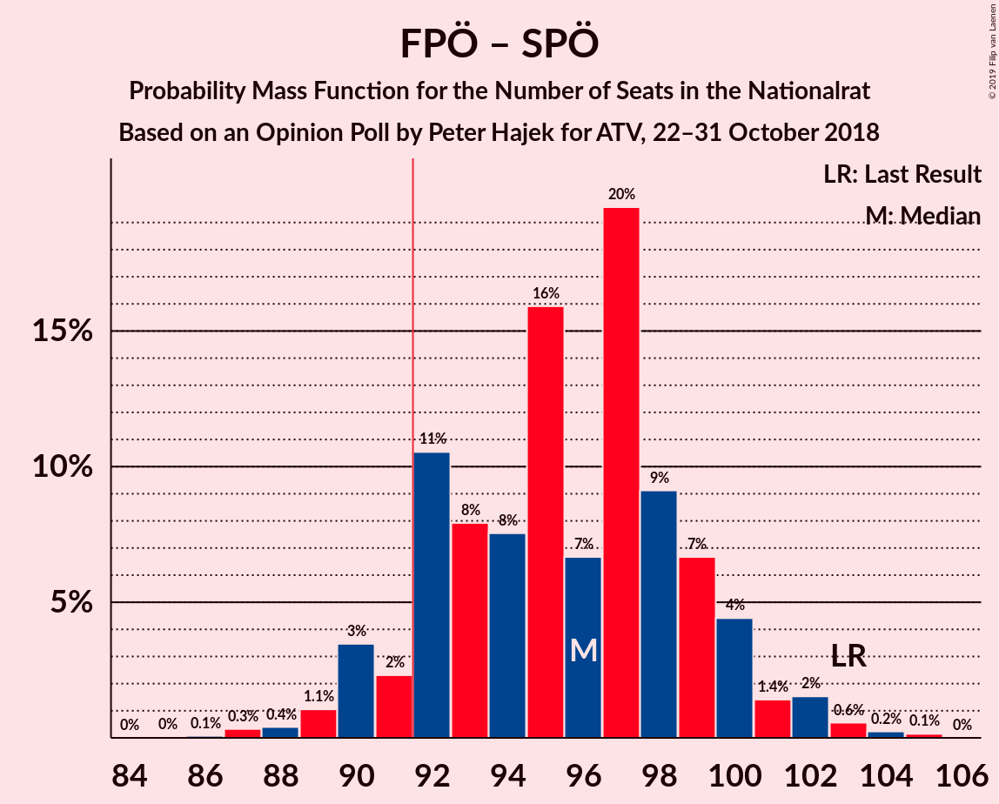

# Opinion Poll by Peter Hajek for ATV, 22–31 October 2018

<a href="#voting-intentions">Voting Intentions</a> | <a href="#seats">Seats</a> | <a href="#coalitions">Coalitions</a> | <a href="#technical-information">Technical Information</a>

## Voting Intentions

### Confidence Intervals

| Party | Last Result | Poll Result | 80% Confidence Interval | 90% Confidence Interval | 95% Confidence Interval | 99% Confidence Interval |
|:-----:|:-----------:|:-----------:|:-----------------------:|:-----------------------:|:-----------------------:|:-----------------------:|
| Österreichische Volkspartei | 31.5% | 33.0% | 31.1–34.9% |30.6–35.5% |30.1–36.0% |29.3–36.9% |
| Sozialdemokratische Partei Österreichs | 26.9% | 25.0% | 23.3–26.8% |22.8–27.3% |22.4–27.8% |21.6–28.7% |
| Freiheitliche Partei Österreichs | 26.0% | 25.0% | 23.3–26.8% |22.8–27.3% |22.4–27.8% |21.6–28.7% |
| NEOS–Das Neue Österreich und Liberales Forum | 5.3% | 7.0% | 6.1–8.2% |5.8–8.5% |5.6–8.8% |5.2–9.3% |
| Die Grünen–Die Grüne Alternative | 3.8% | 6.0% | 5.1–7.1% |4.9–7.4% |4.7–7.7% |4.3–8.2% |
| JETZT–Liste Pilz | 4.4% | 2.0% | 1.5–2.7% |1.4–2.9% |1.3–3.1% |1.1–3.4% |

*Note:* The poll result column reflects the actual value used in the calculations. Published results may vary slightly, and in addition be rounded to fewer digits.

## Seats

### Confidence Intervals

| Party | Last Result | Median | 80% Confidence Interval | 90% Confidence Interval | 95% Confidence Interval | 99% Confidence Interval |
|:-----:|:-----------:|:------:|:-----------------------:|:-----------------------:|:-----------------------:|:-----------------------:|
| <a href="#österreichische-volkspartei">Österreichische Volkspartei</a> | 62 | 64 | 64–70 |60–70 |60–70 |57–72 |
| <a href="#sozialdemokratische-partei-österreichs">Sozialdemokratische Partei Österreichs</a> | 52 | 51 | 46–51 |46–52 |44–55 |43–55 |
| <a href="#freiheitliche-partei-österreichs">Freiheitliche Partei Österreichs</a> | 51 | 44 | 44–46 |42–46 |41–50 |41–57 |
| <a href="#neos–das-neue-österreich-und-liberales-forum">NEOS–Das Neue Österreich und Liberales Forum</a> | 10 | 14 | 10–14 |10–15 |10–15 |10–16 |
| <a href="#die-grünen–die-grüne-alternative">Die Grünen–Die Grüne Alternative</a> | 0 | 10 | 10–12 |10–13 |10–14 |8–16 |
| <a href="#jetzt–liste-pilz">JETZT–Liste Pilz</a> | 8 | 0 | 0 |0 |0 |0 |

### Österreichische Volkspartei

*For a full overview of the results for this party, see the [Österreichische Volkspartei](party-österreichischevolkspartei.html) page.*

| Number of Seats | Probability | Accumulated | Special Marks |
|:---------------:|:-----------:|:-----------:|:-------------:|
| 55 | 0.1% | 100% |  |
| 56 | 0.3% | 99.9% |  |
| 57 | 0.7% | 99.5% |  |
| 58 | 0.3% | 98.8% |  |
| 59 | 0% | 98% |  |
| 60 | 4% | 98% |  |
| 61 | 0.2% | 95% |  |
| 62 | 3% | 95% | Last Result |
| 63 | 0.3% | 91% |  |
| 64 | 68% | 91% | Median |
| 65 | 0.3% | 23% |  |
| 66 | 0.7% | 22% |  |
| 67 | 0.1% | 22% |  |
| 68 | 3% | 22% |  |
| 69 | 0% | 19% |  |
| 70 | 18% | 19% |  |
| 71 | 0% | 0.7% |  |
| 72 | 0.6% | 0.7% |  |
| 73 | 0% | 0.1% |  |
| 74 | 0.1% | 0.1% |  |
| 75 | 0% | 0% |  |

### Sozialdemokratische Partei Österreichs

*For a full overview of the results for this party, see the [Sozialdemokratische Partei Österreichs](party-sozialdemokratischeparteiösterreichs.html) page.*

| Number of Seats | Probability | Accumulated | Special Marks |
|:---------------:|:-----------:|:-----------:|:-------------:|
| 41 | 0.1% | 100% |  |
| 42 | 0.2% | 99.9% |  |
| 43 | 2% | 99.7% |  |
| 44 | 1.0% | 98% |  |
| 45 | 0.4% | 97% |  |
| 46 | 18% | 97% |  |
| 47 | 0.1% | 78% |  |
| 48 | 3% | 78% |  |
| 49 | 0% | 75% |  |
| 50 | 0% | 75% |  |
| 51 | 68% | 75% | Median |
| 52 | 3% | 7% | Last Result |
| 53 | 0.3% | 4% |  |
| 54 | 0% | 4% |  |
| 55 | 4% | 4% |  |
| 56 | 0% | 0% |  |

### Freiheitliche Partei Österreichs

*For a full overview of the results for this party, see the [Freiheitliche Partei Österreichs](party-freiheitlicheparteiösterreichs.html) page.*

| Number of Seats | Probability | Accumulated | Special Marks |
|:---------------:|:-----------:|:-----------:|:-------------:|
| 40 | 0.1% | 100% |  |
| 41 | 3% | 99.9% |  |
| 42 | 3% | 97% |  |
| 43 | 0% | 93% |  |
| 44 | 68% | 93% | Median |
| 45 | 4% | 25% |  |
| 46 | 18% | 22% |  |
| 47 | 0.7% | 3% |  |
| 48 | 0.1% | 3% |  |
| 49 | 0% | 3% |  |
| 50 | 0.7% | 3% |  |
| 51 | 1.1% | 2% | Last Result |
| 52 | 0% | 0.7% |  |
| 53 | 0% | 0.7% |  |
| 54 | 0% | 0.7% |  |
| 55 | 0% | 0.7% |  |
| 56 | 0% | 0.7% |  |
| 57 | 0.7% | 0.7% |  |
| 58 | 0% | 0% |  |

### NEOS–Das Neue Österreich und Liberales Forum

*For a full overview of the results for this party, see the [NEOS–Das Neue Österreich und Liberales Forum](party-neos–dasneueösterreichundliberalesforum.html) page.*

| Number of Seats | Probability | Accumulated | Special Marks |
|:---------------:|:-----------:|:-----------:|:-------------:|
| 10 | 18% | 100% | Last Result |
| 11 | 6% | 82% |  |
| 12 | 0.1% | 75% |  |
| 13 | 0.3% | 75% |  |
| 14 | 70% | 75% | Median |
| 15 | 5% | 5% |  |
| 16 | 0.4% | 0.6% |  |
| 17 | 0% | 0.2% |  |
| 18 | 0.1% | 0.2% |  |
| 19 | 0% | 0.1% |  |
| 20 | 0.1% | 0.1% |  |
| 21 | 0% | 0% |  |

### Die Grünen–Die Grüne Alternative

*For a full overview of the results for this party, see the [Die Grünen–Die Grüne Alternative](party-diegrünen–diegrünealternative.html) page.*

| Number of Seats | Probability | Accumulated | Special Marks |
|:---------------:|:-----------:|:-----------:|:-------------:|
| 0 | 0% | 100% | Last Result |
| 1 | 0% | 100% |  |
| 2 | 0% | 100% |  |
| 3 | 0% | 100% |  |
| 4 | 0% | 100% |  |
| 5 | 0% | 100% |  |
| 6 | 0% | 100% |  |
| 7 | 0% | 100% |  |
| 8 | 0.7% | 100% |  |
| 9 | 0.4% | 99.3% |  |
| 10 | 68% | 98.9% | Median |
| 11 | 20% | 31% |  |
| 12 | 5% | 11% |  |
| 13 | 3% | 7% |  |
| 14 | 3% | 3% |  |
| 15 | 0.1% | 0.7% |  |
| 16 | 0.6% | 0.6% |  |
| 17 | 0% | 0% |  |

### JETZT–Liste Pilz

*For a full overview of the results for this party, see the [JETZT–Liste Pilz](party-jetzt–listepilz.html) page.*

| Number of Seats | Probability | Accumulated | Special Marks |
|:---------------:|:-----------:|:-----------:|:-------------:|
| 0 | 99.9% | 100% | Median |
| 1 | 0% | 0.1% |  |
| 2 | 0% | 0.1% |  |
| 3 | 0% | 0.1% |  |
| 4 | 0% | 0.1% |  |
| 5 | 0% | 0.1% |  |
| 6 | 0% | 0.1% |  |
| 7 | 0.1% | 0.1% |  |
| 8 | 0% | 0% | Last Result |

## Coalitions

### Confidence Intervals

| Coalition | Last Result | Median | Majority? | 80% Confidence Interval | 90% Confidence Interval | 95% Confidence Interval | 99% Confidence Interval |
|:---------:|:-----------:|:------:|:---------:|:-----------------------:|:-----------------------:|:-----------------------:|:-----------------------:|
| Österreichische Volkspartei – Sozialdemokratische Partei Österreichs | 114 | 115 | 100% | 115–116 | 114–116 | 109–116 | 101–116 |
| Österreichische Volkspartei – Freiheitliche Partei Österreichs | 113 | 108 | 100% | 108–116 | 105–116 | 103–116 | 103–117 |
| Freiheitliche Partei Österreichs – Sozialdemokratische Partei Österreichs | 103 | 95 | 96% | 92–95 | 92–99 | 90–100 | 85–101 |
| Österreichische Volkspartei | 62 | 64 | 0% | 64–70 | 60–70 | 60–70 | 57–72 |
| Sozialdemokratische Partei Österreichs | 52 | 51 | 0% | 46–51 | 46–52 | 44–55 | 43–55 |

### Österreichische Volkspartei – Sozialdemokratische Partei Österreichs

| Number of Seats | Probability | Accumulated | Special Marks |
|:---------------:|:-----------:|:-----------:|:-------------:|
| 101 | 0.7% | 100% |  |
| 102 | 0.3% | 99.3% |  |
| 103 | 0% | 99.0% |  |
| 104 | 0% | 98.9% |  |
| 105 | 0% | 98.9% |  |
| 106 | 0.4% | 98.9% |  |
| 107 | 0.3% | 98.5% |  |
| 108 | 0% | 98% |  |
| 109 | 1.4% | 98% |  |
| 110 | 0.1% | 97% |  |
| 111 | 0% | 97% |  |
| 112 | 0% | 97% |  |
| 113 | 0% | 97% |  |
| 114 | 3% | 97% | Last Result |
| 115 | 72% | 93% | Median |
| 116 | 21% | 21% |  |
| 117 | 0% | 0% |  |

### Österreichische Volkspartei – Freiheitliche Partei Österreichs

| Number of Seats | Probability | Accumulated | Special Marks |
|:---------------:|:-----------:|:-----------:|:-------------:|
| 103 | 3% | 100% |  |
| 104 | 0% | 97% |  |
| 105 | 4% | 97% |  |
| 106 | 0.4% | 93% |  |
| 107 | 0.1% | 92% |  |
| 108 | 68% | 92% | Median |
| 109 | 0% | 24% |  |
| 110 | 3% | 24% |  |
| 111 | 0.4% | 21% |  |
| 112 | 0.2% | 21% |  |
| 113 | 0.1% | 21% | Last Result |
| 114 | 1.3% | 21% |  |
| 115 | 0% | 19% |  |
| 116 | 18% | 19% |  |
| 117 | 0.7% | 0.8% |  |
| 118 | 0% | 0.1% |  |
| 119 | 0.1% | 0.1% |  |
| 120 | 0% | 0% |  |

### Freiheitliche Partei Österreichs – Sozialdemokratische Partei Österreichs

| Number of Seats | Probability | Accumulated | Special Marks |
|:---------------:|:-----------:|:-----------:|:-------------:|
| 85 | 0.6% | 100% |  |
| 86 | 0.1% | 99.4% |  |
| 87 | 0.1% | 99.3% |  |
| 88 | 0% | 99.2% |  |
| 89 | 0% | 99.2% |  |
| 90 | 3% | 99.2% |  |
| 91 | 0% | 96% |  |
| 92 | 19% | 96% | Majority |
| 93 | 3% | 77% |  |
| 94 | 1.0% | 74% |  |
| 95 | 68% | 73% | Median |
| 96 | 0% | 5% |  |
| 97 | 0.1% | 5% |  |
| 98 | 0% | 5% |  |
| 99 | 0.1% | 5% |  |
| 100 | 4% | 5% |  |
| 101 | 0.8% | 1.2% |  |
| 102 | 0% | 0.3% |  |
| 103 | 0.3% | 0.3% | Last Result |
| 104 | 0% | 0% |  |

### Österreichische Volkspartei

| Number of Seats | Probability | Accumulated | Special Marks |
|:---------------:|:-----------:|:-----------:|:-------------:|
| 55 | 0.1% | 100% |  |
| 56 | 0.3% | 99.9% |  |
| 57 | 0.7% | 99.5% |  |
| 58 | 0.3% | 98.8% |  |
| 59 | 0% | 98% |  |
| 60 | 4% | 98% |  |
| 61 | 0.2% | 95% |  |
| 62 | 3% | 95% | Last Result |
| 63 | 0.3% | 91% |  |
| 64 | 68% | 91% | Median |
| 65 | 0.3% | 23% |  |
| 66 | 0.7% | 22% |  |
| 67 | 0.1% | 22% |  |
| 68 | 3% | 22% |  |
| 69 | 0% | 19% |  |
| 70 | 18% | 19% |  |
| 71 | 0% | 0.7% |  |
| 72 | 0.6% | 0.7% |  |
| 73 | 0% | 0.1% |  |
| 74 | 0.1% | 0.1% |  |
| 75 | 0% | 0% |  |

### Sozialdemokratische Partei Österreichs

| Number of Seats | Probability | Accumulated | Special Marks |
|:---------------:|:-----------:|:-----------:|:-------------:|
| 41 | 0.1% | 100% |  |
| 42 | 0.2% | 99.9% |  |
| 43 | 2% | 99.7% |  |
| 44 | 1.0% | 98% |  |
| 45 | 0.4% | 97% |  |
| 46 | 18% | 97% |  |
| 47 | 0.1% | 78% |  |
| 48 | 3% | 78% |  |
| 49 | 0% | 75% |  |
| 50 | 0% | 75% |  |
| 51 | 68% | 75% | Median |
| 52 | 3% | 7% | Last Result |
| 53 | 0.3% | 4% |  |
| 54 | 0% | 4% |  |
| 55 | 4% | 4% |  |
| 56 | 0% | 0% |  |

## Technical Information

### Opinion Poll

+ **Polling firm:** Peter Hajek
+ **Commissioner(s):** ATV
+ **Fieldwork period:** 22–31 October 2018

### Calculations

+ **Sample size:** 1000
+ **Simulations done:** 1,024
+ **Error estimate:** 1.74%

