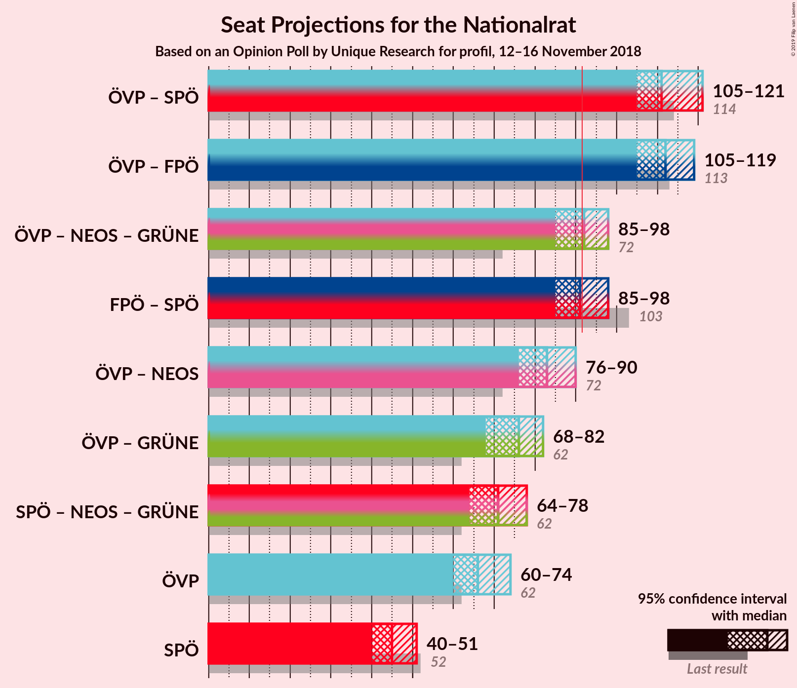
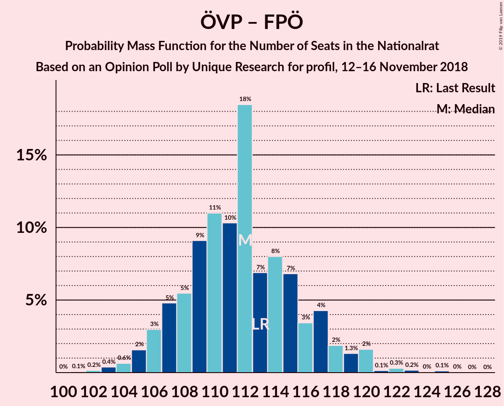
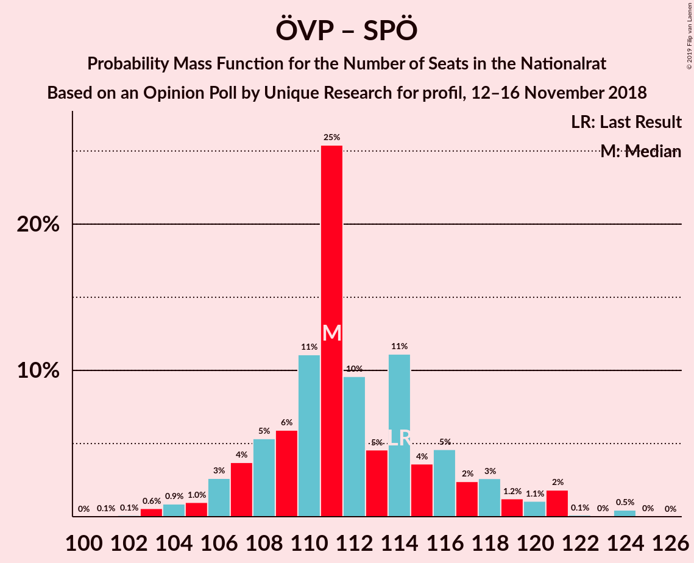
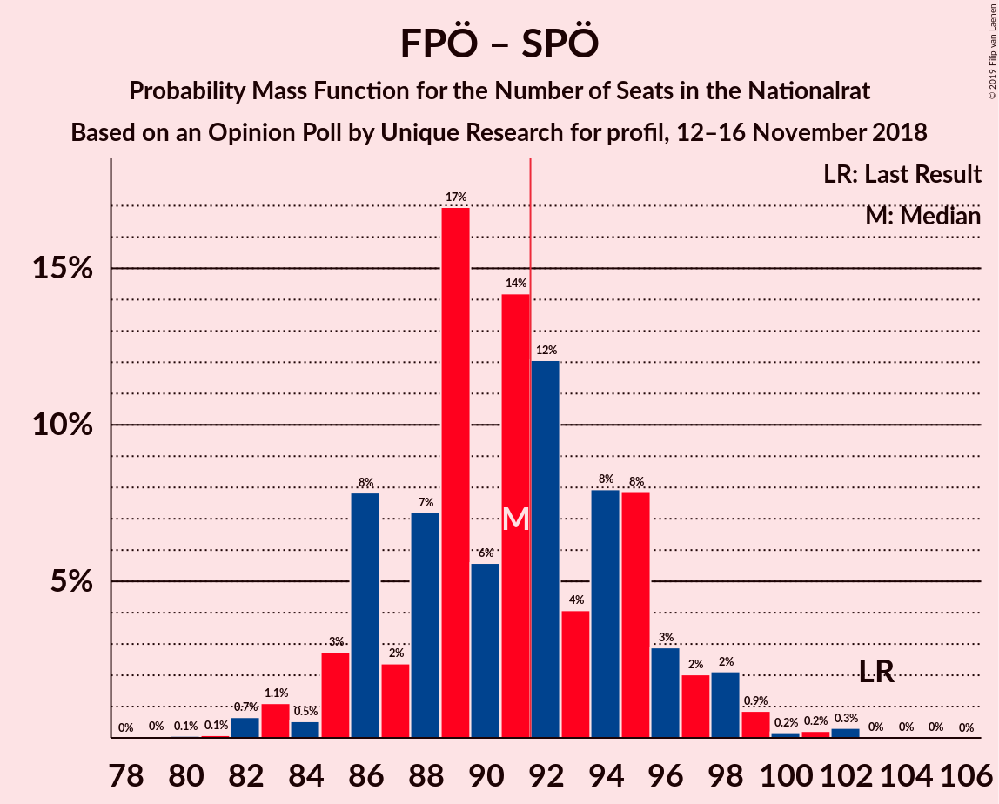

# Opinion Poll by Unique Research for profil, 12–16 November 2018

<a href="#voting-intentions">Voting Intentions</a> | <a href="#seats">Seats</a> | <a href="#coalitions">Coalitions</a> | <a href="#technical-information">Technical Information</a>

## Voting Intentions

### Confidence Intervals

| Party | Last Result | Poll Result | 80% Confidence Interval | 90% Confidence Interval | 95% Confidence Interval | 99% Confidence Interval |
|:-----:|:-----------:|:-----------:|:-----------------------:|:-----------------------:|:-----------------------:|:-----------------------:|
| Österreichische Volkspartei | 31.5% | 35.0% | 32.9–37.2% |32.3–37.8% |31.8–38.4% |30.8–39.4% |
| Sozialdemokratische Partei Österreichs | 26.9% | 24.0% | 22.1–26.0% |21.6–26.6% |21.2–27.1% |20.3–28.1% |
| Freiheitliche Partei Österreichs | 26.0% | 24.0% | 22.1–26.0% |21.6–26.6% |21.2–27.1% |20.3–28.1% |
| NEOS–Das Neue Österreich und Liberales Forum | 5.3% | 9.0% | 7.8–10.4% |7.5–10.8% |7.2–11.2% |6.7–11.9% |
| Die Grünen–Die Grüne Alternative | 3.8% | 5.0% | 4.1–6.1% |3.9–6.5% |3.7–6.8% |3.3–7.3% |
| JETZT–Liste Pilz | 4.4% | 2.0% | 1.5–2.8% |1.4–3.0% |1.2–3.2% |1.0–3.7% |

*Note:* The poll result column reflects the actual value used in the calculations. Published results may vary slightly, and in addition be rounded to fewer digits.

## Seats

### Confidence Intervals

| Party | Last Result | Median | 80% Confidence Interval | 90% Confidence Interval | 95% Confidence Interval | 99% Confidence Interval |
|:-----:|:-----------:|:------:|:-----------------------:|:-----------------------:|:-----------------------:|:-----------------------:|
| <a href="#österreichische-volkspartei">Österreichische Volkspartei</a> | 62 | 66 | 60–70 |58–70 |58–72 |58–72 |
| <a href="#sozialdemokratische-partei-österreichs">Sozialdemokratische Partei Österreichs</a> | 52 | 44 | 40–49 |40–49 |40–49 |39–49 |
| <a href="#freiheitliche-partei-österreichs">Freiheitliche Partei Österreichs</a> | 51 | 45 | 40–54 |40–54 |40–54 |40–54 |
| <a href="#neos–das-neue-österreich-und-liberales-forum">NEOS–Das Neue Österreich und Liberales Forum</a> | 10 | 17 | 15–21 |15–21 |15–21 |15–24 |
| <a href="#die-grünen–die-grüne-alternative">Die Grünen–Die Grüne Alternative</a> | 0 | 11 | 8–12 |8–12 |8–12 |7–14 |
| <a href="#jetzt–liste-pilz">JETZT–Liste Pilz</a> | 8 | 0 | 0 |0 |0 |0 |

### Österreichische Volkspartei

*For a full overview of the results for this party, see the [Österreichische Volkspartei](party-österreichischevolkspartei.html) page.*

| Number of Seats | Probability | Accumulated | Special Marks |
|:---------------:|:-----------:|:-----------:|:-------------:|
| 56 | 0.2% | 100% |  |
| 57 | 0% | 99.8% |  |
| 58 | 10% | 99.8% |  |
| 59 | 0.1% | 90% |  |
| 60 | 31% | 90% |  |
| 61 | 0% | 59% |  |
| 62 | 7% | 59% | Last Result |
| 63 | 0.7% | 52% |  |
| 64 | 1.2% | 52% |  |
| 65 | 0% | 50% |  |
| 66 | 4% | 50% | Median |
| 67 | 0% | 47% |  |
| 68 | 0% | 47% |  |
| 69 | 36% | 47% |  |
| 70 | 8% | 11% |  |
| 71 | 0.4% | 3% |  |
| 72 | 2% | 3% |  |
| 73 | 0% | 0.1% |  |
| 74 | 0% | 0.1% |  |
| 75 | 0% | 0.1% |  |
| 76 | 0% | 0.1% |  |
| 77 | 0.1% | 0.1% |  |
| 78 | 0% | 0% |  |

### Sozialdemokratische Partei Österreichs

*For a full overview of the results for this party, see the [Sozialdemokratische Partei Österreichs](party-sozialdemokratischeparteiösterreichs.html) page.*

| Number of Seats | Probability | Accumulated | Special Marks |
|:---------------:|:-----------:|:-----------:|:-------------:|
| 37 | 0.4% | 100% |  |
| 38 | 0% | 99.6% |  |
| 39 | 0.8% | 99.6% |  |
| 40 | 38% | 98.8% |  |
| 41 | 0% | 60% |  |
| 42 | 7% | 60% |  |
| 43 | 0% | 54% |  |
| 44 | 11% | 54% | Median |
| 45 | 0% | 42% |  |
| 46 | 32% | 42% |  |
| 47 | 0% | 11% |  |
| 48 | 0% | 11% |  |
| 49 | 10% | 11% |  |
| 50 | 0% | 0.4% |  |
| 51 | 0.1% | 0.4% |  |
| 52 | 0.2% | 0.3% | Last Result |
| 53 | 0% | 0% |  |

### Freiheitliche Partei Österreichs

*For a full overview of the results for this party, see the [Freiheitliche Partei Österreichs](party-freiheitlicheparteiösterreichs.html) page.*

| Number of Seats | Probability | Accumulated | Special Marks |
|:---------------:|:-----------:|:-----------:|:-------------:|
| 39 | 0% | 100% |  |
| 40 | 10% | 99.9% |  |
| 41 | 1.1% | 90% |  |
| 42 | 0% | 89% |  |
| 43 | 0% | 89% |  |
| 44 | 0.4% | 89% |  |
| 45 | 40% | 88% | Median |
| 46 | 35% | 48% |  |
| 47 | 0% | 13% |  |
| 48 | 0% | 13% |  |
| 49 | 0% | 13% |  |
| 50 | 0% | 13% |  |
| 51 | 0% | 13% | Last Result |
| 52 | 0% | 13% |  |
| 53 | 0% | 13% |  |
| 54 | 13% | 13% |  |
| 55 | 0% | 0% |  |

### NEOS–Das Neue Österreich und Liberales Forum

*For a full overview of the results for this party, see the [NEOS–Das Neue Österreich und Liberales Forum](party-neos–dasneueösterreichundliberalesforum.html) page.*

| Number of Seats | Probability | Accumulated | Special Marks |
|:---------------:|:-----------:|:-----------:|:-------------:|
| 10 | 0% | 100% | Last Result |
| 11 | 0% | 100% |  |
| 12 | 0% | 100% |  |
| 13 | 0.2% | 100% |  |
| 14 | 0% | 99.8% |  |
| 15 | 13% | 99.8% |  |
| 16 | 0% | 87% |  |
| 17 | 40% | 87% | Median |
| 18 | 0% | 47% |  |
| 19 | 0.1% | 47% |  |
| 20 | 35% | 47% |  |
| 21 | 10% | 11% |  |
| 22 | 0% | 1.0% |  |
| 23 | 0.4% | 1.0% |  |
| 24 | 0.6% | 0.6% |  |
| 25 | 0% | 0% |  |

### Die Grünen–Die Grüne Alternative

*For a full overview of the results for this party, see the [Die Grünen–Die Grüne Alternative](party-diegrünen–diegrünealternative.html) page.*

| Number of Seats | Probability | Accumulated | Special Marks |
|:---------------:|:-----------:|:-----------:|:-------------:|
| 0 | 0.1% | 100% | Last Result |
| 1 | 0% | 99.9% |  |
| 2 | 0% | 99.9% |  |
| 3 | 0% | 99.9% |  |
| 4 | 0% | 99.9% |  |
| 5 | 0% | 99.9% |  |
| 6 | 0% | 99.9% |  |
| 7 | 0.5% | 99.9% |  |
| 8 | 14% | 99.4% |  |
| 9 | 0.6% | 85% |  |
| 10 | 18% | 85% |  |
| 11 | 29% | 67% | Median |
| 12 | 36% | 37% |  |
| 13 | 0.7% | 1.2% |  |
| 14 | 0.5% | 0.5% |  |
| 15 | 0% | 0% |  |

### JETZT–Liste Pilz

*For a full overview of the results for this party, see the [JETZT–Liste Pilz](party-jetzt–listepilz.html) page.*

| Number of Seats | Probability | Accumulated | Special Marks |
|:---------------:|:-----------:|:-----------:|:-------------:|
| 0 | 100% | 100% | Median |
| 1 | 0% | 0% |  |
| 2 | 0% | 0% |  |
| 3 | 0% | 0% |  |
| 4 | 0% | 0% |  |
| 5 | 0% | 0% |  |
| 6 | 0% | 0% |  |
| 7 | 0% | 0% |  |
| 8 | 0% | 0% | Last Result |

## Coalitions

### Confidence Intervals

| Coalition | Last Result | Median | Majority? | 80% Confidence Interval | 90% Confidence Interval | 95% Confidence Interval | 99% Confidence Interval |
|:---------:|:-----------:|:------:|:---------:|:-----------------------:|:-----------------------:|:-----------------------:|:-----------------------:|
| Österreichische Volkspartei – Freiheitliche Partei Österreichs | 113 | 112 | 100% | 104–114 | 104–116 | 104–116 | 103–118 |
| Österreichische Volkspartei – Sozialdemokratische Partei Österreichs | 114 | 109 | 100% | 106–112 | 104–114 | 104–114 | 103–114 |
| Freiheitliche Partei Österreichs – Sozialdemokratische Partei Österreichs | 103 | 89 | 48% | 84–96 | 84–100 | 81–100 | 80–100 |
| Österreichische Volkspartei | 62 | 66 | 0% | 60–70 | 58–70 | 58–72 | 58–72 |
| Sozialdemokratische Partei Österreichs | 52 | 44 | 0% | 40–49 | 40–49 | 40–49 | 39–49 |

### Österreichische Volkspartei – Freiheitliche Partei Österreichs

| Number of Seats | Probability | Accumulated | Special Marks |
|:---------------:|:-----------:|:-----------:|:-------------:|
| 102 | 0.2% | 100% |  |
| 103 | 0.6% | 99.8% |  |
| 104 | 10% | 99.2% |  |
| 105 | 0.6% | 90% |  |
| 106 | 25% | 89% |  |
| 107 | 0% | 64% |  |
| 108 | 0.7% | 64% |  |
| 109 | 0% | 63% |  |
| 110 | 8% | 63% |  |
| 111 | 4% | 56% | Median |
| 112 | 2% | 52% |  |
| 113 | 0% | 50% | Last Result |
| 114 | 42% | 50% |  |
| 115 | 0.4% | 7% |  |
| 116 | 6% | 7% |  |
| 117 | 0% | 0.8% |  |
| 118 | 0.8% | 0.8% |  |
| 119 | 0% | 0% |  |

### Österreichische Volkspartei – Sozialdemokratische Partei Österreichs

| Number of Seats | Probability | Accumulated | Special Marks |
|:---------------:|:-----------:|:-----------:|:-------------:|
| 103 | 0.8% | 100% |  |
| 104 | 6% | 99.2% |  |
| 105 | 0.7% | 93% |  |
| 106 | 31% | 93% |  |
| 107 | 10% | 61% |  |
| 108 | 0.6% | 52% |  |
| 109 | 36% | 51% |  |
| 110 | 4% | 15% | Median |
| 111 | 0.6% | 11% |  |
| 112 | 2% | 10% |  |
| 113 | 0% | 8% |  |
| 114 | 8% | 8% | Last Result |
| 115 | 0% | 0.1% |  |
| 116 | 0% | 0.1% |  |
| 117 | 0% | 0.1% |  |
| 118 | 0% | 0.1% |  |
| 119 | 0% | 0.1% |  |
| 120 | 0% | 0.1% |  |
| 121 | 0% | 0.1% |  |
| 122 | 0% | 0.1% |  |
| 123 | 0.1% | 0.1% |  |
| 124 | 0% | 0% |  |

### Freiheitliche Partei Österreichs – Sozialdemokratische Partei Österreichs

| Number of Seats | Probability | Accumulated | Special Marks |
|:---------------:|:-----------:|:-----------:|:-------------:|
| 80 | 2% | 100% |  |
| 81 | 0.4% | 98% |  |
| 82 | 0% | 97% |  |
| 83 | 0% | 97% |  |
| 84 | 8% | 97% |  |
| 85 | 36% | 89% |  |
| 86 | 0% | 53% |  |
| 87 | 1.2% | 53% |  |
| 88 | 0% | 52% |  |
| 89 | 4% | 52% | Median |
| 90 | 0.6% | 49% |  |
| 91 | 0% | 48% |  |
| 92 | 25% | 48% | Majority |
| 93 | 0.8% | 23% |  |
| 94 | 0% | 22% |  |
| 95 | 10% | 22% |  |
| 96 | 6% | 13% |  |
| 97 | 0.1% | 7% |  |
| 98 | 0.2% | 6% |  |
| 99 | 0% | 6% |  |
| 100 | 6% | 6% |  |
| 101 | 0% | 0% |  |
| 102 | 0% | 0% |  |
| 103 | 0% | 0% | Last Result |

### Österreichische Volkspartei

| Number of Seats | Probability | Accumulated | Special Marks |
|:---------------:|:-----------:|:-----------:|:-------------:|
| 56 | 0.2% | 100% |  |
| 57 | 0% | 99.8% |  |
| 58 | 10% | 99.8% |  |
| 59 | 0.1% | 90% |  |
| 60 | 31% | 90% |  |
| 61 | 0% | 59% |  |
| 62 | 7% | 59% | Last Result |
| 63 | 0.7% | 52% |  |
| 64 | 1.2% | 52% |  |
| 65 | 0% | 50% |  |
| 66 | 4% | 50% | Median |
| 67 | 0% | 47% |  |
| 68 | 0% | 47% |  |
| 69 | 36% | 47% |  |
| 70 | 8% | 11% |  |
| 71 | 0.4% | 3% |  |
| 72 | 2% | 3% |  |
| 73 | 0% | 0.1% |  |
| 74 | 0% | 0.1% |  |
| 75 | 0% | 0.1% |  |
| 76 | 0% | 0.1% |  |
| 77 | 0.1% | 0.1% |  |
| 78 | 0% | 0% |  |

### Sozialdemokratische Partei Österreichs

| Number of Seats | Probability | Accumulated | Special Marks |
|:---------------:|:-----------:|:-----------:|:-------------:|
| 37 | 0.4% | 100% |  |
| 38 | 0% | 99.6% |  |
| 39 | 0.8% | 99.6% |  |
| 40 | 38% | 98.8% |  |
| 41 | 0% | 60% |  |
| 42 | 7% | 60% |  |
| 43 | 0% | 54% |  |
| 44 | 11% | 54% | Median |
| 45 | 0% | 42% |  |
| 46 | 32% | 42% |  |
| 47 | 0% | 11% |  |
| 48 | 0% | 11% |  |
| 49 | 10% | 11% |  |
| 50 | 0% | 0.4% |  |
| 51 | 0.1% | 0.4% |  |
| 52 | 0.2% | 0.3% | Last Result |
| 53 | 0% | 0% |  |

## Technical Information

### Opinion Poll

+ **Polling firm:** Unique Research
+ **Commissioner(s):** profil
+ **Fieldwork period:** 12–16 November 2018

### Calculations

+ **Sample size:** 800
+ **Simulations done:** 1,024
+ **Error estimate:** 2.36%

