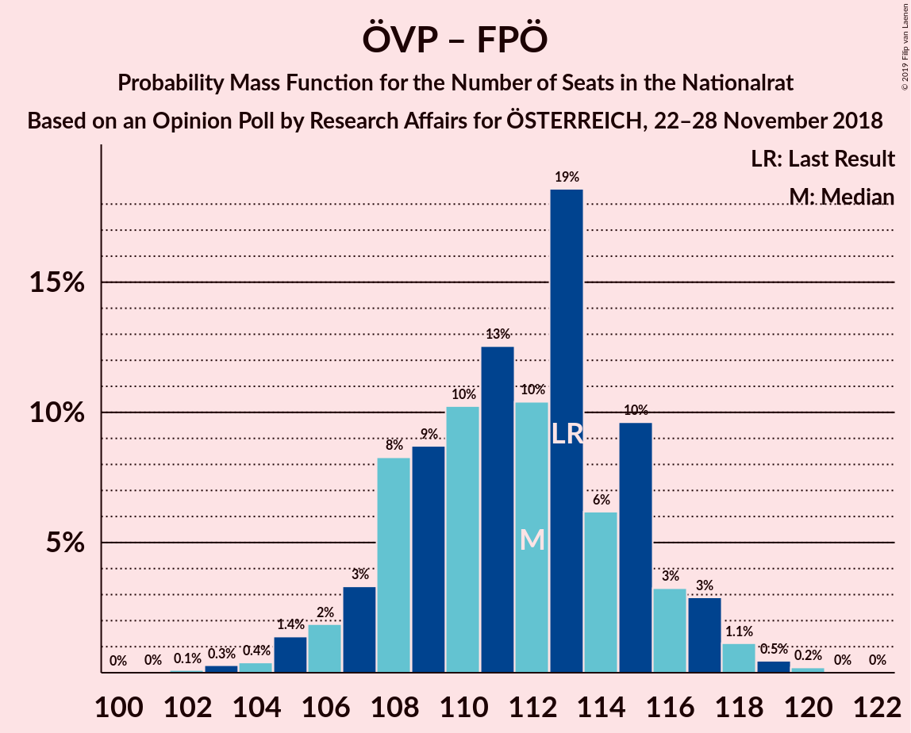
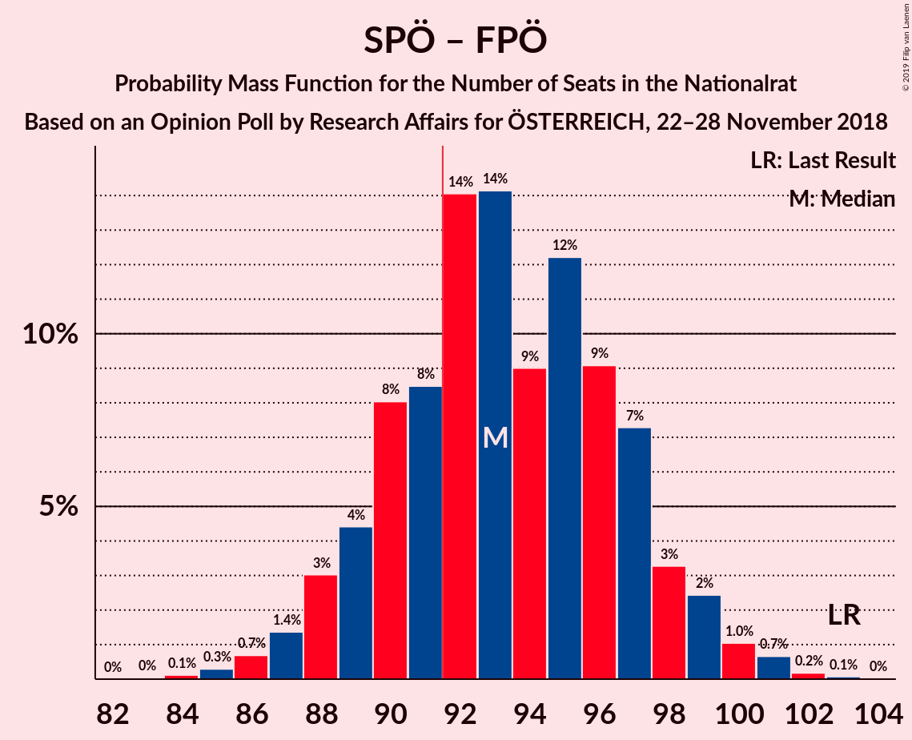

# Opinion Poll by Research Affairs for ÖSTERREICH, 22–28 November 2018

<a href="#voting-intentions">Voting Intentions</a> | <a href="#seats">Seats</a> | <a href="#coalitions">Coalitions</a> | <a href="#technical-information">Technical Information</a>

## Voting Intentions

### Confidence Intervals

| Party | Last Result | Poll Result | 80% Confidence Interval | 90% Confidence Interval | 95% Confidence Interval | 99% Confidence Interval |
|:-----:|:-----------:|:-----------:|:-----------------------:|:-----------------------:|:-----------------------:|:-----------------------:|
| Österreichische Volkspartei | 31.5% | 34.0% | 32.1–35.9% |31.6–36.5% |31.1–37.0% |30.2–37.9% |
| Sozialdemokratische Partei Österreichs | 26.9% | 25.0% | 23.3–26.8% |22.8–27.3% |22.4–27.8% |21.6–28.6% |
| Freiheitliche Partei Österreichs | 26.0% | 24.0% | 22.3–25.8% |21.8–26.3% |21.4–26.7% |20.7–27.6% |
| NEOS–Das Neue Österreich und Liberales Forum | 5.3% | 7.0% | 6.1–8.1% |5.8–8.5% |5.6–8.7% |5.2–9.3% |
| Die Grünen–Die Grüne Alternative | 3.8% | 6.0% | 5.1–7.1% |4.9–7.4% |4.7–7.7% |4.3–8.2% |
| JETZT–Liste Pilz | 4.4% | 2.0% | 1.5–2.7% |1.4–2.9% |1.3–3.1% |1.1–3.4% |

*Note:* The poll result column reflects the actual value used in the calculations. Published results may vary slightly, and in addition be rounded to fewer digits.

## Seats

### Confidence Intervals

| Party | Last Result | Median | 80% Confidence Interval | 90% Confidence Interval | 95% Confidence Interval | 99% Confidence Interval |
|:-----:|:-----------:|:------:|:-----------------------:|:-----------------------:|:-----------------------:|:-----------------------:|
| <a href="#österreichische-volkspartei">Österreichische Volkspartei</a> | 62 | 64 | 60–66 |59–68 |58–70 |58–70 |
| <a href="#sozialdemokratische-partei-österreichs">Sozialdemokratische Partei Österreichs</a> | 52 | 50 | 48–52 |47–52 |45–52 |41–52 |
| <a href="#freiheitliche-partei-österreichs">Freiheitliche Partei Österreichs</a> | 51 | 44 | 41–46 |41–53 |41–53 |41–54 |
| <a href="#neos–das-neue-österreich-und-liberales-forum">NEOS–Das Neue Österreich und Liberales Forum</a> | 10 | 13 | 12–16 |12–16 |12–16 |11–16 |
| <a href="#die-grünen–die-grüne-alternative">Die Grünen–Die Grüne Alternative</a> | 0 | 12 | 10–12 |8–12 |8–14 |7–16 |
| <a href="#jetzt–liste-pilz">JETZT–Liste Pilz</a> | 8 | 0 | 0 |0 |0 |0 |

### Österreichische Volkspartei

*For a full overview of the results for this party, see the [Österreichische Volkspartei](party-österreichischevolkspartei.html) page.*

| Number of Seats | Probability | Accumulated | Special Marks |
|:---------------:|:-----------:|:-----------:|:-------------:|
| 55 | 0.1% | 100% |  |
| 56 | 0% | 99.9% |  |
| 57 | 0.1% | 99.9% |  |
| 58 | 3% | 99.8% |  |
| 59 | 3% | 97% |  |
| 60 | 12% | 94% |  |
| 61 | 5% | 82% |  |
| 62 | 0.1% | 77% | Last Result |
| 63 | 0% | 77% |  |
| 64 | 52% | 77% | Median |
| 65 | 3% | 24% |  |
| 66 | 16% | 21% |  |
| 67 | 0% | 5% |  |
| 68 | 0.2% | 5% |  |
| 69 | 1.1% | 5% |  |
| 70 | 3% | 4% |  |
| 71 | 0.2% | 0.4% |  |
| 72 | 0% | 0.2% |  |
| 73 | 0% | 0.1% |  |
| 74 | 0% | 0.1% |  |
| 75 | 0% | 0.1% |  |
| 76 | 0.1% | 0.1% |  |
| 77 | 0% | 0% |  |

### Sozialdemokratische Partei Österreichs

*For a full overview of the results for this party, see the [Sozialdemokratische Partei Österreichs](party-sozialdemokratischeparteiösterreichs.html) page.*

| Number of Seats | Probability | Accumulated | Special Marks |
|:---------------:|:-----------:|:-----------:|:-------------:|
| 39 | 0.1% | 100% |  |
| 40 | 0% | 99.9% |  |
| 41 | 2% | 99.9% |  |
| 42 | 0.3% | 98% |  |
| 43 | 0% | 98% |  |
| 44 | 0% | 98% |  |
| 45 | 0.1% | 98% |  |
| 46 | 0.1% | 97% |  |
| 47 | 7% | 97% |  |
| 48 | 4% | 90% |  |
| 49 | 0% | 86% |  |
| 50 | 69% | 86% | Median |
| 51 | 0.2% | 16% |  |
| 52 | 16% | 16% | Last Result |
| 53 | 0.2% | 0.4% |  |
| 54 | 0% | 0.2% |  |
| 55 | 0.2% | 0.2% |  |
| 56 | 0% | 0.1% |  |
| 57 | 0% | 0% |  |

### Freiheitliche Partei Österreichs

*For a full overview of the results for this party, see the [Freiheitliche Partei Österreichs](party-freiheitlicheparteiösterreichs.html) page.*

| Number of Seats | Probability | Accumulated | Special Marks |
|:---------------:|:-----------:|:-----------:|:-------------:|
| 38 | 0.1% | 100% |  |
| 39 | 0% | 99.9% |  |
| 40 | 0.1% | 99.9% |  |
| 41 | 19% | 99.8% |  |
| 42 | 0.9% | 81% |  |
| 43 | 1.4% | 80% |  |
| 44 | 43% | 78% | Median |
| 45 | 25% | 35% |  |
| 46 | 2% | 11% |  |
| 47 | 0.1% | 8% |  |
| 48 | 0.5% | 8% |  |
| 49 | 0% | 8% |  |
| 50 | 0% | 8% |  |
| 51 | 0.2% | 8% | Last Result |
| 52 | 0.1% | 7% |  |
| 53 | 5% | 7% |  |
| 54 | 2% | 2% |  |
| 55 | 0.1% | 0.2% |  |
| 56 | 0.1% | 0.1% |  |
| 57 | 0% | 0% |  |

### NEOS–Das Neue Österreich und Liberales Forum

*For a full overview of the results for this party, see the [NEOS–Das Neue Österreich und Liberales Forum](party-neos–dasneueösterreichundliberalesforum.html) page.*

| Number of Seats | Probability | Accumulated | Special Marks |
|:---------------:|:-----------:|:-----------:|:-------------:|
| 8 | 0.1% | 100% |  |
| 9 | 0.1% | 99.9% |  |
| 10 | 0.1% | 99.8% | Last Result |
| 11 | 2% | 99.7% |  |
| 12 | 12% | 98% |  |
| 13 | 43% | 86% | Median |
| 14 | 8% | 43% |  |
| 15 | 18% | 35% |  |
| 16 | 17% | 17% |  |
| 17 | 0.1% | 0.1% |  |
| 18 | 0% | 0% |  |

### Die Grünen–Die Grüne Alternative

*For a full overview of the results for this party, see the [Die Grünen–Die Grüne Alternative](party-diegrünen–diegrünealternative.html) page.*

| Number of Seats | Probability | Accumulated | Special Marks |
|:---------------:|:-----------:|:-----------:|:-------------:|
| 0 | 0.3% | 100% | Last Result |
| 1 | 0% | 99.7% |  |
| 2 | 0% | 99.7% |  |
| 3 | 0% | 99.7% |  |
| 4 | 0% | 99.7% |  |
| 5 | 0% | 99.7% |  |
| 6 | 0% | 99.7% |  |
| 7 | 0.2% | 99.7% |  |
| 8 | 5% | 99.5% |  |
| 9 | 0.3% | 94% |  |
| 10 | 20% | 94% |  |
| 11 | 12% | 74% |  |
| 12 | 59% | 62% | Median |
| 13 | 0.1% | 3% |  |
| 14 | 0.6% | 3% |  |
| 15 | 0.2% | 2% |  |
| 16 | 2% | 2% |  |
| 17 | 0% | 0% |  |

### JETZT–Liste Pilz

*For a full overview of the results for this party, see the [JETZT–Liste Pilz](party-jetzt–listepilz.html) page.*

| Number of Seats | Probability | Accumulated | Special Marks |
|:---------------:|:-----------:|:-----------:|:-------------:|
| 0 | 100% | 100% | Median |
| 1 | 0% | 0% |  |
| 2 | 0% | 0% |  |
| 3 | 0% | 0% |  |
| 4 | 0% | 0% |  |
| 5 | 0% | 0% |  |
| 6 | 0% | 0% |  |
| 7 | 0% | 0% |  |
| 8 | 0% | 0% | Last Result |

## Coalitions

### Confidence Intervals

| Coalition | Last Result | Median | Majority? | 80% Confidence Interval | 90% Confidence Interval | 95% Confidence Interval | 99% Confidence Interval |
|:---------:|:-----------:|:------:|:---------:|:-----------------------:|:-----------------------:|:-----------------------:|:-----------------------:|
| Österreichische Volkspartei – Sozialdemokratische Partei Österreichs | 114 | 114 | 100% | 110–116 | 108–116 | 106–118 | 105–119 |
| Österreichische Volkspartei – Freiheitliche Partei Österreichs | 113 | 108 | 100% | 105–111 | 105–114 | 104–114 | 104–115 |
| Sozialdemokratische Partei Österreichs – Freiheitliche Partei Österreichs | 103 | 94 | 77% | 91–97 | 89–100 | 89–100 | 87–101 |
| Österreichische Volkspartei | 62 | 64 | 0% | 60–66 | 59–68 | 58–70 | 58–70 |
| Sozialdemokratische Partei Österreichs | 52 | 50 | 0% | 48–52 | 47–52 | 45–52 | 41–52 |

### Österreichische Volkspartei – Sozialdemokratische Partei Österreichs

| Number of Seats | Probability | Accumulated | Special Marks |
|:---------------:|:-----------:|:-----------:|:-------------:|
| 104 | 0% | 100% |  |
| 105 | 2% | 99.9% |  |
| 106 | 2% | 98% |  |
| 107 | 0.2% | 96% |  |
| 108 | 5% | 95% |  |
| 109 | 0% | 90% |  |
| 110 | 0.8% | 90% |  |
| 111 | 3% | 90% |  |
| 112 | 12% | 86% |  |
| 113 | 0.2% | 74% |  |
| 114 | 52% | 74% | Last Result, Median |
| 115 | 0.9% | 22% |  |
| 116 | 16% | 21% |  |
| 117 | 1.1% | 5% |  |
| 118 | 3% | 4% |  |
| 119 | 0.2% | 0.5% |  |
| 120 | 0% | 0.4% |  |
| 121 | 0.1% | 0.3% |  |
| 122 | 0% | 0.2% |  |
| 123 | 0.2% | 0.2% |  |
| 124 | 0% | 0% |  |

### Österreichische Volkspartei – Freiheitliche Partei Österreichs

| Number of Seats | Probability | Accumulated | Special Marks |
|:---------------:|:-----------:|:-----------:|:-------------:|
| 99 | 0% | 100% |  |
| 100 | 0% | 99.9% |  |
| 101 | 0% | 99.9% |  |
| 102 | 0% | 99.9% |  |
| 103 | 0% | 99.9% |  |
| 104 | 3% | 99.9% |  |
| 105 | 12% | 96% |  |
| 106 | 0.5% | 84% |  |
| 107 | 17% | 84% |  |
| 108 | 43% | 67% | Median |
| 109 | 9% | 24% |  |
| 110 | 0% | 15% |  |
| 111 | 6% | 15% |  |
| 112 | 3% | 9% |  |
| 113 | 0% | 6% | Last Result |
| 114 | 5% | 6% |  |
| 115 | 0.2% | 0.6% |  |
| 116 | 0.1% | 0.4% |  |
| 117 | 0% | 0.3% |  |
| 118 | 0% | 0.3% |  |
| 119 | 0% | 0.3% |  |
| 120 | 0.1% | 0.3% |  |
| 121 | 0.1% | 0.3% |  |
| 122 | 0.1% | 0.2% |  |
| 123 | 0.1% | 0.1% |  |
| 124 | 0% | 0% |  |

### Sozialdemokratische Partei Österreichs – Freiheitliche Partei Österreichs

| Number of Seats | Probability | Accumulated | Special Marks |
|:---------------:|:-----------:|:-----------:|:-------------:|
| 82 | 0.1% | 100% |  |
| 83 | 0% | 99.9% |  |
| 84 | 0% | 99.9% |  |
| 85 | 0.1% | 99.9% |  |
| 86 | 0% | 99.9% |  |
| 87 | 2% | 99.9% |  |
| 88 | 0.2% | 98% |  |
| 89 | 3% | 98% |  |
| 90 | 0% | 94% |  |
| 91 | 17% | 94% |  |
| 92 | 0.9% | 77% | Majority |
| 93 | 0.1% | 76% |  |
| 94 | 43% | 76% | Median |
| 95 | 9% | 33% |  |
| 96 | 0.1% | 24% |  |
| 97 | 15% | 24% |  |
| 98 | 0.2% | 8% |  |
| 99 | 0% | 8% |  |
| 100 | 6% | 8% |  |
| 101 | 2% | 2% |  |
| 102 | 0.1% | 0.2% |  |
| 103 | 0% | 0.1% | Last Result |
| 104 | 0% | 0.1% |  |
| 105 | 0% | 0.1% |  |
| 106 | 0.1% | 0.1% |  |
| 107 | 0% | 0% |  |

### Österreichische Volkspartei

| Number of Seats | Probability | Accumulated | Special Marks |
|:---------------:|:-----------:|:-----------:|:-------------:|
| 55 | 0.1% | 100% |  |
| 56 | 0% | 99.9% |  |
| 57 | 0.1% | 99.9% |  |
| 58 | 3% | 99.8% |  |
| 59 | 3% | 97% |  |
| 60 | 12% | 94% |  |
| 61 | 5% | 82% |  |
| 62 | 0.1% | 77% | Last Result |
| 63 | 0% | 77% |  |
| 64 | 52% | 77% | Median |
| 65 | 3% | 24% |  |
| 66 | 16% | 21% |  |
| 67 | 0% | 5% |  |
| 68 | 0.2% | 5% |  |
| 69 | 1.1% | 5% |  |
| 70 | 3% | 4% |  |
| 71 | 0.2% | 0.4% |  |
| 72 | 0% | 0.2% |  |
| 73 | 0% | 0.1% |  |
| 74 | 0% | 0.1% |  |
| 75 | 0% | 0.1% |  |
| 76 | 0.1% | 0.1% |  |
| 77 | 0% | 0% |  |

### Sozialdemokratische Partei Österreichs

| Number of Seats | Probability | Accumulated | Special Marks |
|:---------------:|:-----------:|:-----------:|:-------------:|
| 39 | 0.1% | 100% |  |
| 40 | 0% | 99.9% |  |
| 41 | 2% | 99.9% |  |
| 42 | 0.3% | 98% |  |
| 43 | 0% | 98% |  |
| 44 | 0% | 98% |  |
| 45 | 0.1% | 98% |  |
| 46 | 0.1% | 97% |  |
| 47 | 7% | 97% |  |
| 48 | 4% | 90% |  |
| 49 | 0% | 86% |  |
| 50 | 69% | 86% | Median |
| 51 | 0.2% | 16% |  |
| 52 | 16% | 16% | Last Result |
| 53 | 0.2% | 0.4% |  |
| 54 | 0% | 0.2% |  |
| 55 | 0.2% | 0.2% |  |
| 56 | 0% | 0.1% |  |
| 57 | 0% | 0% |  |

## Technical Information

### Opinion Poll

+ **Polling firm:** Research Affairs
+ **Commissioner(s):** ÖSTERREICH
+ **Fieldwork period:** 22–28 November 2018

### Calculations

+ **Sample size:** 1001
+ **Simulations done:** 1,024
+ **Error estimate:** 4.57%

