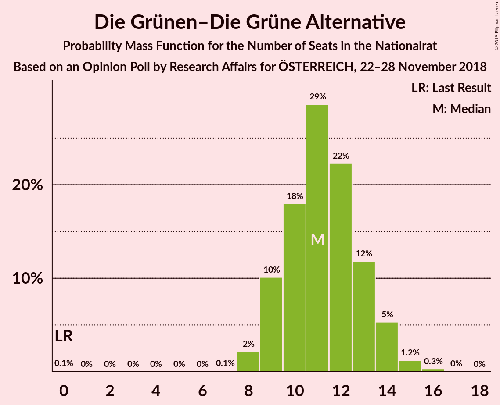
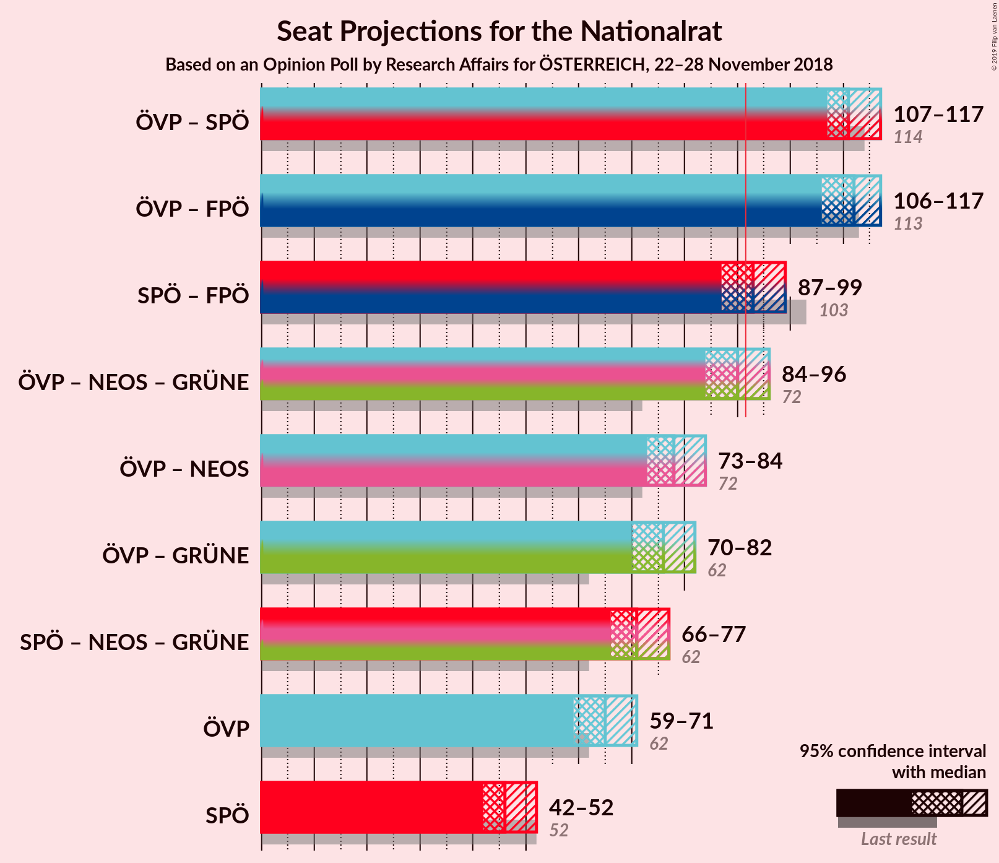
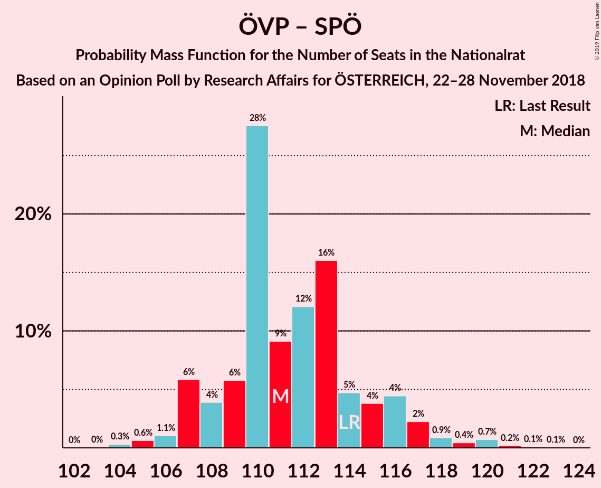

# Opinion Poll by Research Affairs for ÖSTERREICH, 22–28 November 2018

<a href="#voting-intentions">Voting Intentions</a> | <a href="#seats">Seats</a> | <a href="#coalitions">Coalitions</a> | <a href="#technical-information">Technical Information</a>

## Voting Intentions

### Confidence Intervals

| Party | Last Result | Poll Result | 80% Confidence Interval | 90% Confidence Interval | 95% Confidence Interval | 99% Confidence Interval |
|:-----:|:-----------:|:-----------:|:-----------------------:|:-----------------------:|:-----------------------:|:-----------------------:|
| Österreichische Volkspartei | 31.5% | 34.0% | 32.1–35.9% |31.6–36.5% |31.1–37.0% |30.2–37.9% |
| Sozialdemokratische Partei Österreichs | 26.9% | 25.0% | 23.3–26.8% |22.8–27.3% |22.4–27.8% |21.6–28.6% |
| Freiheitliche Partei Österreichs | 26.0% | 24.0% | 22.3–25.8% |21.8–26.3% |21.4–26.7% |20.7–27.6% |
| NEOS–Das Neue Österreich und Liberales Forum | 5.3% | 7.0% | 6.1–8.1% |5.8–8.5% |5.6–8.7% |5.2–9.3% |
| Die Grünen–Die Grüne Alternative | 3.8% | 6.0% | 5.1–7.1% |4.9–7.4% |4.7–7.7% |4.3–8.2% |
| JETZT–Liste Pilz | 4.4% | 2.0% | 1.5–2.7% |1.4–2.9% |1.3–3.1% |1.1–3.4% |

*Note:* The poll result column reflects the actual value used in the calculations. Published results may vary slightly, and in addition be rounded to fewer digits.

## Seats

### Confidence Intervals

| Party | Last Result | Median | 80% Confidence Interval | 90% Confidence Interval | 95% Confidence Interval | 99% Confidence Interval |
|:-----:|:-----------:|:------:|:-----------------------:|:-----------------------:|:-----------------------:|:-----------------------:|
| <a href="#österreichische-volkspartei">Österreichische Volkspartei</a> | 62 | 65 | 61–68 |60–70 |59–71 |58–72 |
| <a href="#sozialdemokratische-partei-österreichs">Sozialdemokratische Partei Österreichs</a> | 52 | 46 | 44–50 |43–51 |42–52 |41–55 |
| <a href="#freiheitliche-partei-österreichs">Freiheitliche Partei Österreichs</a> | 51 | 47 | 43–50 |42–51 |42–52 |40–53 |
| <a href="#neos–das-neue-österreich-und-liberales-forum">NEOS–Das Neue Österreich und Liberales Forum</a> | 10 | 14 | 12–16 |11–16 |11–17 |10–18 |
| <a href="#die-grünen–die-grüne-alternative">Die Grünen–Die Grüne Alternative</a> | 0 | 11 | 9–13 |9–14 |9–14 |8–15 |
| <a href="#jetzt–liste-pilz">JETZT–Liste Pilz</a> | 8 | 0 | 0 |0 |0 |0 |

### Österreichische Volkspartei

*For a full overview of the results for this party, see the [Österreichische Volkspartei](party-österreichischevolkspartei.html) page.*

| Number of Seats | Probability | Accumulated | Special Marks |
|:---------------:|:-----------:|:-----------:|:-------------:|
| 56 | 0.1% | 100% |  |
| 57 | 0.4% | 99.9% |  |
| 58 | 0.6% | 99.5% |  |
| 59 | 1.5% | 98.9% |  |
| 60 | 3% | 97% |  |
| 61 | 7% | 95% |  |
| 62 | 10% | 88% | Last Result |
| 63 | 11% | 78% |  |
| 64 | 13% | 67% |  |
| 65 | 12% | 54% | Median |
| 66 | 12% | 42% |  |
| 67 | 11% | 29% |  |
| 68 | 9% | 18% |  |
| 69 | 3% | 10% |  |
| 70 | 4% | 6% |  |
| 71 | 2% | 3% |  |
| 72 | 0.7% | 1.0% |  |
| 73 | 0.3% | 0.4% |  |
| 74 | 0.1% | 0.1% |  |
| 75 | 0% | 0% |  |

### Sozialdemokratische Partei Österreichs

*For a full overview of the results for this party, see the [Sozialdemokratische Partei Österreichs](party-sozialdemokratischeparteiösterreichs.html) page.*

| Number of Seats | Probability | Accumulated | Special Marks |
|:---------------:|:-----------:|:-----------:|:-------------:|
| 39 | 0% | 100% |  |
| 40 | 0.2% | 99.9% |  |
| 41 | 0.7% | 99.7% |  |
| 42 | 2% | 99.0% |  |
| 43 | 6% | 97% |  |
| 44 | 10% | 91% |  |
| 45 | 15% | 81% |  |
| 46 | 19% | 65% | Median |
| 47 | 15% | 46% |  |
| 48 | 11% | 31% |  |
| 49 | 9% | 20% |  |
| 50 | 5% | 11% |  |
| 51 | 3% | 7% |  |
| 52 | 1.3% | 4% | Last Result |
| 53 | 1.1% | 2% |  |
| 54 | 0.6% | 1.2% |  |
| 55 | 0.3% | 0.5% |  |
| 56 | 0.1% | 0.2% |  |
| 57 | 0.1% | 0.1% |  |
| 58 | 0% | 0% |  |

### Freiheitliche Partei Österreichs

*For a full overview of the results for this party, see the [Freiheitliche Partei Österreichs](party-freiheitlicheparteiösterreichs.html) page.*

| Number of Seats | Probability | Accumulated | Special Marks |
|:---------------:|:-----------:|:-----------:|:-------------:|
| 38 | 0.1% | 100% |  |
| 39 | 0.3% | 99.9% |  |
| 40 | 0.5% | 99.5% |  |
| 41 | 1.1% | 99.0% |  |
| 42 | 3% | 98% |  |
| 43 | 5% | 95% |  |
| 44 | 7% | 90% |  |
| 45 | 12% | 82% |  |
| 46 | 18% | 70% |  |
| 47 | 15% | 53% | Median |
| 48 | 13% | 38% |  |
| 49 | 10% | 25% |  |
| 50 | 8% | 15% |  |
| 51 | 4% | 7% | Last Result |
| 52 | 1.4% | 3% |  |
| 53 | 0.8% | 1.2% |  |
| 54 | 0.3% | 0.3% |  |
| 55 | 0.1% | 0.1% |  |
| 56 | 0% | 0% |  |

### NEOS–Das Neue Österreich und Liberales Forum

*For a full overview of the results for this party, see the [NEOS–Das Neue Österreich und Liberales Forum](party-neos–dasneueösterreichundliberalesforum.html) page.*

| Number of Seats | Probability | Accumulated | Special Marks |
|:---------------:|:-----------:|:-----------:|:-------------:|
| 9 | 0.3% | 100% |  |
| 10 | 2% | 99.7% | Last Result |
| 11 | 7% | 98% |  |
| 12 | 14% | 91% |  |
| 13 | 27% | 77% |  |
| 14 | 23% | 51% | Median |
| 15 | 18% | 28% |  |
| 16 | 7% | 10% |  |
| 17 | 2% | 3% |  |
| 18 | 0.6% | 0.7% |  |
| 19 | 0.1% | 0.1% |  |
| 20 | 0% | 0% |  |

### Die Grünen–Die Grüne Alternative

*For a full overview of the results for this party, see the [Die Grünen–Die Grüne Alternative](party-diegrünen–diegrünealternative.html) page.*

| Number of Seats | Probability | Accumulated | Special Marks |
|:---------------:|:-----------:|:-----------:|:-------------:|
| 0 | 0.1% | 100% | Last Result |
| 1 | 0% | 99.9% |  |
| 2 | 0% | 99.9% |  |
| 3 | 0% | 99.9% |  |
| 4 | 0% | 99.9% |  |
| 5 | 0% | 99.9% |  |
| 6 | 0% | 99.9% |  |
| 7 | 0.1% | 99.9% |  |
| 8 | 2% | 99.8% |  |
| 9 | 10% | 98% |  |
| 10 | 18% | 88% |  |
| 11 | 29% | 70% | Median |
| 12 | 22% | 41% |  |
| 13 | 12% | 19% |  |
| 14 | 5% | 7% |  |
| 15 | 1.2% | 2% |  |
| 16 | 0.3% | 0.3% |  |
| 17 | 0% | 0% |  |

### JETZT–Liste Pilz

*For a full overview of the results for this party, see the [JETZT–Liste Pilz](party-jetzt–listepilz.html) page.*

| Number of Seats | Probability | Accumulated | Special Marks |
|:---------------:|:-----------:|:-----------:|:-------------:|
| 0 | 100% | 100% | Median |
| 1 | 0% | 0% |  |
| 2 | 0% | 0% |  |
| 3 | 0% | 0% |  |
| 4 | 0% | 0% |  |
| 5 | 0% | 0% |  |
| 6 | 0% | 0% |  |
| 7 | 0% | 0% |  |
| 8 | 0% | 0% | Last Result |

## Coalitions

### Confidence Intervals

| Coalition | Last Result | Median | Majority? | 80% Confidence Interval | 90% Confidence Interval | 95% Confidence Interval | 99% Confidence Interval |
|:---------:|:-----------:|:------:|:---------:|:-----------------------:|:-----------------------:|:-----------------------:|:-----------------------:|
| Österreichische Volkspartei – Sozialdemokratische Partei Österreichs | 114 | 111 | 100% | 108–115 | 107–116 | 107–117 | 105–120 |
| Österreichische Volkspartei – Freiheitliche Partei Österreichs | 113 | 112 | 100% | 108–115 | 107–116 | 106–117 | 104–119 |
| Sozialdemokratische Partei Österreichs – Freiheitliche Partei Österreichs | 103 | 93 | 74% | 90–97 | 88–98 | 87–99 | 86–101 |
| Österreichische Volkspartei – NEOS–Das Neue Österreich und Liberales Forum – Die Grünen–Die Grüne Alternative | 72 | 90 | 26% | 86–93 | 85–95 | 84–96 | 82–97 |
| Österreichische Volkspartei – NEOS–Das Neue Österreich und Liberales Forum | 72 | 78 | 0% | 75–82 | 74–84 | 73–84 | 71–86 |
| Österreichische Volkspartei – Die Grünen–Die Grüne Alternative | 62 | 76 | 0% | 72–80 | 71–81 | 70–82 | 69–84 |
| Sozialdemokratische Partei Österreichs – NEOS–Das Neue Österreich und Liberales Forum – Die Grünen–Die Grüne Alternative | 62 | 71 | 0% | 68–75 | 67–76 | 66–77 | 64–79 |
| Österreichische Volkspartei | 62 | 65 | 0% | 61–68 | 60–70 | 59–71 | 58–72 |
| Sozialdemokratische Partei Österreichs | 52 | 46 | 0% | 44–50 | 43–51 | 42–52 | 41–55 |

### Österreichische Volkspartei – Sozialdemokratische Partei Österreichs

| Number of Seats | Probability | Accumulated | Special Marks |
|:---------------:|:-----------:|:-----------:|:-------------:|
| 103 | 0% | 100% |  |
| 104 | 0.3% | 99.9% |  |
| 105 | 0.6% | 99.6% |  |
| 106 | 1.1% | 99.0% |  |
| 107 | 6% | 98% |  |
| 108 | 4% | 92% |  |
| 109 | 6% | 88% |  |
| 110 | 28% | 82% |  |
| 111 | 9% | 55% | Median |
| 112 | 12% | 46% |  |
| 113 | 16% | 34% |  |
| 114 | 5% | 18% | Last Result |
| 115 | 4% | 13% |  |
| 116 | 4% | 9% |  |
| 117 | 2% | 5% |  |
| 118 | 0.9% | 2% |  |
| 119 | 0.4% | 2% |  |
| 120 | 0.7% | 1.1% |  |
| 121 | 0.2% | 0.4% |  |
| 122 | 0.1% | 0.2% |  |
| 123 | 0.1% | 0.1% |  |
| 124 | 0% | 0% |  |

### Österreichische Volkspartei – Freiheitliche Partei Österreichs

| Number of Seats | Probability | Accumulated | Special Marks |
|:---------------:|:-----------:|:-----------:|:-------------:|
| 102 | 0.1% | 100% |  |
| 103 | 0.3% | 99.8% |  |
| 104 | 0.4% | 99.6% |  |
| 105 | 1.4% | 99.2% |  |
| 106 | 2% | 98% |  |
| 107 | 3% | 96% |  |
| 108 | 8% | 93% |  |
| 109 | 9% | 84% |  |
| 110 | 10% | 76% |  |
| 111 | 13% | 65% |  |
| 112 | 10% | 53% | Median |
| 113 | 19% | 42% | Last Result |
| 114 | 6% | 24% |  |
| 115 | 10% | 18% |  |
| 116 | 3% | 8% |  |
| 117 | 3% | 5% |  |
| 118 | 1.1% | 2% |  |
| 119 | 0.5% | 0.7% |  |
| 120 | 0.2% | 0.3% |  |
| 121 | 0% | 0.1% |  |
| 122 | 0% | 0% |  |

### Sozialdemokratische Partei Österreichs – Freiheitliche Partei Österreichs

| Number of Seats | Probability | Accumulated | Special Marks |
|:---------------:|:-----------:|:-----------:|:-------------:|
| 83 | 0% | 100% |  |
| 84 | 0.1% | 99.9% |  |
| 85 | 0.3% | 99.8% |  |
| 86 | 0.7% | 99.5% |  |
| 87 | 1.4% | 98.8% |  |
| 88 | 3% | 97% |  |
| 89 | 4% | 94% |  |
| 90 | 8% | 90% |  |
| 91 | 8% | 82% |  |
| 92 | 14% | 74% | Majority |
| 93 | 14% | 59% | Median |
| 94 | 9% | 45% |  |
| 95 | 12% | 36% |  |
| 96 | 9% | 24% |  |
| 97 | 7% | 15% |  |
| 98 | 3% | 8% |  |
| 99 | 2% | 4% |  |
| 100 | 1.0% | 2% |  |
| 101 | 0.7% | 1.0% |  |
| 102 | 0.2% | 0.3% |  |
| 103 | 0.1% | 0.1% | Last Result |
| 104 | 0% | 0% |  |

### Österreichische Volkspartei – NEOS–Das Neue Österreich und Liberales Forum – Die Grünen–Die Grüne Alternative

| Number of Seats | Probability | Accumulated | Special Marks |
|:---------------:|:-----------:|:-----------:|:-------------:|
| 72 | 0% | 100% | Last Result |
| 73 | 0% | 100% |  |
| 74 | 0% | 100% |  |
| 75 | 0% | 100% |  |
| 76 | 0% | 100% |  |
| 77 | 0% | 100% |  |
| 78 | 0% | 100% |  |
| 79 | 0% | 100% |  |
| 80 | 0.1% | 100% |  |
| 81 | 0.2% | 99.9% |  |
| 82 | 0.7% | 99.7% |  |
| 83 | 1.0% | 99.0% |  |
| 84 | 2% | 98% |  |
| 85 | 3% | 96% |  |
| 86 | 7% | 92% |  |
| 87 | 9% | 85% |  |
| 88 | 12% | 76% |  |
| 89 | 9% | 64% |  |
| 90 | 14% | 55% | Median |
| 91 | 14% | 40% |  |
| 92 | 8% | 26% | Majority |
| 93 | 8% | 18% |  |
| 94 | 4% | 10% |  |
| 95 | 3% | 6% |  |
| 96 | 1.4% | 3% |  |
| 97 | 0.7% | 1.1% |  |
| 98 | 0.3% | 0.5% |  |
| 99 | 0.1% | 0.2% |  |
| 100 | 0% | 0.1% |  |
| 101 | 0% | 0% |  |

### Österreichische Volkspartei – NEOS–Das Neue Österreich und Liberales Forum

| Number of Seats | Probability | Accumulated | Special Marks |
|:---------------:|:-----------:|:-----------:|:-------------:|
| 69 | 0.1% | 100% |  |
| 70 | 0.2% | 99.9% |  |
| 71 | 0.5% | 99.6% |  |
| 72 | 1.2% | 99.2% | Last Result |
| 73 | 2% | 98% |  |
| 74 | 5% | 96% |  |
| 75 | 7% | 91% |  |
| 76 | 11% | 84% |  |
| 77 | 11% | 73% |  |
| 78 | 12% | 61% |  |
| 79 | 13% | 49% | Median |
| 80 | 12% | 36% |  |
| 81 | 9% | 25% |  |
| 82 | 7% | 16% |  |
| 83 | 4% | 9% |  |
| 84 | 3% | 5% |  |
| 85 | 1.2% | 2% |  |
| 86 | 0.6% | 1.0% |  |
| 87 | 0.3% | 0.4% |  |
| 88 | 0.1% | 0.1% |  |
| 89 | 0% | 0% |  |

### Österreichische Volkspartei – Die Grünen–Die Grüne Alternative

| Number of Seats | Probability | Accumulated | Special Marks |
|:---------------:|:-----------:|:-----------:|:-------------:|
| 62 | 0% | 100% | Last Result |
| 63 | 0% | 100% |  |
| 64 | 0% | 100% |  |
| 65 | 0% | 100% |  |
| 66 | 0% | 100% |  |
| 67 | 0.1% | 99.9% |  |
| 68 | 0.3% | 99.8% |  |
| 69 | 0.8% | 99.5% |  |
| 70 | 1.3% | 98.7% |  |
| 71 | 4% | 97% |  |
| 72 | 4% | 93% |  |
| 73 | 9% | 89% |  |
| 74 | 9% | 81% |  |
| 75 | 17% | 72% |  |
| 76 | 10% | 55% | Median |
| 77 | 13% | 45% |  |
| 78 | 10% | 32% |  |
| 79 | 9% | 22% |  |
| 80 | 7% | 13% |  |
| 81 | 3% | 6% |  |
| 82 | 2% | 3% |  |
| 83 | 0.9% | 1.4% |  |
| 84 | 0.3% | 0.6% |  |
| 85 | 0.2% | 0.3% |  |
| 86 | 0% | 0.1% |  |
| 87 | 0% | 0% |  |

### Sozialdemokratische Partei Österreichs – NEOS–Das Neue Österreich und Liberales Forum – Die Grünen–Die Grüne Alternative

| Number of Seats | Probability | Accumulated | Special Marks |
|:---------------:|:-----------:|:-----------:|:-------------:|
| 62 | 0% | 100% | Last Result |
| 63 | 0.2% | 99.9% |  |
| 64 | 0.5% | 99.7% |  |
| 65 | 1.1% | 99.3% |  |
| 66 | 3% | 98% |  |
| 67 | 3% | 95% |  |
| 68 | 10% | 92% |  |
| 69 | 6% | 82% |  |
| 70 | 19% | 76% |  |
| 71 | 10% | 58% | Median |
| 72 | 13% | 47% |  |
| 73 | 10% | 35% |  |
| 74 | 9% | 24% |  |
| 75 | 8% | 16% |  |
| 76 | 3% | 7% |  |
| 77 | 2% | 4% |  |
| 78 | 1.4% | 2% |  |
| 79 | 0.4% | 0.8% |  |
| 80 | 0.3% | 0.4% |  |
| 81 | 0.1% | 0.1% |  |
| 82 | 0% | 0% |  |

### Österreichische Volkspartei

| Number of Seats | Probability | Accumulated | Special Marks |
|:---------------:|:-----------:|:-----------:|:-------------:|
| 56 | 0.1% | 100% |  |
| 57 | 0.4% | 99.9% |  |
| 58 | 0.6% | 99.5% |  |
| 59 | 1.5% | 98.9% |  |
| 60 | 3% | 97% |  |
| 61 | 7% | 95% |  |
| 62 | 10% | 88% | Last Result |
| 63 | 11% | 78% |  |
| 64 | 13% | 67% |  |
| 65 | 12% | 54% | Median |
| 66 | 12% | 42% |  |
| 67 | 11% | 29% |  |
| 68 | 9% | 18% |  |
| 69 | 3% | 10% |  |
| 70 | 4% | 6% |  |
| 71 | 2% | 3% |  |
| 72 | 0.7% | 1.0% |  |
| 73 | 0.3% | 0.4% |  |
| 74 | 0.1% | 0.1% |  |
| 75 | 0% | 0% |  |

### Sozialdemokratische Partei Österreichs

| Number of Seats | Probability | Accumulated | Special Marks |
|:---------------:|:-----------:|:-----------:|:-------------:|
| 39 | 0% | 100% |  |
| 40 | 0.2% | 99.9% |  |
| 41 | 0.7% | 99.7% |  |
| 42 | 2% | 99.0% |  |
| 43 | 6% | 97% |  |
| 44 | 10% | 91% |  |
| 45 | 15% | 81% |  |
| 46 | 19% | 65% | Median |
| 47 | 15% | 46% |  |
| 48 | 11% | 31% |  |
| 49 | 9% | 20% |  |
| 50 | 5% | 11% |  |
| 51 | 3% | 7% |  |
| 52 | 1.3% | 4% | Last Result |
| 53 | 1.1% | 2% |  |
| 54 | 0.6% | 1.2% |  |
| 55 | 0.3% | 0.5% |  |
| 56 | 0.1% | 0.2% |  |
| 57 | 0.1% | 0.1% |  |
| 58 | 0% | 0% |  |

## Technical Information

### Opinion Poll

+ **Polling firm:** Research Affairs
+ **Commissioner(s):** ÖSTERREICH
+ **Fieldwork period:** 22–28 November 2018

### Calculations

+ **Sample size:** 1001
+ **Simulations done:** 131,072
+ **Error estimate:** 1.51%

