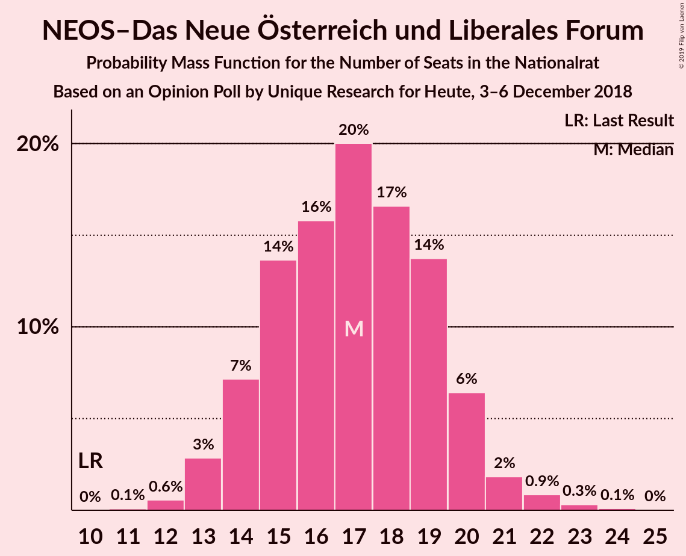
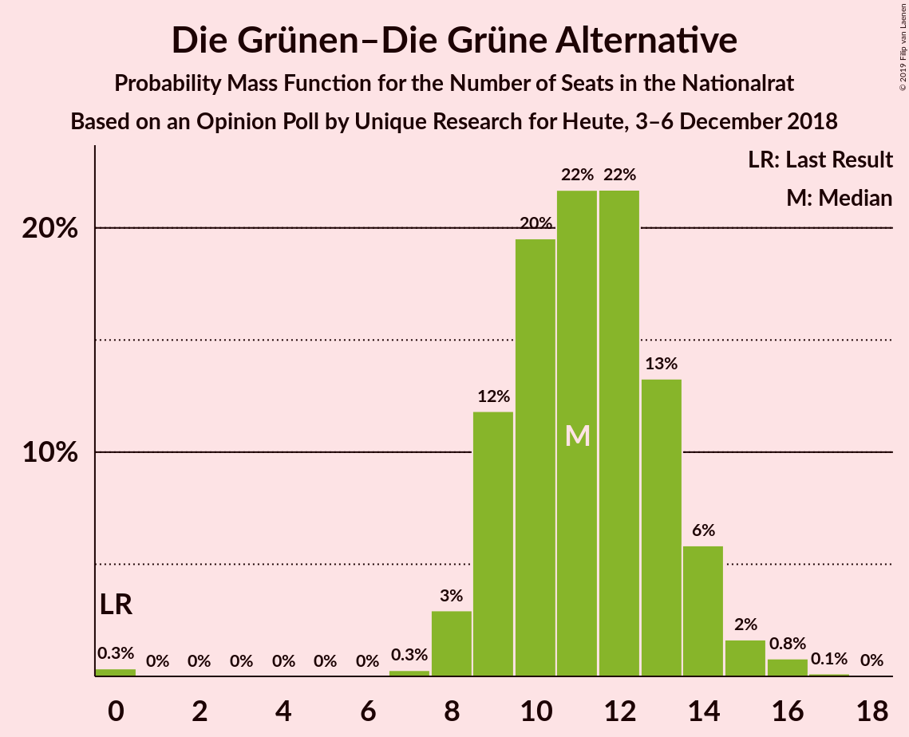
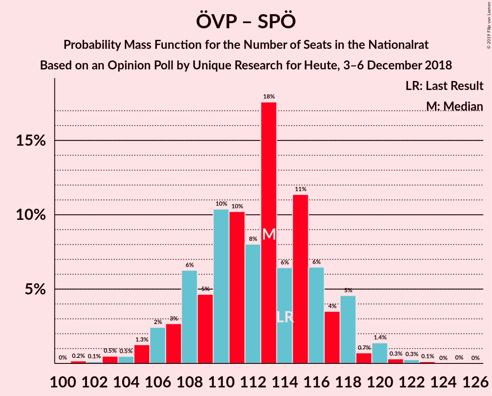

# Opinion Poll by Unique Research for Heute, 3–6 December 2018

<a href="#voting-intentions">Voting Intentions</a> | <a href="#seats">Seats</a> | <a href="#coalitions">Coalitions</a> | <a href="#technical-information">Technical Information</a>

## Voting Intentions

### Confidence Intervals

| Party | Last Result | Poll Result | 80% Confidence Interval | 90% Confidence Interval | 95% Confidence Interval | 99% Confidence Interval |
|:-----:|:-----------:|:-----------:|:-----------------------:|:-----------------------:|:-----------------------:|:-----------------------:|
| Österreichische Volkspartei | 31.5% | 33.0% | 30.9–35.2% |30.3–35.8% |29.8–36.3% |28.8–37.4% |
| Sozialdemokratische Partei Österreichs | 26.9% | 26.0% | 24.1–28.1% |23.5–28.7% |23.1–29.2% |22.2–30.2% |
| Freiheitliche Partei Österreichs | 26.0% | 22.0% | 20.2–24.0% |19.7–24.5% |19.3–25.0% |18.4–26.0% |
| NEOS–Das Neue Österreich und Liberales Forum | 5.3% | 9.0% | 7.8–10.4% |7.5–10.8% |7.2–11.2% |6.7–11.9% |
| Die Grünen–Die Grüne Alternative | 3.8% | 6.0% | 5.0–7.2% |4.8–7.6% |4.6–7.9% |4.1–8.5% |
| JETZT–Liste Pilz | 4.4% | 3.0% | 2.3–3.9% |2.2–4.2% |2.0–4.4% |1.8–4.9% |

*Note:* The poll result column reflects the actual value used in the calculations. Published results may vary slightly, and in addition be rounded to fewer digits.

## Seats

### Confidence Intervals

| Party | Last Result | Median | 80% Confidence Interval | 90% Confidence Interval | 95% Confidence Interval | 99% Confidence Interval |
|:-----:|:-----------:|:------:|:-----------------------:|:-----------------------:|:-----------------------:|:-----------------------:|
| <a href="#österreichische-volkspartei">Österreichische Volkspartei</a> | 62 | 58 | 57–59 |56–59 |56–66 |55–70 |
| <a href="#sozialdemokratische-partei-österreichs">Sozialdemokratische Partei Österreichs</a> | 52 | 50 | 50–53 |47–55 |46–55 |42–60 |
| <a href="#freiheitliche-partei-österreichs">Freiheitliche Partei Österreichs</a> | 51 | 47 | 38–47 |37–47 |37–47 |34–47 |
| <a href="#neos–das-neue-österreich-und-liberales-forum">NEOS–Das Neue Österreich und Liberales Forum</a> | 10 | 18 | 16–18 |16–21 |15–21 |12–25 |
| <a href="#die-grünen–die-grüne-alternative">Die Grünen–Die Grüne Alternative</a> | 0 | 10 | 10–13 |9–14 |9–14 |8–14 |
| <a href="#jetzt–liste-pilz">JETZT–Liste Pilz</a> | 8 | 0 | 0–7 |0–8 |0–8 |0–8 |

### Österreichische Volkspartei

*For a full overview of the results for this party, see the [Österreichische Volkspartei](party-österreichischevolkspartei.html) page.*

| Number of Seats | Probability | Accumulated | Special Marks |
|:---------------:|:-----------:|:-----------:|:-------------:|
| 50 | 0.1% | 100% |  |
| 51 | 0% | 99.9% |  |
| 52 | 0% | 99.9% |  |
| 53 | 0.1% | 99.9% |  |
| 54 | 0.2% | 99.8% |  |
| 55 | 0.7% | 99.6% |  |
| 56 | 8% | 98.9% |  |
| 57 | 2% | 91% |  |
| 58 | 74% | 89% | Median |
| 59 | 11% | 15% |  |
| 60 | 0.3% | 5% |  |
| 61 | 0.9% | 4% |  |
| 62 | 0% | 3% | Last Result |
| 63 | 0.2% | 3% |  |
| 64 | 0.1% | 3% |  |
| 65 | 0% | 3% |  |
| 66 | 0.7% | 3% |  |
| 67 | 0% | 2% |  |
| 68 | 0.3% | 2% |  |
| 69 | 0.6% | 2% |  |
| 70 | 1.2% | 1.5% |  |
| 71 | 0.1% | 0.2% |  |
| 72 | 0% | 0.1% |  |
| 73 | 0% | 0.1% |  |
| 74 | 0% | 0.1% |  |
| 75 | 0% | 0.1% |  |
| 76 | 0.1% | 0.1% |  |
| 77 | 0% | 0% |  |

### Sozialdemokratische Partei Österreichs

*For a full overview of the results for this party, see the [Sozialdemokratische Partei Österreichs](party-sozialdemokratischeparteiösterreichs.html) page.*

| Number of Seats | Probability | Accumulated | Special Marks |
|:---------------:|:-----------:|:-----------:|:-------------:|
| 42 | 2% | 100% |  |
| 43 | 0% | 98% |  |
| 44 | 0.3% | 98% |  |
| 45 | 0% | 98% |  |
| 46 | 2% | 98% |  |
| 47 | 0.6% | 96% |  |
| 48 | 0.7% | 95% |  |
| 49 | 0.4% | 94% |  |
| 50 | 74% | 94% | Median |
| 51 | 8% | 20% |  |
| 52 | 0.1% | 13% | Last Result |
| 53 | 7% | 13% |  |
| 54 | 0.9% | 6% |  |
| 55 | 4% | 5% |  |
| 56 | 0% | 0.8% |  |
| 57 | 0% | 0.8% |  |
| 58 | 0.1% | 0.8% |  |
| 59 | 0% | 0.7% |  |
| 60 | 0.7% | 0.7% |  |
| 61 | 0% | 0% |  |

### Freiheitliche Partei Österreichs

*For a full overview of the results for this party, see the [Freiheitliche Partei Österreichs](party-freiheitlicheparteiösterreichs.html) page.*

| Number of Seats | Probability | Accumulated | Special Marks |
|:---------------:|:-----------:|:-----------:|:-------------:|
| 34 | 1.0% | 100% |  |
| 35 | 0% | 98.9% |  |
| 36 | 0% | 98.9% |  |
| 37 | 5% | 98.9% |  |
| 38 | 7% | 94% |  |
| 39 | 0% | 86% |  |
| 40 | 1.1% | 86% |  |
| 41 | 2% | 85% |  |
| 42 | 0.2% | 84% |  |
| 43 | 0.6% | 83% |  |
| 44 | 8% | 83% |  |
| 45 | 0% | 75% |  |
| 46 | 0% | 75% |  |
| 47 | 74% | 75% | Median |
| 48 | 0.1% | 0.4% |  |
| 49 | 0% | 0.3% |  |
| 50 | 0.2% | 0.3% |  |
| 51 | 0% | 0.1% | Last Result |
| 52 | 0% | 0% |  |

### NEOS–Das Neue Österreich und Liberales Forum

*For a full overview of the results for this party, see the [NEOS–Das Neue Österreich und Liberales Forum](party-neos–dasneueösterreichundliberalesforum.html) page.*

| Number of Seats | Probability | Accumulated | Special Marks |
|:---------------:|:-----------:|:-----------:|:-------------:|
| 10 | 0.1% | 100% | Last Result |
| 11 | 0% | 99.9% |  |
| 12 | 0.6% | 99.9% |  |
| 13 | 0% | 99.3% |  |
| 14 | 1.0% | 99.2% |  |
| 15 | 1.3% | 98% |  |
| 16 | 8% | 97% |  |
| 17 | 0.1% | 89% |  |
| 18 | 80% | 89% | Median |
| 19 | 1.0% | 9% |  |
| 20 | 2% | 8% |  |
| 21 | 5% | 6% |  |
| 22 | 0.3% | 1.4% |  |
| 23 | 0.1% | 1.0% |  |
| 24 | 0.1% | 0.9% |  |
| 25 | 0.9% | 0.9% |  |
| 26 | 0% | 0% |  |

### Die Grünen–Die Grüne Alternative

*For a full overview of the results for this party, see the [Die Grünen–Die Grüne Alternative](party-diegrünen–diegrünealternative.html) page.*

| Number of Seats | Probability | Accumulated | Special Marks |
|:---------------:|:-----------:|:-----------:|:-------------:|
| 0 | 0.1% | 100% | Last Result |
| 1 | 0% | 99.9% |  |
| 2 | 0% | 99.9% |  |
| 3 | 0% | 99.9% |  |
| 4 | 0% | 99.9% |  |
| 5 | 0% | 99.9% |  |
| 6 | 0% | 99.9% |  |
| 7 | 0% | 99.9% |  |
| 8 | 1.1% | 99.8% |  |
| 9 | 7% | 98.7% |  |
| 10 | 74% | 92% | Median |
| 11 | 7% | 18% |  |
| 12 | 0.9% | 11% |  |
| 13 | 2% | 11% |  |
| 14 | 8% | 9% |  |
| 15 | 0.1% | 0.4% |  |
| 16 | 0.2% | 0.3% |  |
| 17 | 0.2% | 0.2% |  |
| 18 | 0% | 0% |  |

### JETZT–Liste Pilz

*For a full overview of the results for this party, see the [JETZT–Liste Pilz](party-jetzt–listepilz.html) page.*

| Number of Seats | Probability | Accumulated | Special Marks |
|:---------------:|:-----------:|:-----------:|:-------------:|
| 0 | 90% | 100% | Median |
| 1 | 0% | 10% |  |
| 2 | 0% | 10% |  |
| 3 | 0% | 10% |  |
| 4 | 0% | 10% |  |
| 5 | 0% | 10% |  |
| 6 | 0% | 10% |  |
| 7 | 0.7% | 10% |  |
| 8 | 9% | 9% | Last Result |
| 9 | 0.3% | 0.3% |  |
| 10 | 0% | 0% |  |

## Coalitions

### Confidence Intervals

| Coalition | Last Result | Median | Majority? | 80% Confidence Interval | 90% Confidence Interval | 95% Confidence Interval | 99% Confidence Interval |
|:---------:|:-----------:|:------:|:---------:|:-----------------------:|:-----------------------:|:-----------------------:|:-----------------------:|
| Österreichische Volkspartei – Sozialdemokratische Partei Österreichs | 114 | 108 | 100% | 108–110 | 108–114 | 107–114 | 98–116 |
| Österreichische Volkspartei – Freiheitliche Partei Österreichs | 113 | 105 | 99.2% | 97–105 | 97–105 | 96–105 | 91–116 |
| Sozialdemokratische Partei Österreichs – Freiheitliche Partei Österreichs | 103 | 97 | 88% | 89–97 | 88–97 | 86–97 | 79–104 |
| Österreichische Volkspartei | 62 | 58 | 0% | 57–59 | 56–59 | 56–66 | 55–70 |
| Sozialdemokratische Partei Österreichs | 52 | 50 | 0% | 50–53 | 47–55 | 46–55 | 42–60 |

### Österreichische Volkspartei – Sozialdemokratische Partei Österreichs

| Number of Seats | Probability | Accumulated | Special Marks |
|:---------------:|:-----------:|:-----------:|:-------------:|
| 98 | 0.7% | 100% |  |
| 99 | 0% | 99.3% |  |
| 100 | 0% | 99.3% |  |
| 101 | 0.1% | 99.2% |  |
| 102 | 0.2% | 99.2% |  |
| 103 | 0.7% | 99.0% |  |
| 104 | 0.4% | 98% |  |
| 105 | 0.2% | 98% |  |
| 106 | 0% | 98% |  |
| 107 | 0.9% | 98% |  |
| 108 | 75% | 97% | Median |
| 109 | 7% | 22% |  |
| 110 | 6% | 15% |  |
| 111 | 0.7% | 9% |  |
| 112 | 1.2% | 8% |  |
| 113 | 0.2% | 7% |  |
| 114 | 5% | 7% | Last Result |
| 115 | 0.8% | 2% |  |
| 116 | 0.7% | 1.1% |  |
| 117 | 0.2% | 0.4% |  |
| 118 | 0% | 0.2% |  |
| 119 | 0% | 0.1% |  |
| 120 | 0% | 0.1% |  |
| 121 | 0% | 0.1% |  |
| 122 | 0% | 0.1% |  |
| 123 | 0% | 0.1% |  |
| 124 | 0% | 0.1% |  |
| 125 | 0% | 0.1% |  |
| 126 | 0% | 0.1% |  |
| 127 | 0% | 0.1% |  |
| 128 | 0.1% | 0.1% |  |
| 129 | 0% | 0% |  |

### Österreichische Volkspartei – Freiheitliche Partei Österreichs

| Number of Seats | Probability | Accumulated | Special Marks |
|:---------------:|:-----------:|:-----------:|:-------------:|
| 91 | 0.8% | 100% |  |
| 92 | 0% | 99.2% | Majority |
| 93 | 0% | 99.2% |  |
| 94 | 0.2% | 99.2% |  |
| 95 | 0% | 99.0% |  |
| 96 | 4% | 99.0% |  |
| 97 | 7% | 95% |  |
| 98 | 2% | 89% |  |
| 99 | 0.7% | 87% |  |
| 100 | 7% | 86% |  |
| 101 | 1.1% | 79% |  |
| 102 | 0.8% | 78% |  |
| 103 | 0% | 77% |  |
| 104 | 0.6% | 77% |  |
| 105 | 74% | 76% | Median |
| 106 | 0.2% | 2% |  |
| 107 | 1.2% | 2% |  |
| 108 | 0.1% | 1.0% |  |
| 109 | 0% | 1.0% |  |
| 110 | 0.1% | 0.9% |  |
| 111 | 0% | 0.8% |  |
| 112 | 0% | 0.8% |  |
| 113 | 0% | 0.8% | Last Result |
| 114 | 0.1% | 0.8% |  |
| 115 | 0% | 0.7% |  |
| 116 | 0.6% | 0.7% |  |
| 117 | 0.1% | 0.1% |  |
| 118 | 0% | 0% |  |

### Sozialdemokratische Partei Österreichs – Freiheitliche Partei Österreichs

| Number of Seats | Probability | Accumulated | Special Marks |
|:---------------:|:-----------:|:-----------:|:-------------:|
| 79 | 1.2% | 100% |  |
| 80 | 0.3% | 98.8% |  |
| 81 | 0.3% | 98% |  |
| 82 | 0% | 98% |  |
| 83 | 0% | 98% |  |
| 84 | 0% | 98% |  |
| 85 | 0.1% | 98% |  |
| 86 | 2% | 98% |  |
| 87 | 0.7% | 96% |  |
| 88 | 0.7% | 95% |  |
| 89 | 7% | 94% |  |
| 90 | 0% | 88% |  |
| 91 | 0% | 88% |  |
| 92 | 5% | 88% | Majority |
| 93 | 0.1% | 83% |  |
| 94 | 0.6% | 83% |  |
| 95 | 0.2% | 82% |  |
| 96 | 0.4% | 82% |  |
| 97 | 80% | 82% | Median |
| 98 | 0.6% | 1.5% |  |
| 99 | 0% | 0.9% |  |
| 100 | 0% | 0.9% |  |
| 101 | 0% | 0.9% |  |
| 102 | 0% | 0.8% |  |
| 103 | 0.1% | 0.8% | Last Result |
| 104 | 0.7% | 0.7% |  |
| 105 | 0% | 0% |  |

### Österreichische Volkspartei

| Number of Seats | Probability | Accumulated | Special Marks |
|:---------------:|:-----------:|:-----------:|:-------------:|
| 50 | 0.1% | 100% |  |
| 51 | 0% | 99.9% |  |
| 52 | 0% | 99.9% |  |
| 53 | 0.1% | 99.9% |  |
| 54 | 0.2% | 99.8% |  |
| 55 | 0.7% | 99.6% |  |
| 56 | 8% | 98.9% |  |
| 57 | 2% | 91% |  |
| 58 | 74% | 89% | Median |
| 59 | 11% | 15% |  |
| 60 | 0.3% | 5% |  |
| 61 | 0.9% | 4% |  |
| 62 | 0% | 3% | Last Result |
| 63 | 0.2% | 3% |  |
| 64 | 0.1% | 3% |  |
| 65 | 0% | 3% |  |
| 66 | 0.7% | 3% |  |
| 67 | 0% | 2% |  |
| 68 | 0.3% | 2% |  |
| 69 | 0.6% | 2% |  |
| 70 | 1.2% | 1.5% |  |
| 71 | 0.1% | 0.2% |  |
| 72 | 0% | 0.1% |  |
| 73 | 0% | 0.1% |  |
| 74 | 0% | 0.1% |  |
| 75 | 0% | 0.1% |  |
| 76 | 0.1% | 0.1% |  |
| 77 | 0% | 0% |  |

### Sozialdemokratische Partei Österreichs

| Number of Seats | Probability | Accumulated | Special Marks |
|:---------------:|:-----------:|:-----------:|:-------------:|
| 42 | 2% | 100% |  |
| 43 | 0% | 98% |  |
| 44 | 0.3% | 98% |  |
| 45 | 0% | 98% |  |
| 46 | 2% | 98% |  |
| 47 | 0.6% | 96% |  |
| 48 | 0.7% | 95% |  |
| 49 | 0.4% | 94% |  |
| 50 | 74% | 94% | Median |
| 51 | 8% | 20% |  |
| 52 | 0.1% | 13% | Last Result |
| 53 | 7% | 13% |  |
| 54 | 0.9% | 6% |  |
| 55 | 4% | 5% |  |
| 56 | 0% | 0.8% |  |
| 57 | 0% | 0.8% |  |
| 58 | 0.1% | 0.8% |  |
| 59 | 0% | 0.7% |  |
| 60 | 0.7% | 0.7% |  |
| 61 | 0% | 0% |  |

## Technical Information

### Opinion Poll

+ **Polling firm:** Unique Research
+ **Commissioner(s):** Heute
+ **Fieldwork period:** 3–6 December 2018

### Calculations

+ **Sample size:** 800
+ **Simulations done:** 1,024
+ **Error estimate:** 8.00%

