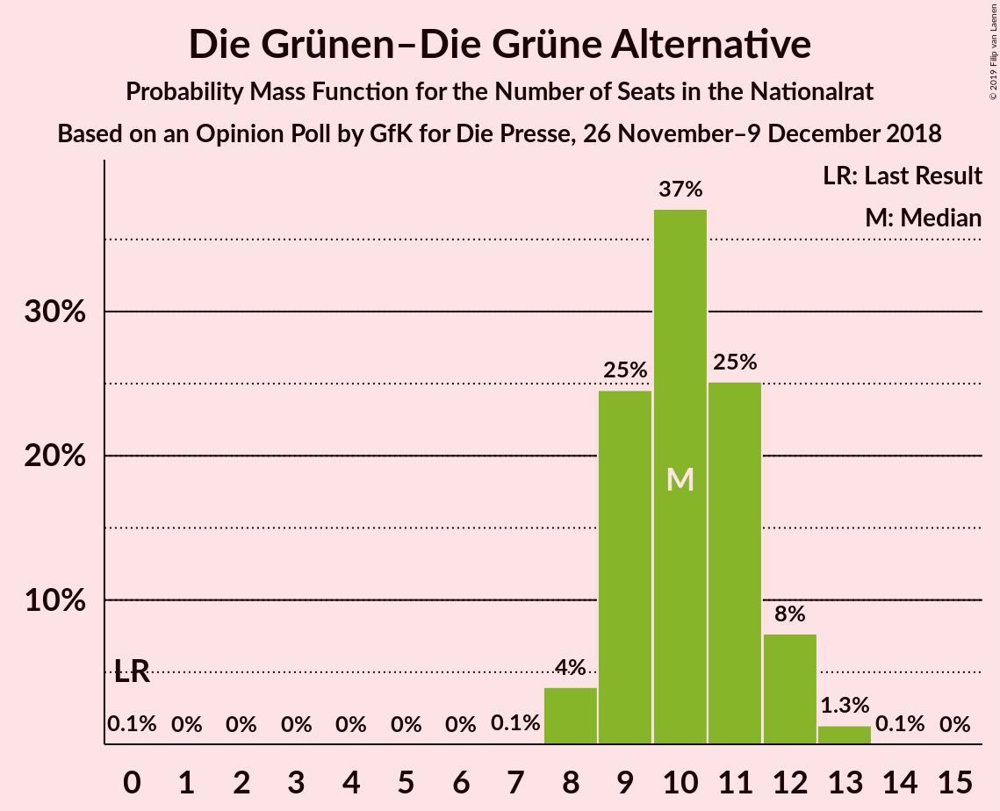
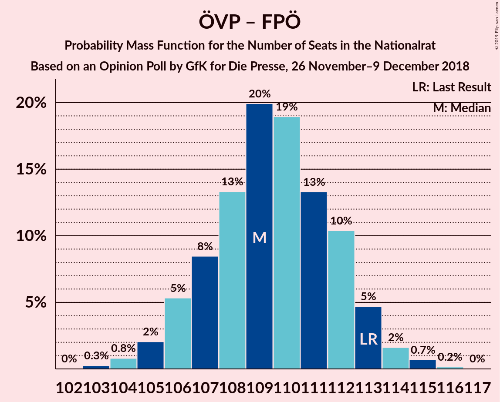

# Opinion Poll by GfK for Die Presse, 26 November–9 December 2018

<a href="#voting-intentions">Voting Intentions</a> | <a href="#seats">Seats</a> | <a href="#coalitions">Coalitions</a> | <a href="#technical-information">Technical Information</a>

## Voting Intentions

### Confidence Intervals

| Party | Last Result | Poll Result | 80% Confidence Interval | 90% Confidence Interval | 95% Confidence Interval | 99% Confidence Interval |
|:-----:|:-----------:|:-----------:|:-----------------------:|:-----------------------:|:-----------------------:|:-----------------------:|
| Österreichische Volkspartei | 31.5% | 34.0% | 32.7–35.4% |32.3–35.8% |31.9–36.1% |31.3–36.8% |
| Sozialdemokratische Partei Österreichs | 26.9% | 26.0% | 24.8–27.3% |24.4–27.7% |24.1–28.0% |23.5–28.6% |
| Freiheitliche Partei Österreichs | 26.0% | 23.5% | 22.3–24.8% |22.0–25.1% |21.7–25.4% |21.1–26.0% |
| NEOS–Das Neue Österreich und Liberales Forum | 5.3% | 7.5% | 6.8–8.3% |6.6–8.6% |6.4–8.7% |6.1–9.1% |
| Die Grünen–Die Grüne Alternative | 3.8% | 5.5% | 4.9–6.2% |4.7–6.4% |4.6–6.6% |4.3–7.0% |
| JETZT–Liste Pilz | 4.4% | 1.5% | 1.2–1.9% |1.1–2.0% |1.1–2.1% |0.9–2.4% |

*Note:* The poll result column reflects the actual value used in the calculations. Published results may vary slightly, and in addition be rounded to fewer digits.

## Seats

### Confidence Intervals

| Party | Last Result | Median | 80% Confidence Interval | 90% Confidence Interval | 95% Confidence Interval | 99% Confidence Interval |
|:-----:|:-----------:|:------:|:-----------------------:|:-----------------------:|:-----------------------:|:-----------------------:|
| <a href="#österreichische-volkspartei">Österreichische Volkspartei</a> | 62 | 65 | 62–67 |61–68 |61–69 |60–70 |
| <a href="#sozialdemokratische-partei-österreichs">Sozialdemokratische Partei Österreichs</a> | 52 | 49 | 47–52 |46–53 |46–53 |45–54 |
| <a href="#freiheitliche-partei-österreichs">Freiheitliche Partei Österreichs</a> | 51 | 45 | 42–47 |42–48 |41–48 |40–49 |
| <a href="#neos–das-neue-österreich-und-liberales-forum">NEOS–Das Neue Österreich und Liberales Forum</a> | 10 | 14 | 12–15 |12–16 |12–16 |11–17 |
| <a href="#die-grünen–die-grüne-alternative">Die Grünen–Die Grüne Alternative</a> | 0 | 10 | 9–11 |9–12 |8–12 |8–13 |
| <a href="#jetzt–liste-pilz">JETZT–Liste Pilz</a> | 8 | 0 | 0 |0 |0 |0 |

### Österreichische Volkspartei

*For a full overview of the results for this party, see the [Österreichische Volkspartei](party-österreichischevolkspartei.html) page.*

| Number of Seats | Probability | Accumulated | Special Marks |
|:---------------:|:-----------:|:-----------:|:-------------:|
| 58 | 0% | 100% |  |
| 59 | 0.3% | 99.9% |  |
| 60 | 1.3% | 99.7% |  |
| 61 | 4% | 98% |  |
| 62 | 7% | 95% | Last Result |
| 63 | 16% | 88% |  |
| 64 | 15% | 71% |  |
| 65 | 18% | 56% | Median |
| 66 | 12% | 38% |  |
| 67 | 16% | 26% |  |
| 68 | 7% | 10% |  |
| 69 | 2% | 3% |  |
| 70 | 0.6% | 0.8% |  |
| 71 | 0.1% | 0.2% |  |
| 72 | 0.1% | 0.1% |  |
| 73 | 0% | 0% |  |

### Sozialdemokratische Partei Österreichs

*For a full overview of the results for this party, see the [Sozialdemokratische Partei Österreichs](party-sozialdemokratischeparteiösterreichs.html) page.*

| Number of Seats | Probability | Accumulated | Special Marks |
|:---------------:|:-----------:|:-----------:|:-------------:|
| 43 | 0.1% | 100% |  |
| 44 | 0.3% | 99.9% |  |
| 45 | 0.9% | 99.6% |  |
| 46 | 4% | 98.7% |  |
| 47 | 10% | 95% |  |
| 48 | 19% | 84% |  |
| 49 | 17% | 65% | Median |
| 50 | 22% | 48% |  |
| 51 | 13% | 27% |  |
| 52 | 7% | 13% | Last Result |
| 53 | 4% | 6% |  |
| 54 | 2% | 2% |  |
| 55 | 0.3% | 0.4% |  |
| 56 | 0.1% | 0.1% |  |
| 57 | 0% | 0% |  |

### Freiheitliche Partei Österreichs

*For a full overview of the results for this party, see the [Freiheitliche Partei Österreichs](party-freiheitlicheparteiösterreichs.html) page.*

| Number of Seats | Probability | Accumulated | Special Marks |
|:---------------:|:-----------:|:-----------:|:-------------:|
| 39 | 0.2% | 100% |  |
| 40 | 0.7% | 99.8% |  |
| 41 | 4% | 99.1% |  |
| 42 | 7% | 95% |  |
| 43 | 12% | 88% |  |
| 44 | 25% | 76% |  |
| 45 | 19% | 51% | Median |
| 46 | 20% | 33% |  |
| 47 | 6% | 13% |  |
| 48 | 5% | 7% |  |
| 49 | 1.0% | 1.4% |  |
| 50 | 0.4% | 0.5% |  |
| 51 | 0.1% | 0.1% | Last Result |
| 52 | 0% | 0% |  |

### NEOS–Das Neue Österreich und Liberales Forum

*For a full overview of the results for this party, see the [NEOS–Das Neue Österreich und Liberales Forum](party-neos–dasneueösterreichundliberalesforum.html) page.*

| Number of Seats | Probability | Accumulated | Special Marks |
|:---------------:|:-----------:|:-----------:|:-------------:|
| 10 | 0.1% | 100% | Last Result |
| 11 | 0.8% | 99.9% |  |
| 12 | 11% | 99.2% |  |
| 13 | 17% | 88% |  |
| 14 | 41% | 71% | Median |
| 15 | 22% | 30% |  |
| 16 | 7% | 9% |  |
| 17 | 2% | 2% |  |
| 18 | 0.1% | 0.1% |  |
| 19 | 0% | 0% |  |

### Die Grünen–Die Grüne Alternative

*For a full overview of the results for this party, see the [Die Grünen–Die Grüne Alternative](party-diegrünen–diegrünealternative.html) page.*

| Number of Seats | Probability | Accumulated | Special Marks |
|:---------------:|:-----------:|:-----------:|:-------------:|
| 0 | 0.1% | 100% | Last Result |
| 1 | 0% | 99.9% |  |
| 2 | 0% | 99.9% |  |
| 3 | 0% | 99.9% |  |
| 4 | 0% | 99.9% |  |
| 5 | 0% | 99.9% |  |
| 6 | 0% | 99.9% |  |
| 7 | 0.1% | 99.9% |  |
| 8 | 4% | 99.8% |  |
| 9 | 25% | 96% |  |
| 10 | 37% | 71% | Median |
| 11 | 25% | 34% |  |
| 12 | 8% | 9% |  |
| 13 | 1.3% | 1.4% |  |
| 14 | 0.1% | 0.1% |  |
| 15 | 0% | 0% |  |

### JETZT–Liste Pilz

*For a full overview of the results for this party, see the [JETZT–Liste Pilz](party-jetzt–listepilz.html) page.*

| Number of Seats | Probability | Accumulated | Special Marks |
|:---------------:|:-----------:|:-----------:|:-------------:|
| 0 | 100% | 100% | Median |
| 1 | 0% | 0% |  |
| 2 | 0% | 0% |  |
| 3 | 0% | 0% |  |
| 4 | 0% | 0% |  |
| 5 | 0% | 0% |  |
| 6 | 0% | 0% |  |
| 7 | 0% | 0% |  |
| 8 | 0% | 0% | Last Result |

## Coalitions

### Confidence Intervals

| Coalition | Last Result | Median | Majority? | 80% Confidence Interval | 90% Confidence Interval | 95% Confidence Interval | 99% Confidence Interval |
|:---------:|:-----------:|:------:|:---------:|:-----------------------:|:-----------------------:|:-----------------------:|:-----------------------:|
| Österreichische Volkspartei – Sozialdemokratische Partei Österreichs | 114 | 114 | 100% | 112–117 | 111–118 | 110–118 | 109–120 |
| Österreichische Volkspartei – Freiheitliche Partei Österreichs | 113 | 109 | 100% | 107–112 | 106–113 | 105–113 | 104–115 |
| Sozialdemokratische Partei Österreichs – Freiheitliche Partei Österreichs | 103 | 94 | 88% | 91–97 | 91–98 | 90–98 | 89–100 |
| Österreichische Volkspartei – NEOS–Das Neue Österreich und Liberales Forum – Die Grünen–Die Grüne Alternative | 72 | 89 | 12% | 86–92 | 85–92 | 85–93 | 83–94 |
| Österreichische Volkspartei – NEOS–Das Neue Österreich und Liberales Forum | 72 | 79 | 0% | 76–82 | 75–82 | 75–82 | 74–84 |
| Österreichische Volkspartei – Die Grünen–Die Grüne Alternative | 62 | 75 | 0% | 72–78 | 72–78 | 71–79 | 70–80 |
| Sozialdemokratische Partei Österreichs – NEOS–Das Neue Österreich und Liberales Forum – Die Grünen–Die Grüne Alternative | 62 | 74 | 0% | 71–76 | 70–77 | 70–78 | 68–79 |
| Österreichische Volkspartei | 62 | 65 | 0% | 62–67 | 61–68 | 61–69 | 60–70 |
| Sozialdemokratische Partei Österreichs | 52 | 49 | 0% | 47–52 | 46–53 | 46–53 | 45–54 |

### Österreichische Volkspartei – Sozialdemokratische Partei Österreichs

| Number of Seats | Probability | Accumulated | Special Marks |
|:---------------:|:-----------:|:-----------:|:-------------:|
| 107 | 0% | 100% |  |
| 108 | 0.3% | 99.9% |  |
| 109 | 0.6% | 99.6% |  |
| 110 | 3% | 99.1% |  |
| 111 | 5% | 96% |  |
| 112 | 10% | 91% |  |
| 113 | 15% | 81% |  |
| 114 | 20% | 66% | Last Result, Median |
| 115 | 22% | 46% |  |
| 116 | 12% | 25% |  |
| 117 | 6% | 12% |  |
| 118 | 4% | 6% |  |
| 119 | 1.5% | 2% |  |
| 120 | 0.4% | 0.6% |  |
| 121 | 0.1% | 0.2% |  |
| 122 | 0% | 0% |  |

### Österreichische Volkspartei – Freiheitliche Partei Österreichs

| Number of Seats | Probability | Accumulated | Special Marks |
|:---------------:|:-----------:|:-----------:|:-------------:|
| 103 | 0.3% | 100% |  |
| 104 | 0.8% | 99.7% |  |
| 105 | 2% | 98.9% |  |
| 106 | 5% | 97% |  |
| 107 | 8% | 92% |  |
| 108 | 13% | 83% |  |
| 109 | 20% | 70% |  |
| 110 | 19% | 50% | Median |
| 111 | 13% | 31% |  |
| 112 | 10% | 18% |  |
| 113 | 5% | 7% | Last Result |
| 114 | 2% | 2% |  |
| 115 | 0.7% | 0.9% |  |
| 116 | 0.2% | 0.2% |  |
| 117 | 0% | 0% |  |

### Sozialdemokratische Partei Österreichs – Freiheitliche Partei Österreichs

| Number of Seats | Probability | Accumulated | Special Marks |
|:---------------:|:-----------:|:-----------:|:-------------:|
| 87 | 0.1% | 100% |  |
| 88 | 0.3% | 99.9% |  |
| 89 | 0.8% | 99.6% |  |
| 90 | 3% | 98.8% |  |
| 91 | 7% | 96% |  |
| 92 | 17% | 88% | Majority |
| 93 | 12% | 71% |  |
| 94 | 16% | 59% | Median |
| 95 | 16% | 43% |  |
| 96 | 16% | 28% |  |
| 97 | 6% | 12% |  |
| 98 | 4% | 6% |  |
| 99 | 1.4% | 2% |  |
| 100 | 0.6% | 0.7% |  |
| 101 | 0.1% | 0.1% |  |
| 102 | 0% | 0% |  |
| 103 | 0% | 0% | Last Result |

### Österreichische Volkspartei – NEOS–Das Neue Österreich und Liberales Forum – Die Grünen–Die Grüne Alternative

| Number of Seats | Probability | Accumulated | Special Marks |
|:---------------:|:-----------:|:-----------:|:-------------:|
| 72 | 0% | 100% | Last Result |
| 73 | 0% | 100% |  |
| 74 | 0% | 100% |  |
| 75 | 0% | 100% |  |
| 76 | 0% | 100% |  |
| 77 | 0% | 100% |  |
| 78 | 0% | 100% |  |
| 79 | 0% | 100% |  |
| 80 | 0% | 100% |  |
| 81 | 0% | 100% |  |
| 82 | 0.1% | 100% |  |
| 83 | 0.6% | 99.9% |  |
| 84 | 1.4% | 99.3% |  |
| 85 | 4% | 98% |  |
| 86 | 6% | 94% |  |
| 87 | 16% | 88% |  |
| 88 | 16% | 72% |  |
| 89 | 16% | 57% | Median |
| 90 | 12% | 41% |  |
| 91 | 17% | 29% |  |
| 92 | 7% | 12% | Majority |
| 93 | 3% | 4% |  |
| 94 | 0.8% | 1.2% |  |
| 95 | 0.3% | 0.4% |  |
| 96 | 0.1% | 0.1% |  |
| 97 | 0% | 0% |  |

### Österreichische Volkspartei – NEOS–Das Neue Österreich und Liberales Forum

| Number of Seats | Probability | Accumulated | Special Marks |
|:---------------:|:-----------:|:-----------:|:-------------:|
| 72 | 0% | 100% | Last Result |
| 73 | 0.3% | 99.9% |  |
| 74 | 2% | 99.6% |  |
| 75 | 5% | 98% |  |
| 76 | 11% | 93% |  |
| 77 | 14% | 82% |  |
| 78 | 12% | 68% |  |
| 79 | 10% | 56% | Median |
| 80 | 19% | 46% |  |
| 81 | 15% | 26% |  |
| 82 | 9% | 11% |  |
| 83 | 2% | 2% |  |
| 84 | 0.3% | 0.5% |  |
| 85 | 0.2% | 0.3% |  |
| 86 | 0.1% | 0.1% |  |
| 87 | 0% | 0% |  |

### Österreichische Volkspartei – Die Grünen–Die Grüne Alternative

| Number of Seats | Probability | Accumulated | Special Marks |
|:---------------:|:-----------:|:-----------:|:-------------:|
| 62 | 0% | 100% | Last Result |
| 63 | 0% | 100% |  |
| 64 | 0% | 100% |  |
| 65 | 0% | 100% |  |
| 66 | 0% | 100% |  |
| 67 | 0% | 100% |  |
| 68 | 0.1% | 100% |  |
| 69 | 0.3% | 99.9% |  |
| 70 | 1.1% | 99.5% |  |
| 71 | 3% | 98% |  |
| 72 | 6% | 95% |  |
| 73 | 14% | 89% |  |
| 74 | 21% | 76% |  |
| 75 | 15% | 54% | Median |
| 76 | 12% | 39% |  |
| 77 | 16% | 27% |  |
| 78 | 6% | 11% |  |
| 79 | 4% | 5% |  |
| 80 | 0.9% | 1.2% |  |
| 81 | 0.2% | 0.4% |  |
| 82 | 0.1% | 0.1% |  |
| 83 | 0% | 0% |  |

### Sozialdemokratische Partei Österreichs – NEOS–Das Neue Österreich und Liberales Forum – Die Grünen–Die Grüne Alternative

| Number of Seats | Probability | Accumulated | Special Marks |
|:---------------:|:-----------:|:-----------:|:-------------:|
| 62 | 0% | 100% | Last Result |
| 63 | 0% | 100% |  |
| 64 | 0% | 100% |  |
| 65 | 0% | 100% |  |
| 66 | 0% | 100% |  |
| 67 | 0.2% | 100% |  |
| 68 | 0.7% | 99.8% |  |
| 69 | 2% | 99.1% |  |
| 70 | 5% | 98% |  |
| 71 | 10% | 93% |  |
| 72 | 13% | 82% |  |
| 73 | 19% | 69% | Median |
| 74 | 20% | 50% |  |
| 75 | 13% | 30% |  |
| 76 | 8% | 17% |  |
| 77 | 5% | 8% |  |
| 78 | 2% | 3% |  |
| 79 | 0.8% | 1.1% |  |
| 80 | 0.3% | 0.3% |  |
| 81 | 0% | 0% |  |

### Österreichische Volkspartei

| Number of Seats | Probability | Accumulated | Special Marks |
|:---------------:|:-----------:|:-----------:|:-------------:|
| 58 | 0% | 100% |  |
| 59 | 0.3% | 99.9% |  |
| 60 | 1.3% | 99.7% |  |
| 61 | 4% | 98% |  |
| 62 | 7% | 95% | Last Result |
| 63 | 16% | 88% |  |
| 64 | 15% | 71% |  |
| 65 | 18% | 56% | Median |
| 66 | 12% | 38% |  |
| 67 | 16% | 26% |  |
| 68 | 7% | 10% |  |
| 69 | 2% | 3% |  |
| 70 | 0.6% | 0.8% |  |
| 71 | 0.1% | 0.2% |  |
| 72 | 0.1% | 0.1% |  |
| 73 | 0% | 0% |  |

### Sozialdemokratische Partei Österreichs

| Number of Seats | Probability | Accumulated | Special Marks |
|:---------------:|:-----------:|:-----------:|:-------------:|
| 43 | 0.1% | 100% |  |
| 44 | 0.3% | 99.9% |  |
| 45 | 0.9% | 99.6% |  |
| 46 | 4% | 98.7% |  |
| 47 | 10% | 95% |  |
| 48 | 19% | 84% |  |
| 49 | 17% | 65% | Median |
| 50 | 22% | 48% |  |
| 51 | 13% | 27% |  |
| 52 | 7% | 13% | Last Result |
| 53 | 4% | 6% |  |
| 54 | 2% | 2% |  |
| 55 | 0.3% | 0.4% |  |
| 56 | 0.1% | 0.1% |  |
| 57 | 0% | 0% |  |

## Technical Information

### Opinion Poll

+ **Polling firm:** GfK
+ **Commissioner(s):** Die Presse
+ **Fieldwork period:** 26 November–9 December 2018

### Calculations

+ **Sample size:** 2000
+ **Simulations done:** 131,072
+ **Error estimate:** 2.13%

