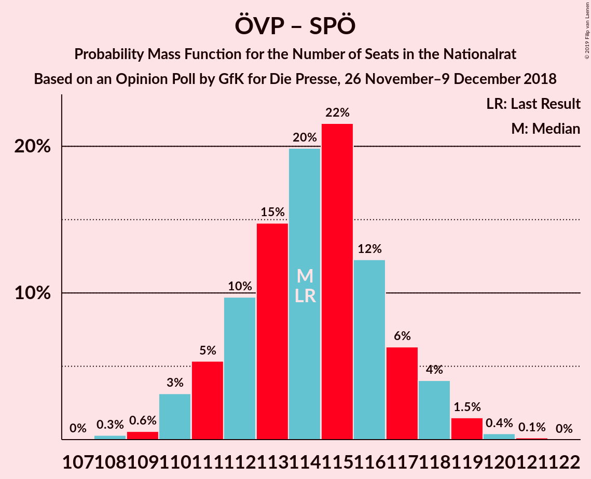
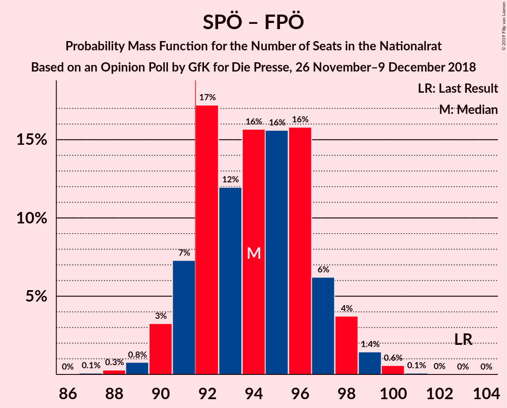

# Opinion Poll by GfK for Die Presse, 26 November–9 December 2018

<a href="#voting-intentions">Voting Intentions</a> | <a href="#seats">Seats</a> | <a href="#coalitions">Coalitions</a> | <a href="#technical-information">Technical Information</a>

## Voting Intentions

### Confidence Intervals

| Party | Last Result | Poll Result | 80% Confidence Interval | 90% Confidence Interval | 95% Confidence Interval | 99% Confidence Interval |
|:-----:|:-----------:|:-----------:|:-----------------------:|:-----------------------:|:-----------------------:|:-----------------------:|
| Österreichische Volkspartei | 31.5% | 34.0% | 32.7–35.4% |32.3–35.8% |31.9–36.1% |31.3–36.8% |
| Sozialdemokratische Partei Österreichs | 26.9% | 26.0% | 24.8–27.3% |24.4–27.7% |24.1–28.0% |23.5–28.6% |
| Freiheitliche Partei Österreichs | 26.0% | 23.5% | 22.3–24.8% |22.0–25.1% |21.7–25.4% |21.1–26.0% |
| NEOS–Das Neue Österreich und Liberales Forum | 5.3% | 7.5% | 6.8–8.3% |6.6–8.6% |6.4–8.7% |6.1–9.1% |
| Die Grünen–Die Grüne Alternative | 3.8% | 5.5% | 4.9–6.2% |4.7–6.4% |4.6–6.6% |4.3–7.0% |
| JETZT–Liste Pilz | 4.4% | 1.5% | 1.2–1.9% |1.1–2.0% |1.1–2.1% |0.9–2.4% |

*Note:* The poll result column reflects the actual value used in the calculations. Published results may vary slightly, and in addition be rounded to fewer digits.

## Seats

### Confidence Intervals

| Party | Last Result | Median | 80% Confidence Interval | 90% Confidence Interval | 95% Confidence Interval | 99% Confidence Interval |
|:-----:|:-----------:|:------:|:-----------------------:|:-----------------------:|:-----------------------:|:-----------------------:|
| <a href="#österreichische-volkspartei">Österreichische Volkspartei</a> | 62 | 63 | 63 |63 |63–64 |60–65 |
| <a href="#sozialdemokratische-partei-österreichs">Sozialdemokratische Partei Österreichs</a> | 52 | 50 | 50 |50–52 |47–54 |46–54 |
| <a href="#freiheitliche-partei-österreichs">Freiheitliche Partei Österreichs</a> | 51 | 46 | 46 |42–46 |42–47 |41–49 |
| <a href="#neos–das-neue-österreich-und-liberales-forum">NEOS–Das Neue Österreich und Liberales Forum</a> | 10 | 14 | 14 |14–15 |14–15 |13–16 |
| <a href="#die-grünen–die-grüne-alternative">Die Grünen–Die Grüne Alternative</a> | 0 | 10 | 10 |10 |10–12 |8–12 |
| <a href="#jetzt–liste-pilz">JETZT–Liste Pilz</a> | 8 | 0 | 0 |0 |0 |0 |

### Österreichische Volkspartei

*For a full overview of the results for this party, see the [Österreichische Volkspartei](party-österreichischevolkspartei.html) page.*

| Number of Seats | Probability | Accumulated | Special Marks |
|:---------------:|:-----------:|:-----------:|:-------------:|
| 60 | 1.2% | 100% |  |
| 61 | 0.2% | 98.8% |  |
| 62 | 0.8% | 98.7% | Last Result |
| 63 | 94% | 98% | Median |
| 64 | 2% | 4% |  |
| 65 | 1.4% | 2% |  |
| 66 | 0.2% | 0.3% |  |
| 67 | 0% | 0% |  |

### Sozialdemokratische Partei Österreichs

*For a full overview of the results for this party, see the [Sozialdemokratische Partei Österreichs](party-sozialdemokratischeparteiösterreichs.html) page.*

| Number of Seats | Probability | Accumulated | Special Marks |
|:---------------:|:-----------:|:-----------:|:-------------:|
| 45 | 0.1% | 100% |  |
| 46 | 1.4% | 99.9% |  |
| 47 | 1.1% | 98% |  |
| 48 | 0% | 97% |  |
| 49 | 1.4% | 97% |  |
| 50 | 88% | 96% | Median |
| 51 | 3% | 8% |  |
| 52 | 0.5% | 5% | Last Result |
| 53 | 0% | 5% |  |
| 54 | 4% | 5% |  |
| 55 | 0.1% | 0.1% |  |
| 56 | 0% | 0% |  |

### Freiheitliche Partei Österreichs

*For a full overview of the results for this party, see the [Freiheitliche Partei Österreichs](party-freiheitlicheparteiösterreichs.html) page.*

| Number of Seats | Probability | Accumulated | Special Marks |
|:---------------:|:-----------:|:-----------:|:-------------:|
| 40 | 0% | 100% |  |
| 41 | 2% | 99.9% |  |
| 42 | 6% | 98% |  |
| 43 | 0% | 93% |  |
| 44 | 1.0% | 93% |  |
| 45 | 0.6% | 92% |  |
| 46 | 88% | 91% | Median |
| 47 | 0.9% | 3% |  |
| 48 | 0.6% | 2% |  |
| 49 | 1.4% | 2% |  |
| 50 | 0.1% | 0.1% |  |
| 51 | 0% | 0.1% | Last Result |
| 52 | 0% | 0% |  |

### NEOS–Das Neue Österreich und Liberales Forum

*For a full overview of the results for this party, see the [NEOS–Das Neue Österreich und Liberales Forum](party-neos–dasneueösterreichundliberalesforum.html) page.*

| Number of Seats | Probability | Accumulated | Special Marks |
|:---------------:|:-----------:|:-----------:|:-------------:|
| 10 | 0% | 100% | Last Result |
| 11 | 0% | 100% |  |
| 12 | 0% | 100% |  |
| 13 | 0.9% | 100% |  |
| 14 | 92% | 99.0% | Median |
| 15 | 5% | 7% |  |
| 16 | 1.3% | 1.3% |  |
| 17 | 0% | 0% |  |

### Die Grünen–Die Grüne Alternative

*For a full overview of the results for this party, see the [Die Grünen–Die Grüne Alternative](party-diegrünen–diegrünealternative.html) page.*

| Number of Seats | Probability | Accumulated | Special Marks |
|:---------------:|:-----------:|:-----------:|:-------------:|
| 0 | 0% | 100% | Last Result |
| 1 | 0% | 100% |  |
| 2 | 0% | 100% |  |
| 3 | 0% | 100% |  |
| 4 | 0% | 100% |  |
| 5 | 0% | 100% |  |
| 6 | 0% | 100% |  |
| 7 | 0.1% | 100% |  |
| 8 | 0.6% | 99.9% |  |
| 9 | 0.1% | 99.2% |  |
| 10 | 94% | 99.1% | Median |
| 11 | 0% | 5% |  |
| 12 | 5% | 5% |  |
| 13 | 0% | 0.1% |  |
| 14 | 0% | 0% |  |

### JETZT–Liste Pilz

*For a full overview of the results for this party, see the [JETZT–Liste Pilz](party-jetzt–listepilz.html) page.*

| Number of Seats | Probability | Accumulated | Special Marks |
|:---------------:|:-----------:|:-----------:|:-------------:|
| 0 | 100% | 100% | Median |
| 1 | 0% | 0% |  |
| 2 | 0% | 0% |  |
| 3 | 0% | 0% |  |
| 4 | 0% | 0% |  |
| 5 | 0% | 0% |  |
| 6 | 0% | 0% |  |
| 7 | 0% | 0% |  |
| 8 | 0% | 0% | Last Result |

## Coalitions

### Confidence Intervals

| Coalition | Last Result | Median | Majority? | 80% Confidence Interval | 90% Confidence Interval | 95% Confidence Interval | 99% Confidence Interval |
|:---------:|:-----------:|:------:|:---------:|:-----------------------:|:-----------------------:|:-----------------------:|:-----------------------:|
| Österreichische Volkspartei – Sozialdemokratische Partei Österreichs | 114 | 113 | 100% | 113 | 113–115 | 111–117 | 109–117 |
| Österreichische Volkspartei – Freiheitliche Partei Österreichs | 113 | 109 | 100% | 108–109 | 105–109 | 105–109 | 105–112 |
| Sozialdemokratische Partei Österreichs – Freiheitliche Partei Österreichs | 103 | 96 | 98% | 96 | 95–96 | 92–96 | 91–100 |
| Österreichische Volkspartei | 62 | 63 | 0% | 63 | 63 | 63–64 | 60–65 |
| Sozialdemokratische Partei Österreichs | 52 | 50 | 0% | 50 | 50–52 | 47–54 | 46–54 |

### Österreichische Volkspartei – Sozialdemokratische Partei Österreichs

| Number of Seats | Probability | Accumulated | Special Marks |
|:---------------:|:-----------:|:-----------:|:-------------:|
| 108 | 0% | 100% |  |
| 109 | 2% | 99.9% |  |
| 110 | 0% | 98% |  |
| 111 | 2% | 98% |  |
| 112 | 0.6% | 97% |  |
| 113 | 89% | 96% | Median |
| 114 | 1.4% | 8% | Last Result |
| 115 | 2% | 6% |  |
| 116 | 0.1% | 5% |  |
| 117 | 4% | 4% |  |
| 118 | 0% | 0% |  |

### Österreichische Volkspartei – Freiheitliche Partei Österreichs

| Number of Seats | Probability | Accumulated | Special Marks |
|:---------------:|:-----------:|:-----------:|:-------------:|
| 103 | 0.1% | 100% |  |
| 104 | 0% | 99.9% |  |
| 105 | 6% | 99.9% |  |
| 106 | 0% | 94% |  |
| 107 | 3% | 94% |  |
| 108 | 1.5% | 91% |  |
| 109 | 88% | 90% | Median |
| 110 | 0.2% | 2% |  |
| 111 | 0% | 2% |  |
| 112 | 2% | 2% |  |
| 113 | 0.1% | 0.1% | Last Result |
| 114 | 0% | 0% |  |

### Sozialdemokratische Partei Österreichs – Freiheitliche Partei Österreichs

| Number of Seats | Probability | Accumulated | Special Marks |
|:---------------:|:-----------:|:-----------:|:-------------:|
| 91 | 2% | 100% |  |
| 92 | 2% | 98% | Majority |
| 93 | 0% | 96% |  |
| 94 | 0.1% | 96% |  |
| 95 | 2% | 96% |  |
| 96 | 93% | 94% | Median |
| 97 | 0% | 1.4% |  |
| 98 | 0.7% | 1.4% |  |
| 99 | 0% | 0.7% |  |
| 100 | 0.5% | 0.7% |  |
| 101 | 0.1% | 0.1% |  |
| 102 | 0% | 0% |  |
| 103 | 0% | 0% | Last Result |

### Österreichische Volkspartei

| Number of Seats | Probability | Accumulated | Special Marks |
|:---------------:|:-----------:|:-----------:|:-------------:|
| 60 | 1.2% | 100% |  |
| 61 | 0.2% | 98.8% |  |
| 62 | 0.8% | 98.7% | Last Result |
| 63 | 94% | 98% | Median |
| 64 | 2% | 4% |  |
| 65 | 1.4% | 2% |  |
| 66 | 0.2% | 0.3% |  |
| 67 | 0% | 0% |  |

### Sozialdemokratische Partei Österreichs

| Number of Seats | Probability | Accumulated | Special Marks |
|:---------------:|:-----------:|:-----------:|:-------------:|
| 45 | 0.1% | 100% |  |
| 46 | 1.4% | 99.9% |  |
| 47 | 1.1% | 98% |  |
| 48 | 0% | 97% |  |
| 49 | 1.4% | 97% |  |
| 50 | 88% | 96% | Median |
| 51 | 3% | 8% |  |
| 52 | 0.5% | 5% | Last Result |
| 53 | 0% | 5% |  |
| 54 | 4% | 5% |  |
| 55 | 0.1% | 0.1% |  |
| 56 | 0% | 0% |  |

## Technical Information

### Opinion Poll

+ **Polling firm:** GfK
+ **Commissioner(s):** Die Presse
+ **Fieldwork period:** 26 November–9 December 2018

### Calculations

+ **Sample size:** 2000
+ **Simulations done:** 1,024
+ **Error estimate:** 1.95%

