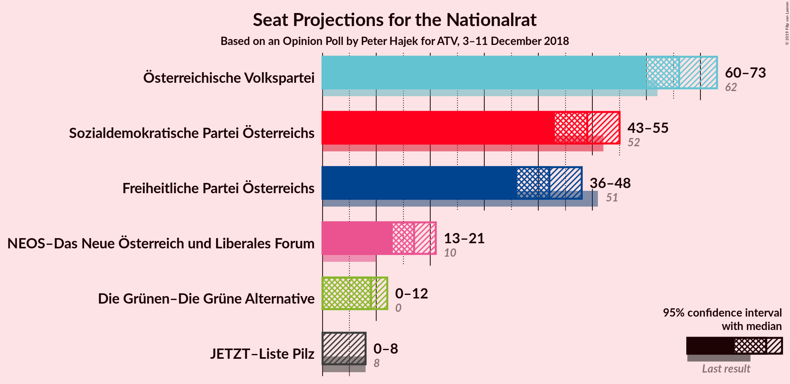
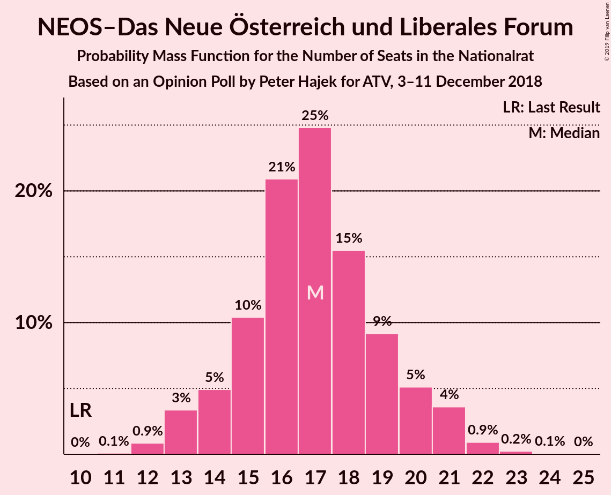
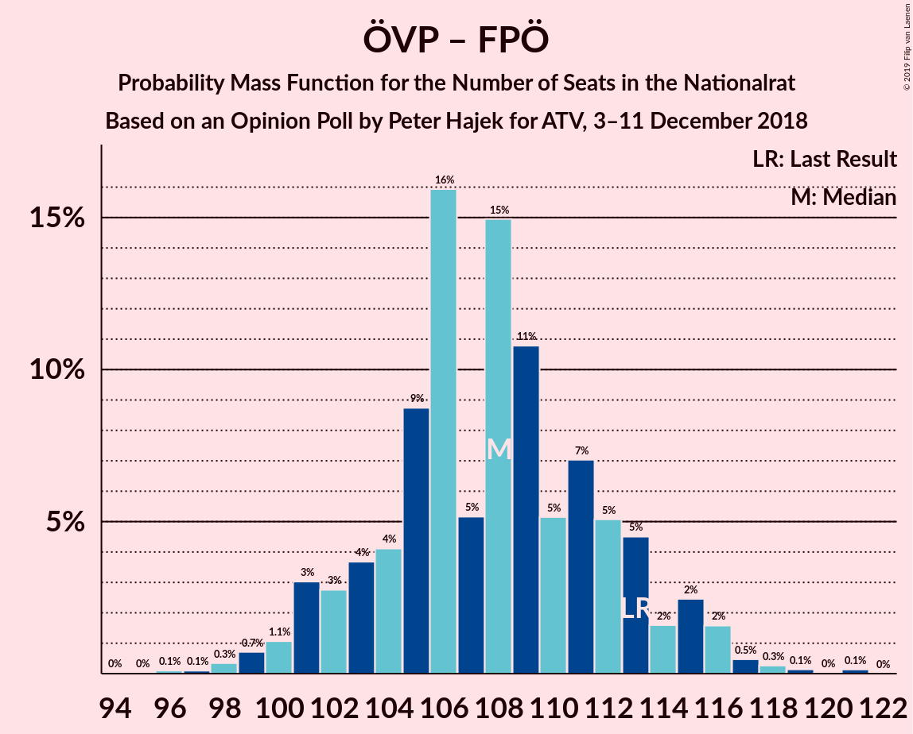

# Opinion Poll by Peter Hajek for ATV, 3–11 December 2018

<a href="#voting-intentions">Voting Intentions</a> | <a href="#seats">Seats</a> | <a href="#coalitions">Coalitions</a> | <a href="#technical-information">Technical Information</a>

## Voting Intentions

### Confidence Intervals

| Party | Last Result | Poll Result | 80% Confidence Interval | 90% Confidence Interval | 95% Confidence Interval | 99% Confidence Interval |
|:-----:|:-----------:|:-----------:|:-----------------------:|:-----------------------:|:-----------------------:|:-----------------------:|
| Österreichische Volkspartei | 31.5% | 34.9% | 32.8–37.1% |32.2–37.7% |31.6–38.3% |30.7–39.3% |
| Sozialdemokratische Partei Österreichs | 26.9% | 25.9% | 24.0–27.9% |23.4–28.5% |23.0–29.0% |22.1–30.0% |
| Freiheitliche Partei Österreichs | 26.0% | 22.0% | 20.2–24.0% |19.7–24.5% |19.3–25.0% |18.4–26.0% |
| NEOS–Das Neue Österreich und Liberales Forum | 5.3% | 9.0% | 7.8–10.4% |7.5–10.8% |7.2–11.2% |6.7–11.9% |
| Die Grünen–Die Grüne Alternative | 3.8% | 5.0% | 4.1–6.1% |3.9–6.5% |3.7–6.8% |3.3–7.3% |
| JETZT–Liste Pilz | 4.4% | 3.0% | 2.3–3.9% |2.2–4.2% |2.0–4.4% |1.8–4.9% |

*Note:* The poll result column reflects the actual value used in the calculations. Published results may vary slightly, and in addition be rounded to fewer digits.

## Seats

### Confidence Intervals

| Party | Last Result | Median | 80% Confidence Interval | 90% Confidence Interval | 95% Confidence Interval | 99% Confidence Interval |
|:-----:|:-----------:|:------:|:-----------------------:|:-----------------------:|:-----------------------:|:-----------------------:|
| <a href="#österreichische-volkspartei">Österreichische Volkspartei</a> | 62 | 64 | 59–66 |59–67 |58–70 |55–74 |
| <a href="#sozialdemokratische-partei-österreichs">Sozialdemokratische Partei Österreichs</a> | 52 | 56 | 48–56 |45–56 |45–56 |44–60 |
| <a href="#freiheitliche-partei-österreichs">Freiheitliche Partei Österreichs</a> | 51 | 38 | 36–40 |36–40 |36–48 |32–49 |
| <a href="#neos–das-neue-österreich-und-liberales-forum">NEOS–Das Neue Österreich und Liberales Forum</a> | 10 | 14 | 12–18 |12–18 |12–18 |12–22 |
| <a href="#die-grünen–die-grüne-alternative">Die Grünen–Die Grüne Alternative</a> | 0 | 11 | 8–11 |7–12 |7–13 |0–14 |
| <a href="#jetzt–liste-pilz">JETZT–Liste Pilz</a> | 8 | 0 | 0–8 |0–9 |0–9 |0–9 |

### Österreichische Volkspartei

*For a full overview of the results for this party, see the [Österreichische Volkspartei](party-österreichischevolkspartei.html) page.*

| Number of Seats | Probability | Accumulated | Special Marks |
|:---------------:|:-----------:|:-----------:|:-------------:|
| 55 | 1.3% | 100% |  |
| 56 | 0% | 98.6% |  |
| 57 | 1.0% | 98.6% |  |
| 58 | 0.2% | 98% |  |
| 59 | 8% | 97% |  |
| 60 | 0.4% | 89% |  |
| 61 | 8% | 89% |  |
| 62 | 0.3% | 80% | Last Result |
| 63 | 0.1% | 80% |  |
| 64 | 59% | 80% | Median |
| 65 | 2% | 21% |  |
| 66 | 11% | 19% |  |
| 67 | 5% | 8% |  |
| 68 | 0% | 3% |  |
| 69 | 0% | 3% |  |
| 70 | 2% | 3% |  |
| 71 | 0% | 1.0% |  |
| 72 | 0.1% | 1.0% |  |
| 73 | 0% | 0.8% |  |
| 74 | 0.7% | 0.8% |  |
| 75 | 0% | 0.1% |  |
| 76 | 0% | 0.1% |  |
| 77 | 0% | 0.1% |  |
| 78 | 0.1% | 0.1% |  |
| 79 | 0% | 0% |  |

### Sozialdemokratische Partei Österreichs

*For a full overview of the results for this party, see the [Sozialdemokratische Partei Österreichs](party-sozialdemokratischeparteiösterreichs.html) page.*

| Number of Seats | Probability | Accumulated | Special Marks |
|:---------------:|:-----------:|:-----------:|:-------------:|
| 42 | 0.1% | 100% |  |
| 43 | 0% | 99.9% |  |
| 44 | 1.2% | 99.9% |  |
| 45 | 5% | 98.7% |  |
| 46 | 0% | 93% |  |
| 47 | 3% | 93% |  |
| 48 | 1.0% | 90% |  |
| 49 | 0% | 89% |  |
| 50 | 1.4% | 89% |  |
| 51 | 1.0% | 88% |  |
| 52 | 9% | 87% | Last Result |
| 53 | 8% | 78% |  |
| 54 | 0.4% | 70% |  |
| 55 | 0% | 70% |  |
| 56 | 69% | 70% | Median |
| 57 | 0.5% | 1.1% |  |
| 58 | 0% | 0.6% |  |
| 59 | 0% | 0.6% |  |
| 60 | 0.6% | 0.6% |  |
| 61 | 0% | 0% |  |

### Freiheitliche Partei Österreichs

*For a full overview of the results for this party, see the [Freiheitliche Partei Österreichs](party-freiheitlicheparteiösterreichs.html) page.*

| Number of Seats | Probability | Accumulated | Special Marks |
|:---------------:|:-----------:|:-----------:|:-------------:|
| 31 | 0.1% | 100% |  |
| 32 | 0.5% | 99.9% |  |
| 33 | 0% | 99.4% |  |
| 34 | 0.3% | 99.4% |  |
| 35 | 0% | 99.1% |  |
| 36 | 10% | 99.1% |  |
| 37 | 13% | 90% |  |
| 38 | 59% | 77% | Median |
| 39 | 0.1% | 18% |  |
| 40 | 13% | 18% |  |
| 41 | 0.7% | 5% |  |
| 42 | 0.9% | 4% |  |
| 43 | 0.2% | 3% |  |
| 44 | 0% | 3% |  |
| 45 | 0% | 3% |  |
| 46 | 0% | 3% |  |
| 47 | 0% | 3% |  |
| 48 | 1.3% | 3% |  |
| 49 | 1.0% | 1.5% |  |
| 50 | 0.1% | 0.5% |  |
| 51 | 0% | 0.4% | Last Result |
| 52 | 0.4% | 0.4% |  |
| 53 | 0% | 0% |  |

### NEOS–Das Neue Österreich und Liberales Forum

*For a full overview of the results for this party, see the [NEOS–Das Neue Österreich und Liberales Forum](party-neos–dasneueösterreichundliberalesforum.html) page.*

| Number of Seats | Probability | Accumulated | Special Marks |
|:---------------:|:-----------:|:-----------:|:-------------:|
| 10 | 0% | 100% | Last Result |
| 11 | 0.3% | 100% |  |
| 12 | 11% | 99.7% |  |
| 13 | 0% | 89% |  |
| 14 | 66% | 89% | Median |
| 15 | 1.1% | 23% |  |
| 16 | 2% | 22% |  |
| 17 | 9% | 21% |  |
| 18 | 9% | 11% |  |
| 19 | 0.3% | 2% |  |
| 20 | 0.3% | 2% |  |
| 21 | 0.5% | 1.4% |  |
| 22 | 0.8% | 0.9% |  |
| 23 | 0.1% | 0.2% |  |
| 24 | 0% | 0.1% |  |
| 25 | 0.1% | 0.1% |  |
| 26 | 0% | 0% |  |

### Die Grünen–Die Grüne Alternative

*For a full overview of the results for this party, see the [Die Grünen–Die Grüne Alternative](party-diegrünen–diegrünealternative.html) page.*

| Number of Seats | Probability | Accumulated | Special Marks |
|:---------------:|:-----------:|:-----------:|:-------------:|
| 0 | 2% | 100% | Last Result |
| 1 | 0% | 98% |  |
| 2 | 0% | 98% |  |
| 3 | 0% | 98% |  |
| 4 | 0% | 98% |  |
| 5 | 0% | 98% |  |
| 6 | 0% | 98% |  |
| 7 | 8% | 98% |  |
| 8 | 0.8% | 90% |  |
| 9 | 19% | 89% |  |
| 10 | 0.8% | 71% |  |
| 11 | 60% | 70% | Median |
| 12 | 7% | 10% |  |
| 13 | 1.4% | 3% |  |
| 14 | 1.4% | 1.5% |  |
| 15 | 0.1% | 0.1% |  |
| 16 | 0% | 0% |  |

### JETZT–Liste Pilz

*For a full overview of the results for this party, see the [JETZT–Liste Pilz](party-jetzt–listepilz.html) page.*

| Number of Seats | Probability | Accumulated | Special Marks |
|:---------------:|:-----------:|:-----------:|:-------------:|
| 0 | 77% | 100% | Median |
| 1 | 0% | 23% |  |
| 2 | 0% | 23% |  |
| 3 | 0% | 23% |  |
| 4 | 0% | 23% |  |
| 5 | 0% | 23% |  |
| 6 | 0% | 23% |  |
| 7 | 0.2% | 23% |  |
| 8 | 14% | 23% | Last Result |
| 9 | 9% | 9% |  |
| 10 | 0.1% | 0.1% |  |
| 11 | 0% | 0% |  |

## Coalitions

### Confidence Intervals

| Coalition | Last Result | Median | Majority? | 80% Confidence Interval | 90% Confidence Interval | 95% Confidence Interval | 99% Confidence Interval |
|:---------:|:-----------:|:------:|:---------:|:-----------------------:|:-----------------------:|:-----------------------:|:-----------------------:|
| Österreichische Volkspartei – Sozialdemokratische Partei Österreichs | 114 | 120 | 100% | 111–122 | 111–122 | 108–122 | 105–123 |
| Österreichische Volkspartei – Freiheitliche Partei Österreichs | 113 | 102 | 100% | 98–106 | 95–106 | 95–110 | 95–118 |
| Sozialdemokratische Partei Österreichs – Freiheitliche Partei Österreichs | 103 | 94 | 73% | 88–96 | 82–96 | 82–98 | 80–101 |
| Österreichische Volkspartei | 62 | 64 | 0% | 59–66 | 59–67 | 58–70 | 55–74 |
| Sozialdemokratische Partei Österreichs | 52 | 56 | 0% | 48–56 | 45–56 | 45–56 | 44–60 |

### Österreichische Volkspartei – Sozialdemokratische Partei Österreichs

| Number of Seats | Probability | Accumulated | Special Marks |
|:---------------:|:-----------:|:-----------:|:-------------:|
| 101 | 0% | 100% |  |
| 102 | 0% | 99.9% |  |
| 103 | 0% | 99.9% |  |
| 104 | 0% | 99.9% |  |
| 105 | 1.3% | 99.9% |  |
| 106 | 0% | 98.6% |  |
| 107 | 0% | 98.6% |  |
| 108 | 1.1% | 98.5% |  |
| 109 | 1.2% | 97% |  |
| 110 | 0.4% | 96% |  |
| 111 | 9% | 96% |  |
| 112 | 5% | 87% |  |
| 113 | 0.4% | 82% |  |
| 114 | 8% | 82% | Last Result |
| 115 | 0% | 74% |  |
| 116 | 0% | 74% |  |
| 117 | 2% | 74% |  |
| 118 | 0% | 71% |  |
| 119 | 1.3% | 71% |  |
| 120 | 59% | 70% | Median |
| 121 | 0.2% | 11% |  |
| 122 | 10% | 11% |  |
| 123 | 0.3% | 0.5% |  |
| 124 | 0.2% | 0.2% |  |
| 125 | 0% | 0% |  |

### Österreichische Volkspartei – Freiheitliche Partei Österreichs

| Number of Seats | Probability | Accumulated | Special Marks |
|:---------------:|:-----------:|:-----------:|:-------------:|
| 95 | 8% | 100% |  |
| 96 | 0.2% | 92% |  |
| 97 | 0% | 91% |  |
| 98 | 8% | 91% |  |
| 99 | 0.3% | 83% |  |
| 100 | 0.7% | 83% |  |
| 101 | 2% | 82% |  |
| 102 | 59% | 80% | Median |
| 103 | 1.4% | 22% |  |
| 104 | 5% | 20% |  |
| 105 | 0.5% | 15% |  |
| 106 | 11% | 15% |  |
| 107 | 0.1% | 4% |  |
| 108 | 0.2% | 4% |  |
| 109 | 0% | 4% |  |
| 110 | 2% | 4% |  |
| 111 | 0% | 1.4% |  |
| 112 | 0% | 1.4% |  |
| 113 | 0% | 1.4% | Last Result |
| 114 | 0.1% | 1.4% |  |
| 115 | 0% | 1.2% |  |
| 116 | 0.7% | 1.2% |  |
| 117 | 0% | 0.5% |  |
| 118 | 0.4% | 0.5% |  |
| 119 | 0.1% | 0.1% |  |
| 120 | 0% | 0% |  |

### Sozialdemokratische Partei Österreichs – Freiheitliche Partei Österreichs

| Number of Seats | Probability | Accumulated | Special Marks |
|:---------------:|:-----------:|:-----------:|:-------------:|
| 80 | 1.2% | 100% |  |
| 81 | 0% | 98.8% |  |
| 82 | 5% | 98.8% |  |
| 83 | 0.1% | 94% |  |
| 84 | 0% | 94% |  |
| 85 | 0.1% | 94% |  |
| 86 | 0.4% | 94% |  |
| 87 | 3% | 93% |  |
| 88 | 9% | 90% |  |
| 89 | 0.6% | 81% |  |
| 90 | 8% | 81% |  |
| 91 | 0% | 73% |  |
| 92 | 0% | 73% | Majority |
| 93 | 0.1% | 73% |  |
| 94 | 59% | 73% | Median |
| 95 | 0% | 14% |  |
| 96 | 10% | 14% |  |
| 97 | 0.1% | 3% |  |
| 98 | 1.3% | 3% |  |
| 99 | 0.4% | 2% |  |
| 100 | 1.0% | 2% |  |
| 101 | 0.5% | 0.6% |  |
| 102 | 0% | 0.2% |  |
| 103 | 0.2% | 0.2% | Last Result |
| 104 | 0% | 0% |  |

### Österreichische Volkspartei

| Number of Seats | Probability | Accumulated | Special Marks |
|:---------------:|:-----------:|:-----------:|:-------------:|
| 55 | 1.3% | 100% |  |
| 56 | 0% | 98.6% |  |
| 57 | 1.0% | 98.6% |  |
| 58 | 0.2% | 98% |  |
| 59 | 8% | 97% |  |
| 60 | 0.4% | 89% |  |
| 61 | 8% | 89% |  |
| 62 | 0.3% | 80% | Last Result |
| 63 | 0.1% | 80% |  |
| 64 | 59% | 80% | Median |
| 65 | 2% | 21% |  |
| 66 | 11% | 19% |  |
| 67 | 5% | 8% |  |
| 68 | 0% | 3% |  |
| 69 | 0% | 3% |  |
| 70 | 2% | 3% |  |
| 71 | 0% | 1.0% |  |
| 72 | 0.1% | 1.0% |  |
| 73 | 0% | 0.8% |  |
| 74 | 0.7% | 0.8% |  |
| 75 | 0% | 0.1% |  |
| 76 | 0% | 0.1% |  |
| 77 | 0% | 0.1% |  |
| 78 | 0.1% | 0.1% |  |
| 79 | 0% | 0% |  |

### Sozialdemokratische Partei Österreichs

| Number of Seats | Probability | Accumulated | Special Marks |
|:---------------:|:-----------:|:-----------:|:-------------:|
| 42 | 0.1% | 100% |  |
| 43 | 0% | 99.9% |  |
| 44 | 1.2% | 99.9% |  |
| 45 | 5% | 98.7% |  |
| 46 | 0% | 93% |  |
| 47 | 3% | 93% |  |
| 48 | 1.0% | 90% |  |
| 49 | 0% | 89% |  |
| 50 | 1.4% | 89% |  |
| 51 | 1.0% | 88% |  |
| 52 | 9% | 87% | Last Result |
| 53 | 8% | 78% |  |
| 54 | 0.4% | 70% |  |
| 55 | 0% | 70% |  |
| 56 | 69% | 70% | Median |
| 57 | 0.5% | 1.1% |  |
| 58 | 0% | 0.6% |  |
| 59 | 0% | 0.6% |  |
| 60 | 0.6% | 0.6% |  |
| 61 | 0% | 0% |  |

## Technical Information

### Opinion Poll

+ **Polling firm:** Peter Hajek
+ **Commissioner(s):** ATV
+ **Fieldwork period:** 3–11 December 2018

### Calculations

+ **Sample size:** 800
+ **Simulations done:** 1,024
+ **Error estimate:** 2.55%

