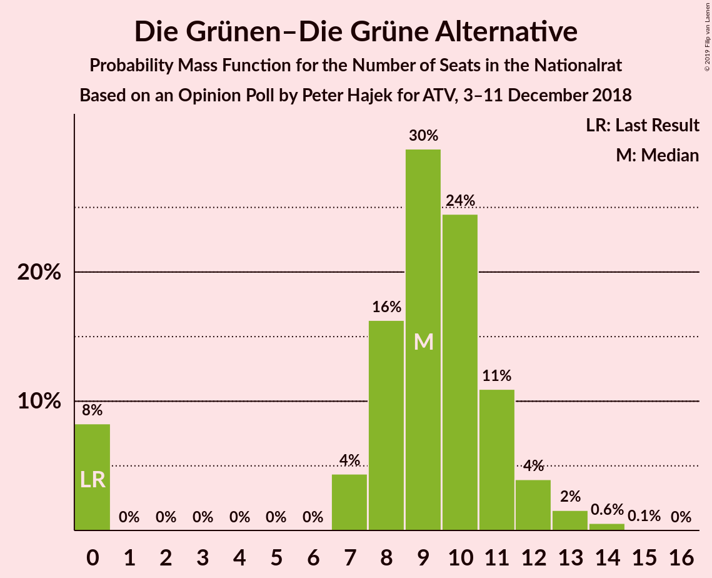
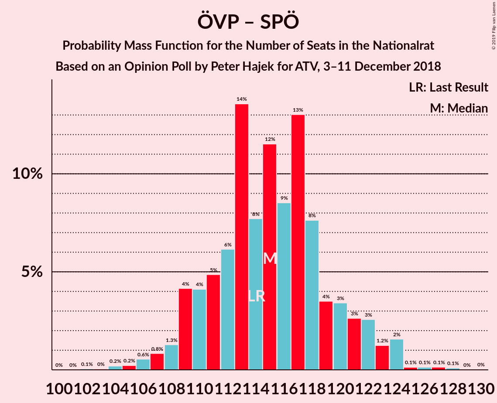

# Opinion Poll by Peter Hajek for ATV, 3–11 December 2018

<a href="#voting-intentions">Voting Intentions</a> | <a href="#seats">Seats</a> | <a href="#coalitions">Coalitions</a> | <a href="#technical-information">Technical Information</a>

## Voting Intentions

### Confidence Intervals

| Party | Last Result | Poll Result | 80% Confidence Interval | 90% Confidence Interval | 95% Confidence Interval | 99% Confidence Interval |
|:-----:|:-----------:|:-----------:|:-----------------------:|:-----------------------:|:-----------------------:|:-----------------------:|
| Österreichische Volkspartei | 31.5% | 34.9% | 32.8–37.1% |32.2–37.7% |31.6–38.3% |30.7–39.3% |
| Sozialdemokratische Partei Österreichs | 26.9% | 25.9% | 24.0–27.9% |23.4–28.5% |23.0–29.0% |22.1–30.0% |
| Freiheitliche Partei Österreichs | 26.0% | 22.0% | 20.2–24.0% |19.7–24.5% |19.3–25.0% |18.4–26.0% |
| NEOS–Das Neue Österreich und Liberales Forum | 5.3% | 9.0% | 7.8–10.4% |7.5–10.8% |7.2–11.2% |6.7–11.9% |
| Die Grünen–Die Grüne Alternative | 3.8% | 5.0% | 4.1–6.1% |3.9–6.5% |3.7–6.8% |3.3–7.3% |
| JETZT–Liste Pilz | 4.4% | 3.0% | 2.3–3.9% |2.2–4.2% |2.0–4.4% |1.8–4.9% |

*Note:* The poll result column reflects the actual value used in the calculations. Published results may vary slightly, and in addition be rounded to fewer digits.

## Seats

### Confidence Intervals

| Party | Last Result | Median | 80% Confidence Interval | 90% Confidence Interval | 95% Confidence Interval | 99% Confidence Interval |
|:-----:|:-----------:|:------:|:-----------------------:|:-----------------------:|:-----------------------:|:-----------------------:|
| <a href="#österreichische-volkspartei">Österreichische Volkspartei</a> | 62 | 66 | 62–71 |61–72 |60–73 |57–74 |
| <a href="#sozialdemokratische-partei-österreichs">Sozialdemokratische Partei Österreichs</a> | 52 | 49 | 45–53 |44–54 |43–55 |42–57 |
| <a href="#freiheitliche-partei-österreichs">Freiheitliche Partei Österreichs</a> | 51 | 42 | 38–45 |37–47 |36–48 |34–50 |
| <a href="#neos–das-neue-österreich-und-liberales-forum">NEOS–Das Neue Österreich und Liberales Forum</a> | 10 | 17 | 15–19 |14–20 |13–21 |12–22 |
| <a href="#die-grünen–die-grüne-alternative">Die Grünen–Die Grüne Alternative</a> | 0 | 9 | 7–11 |0–12 |0–12 |0–14 |
| <a href="#jetzt–liste-pilz">JETZT–Liste Pilz</a> | 8 | 0 | 0 |0–7 |0–8 |0–9 |

### Österreichische Volkspartei

*For a full overview of the results for this party, see the [Österreichische Volkspartei](party-österreichischevolkspartei.html) page.*

| Number of Seats | Probability | Accumulated | Special Marks |
|:---------------:|:-----------:|:-----------:|:-------------:|
| 55 | 0% | 100% |  |
| 56 | 0.1% | 99.9% |  |
| 57 | 0.4% | 99.9% |  |
| 58 | 0.5% | 99.5% |  |
| 59 | 1.2% | 99.0% |  |
| 60 | 2% | 98% |  |
| 61 | 6% | 96% |  |
| 62 | 4% | 90% | Last Result |
| 63 | 13% | 86% |  |
| 64 | 5% | 73% |  |
| 65 | 16% | 68% |  |
| 66 | 8% | 52% | Median |
| 67 | 8% | 44% |  |
| 68 | 12% | 36% |  |
| 69 | 7% | 24% |  |
| 70 | 7% | 18% |  |
| 71 | 4% | 11% |  |
| 72 | 4% | 7% |  |
| 73 | 2% | 4% |  |
| 74 | 1.0% | 1.4% |  |
| 75 | 0.2% | 0.5% |  |
| 76 | 0.2% | 0.3% |  |
| 77 | 0% | 0.1% |  |
| 78 | 0% | 0.1% |  |
| 79 | 0% | 0% |  |

### Sozialdemokratische Partei Österreichs

*For a full overview of the results for this party, see the [Sozialdemokratische Partei Österreichs](party-sozialdemokratischeparteiösterreichs.html) page.*

| Number of Seats | Probability | Accumulated | Special Marks |
|:---------------:|:-----------:|:-----------:|:-------------:|
| 39 | 0.1% | 100% |  |
| 40 | 0.1% | 99.9% |  |
| 41 | 0.2% | 99.8% |  |
| 42 | 0.5% | 99.5% |  |
| 43 | 3% | 99.0% |  |
| 44 | 5% | 96% |  |
| 45 | 7% | 91% |  |
| 46 | 6% | 84% |  |
| 47 | 5% | 78% |  |
| 48 | 15% | 73% |  |
| 49 | 12% | 58% | Median |
| 50 | 16% | 45% |  |
| 51 | 9% | 29% |  |
| 52 | 8% | 20% | Last Result |
| 53 | 5% | 12% |  |
| 54 | 3% | 8% |  |
| 55 | 2% | 4% |  |
| 56 | 1.4% | 2% |  |
| 57 | 0.2% | 0.6% |  |
| 58 | 0.3% | 0.4% |  |
| 59 | 0.1% | 0.2% |  |
| 60 | 0% | 0.1% |  |
| 61 | 0% | 0.1% |  |
| 62 | 0% | 0% |  |

### Freiheitliche Partei Österreichs

*For a full overview of the results for this party, see the [Freiheitliche Partei Österreichs](party-freiheitlicheparteiösterreichs.html) page.*

| Number of Seats | Probability | Accumulated | Special Marks |
|:---------------:|:-----------:|:-----------:|:-------------:|
| 33 | 0.1% | 100% |  |
| 34 | 0.4% | 99.9% |  |
| 35 | 0.8% | 99.5% |  |
| 36 | 2% | 98.7% |  |
| 37 | 3% | 97% |  |
| 38 | 7% | 93% |  |
| 39 | 9% | 86% |  |
| 40 | 11% | 77% |  |
| 41 | 14% | 66% |  |
| 42 | 9% | 52% | Median |
| 43 | 16% | 42% |  |
| 44 | 12% | 27% |  |
| 45 | 6% | 15% |  |
| 46 | 4% | 9% |  |
| 47 | 3% | 5% |  |
| 48 | 2% | 3% |  |
| 49 | 0.6% | 1.1% |  |
| 50 | 0.3% | 0.5% |  |
| 51 | 0.1% | 0.2% | Last Result |
| 52 | 0% | 0.1% |  |
| 53 | 0% | 0% |  |

### NEOS–Das Neue Österreich und Liberales Forum

*For a full overview of the results for this party, see the [NEOS–Das Neue Österreich und Liberales Forum](party-neos–dasneueösterreichundliberalesforum.html) page.*

| Number of Seats | Probability | Accumulated | Special Marks |
|:---------------:|:-----------:|:-----------:|:-------------:|
| 10 | 0% | 100% | Last Result |
| 11 | 0.1% | 100% |  |
| 12 | 0.9% | 99.9% |  |
| 13 | 3% | 99.0% |  |
| 14 | 5% | 96% |  |
| 15 | 10% | 91% |  |
| 16 | 21% | 80% |  |
| 17 | 25% | 59% | Median |
| 18 | 15% | 35% |  |
| 19 | 9% | 19% |  |
| 20 | 5% | 10% |  |
| 21 | 4% | 5% |  |
| 22 | 0.9% | 1.3% |  |
| 23 | 0.2% | 0.3% |  |
| 24 | 0.1% | 0.1% |  |
| 25 | 0% | 0% |  |

### Die Grünen–Die Grüne Alternative

*For a full overview of the results for this party, see the [Die Grünen–Die Grüne Alternative](party-diegrünen–diegrünealternative.html) page.*

| Number of Seats | Probability | Accumulated | Special Marks |
|:---------------:|:-----------:|:-----------:|:-------------:|
| 0 | 8% | 100% | Last Result |
| 1 | 0% | 92% |  |
| 2 | 0% | 92% |  |
| 3 | 0% | 92% |  |
| 4 | 0% | 92% |  |
| 5 | 0% | 92% |  |
| 6 | 0% | 92% |  |
| 7 | 4% | 92% |  |
| 8 | 16% | 87% |  |
| 9 | 30% | 71% | Median |
| 10 | 24% | 42% |  |
| 11 | 11% | 17% |  |
| 12 | 4% | 6% |  |
| 13 | 2% | 2% |  |
| 14 | 0.6% | 0.6% |  |
| 15 | 0.1% | 0.1% |  |
| 16 | 0% | 0% |  |

### JETZT–Liste Pilz

*For a full overview of the results for this party, see the [JETZT–Liste Pilz](party-jetzt–listepilz.html) page.*

| Number of Seats | Probability | Accumulated | Special Marks |
|:---------------:|:-----------:|:-----------:|:-------------:|
| 0 | 92% | 100% | Median |
| 1 | 0% | 8% |  |
| 2 | 0% | 8% |  |
| 3 | 0% | 8% |  |
| 4 | 0% | 8% |  |
| 5 | 0% | 8% |  |
| 6 | 0% | 8% |  |
| 7 | 3% | 8% |  |
| 8 | 3% | 4% | Last Result |
| 9 | 0.6% | 0.7% |  |
| 10 | 0.1% | 0.1% |  |
| 11 | 0% | 0% |  |

## Coalitions

### Confidence Intervals

| Coalition | Last Result | Median | Majority? | 80% Confidence Interval | 90% Confidence Interval | 95% Confidence Interval | 99% Confidence Interval |
|:---------:|:-----------:|:------:|:---------:|:-----------------------:|:-----------------------:|:-----------------------:|:-----------------------:|
| Österreichische Volkspartei – Sozialdemokratische Partei Österreichs | 114 | 115 | 100% | 110–120 | 109–122 | 108–123 | 105–125 |
| Österreichische Volkspartei – Freiheitliche Partei Österreichs | 113 | 108 | 100% | 103–113 | 101–115 | 101–116 | 98–118 |
| Österreichische Volkspartei – NEOS–Das Neue Österreich und Liberales Forum – Die Grünen–Die Grüne Alternative | 72 | 91 | 48% | 87–97 | 86–98 | 84–99 | 81–100 |
| Sozialdemokratische Partei Österreichs – Freiheitliche Partei Österreichs | 103 | 91 | 46% | 86–95 | 85–96 | 84–98 | 81–101 |
| Österreichische Volkspartei – NEOS–Das Neue Österreich und Liberales Forum | 72 | 82 | 0.6% | 79–88 | 78–89 | 77–90 | 73–92 |
| Sozialdemokratische Partei Österreichs – NEOS–Das Neue Österreich und Liberales Forum – Die Grünen–Die Grüne Alternative | 62 | 75 | 0% | 70–79 | 68–81 | 67–82 | 64–83 |
| Österreichische Volkspartei – Die Grünen–Die Grüne Alternative | 62 | 75 | 0% | 70–80 | 68–81 | 67–81 | 64–84 |
| Österreichische Volkspartei | 62 | 66 | 0% | 62–71 | 61–72 | 60–73 | 57–74 |
| Sozialdemokratische Partei Österreichs | 52 | 49 | 0% | 45–53 | 44–54 | 43–55 | 42–57 |

### Österreichische Volkspartei – Sozialdemokratische Partei Österreichs

| Number of Seats | Probability | Accumulated | Special Marks |
|:---------------:|:-----------:|:-----------:|:-------------:|
| 102 | 0.1% | 100% |  |
| 103 | 0% | 99.9% |  |
| 104 | 0.2% | 99.9% |  |
| 105 | 0.2% | 99.7% |  |
| 106 | 0.6% | 99.5% |  |
| 107 | 0.8% | 98.9% |  |
| 108 | 1.3% | 98% |  |
| 109 | 4% | 97% |  |
| 110 | 4% | 93% |  |
| 111 | 5% | 89% |  |
| 112 | 6% | 84% |  |
| 113 | 14% | 77% |  |
| 114 | 8% | 64% | Last Result |
| 115 | 12% | 56% | Median |
| 116 | 9% | 45% |  |
| 117 | 13% | 36% |  |
| 118 | 8% | 23% |  |
| 119 | 4% | 16% |  |
| 120 | 3% | 12% |  |
| 121 | 3% | 9% |  |
| 122 | 3% | 6% |  |
| 123 | 1.2% | 3% |  |
| 124 | 2% | 2% |  |
| 125 | 0.1% | 0.6% |  |
| 126 | 0.1% | 0.4% |  |
| 127 | 0.1% | 0.3% |  |
| 128 | 0.1% | 0.1% |  |
| 129 | 0% | 0% |  |

### Österreichische Volkspartei – Freiheitliche Partei Österreichs

| Number of Seats | Probability | Accumulated | Special Marks |
|:---------------:|:-----------:|:-----------:|:-------------:|
| 95 | 0% | 100% |  |
| 96 | 0.1% | 99.9% |  |
| 97 | 0.1% | 99.8% |  |
| 98 | 0.3% | 99.7% |  |
| 99 | 0.7% | 99.4% |  |
| 100 | 1.1% | 98.7% |  |
| 101 | 3% | 98% |  |
| 102 | 3% | 95% |  |
| 103 | 4% | 92% |  |
| 104 | 4% | 88% |  |
| 105 | 9% | 84% |  |
| 106 | 16% | 75% |  |
| 107 | 5% | 59% |  |
| 108 | 15% | 54% | Median |
| 109 | 11% | 39% |  |
| 110 | 5% | 28% |  |
| 111 | 7% | 23% |  |
| 112 | 5% | 16% |  |
| 113 | 5% | 11% | Last Result |
| 114 | 2% | 7% |  |
| 115 | 2% | 5% |  |
| 116 | 2% | 3% |  |
| 117 | 0.5% | 1.1% |  |
| 118 | 0.3% | 0.6% |  |
| 119 | 0.1% | 0.3% |  |
| 120 | 0% | 0.2% |  |
| 121 | 0.1% | 0.2% |  |
| 122 | 0% | 0% |  |

### Österreichische Volkspartei – NEOS–Das Neue Österreich und Liberales Forum – Die Grünen–Die Grüne Alternative

| Number of Seats | Probability | Accumulated | Special Marks |
|:---------------:|:-----------:|:-----------:|:-------------:|
| 72 | 0% | 100% | Last Result |
| 73 | 0% | 100% |  |
| 74 | 0% | 100% |  |
| 75 | 0% | 100% |  |
| 76 | 0% | 100% |  |
| 77 | 0% | 100% |  |
| 78 | 0% | 100% |  |
| 79 | 0% | 100% |  |
| 80 | 0.2% | 99.9% |  |
| 81 | 0.4% | 99.7% |  |
| 82 | 0.8% | 99.3% |  |
| 83 | 0.4% | 98.5% |  |
| 84 | 1.5% | 98% |  |
| 85 | 0.7% | 97% |  |
| 86 | 2% | 96% |  |
| 87 | 4% | 94% |  |
| 88 | 11% | 89% |  |
| 89 | 7% | 79% |  |
| 90 | 17% | 72% |  |
| 91 | 7% | 55% |  |
| 92 | 7% | 48% | Median, Majority |
| 93 | 6% | 41% |  |
| 94 | 10% | 35% |  |
| 95 | 8% | 26% |  |
| 96 | 7% | 18% |  |
| 97 | 3% | 11% |  |
| 98 | 5% | 8% |  |
| 99 | 2% | 3% |  |
| 100 | 0.8% | 1.2% |  |
| 101 | 0.2% | 0.5% |  |
| 102 | 0.1% | 0.2% |  |
| 103 | 0.1% | 0.1% |  |
| 104 | 0% | 0% |  |

### Sozialdemokratische Partei Österreichs – Freiheitliche Partei Österreichs

| Number of Seats | Probability | Accumulated | Special Marks |
|:---------------:|:-----------:|:-----------:|:-------------:|
| 78 | 0% | 100% |  |
| 79 | 0.1% | 99.9% |  |
| 80 | 0.2% | 99.8% |  |
| 81 | 0.3% | 99.7% |  |
| 82 | 0.3% | 99.3% |  |
| 83 | 1.2% | 99.1% |  |
| 84 | 2% | 98% |  |
| 85 | 5% | 96% |  |
| 86 | 4% | 90% |  |
| 87 | 9% | 86% |  |
| 88 | 8% | 77% |  |
| 89 | 10% | 68% |  |
| 90 | 6% | 59% |  |
| 91 | 7% | 53% | Median |
| 92 | 7% | 46% | Majority |
| 93 | 16% | 39% |  |
| 94 | 5% | 23% |  |
| 95 | 10% | 18% |  |
| 96 | 4% | 9% |  |
| 97 | 2% | 5% |  |
| 98 | 0.6% | 3% |  |
| 99 | 1.4% | 2% |  |
| 100 | 0.1% | 1.0% |  |
| 101 | 0.4% | 0.9% |  |
| 102 | 0.2% | 0.4% |  |
| 103 | 0.2% | 0.2% | Last Result |
| 104 | 0% | 0% |  |

### Österreichische Volkspartei – NEOS–Das Neue Österreich und Liberales Forum

| Number of Seats | Probability | Accumulated | Special Marks |
|:---------------:|:-----------:|:-----------:|:-------------:|
| 71 | 0.1% | 100% |  |
| 72 | 0.1% | 99.9% | Last Result |
| 73 | 0.4% | 99.8% |  |
| 74 | 0.3% | 99.4% |  |
| 75 | 0.2% | 99.1% |  |
| 76 | 0.8% | 98.9% |  |
| 77 | 2% | 98% |  |
| 78 | 4% | 96% |  |
| 79 | 10% | 92% |  |
| 80 | 15% | 82% |  |
| 81 | 12% | 67% |  |
| 82 | 5% | 55% |  |
| 83 | 5% | 50% | Median |
| 84 | 5% | 45% |  |
| 85 | 8% | 40% |  |
| 86 | 9% | 31% |  |
| 87 | 8% | 22% |  |
| 88 | 6% | 14% |  |
| 89 | 4% | 8% |  |
| 90 | 2% | 3% |  |
| 91 | 0.9% | 2% |  |
| 92 | 0.2% | 0.6% | Majority |
| 93 | 0.2% | 0.4% |  |
| 94 | 0.1% | 0.2% |  |
| 95 | 0% | 0.1% |  |
| 96 | 0.1% | 0.1% |  |
| 97 | 0% | 0% |  |

### Sozialdemokratische Partei Österreichs – NEOS–Das Neue Österreich und Liberales Forum – Die Grünen–Die Grüne Alternative

| Number of Seats | Probability | Accumulated | Special Marks |
|:---------------:|:-----------:|:-----------:|:-------------:|
| 61 | 0% | 100% |  |
| 62 | 0.1% | 99.9% | Last Result |
| 63 | 0% | 99.8% |  |
| 64 | 0.2% | 99.7% |  |
| 65 | 0.5% | 99.5% |  |
| 66 | 0.5% | 99.0% |  |
| 67 | 2% | 98% |  |
| 68 | 4% | 97% |  |
| 69 | 2% | 93% |  |
| 70 | 5% | 91% |  |
| 71 | 6% | 86% |  |
| 72 | 8% | 80% |  |
| 73 | 5% | 72% |  |
| 74 | 12% | 67% |  |
| 75 | 14% | 55% | Median |
| 76 | 6% | 41% |  |
| 77 | 16% | 36% |  |
| 78 | 8% | 20% |  |
| 79 | 3% | 12% |  |
| 80 | 3% | 8% |  |
| 81 | 2% | 5% |  |
| 82 | 2% | 3% |  |
| 83 | 0.4% | 0.9% |  |
| 84 | 0.2% | 0.4% |  |
| 85 | 0.1% | 0.2% |  |
| 86 | 0.1% | 0.1% |  |
| 87 | 0% | 0% |  |

### Österreichische Volkspartei – Die Grünen–Die Grüne Alternative

| Number of Seats | Probability | Accumulated | Special Marks |
|:---------------:|:-----------:|:-----------:|:-------------:|
| 61 | 0% | 100% |  |
| 62 | 0.1% | 99.9% | Last Result |
| 63 | 0.1% | 99.9% |  |
| 64 | 0.4% | 99.7% |  |
| 65 | 0.5% | 99.4% |  |
| 66 | 0.7% | 98.9% |  |
| 67 | 2% | 98% |  |
| 68 | 2% | 96% |  |
| 69 | 2% | 94% |  |
| 70 | 4% | 92% |  |
| 71 | 7% | 89% |  |
| 72 | 5% | 81% |  |
| 73 | 13% | 76% |  |
| 74 | 12% | 63% |  |
| 75 | 10% | 51% | Median |
| 76 | 6% | 41% |  |
| 77 | 14% | 35% |  |
| 78 | 5% | 21% |  |
| 79 | 3% | 16% |  |
| 80 | 7% | 13% |  |
| 81 | 4% | 6% |  |
| 82 | 0.7% | 2% |  |
| 83 | 0.9% | 2% |  |
| 84 | 0.7% | 0.9% |  |
| 85 | 0.1% | 0.2% |  |
| 86 | 0.1% | 0.1% |  |
| 87 | 0% | 0.1% |  |
| 88 | 0% | 0% |  |

### Österreichische Volkspartei

| Number of Seats | Probability | Accumulated | Special Marks |
|:---------------:|:-----------:|:-----------:|:-------------:|
| 55 | 0% | 100% |  |
| 56 | 0.1% | 99.9% |  |
| 57 | 0.4% | 99.9% |  |
| 58 | 0.5% | 99.5% |  |
| 59 | 1.2% | 99.0% |  |
| 60 | 2% | 98% |  |
| 61 | 6% | 96% |  |
| 62 | 4% | 90% | Last Result |
| 63 | 13% | 86% |  |
| 64 | 5% | 73% |  |
| 65 | 16% | 68% |  |
| 66 | 8% | 52% | Median |
| 67 | 8% | 44% |  |
| 68 | 12% | 36% |  |
| 69 | 7% | 24% |  |
| 70 | 7% | 18% |  |
| 71 | 4% | 11% |  |
| 72 | 4% | 7% |  |
| 73 | 2% | 4% |  |
| 74 | 1.0% | 1.4% |  |
| 75 | 0.2% | 0.5% |  |
| 76 | 0.2% | 0.3% |  |
| 77 | 0% | 0.1% |  |
| 78 | 0% | 0.1% |  |
| 79 | 0% | 0% |  |

### Sozialdemokratische Partei Österreichs

| Number of Seats | Probability | Accumulated | Special Marks |
|:---------------:|:-----------:|:-----------:|:-------------:|
| 39 | 0.1% | 100% |  |
| 40 | 0.1% | 99.9% |  |
| 41 | 0.2% | 99.8% |  |
| 42 | 0.5% | 99.5% |  |
| 43 | 3% | 99.0% |  |
| 44 | 5% | 96% |  |
| 45 | 7% | 91% |  |
| 46 | 6% | 84% |  |
| 47 | 5% | 78% |  |
| 48 | 15% | 73% |  |
| 49 | 12% | 58% | Median |
| 50 | 16% | 45% |  |
| 51 | 9% | 29% |  |
| 52 | 8% | 20% | Last Result |
| 53 | 5% | 12% |  |
| 54 | 3% | 8% |  |
| 55 | 2% | 4% |  |
| 56 | 1.4% | 2% |  |
| 57 | 0.2% | 0.6% |  |
| 58 | 0.3% | 0.4% |  |
| 59 | 0.1% | 0.2% |  |
| 60 | 0% | 0.1% |  |
| 61 | 0% | 0.1% |  |
| 62 | 0% | 0% |  |

## Technical Information

### Opinion Poll

+ **Polling firm:** Peter Hajek
+ **Commissioner(s):** ATV
+ **Fieldwork period:** 3–11 December 2018

### Calculations

+ **Sample size:** 800
+ **Simulations done:** 131,072
+ **Error estimate:** 1.78%

