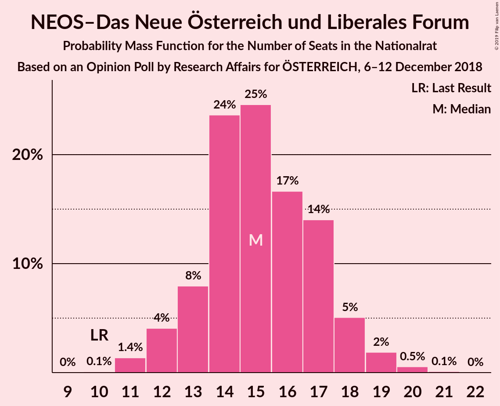
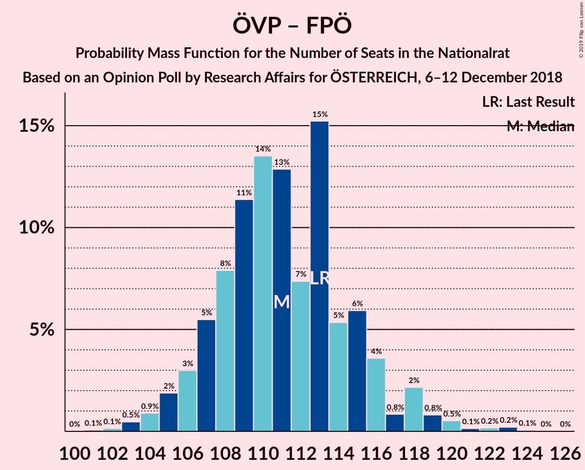
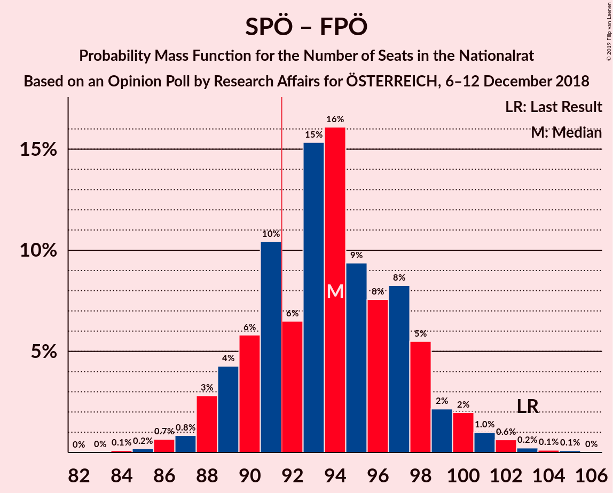

# Opinion Poll by Research Affairs for ÖSTERREICH, 6–12 December 2018

<a href="#voting-intentions">Voting Intentions</a> | <a href="#seats">Seats</a> | <a href="#coalitions">Coalitions</a> | <a href="#technical-information">Technical Information</a>

## Voting Intentions

### Confidence Intervals

| Party | Last Result | Poll Result | 80% Confidence Interval | 90% Confidence Interval | 95% Confidence Interval | 99% Confidence Interval |
|:-----:|:-----------:|:-----------:|:-----------------------:|:-----------------------:|:-----------------------:|:-----------------------:|
| Österreichische Volkspartei | 31.5% | 34.0% | 32.1–35.9% |31.6–36.5% |31.1–37.0% |30.2–37.9% |
| Sozialdemokratische Partei Österreichs | 26.9% | 25.0% | 23.3–26.8% |22.8–27.3% |22.4–27.8% |21.6–28.6% |
| Freiheitliche Partei Österreichs | 26.0% | 24.0% | 22.3–25.8% |21.8–26.3% |21.4–26.7% |20.7–27.6% |
| NEOS–Das Neue Österreich und Liberales Forum | 5.3% | 8.0% | 7.0–9.2% |6.7–9.5% |6.5–9.8% |6.0–10.5% |
| Die Grünen–Die Grüne Alternative | 3.8% | 5.0% | 4.2–6.0% |4.0–6.3% |3.8–6.5% |3.5–7.0% |
| JETZT–Liste Pilz | 4.4% | 2.0% | 1.5–2.7% |1.4–2.9% |1.3–3.1% |1.1–3.4% |

*Note:* The poll result column reflects the actual value used in the calculations. Published results may vary slightly, and in addition be rounded to fewer digits.

## Seats

### Confidence Intervals

| Party | Last Result | Median | 80% Confidence Interval | 90% Confidence Interval | 95% Confidence Interval | 99% Confidence Interval |
|:-----:|:-----------:|:------:|:-----------------------:|:-----------------------:|:-----------------------:|:-----------------------:|
| <a href="#österreichische-volkspartei">Österreichische Volkspartei</a> | 62 | 65 | 63–68 |62–68 |58–68 |58–73 |
| <a href="#sozialdemokratische-partei-österreichs">Sozialdemokratische Partei Österreichs</a> | 52 | 50 | 43–52 |43–52 |43–53 |42–55 |
| <a href="#freiheitliche-partei-österreichs">Freiheitliche Partei Österreichs</a> | 51 | 49 | 47–50 |40–50 |40–50 |37–53 |
| <a href="#neos–das-neue-österreich-und-liberales-forum">NEOS–Das Neue Österreich und Liberales Forum</a> | 10 | 14 | 14–16 |11–18 |10–18 |10–19 |
| <a href="#die-grünen–die-grüne-alternative">Die Grünen–Die Grüne Alternative</a> | 0 | 10 | 0–11 |0–11 |0–12 |0–12 |
| <a href="#jetzt–liste-pilz">JETZT–Liste Pilz</a> | 8 | 0 | 0 |0 |0 |0 |

### Österreichische Volkspartei

*For a full overview of the results for this party, see the [Österreichische Volkspartei](party-österreichischevolkspartei.html) page.*

| Number of Seats | Probability | Accumulated | Special Marks |
|:---------------:|:-----------:|:-----------:|:-------------:|
| 56 | 0.1% | 100% |  |
| 57 | 0.1% | 99.9% |  |
| 58 | 2% | 99.8% |  |
| 59 | 0% | 97% |  |
| 60 | 0.6% | 97% |  |
| 61 | 2% | 97% |  |
| 62 | 1.2% | 95% | Last Result |
| 63 | 34% | 94% |  |
| 64 | 6% | 60% |  |
| 65 | 27% | 54% | Median |
| 66 | 0% | 27% |  |
| 67 | 5% | 27% |  |
| 68 | 20% | 22% |  |
| 69 | 0% | 2% |  |
| 70 | 0.1% | 2% |  |
| 71 | 1.3% | 2% |  |
| 72 | 0.1% | 0.7% |  |
| 73 | 0.2% | 0.6% |  |
| 74 | 0.3% | 0.4% |  |
| 75 | 0.1% | 0.1% |  |
| 76 | 0% | 0% |  |

### Sozialdemokratische Partei Österreichs

*For a full overview of the results for this party, see the [Sozialdemokratische Partei Österreichs](party-sozialdemokratischeparteiösterreichs.html) page.*

| Number of Seats | Probability | Accumulated | Special Marks |
|:---------------:|:-----------:|:-----------:|:-------------:|
| 41 | 0% | 100% |  |
| 42 | 1.3% | 99.9% |  |
| 43 | 36% | 98.7% |  |
| 44 | 0.1% | 63% |  |
| 45 | 0.1% | 63% |  |
| 46 | 2% | 63% |  |
| 47 | 5% | 61% |  |
| 48 | 0.2% | 56% |  |
| 49 | 0.9% | 56% |  |
| 50 | 32% | 55% | Median |
| 51 | 0% | 23% |  |
| 52 | 19% | 23% | Last Result |
| 53 | 2% | 3% |  |
| 54 | 0.3% | 1.0% |  |
| 55 | 0.6% | 0.7% |  |
| 56 | 0% | 0% |  |

### Freiheitliche Partei Österreichs

*For a full overview of the results for this party, see the [Freiheitliche Partei Österreichs](party-freiheitlicheparteiösterreichs.html) page.*

| Number of Seats | Probability | Accumulated | Special Marks |
|:---------------:|:-----------:|:-----------:|:-------------:|
| 37 | 0.5% | 100% |  |
| 38 | 0% | 99.5% |  |
| 39 | 0.2% | 99.5% |  |
| 40 | 5% | 99.3% |  |
| 41 | 1.3% | 94% |  |
| 42 | 0.1% | 93% |  |
| 43 | 0.3% | 93% |  |
| 44 | 2% | 93% |  |
| 45 | 0% | 90% |  |
| 46 | 0% | 90% |  |
| 47 | 28% | 90% |  |
| 48 | 0.4% | 62% |  |
| 49 | 26% | 62% | Median |
| 50 | 34% | 36% |  |
| 51 | 1.2% | 2% | Last Result |
| 52 | 0% | 0.7% |  |
| 53 | 0.6% | 0.7% |  |
| 54 | 0% | 0.1% |  |
| 55 | 0.1% | 0.1% |  |
| 56 | 0% | 0% |  |

### NEOS–Das Neue Österreich und Liberales Forum

*For a full overview of the results for this party, see the [NEOS–Das Neue Österreich und Liberales Forum](party-neos–dasneueösterreichundliberalesforum.html) page.*

| Number of Seats | Probability | Accumulated | Special Marks |
|:---------------:|:-----------:|:-----------:|:-------------:|
| 10 | 5% | 100% | Last Result |
| 11 | 0.9% | 95% |  |
| 12 | 0.1% | 94% |  |
| 13 | 0.3% | 94% |  |
| 14 | 47% | 94% | Median |
| 15 | 0.3% | 47% |  |
| 16 | 38% | 47% |  |
| 17 | 2% | 9% |  |
| 18 | 5% | 7% |  |
| 19 | 2% | 2% |  |
| 20 | 0.1% | 0.2% |  |
| 21 | 0.1% | 0.1% |  |
| 22 | 0% | 0% |  |

### Die Grünen–Die Grüne Alternative

*For a full overview of the results for this party, see the [Die Grünen–Die Grüne Alternative](party-diegrünen–diegrünealternative.html) page.*

| Number of Seats | Probability | Accumulated | Special Marks |
|:---------------:|:-----------:|:-----------:|:-------------:|
| 0 | 20% | 100% | Last Result |
| 1 | 0% | 80% |  |
| 2 | 0% | 80% |  |
| 3 | 0% | 80% |  |
| 4 | 0% | 80% |  |
| 5 | 0% | 80% |  |
| 6 | 0% | 80% |  |
| 7 | 27% | 80% |  |
| 8 | 2% | 52% |  |
| 9 | 0.1% | 50% |  |
| 10 | 6% | 50% | Median |
| 11 | 41% | 45% |  |
| 12 | 4% | 4% |  |
| 13 | 0% | 0% |  |

### JETZT–Liste Pilz

*For a full overview of the results for this party, see the [JETZT–Liste Pilz](party-jetzt–listepilz.html) page.*

| Number of Seats | Probability | Accumulated | Special Marks |
|:---------------:|:-----------:|:-----------:|:-------------:|
| 0 | 100% | 100% | Median |
| 1 | 0% | 0% |  |
| 2 | 0% | 0% |  |
| 3 | 0% | 0% |  |
| 4 | 0% | 0% |  |
| 5 | 0% | 0% |  |
| 6 | 0% | 0% |  |
| 7 | 0% | 0% |  |
| 8 | 0% | 0% | Last Result |

## Coalitions

### Confidence Intervals

| Coalition | Last Result | Median | Majority? | 80% Confidence Interval | 90% Confidence Interval | 95% Confidence Interval | 99% Confidence Interval |
|:---------:|:-----------:|:------:|:---------:|:-----------------------:|:-----------------------:|:-----------------------:|:-----------------------:|
| Österreichische Volkspartei – Sozialdemokratische Partei Österreichs | 114 | 114 | 100% | 106–120 | 106–120 | 106–120 | 105–122 |
| Österreichische Volkspartei – Freiheitliche Partei Österreichs | 113 | 113 | 100% | 110–117 | 104–117 | 104–117 | 102–117 |
| Sozialdemokratische Partei Österreichs – Freiheitliche Partei Österreichs | 103 | 97 | 93% | 93–101 | 90–101 | 90–101 | 83–102 |
| Österreichische Volkspartei | 62 | 65 | 0% | 63–68 | 62–68 | 58–68 | 58–73 |
| Sozialdemokratische Partei Österreichs | 52 | 50 | 0% | 43–52 | 43–52 | 43–53 | 42–55 |

### Österreichische Volkspartei – Sozialdemokratische Partei Österreichs

| Number of Seats | Probability | Accumulated | Special Marks |
|:---------------:|:-----------:|:-----------:|:-------------:|
| 102 | 0.1% | 100% |  |
| 103 | 0% | 99.9% |  |
| 104 | 0% | 99.9% |  |
| 105 | 1.2% | 99.9% |  |
| 106 | 34% | 98.7% |  |
| 107 | 2% | 64% |  |
| 108 | 0% | 63% |  |
| 109 | 0% | 63% |  |
| 110 | 0% | 63% |  |
| 111 | 2% | 63% |  |
| 112 | 0.1% | 60% |  |
| 113 | 2% | 60% |  |
| 114 | 10% | 58% | Last Result |
| 115 | 28% | 48% | Median |
| 116 | 0% | 20% |  |
| 117 | 0% | 20% |  |
| 118 | 0% | 20% |  |
| 119 | 0% | 20% |  |
| 120 | 19% | 20% |  |
| 121 | 0.3% | 0.9% |  |
| 122 | 0.3% | 0.6% |  |
| 123 | 0.3% | 0.3% |  |
| 124 | 0% | 0% |  |

### Österreichische Volkspartei – Freiheitliche Partei Österreichs

| Number of Seats | Probability | Accumulated | Special Marks |
|:---------------:|:-----------:|:-----------:|:-------------:|
| 99 | 0.1% | 100% |  |
| 100 | 0% | 99.9% |  |
| 101 | 0% | 99.9% |  |
| 102 | 2% | 99.9% |  |
| 103 | 0% | 98% |  |
| 104 | 5% | 98% |  |
| 105 | 0.3% | 92% |  |
| 106 | 0% | 92% |  |
| 107 | 0.6% | 92% |  |
| 108 | 0.1% | 92% |  |
| 109 | 0.1% | 92% |  |
| 110 | 2% | 92% |  |
| 111 | 0.3% | 90% |  |
| 112 | 29% | 90% |  |
| 113 | 36% | 61% | Last Result |
| 114 | 0.1% | 25% | Median |
| 115 | 0.4% | 25% |  |
| 116 | 5% | 25% |  |
| 117 | 20% | 20% |  |
| 118 | 0.1% | 0.1% |  |
| 119 | 0% | 0% |  |

### Sozialdemokratische Partei Österreichs – Freiheitliche Partei Österreichs

| Number of Seats | Probability | Accumulated | Special Marks |
|:---------------:|:-----------:|:-----------:|:-------------:|
| 83 | 1.3% | 100% |  |
| 84 | 0.1% | 98.7% |  |
| 85 | 0.1% | 98.7% |  |
| 86 | 0.3% | 98.6% |  |
| 87 | 0% | 98% |  |
| 88 | 0% | 98% |  |
| 89 | 0% | 98% |  |
| 90 | 5% | 98% |  |
| 91 | 0.5% | 93% |  |
| 92 | 0% | 93% | Majority |
| 93 | 34% | 93% |  |
| 94 | 1.2% | 58% |  |
| 95 | 2% | 57% |  |
| 96 | 5% | 55% |  |
| 97 | 30% | 50% |  |
| 98 | 0% | 21% |  |
| 99 | 0% | 21% | Median |
| 100 | 0% | 21% |  |
| 101 | 19% | 21% |  |
| 102 | 1.2% | 1.2% |  |
| 103 | 0% | 0.1% | Last Result |
| 104 | 0% | 0.1% |  |
| 105 | 0% | 0% |  |

### Österreichische Volkspartei

| Number of Seats | Probability | Accumulated | Special Marks |
|:---------------:|:-----------:|:-----------:|:-------------:|
| 56 | 0.1% | 100% |  |
| 57 | 0.1% | 99.9% |  |
| 58 | 2% | 99.8% |  |
| 59 | 0% | 97% |  |
| 60 | 0.6% | 97% |  |
| 61 | 2% | 97% |  |
| 62 | 1.2% | 95% | Last Result |
| 63 | 34% | 94% |  |
| 64 | 6% | 60% |  |
| 65 | 27% | 54% | Median |
| 66 | 0% | 27% |  |
| 67 | 5% | 27% |  |
| 68 | 20% | 22% |  |
| 69 | 0% | 2% |  |
| 70 | 0.1% | 2% |  |
| 71 | 1.3% | 2% |  |
| 72 | 0.1% | 0.7% |  |
| 73 | 0.2% | 0.6% |  |
| 74 | 0.3% | 0.4% |  |
| 75 | 0.1% | 0.1% |  |
| 76 | 0% | 0% |  |

### Sozialdemokratische Partei Österreichs

| Number of Seats | Probability | Accumulated | Special Marks |
|:---------------:|:-----------:|:-----------:|:-------------:|
| 41 | 0% | 100% |  |
| 42 | 1.3% | 99.9% |  |
| 43 | 36% | 98.7% |  |
| 44 | 0.1% | 63% |  |
| 45 | 0.1% | 63% |  |
| 46 | 2% | 63% |  |
| 47 | 5% | 61% |  |
| 48 | 0.2% | 56% |  |
| 49 | 0.9% | 56% |  |
| 50 | 32% | 55% | Median |
| 51 | 0% | 23% |  |
| 52 | 19% | 23% | Last Result |
| 53 | 2% | 3% |  |
| 54 | 0.3% | 1.0% |  |
| 55 | 0.6% | 0.7% |  |
| 56 | 0% | 0% |  |

## Technical Information

### Opinion Poll

+ **Polling firm:** Research Affairs
+ **Commissioner(s):** ÖSTERREICH
+ **Fieldwork period:** 6–12 December 2018

### Calculations

+ **Sample size:** 1001
+ **Simulations done:** 1,024
+ **Error estimate:** 3.49%

