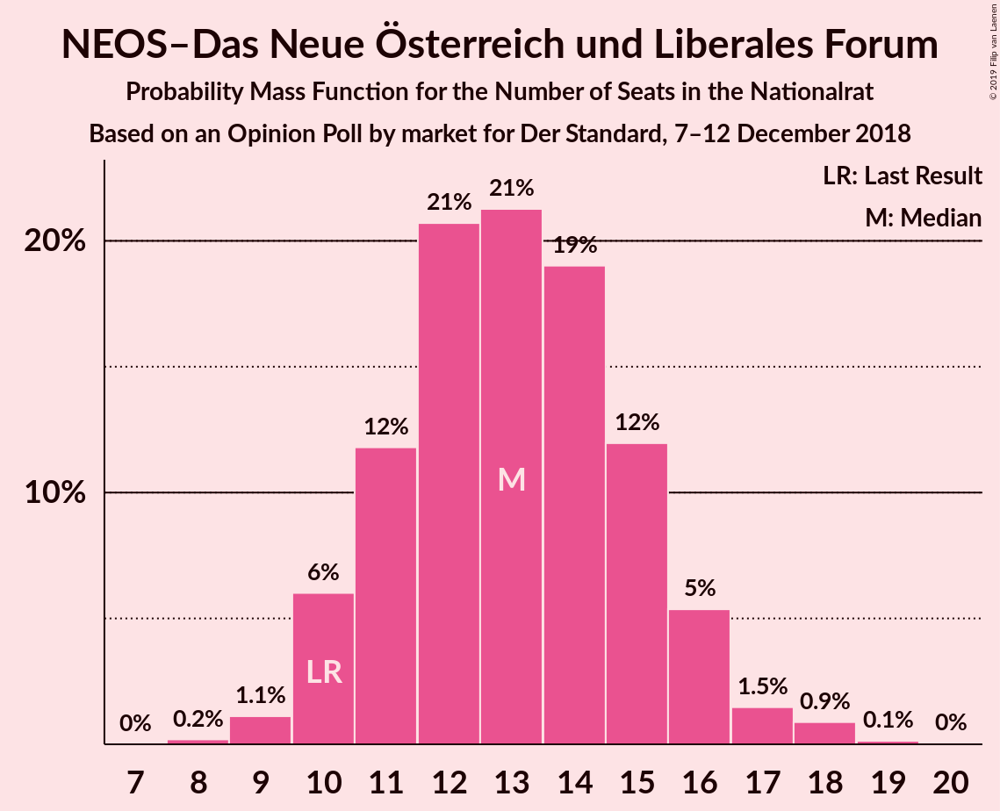
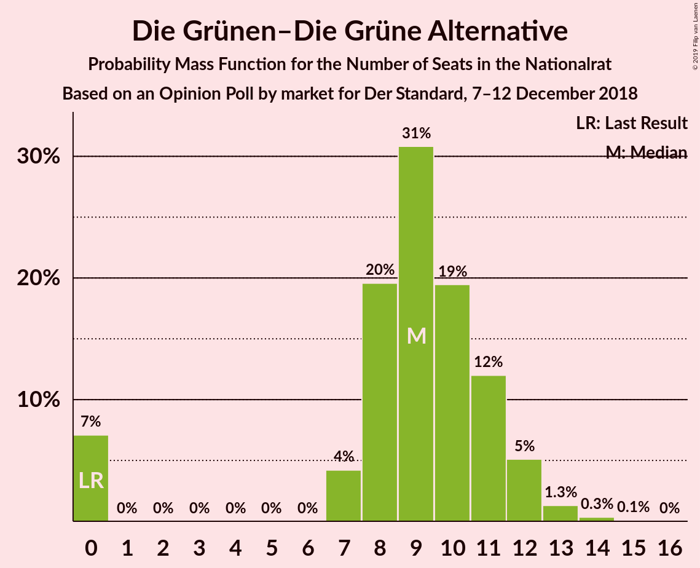
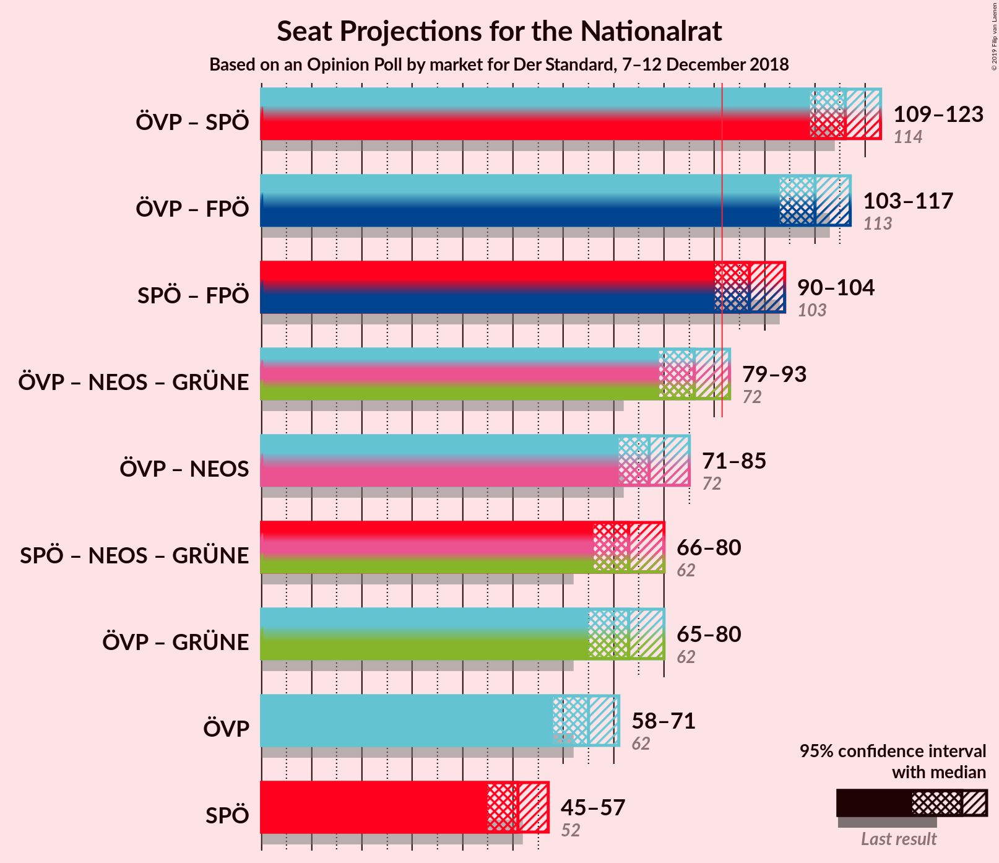
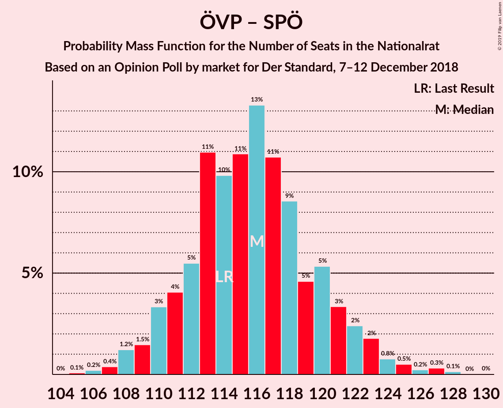
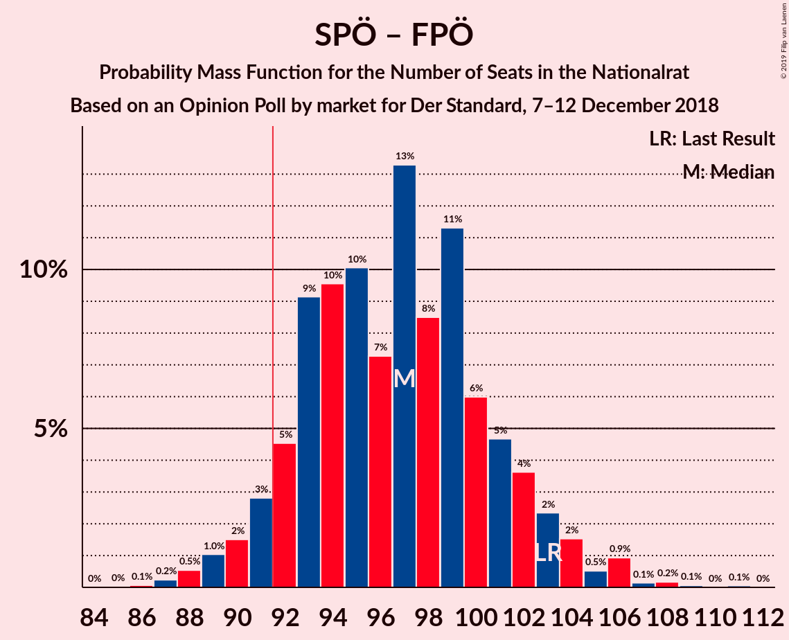

# Opinion Poll by market for Der Standard, 7–12 December 2018

<a href="#voting-intentions">Voting Intentions</a> | <a href="#seats">Seats</a> | <a href="#coalitions">Coalitions</a> | <a href="#technical-information">Technical Information</a>

## Voting Intentions

### Confidence Intervals

| Party | Last Result | Poll Result | 80% Confidence Interval | 90% Confidence Interval | 95% Confidence Interval | 99% Confidence Interval |
|:-----:|:-----------:|:-----------:|:-----------------------:|:-----------------------:|:-----------------------:|:-----------------------:|
| Österreichische Volkspartei | 31.5% | 34.0% | 31.9–36.2% |31.3–36.8% |30.8–37.3% |29.8–38.4% |
| Sozialdemokratische Partei Österreichs | 26.9% | 27.0% | 25.0–29.1% |24.5–29.7% |24.0–30.2% |23.1–31.2% |
| Freiheitliche Partei Österreichs | 26.0% | 24.0% | 22.1–26.0% |21.6–26.6% |21.2–27.1% |20.3–28.1% |
| NEOS–Das Neue Österreich und Liberales Forum | 5.3% | 7.0% | 5.9–8.3% |5.6–8.6% |5.4–8.9% |4.9–9.6% |
| Die Grünen–Die Grüne Alternative | 3.8% | 5.0% | 4.1–6.1% |3.9–6.4% |3.7–6.7% |3.3–7.3% |
| JETZT–Liste Pilz | 4.4% | 2.0% | 1.5–2.8% |1.3–3.0% |1.2–3.2% |1.0–3.6% |

*Note:* The poll result column reflects the actual value used in the calculations. Published results may vary slightly, and in addition be rounded to fewer digits.

## Seats

### Confidence Intervals

| Party | Last Result | Median | 80% Confidence Interval | 90% Confidence Interval | 95% Confidence Interval | 99% Confidence Interval |
|:-----:|:-----------:|:------:|:-----------------------:|:-----------------------:|:-----------------------:|:-----------------------:|
| <a href="#österreichische-volkspartei">Österreichische Volkspartei</a> | 62 | 68 | 58–70 |58–71 |58–71 |57–71 |
| <a href="#sozialdemokratische-partei-österreichs">Sozialdemokratische Partei Österreichs</a> | 52 | 48 | 47–52 |43–54 |43–54 |43–58 |
| <a href="#freiheitliche-partei-österreichs">Freiheitliche Partei Österreichs</a> | 51 | 45 | 40–49 |40–51 |40–51 |40–52 |
| <a href="#neos–das-neue-österreich-und-liberales-forum">NEOS–Das Neue Österreich und Liberales Forum</a> | 10 | 13 | 11–16 |10–16 |10–16 |10–17 |
| <a href="#die-grünen–die-grüne-alternative">Die Grünen–Die Grüne Alternative</a> | 0 | 9 | 7–11 |0–11 |0–11 |0–13 |
| <a href="#jetzt–liste-pilz">JETZT–Liste Pilz</a> | 8 | 0 | 0 |0 |0 |0 |

### Österreichische Volkspartei

*For a full overview of the results for this party, see the [Österreichische Volkspartei](party-österreichischevolkspartei.html) page.*

| Number of Seats | Probability | Accumulated | Special Marks |
|:---------------:|:-----------:|:-----------:|:-------------:|
| 56 | 0.4% | 100% |  |
| 57 | 0.2% | 99.6% |  |
| 58 | 13% | 99.3% |  |
| 59 | 5% | 87% |  |
| 60 | 1.4% | 82% |  |
| 61 | 1.1% | 80% |  |
| 62 | 0.1% | 79% | Last Result |
| 63 | 0% | 79% |  |
| 64 | 0% | 79% |  |
| 65 | 0% | 79% |  |
| 66 | 0% | 79% |  |
| 67 | 0% | 79% |  |
| 68 | 60% | 79% | Median |
| 69 | 0.1% | 18% |  |
| 70 | 11% | 18% |  |
| 71 | 7% | 7% |  |
| 72 | 0% | 0% |  |

### Sozialdemokratische Partei Österreichs

*For a full overview of the results for this party, see the [Sozialdemokratische Partei Österreichs](party-sozialdemokratischeparteiösterreichs.html) page.*

| Number of Seats | Probability | Accumulated | Special Marks |
|:---------------:|:-----------:|:-----------:|:-------------:|
| 43 | 5% | 100% |  |
| 44 | 0.5% | 95% |  |
| 45 | 0.4% | 94% |  |
| 46 | 0.5% | 94% |  |
| 47 | 6% | 93% |  |
| 48 | 59% | 88% | Median |
| 49 | 2% | 29% |  |
| 50 | 0% | 27% |  |
| 51 | 0.7% | 27% |  |
| 52 | 17% | 26% | Last Result |
| 53 | 0.5% | 10% |  |
| 54 | 7% | 9% |  |
| 55 | 0.1% | 2% |  |
| 56 | 0.6% | 2% |  |
| 57 | 0.4% | 2% |  |
| 58 | 1.2% | 1.3% |  |
| 59 | 0% | 0.1% |  |
| 60 | 0% | 0.1% |  |
| 61 | 0.1% | 0.1% |  |
| 62 | 0% | 0% |  |

### Freiheitliche Partei Österreichs

*For a full overview of the results for this party, see the [Freiheitliche Partei Österreichs](party-freiheitlicheparteiösterreichs.html) page.*

| Number of Seats | Probability | Accumulated | Special Marks |
|:---------------:|:-----------:|:-----------:|:-------------:|
| 38 | 0% | 100% |  |
| 39 | 0% | 99.9% |  |
| 40 | 13% | 99.9% |  |
| 41 | 0% | 87% |  |
| 42 | 0.1% | 87% |  |
| 43 | 0.4% | 87% |  |
| 44 | 2% | 86% |  |
| 45 | 46% | 85% | Median |
| 46 | 0.1% | 39% |  |
| 47 | 7% | 39% |  |
| 48 | 19% | 31% |  |
| 49 | 6% | 13% |  |
| 50 | 0.7% | 7% |  |
| 51 | 5% | 7% | Last Result |
| 52 | 1.2% | 2% |  |
| 53 | 0% | 0.5% |  |
| 54 | 0% | 0.5% |  |
| 55 | 0.5% | 0.5% |  |
| 56 | 0% | 0% |  |

### NEOS–Das Neue Österreich und Liberales Forum

*For a full overview of the results for this party, see the [NEOS–Das Neue Österreich und Liberales Forum](party-neos–dasneueösterreichundliberalesforum.html) page.*

| Number of Seats | Probability | Accumulated | Special Marks |
|:---------------:|:-----------:|:-----------:|:-------------:|
| 10 | 6% | 100% | Last Result |
| 11 | 11% | 94% |  |
| 12 | 6% | 82% |  |
| 13 | 48% | 77% | Median |
| 14 | 2% | 29% |  |
| 15 | 0.1% | 27% |  |
| 16 | 26% | 27% |  |
| 17 | 0.5% | 0.7% |  |
| 18 | 0% | 0.2% |  |
| 19 | 0% | 0.2% |  |
| 20 | 0.2% | 0.2% |  |
| 21 | 0% | 0% |  |

### Die Grünen–Die Grüne Alternative

*For a full overview of the results for this party, see the [Die Grünen–Die Grüne Alternative](party-diegrünen–diegrünealternative.html) page.*

| Number of Seats | Probability | Accumulated | Special Marks |
|:---------------:|:-----------:|:-----------:|:-------------:|
| 0 | 9% | 100% | Last Result |
| 1 | 0% | 91% |  |
| 2 | 0% | 91% |  |
| 3 | 0% | 91% |  |
| 4 | 0% | 91% |  |
| 5 | 0% | 91% |  |
| 6 | 0% | 91% |  |
| 7 | 6% | 91% |  |
| 8 | 0.5% | 85% |  |
| 9 | 60% | 85% | Median |
| 10 | 10% | 25% |  |
| 11 | 14% | 15% |  |
| 12 | 0% | 0.9% |  |
| 13 | 0.7% | 0.8% |  |
| 14 | 0.1% | 0.2% |  |
| 15 | 0% | 0.1% |  |
| 16 | 0% | 0% |  |

### JETZT–Liste Pilz

*For a full overview of the results for this party, see the [JETZT–Liste Pilz](party-jetzt–listepilz.html) page.*

| Number of Seats | Probability | Accumulated | Special Marks |
|:---------------:|:-----------:|:-----------:|:-------------:|
| 0 | 99.9% | 100% | Median |
| 1 | 0% | 0.1% |  |
| 2 | 0% | 0.1% |  |
| 3 | 0% | 0.1% |  |
| 4 | 0% | 0.1% |  |
| 5 | 0% | 0.1% |  |
| 6 | 0% | 0.1% |  |
| 7 | 0.1% | 0.1% |  |
| 8 | 0% | 0% | Last Result |

## Coalitions

### Confidence Intervals

| Coalition | Last Result | Median | Majority? | 80% Confidence Interval | 90% Confidence Interval | 95% Confidence Interval | 99% Confidence Interval |
|:---------:|:-----------:|:------:|:---------:|:-----------------------:|:-----------------------:|:-----------------------:|:-----------------------:|
| Österreichische Volkspartei – Sozialdemokratische Partei Österreichs | 114 | 116 | 100% | 110–117 | 110–125 | 110–125 | 107–125 |
| Österreichische Volkspartei – Freiheitliche Partei Österreichs | 113 | 113 | 100% | 106–118 | 106–119 | 106–119 | 101–119 |
| Sozialdemokratische Partei Österreichs – Freiheitliche Partei Österreichs | 103 | 93 | 81% | 88–101 | 88–103 | 88–103 | 88–109 |
| Österreichische Volkspartei | 62 | 68 | 0% | 58–70 | 58–71 | 58–71 | 57–71 |
| Sozialdemokratische Partei Österreichs | 52 | 48 | 0% | 47–52 | 43–54 | 43–54 | 43–58 |

### Österreichische Volkspartei – Sozialdemokratische Partei Österreichs

| Number of Seats | Probability | Accumulated | Special Marks |
|:---------------:|:-----------:|:-----------:|:-------------:|
| 106 | 0.1% | 100% |  |
| 107 | 1.1% | 99.9% |  |
| 108 | 0% | 98.8% |  |
| 109 | 0.2% | 98.7% |  |
| 110 | 13% | 98.5% |  |
| 111 | 4% | 85% |  |
| 112 | 0.1% | 81% |  |
| 113 | 6% | 81% |  |
| 114 | 0.5% | 75% | Last Result |
| 115 | 0% | 75% |  |
| 116 | 59% | 75% | Median |
| 117 | 8% | 16% |  |
| 118 | 1.3% | 9% |  |
| 119 | 0% | 7% |  |
| 120 | 0.1% | 7% |  |
| 121 | 0% | 7% |  |
| 122 | 0% | 7% |  |
| 123 | 0% | 7% |  |
| 124 | 0.5% | 7% |  |
| 125 | 7% | 7% |  |
| 126 | 0% | 0% |  |

### Österreichische Volkspartei – Freiheitliche Partei Österreichs

| Number of Seats | Probability | Accumulated | Special Marks |
|:---------------:|:-----------:|:-----------:|:-------------:|
| 99 | 0% | 100% |  |
| 100 | 0% | 99.9% |  |
| 101 | 0.6% | 99.9% |  |
| 102 | 0% | 99.3% |  |
| 103 | 0.1% | 99.3% |  |
| 104 | 0% | 99.3% |  |
| 105 | 0.1% | 99.3% |  |
| 106 | 13% | 99.2% |  |
| 107 | 0.1% | 86% |  |
| 108 | 13% | 86% |  |
| 109 | 0.5% | 73% |  |
| 110 | 4% | 73% |  |
| 111 | 2% | 69% |  |
| 112 | 1.5% | 67% |  |
| 113 | 46% | 65% | Last Result, Median |
| 114 | 0% | 19% |  |
| 115 | 0% | 19% |  |
| 116 | 0.5% | 19% |  |
| 117 | 0.5% | 18% |  |
| 118 | 12% | 18% |  |
| 119 | 6% | 6% |  |
| 120 | 0% | 0% |  |

### Sozialdemokratische Partei Österreichs – Freiheitliche Partei Österreichs

| Number of Seats | Probability | Accumulated | Special Marks |
|:---------------:|:-----------:|:-----------:|:-------------:|
| 87 | 0.1% | 100% |  |
| 88 | 13% | 99.9% |  |
| 89 | 0% | 87% |  |
| 90 | 0% | 87% |  |
| 91 | 6% | 87% |  |
| 92 | 0% | 81% | Majority |
| 93 | 47% | 81% | Median |
| 94 | 0% | 34% |  |
| 95 | 0% | 34% |  |
| 96 | 6% | 34% |  |
| 97 | 0.3% | 28% |  |
| 98 | 0.5% | 28% |  |
| 99 | 0% | 27% |  |
| 100 | 13% | 27% |  |
| 101 | 8% | 14% |  |
| 102 | 0.5% | 7% |  |
| 103 | 4% | 6% | Last Result |
| 104 | 0% | 2% |  |
| 105 | 0% | 2% |  |
| 106 | 0% | 2% |  |
| 107 | 0% | 2% |  |
| 108 | 0.6% | 2% |  |
| 109 | 1.3% | 1.3% |  |
| 110 | 0% | 0% |  |

### Österreichische Volkspartei

| Number of Seats | Probability | Accumulated | Special Marks |
|:---------------:|:-----------:|:-----------:|:-------------:|
| 56 | 0.4% | 100% |  |
| 57 | 0.2% | 99.6% |  |
| 58 | 13% | 99.3% |  |
| 59 | 5% | 87% |  |
| 60 | 1.4% | 82% |  |
| 61 | 1.1% | 80% |  |
| 62 | 0.1% | 79% | Last Result |
| 63 | 0% | 79% |  |
| 64 | 0% | 79% |  |
| 65 | 0% | 79% |  |
| 66 | 0% | 79% |  |
| 67 | 0% | 79% |  |
| 68 | 60% | 79% | Median |
| 69 | 0.1% | 18% |  |
| 70 | 11% | 18% |  |
| 71 | 7% | 7% |  |
| 72 | 0% | 0% |  |

### Sozialdemokratische Partei Österreichs

| Number of Seats | Probability | Accumulated | Special Marks |
|:---------------:|:-----------:|:-----------:|:-------------:|
| 43 | 5% | 100% |  |
| 44 | 0.5% | 95% |  |
| 45 | 0.4% | 94% |  |
| 46 | 0.5% | 94% |  |
| 47 | 6% | 93% |  |
| 48 | 59% | 88% | Median |
| 49 | 2% | 29% |  |
| 50 | 0% | 27% |  |
| 51 | 0.7% | 27% |  |
| 52 | 17% | 26% | Last Result |
| 53 | 0.5% | 10% |  |
| 54 | 7% | 9% |  |
| 55 | 0.1% | 2% |  |
| 56 | 0.6% | 2% |  |
| 57 | 0.4% | 2% |  |
| 58 | 1.2% | 1.3% |  |
| 59 | 0% | 0.1% |  |
| 60 | 0% | 0.1% |  |
| 61 | 0.1% | 0.1% |  |
| 62 | 0% | 0% |  |

## Technical Information

### Opinion Poll

+ **Polling firm:** market
+ **Commissioner(s):** Der Standard
+ **Fieldwork period:** 7–12 December 2018

### Calculations

+ **Sample size:** 804
+ **Simulations done:** 1,024
+ **Error estimate:** 5.52%

