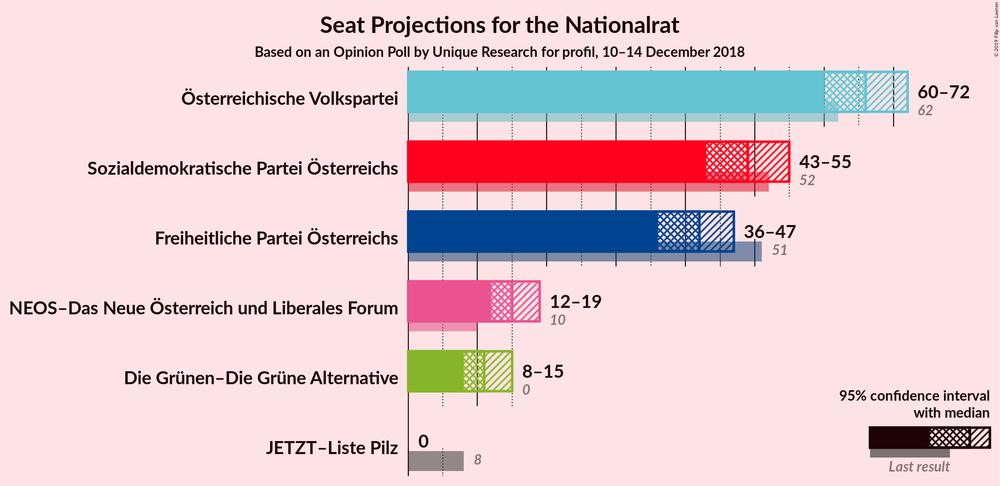
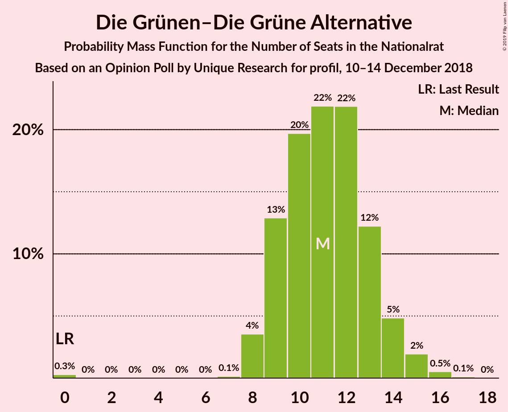
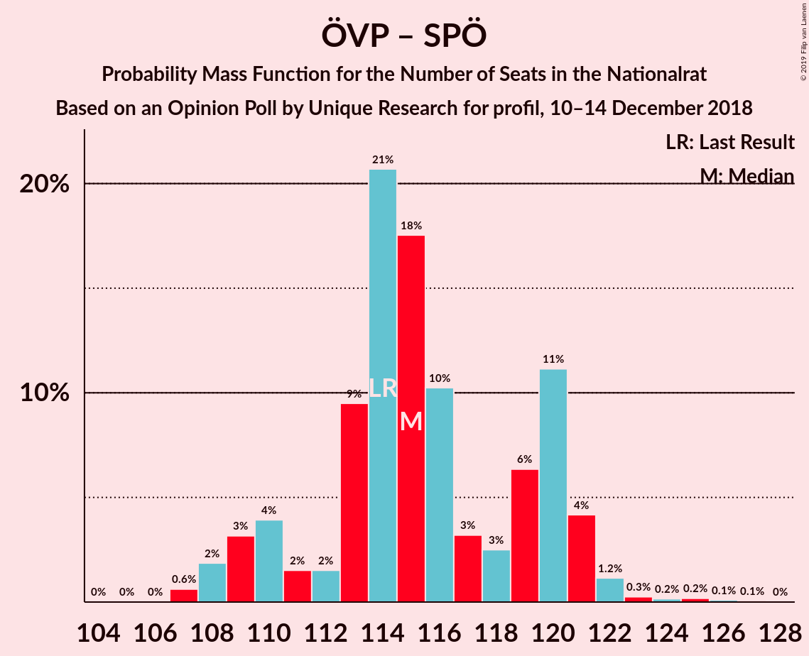
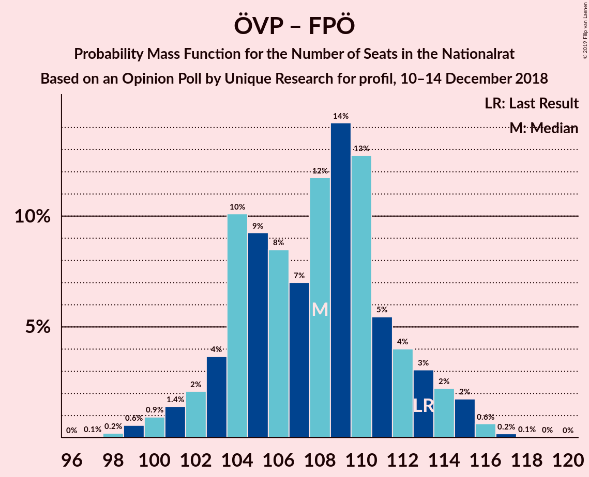

# Opinion Poll by Unique Research for profil, 10–14 December 2018

<a href="#voting-intentions">Voting Intentions</a> | <a href="#seats">Seats</a> | <a href="#coalitions">Coalitions</a> | <a href="#technical-information">Technical Information</a>

## Voting Intentions

### Confidence Intervals

| Party | Last Result | Poll Result | 80% Confidence Interval | 90% Confidence Interval | 95% Confidence Interval | 99% Confidence Interval |
|:-----:|:-----------:|:-----------:|:-----------------------:|:-----------------------:|:-----------------------:|:-----------------------:|
| Österreichische Volkspartei | 31.5% | 35.0% | 32.9–37.2% |32.3–37.8% |31.8–38.4% |30.8–39.4% |
| Sozialdemokratische Partei Österreichs | 26.9% | 26.0% | 24.1–28.1% |23.5–28.7% |23.1–29.2% |22.2–30.2% |
| Freiheitliche Partei Österreichs | 26.0% | 22.0% | 20.2–24.0% |19.7–24.5% |19.3–25.0% |18.4–26.0% |
| NEOS–Das Neue Österreich und Liberales Forum | 5.3% | 8.0% | 6.9–9.4% |6.6–9.8% |6.3–10.1% |5.8–10.8% |
| Die Grünen–Die Grüne Alternative | 3.8% | 6.0% | 5.0–7.2% |4.8–7.6% |4.6–7.9% |4.1–8.5% |
| JETZT–Liste Pilz | 4.4% | 2.0% | 1.5–2.8% |1.4–3.0% |1.2–3.2% |1.0–3.7% |

*Note:* The poll result column reflects the actual value used in the calculations. Published results may vary slightly, and in addition be rounded to fewer digits.

## Seats

### Confidence Intervals

| Party | Last Result | Median | 80% Confidence Interval | 90% Confidence Interval | 95% Confidence Interval | 99% Confidence Interval |
|:-----:|:-----------:|:------:|:-----------------------:|:-----------------------:|:-----------------------:|:-----------------------:|
| <a href="#österreichische-volkspartei">Österreichische Volkspartei</a> | 62 | 65 | 63–65 |63–72 |63–72 |63–72 |
| <a href="#sozialdemokratische-partei-österreichs">Sozialdemokratische Partei Österreichs</a> | 52 | 49 | 49–52 |46–52 |46–52 |43–58 |
| <a href="#freiheitliche-partei-österreichs">Freiheitliche Partei Österreichs</a> | 51 | 40 | 40–45 |38–45 |38–45 |37–45 |
| <a href="#neos–das-neue-österreich-und-liberales-forum">NEOS–Das Neue Österreich und Liberales Forum</a> | 10 | 16 | 12–16 |12–16 |12–16 |12–21 |
| <a href="#die-grünen–die-grüne-alternative">Die Grünen–Die Grüne Alternative</a> | 0 | 13 | 11–13 |11–14 |11–14 |10–14 |
| <a href="#jetzt–liste-pilz">JETZT–Liste Pilz</a> | 8 | 0 | 0 |0 |0 |0 |

### Österreichische Volkspartei

*For a full overview of the results for this party, see the [Österreichische Volkspartei](party-österreichischevolkspartei.html) page.*

| Number of Seats | Probability | Accumulated | Special Marks |
|:---------------:|:-----------:|:-----------:|:-------------:|
| 56 | 0.1% | 100% |  |
| 57 | 0% | 99.9% |  |
| 58 | 0% | 99.8% |  |
| 59 | 0% | 99.8% |  |
| 60 | 0% | 99.8% |  |
| 61 | 0.1% | 99.8% |  |
| 62 | 0% | 99.8% | Last Result |
| 63 | 20% | 99.7% |  |
| 64 | 2% | 79% |  |
| 65 | 71% | 78% | Median |
| 66 | 0.2% | 7% |  |
| 67 | 0% | 7% |  |
| 68 | 0.1% | 7% |  |
| 69 | 0% | 7% |  |
| 70 | 0% | 7% |  |
| 71 | 0% | 7% |  |
| 72 | 6% | 7% |  |
| 73 | 0% | 0.2% |  |
| 74 | 0.1% | 0.1% |  |
| 75 | 0% | 0% |  |

### Sozialdemokratische Partei Österreichs

*For a full overview of the results for this party, see the [Sozialdemokratische Partei Österreichs](party-sozialdemokratischeparteiösterreichs.html) page.*

| Number of Seats | Probability | Accumulated | Special Marks |
|:---------------:|:-----------:|:-----------:|:-------------:|
| 41 | 0.1% | 100% |  |
| 42 | 0% | 99.9% |  |
| 43 | 0.8% | 99.9% |  |
| 44 | 0.1% | 99.2% |  |
| 45 | 0% | 99.0% |  |
| 46 | 7% | 99.0% |  |
| 47 | 0.1% | 92% |  |
| 48 | 0% | 92% |  |
| 49 | 70% | 92% | Median |
| 50 | 0% | 22% |  |
| 51 | 0.1% | 22% |  |
| 52 | 20% | 22% | Last Result |
| 53 | 0% | 1.4% |  |
| 54 | 0.1% | 1.4% |  |
| 55 | 0.3% | 1.3% |  |
| 56 | 0% | 0.9% |  |
| 57 | 0% | 0.9% |  |
| 58 | 0.9% | 0.9% |  |
| 59 | 0% | 0% |  |

### Freiheitliche Partei Österreichs

*For a full overview of the results for this party, see the [Freiheitliche Partei Österreichs](party-freiheitlicheparteiösterreichs.html) page.*

| Number of Seats | Probability | Accumulated | Special Marks |
|:---------------:|:-----------:|:-----------:|:-------------:|
| 34 | 0.2% | 100% |  |
| 35 | 0% | 99.7% |  |
| 36 | 0% | 99.7% |  |
| 37 | 0.9% | 99.7% |  |
| 38 | 6% | 98.8% |  |
| 39 | 1.0% | 92% |  |
| 40 | 70% | 91% | Median |
| 41 | 0.1% | 22% |  |
| 42 | 0.1% | 21% |  |
| 43 | 0.8% | 21% |  |
| 44 | 0% | 21% |  |
| 45 | 20% | 21% |  |
| 46 | 0.1% | 0.3% |  |
| 47 | 0.1% | 0.2% |  |
| 48 | 0% | 0.1% |  |
| 49 | 0% | 0.1% |  |
| 50 | 0% | 0.1% |  |
| 51 | 0% | 0% | Last Result |

### NEOS–Das Neue Österreich und Liberales Forum

*For a full overview of the results for this party, see the [NEOS–Das Neue Österreich und Liberales Forum](party-neos–dasneueösterreichundliberalesforum.html) page.*

| Number of Seats | Probability | Accumulated | Special Marks |
|:---------------:|:-----------:|:-----------:|:-------------:|
| 10 | 0% | 100% | Last Result |
| 11 | 0% | 100% |  |
| 12 | 21% | 100% |  |
| 13 | 7% | 79% |  |
| 14 | 0% | 72% |  |
| 15 | 0.2% | 72% |  |
| 16 | 70% | 72% | Median |
| 17 | 0.3% | 2% |  |
| 18 | 0% | 2% |  |
| 19 | 0.1% | 2% |  |
| 20 | 0.9% | 2% |  |
| 21 | 0.9% | 0.9% |  |
| 22 | 0% | 0% |  |

### Die Grünen–Die Grüne Alternative

*For a full overview of the results for this party, see the [Die Grünen–Die Grüne Alternative](party-diegrünen–diegrünealternative.html) page.*

| Number of Seats | Probability | Accumulated | Special Marks |
|:---------------:|:-----------:|:-----------:|:-------------:|
| 0 | 0% | 100% | Last Result |
| 1 | 0% | 100% |  |
| 2 | 0% | 100% |  |
| 3 | 0% | 100% |  |
| 4 | 0% | 100% |  |
| 5 | 0% | 100% |  |
| 6 | 0% | 100% |  |
| 7 | 0% | 100% |  |
| 8 | 0% | 100% |  |
| 9 | 0.1% | 100% |  |
| 10 | 1.2% | 99.9% |  |
| 11 | 21% | 98.7% |  |
| 12 | 0.4% | 77% |  |
| 13 | 70% | 77% | Median |
| 14 | 6% | 7% |  |
| 15 | 0.1% | 0.1% |  |
| 16 | 0% | 0% |  |

### JETZT–Liste Pilz

*For a full overview of the results for this party, see the [JETZT–Liste Pilz](party-jetzt–listepilz.html) page.*

| Number of Seats | Probability | Accumulated | Special Marks |
|:---------------:|:-----------:|:-----------:|:-------------:|
| 0 | 100% | 100% | Median |
| 1 | 0% | 0% |  |
| 2 | 0% | 0% |  |
| 3 | 0% | 0% |  |
| 4 | 0% | 0% |  |
| 5 | 0% | 0% |  |
| 6 | 0% | 0% |  |
| 7 | 0% | 0% |  |
| 8 | 0% | 0% | Last Result |

## Coalitions

### Confidence Intervals

| Coalition | Last Result | Median | Majority? | 80% Confidence Interval | 90% Confidence Interval | 95% Confidence Interval | 99% Confidence Interval |
|:---------:|:-----------:|:------:|:---------:|:-----------------------:|:-----------------------:|:-----------------------:|:-----------------------:|
| Österreichische Volkspartei – Sozialdemokratische Partei Österreichs | 114 | 114 | 100% | 114–115 | 114–118 | 114–118 | 107–122 |
| Österreichische Volkspartei – Freiheitliche Partei Österreichs | 113 | 105 | 100% | 105–108 | 105–110 | 105–110 | 102–110 |
| Sozialdemokratische Partei Österreichs – Freiheitliche Partei Österreichs | 103 | 89 | 22% | 89–97 | 84–97 | 84–97 | 84–97 |
| Österreichische Volkspartei | 62 | 65 | 0% | 63–65 | 63–72 | 63–72 | 63–72 |
| Sozialdemokratische Partei Österreichs | 52 | 49 | 0% | 49–52 | 46–52 | 46–52 | 43–58 |

### Österreichische Volkspartei – Sozialdemokratische Partei Österreichs

| Number of Seats | Probability | Accumulated | Special Marks |
|:---------------:|:-----------:|:-----------:|:-------------:|
| 107 | 0.8% | 100% |  |
| 108 | 0.1% | 99.2% |  |
| 109 | 0% | 99.1% |  |
| 110 | 0% | 99.1% |  |
| 111 | 0.1% | 99.1% |  |
| 112 | 0% | 98.9% |  |
| 113 | 0.1% | 98.9% |  |
| 114 | 71% | 98.8% | Last Result, Median |
| 115 | 20% | 28% |  |
| 116 | 0% | 8% |  |
| 117 | 0% | 8% |  |
| 118 | 7% | 8% |  |
| 119 | 0% | 1.3% |  |
| 120 | 0.3% | 1.3% |  |
| 121 | 0% | 1.0% |  |
| 122 | 0.9% | 1.0% |  |
| 123 | 0% | 0% |  |

### Österreichische Volkspartei – Freiheitliche Partei Österreichs

| Number of Seats | Probability | Accumulated | Special Marks |
|:---------------:|:-----------:|:-----------:|:-------------:|
| 99 | 0.3% | 100% |  |
| 100 | 0.1% | 99.7% |  |
| 101 | 0% | 99.7% |  |
| 102 | 0.9% | 99.7% |  |
| 103 | 1.1% | 98.8% |  |
| 104 | 0% | 98% |  |
| 105 | 70% | 98% | Median |
| 106 | 0.1% | 28% |  |
| 107 | 0.8% | 28% |  |
| 108 | 20% | 27% |  |
| 109 | 0% | 7% |  |
| 110 | 6% | 7% |  |
| 111 | 0% | 0.3% |  |
| 112 | 0.1% | 0.3% |  |
| 113 | 0% | 0.2% | Last Result |
| 114 | 0% | 0.2% |  |
| 115 | 0.2% | 0.2% |  |
| 116 | 0% | 0% |  |

### Sozialdemokratische Partei Österreichs – Freiheitliche Partei Österreichs

| Number of Seats | Probability | Accumulated | Special Marks |
|:---------------:|:-----------:|:-----------:|:-------------:|
| 84 | 6% | 100% |  |
| 85 | 0.2% | 93% |  |
| 86 | 2% | 93% |  |
| 87 | 0.2% | 92% |  |
| 88 | 0% | 91% |  |
| 89 | 70% | 91% | Median |
| 90 | 0% | 22% |  |
| 91 | 0.1% | 22% |  |
| 92 | 0% | 22% | Majority |
| 93 | 0% | 22% |  |
| 94 | 0% | 22% |  |
| 95 | 0% | 22% |  |
| 96 | 0.1% | 22% |  |
| 97 | 21% | 21% |  |
| 98 | 0% | 0.2% |  |
| 99 | 0% | 0.1% |  |
| 100 | 0% | 0.1% |  |
| 101 | 0% | 0.1% |  |
| 102 | 0.1% | 0.1% |  |
| 103 | 0% | 0% | Last Result |

### Österreichische Volkspartei

| Number of Seats | Probability | Accumulated | Special Marks |
|:---------------:|:-----------:|:-----------:|:-------------:|
| 56 | 0.1% | 100% |  |
| 57 | 0% | 99.9% |  |
| 58 | 0% | 99.8% |  |
| 59 | 0% | 99.8% |  |
| 60 | 0% | 99.8% |  |
| 61 | 0.1% | 99.8% |  |
| 62 | 0% | 99.8% | Last Result |
| 63 | 20% | 99.7% |  |
| 64 | 2% | 79% |  |
| 65 | 71% | 78% | Median |
| 66 | 0.2% | 7% |  |
| 67 | 0% | 7% |  |
| 68 | 0.1% | 7% |  |
| 69 | 0% | 7% |  |
| 70 | 0% | 7% |  |
| 71 | 0% | 7% |  |
| 72 | 6% | 7% |  |
| 73 | 0% | 0.2% |  |
| 74 | 0.1% | 0.1% |  |
| 75 | 0% | 0% |  |

### Sozialdemokratische Partei Österreichs

| Number of Seats | Probability | Accumulated | Special Marks |
|:---------------:|:-----------:|:-----------:|:-------------:|
| 41 | 0.1% | 100% |  |
| 42 | 0% | 99.9% |  |
| 43 | 0.8% | 99.9% |  |
| 44 | 0.1% | 99.2% |  |
| 45 | 0% | 99.0% |  |
| 46 | 7% | 99.0% |  |
| 47 | 0.1% | 92% |  |
| 48 | 0% | 92% |  |
| 49 | 70% | 92% | Median |
| 50 | 0% | 22% |  |
| 51 | 0.1% | 22% |  |
| 52 | 20% | 22% | Last Result |
| 53 | 0% | 1.4% |  |
| 54 | 0.1% | 1.4% |  |
| 55 | 0.3% | 1.3% |  |
| 56 | 0% | 0.9% |  |
| 57 | 0% | 0.9% |  |
| 58 | 0.9% | 0.9% |  |
| 59 | 0% | 0% |  |

## Technical Information

### Opinion Poll

+ **Polling firm:** Unique Research
+ **Commissioner(s):** profil
+ **Fieldwork period:** 10–14 December 2018

### Calculations

+ **Sample size:** 800
+ **Simulations done:** 1,024
+ **Error estimate:** 2.64%

