# Opinion Poll by OGM for KURIER, 15–17 January 2019

<a href="#voting-intentions">Voting Intentions</a> | <a href="#seats">Seats</a> | <a href="#coalitions">Coalitions</a> | <a href="#technical-information">Technical Information</a>

## Voting Intentions

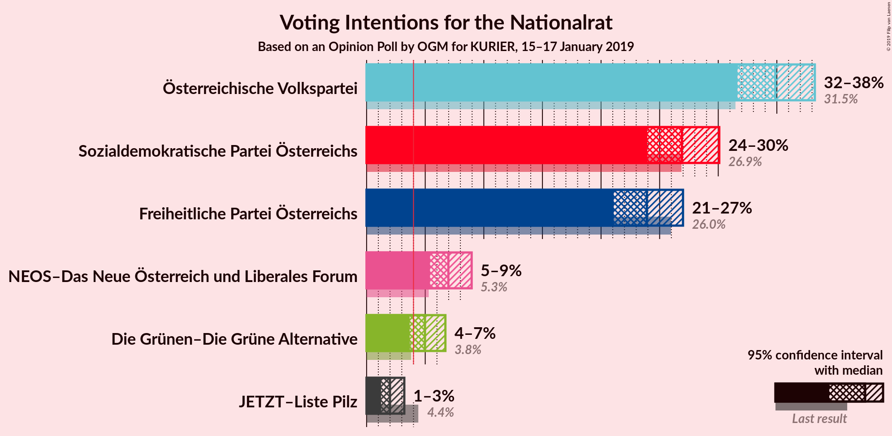

### Confidence Intervals

| Party | Last Result | Poll Result | 80% Confidence Interval | 90% Confidence Interval | 95% Confidence Interval | 99% Confidence Interval |
|:-----:|:-----------:|:-----------:|:-----------------------:|:-----------------------:|:-----------------------:|:-----------------------:|
| Österreichische Volkspartei | 31.5% | 34.9% | 32.8–37.1% |32.2–37.7% |31.6–38.2% |30.7–39.3% |
| Sozialdemokratische Partei Österreichs | 26.9% | 26.9% | 25.0–29.0% |24.4–29.6% |23.9–30.1% |23.0–31.1% |
| Freiheitliche Partei Österreichs | 26.0% | 23.9% | 22.1–25.9% |21.5–26.5% |21.1–27.0% |20.2–28.0% |
| NEOS–Das Neue Österreich und Liberales Forum | 5.3% | 7.0% | 5.9–8.3% |5.7–8.6% |5.4–9.0% |5.0–9.6% |
| Die Grünen–Die Grüne Alternative | 3.8% | 5.0% | 4.1–6.1% |3.9–6.4% |3.7–6.7% |3.3–7.3% |
| JETZT–Liste Pilz | 4.4% | 2.0% | 1.5–2.8% |1.3–3.0% |1.2–3.2% |1.0–3.6% |

*Note:* The poll result column reflects the actual value used in the calculations. Published results may vary slightly, and in addition be rounded to fewer digits.

## Seats

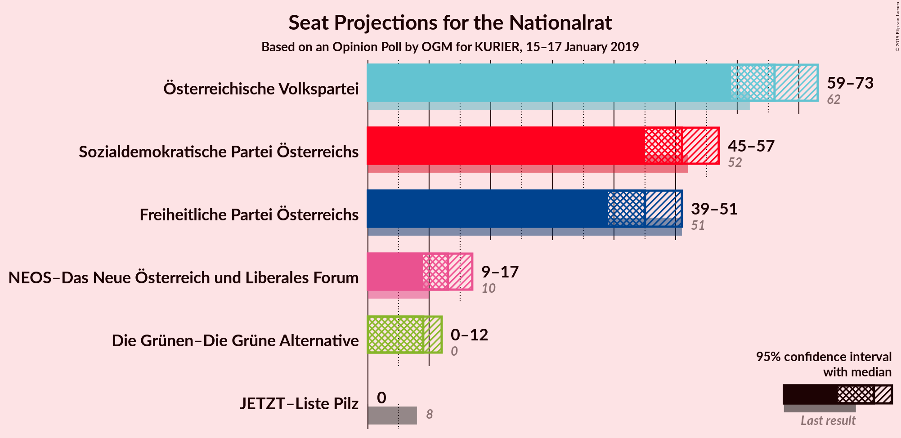

### Confidence Intervals

| Party | Last Result | Median | 80% Confidence Interval | 90% Confidence Interval | 95% Confidence Interval | 99% Confidence Interval |
|:-----:|:-----------:|:------:|:-----------------------:|:-----------------------:|:-----------------------:|:-----------------------:|
| <a href="#österreichische-volkspartei">Österreichische Volkspartei</a> | 62 | 66 | 61–71 |60–72 |59–73 |57–75 |
| <a href="#sozialdemokratische-partei-österreichs">Sozialdemokratische Partei Österreichs</a> | 52 | 51 | 47–54 |46–56 |45–57 |43–59 |
| <a href="#freiheitliche-partei-österreichs">Freiheitliche Partei Österreichs</a> | 51 | 45 | 41–49 |40–50 |39–51 |38–53 |
| <a href="#neos–das-neue-österreich-und-liberales-forum">NEOS–Das Neue Österreich und Liberales Forum</a> | 10 | 13 | 10–16 |10–17 |9–17 |9–18 |
| <a href="#die-grünen–die-grüne-alternative">Die Grünen–Die Grüne Alternative</a> | 0 | 9 | 7–11 |0–12 |0–12 |0–13 |
| <a href="#jetzt–liste-pilz">JETZT–Liste Pilz</a> | 8 | 0 | 0 |0 |0 |0 |

### Österreichische Volkspartei

*For a full overview of the results for this party, see the [Österreichische Volkspartei](party-österreichischevolkspartei.html) page.*

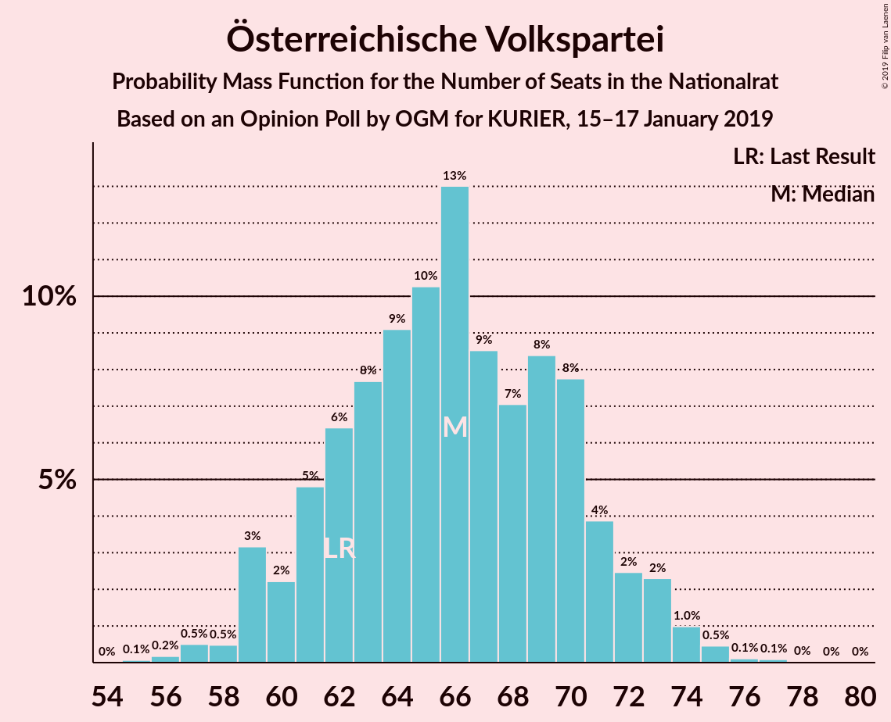

| Number of Seats | Probability | Accumulated | Special Marks |
|:---------------:|:-----------:|:-----------:|:-------------:|
| 55 | 0.1% | 100% |  |
| 56 | 0.2% | 99.9% |  |
| 57 | 0.5% | 99.7% |  |
| 58 | 0.5% | 99.2% |  |
| 59 | 3% | 98.7% |  |
| 60 | 2% | 96% |  |
| 61 | 5% | 93% |  |
| 62 | 6% | 89% | Last Result |
| 63 | 8% | 82% |  |
| 64 | 9% | 74% |  |
| 65 | 10% | 65% |  |
| 66 | 13% | 55% | Median |
| 67 | 9% | 42% |  |
| 68 | 7% | 34% |  |
| 69 | 8% | 26% |  |
| 70 | 8% | 18% |  |
| 71 | 4% | 10% |  |
| 72 | 2% | 6% |  |
| 73 | 2% | 4% |  |
| 74 | 1.0% | 2% |  |
| 75 | 0.5% | 0.7% |  |
| 76 | 0.1% | 0.3% |  |
| 77 | 0.1% | 0.1% |  |
| 78 | 0% | 0.1% |  |
| 79 | 0% | 0% |  |

### Sozialdemokratische Partei Österreichs

*For a full overview of the results for this party, see the [Sozialdemokratische Partei Österreichs](party-sozialdemokratischeparteiösterreichs.html) page.*

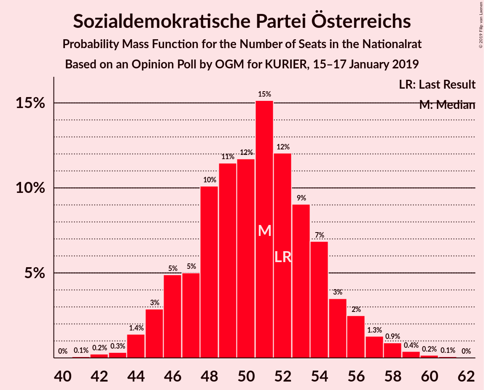

| Number of Seats | Probability | Accumulated | Special Marks |
|:---------------:|:-----------:|:-----------:|:-------------:|
| 41 | 0.1% | 100% |  |
| 42 | 0.2% | 99.9% |  |
| 43 | 0.3% | 99.7% |  |
| 44 | 1.4% | 99.3% |  |
| 45 | 3% | 98% |  |
| 46 | 5% | 95% |  |
| 47 | 5% | 90% |  |
| 48 | 10% | 85% |  |
| 49 | 11% | 75% |  |
| 50 | 12% | 64% |  |
| 51 | 15% | 52% | Median |
| 52 | 12% | 37% | Last Result |
| 53 | 9% | 25% |  |
| 54 | 7% | 16% |  |
| 55 | 3% | 9% |  |
| 56 | 2% | 5% |  |
| 57 | 1.3% | 3% |  |
| 58 | 0.9% | 2% |  |
| 59 | 0.4% | 0.7% |  |
| 60 | 0.2% | 0.3% |  |
| 61 | 0.1% | 0.1% |  |
| 62 | 0% | 0% |  |

### Freiheitliche Partei Österreichs

*For a full overview of the results for this party, see the [Freiheitliche Partei Österreichs](party-freiheitlicheparteiösterreichs.html) page.*

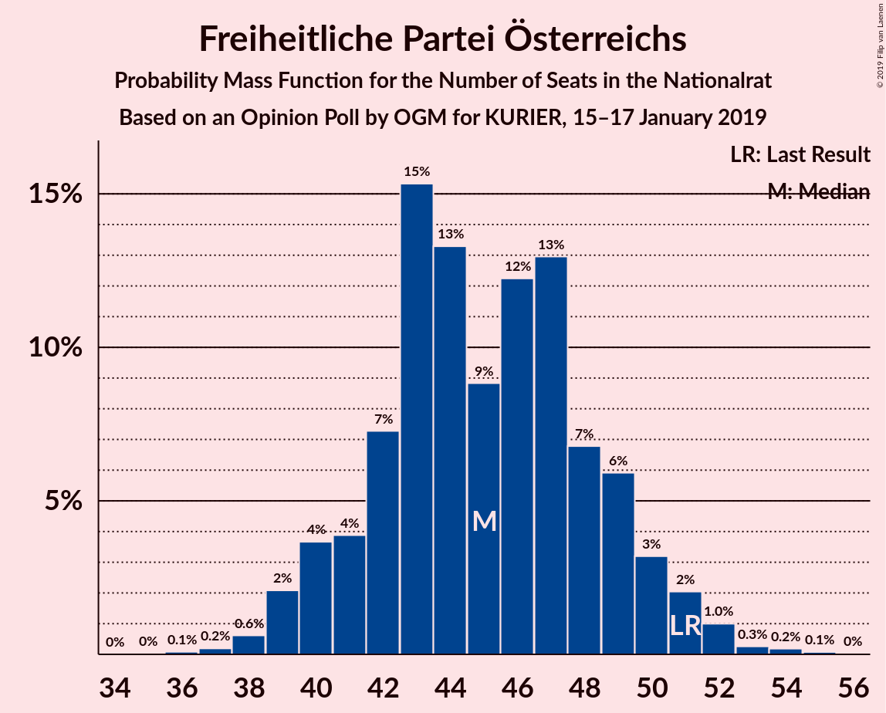

| Number of Seats | Probability | Accumulated | Special Marks |
|:---------------:|:-----------:|:-----------:|:-------------:|
| 36 | 0.1% | 100% |  |
| 37 | 0.2% | 99.9% |  |
| 38 | 0.6% | 99.7% |  |
| 39 | 2% | 99.1% |  |
| 40 | 4% | 97% |  |
| 41 | 4% | 93% |  |
| 42 | 7% | 89% |  |
| 43 | 15% | 82% |  |
| 44 | 13% | 67% |  |
| 45 | 9% | 54% | Median |
| 46 | 12% | 45% |  |
| 47 | 13% | 32% |  |
| 48 | 7% | 19% |  |
| 49 | 6% | 13% |  |
| 50 | 3% | 7% |  |
| 51 | 2% | 4% | Last Result |
| 52 | 1.0% | 2% |  |
| 53 | 0.3% | 0.6% |  |
| 54 | 0.2% | 0.3% |  |
| 55 | 0.1% | 0.1% |  |
| 56 | 0% | 0% |  |

### NEOS–Das Neue Österreich und Liberales Forum

*For a full overview of the results for this party, see the [NEOS–Das Neue Österreich und Liberales Forum](party-neos–dasneueösterreichundliberalesforum.html) page.*

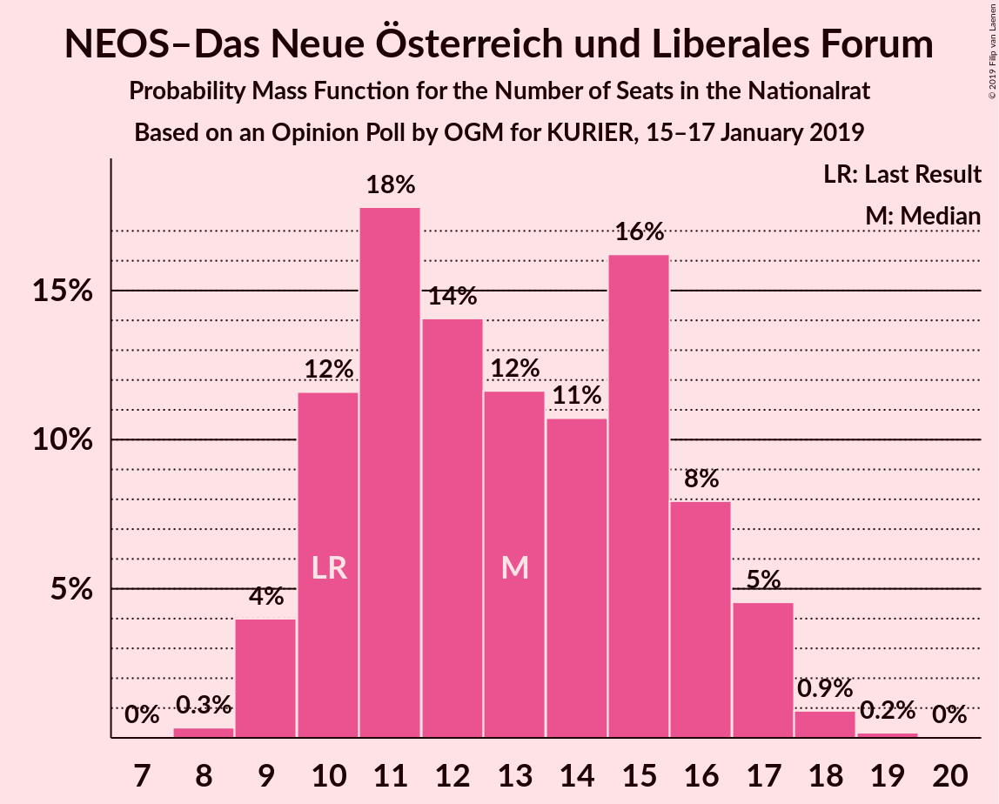

| Number of Seats | Probability | Accumulated | Special Marks |
|:---------------:|:-----------:|:-----------:|:-------------:|
| 8 | 0.3% | 100% |  |
| 9 | 4% | 99.6% |  |
| 10 | 12% | 96% | Last Result |
| 11 | 18% | 84% |  |
| 12 | 14% | 66% |  |
| 13 | 12% | 52% | Median |
| 14 | 11% | 41% |  |
| 15 | 16% | 30% |  |
| 16 | 8% | 14% |  |
| 17 | 5% | 6% |  |
| 18 | 0.9% | 1.1% |  |
| 19 | 0.2% | 0.2% |  |
| 20 | 0% | 0% |  |

### Die Grünen–Die Grüne Alternative

*For a full overview of the results for this party, see the [Die Grünen–Die Grüne Alternative](party-diegrünen–diegrünealternative.html) page.*

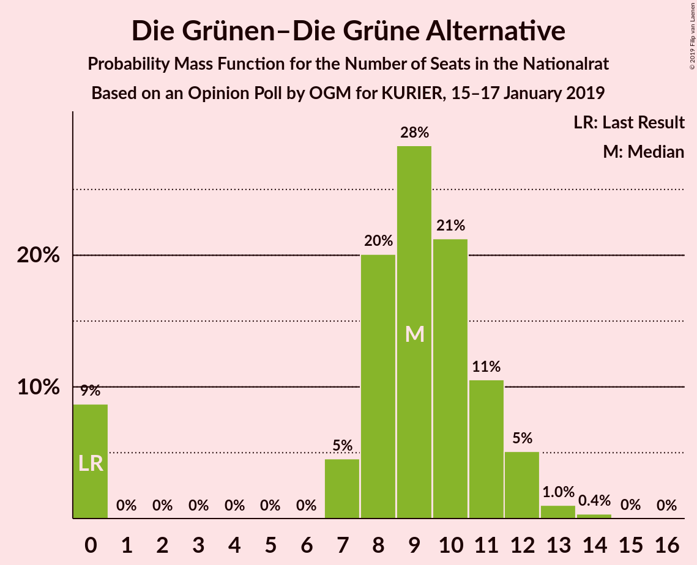

| Number of Seats | Probability | Accumulated | Special Marks |
|:---------------:|:-----------:|:-----------:|:-------------:|
| 0 | 9% | 100% | Last Result |
| 1 | 0% | 91% |  |
| 2 | 0% | 91% |  |
| 3 | 0% | 91% |  |
| 4 | 0% | 91% |  |
| 5 | 0% | 91% |  |
| 6 | 0% | 91% |  |
| 7 | 5% | 91% |  |
| 8 | 20% | 87% |  |
| 9 | 28% | 67% | Median |
| 10 | 21% | 38% |  |
| 11 | 11% | 17% |  |
| 12 | 5% | 7% |  |
| 13 | 1.0% | 1.4% |  |
| 14 | 0.4% | 0.4% |  |
| 15 | 0% | 0.1% |  |
| 16 | 0% | 0% |  |

### JETZT–Liste Pilz

*For a full overview of the results for this party, see the [JETZT–Liste Pilz](party-jetzt–listepilz.html) page.*

| Number of Seats | Probability | Accumulated | Special Marks |
|:---------------:|:-----------:|:-----------:|:-------------:|
| 0 | 99.8% | 100% | Median |
| 1 | 0% | 0.2% |  |
| 2 | 0% | 0.2% |  |
| 3 | 0% | 0.2% |  |
| 4 | 0% | 0.2% |  |
| 5 | 0% | 0.2% |  |
| 6 | 0% | 0.2% |  |
| 7 | 0.1% | 0.2% |  |
| 8 | 0% | 0.1% | Last Result |
| 9 | 0% | 0% |  |

## Coalitions

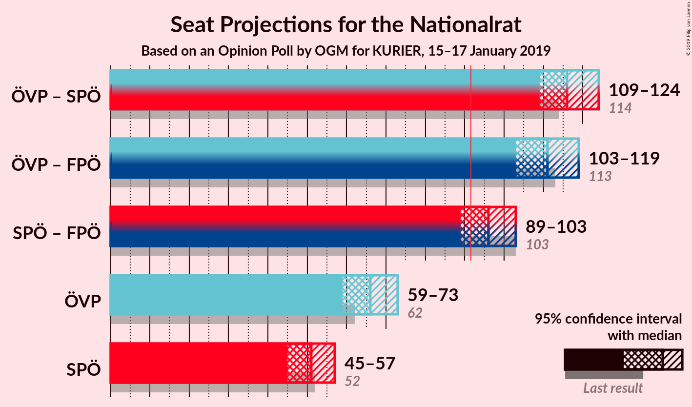

### Confidence Intervals

| Coalition | Last Result | Median | Majority? | 80% Confidence Interval | 90% Confidence Interval | 95% Confidence Interval | 99% Confidence Interval |
|:---------:|:-----------:|:------:|:---------:|:-----------------------:|:-----------------------:|:-----------------------:|:-----------------------:|
| Österreichische Volkspartei – Sozialdemokratische Partei Österreichs | 114 | 116 | 100% | 112–121 | 110–123 | 109–124 | 107–127 |
| Österreichische Volkspartei – Freiheitliche Partei Österreichs | 113 | 111 | 100% | 106–116 | 105–118 | 103–119 | 102–122 |
| Sozialdemokratische Partei Österreichs – Freiheitliche Partei Österreichs | 103 | 96 | 87% | 91–100 | 90–102 | 89–103 | 87–106 |
| Österreichische Volkspartei | 62 | 66 | 0% | 61–71 | 60–72 | 59–73 | 57–75 |
| Sozialdemokratische Partei Österreichs | 52 | 51 | 0% | 47–54 | 46–56 | 45–57 | 43–59 |

### Österreichische Volkspartei – Sozialdemokratische Partei Österreichs

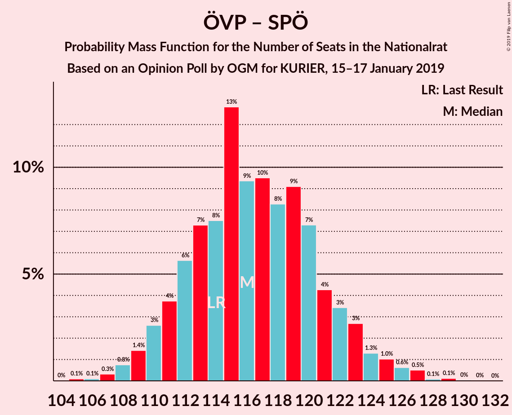

| Number of Seats | Probability | Accumulated | Special Marks |
|:---------------:|:-----------:|:-----------:|:-------------:|
| 105 | 0.1% | 100% |  |
| 106 | 0.1% | 99.9% |  |
| 107 | 0.3% | 99.8% |  |
| 108 | 0.8% | 99.5% |  |
| 109 | 1.4% | 98.7% |  |
| 110 | 3% | 97% |  |
| 111 | 4% | 95% |  |
| 112 | 6% | 91% |  |
| 113 | 7% | 85% |  |
| 114 | 8% | 78% | Last Result |
| 115 | 13% | 70% |  |
| 116 | 9% | 58% |  |
| 117 | 10% | 48% | Median |
| 118 | 8% | 39% |  |
| 119 | 9% | 31% |  |
| 120 | 7% | 21% |  |
| 121 | 4% | 14% |  |
| 122 | 3% | 10% |  |
| 123 | 3% | 6% |  |
| 124 | 1.3% | 4% |  |
| 125 | 1.0% | 2% |  |
| 126 | 0.6% | 1.4% |  |
| 127 | 0.5% | 0.8% |  |
| 128 | 0.1% | 0.3% |  |
| 129 | 0.1% | 0.2% |  |
| 130 | 0% | 0.1% |  |
| 131 | 0% | 0% |  |

### Österreichische Volkspartei – Freiheitliche Partei Österreichs

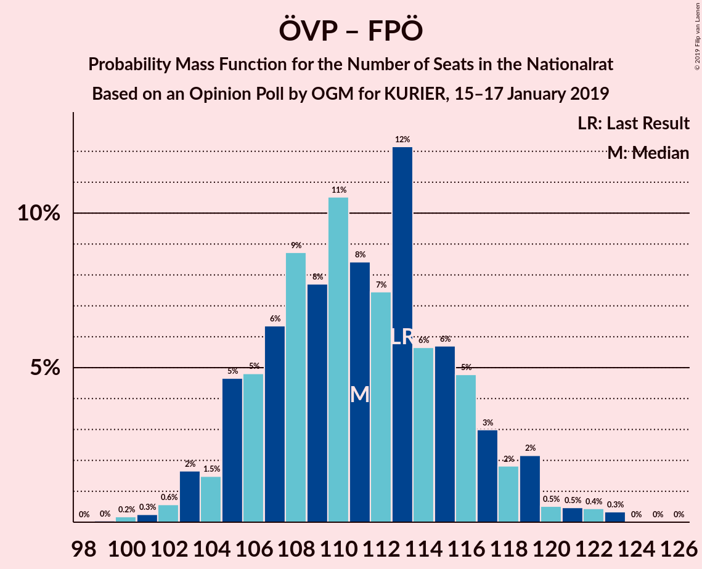

| Number of Seats | Probability | Accumulated | Special Marks |
|:---------------:|:-----------:|:-----------:|:-------------:|
| 99 | 0% | 100% |  |
| 100 | 0.2% | 99.9% |  |
| 101 | 0.3% | 99.8% |  |
| 102 | 0.6% | 99.5% |  |
| 103 | 2% | 98.9% |  |
| 104 | 1.5% | 97% |  |
| 105 | 5% | 96% |  |
| 106 | 5% | 91% |  |
| 107 | 6% | 86% |  |
| 108 | 9% | 80% |  |
| 109 | 8% | 71% |  |
| 110 | 11% | 64% |  |
| 111 | 8% | 53% | Median |
| 112 | 7% | 45% |  |
| 113 | 12% | 37% | Last Result |
| 114 | 6% | 25% |  |
| 115 | 6% | 19% |  |
| 116 | 5% | 14% |  |
| 117 | 3% | 9% |  |
| 118 | 2% | 6% |  |
| 119 | 2% | 4% |  |
| 120 | 0.5% | 2% |  |
| 121 | 0.5% | 1.3% |  |
| 122 | 0.4% | 0.9% |  |
| 123 | 0.3% | 0.4% |  |
| 124 | 0% | 0.1% |  |
| 125 | 0% | 0.1% |  |
| 126 | 0% | 0% |  |

### Sozialdemokratische Partei Österreichs – Freiheitliche Partei Österreichs

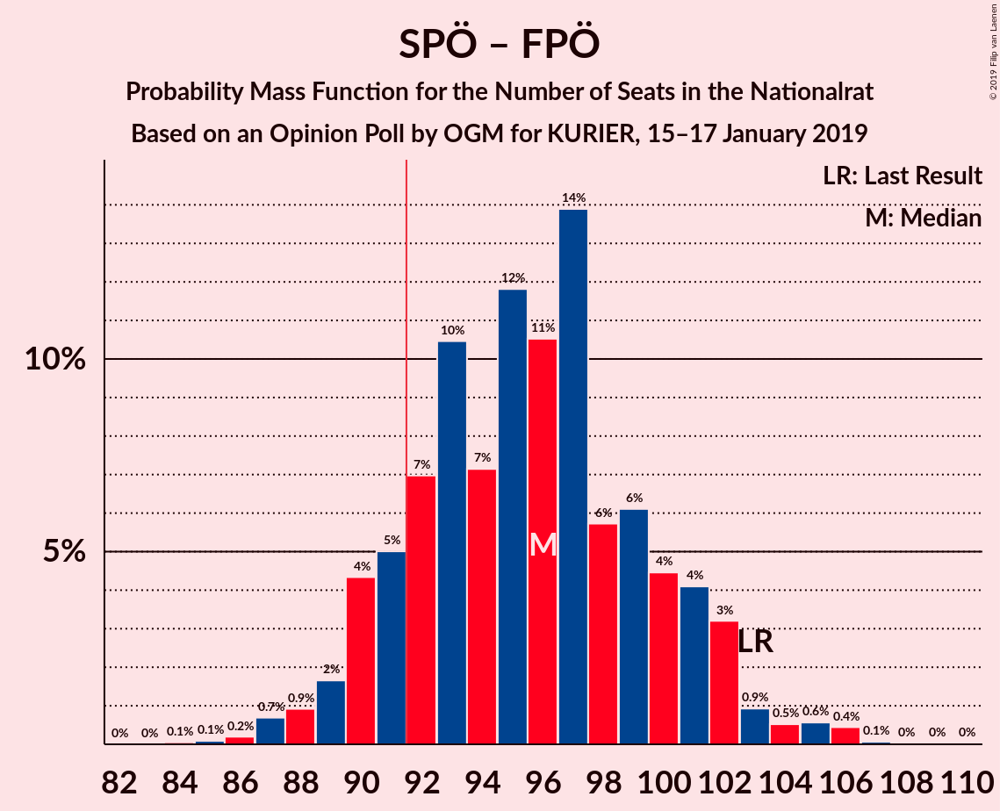

| Number of Seats | Probability | Accumulated | Special Marks |
|:---------------:|:-----------:|:-----------:|:-------------:|
| 84 | 0.1% | 100% |  |
| 85 | 0.1% | 99.9% |  |
| 86 | 0.2% | 99.8% |  |
| 87 | 0.7% | 99.6% |  |
| 88 | 0.9% | 99.0% |  |
| 89 | 2% | 98% |  |
| 90 | 4% | 96% |  |
| 91 | 5% | 92% |  |
| 92 | 7% | 87% | Majority |
| 93 | 10% | 80% |  |
| 94 | 7% | 70% |  |
| 95 | 12% | 62% |  |
| 96 | 11% | 51% | Median |
| 97 | 14% | 40% |  |
| 98 | 6% | 26% |  |
| 99 | 6% | 20% |  |
| 100 | 4% | 14% |  |
| 101 | 4% | 10% |  |
| 102 | 3% | 6% |  |
| 103 | 0.9% | 3% | Last Result |
| 104 | 0.5% | 2% |  |
| 105 | 0.6% | 1.2% |  |
| 106 | 0.4% | 0.6% |  |
| 107 | 0.1% | 0.1% |  |
| 108 | 0% | 0.1% |  |
| 109 | 0% | 0.1% |  |
| 110 | 0% | 0% |  |

### Österreichische Volkspartei

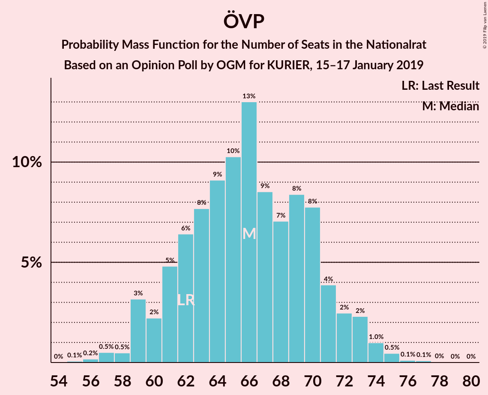

| Number of Seats | Probability | Accumulated | Special Marks |
|:---------------:|:-----------:|:-----------:|:-------------:|
| 55 | 0.1% | 100% |  |
| 56 | 0.2% | 99.9% |  |
| 57 | 0.5% | 99.7% |  |
| 58 | 0.5% | 99.2% |  |
| 59 | 3% | 98.7% |  |
| 60 | 2% | 96% |  |
| 61 | 5% | 93% |  |
| 62 | 6% | 89% | Last Result |
| 63 | 8% | 82% |  |
| 64 | 9% | 74% |  |
| 65 | 10% | 65% |  |
| 66 | 13% | 55% | Median |
| 67 | 9% | 42% |  |
| 68 | 7% | 34% |  |
| 69 | 8% | 26% |  |
| 70 | 8% | 18% |  |
| 71 | 4% | 10% |  |
| 72 | 2% | 6% |  |
| 73 | 2% | 4% |  |
| 74 | 1.0% | 2% |  |
| 75 | 0.5% | 0.7% |  |
| 76 | 0.1% | 0.3% |  |
| 77 | 0.1% | 0.1% |  |
| 78 | 0% | 0.1% |  |
| 79 | 0% | 0% |  |

### Sozialdemokratische Partei Österreichs

| Number of Seats | Probability | Accumulated | Special Marks |
|:---------------:|:-----------:|:-----------:|:-------------:|
| 41 | 0.1% | 100% |  |
| 42 | 0.2% | 99.9% |  |
| 43 | 0.3% | 99.7% |  |
| 44 | 1.4% | 99.3% |  |
| 45 | 3% | 98% |  |
| 46 | 5% | 95% |  |
| 47 | 5% | 90% |  |
| 48 | 10% | 85% |  |
| 49 | 11% | 75% |  |
| 50 | 12% | 64% |  |
| 51 | 15% | 52% | Median |
| 52 | 12% | 37% | Last Result |
| 53 | 9% | 25% |  |
| 54 | 7% | 16% |  |
| 55 | 3% | 9% |  |
| 56 | 2% | 5% |  |
| 57 | 1.3% | 3% |  |
| 58 | 0.9% | 2% |  |
| 59 | 0.4% | 0.7% |  |
| 60 | 0.2% | 0.3% |  |
| 61 | 0.1% | 0.1% |  |
| 62 | 0% | 0% |  |

## Technical Information

### Opinion Poll

+ **Polling firm:** OGM
+ **Commissioner(s):** KURIER
+ **Fieldwork period:** 15–17 January 2019

### Calculations

+ **Sample size:** 803
+ **Simulations done:** 131,072
+ **Error estimate:** 2.33%

