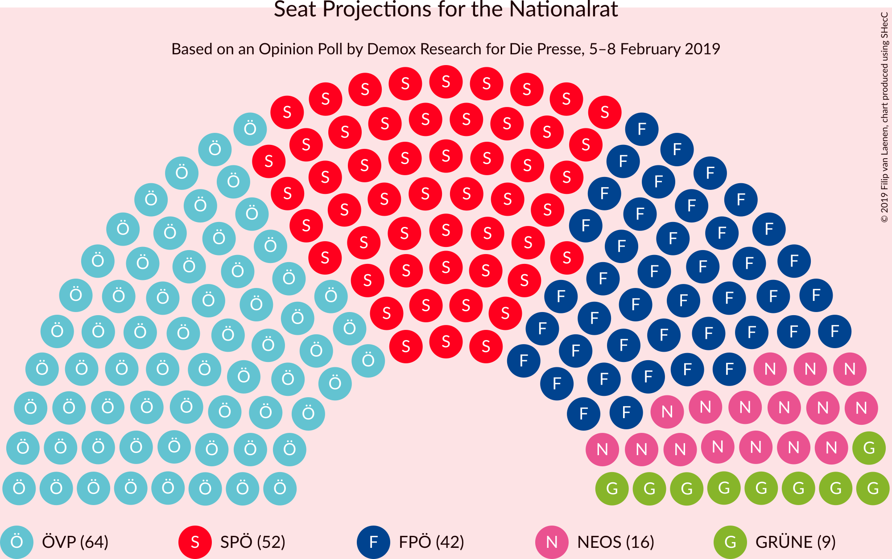
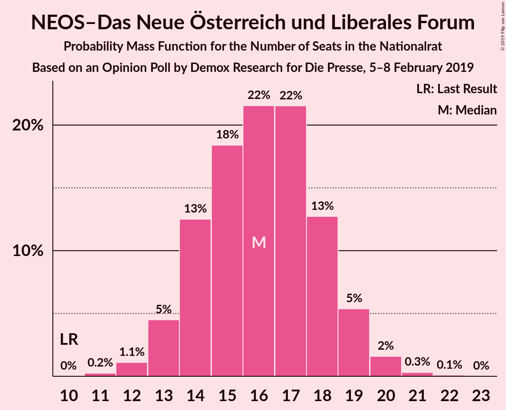
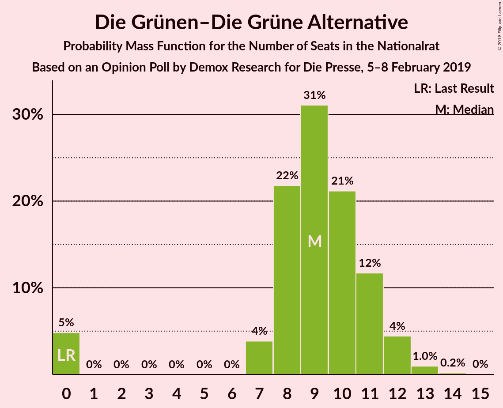
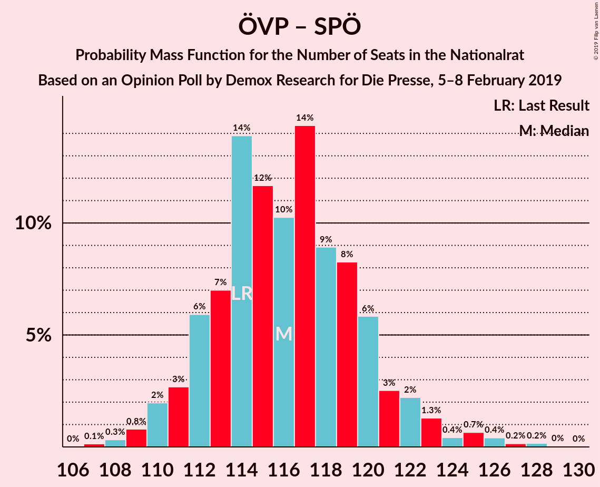
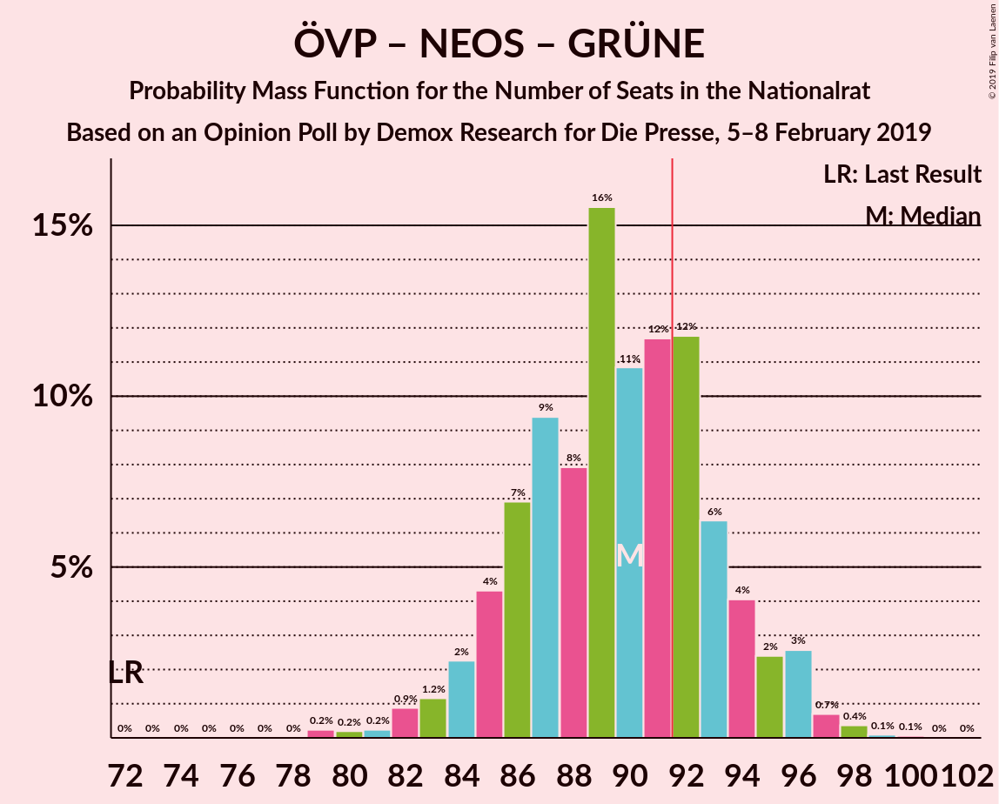
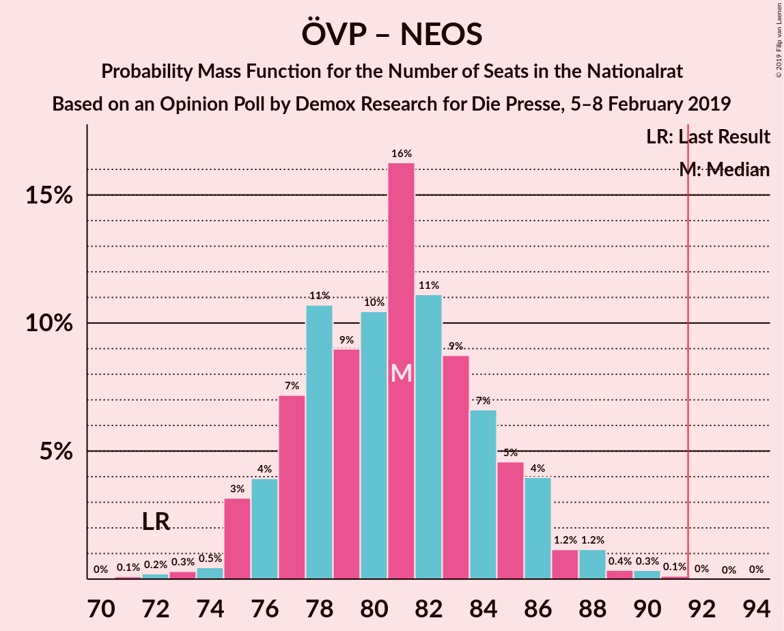
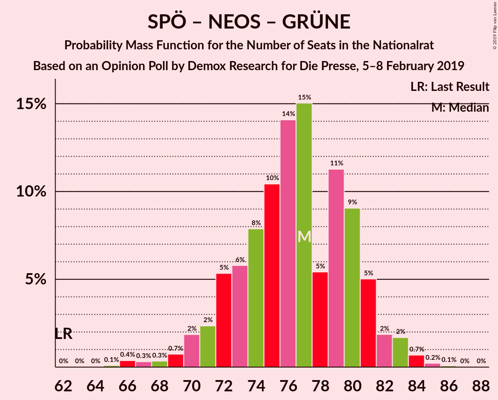
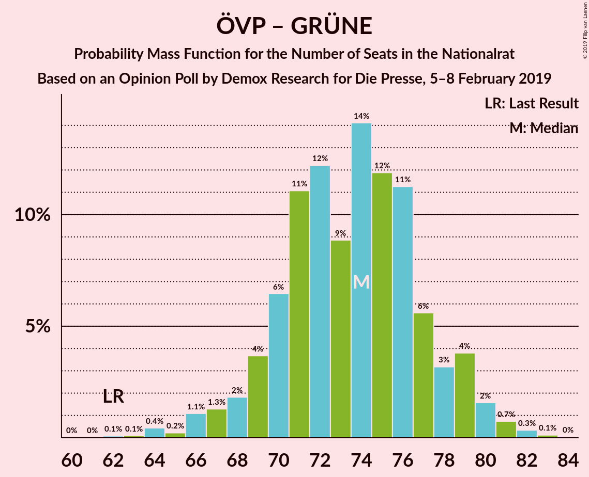

# Opinion Poll by Demox Research for Die Presse, 5–8 February 2019

<a href="#voting-intentions">Voting Intentions</a> | <a href="#seats">Seats</a> | <a href="#coalitions">Coalitions</a> | <a href="#technical-information">Technical Information</a>

## Voting Intentions

### Confidence Intervals

| Party | Last Result | Poll Result | 80% Confidence Interval | 90% Confidence Interval | 95% Confidence Interval | 99% Confidence Interval |
|:-----:|:-----------:|:-----------:|:-----------------------:|:-----------------------:|:-----------------------:|:-----------------------:|
| Österreichische Volkspartei | 31.5% | 34.0% | 32.1–36.0% |31.6–36.5% |31.1–37.0% |30.2–38.0% |
| Sozialdemokratische Partei Österreichs | 26.9% | 27.0% | 25.3–28.9% |24.8–29.4% |24.3–29.8% |23.5–30.7% |
| Freiheitliche Partei Österreichs | 26.0% | 22.0% | 20.4–23.7% |19.9–24.2% |19.5–24.7% |18.8–25.5% |
| NEOS–Das Neue Österreich und Liberales Forum | 5.3% | 8.5% | 7.5–9.7% |7.2–10.1% |6.9–10.4% |6.4–11.0% |
| Die Grünen–Die Grüne Alternative | 3.8% | 5.0% | 4.2–6.0% |4.0–6.3% |3.8–6.5% |3.5–7.1% |
| JETZT–Liste Pilz | 4.4% | 1.5% | 1.1–2.1% |1.0–2.3% |0.9–2.5% |0.7–2.8% |

*Note:* The poll result column reflects the actual value used in the calculations. Published results may vary slightly, and in addition be rounded to fewer digits.

## Seats

### Confidence Intervals

| Party | Last Result | Median | 80% Confidence Interval | 90% Confidence Interval | 95% Confidence Interval | 99% Confidence Interval |
|:-----:|:-----------:|:------:|:-----------------------:|:-----------------------:|:-----------------------:|:-----------------------:|
| <a href="#österreichische-volkspartei">Österreichische Volkspartei</a> | 62 | 64 | 61–69 |60–70 |59–71 |57–73 |
| <a href="#sozialdemokratische-partei-österreichs">Sozialdemokratische Partei Österreichs</a> | 52 | 52 | 48–55 |47–56 |46–57 |45–59 |
| <a href="#freiheitliche-partei-österreichs">Freiheitliche Partei Österreichs</a> | 51 | 42 | 39–45 |38–46 |37–47 |35–49 |
| <a href="#neos–das-neue-österreich-und-liberales-forum">NEOS–Das Neue Österreich und Liberales Forum</a> | 10 | 16 | 14–18 |13–19 |13–19 |12–20 |
| <a href="#die-grünen–die-grüne-alternative">Die Grünen–Die Grüne Alternative</a> | 0 | 9 | 8–11 |7–12 |0–12 |0–13 |
| <a href="#jetzt–liste-pilz">JETZT–Liste Pilz</a> | 8 | 0 | 0 |0 |0 |0 |

### Österreichische Volkspartei

*For a full overview of the results for this party, see the [Österreichische Volkspartei](party-österreichischevolkspartei.html) page.*

| Number of Seats | Probability | Accumulated | Special Marks |
|:---------------:|:-----------:|:-----------:|:-------------:|
| 55 | 0% | 100% |  |
| 56 | 0.1% | 99.9% |  |
| 57 | 0.4% | 99.9% |  |
| 58 | 0.7% | 99.4% |  |
| 59 | 2% | 98.8% |  |
| 60 | 4% | 97% |  |
| 61 | 8% | 93% |  |
| 62 | 9% | 85% | Last Result |
| 63 | 13% | 76% |  |
| 64 | 13% | 63% | Median |
| 65 | 9% | 49% |  |
| 66 | 15% | 40% |  |
| 67 | 9% | 25% |  |
| 68 | 5% | 16% |  |
| 69 | 5% | 11% |  |
| 70 | 3% | 6% |  |
| 71 | 2% | 3% |  |
| 72 | 0.6% | 1.4% |  |
| 73 | 0.5% | 0.8% |  |
| 74 | 0.2% | 0.3% |  |
| 75 | 0% | 0.1% |  |
| 76 | 0% | 0% |  |

### Sozialdemokratische Partei Österreichs

*For a full overview of the results for this party, see the [Sozialdemokratische Partei Österreichs](party-sozialdemokratischeparteiösterreichs.html) page.*

| Number of Seats | Probability | Accumulated | Special Marks |
|:---------------:|:-----------:|:-----------:|:-------------:|
| 43 | 0.1% | 100% |  |
| 44 | 0.3% | 99.9% |  |
| 45 | 0.6% | 99.6% |  |
| 46 | 3% | 99.0% |  |
| 47 | 4% | 96% |  |
| 48 | 4% | 92% |  |
| 49 | 16% | 88% |  |
| 50 | 9% | 73% |  |
| 51 | 11% | 63% |  |
| 52 | 17% | 53% | Last Result, Median |
| 53 | 15% | 36% |  |
| 54 | 6% | 21% |  |
| 55 | 8% | 15% |  |
| 56 | 4% | 7% |  |
| 57 | 2% | 3% |  |
| 58 | 0.7% | 1.5% |  |
| 59 | 0.5% | 0.8% |  |
| 60 | 0.2% | 0.3% |  |
| 61 | 0.1% | 0.1% |  |
| 62 | 0% | 0% |  |

### Freiheitliche Partei Österreichs

*For a full overview of the results for this party, see the [Freiheitliche Partei Österreichs](party-freiheitlicheparteiösterreichs.html) page.*

| Number of Seats | Probability | Accumulated | Special Marks |
|:---------------:|:-----------:|:-----------:|:-------------:|
| 34 | 0.1% | 100% |  |
| 35 | 0.5% | 99.9% |  |
| 36 | 1.0% | 99.4% |  |
| 37 | 2% | 98% |  |
| 38 | 5% | 96% |  |
| 39 | 8% | 91% |  |
| 40 | 13% | 83% |  |
| 41 | 16% | 70% |  |
| 42 | 16% | 54% | Median |
| 43 | 11% | 38% |  |
| 44 | 11% | 27% |  |
| 45 | 8% | 16% |  |
| 46 | 5% | 8% |  |
| 47 | 2% | 4% |  |
| 48 | 1.0% | 2% |  |
| 49 | 0.3% | 0.6% |  |
| 50 | 0.2% | 0.3% |  |
| 51 | 0.1% | 0.1% | Last Result |
| 52 | 0% | 0% |  |

### NEOS–Das Neue Österreich und Liberales Forum

*For a full overview of the results for this party, see the [NEOS–Das Neue Österreich und Liberales Forum](party-neos–dasneueösterreichundliberalesforum.html) page.*

| Number of Seats | Probability | Accumulated | Special Marks |
|:---------------:|:-----------:|:-----------:|:-------------:|
| 10 | 0% | 100% | Last Result |
| 11 | 0.2% | 100% |  |
| 12 | 1.1% | 99.7% |  |
| 13 | 5% | 98.6% |  |
| 14 | 13% | 94% |  |
| 15 | 18% | 82% |  |
| 16 | 22% | 63% | Median |
| 17 | 22% | 42% |  |
| 18 | 13% | 20% |  |
| 19 | 5% | 7% |  |
| 20 | 2% | 2% |  |
| 21 | 0.3% | 0.4% |  |
| 22 | 0.1% | 0.1% |  |
| 23 | 0% | 0% |  |

### Die Grünen–Die Grüne Alternative

*For a full overview of the results for this party, see the [Die Grünen–Die Grüne Alternative](party-diegrünen–diegrünealternative.html) page.*

| Number of Seats | Probability | Accumulated | Special Marks |
|:---------------:|:-----------:|:-----------:|:-------------:|
| 0 | 5% | 100% | Last Result |
| 1 | 0% | 95% |  |
| 2 | 0% | 95% |  |
| 3 | 0% | 95% |  |
| 4 | 0% | 95% |  |
| 5 | 0% | 95% |  |
| 6 | 0% | 95% |  |
| 7 | 4% | 95% |  |
| 8 | 22% | 91% |  |
| 9 | 31% | 70% | Median |
| 10 | 21% | 38% |  |
| 11 | 12% | 17% |  |
| 12 | 4% | 6% |  |
| 13 | 1.0% | 1.2% |  |
| 14 | 0.2% | 0.2% |  |
| 15 | 0% | 0% |  |

### JETZT–Liste Pilz

*For a full overview of the results for this party, see the [JETZT–Liste Pilz](party-jetzt–listepilz.html) page.*

| Number of Seats | Probability | Accumulated | Special Marks |
|:---------------:|:-----------:|:-----------:|:-------------:|
| 0 | 100% | 100% | Median |
| 1 | 0% | 0% |  |
| 2 | 0% | 0% |  |
| 3 | 0% | 0% |  |
| 4 | 0% | 0% |  |
| 5 | 0% | 0% |  |
| 6 | 0% | 0% |  |
| 7 | 0% | 0% |  |
| 8 | 0% | 0% | Last Result |

## Coalitions

### Confidence Intervals

| Coalition | Last Result | Median | Majority? | 80% Confidence Interval | 90% Confidence Interval | 95% Confidence Interval | 99% Confidence Interval |
|:---------:|:-----------:|:------:|:---------:|:-----------------------:|:-----------------------:|:-----------------------:|:-----------------------:|
| Österreichische Volkspartei – Sozialdemokratische Partei Österreichs | 114 | 116 | 100% | 112–120 | 111–122 | 110–123 | 108–126 |
| Österreichische Volkspartei – Freiheitliche Partei Österreichs | 113 | 106 | 100% | 103–111 | 102–112 | 100–113 | 99–117 |
| Sozialdemokratische Partei Österreichs – Freiheitliche Partei Österreichs | 103 | 93 | 72% | 89–97 | 88–99 | 87–100 | 85–102 |
| Österreichische Volkspartei – NEOS–Das Neue Österreich und Liberales Forum – Die Grünen–Die Grüne Alternative | 72 | 90 | 28% | 86–94 | 84–95 | 83–96 | 81–98 |
| Österreichische Volkspartei – NEOS–Das Neue Österreich und Liberales Forum | 72 | 81 | 0.1% | 77–85 | 76–86 | 75–87 | 73–90 |
| Sozialdemokratische Partei Österreichs – NEOS–Das Neue Österreich und Liberales Forum – Die Grünen–Die Grüne Alternative | 62 | 77 | 0% | 72–80 | 71–81 | 70–83 | 66–84 |
| Österreichische Volkspartei – Die Grünen–Die Grüne Alternative | 62 | 74 | 0% | 70–77 | 68–79 | 67–80 | 64–82 |
| Österreichische Volkspartei | 62 | 64 | 0% | 61–69 | 60–70 | 59–71 | 57–73 |
| Sozialdemokratische Partei Österreichs | 52 | 52 | 0% | 48–55 | 47–56 | 46–57 | 45–59 |

### Österreichische Volkspartei – Sozialdemokratische Partei Österreichs

| Number of Seats | Probability | Accumulated | Special Marks |
|:---------------:|:-----------:|:-----------:|:-------------:|
| 107 | 0.1% | 100% |  |
| 108 | 0.3% | 99.8% |  |
| 109 | 0.8% | 99.5% |  |
| 110 | 2% | 98.7% |  |
| 111 | 3% | 97% |  |
| 112 | 6% | 94% |  |
| 113 | 7% | 88% |  |
| 114 | 14% | 81% | Last Result |
| 115 | 12% | 67% |  |
| 116 | 10% | 56% | Median |
| 117 | 14% | 45% |  |
| 118 | 9% | 31% |  |
| 119 | 8% | 22% |  |
| 120 | 6% | 14% |  |
| 121 | 3% | 8% |  |
| 122 | 2% | 5% |  |
| 123 | 1.3% | 3% |  |
| 124 | 0.4% | 2% |  |
| 125 | 0.7% | 1.4% |  |
| 126 | 0.4% | 0.8% |  |
| 127 | 0.2% | 0.4% |  |
| 128 | 0.2% | 0.2% |  |
| 129 | 0% | 0.1% |  |
| 130 | 0% | 0% |  |

### Österreichische Volkspartei – Freiheitliche Partei Österreichs

| Number of Seats | Probability | Accumulated | Special Marks |
|:---------------:|:-----------:|:-----------:|:-------------:|
| 97 | 0.1% | 100% |  |
| 98 | 0.2% | 99.9% |  |
| 99 | 0.7% | 99.7% |  |
| 100 | 2% | 99.0% |  |
| 101 | 2% | 97% |  |
| 102 | 5% | 95% |  |
| 103 | 9% | 90% |  |
| 104 | 11% | 81% |  |
| 105 | 5% | 70% |  |
| 106 | 15% | 65% | Median |
| 107 | 14% | 50% |  |
| 108 | 10% | 36% |  |
| 109 | 8% | 25% |  |
| 110 | 6% | 17% |  |
| 111 | 5% | 11% |  |
| 112 | 2% | 6% |  |
| 113 | 2% | 4% | Last Result |
| 114 | 0.7% | 2% |  |
| 115 | 0.3% | 1.2% |  |
| 116 | 0.3% | 0.8% |  |
| 117 | 0.4% | 0.5% |  |
| 118 | 0.1% | 0.1% |  |
| 119 | 0% | 0% |  |

### Sozialdemokratische Partei Österreichs – Freiheitliche Partei Österreichs

| Number of Seats | Probability | Accumulated | Special Marks |
|:---------------:|:-----------:|:-----------:|:-------------:|
| 83 | 0.1% | 100% |  |
| 84 | 0.1% | 99.9% |  |
| 85 | 0.4% | 99.8% |  |
| 86 | 0.7% | 99.5% |  |
| 87 | 3% | 98.8% |  |
| 88 | 2% | 96% |  |
| 89 | 4% | 94% |  |
| 90 | 6% | 90% |  |
| 91 | 12% | 83% |  |
| 92 | 12% | 72% | Majority |
| 93 | 11% | 60% |  |
| 94 | 16% | 49% | Median |
| 95 | 8% | 34% |  |
| 96 | 9% | 26% |  |
| 97 | 7% | 16% |  |
| 98 | 4% | 9% |  |
| 99 | 2% | 5% |  |
| 100 | 1.2% | 3% |  |
| 101 | 0.9% | 2% |  |
| 102 | 0.2% | 0.7% |  |
| 103 | 0.2% | 0.5% | Last Result |
| 104 | 0.2% | 0.3% |  |
| 105 | 0% | 0% |  |

### Österreichische Volkspartei – NEOS–Das Neue Österreich und Liberales Forum – Die Grünen–Die Grüne Alternative

| Number of Seats | Probability | Accumulated | Special Marks |
|:---------------:|:-----------:|:-----------:|:-------------:|
| 72 | 0% | 100% | Last Result |
| 73 | 0% | 100% |  |
| 74 | 0% | 100% |  |
| 75 | 0% | 100% |  |
| 76 | 0% | 100% |  |
| 77 | 0% | 100% |  |
| 78 | 0% | 100% |  |
| 79 | 0.2% | 100% |  |
| 80 | 0.2% | 99.7% |  |
| 81 | 0.2% | 99.5% |  |
| 82 | 0.9% | 99.3% |  |
| 83 | 1.2% | 98% |  |
| 84 | 2% | 97% |  |
| 85 | 4% | 95% |  |
| 86 | 7% | 91% |  |
| 87 | 9% | 84% |  |
| 88 | 8% | 74% |  |
| 89 | 16% | 66% | Median |
| 90 | 11% | 51% |  |
| 91 | 12% | 40% |  |
| 92 | 12% | 28% | Majority |
| 93 | 6% | 17% |  |
| 94 | 4% | 10% |  |
| 95 | 2% | 6% |  |
| 96 | 3% | 4% |  |
| 97 | 0.7% | 1.2% |  |
| 98 | 0.4% | 0.5% |  |
| 99 | 0.1% | 0.2% |  |
| 100 | 0.1% | 0.1% |  |
| 101 | 0% | 0% |  |

### Österreichische Volkspartei – NEOS–Das Neue Österreich und Liberales Forum

| Number of Seats | Probability | Accumulated | Special Marks |
|:---------------:|:-----------:|:-----------:|:-------------:|
| 71 | 0.1% | 100% |  |
| 72 | 0.2% | 99.9% | Last Result |
| 73 | 0.3% | 99.7% |  |
| 74 | 0.5% | 99.4% |  |
| 75 | 3% | 98.9% |  |
| 76 | 4% | 96% |  |
| 77 | 7% | 92% |  |
| 78 | 11% | 85% |  |
| 79 | 9% | 74% |  |
| 80 | 10% | 65% | Median |
| 81 | 16% | 54% |  |
| 82 | 11% | 38% |  |
| 83 | 9% | 27% |  |
| 84 | 7% | 18% |  |
| 85 | 5% | 12% |  |
| 86 | 4% | 7% |  |
| 87 | 1.2% | 3% |  |
| 88 | 1.2% | 2% |  |
| 89 | 0.4% | 0.9% |  |
| 90 | 0.3% | 0.5% |  |
| 91 | 0.1% | 0.2% |  |
| 92 | 0% | 0.1% | Majority |
| 93 | 0% | 0% |  |

### Sozialdemokratische Partei Österreichs – NEOS–Das Neue Österreich und Liberales Forum – Die Grünen–Die Grüne Alternative

| Number of Seats | Probability | Accumulated | Special Marks |
|:---------------:|:-----------:|:-----------:|:-------------:|
| 62 | 0% | 100% | Last Result |
| 63 | 0% | 100% |  |
| 64 | 0% | 100% |  |
| 65 | 0.1% | 100% |  |
| 66 | 0.4% | 99.9% |  |
| 67 | 0.3% | 99.5% |  |
| 68 | 0.3% | 99.2% |  |
| 69 | 0.7% | 98.8% |  |
| 70 | 2% | 98% |  |
| 71 | 2% | 96% |  |
| 72 | 5% | 94% |  |
| 73 | 6% | 89% |  |
| 74 | 8% | 83% |  |
| 75 | 10% | 75% |  |
| 76 | 14% | 64% |  |
| 77 | 15% | 50% | Median |
| 78 | 5% | 35% |  |
| 79 | 11% | 30% |  |
| 80 | 9% | 19% |  |
| 81 | 5% | 10% |  |
| 82 | 2% | 5% |  |
| 83 | 2% | 3% |  |
| 84 | 0.7% | 1.0% |  |
| 85 | 0.2% | 0.3% |  |
| 86 | 0.1% | 0.1% |  |
| 87 | 0% | 0% |  |

### Österreichische Volkspartei – Die Grünen–Die Grüne Alternative

| Number of Seats | Probability | Accumulated | Special Marks |
|:---------------:|:-----------:|:-----------:|:-------------:|
| 62 | 0.1% | 100% | Last Result |
| 63 | 0.1% | 99.9% |  |
| 64 | 0.4% | 99.8% |  |
| 65 | 0.2% | 99.4% |  |
| 66 | 1.1% | 99.1% |  |
| 67 | 1.3% | 98% |  |
| 68 | 2% | 97% |  |
| 69 | 4% | 95% |  |
| 70 | 6% | 91% |  |
| 71 | 11% | 85% |  |
| 72 | 12% | 74% |  |
| 73 | 9% | 62% | Median |
| 74 | 14% | 53% |  |
| 75 | 12% | 39% |  |
| 76 | 11% | 27% |  |
| 77 | 6% | 15% |  |
| 78 | 3% | 10% |  |
| 79 | 4% | 7% |  |
| 80 | 2% | 3% |  |
| 81 | 0.7% | 1.3% |  |
| 82 | 0.3% | 0.5% |  |
| 83 | 0.1% | 0.2% |  |
| 84 | 0% | 0% |  |

### Österreichische Volkspartei

| Number of Seats | Probability | Accumulated | Special Marks |
|:---------------:|:-----------:|:-----------:|:-------------:|
| 55 | 0% | 100% |  |
| 56 | 0.1% | 99.9% |  |
| 57 | 0.4% | 99.9% |  |
| 58 | 0.7% | 99.4% |  |
| 59 | 2% | 98.8% |  |
| 60 | 4% | 97% |  |
| 61 | 8% | 93% |  |
| 62 | 9% | 85% | Last Result |
| 63 | 13% | 76% |  |
| 64 | 13% | 63% | Median |
| 65 | 9% | 49% |  |
| 66 | 15% | 40% |  |
| 67 | 9% | 25% |  |
| 68 | 5% | 16% |  |
| 69 | 5% | 11% |  |
| 70 | 3% | 6% |  |
| 71 | 2% | 3% |  |
| 72 | 0.6% | 1.4% |  |
| 73 | 0.5% | 0.8% |  |
| 74 | 0.2% | 0.3% |  |
| 75 | 0% | 0.1% |  |
| 76 | 0% | 0% |  |

### Sozialdemokratische Partei Österreichs

| Number of Seats | Probability | Accumulated | Special Marks |
|:---------------:|:-----------:|:-----------:|:-------------:|
| 43 | 0.1% | 100% |  |
| 44 | 0.3% | 99.9% |  |
| 45 | 0.6% | 99.6% |  |
| 46 | 3% | 99.0% |  |
| 47 | 4% | 96% |  |
| 48 | 4% | 92% |  |
| 49 | 16% | 88% |  |
| 50 | 9% | 73% |  |
| 51 | 11% | 63% |  |
| 52 | 17% | 53% | Last Result, Median |
| 53 | 15% | 36% |  |
| 54 | 6% | 21% |  |
| 55 | 8% | 15% |  |
| 56 | 4% | 7% |  |
| 57 | 2% | 3% |  |
| 58 | 0.7% | 1.5% |  |
| 59 | 0.5% | 0.8% |  |
| 60 | 0.2% | 0.3% |  |
| 61 | 0.1% | 0.1% |  |
| 62 | 0% | 0% |  |

## Technical Information

### Opinion Poll

+ **Polling firm:** Demox Research
+ **Commissioner(s):** Die Presse
+ **Fieldwork period:** 5–8 February 2019

### Calculations

+ **Sample size:** 1000
+ **Simulations done:** 131,072
+ **Error estimate:** 1.25%

