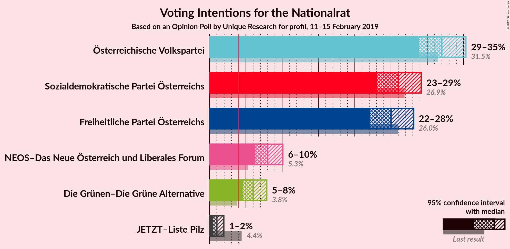
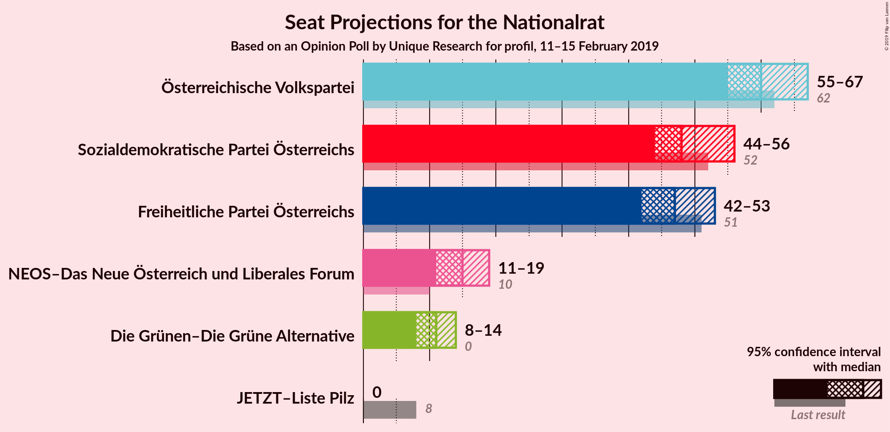
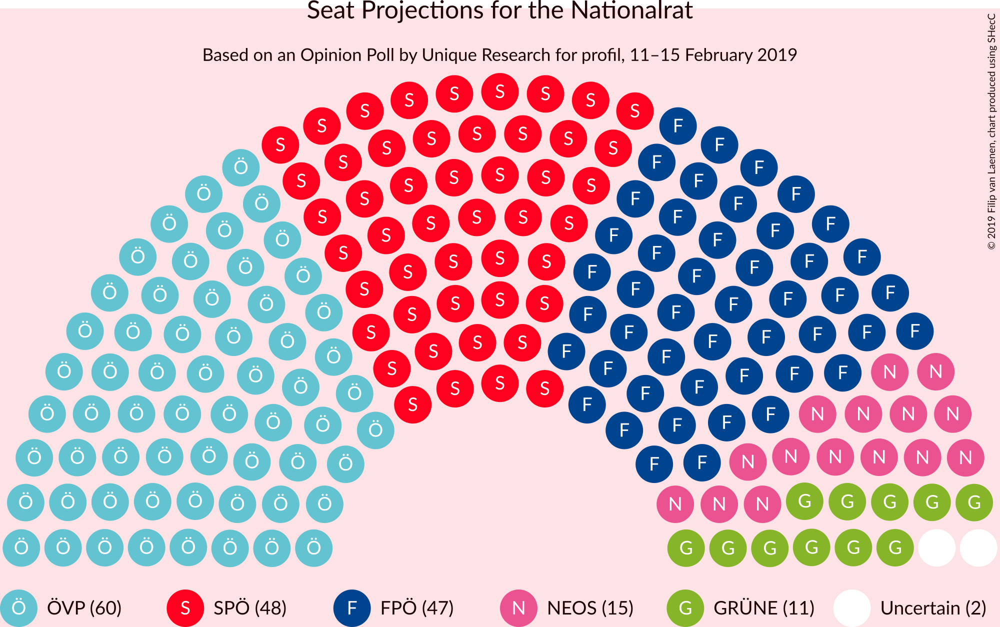
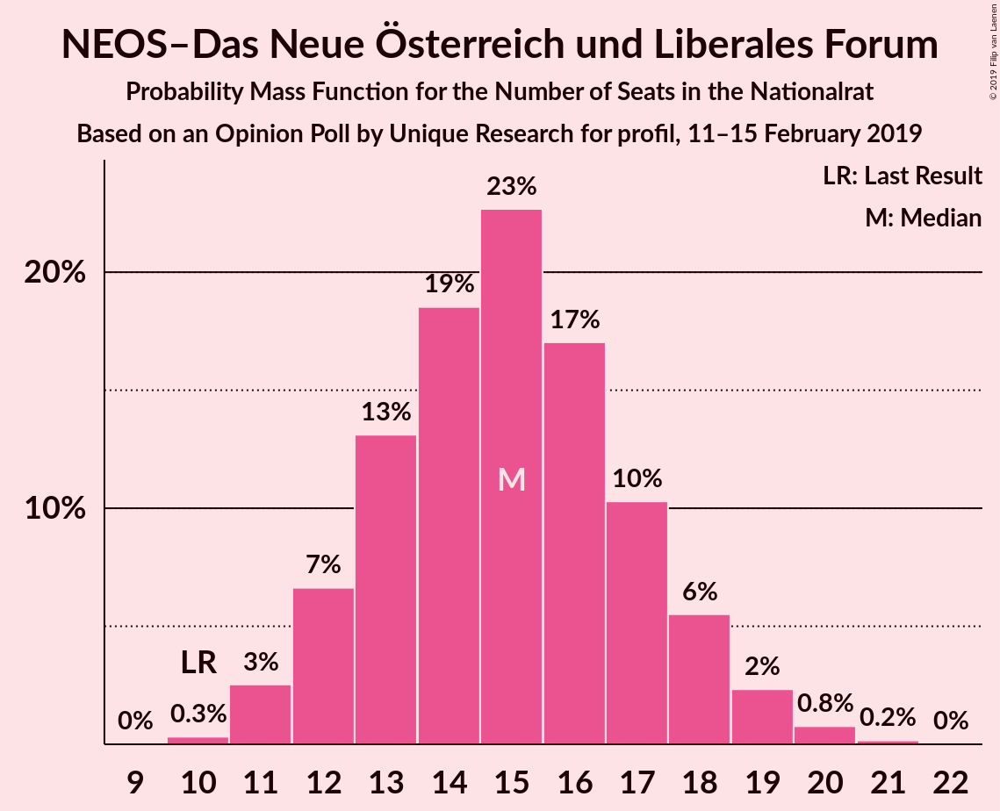
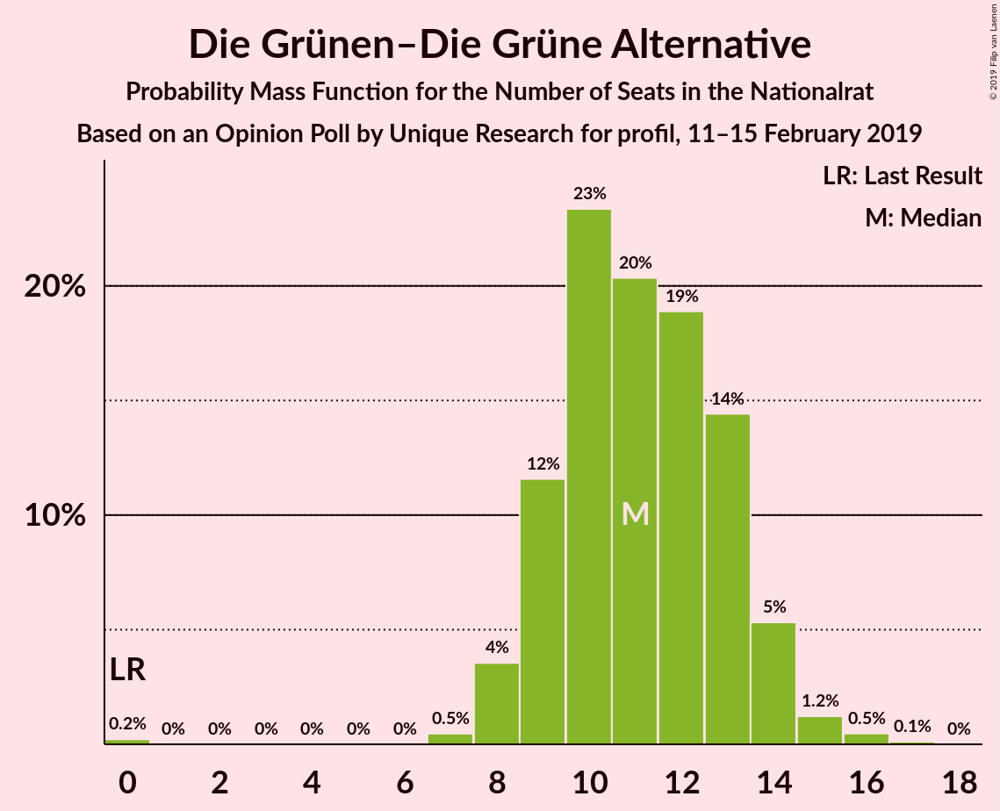
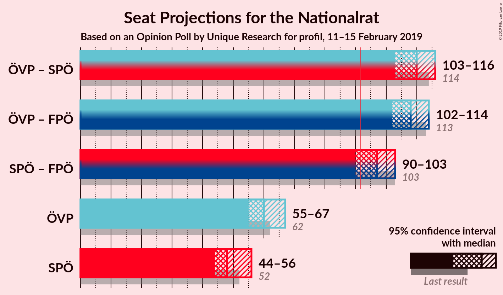
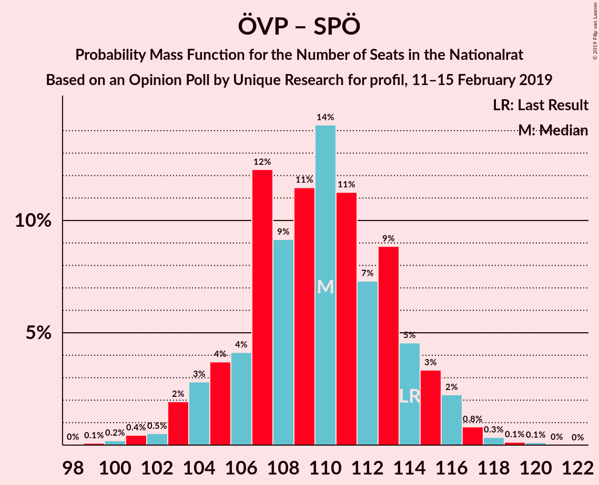
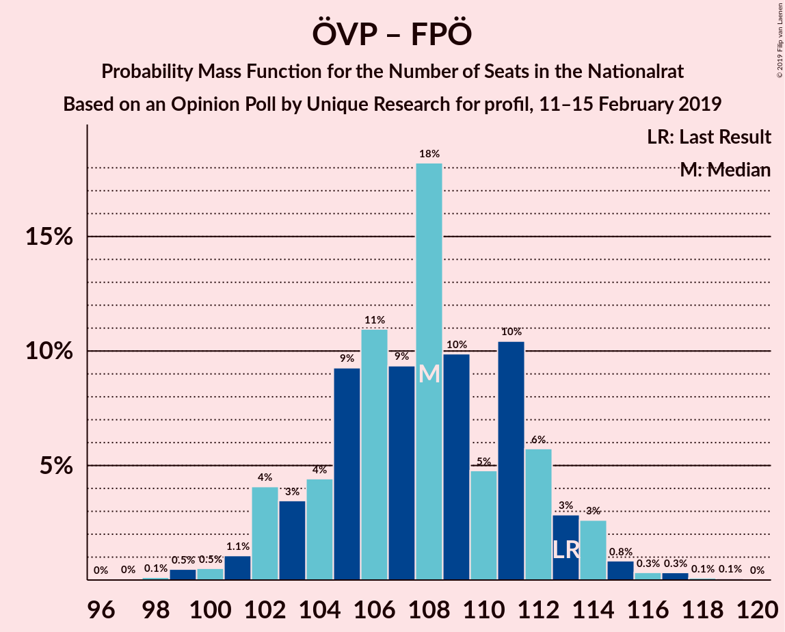
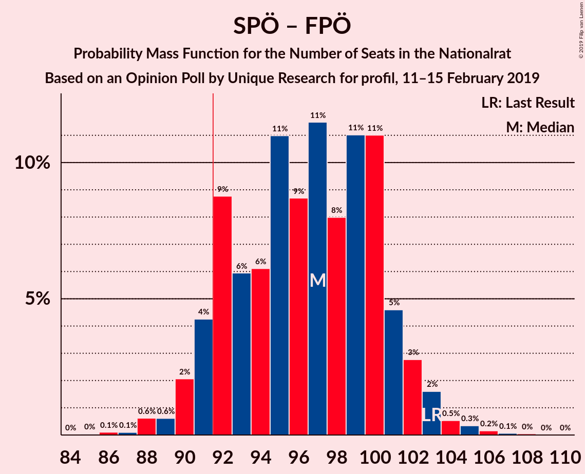

# Opinion Poll by Unique Research for profil, 11–15 February 2019

<a href="#voting-intentions">Voting Intentions</a> | <a href="#seats">Seats</a> | <a href="#coalitions">Coalitions</a> | <a href="#technical-information">Technical Information</a>

## Voting Intentions

### Confidence Intervals

| Party | Last Result | Poll Result | 80% Confidence Interval | 90% Confidence Interval | 95% Confidence Interval | 99% Confidence Interval |
|:-----:|:-----------:|:-----------:|:-----------------------:|:-----------------------:|:-----------------------:|:-----------------------:|
| Österreichische Volkspartei | 31.5% | 32.0% | 29.9–34.2% |29.4–34.8% |28.9–35.3% |27.9–36.4% |
| Sozialdemokratische Partei Österreichs | 26.9% | 26.0% | 24.1–28.1% |23.5–28.7% |23.1–29.2% |22.2–30.2% |
| Freiheitliche Partei Österreichs | 26.0% | 25.0% | 23.1–27.0% |22.6–27.6% |22.1–28.1% |21.2–29.1% |
| NEOS–Das Neue Österreich und Liberales Forum | 5.3% | 8.0% | 6.9–9.4% |6.6–9.8% |6.3–10.1% |5.8–10.8% |
| Die Grünen–Die Grüne Alternative | 3.8% | 6.0% | 5.0–7.2% |4.8–7.6% |4.6–7.9% |4.1–8.5% |
| JETZT–Liste Pilz | 4.4% | 1.0% | 0.7–1.6% |0.6–1.8% |0.5–2.0% |0.4–2.3% |

*Note:* The poll result column reflects the actual value used in the calculations. Published results may vary slightly, and in addition be rounded to fewer digits.

## Seats

### Confidence Intervals

| Party | Last Result | Median | 80% Confidence Interval | 90% Confidence Interval | 95% Confidence Interval | 99% Confidence Interval |
|:-----:|:-----------:|:------:|:-----------------------:|:-----------------------:|:-----------------------:|:-----------------------:|
| <a href="#österreichische-volkspartei">Österreichische Volkspartei</a> | 62 | 60 | 56–65 |55–66 |55–67 |53–69 |
| <a href="#sozialdemokratische-partei-österreichs">Sozialdemokratische Partei Österreichs</a> | 52 | 48 | 45–53 |44–54 |44–56 |42–57 |
| <a href="#freiheitliche-partei-österreichs">Freiheitliche Partei Österreichs</a> | 51 | 47 | 43–51 |43–52 |42–53 |40–55 |
| <a href="#neos–das-neue-österreich-und-liberales-forum">NEOS–Das Neue Österreich und Liberales Forum</a> | 10 | 15 | 13–17 |12–18 |11–19 |11–20 |
| <a href="#die-grünen–die-grüne-alternative">Die Grünen–Die Grüne Alternative</a> | 0 | 11 | 9–13 |9–14 |8–14 |7–16 |
| <a href="#jetzt–liste-pilz">JETZT–Liste Pilz</a> | 8 | 0 | 0 |0 |0 |0 |

### Österreichische Volkspartei

*For a full overview of the results for this party, see the [Österreichische Volkspartei](party-österreichischevolkspartei.html) page.*

| Number of Seats | Probability | Accumulated | Special Marks |
|:---------------:|:-----------:|:-----------:|:-------------:|
| 51 | 0.2% | 100% |  |
| 52 | 0.1% | 99.8% |  |
| 53 | 0.9% | 99.6% |  |
| 54 | 0.6% | 98.8% |  |
| 55 | 4% | 98% |  |
| 56 | 5% | 94% |  |
| 57 | 7% | 89% |  |
| 58 | 4% | 82% |  |
| 59 | 15% | 79% |  |
| 60 | 13% | 63% | Median |
| 61 | 13% | 50% |  |
| 62 | 15% | 37% | Last Result |
| 63 | 6% | 22% |  |
| 64 | 6% | 16% |  |
| 65 | 5% | 11% |  |
| 66 | 4% | 6% |  |
| 67 | 1.3% | 3% |  |
| 68 | 0.8% | 1.5% |  |
| 69 | 0.3% | 0.6% |  |
| 70 | 0.2% | 0.3% |  |
| 71 | 0.1% | 0.1% |  |
| 72 | 0% | 0% |  |

### Sozialdemokratische Partei Österreichs

*For a full overview of the results for this party, see the [Sozialdemokratische Partei Österreichs](party-sozialdemokratischeparteiösterreichs.html) page.*

| Number of Seats | Probability | Accumulated | Special Marks |
|:---------------:|:-----------:|:-----------:|:-------------:|
| 39 | 0% | 100% |  |
| 40 | 0.1% | 99.9% |  |
| 41 | 0.1% | 99.8% |  |
| 42 | 0.7% | 99.7% |  |
| 43 | 1.4% | 99.0% |  |
| 44 | 4% | 98% |  |
| 45 | 5% | 94% |  |
| 46 | 3% | 89% |  |
| 47 | 11% | 86% |  |
| 48 | 27% | 75% | Median |
| 49 | 3% | 48% |  |
| 50 | 8% | 44% |  |
| 51 | 13% | 37% |  |
| 52 | 12% | 23% | Last Result |
| 53 | 7% | 12% |  |
| 54 | 1.3% | 5% |  |
| 55 | 1.0% | 4% |  |
| 56 | 2% | 3% |  |
| 57 | 0.5% | 0.6% |  |
| 58 | 0% | 0.1% |  |
| 59 | 0% | 0.1% |  |
| 60 | 0% | 0.1% |  |
| 61 | 0% | 0% |  |

### Freiheitliche Partei Österreichs

*For a full overview of the results for this party, see the [Freiheitliche Partei Österreichs](party-freiheitlicheparteiösterreichs.html) page.*

| Number of Seats | Probability | Accumulated | Special Marks |
|:---------------:|:-----------:|:-----------:|:-------------:|
| 38 | 0.1% | 100% |  |
| 39 | 0.2% | 99.9% |  |
| 40 | 0.5% | 99.7% |  |
| 41 | 2% | 99.2% |  |
| 42 | 2% | 98% |  |
| 43 | 6% | 96% |  |
| 44 | 11% | 90% |  |
| 45 | 9% | 79% |  |
| 46 | 8% | 70% |  |
| 47 | 13% | 62% | Median |
| 48 | 15% | 50% |  |
| 49 | 10% | 34% |  |
| 50 | 10% | 24% |  |
| 51 | 8% | 14% | Last Result |
| 52 | 3% | 7% |  |
| 53 | 2% | 3% |  |
| 54 | 0.7% | 1.3% |  |
| 55 | 0.3% | 0.6% |  |
| 56 | 0.2% | 0.3% |  |
| 57 | 0.1% | 0.1% |  |
| 58 | 0% | 0% |  |

### NEOS–Das Neue Österreich und Liberales Forum

*For a full overview of the results for this party, see the [NEOS–Das Neue Österreich und Liberales Forum](party-neos–dasneueösterreichundliberalesforum.html) page.*

| Number of Seats | Probability | Accumulated | Special Marks |
|:---------------:|:-----------:|:-----------:|:-------------:|
| 10 | 0.3% | 100% | Last Result |
| 11 | 3% | 99.6% |  |
| 12 | 7% | 97% |  |
| 13 | 13% | 90% |  |
| 14 | 19% | 77% |  |
| 15 | 23% | 59% | Median |
| 16 | 17% | 36% |  |
| 17 | 10% | 19% |  |
| 18 | 6% | 9% |  |
| 19 | 2% | 3% |  |
| 20 | 0.8% | 1.0% |  |
| 21 | 0.2% | 0.2% |  |
| 22 | 0% | 0% |  |

### Die Grünen–Die Grüne Alternative

*For a full overview of the results for this party, see the [Die Grünen–Die Grüne Alternative](party-diegrünen–diegrünealternative.html) page.*

| Number of Seats | Probability | Accumulated | Special Marks |
|:---------------:|:-----------:|:-----------:|:-------------:|
| 0 | 0.2% | 100% | Last Result |
| 1 | 0% | 99.8% |  |
| 2 | 0% | 99.8% |  |
| 3 | 0% | 99.8% |  |
| 4 | 0% | 99.8% |  |
| 5 | 0% | 99.8% |  |
| 6 | 0% | 99.8% |  |
| 7 | 0.5% | 99.8% |  |
| 8 | 4% | 99.3% |  |
| 9 | 12% | 96% |  |
| 10 | 23% | 84% |  |
| 11 | 20% | 61% | Median |
| 12 | 19% | 40% |  |
| 13 | 14% | 22% |  |
| 14 | 5% | 7% |  |
| 15 | 1.2% | 2% |  |
| 16 | 0.5% | 0.6% |  |
| 17 | 0.1% | 0.1% |  |
| 18 | 0% | 0% |  |

### JETZT–Liste Pilz

*For a full overview of the results for this party, see the [JETZT–Liste Pilz](party-jetzt–listepilz.html) page.*

| Number of Seats | Probability | Accumulated | Special Marks |
|:---------------:|:-----------:|:-----------:|:-------------:|
| 0 | 100% | 100% | Median |
| 1 | 0% | 0% |  |
| 2 | 0% | 0% |  |
| 3 | 0% | 0% |  |
| 4 | 0% | 0% |  |
| 5 | 0% | 0% |  |
| 6 | 0% | 0% |  |
| 7 | 0% | 0% |  |
| 8 | 0% | 0% | Last Result |

## Coalitions

### Confidence Intervals

| Coalition | Last Result | Median | Majority? | 80% Confidence Interval | 90% Confidence Interval | 95% Confidence Interval | 99% Confidence Interval |
|:---------:|:-----------:|:------:|:---------:|:-----------------------:|:-----------------------:|:-----------------------:|:-----------------------:|
| Österreichische Volkspartei – Sozialdemokratische Partei Österreichs | 114 | 110 | 100% | 106–114 | 104–115 | 103–116 | 101–118 |
| Österreichische Volkspartei – Freiheitliche Partei Österreichs | 113 | 108 | 100% | 104–112 | 102–113 | 102–114 | 99–117 |
| Sozialdemokratische Partei Österreichs – Freiheitliche Partei Österreichs | 103 | 97 | 92% | 92–101 | 91–102 | 90–103 | 88–105 |
| Österreichische Volkspartei | 62 | 60 | 0% | 56–65 | 55–66 | 55–67 | 53–69 |
| Sozialdemokratische Partei Österreichs | 52 | 48 | 0% | 45–53 | 44–54 | 44–56 | 42–57 |

### Österreichische Volkspartei – Sozialdemokratische Partei Österreichs

| Number of Seats | Probability | Accumulated | Special Marks |
|:---------------:|:-----------:|:-----------:|:-------------:|
| 99 | 0.1% | 100% |  |
| 100 | 0.2% | 99.9% |  |
| 101 | 0.4% | 99.7% |  |
| 102 | 0.5% | 99.2% |  |
| 103 | 2% | 98.7% |  |
| 104 | 3% | 97% |  |
| 105 | 4% | 94% |  |
| 106 | 4% | 90% |  |
| 107 | 12% | 86% |  |
| 108 | 9% | 74% | Median |
| 109 | 11% | 65% |  |
| 110 | 14% | 53% |  |
| 111 | 11% | 39% |  |
| 112 | 7% | 28% |  |
| 113 | 9% | 20% |  |
| 114 | 5% | 12% | Last Result |
| 115 | 3% | 7% |  |
| 116 | 2% | 4% |  |
| 117 | 0.8% | 1.4% |  |
| 118 | 0.3% | 0.6% |  |
| 119 | 0.1% | 0.3% |  |
| 120 | 0.1% | 0.2% |  |
| 121 | 0% | 0% |  |

### Österreichische Volkspartei – Freiheitliche Partei Österreichs

| Number of Seats | Probability | Accumulated | Special Marks |
|:---------------:|:-----------:|:-----------:|:-------------:|
| 97 | 0% | 100% |  |
| 98 | 0.1% | 99.9% |  |
| 99 | 0.5% | 99.8% |  |
| 100 | 0.5% | 99.3% |  |
| 101 | 1.1% | 98.8% |  |
| 102 | 4% | 98% |  |
| 103 | 3% | 94% |  |
| 104 | 4% | 90% |  |
| 105 | 9% | 86% |  |
| 106 | 11% | 77% |  |
| 107 | 9% | 66% | Median |
| 108 | 18% | 56% |  |
| 109 | 10% | 38% |  |
| 110 | 5% | 28% |  |
| 111 | 10% | 23% |  |
| 112 | 6% | 13% |  |
| 113 | 3% | 7% | Last Result |
| 114 | 3% | 4% |  |
| 115 | 0.8% | 2% |  |
| 116 | 0.3% | 0.8% |  |
| 117 | 0.3% | 0.5% |  |
| 118 | 0.1% | 0.2% |  |
| 119 | 0.1% | 0.1% |  |
| 120 | 0% | 0% |  |

### Sozialdemokratische Partei Österreichs – Freiheitliche Partei Österreichs

| Number of Seats | Probability | Accumulated | Special Marks |
|:---------------:|:-----------:|:-----------:|:-------------:|
| 85 | 0% | 100% |  |
| 86 | 0.1% | 99.9% |  |
| 87 | 0.1% | 99.8% |  |
| 88 | 0.6% | 99.7% |  |
| 89 | 0.6% | 99.1% |  |
| 90 | 2% | 98% |  |
| 91 | 4% | 96% |  |
| 92 | 9% | 92% | Majority |
| 93 | 6% | 83% |  |
| 94 | 6% | 77% |  |
| 95 | 11% | 71% | Median |
| 96 | 9% | 60% |  |
| 97 | 11% | 52% |  |
| 98 | 8% | 40% |  |
| 99 | 11% | 32% |  |
| 100 | 11% | 21% |  |
| 101 | 5% | 10% |  |
| 102 | 3% | 6% |  |
| 103 | 2% | 3% | Last Result |
| 104 | 0.5% | 1.2% |  |
| 105 | 0.3% | 0.6% |  |
| 106 | 0.2% | 0.3% |  |
| 107 | 0.1% | 0.1% |  |
| 108 | 0% | 0.1% |  |
| 109 | 0% | 0% |  |

### Österreichische Volkspartei

| Number of Seats | Probability | Accumulated | Special Marks |
|:---------------:|:-----------:|:-----------:|:-------------:|
| 51 | 0.2% | 100% |  |
| 52 | 0.1% | 99.8% |  |
| 53 | 0.9% | 99.6% |  |
| 54 | 0.6% | 98.8% |  |
| 55 | 4% | 98% |  |
| 56 | 5% | 94% |  |
| 57 | 7% | 89% |  |
| 58 | 4% | 82% |  |
| 59 | 15% | 79% |  |
| 60 | 13% | 63% | Median |
| 61 | 13% | 50% |  |
| 62 | 15% | 37% | Last Result |
| 63 | 6% | 22% |  |
| 64 | 6% | 16% |  |
| 65 | 5% | 11% |  |
| 66 | 4% | 6% |  |
| 67 | 1.3% | 3% |  |
| 68 | 0.8% | 1.5% |  |
| 69 | 0.3% | 0.6% |  |
| 70 | 0.2% | 0.3% |  |
| 71 | 0.1% | 0.1% |  |
| 72 | 0% | 0% |  |

### Sozialdemokratische Partei Österreichs

| Number of Seats | Probability | Accumulated | Special Marks |
|:---------------:|:-----------:|:-----------:|:-------------:|
| 39 | 0% | 100% |  |
| 40 | 0.1% | 99.9% |  |
| 41 | 0.1% | 99.8% |  |
| 42 | 0.7% | 99.7% |  |
| 43 | 1.4% | 99.0% |  |
| 44 | 4% | 98% |  |
| 45 | 5% | 94% |  |
| 46 | 3% | 89% |  |
| 47 | 11% | 86% |  |
| 48 | 27% | 75% | Median |
| 49 | 3% | 48% |  |
| 50 | 8% | 44% |  |
| 51 | 13% | 37% |  |
| 52 | 12% | 23% | Last Result |
| 53 | 7% | 12% |  |
| 54 | 1.3% | 5% |  |
| 55 | 1.0% | 4% |  |
| 56 | 2% | 3% |  |
| 57 | 0.5% | 0.6% |  |
| 58 | 0% | 0.1% |  |
| 59 | 0% | 0.1% |  |
| 60 | 0% | 0.1% |  |
| 61 | 0% | 0% |  |

## Technical Information

### Opinion Poll

+ **Polling firm:** Unique Research
+ **Commissioner(s):** profil
+ **Fieldwork period:** 11–15 February 2019

### Calculations

+ **Sample size:** 800
+ **Simulations done:** 131,072
+ **Error estimate:** 1.95%

