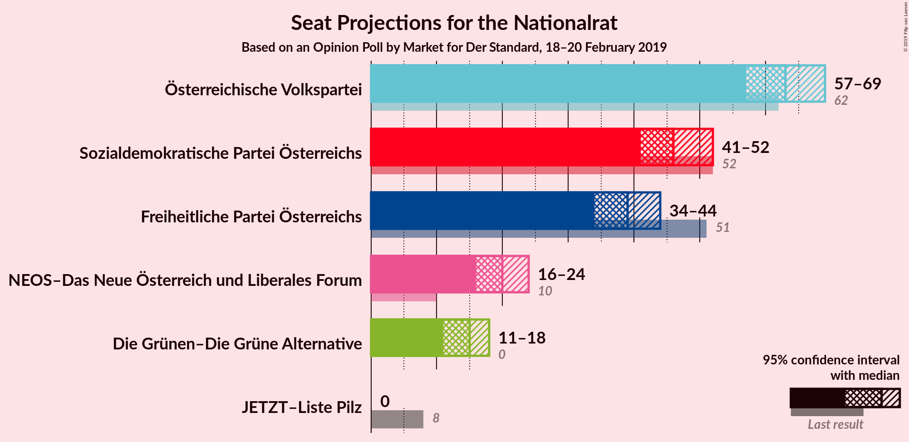
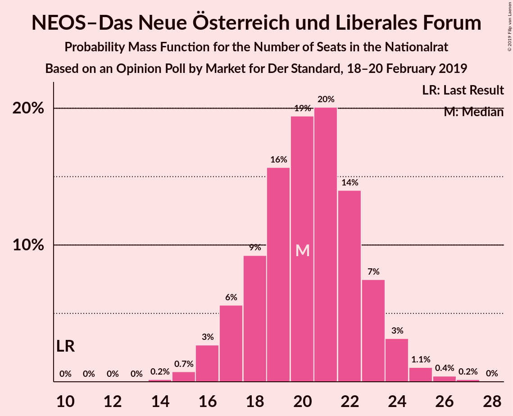
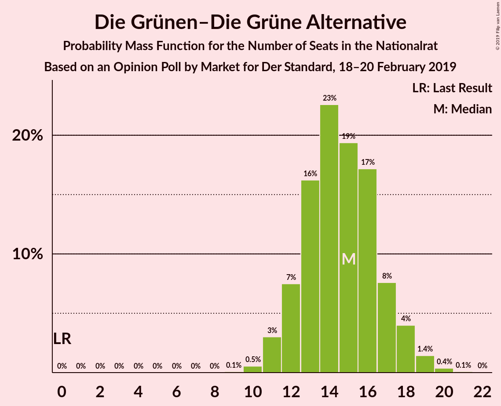
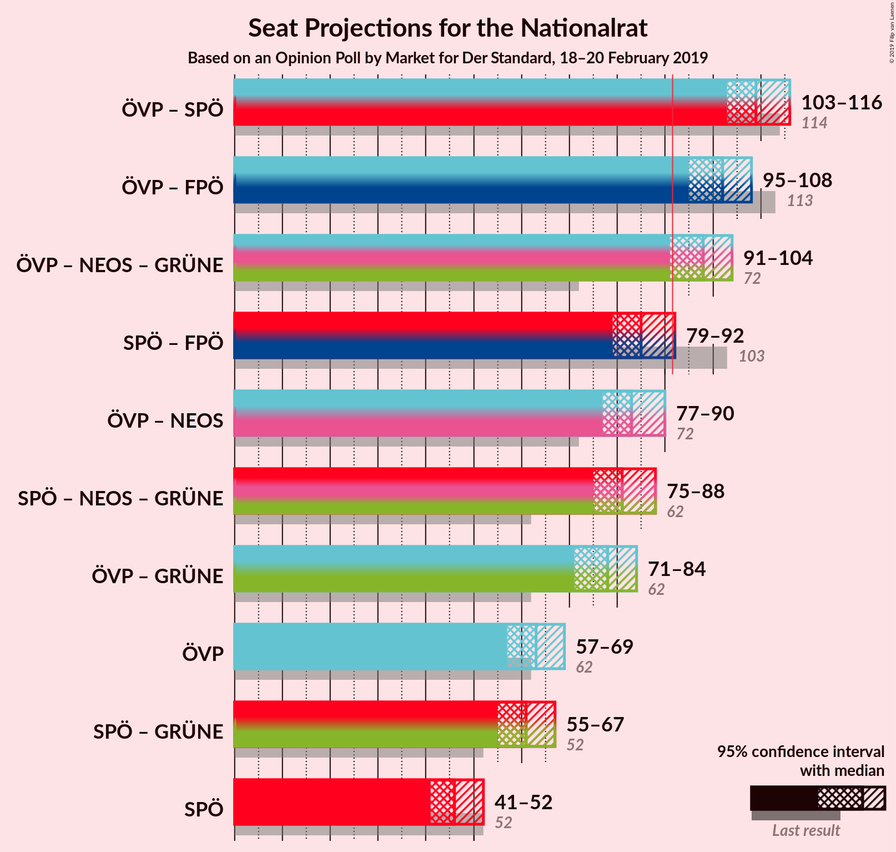
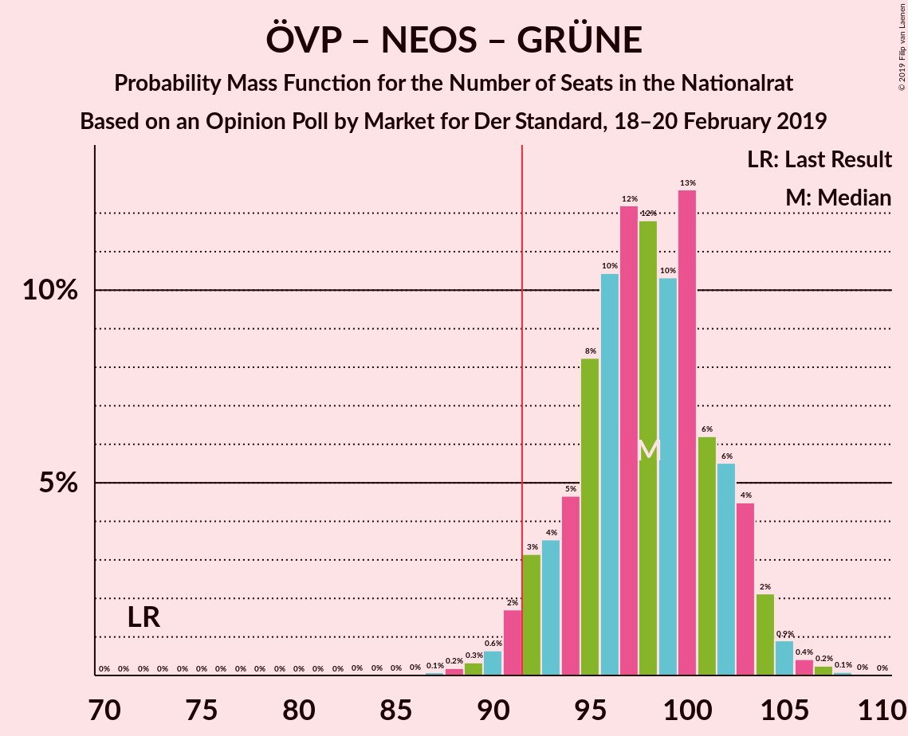
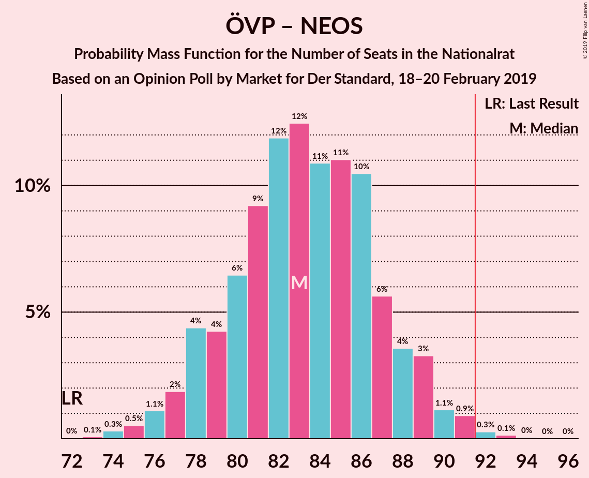
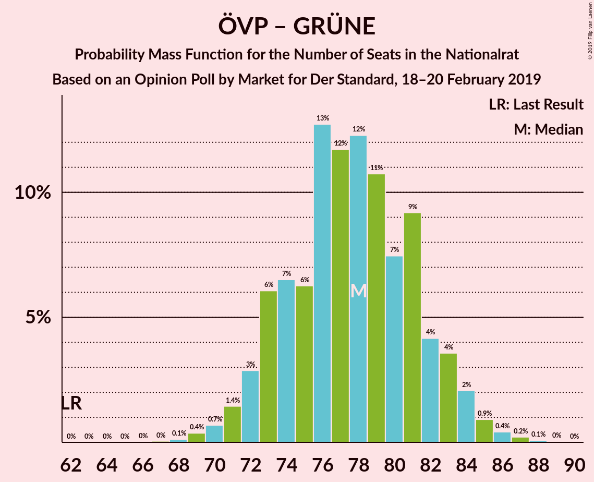

# Opinion Poll by Market for Der Standard, 18–20 February 2019

<a href="#voting-intentions">Voting Intentions</a> | <a href="#seats">Seats</a> | <a href="#coalitions">Coalitions</a> | <a href="#technical-information">Technical Information</a>

## Voting Intentions

### Confidence Intervals

| Party | Last Result | Poll Result | 80% Confidence Interval | 90% Confidence Interval | 95% Confidence Interval | 99% Confidence Interval |
|:-----:|:-----------:|:-----------:|:-----------------------:|:-----------------------:|:-----------------------:|:-----------------------:|
| Österreichische Volkspartei | 31.5% | 33.7% | 31.6–35.8% |31.0–36.5% |30.5–37.0% |29.5–38.0% |
| Sozialdemokratische Partei Österreichs | 26.9% | 24.8% | 22.9–26.8% |22.4–27.4% |21.9–27.9% |21.1–28.9% |
| Freiheitliche Partei Österreichs | 26.0% | 20.8% | 19.1–22.8% |18.6–23.3% |18.2–23.8% |17.4–24.7% |
| NEOS–Das Neue Österreich und Liberales Forum | 5.3% | 10.9% | 9.6–12.4% |9.2–12.8% |8.9–13.2% |8.3–13.9% |
| Die Grünen–Die Grüne Alternative | 3.8% | 7.9% | 6.8–9.2% |6.5–9.6% |6.2–10.0% |5.7–10.6% |
| JETZT–Liste Pilz | 4.4% | 2.0% | 1.5–2.8% |1.3–3.0% |1.2–3.2% |1.0–3.6% |

*Note:* The poll result column reflects the actual value used in the calculations. Published results may vary slightly, and in addition be rounded to fewer digits.

## Seats

### Confidence Intervals

| Party | Last Result | Median | 80% Confidence Interval | 90% Confidence Interval | 95% Confidence Interval | 99% Confidence Interval |
|:-----:|:-----------:|:------:|:-----------------------:|:-----------------------:|:-----------------------:|:-----------------------:|
| <a href="#österreichische-volkspartei">Österreichische Volkspartei</a> | 62 | 64 | 59–67 |59–69 |57–70 |55–71 |
| <a href="#sozialdemokratische-partei-österreichs">Sozialdemokratische Partei Österreichs</a> | 52 | 45 | 42–50 |42–50 |41–52 |40–54 |
| <a href="#freiheitliche-partei-österreichs">Freiheitliche Partei Österreichs</a> | 51 | 38 | 36–43 |35–43 |34–44 |33–46 |
| <a href="#neos–das-neue-österreich-und-liberales-forum">NEOS–Das Neue Österreich und Liberales Forum</a> | 10 | 20 | 18–22 |17–23 |16–24 |15–26 |
| <a href="#die-grünen–die-grüne-alternative">Die Grünen–Die Grüne Alternative</a> | 0 | 14 | 12–17 |12–18 |11–18 |10–19 |
| <a href="#jetzt–liste-pilz">JETZT–Liste Pilz</a> | 8 | 0 | 0 |0 |0 |0 |

### Österreichische Volkspartei

*For a full overview of the results for this party, see the [Österreichische Volkspartei](party-österreichischevolkspartei.html) page.*

| Number of Seats | Probability | Accumulated | Special Marks |
|:---------------:|:-----------:|:-----------:|:-------------:|
| 53 | 0% | 100% |  |
| 54 | 0.2% | 99.9% |  |
| 55 | 0.6% | 99.8% |  |
| 56 | 0.5% | 99.2% |  |
| 57 | 2% | 98.7% |  |
| 58 | 2% | 97% |  |
| 59 | 9% | 95% |  |
| 60 | 5% | 86% |  |
| 61 | 14% | 81% |  |
| 62 | 4% | 68% | Last Result |
| 63 | 10% | 64% |  |
| 64 | 16% | 54% | Median |
| 65 | 9% | 38% |  |
| 66 | 17% | 28% |  |
| 67 | 3% | 11% |  |
| 68 | 2% | 7% |  |
| 69 | 3% | 5% |  |
| 70 | 2% | 3% |  |
| 71 | 0.4% | 0.6% |  |
| 72 | 0.1% | 0.2% |  |
| 73 | 0.1% | 0.1% |  |
| 74 | 0% | 0.1% |  |
| 75 | 0% | 0% |  |

### Sozialdemokratische Partei Österreichs

*For a full overview of the results for this party, see the [Sozialdemokratische Partei Österreichs](party-sozialdemokratischeparteiösterreichs.html) page.*

| Number of Seats | Probability | Accumulated | Special Marks |
|:---------------:|:-----------:|:-----------:|:-------------:|
| 38 | 0.1% | 100% |  |
| 39 | 0.2% | 99.9% |  |
| 40 | 0.7% | 99.7% |  |
| 41 | 1.5% | 98.9% |  |
| 42 | 8% | 97% |  |
| 43 | 3% | 89% |  |
| 44 | 6% | 86% |  |
| 45 | 33% | 80% | Median |
| 46 | 5% | 47% |  |
| 47 | 8% | 42% |  |
| 48 | 6% | 34% |  |
| 49 | 11% | 28% |  |
| 50 | 13% | 17% |  |
| 51 | 0.9% | 4% |  |
| 52 | 1.1% | 3% | Last Result |
| 53 | 1.3% | 2% |  |
| 54 | 0.8% | 1.0% |  |
| 55 | 0% | 0.1% |  |
| 56 | 0% | 0.1% |  |
| 57 | 0% | 0% |  |

### Freiheitliche Partei Österreichs

*For a full overview of the results for this party, see the [Freiheitliche Partei Österreichs](party-freiheitlicheparteiösterreichs.html) page.*

| Number of Seats | Probability | Accumulated | Special Marks |
|:---------------:|:-----------:|:-----------:|:-------------:|
| 31 | 0.2% | 100% |  |
| 32 | 0.3% | 99.8% |  |
| 33 | 1.4% | 99.5% |  |
| 34 | 2% | 98% |  |
| 35 | 3% | 96% |  |
| 36 | 12% | 93% |  |
| 37 | 6% | 81% |  |
| 38 | 29% | 74% | Median |
| 39 | 11% | 45% |  |
| 40 | 3% | 34% |  |
| 41 | 13% | 31% |  |
| 42 | 5% | 18% |  |
| 43 | 10% | 13% |  |
| 44 | 1.5% | 3% |  |
| 45 | 0.5% | 1.4% |  |
| 46 | 0.6% | 0.9% |  |
| 47 | 0.2% | 0.4% |  |
| 48 | 0.1% | 0.2% |  |
| 49 | 0% | 0% |  |
| 50 | 0% | 0% |  |
| 51 | 0% | 0% | Last Result |

### NEOS–Das Neue Österreich und Liberales Forum

*For a full overview of the results for this party, see the [NEOS–Das Neue Österreich und Liberales Forum](party-neos–dasneueösterreichundliberalesforum.html) page.*

| Number of Seats | Probability | Accumulated | Special Marks |
|:---------------:|:-----------:|:-----------:|:-------------:|
| 10 | 0% | 100% | Last Result |
| 11 | 0% | 100% |  |
| 12 | 0% | 100% |  |
| 13 | 0% | 100% |  |
| 14 | 0.2% | 100% |  |
| 15 | 0.9% | 99.8% |  |
| 16 | 1.5% | 98.9% |  |
| 17 | 5% | 97% |  |
| 18 | 12% | 93% |  |
| 19 | 25% | 81% |  |
| 20 | 17% | 55% | Median |
| 21 | 16% | 38% |  |
| 22 | 13% | 22% |  |
| 23 | 4% | 9% |  |
| 24 | 3% | 4% |  |
| 25 | 0.9% | 2% |  |
| 26 | 0.6% | 0.8% |  |
| 27 | 0.1% | 0.2% |  |
| 28 | 0% | 0% |  |

### Die Grünen–Die Grüne Alternative

*For a full overview of the results for this party, see the [Die Grünen–Die Grüne Alternative](party-diegrünen–diegrünealternative.html) page.*

| Number of Seats | Probability | Accumulated | Special Marks |
|:---------------:|:-----------:|:-----------:|:-------------:|
| 0 | 0% | 100% | Last Result |
| 1 | 0% | 100% |  |
| 2 | 0% | 100% |  |
| 3 | 0% | 100% |  |
| 4 | 0% | 100% |  |
| 5 | 0% | 100% |  |
| 6 | 0% | 100% |  |
| 7 | 0% | 100% |  |
| 8 | 0% | 100% |  |
| 9 | 0.1% | 100% |  |
| 10 | 0.9% | 99.9% |  |
| 11 | 3% | 99.0% |  |
| 12 | 10% | 96% |  |
| 13 | 16% | 86% |  |
| 14 | 26% | 70% | Median |
| 15 | 19% | 44% |  |
| 16 | 11% | 25% |  |
| 17 | 6% | 14% |  |
| 18 | 6% | 7% |  |
| 19 | 1.1% | 2% |  |
| 20 | 0.4% | 0.4% |  |
| 21 | 0.1% | 0.1% |  |
| 22 | 0% | 0% |  |

### JETZT–Liste Pilz

*For a full overview of the results for this party, see the [JETZT–Liste Pilz](party-jetzt–listepilz.html) page.*

| Number of Seats | Probability | Accumulated | Special Marks |
|:---------------:|:-----------:|:-----------:|:-------------:|
| 0 | 99.9% | 100% | Median |
| 1 | 0% | 0.1% |  |
| 2 | 0% | 0.1% |  |
| 3 | 0% | 0.1% |  |
| 4 | 0% | 0.1% |  |
| 5 | 0% | 0.1% |  |
| 6 | 0% | 0.1% |  |
| 7 | 0.1% | 0.1% |  |
| 8 | 0% | 0% | Last Result |

## Coalitions

### Confidence Intervals

| Coalition | Last Result | Median | Majority? | 80% Confidence Interval | 90% Confidence Interval | 95% Confidence Interval | 99% Confidence Interval |
|:---------:|:-----------:|:------:|:---------:|:-----------------------:|:-----------------------:|:-----------------------:|:-----------------------:|
| Österreichische Volkspartei – Sozialdemokratische Partei Österreichs | 114 | 110 | 100% | 105–114 | 105–115 | 103–116 | 101–117 |
| Österreichische Volkspartei – Freiheitliche Partei Österreichs | 113 | 102 | 99.9% | 97–107 | 96–107 | 95–109 | 93–110 |
| Österreichische Volkspartei – NEOS–Das Neue Österreich und Liberales Forum – Die Grünen–Die Grüne Alternative | 72 | 98 | 98% | 95–101 | 93–103 | 92–104 | 90–107 |
| Sozialdemokratische Partei Österreichs – Freiheitliche Partei Österreichs | 103 | 85 | 2% | 82–88 | 80–90 | 79–91 | 76–93 |
| Österreichische Volkspartei – NEOS–Das Neue Österreich und Liberales Forum | 72 | 84 | 0.6% | 80–86 | 78–89 | 77–89 | 75–92 |
| Sozialdemokratische Partei Österreichs – NEOS–Das Neue Österreich und Liberales Forum – Die Grünen–Die Grüne Alternative | 62 | 81 | 0.1% | 76–86 | 76–87 | 74–88 | 73–90 |
| Österreichische Volkspartei – Die Grünen–Die Grüne Alternative | 62 | 78 | 0% | 74–82 | 73–83 | 72–84 | 70–85 |
| Österreichische Volkspartei | 62 | 64 | 0% | 59–67 | 59–69 | 57–70 | 55–71 |
| Sozialdemokratische Partei Österreichs | 52 | 45 | 0% | 42–50 | 42–50 | 41–52 | 40–54 |

### Österreichische Volkspartei – Sozialdemokratische Partei Österreichs

| Number of Seats | Probability | Accumulated | Special Marks |
|:---------------:|:-----------:|:-----------:|:-------------:|
| 99 | 0.1% | 100% |  |
| 100 | 0.2% | 99.8% |  |
| 101 | 0.3% | 99.6% |  |
| 102 | 0.6% | 99.3% |  |
| 103 | 1.4% | 98.7% |  |
| 104 | 2% | 97% |  |
| 105 | 7% | 96% |  |
| 106 | 12% | 88% |  |
| 107 | 4% | 76% |  |
| 108 | 7% | 72% |  |
| 109 | 9% | 65% | Median |
| 110 | 8% | 56% |  |
| 111 | 22% | 49% |  |
| 112 | 5% | 27% |  |
| 113 | 9% | 21% |  |
| 114 | 6% | 12% | Last Result |
| 115 | 2% | 5% |  |
| 116 | 1.5% | 3% |  |
| 117 | 1.2% | 2% |  |
| 118 | 0.1% | 0.3% |  |
| 119 | 0.1% | 0.2% |  |
| 120 | 0% | 0.1% |  |
| 121 | 0% | 0% |  |

### Österreichische Volkspartei – Freiheitliche Partei Österreichs

| Number of Seats | Probability | Accumulated | Special Marks |
|:---------------:|:-----------:|:-----------:|:-------------:|
| 91 | 0% | 100% |  |
| 92 | 0.3% | 99.9% | Majority |
| 93 | 0.2% | 99.7% |  |
| 94 | 0.4% | 99.5% |  |
| 95 | 3% | 99.0% |  |
| 96 | 1.4% | 96% |  |
| 97 | 8% | 95% |  |
| 98 | 3% | 87% |  |
| 99 | 5% | 84% |  |
| 100 | 7% | 80% |  |
| 101 | 5% | 72% |  |
| 102 | 23% | 67% | Median |
| 103 | 3% | 44% |  |
| 104 | 20% | 41% |  |
| 105 | 3% | 21% |  |
| 106 | 7% | 18% |  |
| 107 | 6% | 11% |  |
| 108 | 2% | 5% |  |
| 109 | 2% | 3% |  |
| 110 | 0.3% | 0.7% |  |
| 111 | 0.3% | 0.4% |  |
| 112 | 0.1% | 0.1% |  |
| 113 | 0% | 0% | Last Result |

### Österreichische Volkspartei – NEOS–Das Neue Österreich und Liberales Forum – Die Grünen–Die Grüne Alternative

| Number of Seats | Probability | Accumulated | Special Marks |
|:---------------:|:-----------:|:-----------:|:-------------:|
| 72 | 0% | 100% | Last Result |
| 73 | 0% | 100% |  |
| 74 | 0% | 100% |  |
| 75 | 0% | 100% |  |
| 76 | 0% | 100% |  |
| 77 | 0% | 100% |  |
| 78 | 0% | 100% |  |
| 79 | 0% | 100% |  |
| 80 | 0% | 100% |  |
| 81 | 0% | 100% |  |
| 82 | 0% | 100% |  |
| 83 | 0% | 100% |  |
| 84 | 0% | 100% |  |
| 85 | 0% | 100% |  |
| 86 | 0% | 100% |  |
| 87 | 0.1% | 100% |  |
| 88 | 0.1% | 99.9% |  |
| 89 | 0.3% | 99.8% |  |
| 90 | 0.7% | 99.5% |  |
| 91 | 0.7% | 98.9% |  |
| 92 | 2% | 98% | Majority |
| 93 | 3% | 96% |  |
| 94 | 2% | 93% |  |
| 95 | 12% | 91% |  |
| 96 | 11% | 79% |  |
| 97 | 18% | 68% |  |
| 98 | 11% | 50% | Median |
| 99 | 8% | 40% |  |
| 100 | 17% | 31% |  |
| 101 | 5% | 14% |  |
| 102 | 4% | 9% |  |
| 103 | 3% | 6% |  |
| 104 | 2% | 3% |  |
| 105 | 0.8% | 2% |  |
| 106 | 0.3% | 0.8% |  |
| 107 | 0.3% | 0.5% |  |
| 108 | 0.2% | 0.2% |  |
| 109 | 0% | 0.1% |  |
| 110 | 0% | 0% |  |

### Sozialdemokratische Partei Österreichs – Freiheitliche Partei Österreichs

| Number of Seats | Probability | Accumulated | Special Marks |
|:---------------:|:-----------:|:-----------:|:-------------:|
| 74 | 0% | 100% |  |
| 75 | 0.2% | 99.9% |  |
| 76 | 0.3% | 99.8% |  |
| 77 | 0.3% | 99.5% |  |
| 78 | 0.8% | 99.2% |  |
| 79 | 2% | 98% |  |
| 80 | 3% | 97% |  |
| 81 | 4% | 94% |  |
| 82 | 5% | 91% |  |
| 83 | 17% | 86% | Median |
| 84 | 8% | 69% |  |
| 85 | 11% | 60% |  |
| 86 | 18% | 50% |  |
| 87 | 11% | 31% |  |
| 88 | 12% | 21% |  |
| 89 | 2% | 9% |  |
| 90 | 3% | 7% |  |
| 91 | 2% | 4% |  |
| 92 | 0.7% | 2% | Majority |
| 93 | 0.7% | 1.1% |  |
| 94 | 0.3% | 0.5% |  |
| 95 | 0.1% | 0.2% |  |
| 96 | 0.1% | 0.1% |  |
| 97 | 0% | 0% |  |
| 98 | 0% | 0% |  |
| 99 | 0% | 0% |  |
| 100 | 0% | 0% |  |
| 101 | 0% | 0% |  |
| 102 | 0% | 0% |  |
| 103 | 0% | 0% | Last Result |

### Österreichische Volkspartei – NEOS–Das Neue Österreich und Liberales Forum

| Number of Seats | Probability | Accumulated | Special Marks |
|:---------------:|:-----------:|:-----------:|:-------------:|
| 72 | 0% | 100% | Last Result |
| 73 | 0.1% | 100% |  |
| 74 | 0.3% | 99.9% |  |
| 75 | 0.4% | 99.6% |  |
| 76 | 0.4% | 99.3% |  |
| 77 | 3% | 98.8% |  |
| 78 | 3% | 96% |  |
| 79 | 1.3% | 94% |  |
| 80 | 4% | 92% |  |
| 81 | 13% | 88% |  |
| 82 | 17% | 75% |  |
| 83 | 7% | 58% |  |
| 84 | 11% | 51% | Median |
| 85 | 21% | 40% |  |
| 86 | 9% | 19% |  |
| 87 | 3% | 10% |  |
| 88 | 0.9% | 7% |  |
| 89 | 4% | 6% |  |
| 90 | 0.6% | 2% |  |
| 91 | 0.5% | 1.2% |  |
| 92 | 0.3% | 0.6% | Majority |
| 93 | 0.2% | 0.3% |  |
| 94 | 0.1% | 0.1% |  |
| 95 | 0% | 0% |  |

### Sozialdemokratische Partei Österreichs – NEOS–Das Neue Österreich und Liberales Forum – Die Grünen–Die Grüne Alternative

| Number of Seats | Probability | Accumulated | Special Marks |
|:---------------:|:-----------:|:-----------:|:-------------:|
| 62 | 0% | 100% | Last Result |
| 63 | 0% | 100% |  |
| 64 | 0% | 100% |  |
| 65 | 0% | 100% |  |
| 66 | 0% | 100% |  |
| 67 | 0% | 100% |  |
| 68 | 0% | 100% |  |
| 69 | 0% | 100% |  |
| 70 | 0% | 100% |  |
| 71 | 0.1% | 100% |  |
| 72 | 0.3% | 99.9% |  |
| 73 | 0.3% | 99.6% |  |
| 74 | 2% | 99.3% |  |
| 75 | 2% | 97% |  |
| 76 | 6% | 95% |  |
| 77 | 7% | 89% |  |
| 78 | 3% | 82% |  |
| 79 | 20% | 79% | Median |
| 80 | 3% | 59% |  |
| 81 | 23% | 56% |  |
| 82 | 5% | 33% |  |
| 83 | 7% | 28% |  |
| 84 | 4% | 20% |  |
| 85 | 3% | 16% |  |
| 86 | 8% | 13% |  |
| 87 | 1.4% | 5% |  |
| 88 | 3% | 4% |  |
| 89 | 0.4% | 0.9% |  |
| 90 | 0.2% | 0.5% |  |
| 91 | 0.3% | 0.3% |  |
| 92 | 0% | 0.1% | Majority |
| 93 | 0% | 0% |  |

### Österreichische Volkspartei – Die Grünen–Die Grüne Alternative

| Number of Seats | Probability | Accumulated | Special Marks |
|:---------------:|:-----------:|:-----------:|:-------------:|
| 62 | 0% | 100% | Last Result |
| 63 | 0% | 100% |  |
| 64 | 0% | 100% |  |
| 65 | 0% | 100% |  |
| 66 | 0% | 100% |  |
| 67 | 0% | 100% |  |
| 68 | 0.1% | 99.9% |  |
| 69 | 0.3% | 99.9% |  |
| 70 | 0.9% | 99.6% |  |
| 71 | 1.2% | 98.8% |  |
| 72 | 0.9% | 98% |  |
| 73 | 6% | 97% |  |
| 74 | 10% | 91% |  |
| 75 | 4% | 81% |  |
| 76 | 8% | 77% |  |
| 77 | 17% | 69% |  |
| 78 | 15% | 52% | Median |
| 79 | 6% | 36% |  |
| 80 | 4% | 30% |  |
| 81 | 15% | 27% |  |
| 82 | 5% | 12% |  |
| 83 | 3% | 7% |  |
| 84 | 2% | 4% |  |
| 85 | 2% | 2% |  |
| 86 | 0.2% | 0.4% |  |
| 87 | 0.1% | 0.2% |  |
| 88 | 0.1% | 0.1% |  |
| 89 | 0% | 0% |  |

### Österreichische Volkspartei

| Number of Seats | Probability | Accumulated | Special Marks |
|:---------------:|:-----------:|:-----------:|:-------------:|
| 53 | 0% | 100% |  |
| 54 | 0.2% | 99.9% |  |
| 55 | 0.6% | 99.8% |  |
| 56 | 0.5% | 99.2% |  |
| 57 | 2% | 98.7% |  |
| 58 | 2% | 97% |  |
| 59 | 9% | 95% |  |
| 60 | 5% | 86% |  |
| 61 | 14% | 81% |  |
| 62 | 4% | 68% | Last Result |
| 63 | 10% | 64% |  |
| 64 | 16% | 54% | Median |
| 65 | 9% | 38% |  |
| 66 | 17% | 28% |  |
| 67 | 3% | 11% |  |
| 68 | 2% | 7% |  |
| 69 | 3% | 5% |  |
| 70 | 2% | 3% |  |
| 71 | 0.4% | 0.6% |  |
| 72 | 0.1% | 0.2% |  |
| 73 | 0.1% | 0.1% |  |
| 74 | 0% | 0.1% |  |
| 75 | 0% | 0% |  |

### Sozialdemokratische Partei Österreichs

| Number of Seats | Probability | Accumulated | Special Marks |
|:---------------:|:-----------:|:-----------:|:-------------:|
| 38 | 0.1% | 100% |  |
| 39 | 0.2% | 99.9% |  |
| 40 | 0.7% | 99.7% |  |
| 41 | 1.5% | 98.9% |  |
| 42 | 8% | 97% |  |
| 43 | 3% | 89% |  |
| 44 | 6% | 86% |  |
| 45 | 33% | 80% | Median |
| 46 | 5% | 47% |  |
| 47 | 8% | 42% |  |
| 48 | 6% | 34% |  |
| 49 | 11% | 28% |  |
| 50 | 13% | 17% |  |
| 51 | 0.9% | 4% |  |
| 52 | 1.1% | 3% | Last Result |
| 53 | 1.3% | 2% |  |
| 54 | 0.8% | 1.0% |  |
| 55 | 0% | 0.1% |  |
| 56 | 0% | 0.1% |  |
| 57 | 0% | 0% |  |

## Technical Information

### Opinion Poll

+ **Polling firm:** Market
+ **Commissioner(s):** Der Standard
+ **Fieldwork period:** 18–20 February 2019

### Calculations

+ **Sample size:** 811
+ **Simulations done:** 131,072
+ **Error estimate:** 3.48%

