# Opinion Poll by Peter Hajek for ATV, 21–28 February 2019

<a href="#voting-intentions">Voting Intentions</a> | <a href="#seats">Seats</a> | <a href="#coalitions">Coalitions</a> | <a href="#technical-information">Technical Information</a>

## Voting Intentions

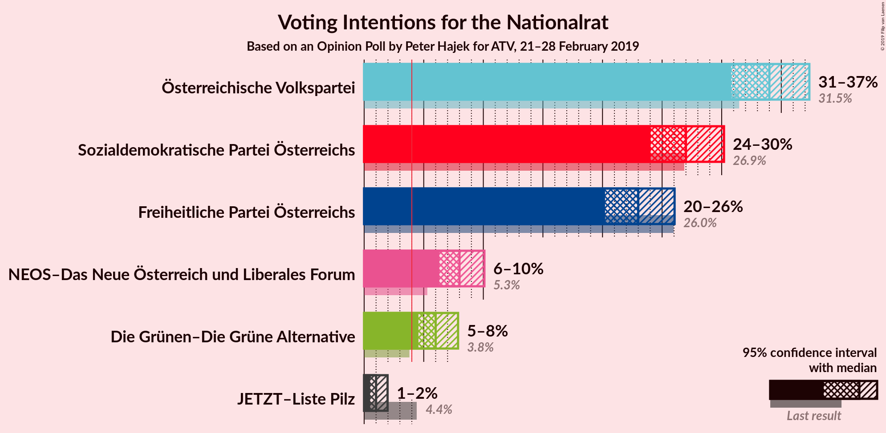

### Confidence Intervals

| Party | Last Result | Poll Result | 80% Confidence Interval | 90% Confidence Interval | 95% Confidence Interval | 99% Confidence Interval |
|:-----:|:-----------:|:-----------:|:-----------------------:|:-----------------------:|:-----------------------:|:-----------------------:|
| Österreichische Volkspartei | 31.5% | 34.0% | 31.9–36.2% |31.3–36.8% |30.8–37.4% |29.8–38.4% |
| Sozialdemokratische Partei Österreichs | 26.9% | 27.0% | 25.1–29.1% |24.5–29.7% |24.0–30.2% |23.1–31.2% |
| Freiheitliche Partei Österreichs | 26.0% | 23.0% | 21.2–25.0% |20.7–25.6% |20.2–26.0% |19.4–27.0% |
| NEOS–Das Neue Österreich und Liberales Forum | 5.3% | 8.0% | 6.9–9.4% |6.6–9.8% |6.3–10.1% |5.8–10.8% |
| Die Grünen–Die Grüne Alternative | 3.8% | 6.0% | 5.0–7.2% |4.8–7.6% |4.6–7.9% |4.1–8.5% |
| JETZT–Liste Pilz | 4.4% | 1.0% | 0.7–1.6% |0.6–1.8% |0.5–2.0% |0.4–2.3% |

*Note:* The poll result column reflects the actual value used in the calculations. Published results may vary slightly, and in addition be rounded to fewer digits.

## Seats

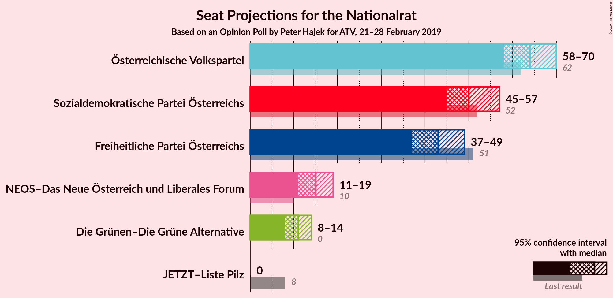

### Confidence Intervals

| Party | Last Result | Median | 80% Confidence Interval | 90% Confidence Interval | 95% Confidence Interval | 99% Confidence Interval |
|:-----:|:-----------:|:------:|:-----------------------:|:-----------------------:|:-----------------------:|:-----------------------:|
| <a href="#österreichische-volkspartei">Österreichische Volkspartei</a> | 62 | 64 | 60–68 |58–69 |58–70 |56–72 |
| <a href="#sozialdemokratische-partei-österreichs">Sozialdemokratische Partei Österreichs</a> | 52 | 50 | 47–54 |46–55 |45–57 |44–59 |
| <a href="#freiheitliche-partei-österreichs">Freiheitliche Partei Österreichs</a> | 51 | 43 | 39–47 |39–48 |37–49 |36–51 |
| <a href="#neos–das-neue-österreich-und-liberales-forum">NEOS–Das Neue Österreich und Liberales Forum</a> | 10 | 15 | 12–17 |12–18 |11–19 |11–20 |
| <a href="#die-grünen–die-grüne-alternative">Die Grünen–Die Grüne Alternative</a> | 0 | 11 | 9–13 |9–14 |8–14 |7–16 |
| <a href="#jetzt–liste-pilz">JETZT–Liste Pilz</a> | 8 | 0 | 0 |0 |0 |0 |

### Österreichische Volkspartei

*For a full overview of the results for this party, see the [Österreichische Volkspartei](party-österreichischevolkspartei.html) page.*

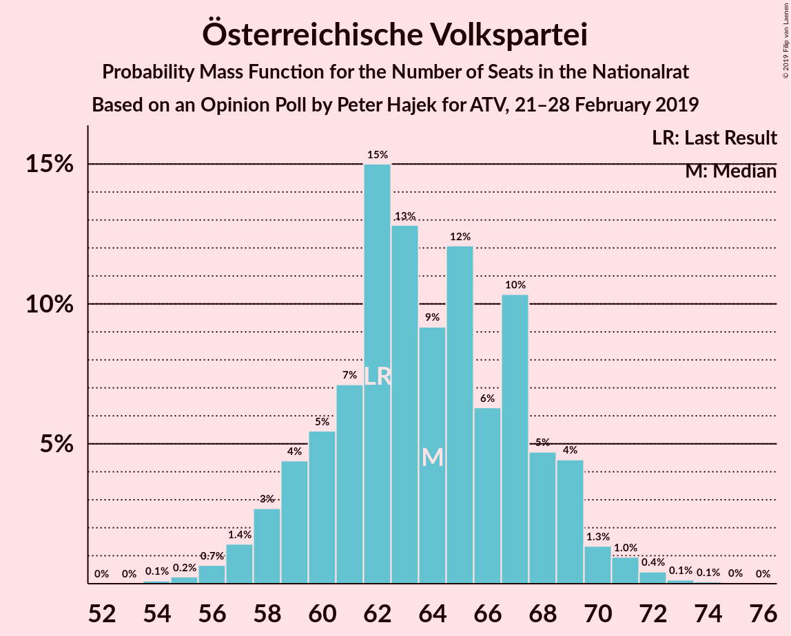

| Number of Seats | Probability | Accumulated | Special Marks |
|:---------------:|:-----------:|:-----------:|:-------------:|
| 54 | 0.1% | 100% |  |
| 55 | 0.2% | 99.9% |  |
| 56 | 0.7% | 99.6% |  |
| 57 | 1.4% | 99.0% |  |
| 58 | 3% | 98% |  |
| 59 | 4% | 95% |  |
| 60 | 5% | 90% |  |
| 61 | 7% | 85% |  |
| 62 | 15% | 78% | Last Result |
| 63 | 13% | 63% |  |
| 64 | 9% | 50% | Median |
| 65 | 12% | 41% |  |
| 66 | 6% | 29% |  |
| 67 | 10% | 22% |  |
| 68 | 5% | 12% |  |
| 69 | 4% | 7% |  |
| 70 | 1.3% | 3% |  |
| 71 | 1.0% | 2% |  |
| 72 | 0.4% | 0.7% |  |
| 73 | 0.1% | 0.3% |  |
| 74 | 0.1% | 0.1% |  |
| 75 | 0% | 0.1% |  |
| 76 | 0% | 0% |  |

### Sozialdemokratische Partei Österreichs

*For a full overview of the results for this party, see the [Sozialdemokratische Partei Österreichs](party-sozialdemokratischeparteiösterreichs.html) page.*

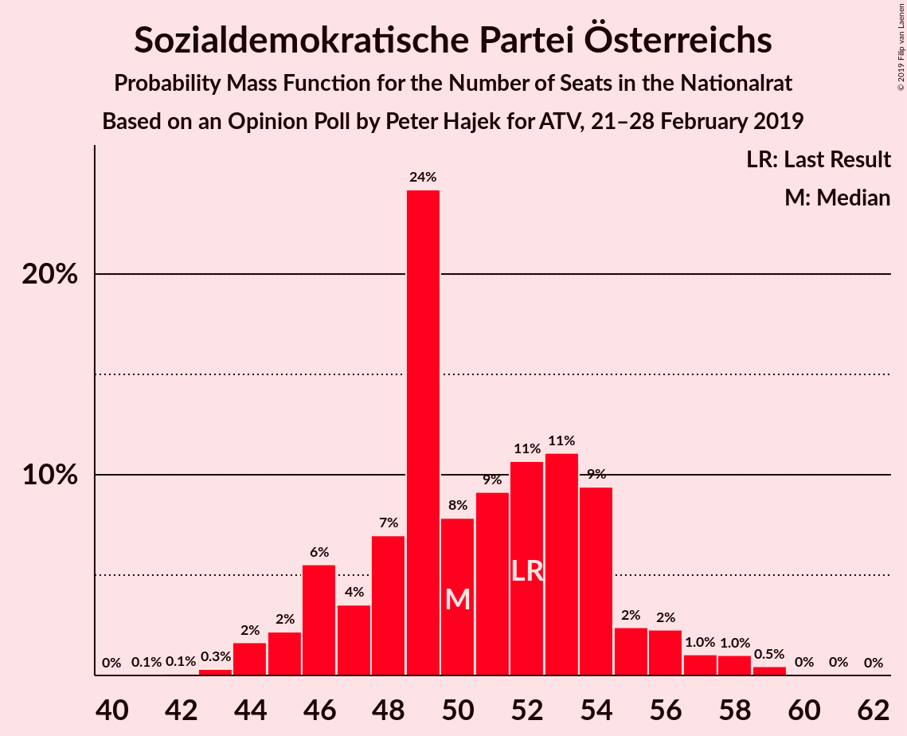

| Number of Seats | Probability | Accumulated | Special Marks |
|:---------------:|:-----------:|:-----------:|:-------------:|
| 41 | 0.1% | 100% |  |
| 42 | 0.1% | 99.9% |  |
| 43 | 0.3% | 99.8% |  |
| 44 | 2% | 99.5% |  |
| 45 | 2% | 98% |  |
| 46 | 6% | 96% |  |
| 47 | 4% | 90% |  |
| 48 | 7% | 87% |  |
| 49 | 24% | 80% |  |
| 50 | 8% | 55% | Median |
| 51 | 9% | 48% |  |
| 52 | 11% | 38% | Last Result |
| 53 | 11% | 28% |  |
| 54 | 9% | 17% |  |
| 55 | 2% | 7% |  |
| 56 | 2% | 5% |  |
| 57 | 1.0% | 3% |  |
| 58 | 1.0% | 2% |  |
| 59 | 0.5% | 0.6% |  |
| 60 | 0% | 0.1% |  |
| 61 | 0% | 0.1% |  |
| 62 | 0% | 0% |  |

### Freiheitliche Partei Österreichs

*For a full overview of the results for this party, see the [Freiheitliche Partei Österreichs](party-freiheitlicheparteiösterreichs.html) page.*

| Number of Seats | Probability | Accumulated | Special Marks |
|:---------------:|:-----------:|:-----------:|:-------------:|
| 34 | 0% | 100% |  |
| 35 | 0.3% | 99.9% |  |
| 36 | 0.3% | 99.6% |  |
| 37 | 2% | 99.4% |  |
| 38 | 1.4% | 97% |  |
| 39 | 7% | 95% |  |
| 40 | 6% | 88% |  |
| 41 | 12% | 83% |  |
| 42 | 11% | 70% |  |
| 43 | 19% | 59% | Median |
| 44 | 8% | 39% |  |
| 45 | 14% | 31% |  |
| 46 | 4% | 17% |  |
| 47 | 7% | 13% |  |
| 48 | 3% | 6% |  |
| 49 | 2% | 3% |  |
| 50 | 0.5% | 1.2% |  |
| 51 | 0.5% | 0.7% | Last Result |
| 52 | 0.1% | 0.2% |  |
| 53 | 0% | 0.1% |  |
| 54 | 0% | 0% |  |

### NEOS–Das Neue Österreich und Liberales Forum

*For a full overview of the results for this party, see the [NEOS–Das Neue Österreich und Liberales Forum](party-neos–dasneueösterreichundliberalesforum.html) page.*

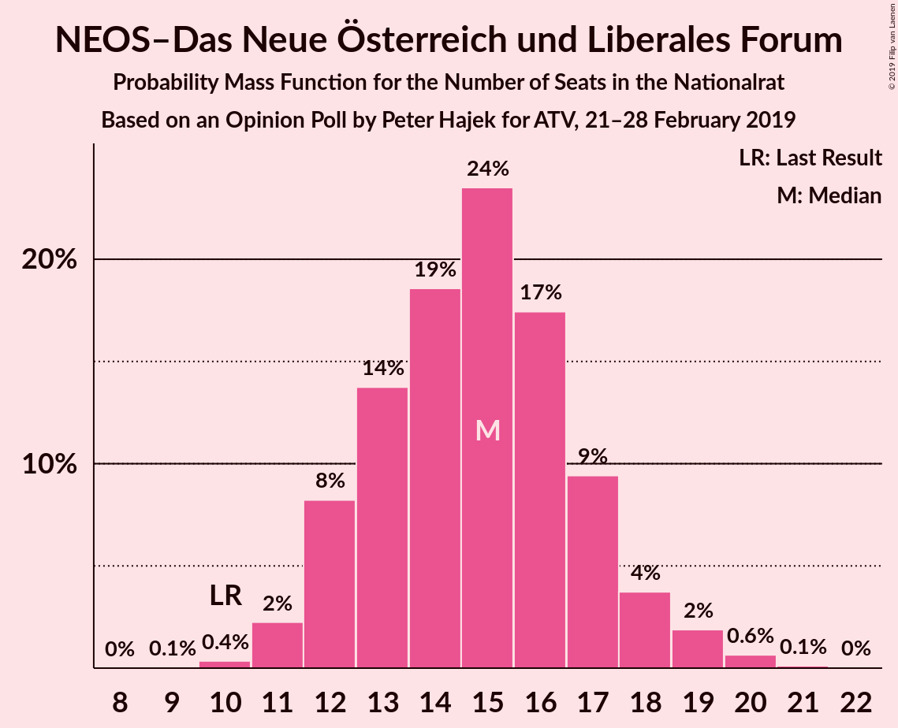

| Number of Seats | Probability | Accumulated | Special Marks |
|:---------------:|:-----------:|:-----------:|:-------------:|
| 9 | 0.1% | 100% |  |
| 10 | 0.4% | 99.9% | Last Result |
| 11 | 2% | 99.6% |  |
| 12 | 8% | 97% |  |
| 13 | 14% | 89% |  |
| 14 | 19% | 75% |  |
| 15 | 24% | 57% | Median |
| 16 | 17% | 33% |  |
| 17 | 9% | 16% |  |
| 18 | 4% | 6% |  |
| 19 | 2% | 3% |  |
| 20 | 0.6% | 0.8% |  |
| 21 | 0.1% | 0.2% |  |
| 22 | 0% | 0% |  |

### Die Grünen–Die Grüne Alternative

*For a full overview of the results for this party, see the [Die Grünen–Die Grüne Alternative](party-diegrünen–diegrünealternative.html) page.*

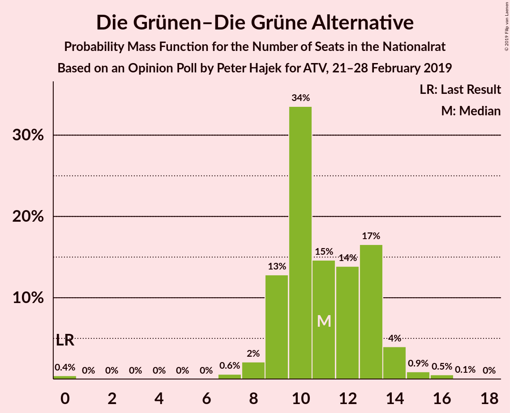

| Number of Seats | Probability | Accumulated | Special Marks |
|:---------------:|:-----------:|:-----------:|:-------------:|
| 0 | 0.4% | 100% | Last Result |
| 1 | 0% | 99.6% |  |
| 2 | 0% | 99.6% |  |
| 3 | 0% | 99.6% |  |
| 4 | 0% | 99.6% |  |
| 5 | 0% | 99.6% |  |
| 6 | 0% | 99.6% |  |
| 7 | 0.6% | 99.6% |  |
| 8 | 2% | 99.0% |  |
| 9 | 13% | 97% |  |
| 10 | 34% | 84% |  |
| 11 | 15% | 51% | Median |
| 12 | 14% | 36% |  |
| 13 | 17% | 22% |  |
| 14 | 4% | 5% |  |
| 15 | 0.9% | 2% |  |
| 16 | 0.5% | 0.6% |  |
| 17 | 0.1% | 0.1% |  |
| 18 | 0% | 0% |  |

### JETZT–Liste Pilz

*For a full overview of the results for this party, see the [JETZT–Liste Pilz](party-jetzt–listepilz.html) page.*

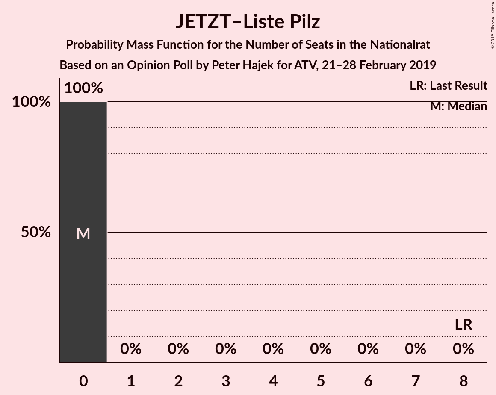

| Number of Seats | Probability | Accumulated | Special Marks |
|:---------------:|:-----------:|:-----------:|:-------------:|
| 0 | 100% | 100% | Median |
| 1 | 0% | 0% |  |
| 2 | 0% | 0% |  |
| 3 | 0% | 0% |  |
| 4 | 0% | 0% |  |
| 5 | 0% | 0% |  |
| 6 | 0% | 0% |  |
| 7 | 0% | 0% |  |
| 8 | 0% | 0% | Last Result |

## Coalitions

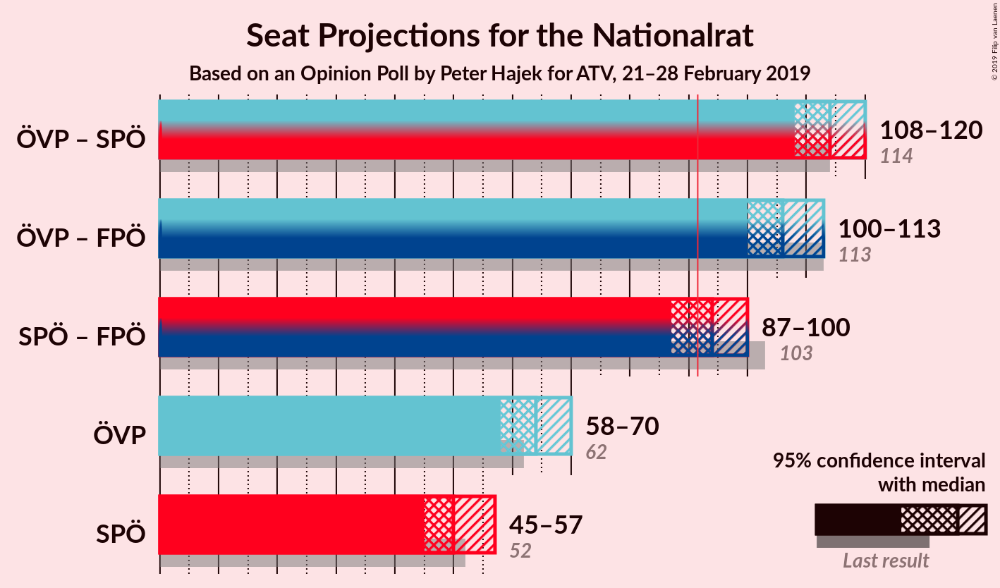

### Confidence Intervals

| Coalition | Last Result | Median | Majority? | 80% Confidence Interval | 90% Confidence Interval | 95% Confidence Interval | 99% Confidence Interval |
|:---------:|:-----------:|:------:|:---------:|:-----------------------:|:-----------------------:|:-----------------------:|:-----------------------:|
| Österreichische Volkspartei – Sozialdemokratische Partei Österreichs | 114 | 114 | 100% | 110–119 | 109–119 | 108–120 | 106–123 |
| Österreichische Volkspartei – Freiheitliche Partei Österreichs | 113 | 106 | 100% | 103–111 | 101–112 | 100–113 | 99–115 |
| Sozialdemokratische Partei Österreichs – Freiheitliche Partei Österreichs | 103 | 94 | 72% | 89–98 | 88–99 | 87–100 | 85–102 |
| Österreichische Volkspartei | 62 | 64 | 0% | 60–68 | 58–69 | 58–70 | 56–72 |
| Sozialdemokratische Partei Österreichs | 52 | 50 | 0% | 47–54 | 46–55 | 45–57 | 44–59 |

### Österreichische Volkspartei – Sozialdemokratische Partei Österreichs

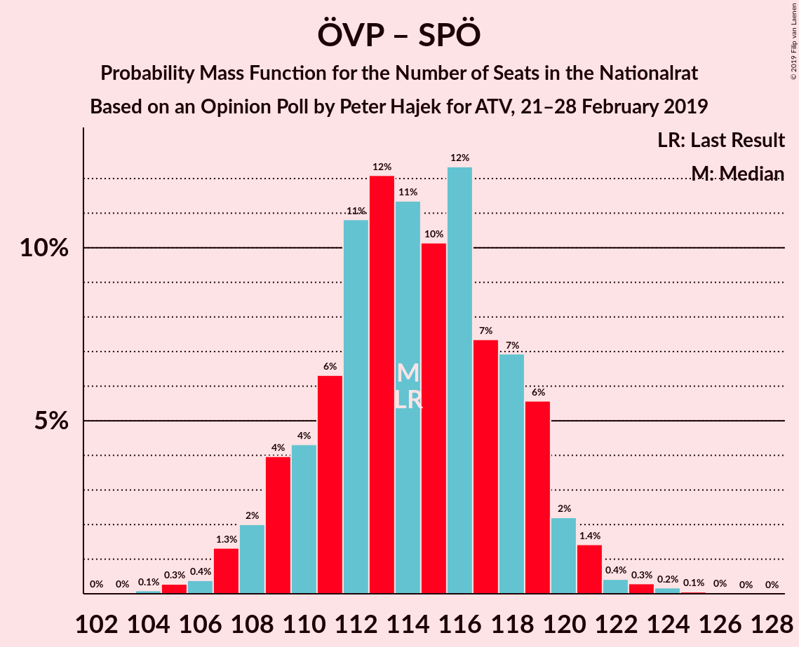

| Number of Seats | Probability | Accumulated | Special Marks |
|:---------------:|:-----------:|:-----------:|:-------------:|
| 104 | 0.1% | 100% |  |
| 105 | 0.3% | 99.9% |  |
| 106 | 0.4% | 99.6% |  |
| 107 | 1.3% | 99.2% |  |
| 108 | 2% | 98% |  |
| 109 | 4% | 96% |  |
| 110 | 4% | 92% |  |
| 111 | 6% | 88% |  |
| 112 | 11% | 81% |  |
| 113 | 12% | 70% |  |
| 114 | 11% | 58% | Last Result, Median |
| 115 | 10% | 47% |  |
| 116 | 12% | 37% |  |
| 117 | 7% | 24% |  |
| 118 | 7% | 17% |  |
| 119 | 6% | 10% |  |
| 120 | 2% | 5% |  |
| 121 | 1.4% | 2% |  |
| 122 | 0.4% | 1.0% |  |
| 123 | 0.3% | 0.6% |  |
| 124 | 0.2% | 0.3% |  |
| 125 | 0.1% | 0.1% |  |
| 126 | 0% | 0.1% |  |
| 127 | 0% | 0% |  |

### Österreichische Volkspartei – Freiheitliche Partei Österreichs

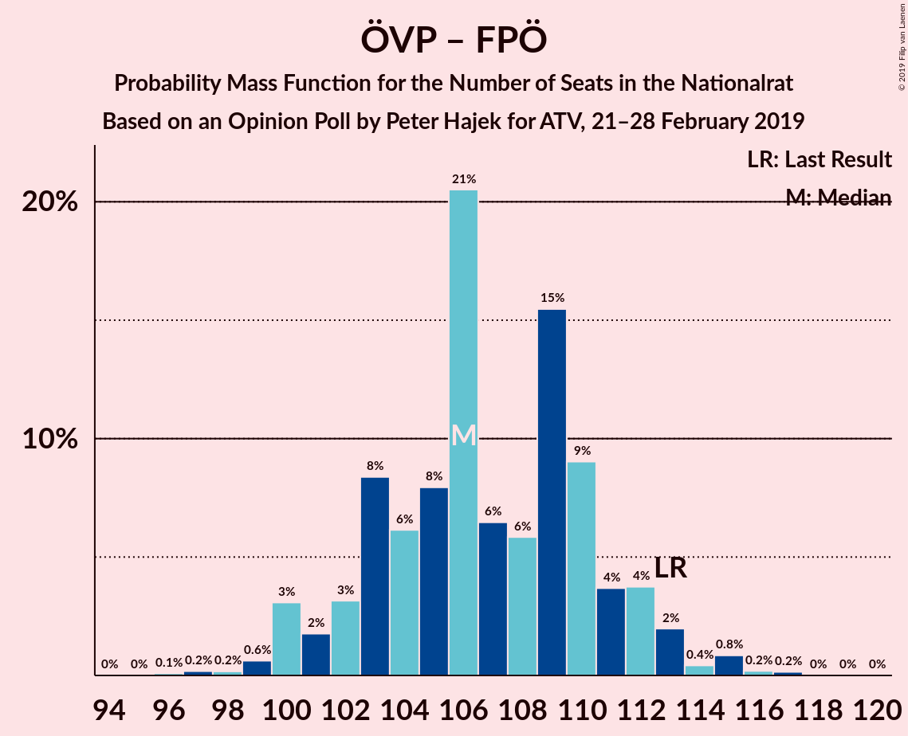

| Number of Seats | Probability | Accumulated | Special Marks |
|:---------------:|:-----------:|:-----------:|:-------------:|
| 96 | 0.1% | 100% |  |
| 97 | 0.2% | 99.9% |  |
| 98 | 0.2% | 99.7% |  |
| 99 | 0.6% | 99.5% |  |
| 100 | 3% | 98.9% |  |
| 101 | 2% | 96% |  |
| 102 | 3% | 94% |  |
| 103 | 8% | 91% |  |
| 104 | 6% | 83% |  |
| 105 | 8% | 76% |  |
| 106 | 21% | 68% |  |
| 107 | 6% | 48% | Median |
| 108 | 6% | 41% |  |
| 109 | 15% | 36% |  |
| 110 | 9% | 20% |  |
| 111 | 4% | 11% |  |
| 112 | 4% | 7% |  |
| 113 | 2% | 4% | Last Result |
| 114 | 0.4% | 2% |  |
| 115 | 0.8% | 1.3% |  |
| 116 | 0.2% | 0.4% |  |
| 117 | 0.2% | 0.2% |  |
| 118 | 0% | 0.1% |  |
| 119 | 0% | 0% |  |

### Sozialdemokratische Partei Österreichs – Freiheitliche Partei Österreichs

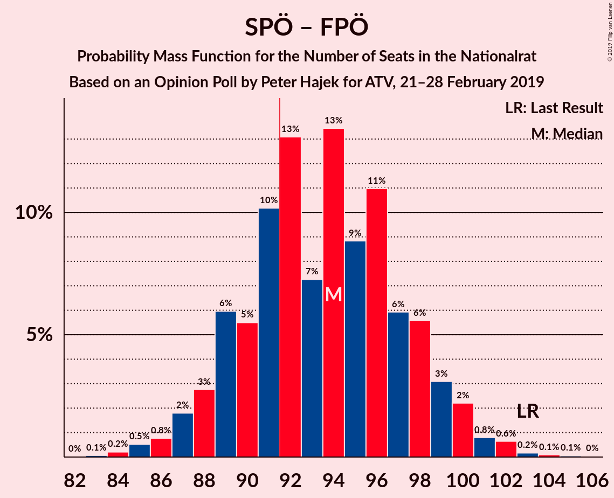

| Number of Seats | Probability | Accumulated | Special Marks |
|:---------------:|:-----------:|:-----------:|:-------------:|
| 83 | 0.1% | 100% |  |
| 84 | 0.2% | 99.9% |  |
| 85 | 0.5% | 99.7% |  |
| 86 | 0.8% | 99.2% |  |
| 87 | 2% | 98% |  |
| 88 | 3% | 97% |  |
| 89 | 6% | 94% |  |
| 90 | 5% | 88% |  |
| 91 | 10% | 82% |  |
| 92 | 13% | 72% | Majority |
| 93 | 7% | 59% | Median |
| 94 | 13% | 52% |  |
| 95 | 9% | 38% |  |
| 96 | 11% | 30% |  |
| 97 | 6% | 19% |  |
| 98 | 6% | 13% |  |
| 99 | 3% | 7% |  |
| 100 | 2% | 4% |  |
| 101 | 0.8% | 2% |  |
| 102 | 0.6% | 1.0% |  |
| 103 | 0.2% | 0.4% | Last Result |
| 104 | 0.1% | 0.2% |  |
| 105 | 0.1% | 0.1% |  |
| 106 | 0% | 0% |  |

### Österreichische Volkspartei

| Number of Seats | Probability | Accumulated | Special Marks |
|:---------------:|:-----------:|:-----------:|:-------------:|
| 54 | 0.1% | 100% |  |
| 55 | 0.2% | 99.9% |  |
| 56 | 0.7% | 99.6% |  |
| 57 | 1.4% | 99.0% |  |
| 58 | 3% | 98% |  |
| 59 | 4% | 95% |  |
| 60 | 5% | 90% |  |
| 61 | 7% | 85% |  |
| 62 | 15% | 78% | Last Result |
| 63 | 13% | 63% |  |
| 64 | 9% | 50% | Median |
| 65 | 12% | 41% |  |
| 66 | 6% | 29% |  |
| 67 | 10% | 22% |  |
| 68 | 5% | 12% |  |
| 69 | 4% | 7% |  |
| 70 | 1.3% | 3% |  |
| 71 | 1.0% | 2% |  |
| 72 | 0.4% | 0.7% |  |
| 73 | 0.1% | 0.3% |  |
| 74 | 0.1% | 0.1% |  |
| 75 | 0% | 0.1% |  |
| 76 | 0% | 0% |  |

### Sozialdemokratische Partei Österreichs

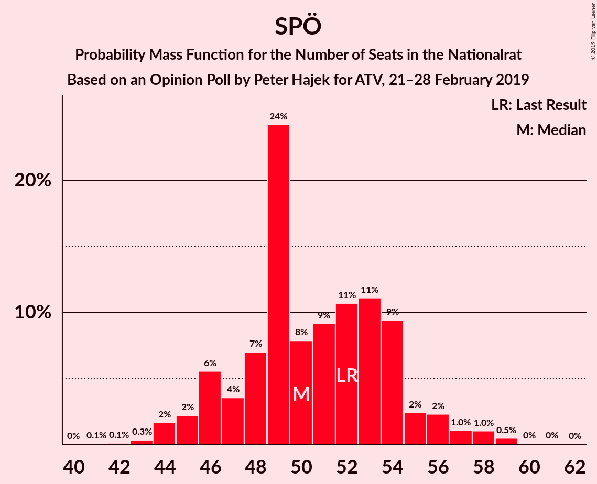

| Number of Seats | Probability | Accumulated | Special Marks |
|:---------------:|:-----------:|:-----------:|:-------------:|
| 41 | 0.1% | 100% |  |
| 42 | 0.1% | 99.9% |  |
| 43 | 0.3% | 99.8% |  |
| 44 | 2% | 99.5% |  |
| 45 | 2% | 98% |  |
| 46 | 6% | 96% |  |
| 47 | 4% | 90% |  |
| 48 | 7% | 87% |  |
| 49 | 24% | 80% |  |
| 50 | 8% | 55% | Median |
| 51 | 9% | 48% |  |
| 52 | 11% | 38% | Last Result |
| 53 | 11% | 28% |  |
| 54 | 9% | 17% |  |
| 55 | 2% | 7% |  |
| 56 | 2% | 5% |  |
| 57 | 1.0% | 3% |  |
| 58 | 1.0% | 2% |  |
| 59 | 0.5% | 0.6% |  |
| 60 | 0% | 0.1% |  |
| 61 | 0% | 0.1% |  |
| 62 | 0% | 0% |  |

## Technical Information

### Opinion Poll

+ **Polling firm:** Peter Hajek
+ **Commissioner(s):** ATV
+ **Fieldwork period:** 21–28 February 2019

### Calculations

+ **Sample size:** 800
+ **Simulations done:** 131,072
+ **Error estimate:** 1.84%

