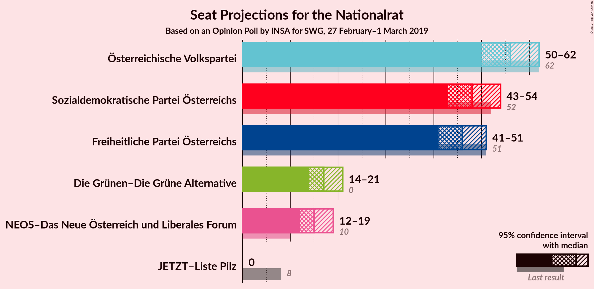

# Opinion Poll by INSA for SWG, 27 February–1 March 2019

<a href="#voting-intentions">Voting Intentions</a> | <a href="#seats">Seats</a> | <a href="#coalitions">Coalitions</a> | <a href="#technical-information">Technical Information</a>

## Voting Intentions

### Confidence Intervals

| Party | Last Result | Poll Result | 80% Confidence Interval | 90% Confidence Interval | 95% Confidence Interval | 99% Confidence Interval |
|:-----:|:-----------:|:-----------:|:-----------------------:|:-----------------------:|:-----------------------:|:-----------------------:|
| Österreichische Volkspartei | 31.5% | 29.0% | 27.2–30.9% |26.7–31.4% |26.3–31.9% |25.4–32.8% |
| Sozialdemokratische Partei Österreichs | 26.9% | 25.0% | 23.3–26.8% |22.8–27.3% |22.4–27.8% |21.6–28.7% |
| Freiheitliche Partei Österreichs | 26.0% | 24.0% | 22.3–25.8% |21.9–26.3% |21.4–26.7% |20.7–27.6% |
| Die Grünen–Die Grüne Alternative | 3.8% | 9.0% | 7.9–10.3% |7.6–10.6% |7.4–10.9% |6.9–11.6% |
| NEOS–Das Neue Österreich und Liberales Forum | 5.3% | 8.0% | 7.0–9.2% |6.7–9.6% |6.5–9.9% |6.0–10.5% |
| JETZT–Liste Pilz | 4.4% | 2.0% | 1.5–2.7% |1.4–2.9% |1.3–3.1% |1.1–3.4% |

*Note:* The poll result column reflects the actual value used in the calculations. Published results may vary slightly, and in addition be rounded to fewer digits.

## Seats

### Confidence Intervals

| Party | Last Result | Median | 80% Confidence Interval | 90% Confidence Interval | 95% Confidence Interval | 99% Confidence Interval |
|:-----:|:-----------:|:------:|:-----------------------:|:-----------------------:|:-----------------------:|:-----------------------:|
| <a href="#österreichische-volkspartei">Österreichische Volkspartei</a> | 62 | 56 | 52–60 |51–61 |50–62 |49–63 |
| <a href="#sozialdemokratische-partei-österreichs">Sozialdemokratische Partei Österreichs</a> | 52 | 48 | 45–52 |44–53 |43–54 |41–55 |
| <a href="#freiheitliche-partei-österreichs">Freiheitliche Partei Österreichs</a> | 51 | 46 | 43–50 |42–51 |41–51 |40–53 |
| <a href="#die-grünen–die-grüne-alternative">Die Grünen–Die Grüne Alternative</a> | 0 | 17 | 15–19 |14–20 |14–21 |13–22 |
| <a href="#neos–das-neue-österreich-und-liberales-forum">NEOS–Das Neue Österreich und Liberales Forum</a> | 10 | 15 | 13–17 |13–18 |12–19 |11–20 |
| <a href="#jetzt–liste-pilz">JETZT–Liste Pilz</a> | 8 | 0 | 0 |0 |0 |0 |

### Österreichische Volkspartei

*For a full overview of the results for this party, see the [Österreichische Volkspartei](party-österreichischevolkspartei.html) page.*

| Number of Seats | Probability | Accumulated | Special Marks |
|:---------------:|:-----------:|:-----------:|:-------------:|
| 47 | 0.1% | 100% |  |
| 48 | 0.3% | 99.9% |  |
| 49 | 0.6% | 99.6% |  |
| 50 | 2% | 99.0% |  |
| 51 | 3% | 97% |  |
| 52 | 5% | 94% |  |
| 53 | 7% | 90% |  |
| 54 | 13% | 82% |  |
| 55 | 17% | 69% |  |
| 56 | 13% | 52% | Median |
| 57 | 12% | 40% |  |
| 58 | 10% | 28% |  |
| 59 | 8% | 18% |  |
| 60 | 4% | 10% |  |
| 61 | 3% | 6% |  |
| 62 | 2% | 3% | Last Result |
| 63 | 0.5% | 0.9% |  |
| 64 | 0.2% | 0.3% |  |
| 65 | 0.1% | 0.1% |  |
| 66 | 0% | 0% |  |

### Sozialdemokratische Partei Österreichs

*For a full overview of the results for this party, see the [Sozialdemokratische Partei Österreichs](party-sozialdemokratischeparteiösterreichs.html) page.*

| Number of Seats | Probability | Accumulated | Special Marks |
|:---------------:|:-----------:|:-----------:|:-------------:|
| 40 | 0.1% | 100% |  |
| 41 | 0.4% | 99.8% |  |
| 42 | 1.0% | 99.4% |  |
| 43 | 2% | 98% |  |
| 44 | 5% | 96% |  |
| 45 | 8% | 92% |  |
| 46 | 10% | 84% |  |
| 47 | 13% | 73% |  |
| 48 | 16% | 60% | Median |
| 49 | 14% | 44% |  |
| 50 | 11% | 30% |  |
| 51 | 9% | 19% |  |
| 52 | 5% | 11% | Last Result |
| 53 | 3% | 5% |  |
| 54 | 1.5% | 3% |  |
| 55 | 0.7% | 1.0% |  |
| 56 | 0.2% | 0.3% |  |
| 57 | 0.1% | 0.1% |  |
| 58 | 0% | 0% |  |

### Freiheitliche Partei Österreichs

*For a full overview of the results for this party, see the [Freiheitliche Partei Österreichs](party-freiheitlicheparteiösterreichs.html) page.*

| Number of Seats | Probability | Accumulated | Special Marks |
|:---------------:|:-----------:|:-----------:|:-------------:|
| 38 | 0.1% | 100% |  |
| 39 | 0.3% | 99.9% |  |
| 40 | 0.9% | 99.5% |  |
| 41 | 2% | 98.6% |  |
| 42 | 4% | 96% |  |
| 43 | 8% | 92% |  |
| 44 | 11% | 85% |  |
| 45 | 13% | 73% |  |
| 46 | 15% | 60% | Median |
| 47 | 15% | 45% |  |
| 48 | 11% | 30% |  |
| 49 | 8% | 19% |  |
| 50 | 5% | 11% |  |
| 51 | 3% | 5% | Last Result |
| 52 | 1.5% | 2% |  |
| 53 | 0.6% | 0.9% |  |
| 54 | 0.3% | 0.4% |  |
| 55 | 0.1% | 0.1% |  |
| 56 | 0% | 0% |  |

### Die Grünen–Die Grüne Alternative

*For a full overview of the results for this party, see the [Die Grünen–Die Grüne Alternative](party-diegrünen–diegrünealternative.html) page.*

| Number of Seats | Probability | Accumulated | Special Marks |
|:---------------:|:-----------:|:-----------:|:-------------:|
| 0 | 0% | 100% | Last Result |
| 1 | 0% | 100% |  |
| 2 | 0% | 100% |  |
| 3 | 0% | 100% |  |
| 4 | 0% | 100% |  |
| 5 | 0% | 100% |  |
| 6 | 0% | 100% |  |
| 7 | 0% | 100% |  |
| 8 | 0% | 100% |  |
| 9 | 0% | 100% |  |
| 10 | 0% | 100% |  |
| 11 | 0% | 100% |  |
| 12 | 0.2% | 100% |  |
| 13 | 1.3% | 99.8% |  |
| 14 | 5% | 98.5% |  |
| 15 | 11% | 94% |  |
| 16 | 19% | 82% |  |
| 17 | 22% | 63% | Median |
| 18 | 19% | 41% |  |
| 19 | 12% | 22% |  |
| 20 | 6% | 9% |  |
| 21 | 2% | 3% |  |
| 22 | 0.7% | 1.0% |  |
| 23 | 0.2% | 0.2% |  |
| 24 | 0% | 0% |  |

### NEOS–Das Neue Österreich und Liberales Forum

*For a full overview of the results for this party, see the [NEOS–Das Neue Österreich und Liberales Forum](party-neos–dasneueösterreichundliberalesforum.html) page.*

| Number of Seats | Probability | Accumulated | Special Marks |
|:---------------:|:-----------:|:-----------:|:-------------:|
| 10 | 0.1% | 100% | Last Result |
| 11 | 0.8% | 99.9% |  |
| 12 | 4% | 99.1% |  |
| 13 | 11% | 95% |  |
| 14 | 19% | 84% |  |
| 15 | 22% | 66% | Median |
| 16 | 22% | 44% |  |
| 17 | 13% | 21% |  |
| 18 | 6% | 8% |  |
| 19 | 2% | 3% |  |
| 20 | 0.6% | 0.8% |  |
| 21 | 0.2% | 0.2% |  |
| 22 | 0% | 0% |  |

### JETZT–Liste Pilz

*For a full overview of the results for this party, see the [JETZT–Liste Pilz](party-jetzt–listepilz.html) page.*

| Number of Seats | Probability | Accumulated | Special Marks |
|:---------------:|:-----------:|:-----------:|:-------------:|
| 0 | 100% | 100% | Median |
| 1 | 0% | 0% |  |
| 2 | 0% | 0% |  |
| 3 | 0% | 0% |  |
| 4 | 0% | 0% |  |
| 5 | 0% | 0% |  |
| 6 | 0% | 0% |  |
| 7 | 0% | 0% |  |
| 8 | 0% | 0% | Last Result |

## Coalitions

### Confidence Intervals

| Coalition | Last Result | Median | Majority? | 80% Confidence Interval | 90% Confidence Interval | 95% Confidence Interval | 99% Confidence Interval |
|:---------:|:-----------:|:------:|:---------:|:-----------------------:|:-----------------------:|:-----------------------:|:-----------------------:|
| Österreichische Volkspartei – Sozialdemokratische Partei Österreichs | 114 | 104 | 100% | 100–108 | 99–109 | 98–110 | 96–112 |
| Österreichische Volkspartei – Freiheitliche Partei Österreichs | 113 | 102 | 99.9% | 98–106 | 97–107 | 96–108 | 94–110 |
| Sozialdemokratische Partei Österreichs – Freiheitliche Partei Österreichs | 103 | 94 | 82% | 90–98 | 89–99 | 88–100 | 86–102 |
| Österreichische Volkspartei | 62 | 56 | 0% | 52–60 | 51–61 | 50–62 | 49–63 |
| Sozialdemokratische Partei Österreichs | 52 | 48 | 0% | 45–52 | 44–53 | 43–54 | 41–55 |

### Österreichische Volkspartei – Sozialdemokratische Partei Österreichs

| Number of Seats | Probability | Accumulated | Special Marks |
|:---------------:|:-----------:|:-----------:|:-------------:|
| 93 | 0% | 100% |  |
| 94 | 0.1% | 99.9% |  |
| 95 | 0.3% | 99.8% |  |
| 96 | 0.6% | 99.5% |  |
| 97 | 1.1% | 98.9% |  |
| 98 | 2% | 98% |  |
| 99 | 3% | 96% |  |
| 100 | 5% | 93% |  |
| 101 | 8% | 87% |  |
| 102 | 10% | 80% |  |
| 103 | 12% | 70% |  |
| 104 | 13% | 58% | Median |
| 105 | 12% | 45% |  |
| 106 | 11% | 32% |  |
| 107 | 8% | 22% |  |
| 108 | 6% | 13% |  |
| 109 | 4% | 7% |  |
| 110 | 2% | 4% |  |
| 111 | 1.0% | 2% |  |
| 112 | 0.4% | 0.7% |  |
| 113 | 0.2% | 0.3% |  |
| 114 | 0.1% | 0.1% | Last Result |
| 115 | 0% | 0% |  |

### Österreichische Volkspartei – Freiheitliche Partei Österreichs

| Number of Seats | Probability | Accumulated | Special Marks |
|:---------------:|:-----------:|:-----------:|:-------------:|
| 91 | 0% | 100% |  |
| 92 | 0.1% | 99.9% | Majority |
| 93 | 0.2% | 99.8% |  |
| 94 | 0.5% | 99.6% |  |
| 95 | 1.1% | 99.1% |  |
| 96 | 2% | 98% |  |
| 97 | 3% | 96% |  |
| 98 | 5% | 93% |  |
| 99 | 7% | 88% |  |
| 100 | 10% | 81% |  |
| 101 | 14% | 71% |  |
| 102 | 13% | 57% | Median |
| 103 | 12% | 44% |  |
| 104 | 10% | 32% |  |
| 105 | 8% | 22% |  |
| 106 | 6% | 14% |  |
| 107 | 4% | 8% |  |
| 108 | 2% | 4% |  |
| 109 | 1.1% | 2% |  |
| 110 | 0.5% | 0.8% |  |
| 111 | 0.2% | 0.3% |  |
| 112 | 0.1% | 0.1% |  |
| 113 | 0% | 0% | Last Result |

### Sozialdemokratische Partei Österreichs – Freiheitliche Partei Österreichs

| Number of Seats | Probability | Accumulated | Special Marks |
|:---------------:|:-----------:|:-----------:|:-------------:|
| 83 | 0% | 100% |  |
| 84 | 0.1% | 99.9% |  |
| 85 | 0.2% | 99.9% |  |
| 86 | 0.4% | 99.7% |  |
| 87 | 0.8% | 99.2% |  |
| 88 | 2% | 98% |  |
| 89 | 3% | 97% |  |
| 90 | 5% | 94% |  |
| 91 | 7% | 89% |  |
| 92 | 9% | 82% | Majority |
| 93 | 12% | 73% |  |
| 94 | 12% | 61% | Median |
| 95 | 14% | 49% |  |
| 96 | 11% | 35% |  |
| 97 | 8% | 24% |  |
| 98 | 7% | 16% |  |
| 99 | 4% | 9% |  |
| 100 | 3% | 5% |  |
| 101 | 1.3% | 2% |  |
| 102 | 0.6% | 1.0% |  |
| 103 | 0.3% | 0.4% | Last Result |
| 104 | 0.1% | 0.1% |  |
| 105 | 0% | 0% |  |

### Österreichische Volkspartei

| Number of Seats | Probability | Accumulated | Special Marks |
|:---------------:|:-----------:|:-----------:|:-------------:|
| 47 | 0.1% | 100% |  |
| 48 | 0.3% | 99.9% |  |
| 49 | 0.6% | 99.6% |  |
| 50 | 2% | 99.0% |  |
| 51 | 3% | 97% |  |
| 52 | 5% | 94% |  |
| 53 | 7% | 90% |  |
| 54 | 13% | 82% |  |
| 55 | 17% | 69% |  |
| 56 | 13% | 52% | Median |
| 57 | 12% | 40% |  |
| 58 | 10% | 28% |  |
| 59 | 8% | 18% |  |
| 60 | 4% | 10% |  |
| 61 | 3% | 6% |  |
| 62 | 2% | 3% | Last Result |
| 63 | 0.5% | 0.9% |  |
| 64 | 0.2% | 0.3% |  |
| 65 | 0.1% | 0.1% |  |
| 66 | 0% | 0% |  |

### Sozialdemokratische Partei Österreichs

| Number of Seats | Probability | Accumulated | Special Marks |
|:---------------:|:-----------:|:-----------:|:-------------:|
| 40 | 0.1% | 100% |  |
| 41 | 0.4% | 99.8% |  |
| 42 | 1.0% | 99.4% |  |
| 43 | 2% | 98% |  |
| 44 | 5% | 96% |  |
| 45 | 8% | 92% |  |
| 46 | 10% | 84% |  |
| 47 | 13% | 73% |  |
| 48 | 16% | 60% | Median |
| 49 | 14% | 44% |  |
| 50 | 11% | 30% |  |
| 51 | 9% | 19% |  |
| 52 | 5% | 11% | Last Result |
| 53 | 3% | 5% |  |
| 54 | 1.5% | 3% |  |
| 55 | 0.7% | 1.0% |  |
| 56 | 0.2% | 0.3% |  |
| 57 | 0.1% | 0.1% |  |
| 58 | 0% | 0% |  |

## Technical Information

### Opinion Poll

+ **Polling firm:** INSA
+ **Commissioner(s):** SWG
+ **Fieldwork period:** 27 February–1 March 2019

### Calculations

+ **Sample size:** 1000
+ **Simulations done:** 1,048,576
+ **Error estimate:** 0.96%

