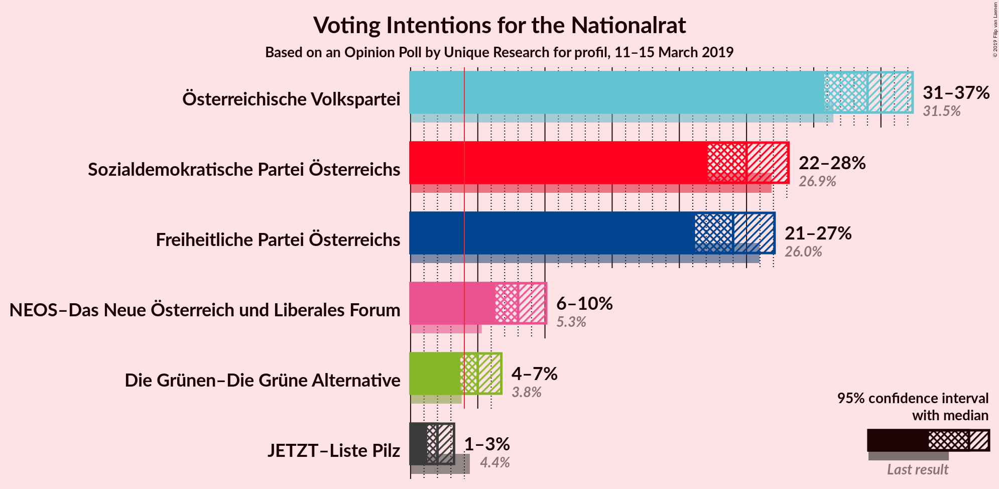
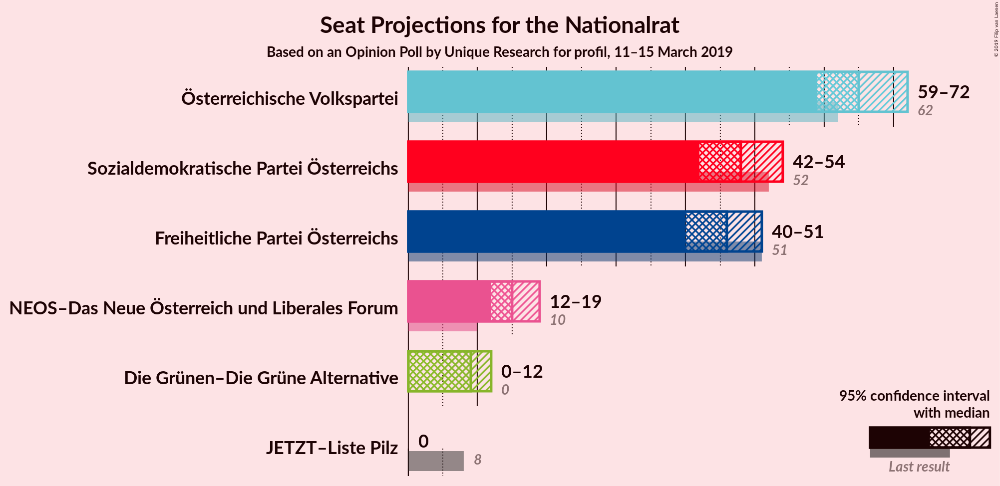
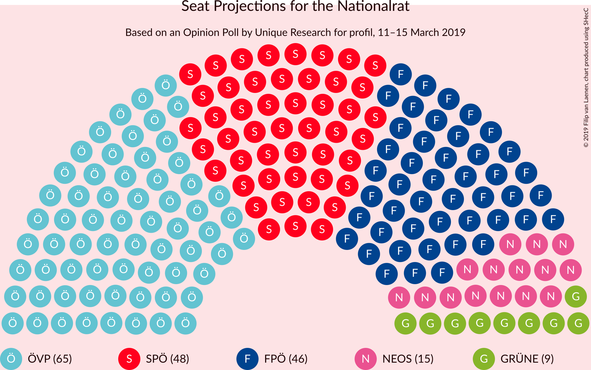
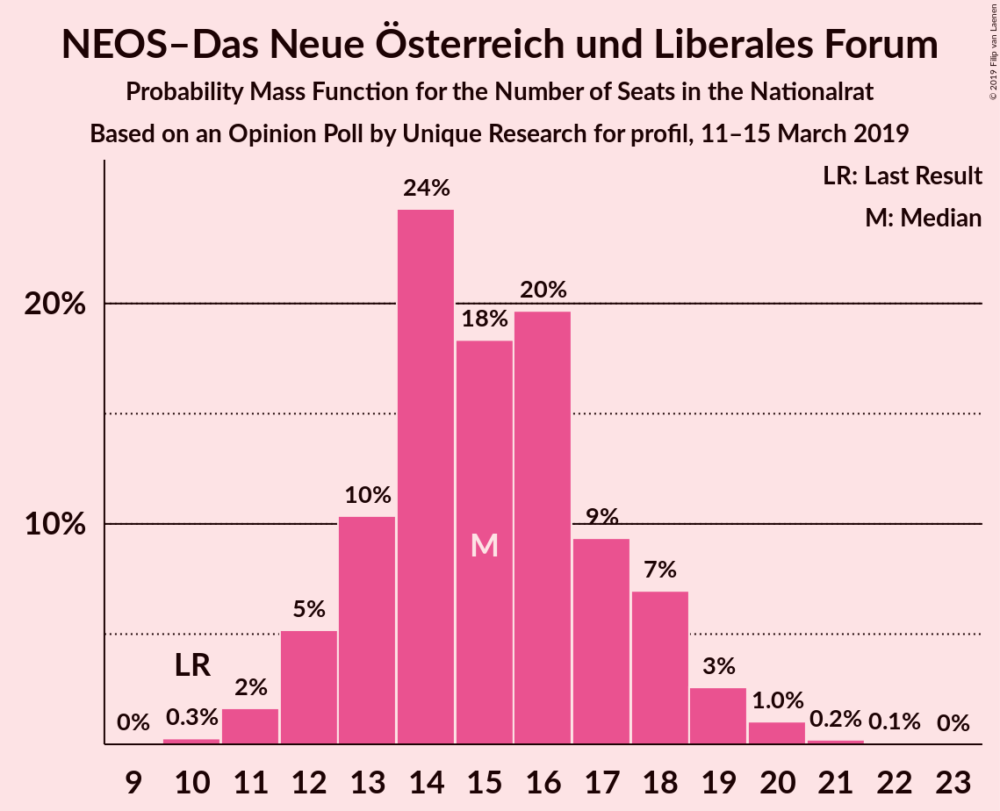
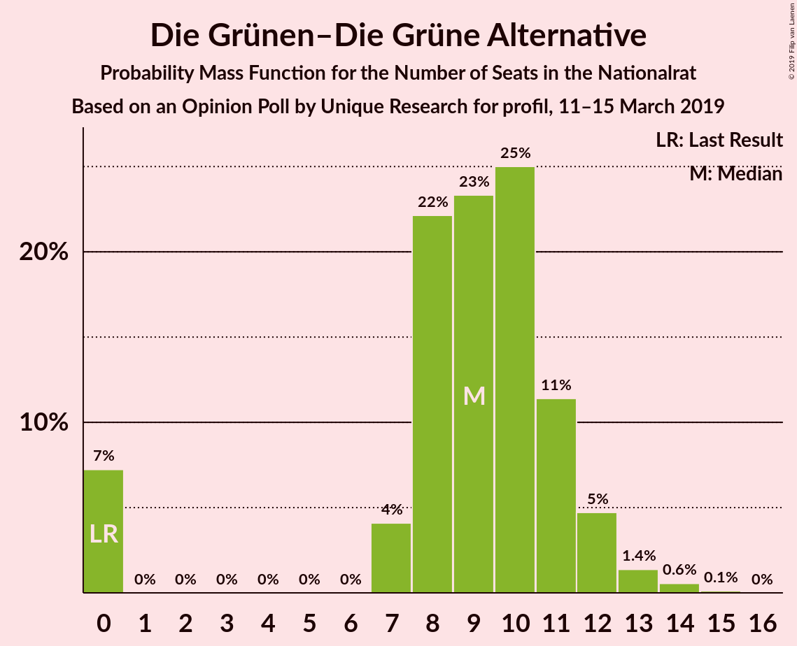
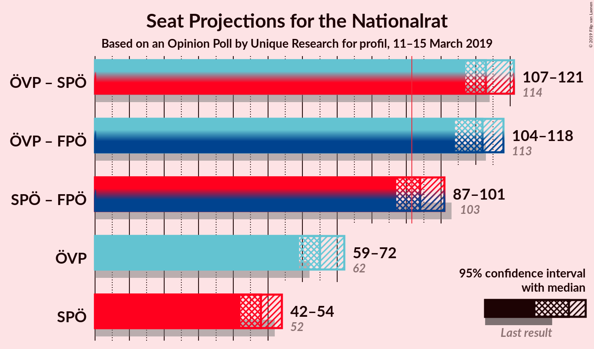
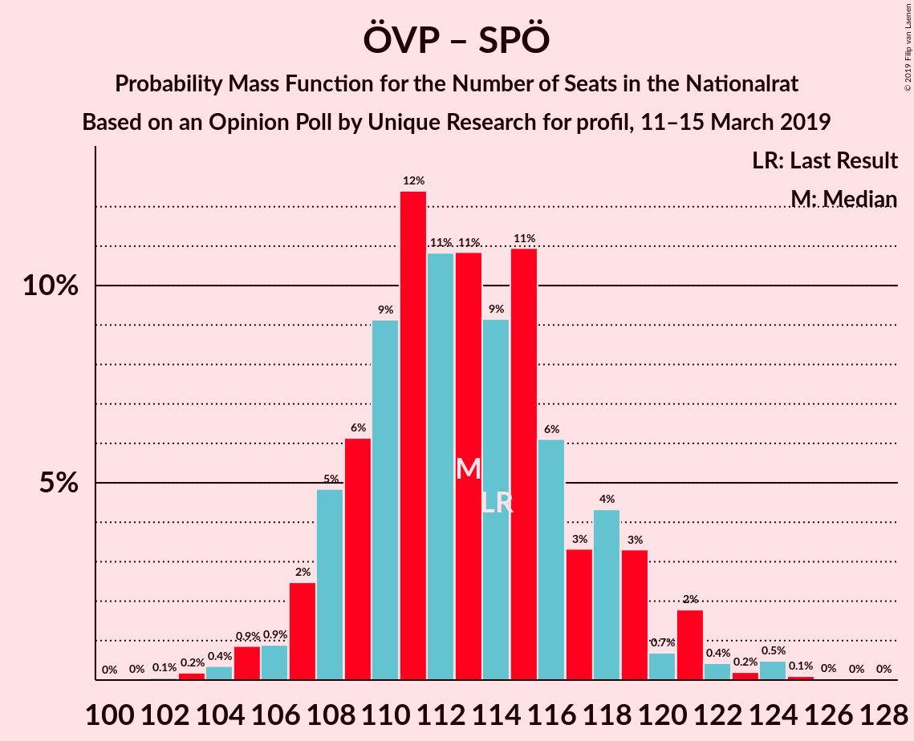
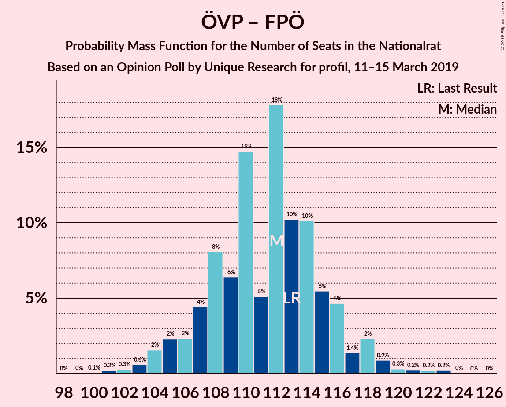
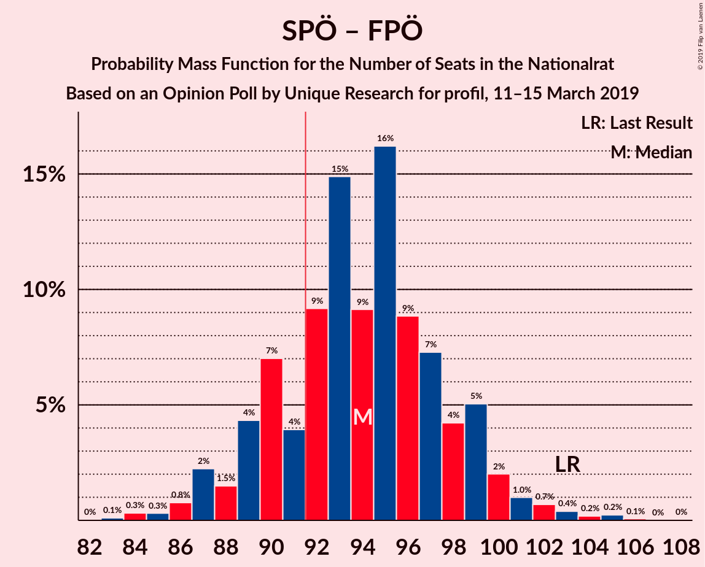

# Opinion Poll by Unique Research for profil, 11–15 March 2019

<a href="#voting-intentions">Voting Intentions</a> | <a href="#seats">Seats</a> | <a href="#coalitions">Coalitions</a> | <a href="#technical-information">Technical Information</a>

## Voting Intentions

### Confidence Intervals

| Party | Last Result | Poll Result | 80% Confidence Interval | 90% Confidence Interval | 95% Confidence Interval | 99% Confidence Interval |
|:-----:|:-----------:|:-----------:|:-----------------------:|:-----------------------:|:-----------------------:|:-----------------------:|
| Österreichische Volkspartei | 31.5% | 34.0% | 31.9–36.2% |31.3–36.8% |30.8–37.4% |29.8–38.4% |
| Sozialdemokratische Partei Österreichs | 26.9% | 25.0% | 23.1–27.0% |22.6–27.6% |22.1–28.1% |21.2–29.1% |
| Freiheitliche Partei Österreichs | 26.0% | 24.0% | 22.1–26.0% |21.6–26.6% |21.2–27.1% |20.3–28.1% |
| NEOS–Das Neue Österreich und Liberales Forum | 5.3% | 8.0% | 6.9–9.4% |6.6–9.8% |6.3–10.1% |5.8–10.8% |
| Die Grünen–Die Grüne Alternative | 3.8% | 5.0% | 4.1–6.1% |3.9–6.5% |3.7–6.8% |3.3–7.3% |
| JETZT–Liste Pilz | 4.4% | 2.0% | 1.5–2.8% |1.4–3.0% |1.2–3.2% |1.0–3.7% |

*Note:* The poll result column reflects the actual value used in the calculations. Published results may vary slightly, and in addition be rounded to fewer digits.

## Seats

### Confidence Intervals

| Party | Last Result | Median | 80% Confidence Interval | 90% Confidence Interval | 95% Confidence Interval | 99% Confidence Interval |
|:-----:|:-----------:|:------:|:-----------------------:|:-----------------------:|:-----------------------:|:-----------------------:|
| <a href="#österreichische-volkspartei">Österreichische Volkspartei</a> | 62 | 65 | 61–69 |60–71 |59–72 |57–74 |
| <a href="#sozialdemokratische-partei-österreichs">Sozialdemokratische Partei Österreichs</a> | 52 | 48 | 44–52 |43–53 |42–54 |40–56 |
| <a href="#freiheitliche-partei-österreichs">Freiheitliche Partei Österreichs</a> | 51 | 46 | 42–49 |41–50 |40–51 |38–55 |
| <a href="#neos–das-neue-österreich-und-liberales-forum">NEOS–Das Neue Österreich und Liberales Forum</a> | 10 | 15 | 13–18 |12–18 |12–19 |11–20 |
| <a href="#die-grünen–die-grüne-alternative">Die Grünen–Die Grüne Alternative</a> | 0 | 9 | 7–11 |0–12 |0–12 |0–14 |
| <a href="#jetzt–liste-pilz">JETZT–Liste Pilz</a> | 8 | 0 | 0 |0 |0 |0 |

### Österreichische Volkspartei

*For a full overview of the results for this party, see the [Österreichische Volkspartei](party-österreichischevolkspartei.html) page.*

| Number of Seats | Probability | Accumulated | Special Marks |
|:---------------:|:-----------:|:-----------:|:-------------:|
| 55 | 0.1% | 100% |  |
| 56 | 0.3% | 99.9% |  |
| 57 | 0.5% | 99.6% |  |
| 58 | 1.1% | 99.1% |  |
| 59 | 3% | 98% |  |
| 60 | 2% | 95% |  |
| 61 | 5% | 93% |  |
| 62 | 10% | 88% | Last Result |
| 63 | 8% | 78% |  |
| 64 | 13% | 70% |  |
| 65 | 11% | 58% | Median |
| 66 | 16% | 47% |  |
| 67 | 8% | 31% |  |
| 68 | 8% | 23% |  |
| 69 | 7% | 15% |  |
| 70 | 2% | 8% |  |
| 71 | 4% | 6% |  |
| 72 | 2% | 3% |  |
| 73 | 0.4% | 1.1% |  |
| 74 | 0.3% | 0.7% |  |
| 75 | 0.3% | 0.4% |  |
| 76 | 0% | 0.1% |  |
| 77 | 0% | 0.1% |  |
| 78 | 0% | 0% |  |

### Sozialdemokratische Partei Österreichs

*For a full overview of the results for this party, see the [Sozialdemokratische Partei Österreichs](party-sozialdemokratischeparteiösterreichs.html) page.*

| Number of Seats | Probability | Accumulated | Special Marks |
|:---------------:|:-----------:|:-----------:|:-------------:|
| 39 | 0.1% | 100% |  |
| 40 | 0.5% | 99.8% |  |
| 41 | 0.7% | 99.3% |  |
| 42 | 2% | 98.7% |  |
| 43 | 5% | 96% |  |
| 44 | 4% | 91% |  |
| 45 | 7% | 87% |  |
| 46 | 16% | 80% |  |
| 47 | 12% | 64% |  |
| 48 | 11% | 53% | Median |
| 49 | 17% | 42% |  |
| 50 | 8% | 25% |  |
| 51 | 5% | 17% |  |
| 52 | 6% | 11% | Last Result |
| 53 | 3% | 6% |  |
| 54 | 1.3% | 3% |  |
| 55 | 0.8% | 1.5% |  |
| 56 | 0.3% | 0.7% |  |
| 57 | 0.1% | 0.4% |  |
| 58 | 0.2% | 0.2% |  |
| 59 | 0% | 0% |  |

### Freiheitliche Partei Österreichs

*For a full overview of the results for this party, see the [Freiheitliche Partei Österreichs](party-freiheitlicheparteiösterreichs.html) page.*

| Number of Seats | Probability | Accumulated | Special Marks |
|:---------------:|:-----------:|:-----------:|:-------------:|
| 37 | 0.1% | 100% |  |
| 38 | 0.4% | 99.9% |  |
| 39 | 0.9% | 99.5% |  |
| 40 | 2% | 98.5% |  |
| 41 | 4% | 96% |  |
| 42 | 3% | 92% |  |
| 43 | 4% | 88% |  |
| 44 | 5% | 85% |  |
| 45 | 7% | 80% |  |
| 46 | 24% | 73% | Median |
| 47 | 19% | 49% |  |
| 48 | 12% | 30% |  |
| 49 | 11% | 18% |  |
| 50 | 4% | 6% |  |
| 51 | 1.1% | 3% | Last Result |
| 52 | 0.5% | 2% |  |
| 53 | 0.4% | 1.4% |  |
| 54 | 0.3% | 0.9% |  |
| 55 | 0.4% | 0.6% |  |
| 56 | 0.1% | 0.2% |  |
| 57 | 0% | 0.1% |  |
| 58 | 0% | 0% |  |

### NEOS–Das Neue Österreich und Liberales Forum

*For a full overview of the results for this party, see the [NEOS–Das Neue Österreich und Liberales Forum](party-neos–dasneueösterreichundliberalesforum.html) page.*

| Number of Seats | Probability | Accumulated | Special Marks |
|:---------------:|:-----------:|:-----------:|:-------------:|
| 10 | 0.3% | 100% | Last Result |
| 11 | 2% | 99.7% |  |
| 12 | 5% | 98% |  |
| 13 | 10% | 93% |  |
| 14 | 24% | 83% |  |
| 15 | 18% | 58% | Median |
| 16 | 20% | 40% |  |
| 17 | 9% | 20% |  |
| 18 | 7% | 11% |  |
| 19 | 3% | 4% |  |
| 20 | 1.0% | 1.3% |  |
| 21 | 0.2% | 0.3% |  |
| 22 | 0.1% | 0.1% |  |
| 23 | 0% | 0% |  |

### Die Grünen–Die Grüne Alternative

*For a full overview of the results for this party, see the [Die Grünen–Die Grüne Alternative](party-diegrünen–diegrünealternative.html) page.*

| Number of Seats | Probability | Accumulated | Special Marks |
|:---------------:|:-----------:|:-----------:|:-------------:|
| 0 | 7% | 100% | Last Result |
| 1 | 0% | 93% |  |
| 2 | 0% | 93% |  |
| 3 | 0% | 93% |  |
| 4 | 0% | 93% |  |
| 5 | 0% | 93% |  |
| 6 | 0% | 93% |  |
| 7 | 4% | 93% |  |
| 8 | 22% | 89% |  |
| 9 | 23% | 67% | Median |
| 10 | 25% | 43% |  |
| 11 | 11% | 18% |  |
| 12 | 5% | 7% |  |
| 13 | 1.4% | 2% |  |
| 14 | 0.6% | 0.7% |  |
| 15 | 0.1% | 0.1% |  |
| 16 | 0% | 0% |  |

### JETZT–Liste Pilz

*For a full overview of the results for this party, see the [JETZT–Liste Pilz](party-jetzt–listepilz.html) page.*

| Number of Seats | Probability | Accumulated | Special Marks |
|:---------------:|:-----------:|:-----------:|:-------------:|
| 0 | 99.9% | 100% | Median |
| 1 | 0% | 0.1% |  |
| 2 | 0% | 0.1% |  |
| 3 | 0% | 0.1% |  |
| 4 | 0% | 0.1% |  |
| 5 | 0% | 0.1% |  |
| 6 | 0% | 0.1% |  |
| 7 | 0.1% | 0.1% |  |
| 8 | 0% | 0% | Last Result |

## Coalitions

### Confidence Intervals

| Coalition | Last Result | Median | Majority? | 80% Confidence Interval | 90% Confidence Interval | 95% Confidence Interval | 99% Confidence Interval |
|:---------:|:-----------:|:------:|:---------:|:-----------------------:|:-----------------------:|:-----------------------:|:-----------------------:|
| Österreichische Volkspartei – Sozialdemokratische Partei Österreichs | 114 | 113 | 100% | 109–118 | 108–119 | 107–121 | 104–124 |
| Österreichische Volkspartei – Freiheitliche Partei Österreichs | 113 | 112 | 100% | 107–116 | 105–117 | 104–118 | 102–121 |
| Sozialdemokratische Partei Österreichs – Freiheitliche Partei Österreichs | 103 | 94 | 79% | 90–98 | 88–99 | 87–101 | 85–104 |
| Österreichische Volkspartei | 62 | 65 | 0% | 61–69 | 60–71 | 59–72 | 57–74 |
| Sozialdemokratische Partei Österreichs | 52 | 48 | 0% | 44–52 | 43–53 | 42–54 | 40–56 |

### Österreichische Volkspartei – Sozialdemokratische Partei Österreichs

| Number of Seats | Probability | Accumulated | Special Marks |
|:---------------:|:-----------:|:-----------:|:-------------:|
| 102 | 0.1% | 100% |  |
| 103 | 0.2% | 99.9% |  |
| 104 | 0.4% | 99.7% |  |
| 105 | 0.9% | 99.4% |  |
| 106 | 0.9% | 98.5% |  |
| 107 | 2% | 98% |  |
| 108 | 5% | 95% |  |
| 109 | 6% | 90% |  |
| 110 | 9% | 84% |  |
| 111 | 12% | 75% |  |
| 112 | 11% | 63% |  |
| 113 | 11% | 52% | Median |
| 114 | 9% | 41% | Last Result |
| 115 | 11% | 32% |  |
| 116 | 6% | 21% |  |
| 117 | 3% | 15% |  |
| 118 | 4% | 11% |  |
| 119 | 3% | 7% |  |
| 120 | 0.7% | 4% |  |
| 121 | 2% | 3% |  |
| 122 | 0.4% | 1.3% |  |
| 123 | 0.2% | 0.9% |  |
| 124 | 0.5% | 0.7% |  |
| 125 | 0.1% | 0.2% |  |
| 126 | 0% | 0.1% |  |
| 127 | 0% | 0% |  |

### Österreichische Volkspartei – Freiheitliche Partei Österreichs

| Number of Seats | Probability | Accumulated | Special Marks |
|:---------------:|:-----------:|:-----------:|:-------------:|
| 100 | 0.1% | 100% |  |
| 101 | 0.2% | 99.9% |  |
| 102 | 0.3% | 99.7% |  |
| 103 | 0.6% | 99.4% |  |
| 104 | 2% | 98.8% |  |
| 105 | 2% | 97% |  |
| 106 | 2% | 95% |  |
| 107 | 4% | 93% |  |
| 108 | 8% | 88% |  |
| 109 | 6% | 80% |  |
| 110 | 15% | 74% |  |
| 111 | 5% | 59% | Median |
| 112 | 18% | 54% |  |
| 113 | 10% | 36% | Last Result |
| 114 | 10% | 26% |  |
| 115 | 5% | 16% |  |
| 116 | 5% | 10% |  |
| 117 | 1.4% | 6% |  |
| 118 | 2% | 4% |  |
| 119 | 0.9% | 2% |  |
| 120 | 0.3% | 1.0% |  |
| 121 | 0.2% | 0.7% |  |
| 122 | 0.2% | 0.5% |  |
| 123 | 0.2% | 0.3% |  |
| 124 | 0% | 0.1% |  |
| 125 | 0% | 0% |  |

### Sozialdemokratische Partei Österreichs – Freiheitliche Partei Österreichs

| Number of Seats | Probability | Accumulated | Special Marks |
|:---------------:|:-----------:|:-----------:|:-------------:|
| 83 | 0.1% | 100% |  |
| 84 | 0.3% | 99.8% |  |
| 85 | 0.3% | 99.5% |  |
| 86 | 0.8% | 99.2% |  |
| 87 | 2% | 98% |  |
| 88 | 1.5% | 96% |  |
| 89 | 4% | 95% |  |
| 90 | 7% | 90% |  |
| 91 | 4% | 83% |  |
| 92 | 9% | 79% | Majority |
| 93 | 15% | 70% |  |
| 94 | 9% | 55% | Median |
| 95 | 16% | 46% |  |
| 96 | 9% | 30% |  |
| 97 | 7% | 21% |  |
| 98 | 4% | 14% |  |
| 99 | 5% | 10% |  |
| 100 | 2% | 5% |  |
| 101 | 1.0% | 3% |  |
| 102 | 0.7% | 2% |  |
| 103 | 0.4% | 0.9% | Last Result |
| 104 | 0.2% | 0.6% |  |
| 105 | 0.2% | 0.4% |  |
| 106 | 0.1% | 0.1% |  |
| 107 | 0% | 0.1% |  |
| 108 | 0% | 0% |  |

### Österreichische Volkspartei

| Number of Seats | Probability | Accumulated | Special Marks |
|:---------------:|:-----------:|:-----------:|:-------------:|
| 55 | 0.1% | 100% |  |
| 56 | 0.3% | 99.9% |  |
| 57 | 0.5% | 99.6% |  |
| 58 | 1.1% | 99.1% |  |
| 59 | 3% | 98% |  |
| 60 | 2% | 95% |  |
| 61 | 5% | 93% |  |
| 62 | 10% | 88% | Last Result |
| 63 | 8% | 78% |  |
| 64 | 13% | 70% |  |
| 65 | 11% | 58% | Median |
| 66 | 16% | 47% |  |
| 67 | 8% | 31% |  |
| 68 | 8% | 23% |  |
| 69 | 7% | 15% |  |
| 70 | 2% | 8% |  |
| 71 | 4% | 6% |  |
| 72 | 2% | 3% |  |
| 73 | 0.4% | 1.1% |  |
| 74 | 0.3% | 0.7% |  |
| 75 | 0.3% | 0.4% |  |
| 76 | 0% | 0.1% |  |
| 77 | 0% | 0.1% |  |
| 78 | 0% | 0% |  |

### Sozialdemokratische Partei Österreichs

| Number of Seats | Probability | Accumulated | Special Marks |
|:---------------:|:-----------:|:-----------:|:-------------:|
| 39 | 0.1% | 100% |  |
| 40 | 0.5% | 99.8% |  |
| 41 | 0.7% | 99.3% |  |
| 42 | 2% | 98.7% |  |
| 43 | 5% | 96% |  |
| 44 | 4% | 91% |  |
| 45 | 7% | 87% |  |
| 46 | 16% | 80% |  |
| 47 | 12% | 64% |  |
| 48 | 11% | 53% | Median |
| 49 | 17% | 42% |  |
| 50 | 8% | 25% |  |
| 51 | 5% | 17% |  |
| 52 | 6% | 11% | Last Result |
| 53 | 3% | 6% |  |
| 54 | 1.3% | 3% |  |
| 55 | 0.8% | 1.5% |  |
| 56 | 0.3% | 0.7% |  |
| 57 | 0.1% | 0.4% |  |
| 58 | 0.2% | 0.2% |  |
| 59 | 0% | 0% |  |

## Technical Information

### Opinion Poll

+ **Polling firm:** Unique Research
+ **Commissioner(s):** profil
+ **Fieldwork period:** 11–15 March 2019

### Calculations

+ **Sample size:** 800
+ **Simulations done:** 131,072
+ **Error estimate:** 0.81%

