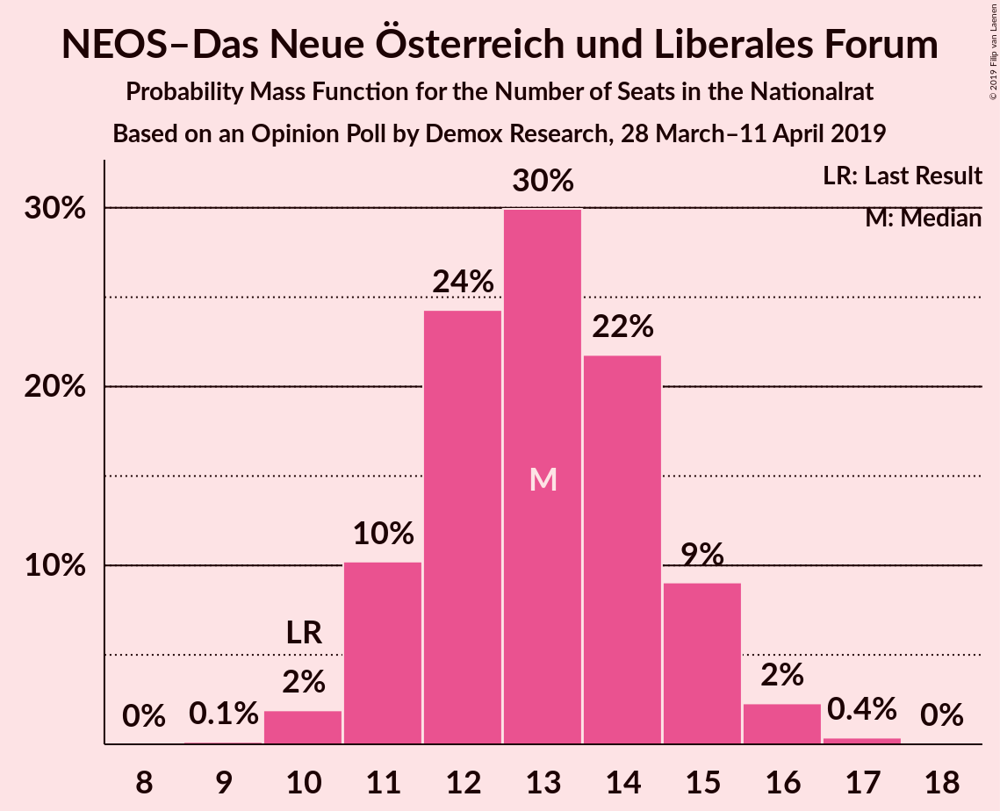
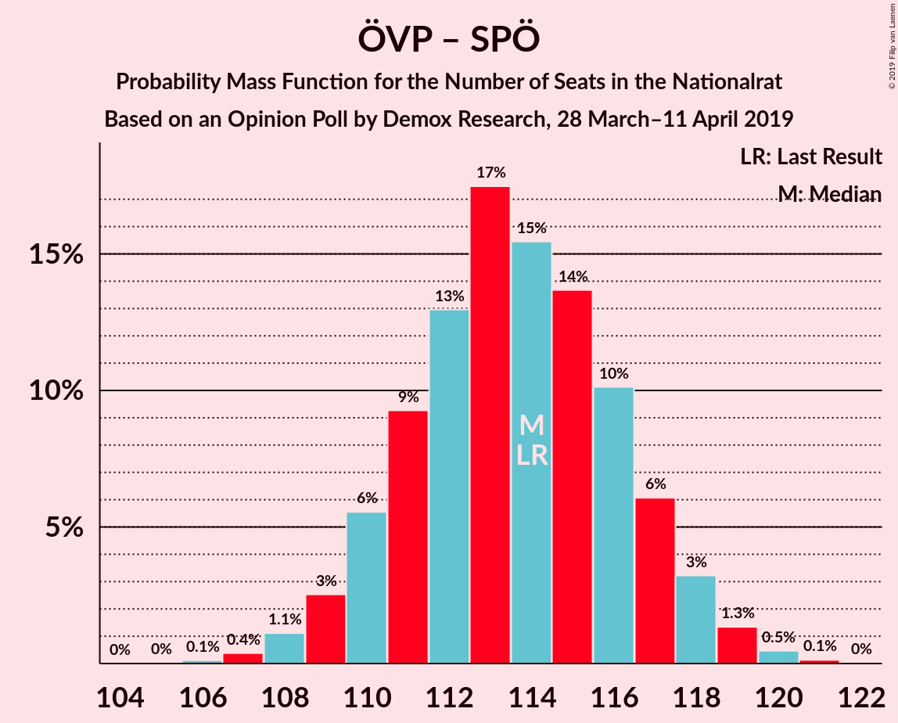

# Opinion Poll by Demox Research, 28 March–11 April 2019

<a href="#voting-intentions">Voting Intentions</a> | <a href="#seats">Seats</a> | <a href="#coalitions">Coalitions</a> | <a href="#technical-information">Technical Information</a>

## Voting Intentions

### Confidence Intervals

| Party | Last Result | Poll Result | 80% Confidence Interval | 90% Confidence Interval | 95% Confidence Interval | 99% Confidence Interval |
|:-----:|:-----------:|:-----------:|:-----------------------:|:-----------------------:|:-----------------------:|:-----------------------:|
| Österreichische Volkspartei | 31.5% | 33.0% | 31.5–34.6% |31.0–35.0% |30.7–35.4% |29.9–36.2% |
| Sozialdemokratische Partei Österreichs | 26.9% | 27.0% | 25.6–28.5% |25.2–28.9% |24.8–29.3% |24.1–30.0% |
| Freiheitliche Partei Österreichs | 26.0% | 24.0% | 22.6–25.5% |22.2–25.9% |21.9–26.2% |21.3–26.9% |
| NEOS–Das Neue Österreich und Liberales Forum | 5.3% | 7.0% | 6.2–7.9% |6.0–8.2% |5.8–8.4% |5.5–8.9% |
| Die Grünen–Die Grüne Alternative | 3.8% | 6.0% | 5.3–6.9% |5.1–7.1% |4.9–7.3% |4.6–7.8% |
| JETZT–Liste Pilz | 4.4% | 2.0% | 1.6–2.6% |1.5–2.7% |1.4–2.9% |1.2–3.1% |

*Note:* The poll result column reflects the actual value used in the calculations. Published results may vary slightly, and in addition be rounded to fewer digits.

## Seats

### Confidence Intervals

| Party | Last Result | Median | 80% Confidence Interval | 90% Confidence Interval | 95% Confidence Interval | 99% Confidence Interval |
|:-----:|:-----------:|:------:|:-----------------------:|:-----------------------:|:-----------------------:|:-----------------------:|
| <a href="#österreichische-volkspartei">Österreichische Volkspartei</a> | 62 | 63 | 60–65 |59–66 |58–67 |57–69 |
| <a href="#sozialdemokratische-partei-österreichs">Sozialdemokratische Partei Österreichs</a> | 52 | 51 | 48–54 |48–55 |47–56 |46–57 |
| <a href="#freiheitliche-partei-österreichs">Freiheitliche Partei Österreichs</a> | 51 | 45 | 43–48 |42–49 |41–50 |40–51 |
| <a href="#neos–das-neue-österreich-und-liberales-forum">NEOS–Das Neue Österreich und Liberales Forum</a> | 10 | 13 | 11–15 |11–15 |11–16 |10–17 |
| <a href="#die-grünen–die-grüne-alternative">Die Grünen–Die Grüne Alternative</a> | 0 | 11 | 10–13 |9–13 |9–14 |8–14 |
| <a href="#jetzt–liste-pilz">JETZT–Liste Pilz</a> | 8 | 0 | 0 |0 |0 |0 |

### Österreichische Volkspartei

*For a full overview of the results for this party, see the [Österreichische Volkspartei](party-österreichischevolkspartei.html) page.*

| Number of Seats | Probability | Accumulated | Special Marks |
|:---------------:|:-----------:|:-----------:|:-------------:|
| 55 | 0.1% | 100% |  |
| 56 | 0.3% | 99.9% |  |
| 57 | 1.0% | 99.6% |  |
| 58 | 3% | 98.6% |  |
| 59 | 5% | 96% |  |
| 60 | 12% | 90% |  |
| 61 | 11% | 78% |  |
| 62 | 16% | 67% | Last Result |
| 63 | 18% | 51% | Median |
| 64 | 14% | 33% |  |
| 65 | 10% | 19% |  |
| 66 | 5% | 9% |  |
| 67 | 3% | 4% |  |
| 68 | 0.9% | 1.5% |  |
| 69 | 0.4% | 0.5% |  |
| 70 | 0.1% | 0.1% |  |
| 71 | 0% | 0% |  |

### Sozialdemokratische Partei Österreichs

*For a full overview of the results for this party, see the [Sozialdemokratische Partei Österreichs](party-sozialdemokratischeparteiösterreichs.html) page.*

| Number of Seats | Probability | Accumulated | Special Marks |
|:---------------:|:-----------:|:-----------:|:-------------:|
| 44 | 0.1% | 100% |  |
| 45 | 0.4% | 99.9% |  |
| 46 | 1.1% | 99.5% |  |
| 47 | 3% | 98% |  |
| 48 | 8% | 95% |  |
| 49 | 11% | 87% |  |
| 50 | 12% | 76% |  |
| 51 | 21% | 64% | Median |
| 52 | 13% | 43% | Last Result |
| 53 | 14% | 29% |  |
| 54 | 9% | 16% |  |
| 55 | 4% | 6% |  |
| 56 | 2% | 3% |  |
| 57 | 0.4% | 0.6% |  |
| 58 | 0.2% | 0.2% |  |
| 59 | 0% | 0.1% |  |
| 60 | 0% | 0% |  |

### Freiheitliche Partei Österreichs

*For a full overview of the results for this party, see the [Freiheitliche Partei Österreichs](party-freiheitlicheparteiösterreichs.html) page.*

| Number of Seats | Probability | Accumulated | Special Marks |
|:---------------:|:-----------:|:-----------:|:-------------:|
| 39 | 0.1% | 100% |  |
| 40 | 0.6% | 99.8% |  |
| 41 | 2% | 99.2% |  |
| 42 | 5% | 97% |  |
| 43 | 13% | 92% |  |
| 44 | 13% | 79% |  |
| 45 | 17% | 66% | Median |
| 46 | 21% | 49% |  |
| 47 | 13% | 28% |  |
| 48 | 7% | 15% |  |
| 49 | 5% | 7% |  |
| 50 | 2% | 3% |  |
| 51 | 0.4% | 0.7% | Last Result |
| 52 | 0.2% | 0.3% |  |
| 53 | 0% | 0% |  |

### NEOS–Das Neue Österreich und Liberales Forum

*For a full overview of the results for this party, see the [NEOS–Das Neue Österreich und Liberales Forum](party-neos–dasneueösterreichundliberalesforum.html) page.*

| Number of Seats | Probability | Accumulated | Special Marks |
|:---------------:|:-----------:|:-----------:|:-------------:|
| 9 | 0.1% | 100% |  |
| 10 | 2% | 99.9% | Last Result |
| 11 | 12% | 98% |  |
| 12 | 22% | 86% |  |
| 13 | 30% | 64% | Median |
| 14 | 23% | 35% |  |
| 15 | 9% | 12% |  |
| 16 | 2% | 3% |  |
| 17 | 0.5% | 0.5% |  |
| 18 | 0.1% | 0.1% |  |
| 19 | 0% | 0% |  |

### Die Grünen–Die Grüne Alternative

*For a full overview of the results for this party, see the [Die Grünen–Die Grüne Alternative](party-diegrünen–diegrünealternative.html) page.*

| Number of Seats | Probability | Accumulated | Special Marks |
|:---------------:|:-----------:|:-----------:|:-------------:|
| 0 | 0% | 100% | Last Result |
| 1 | 0% | 100% |  |
| 2 | 0% | 100% |  |
| 3 | 0% | 100% |  |
| 4 | 0% | 100% |  |
| 5 | 0% | 100% |  |
| 6 | 0% | 100% |  |
| 7 | 0% | 100% |  |
| 8 | 1.3% | 99.9% |  |
| 9 | 9% | 98.6% |  |
| 10 | 27% | 90% |  |
| 11 | 31% | 63% | Median |
| 12 | 21% | 32% |  |
| 13 | 8% | 12% |  |
| 14 | 3% | 3% |  |
| 15 | 0.3% | 0.4% |  |
| 16 | 0% | 0% |  |

### JETZT–Liste Pilz

*For a full overview of the results for this party, see the [JETZT–Liste Pilz](party-jetzt–listepilz.html) page.*

| Number of Seats | Probability | Accumulated | Special Marks |
|:---------------:|:-----------:|:-----------:|:-------------:|
| 0 | 100% | 100% | Median |
| 1 | 0% | 0% |  |
| 2 | 0% | 0% |  |
| 3 | 0% | 0% |  |
| 4 | 0% | 0% |  |
| 5 | 0% | 0% |  |
| 6 | 0% | 0% |  |
| 7 | 0% | 0% |  |
| 8 | 0% | 0% | Last Result |

## Coalitions

### Confidence Intervals

| Coalition | Last Result | Median | Majority? | 80% Confidence Interval | 90% Confidence Interval | 95% Confidence Interval | 99% Confidence Interval |
|:---------:|:-----------:|:------:|:---------:|:-----------------------:|:-----------------------:|:-----------------------:|:-----------------------:|
| Österreichische Volkspartei – Sozialdemokratische Partei Österreichs | 114 | 114 | 100% | 111–117 | 110–118 | 109–118 | 107–120 |
| Österreichische Volkspartei – Freiheitliche Partei Österreichs | 113 | 108 | 100% | 105–111 | 104–112 | 103–113 | 102–114 |
| Sozialdemokratische Partei Österreichs – Freiheitliche Partei Österreichs | 103 | 97 | 98% | 93–100 | 93–100 | 92–102 | 90–103 |
| Österreichische Volkspartei | 62 | 63 | 0% | 60–65 | 59–66 | 58–67 | 57–69 |
| Sozialdemokratische Partei Österreichs | 52 | 51 | 0% | 48–54 | 48–55 | 47–56 | 46–57 |

### Österreichische Volkspartei – Sozialdemokratische Partei Österreichs

| Number of Seats | Probability | Accumulated | Special Marks |
|:---------------:|:-----------:|:-----------:|:-------------:|
| 106 | 0.2% | 100% |  |
| 107 | 0.5% | 99.8% |  |
| 108 | 1.0% | 99.3% |  |
| 109 | 3% | 98% |  |
| 110 | 5% | 96% |  |
| 111 | 9% | 90% |  |
| 112 | 13% | 81% |  |
| 113 | 16% | 68% |  |
| 114 | 14% | 52% | Last Result, Median |
| 115 | 14% | 38% |  |
| 116 | 12% | 24% |  |
| 117 | 6% | 11% |  |
| 118 | 4% | 6% |  |
| 119 | 1.4% | 2% |  |
| 120 | 0.5% | 0.7% |  |
| 121 | 0.2% | 0.2% |  |
| 122 | 0% | 0% |  |

### Österreichische Volkspartei – Freiheitliche Partei Österreichs

| Number of Seats | Probability | Accumulated | Special Marks |
|:---------------:|:-----------:|:-----------:|:-------------:|
| 100 | 0.1% | 100% |  |
| 101 | 0.3% | 99.8% |  |
| 102 | 1.0% | 99.6% |  |
| 103 | 3% | 98.6% |  |
| 104 | 5% | 96% |  |
| 105 | 9% | 91% |  |
| 106 | 11% | 82% |  |
| 107 | 13% | 71% |  |
| 108 | 17% | 57% | Median |
| 109 | 15% | 40% |  |
| 110 | 11% | 25% |  |
| 111 | 8% | 14% |  |
| 112 | 3% | 6% |  |
| 113 | 1.5% | 3% | Last Result |
| 114 | 0.9% | 1.2% |  |
| 115 | 0.2% | 0.3% |  |
| 116 | 0.1% | 0.1% |  |
| 117 | 0% | 0% |  |

### Sozialdemokratische Partei Österreichs – Freiheitliche Partei Österreichs

| Number of Seats | Probability | Accumulated | Special Marks |
|:---------------:|:-----------:|:-----------:|:-------------:|
| 88 | 0% | 100% |  |
| 89 | 0.2% | 99.9% |  |
| 90 | 0.4% | 99.8% |  |
| 91 | 1.4% | 99.4% |  |
| 92 | 3% | 98% | Majority |
| 93 | 5% | 95% |  |
| 94 | 11% | 90% |  |
| 95 | 11% | 79% |  |
| 96 | 17% | 68% | Median |
| 97 | 17% | 51% |  |
| 98 | 11% | 34% |  |
| 99 | 12% | 23% |  |
| 100 | 7% | 11% |  |
| 101 | 2% | 4% |  |
| 102 | 2% | 3% |  |
| 103 | 0.7% | 0.9% | Last Result |
| 104 | 0.1% | 0.2% |  |
| 105 | 0% | 0.1% |  |
| 106 | 0% | 0% |  |

### Österreichische Volkspartei

| Number of Seats | Probability | Accumulated | Special Marks |
|:---------------:|:-----------:|:-----------:|:-------------:|
| 55 | 0.1% | 100% |  |
| 56 | 0.3% | 99.9% |  |
| 57 | 1.0% | 99.6% |  |
| 58 | 3% | 98.6% |  |
| 59 | 5% | 96% |  |
| 60 | 12% | 90% |  |
| 61 | 11% | 78% |  |
| 62 | 16% | 67% | Last Result |
| 63 | 18% | 51% | Median |
| 64 | 14% | 33% |  |
| 65 | 10% | 19% |  |
| 66 | 5% | 9% |  |
| 67 | 3% | 4% |  |
| 68 | 0.9% | 1.5% |  |
| 69 | 0.4% | 0.5% |  |
| 70 | 0.1% | 0.1% |  |
| 71 | 0% | 0% |  |

### Sozialdemokratische Partei Österreichs

| Number of Seats | Probability | Accumulated | Special Marks |
|:---------------:|:-----------:|:-----------:|:-------------:|
| 44 | 0.1% | 100% |  |
| 45 | 0.4% | 99.9% |  |
| 46 | 1.1% | 99.5% |  |
| 47 | 3% | 98% |  |
| 48 | 8% | 95% |  |
| 49 | 11% | 87% |  |
| 50 | 12% | 76% |  |
| 51 | 21% | 64% | Median |
| 52 | 13% | 43% | Last Result |
| 53 | 14% | 29% |  |
| 54 | 9% | 16% |  |
| 55 | 4% | 6% |  |
| 56 | 2% | 3% |  |
| 57 | 0.4% | 0.6% |  |
| 58 | 0.2% | 0.2% |  |
| 59 | 0% | 0.1% |  |
| 60 | 0% | 0% |  |

## Technical Information

### Opinion Poll

+ **Polling firm:** Demox Research
+ **Commissioner(s):** —
+ **Fieldwork period:** 28 March–11 April 2019

### Calculations

+ **Sample size:** 1500
+ **Simulations done:** 131,072
+ **Error estimate:** 1.43%

