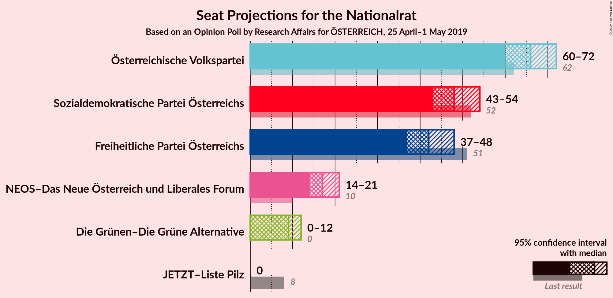
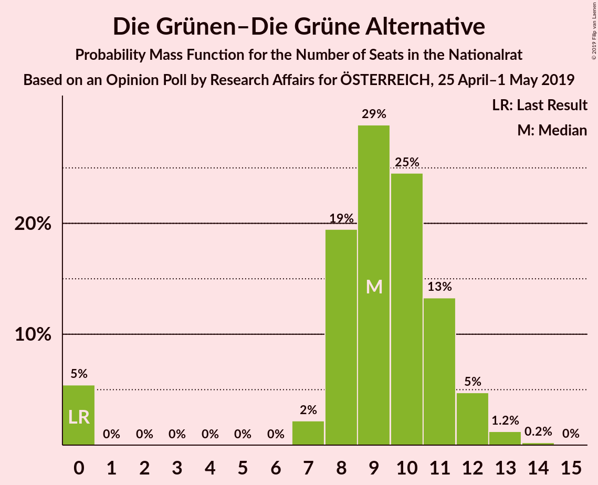

# Opinion Poll by Research Affairs for ÖSTERREICH, 25 April–1 May 2019

<a href="#voting-intentions">Voting Intentions</a> | <a href="#seats">Seats</a> | <a href="#coalitions">Coalitions</a> | <a href="#technical-information">Technical Information</a>

## Voting Intentions

### Confidence Intervals

| Party | Last Result | Poll Result | 80% Confidence Interval | 90% Confidence Interval | 95% Confidence Interval | 99% Confidence Interval |
|:-----:|:-----------:|:-----------:|:-----------------------:|:-----------------------:|:-----------------------:|:-----------------------:|
| Österreichische Volkspartei | 31.5% | 34.0% | 32.1–36.0% |31.6–36.5% |31.2–37.0% |30.3–38.0% |
| Sozialdemokratische Partei Österreichs | 26.9% | 25.0% | 23.4–26.9% |22.9–27.4% |22.5–27.8% |21.7–28.7% |
| Freiheitliche Partei Österreichs | 26.0% | 22.0% | 20.3–23.7% |19.9–24.2% |19.5–24.6% |18.7–25.5% |
| NEOS–Das Neue Österreich und Liberales Forum | 5.3% | 9.0% | 7.9–10.2% |7.6–10.6% |7.4–10.9% |6.9–11.6% |
| Die Grünen–Die Grüne Alternative | 3.8% | 5.0% | 4.2–6.0% |4.0–6.3% |3.8–6.5% |3.5–7.0% |
| JETZT–Liste Pilz | 4.4% | 2.0% | 1.5–2.7% |1.4–2.9% |1.3–3.1% |1.1–3.4% |

*Note:* The poll result column reflects the actual value used in the calculations. Published results may vary slightly, and in addition be rounded to fewer digits.

## Seats

### Confidence Intervals

| Party | Last Result | Median | 80% Confidence Interval | 90% Confidence Interval | 95% Confidence Interval | 99% Confidence Interval |
|:-----:|:-----------:|:------:|:-----------------------:|:-----------------------:|:-----------------------:|:-----------------------:|
| <a href="#österreichische-volkspartei">Österreichische Volkspartei</a> | 62 | 66 | 62–70 |61–71 |60–71 |58–74 |
| <a href="#sozialdemokratische-partei-österreichs">Sozialdemokratische Partei Österreichs</a> | 52 | 48 | 45–52 |44–53 |43–54 |41–55 |
| <a href="#freiheitliche-partei-österreichs">Freiheitliche Partei Österreichs</a> | 51 | 42 | 39–46 |38–47 |37–48 |36–49 |
| <a href="#neos–das-neue-österreich-und-liberales-forum">NEOS–Das Neue Österreich und Liberales Forum</a> | 10 | 17 | 15–19 |14–20 |14–21 |13–22 |
| <a href="#die-grünen–die-grüne-alternative">Die Grünen–Die Grüne Alternative</a> | 0 | 9 | 8–11 |0–12 |0–12 |0–13 |
| <a href="#jetzt–liste-pilz">JETZT–Liste Pilz</a> | 8 | 0 | 0 |0 |0 |0 |

### Österreichische Volkspartei

*For a full overview of the results for this party, see the [Österreichische Volkspartei](party-österreichischevolkspartei.html) page.*

| Number of Seats | Probability | Accumulated | Special Marks |
|:---------------:|:-----------:|:-----------:|:-------------:|
| 56 | 0.1% | 100% |  |
| 57 | 0.2% | 99.9% |  |
| 58 | 0.4% | 99.7% |  |
| 59 | 1.2% | 99.3% |  |
| 60 | 2% | 98% |  |
| 61 | 4% | 96% |  |
| 62 | 6% | 92% | Last Result |
| 63 | 9% | 86% |  |
| 64 | 10% | 77% |  |
| 65 | 12% | 67% |  |
| 66 | 14% | 55% | Median |
| 67 | 12% | 41% |  |
| 68 | 10% | 29% |  |
| 69 | 9% | 20% |  |
| 70 | 4% | 11% |  |
| 71 | 5% | 7% |  |
| 72 | 0.8% | 2% |  |
| 73 | 0.7% | 1.4% |  |
| 74 | 0.3% | 0.7% |  |
| 75 | 0.3% | 0.4% |  |
| 76 | 0.1% | 0.1% |  |
| 77 | 0% | 0.1% |  |
| 78 | 0% | 0% |  |

### Sozialdemokratische Partei Österreichs

*For a full overview of the results for this party, see the [Sozialdemokratische Partei Österreichs](party-sozialdemokratischeparteiösterreichs.html) page.*

| Number of Seats | Probability | Accumulated | Special Marks |
|:---------------:|:-----------:|:-----------:|:-------------:|
| 40 | 0.1% | 100% |  |
| 41 | 0.5% | 99.8% |  |
| 42 | 1.0% | 99.4% |  |
| 43 | 2% | 98% |  |
| 44 | 5% | 97% |  |
| 45 | 6% | 92% |  |
| 46 | 14% | 86% |  |
| 47 | 15% | 72% |  |
| 48 | 11% | 57% | Median |
| 49 | 12% | 46% |  |
| 50 | 13% | 34% |  |
| 51 | 8% | 21% |  |
| 52 | 5% | 12% | Last Result |
| 53 | 3% | 7% |  |
| 54 | 2% | 4% |  |
| 55 | 1.2% | 2% |  |
| 56 | 0.3% | 0.5% |  |
| 57 | 0.1% | 0.2% |  |
| 58 | 0% | 0.1% |  |
| 59 | 0% | 0% |  |

### Freiheitliche Partei Österreichs

*For a full overview of the results for this party, see the [Freiheitliche Partei Österreichs](party-freiheitlicheparteiösterreichs.html) page.*

| Number of Seats | Probability | Accumulated | Special Marks |
|:---------------:|:-----------:|:-----------:|:-------------:|
| 34 | 0.1% | 100% |  |
| 35 | 0.2% | 99.9% |  |
| 36 | 0.9% | 99.7% |  |
| 37 | 2% | 98.8% |  |
| 38 | 4% | 97% |  |
| 39 | 9% | 93% |  |
| 40 | 9% | 84% |  |
| 41 | 15% | 75% |  |
| 42 | 13% | 60% | Median |
| 43 | 14% | 47% |  |
| 44 | 11% | 32% |  |
| 45 | 9% | 21% |  |
| 46 | 5% | 12% |  |
| 47 | 3% | 6% |  |
| 48 | 2% | 3% |  |
| 49 | 0.8% | 1.1% |  |
| 50 | 0.2% | 0.4% |  |
| 51 | 0.1% | 0.1% | Last Result |
| 52 | 0% | 0.1% |  |
| 53 | 0% | 0% |  |

### NEOS–Das Neue Österreich und Liberales Forum

*For a full overview of the results for this party, see the [NEOS–Das Neue Österreich und Liberales Forum](party-neos–dasneueösterreichundliberalesforum.html) page.*

| Number of Seats | Probability | Accumulated | Special Marks |
|:---------------:|:-----------:|:-----------:|:-------------:|
| 10 | 0% | 100% | Last Result |
| 11 | 0% | 100% |  |
| 12 | 0.2% | 100% |  |
| 13 | 2% | 99.8% |  |
| 14 | 5% | 98% |  |
| 15 | 11% | 93% |  |
| 16 | 21% | 82% |  |
| 17 | 19% | 62% | Median |
| 18 | 17% | 43% |  |
| 19 | 16% | 25% |  |
| 20 | 5% | 9% |  |
| 21 | 3% | 4% |  |
| 22 | 0.8% | 1.1% |  |
| 23 | 0.2% | 0.2% |  |
| 24 | 0% | 0.1% |  |
| 25 | 0% | 0% |  |

### Die Grünen–Die Grüne Alternative

*For a full overview of the results for this party, see the [Die Grünen–Die Grüne Alternative](party-diegrünen–diegrünealternative.html) page.*

| Number of Seats | Probability | Accumulated | Special Marks |
|:---------------:|:-----------:|:-----------:|:-------------:|
| 0 | 5% | 100% | Last Result |
| 1 | 0% | 95% |  |
| 2 | 0% | 95% |  |
| 3 | 0% | 95% |  |
| 4 | 0% | 95% |  |
| 5 | 0% | 95% |  |
| 6 | 0% | 95% |  |
| 7 | 2% | 95% |  |
| 8 | 19% | 93% |  |
| 9 | 29% | 75% | Median |
| 10 | 27% | 45% |  |
| 11 | 13% | 18% |  |
| 12 | 4% | 5% |  |
| 13 | 1.1% | 1.4% |  |
| 14 | 0.2% | 0.3% |  |
| 15 | 0% | 0% |  |

### JETZT–Liste Pilz

*For a full overview of the results for this party, see the [JETZT–Liste Pilz](party-jetzt–listepilz.html) page.*

| Number of Seats | Probability | Accumulated | Special Marks |
|:---------------:|:-----------:|:-----------:|:-------------:|
| 0 | 100% | 100% | Median |
| 1 | 0% | 0% |  |
| 2 | 0% | 0% |  |
| 3 | 0% | 0% |  |
| 4 | 0% | 0% |  |
| 5 | 0% | 0% |  |
| 6 | 0% | 0% |  |
| 7 | 0% | 0% |  |
| 8 | 0% | 0% | Last Result |

## Coalitions

### Confidence Intervals

| Coalition | Last Result | Median | Majority? | 80% Confidence Interval | 90% Confidence Interval | 95% Confidence Interval | 99% Confidence Interval |
|:---------:|:-----------:|:------:|:---------:|:-----------------------:|:-----------------------:|:-----------------------:|:-----------------------:|
| Österreichische Volkspartei – Sozialdemokratische Partei Österreichs | 114 | 114 | 100% | 110–118 | 108–120 | 108–121 | 105–124 |
| Österreichische Volkspartei – Freiheitliche Partei Österreichs | 113 | 108 | 100% | 104–112 | 102–113 | 101–114 | 100–118 |
| Sozialdemokratische Partei Österreichs – Freiheitliche Partei Österreichs | 103 | 90 | 37% | 86–95 | 85–96 | 84–98 | 83–100 |
| Österreichische Volkspartei | 62 | 66 | 0% | 62–70 | 61–71 | 60–71 | 58–74 |
| Sozialdemokratische Partei Österreichs | 52 | 48 | 0% | 45–52 | 44–53 | 43–54 | 41–55 |

### Österreichische Volkspartei – Sozialdemokratische Partei Österreichs

| Number of Seats | Probability | Accumulated | Special Marks |
|:---------------:|:-----------:|:-----------:|:-------------:|
| 102 | 0% | 100% |  |
| 103 | 0.1% | 99.9% |  |
| 104 | 0.2% | 99.9% |  |
| 105 | 0.2% | 99.7% |  |
| 106 | 0.6% | 99.4% |  |
| 107 | 0.8% | 98.8% |  |
| 108 | 3% | 98% |  |
| 109 | 2% | 95% |  |
| 110 | 4% | 93% |  |
| 111 | 7% | 89% |  |
| 112 | 20% | 82% |  |
| 113 | 5% | 62% |  |
| 114 | 9% | 56% | Last Result, Median |
| 115 | 12% | 47% |  |
| 116 | 14% | 35% |  |
| 117 | 9% | 21% |  |
| 118 | 3% | 12% |  |
| 119 | 4% | 9% |  |
| 120 | 2% | 5% |  |
| 121 | 1.5% | 3% |  |
| 122 | 0.5% | 2% |  |
| 123 | 0.6% | 1.3% |  |
| 124 | 0.5% | 0.7% |  |
| 125 | 0.1% | 0.2% |  |
| 126 | 0.1% | 0.1% |  |
| 127 | 0% | 0% |  |

### Österreichische Volkspartei – Freiheitliche Partei Österreichs

| Number of Seats | Probability | Accumulated | Special Marks |
|:---------------:|:-----------:|:-----------:|:-------------:|
| 97 | 0.1% | 100% |  |
| 98 | 0.1% | 99.9% |  |
| 99 | 0.2% | 99.8% |  |
| 100 | 0.6% | 99.6% |  |
| 101 | 2% | 99.0% |  |
| 102 | 2% | 97% |  |
| 103 | 2% | 95% |  |
| 104 | 5% | 92% |  |
| 105 | 9% | 87% |  |
| 106 | 5% | 78% |  |
| 107 | 16% | 73% |  |
| 108 | 13% | 57% | Median |
| 109 | 13% | 44% |  |
| 110 | 9% | 31% |  |
| 111 | 5% | 22% |  |
| 112 | 7% | 17% |  |
| 113 | 5% | 9% | Last Result |
| 114 | 2% | 4% |  |
| 115 | 1.0% | 2% |  |
| 116 | 0.4% | 1.3% |  |
| 117 | 0.3% | 0.9% |  |
| 118 | 0.1% | 0.6% |  |
| 119 | 0.2% | 0.5% |  |
| 120 | 0.1% | 0.2% |  |
| 121 | 0.1% | 0.1% |  |
| 122 | 0% | 0% |  |

### Sozialdemokratische Partei Österreichs – Freiheitliche Partei Österreichs

| Number of Seats | Probability | Accumulated | Special Marks |
|:---------------:|:-----------:|:-----------:|:-------------:|
| 80 | 0.1% | 100% |  |
| 81 | 0.2% | 99.9% |  |
| 82 | 0.2% | 99.7% |  |
| 83 | 0.8% | 99.5% |  |
| 84 | 2% | 98.7% |  |
| 85 | 3% | 97% |  |
| 86 | 5% | 94% |  |
| 87 | 8% | 89% |  |
| 88 | 8% | 81% |  |
| 89 | 17% | 73% |  |
| 90 | 8% | 56% | Median |
| 91 | 11% | 48% |  |
| 92 | 9% | 37% | Majority |
| 93 | 5% | 28% |  |
| 94 | 10% | 23% |  |
| 95 | 3% | 13% |  |
| 96 | 5% | 10% |  |
| 97 | 2% | 5% |  |
| 98 | 2% | 3% |  |
| 99 | 0.5% | 1.0% |  |
| 100 | 0.3% | 0.5% |  |
| 101 | 0.1% | 0.2% |  |
| 102 | 0% | 0.1% |  |
| 103 | 0.1% | 0.1% | Last Result |
| 104 | 0% | 0% |  |

### Österreichische Volkspartei

| Number of Seats | Probability | Accumulated | Special Marks |
|:---------------:|:-----------:|:-----------:|:-------------:|
| 56 | 0.1% | 100% |  |
| 57 | 0.2% | 99.9% |  |
| 58 | 0.4% | 99.7% |  |
| 59 | 1.2% | 99.3% |  |
| 60 | 2% | 98% |  |
| 61 | 4% | 96% |  |
| 62 | 6% | 92% | Last Result |
| 63 | 9% | 86% |  |
| 64 | 10% | 77% |  |
| 65 | 12% | 67% |  |
| 66 | 14% | 55% | Median |
| 67 | 12% | 41% |  |
| 68 | 10% | 29% |  |
| 69 | 9% | 20% |  |
| 70 | 4% | 11% |  |
| 71 | 5% | 7% |  |
| 72 | 0.8% | 2% |  |
| 73 | 0.7% | 1.4% |  |
| 74 | 0.3% | 0.7% |  |
| 75 | 0.3% | 0.4% |  |
| 76 | 0.1% | 0.1% |  |
| 77 | 0% | 0.1% |  |
| 78 | 0% | 0% |  |

### Sozialdemokratische Partei Österreichs

| Number of Seats | Probability | Accumulated | Special Marks |
|:---------------:|:-----------:|:-----------:|:-------------:|
| 40 | 0.1% | 100% |  |
| 41 | 0.5% | 99.8% |  |
| 42 | 1.0% | 99.4% |  |
| 43 | 2% | 98% |  |
| 44 | 5% | 97% |  |
| 45 | 6% | 92% |  |
| 46 | 14% | 86% |  |
| 47 | 15% | 72% |  |
| 48 | 11% | 57% | Median |
| 49 | 12% | 46% |  |
| 50 | 13% | 34% |  |
| 51 | 8% | 21% |  |
| 52 | 5% | 12% | Last Result |
| 53 | 3% | 7% |  |
| 54 | 2% | 4% |  |
| 55 | 1.2% | 2% |  |
| 56 | 0.3% | 0.5% |  |
| 57 | 0.1% | 0.2% |  |
| 58 | 0% | 0.1% |  |
| 59 | 0% | 0% |  |

## Technical Information

### Opinion Poll

+ **Polling firm:** Research Affairs
+ **Commissioner(s):** ÖSTERREICH
+ **Fieldwork period:** 25 April–1 May 2019

### Calculations

+ **Sample size:** 1002
+ **Simulations done:** 65,536
+ **Error estimate:** 2.00%

