# Opinion Poll by Demox Research, 25 April–2 May 2019

<a href="#voting-intentions">Voting Intentions</a> | <a href="#seats">Seats</a> | <a href="#coalitions">Coalitions</a> | <a href="#technical-information">Technical Information</a>

## Voting Intentions

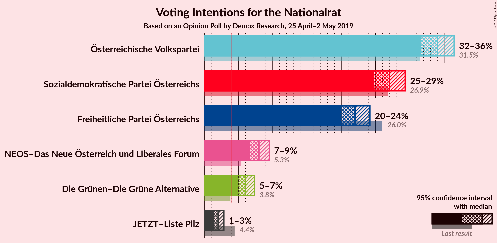

### Confidence Intervals

| Party | Last Result | Poll Result | 80% Confidence Interval | 90% Confidence Interval | 95% Confidence Interval | 99% Confidence Interval |
|:-----:|:-----------:|:-----------:|:-----------------------:|:-----------------------:|:-----------------------:|:-----------------------:|
| Österreichische Volkspartei | 31.5% | 34.0% | 32.4–35.6% |32.0–36.0% |31.6–36.4% |30.9–37.2% |
| Sozialdemokratische Partei Österreichs | 26.9% | 27.0% | 25.6–28.5% |25.2–28.9% |24.8–29.3% |24.1–30.0% |
| Freiheitliche Partei Österreichs | 26.0% | 22.0% | 20.7–23.4% |20.3–23.8% |20.0–24.2% |19.3–24.9% |
| NEOS–Das Neue Österreich und Liberales Forum | 5.3% | 8.0% | 7.2–9.0% |6.9–9.3% |6.7–9.5% |6.3–10.0% |
| Die Grünen–Die Grüne Alternative | 3.8% | 6.0% | 5.3–6.9% |5.1–7.1% |4.9–7.3% |4.6–7.8% |
| JETZT–Liste Pilz | 4.4% | 2.0% | 1.6–2.6% |1.5–2.7% |1.4–2.9% |1.2–3.1% |

*Note:* The poll result column reflects the actual value used in the calculations. Published results may vary slightly, and in addition be rounded to fewer digits.

## Seats

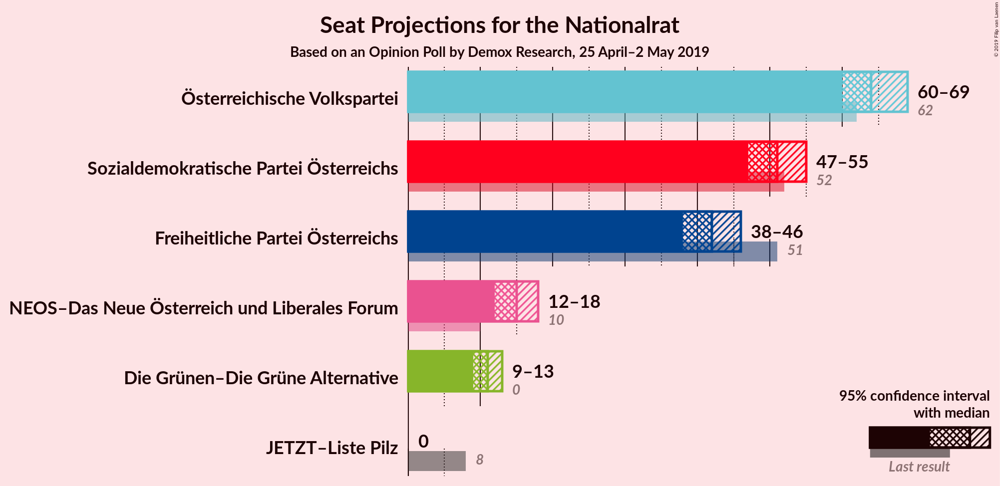

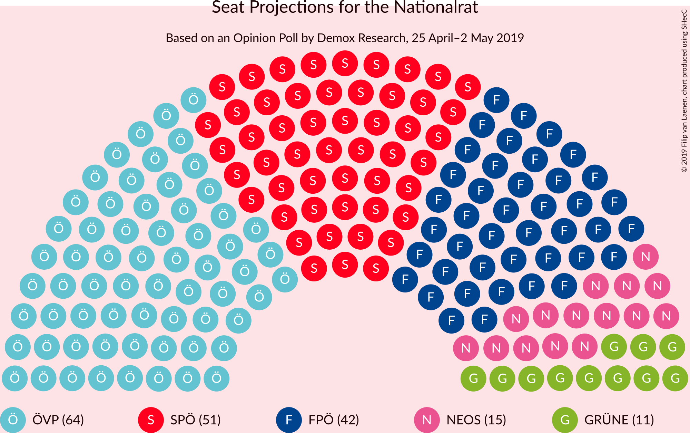

### Confidence Intervals

| Party | Last Result | Median | 80% Confidence Interval | 90% Confidence Interval | 95% Confidence Interval | 99% Confidence Interval |
|:-----:|:-----------:|:------:|:-----------------------:|:-----------------------:|:-----------------------:|:-----------------------:|
| <a href="#österreichische-volkspartei">Österreichische Volkspartei</a> | 62 | 64 | 61–67 |61–68 |60–69 |59–71 |
| <a href="#sozialdemokratische-partei-österreichs">Sozialdemokratische Partei Österreichs</a> | 52 | 51 | 48–54 |48–55 |47–55 |46–57 |
| <a href="#freiheitliche-partei-österreichs">Freiheitliche Partei Österreichs</a> | 51 | 42 | 39–44 |38–45 |38–46 |36–47 |
| <a href="#neos–das-neue-österreich-und-liberales-forum">NEOS–Das Neue Österreich und Liberales Forum</a> | 10 | 15 | 13–17 |13–17 |12–18 |12–18 |
| <a href="#die-grünen–die-grüne-alternative">Die Grünen–Die Grüne Alternative</a> | 0 | 11 | 10–13 |9–13 |9–13 |8–14 |
| <a href="#jetzt–liste-pilz">JETZT–Liste Pilz</a> | 8 | 0 | 0 |0 |0 |0 |

### Österreichische Volkspartei

*For a full overview of the results for this party, see the [Österreichische Volkspartei](party-österreichischevolkspartei.html) page.*

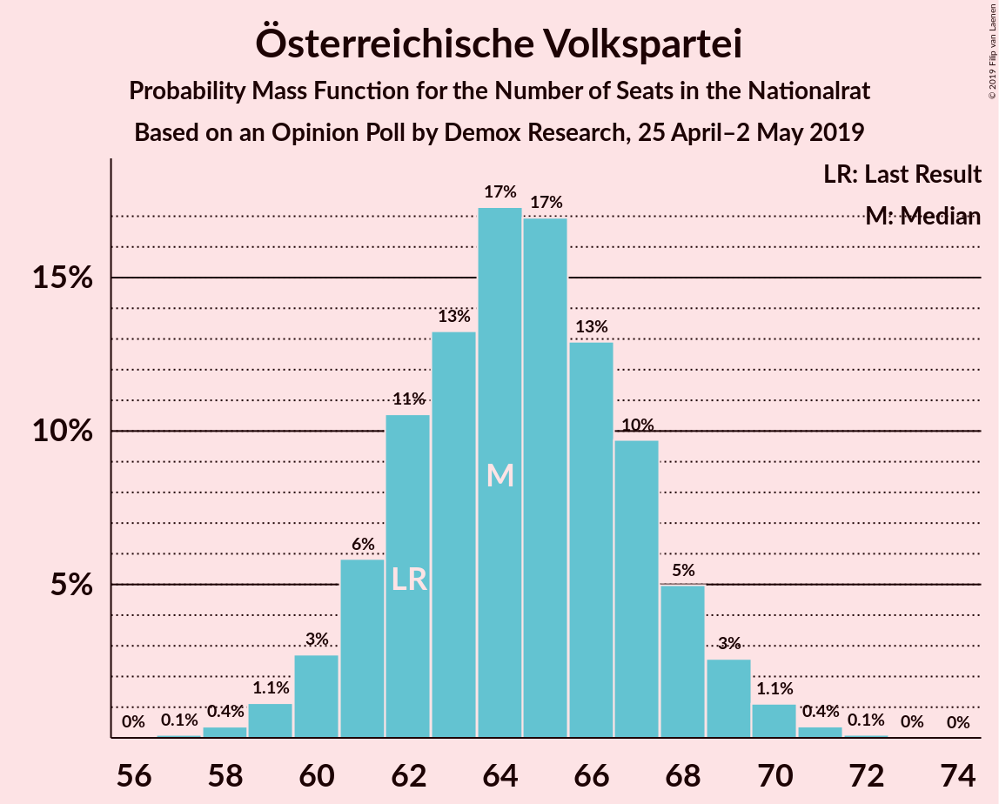

| Number of Seats | Probability | Accumulated | Special Marks |
|:---------------:|:-----------:|:-----------:|:-------------:|
| 57 | 0.1% | 100% |  |
| 58 | 0.4% | 99.9% |  |
| 59 | 1.1% | 99.5% |  |
| 60 | 3% | 98% |  |
| 61 | 6% | 96% |  |
| 62 | 11% | 90% | Last Result |
| 63 | 13% | 79% |  |
| 64 | 17% | 66% | Median |
| 65 | 17% | 49% |  |
| 66 | 13% | 32% |  |
| 67 | 10% | 19% |  |
| 68 | 5% | 9% |  |
| 69 | 3% | 4% |  |
| 70 | 1.1% | 2% |  |
| 71 | 0.4% | 0.5% |  |
| 72 | 0.1% | 0.1% |  |
| 73 | 0% | 0% |  |

### Sozialdemokratische Partei Österreichs

*For a full overview of the results for this party, see the [Sozialdemokratische Partei Österreichs](party-sozialdemokratischeparteiösterreichs.html) page.*

| Number of Seats | Probability | Accumulated | Special Marks |
|:---------------:|:-----------:|:-----------:|:-------------:|
| 44 | 0.1% | 100% |  |
| 45 | 0.4% | 99.9% |  |
| 46 | 1.1% | 99.5% |  |
| 47 | 3% | 98% |  |
| 48 | 7% | 95% |  |
| 49 | 12% | 88% |  |
| 50 | 17% | 76% |  |
| 51 | 20% | 59% | Median |
| 52 | 14% | 39% | Last Result |
| 53 | 12% | 25% |  |
| 54 | 8% | 14% |  |
| 55 | 4% | 6% |  |
| 56 | 2% | 2% |  |
| 57 | 0.5% | 0.7% |  |
| 58 | 0.2% | 0.2% |  |
| 59 | 0% | 0% |  |

### Freiheitliche Partei Österreichs

*For a full overview of the results for this party, see the [Freiheitliche Partei Österreichs](party-freiheitlicheparteiösterreichs.html) page.*

| Number of Seats | Probability | Accumulated | Special Marks |
|:---------------:|:-----------:|:-----------:|:-------------:|
| 35 | 0.1% | 100% |  |
| 36 | 0.5% | 99.9% |  |
| 37 | 2% | 99.4% |  |
| 38 | 5% | 98% |  |
| 39 | 10% | 93% |  |
| 40 | 15% | 84% |  |
| 41 | 17% | 69% |  |
| 42 | 19% | 52% | Median |
| 43 | 15% | 33% |  |
| 44 | 10% | 18% |  |
| 45 | 5% | 8% |  |
| 46 | 2% | 3% |  |
| 47 | 0.6% | 0.8% |  |
| 48 | 0.2% | 0.2% |  |
| 49 | 0% | 0.1% |  |
| 50 | 0% | 0% |  |
| 51 | 0% | 0% | Last Result |

### NEOS–Das Neue Österreich und Liberales Forum

*For a full overview of the results for this party, see the [NEOS–Das Neue Österreich und Liberales Forum](party-neos–dasneueösterreichundliberalesforum.html) page.*

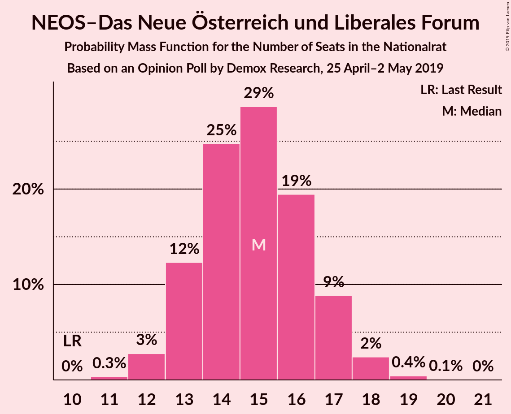

| Number of Seats | Probability | Accumulated | Special Marks |
|:---------------:|:-----------:|:-----------:|:-------------:|
| 10 | 0% | 100% | Last Result |
| 11 | 0.3% | 100% |  |
| 12 | 3% | 99.7% |  |
| 13 | 12% | 97% |  |
| 14 | 25% | 85% |  |
| 15 | 29% | 60% | Median |
| 16 | 19% | 31% |  |
| 17 | 9% | 12% |  |
| 18 | 2% | 3% |  |
| 19 | 0.4% | 0.5% |  |
| 20 | 0.1% | 0.1% |  |
| 21 | 0% | 0% |  |

### Die Grünen–Die Grüne Alternative

*For a full overview of the results for this party, see the [Die Grünen–Die Grüne Alternative](party-diegrünen–diegrünealternative.html) page.*

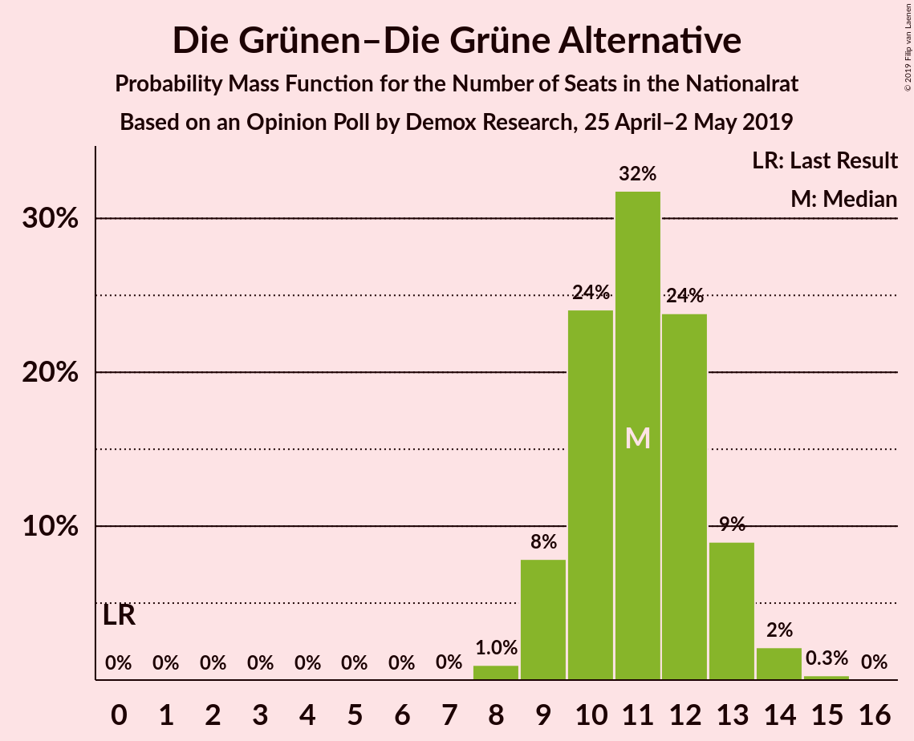

| Number of Seats | Probability | Accumulated | Special Marks |
|:---------------:|:-----------:|:-----------:|:-------------:|
| 0 | 0% | 100% | Last Result |
| 1 | 0% | 100% |  |
| 2 | 0% | 100% |  |
| 3 | 0% | 100% |  |
| 4 | 0% | 100% |  |
| 5 | 0% | 100% |  |
| 6 | 0% | 100% |  |
| 7 | 0% | 100% |  |
| 8 | 1.0% | 100% |  |
| 9 | 8% | 99.0% |  |
| 10 | 24% | 91% |  |
| 11 | 32% | 67% | Median |
| 12 | 24% | 35% |  |
| 13 | 9% | 11% |  |
| 14 | 2% | 2% |  |
| 15 | 0.3% | 0.3% |  |
| 16 | 0% | 0% |  |

### JETZT–Liste Pilz

*For a full overview of the results for this party, see the [JETZT–Liste Pilz](party-jetzt–listepilz.html) page.*

| Number of Seats | Probability | Accumulated | Special Marks |
|:---------------:|:-----------:|:-----------:|:-------------:|
| 0 | 100% | 100% | Median |
| 1 | 0% | 0% |  |
| 2 | 0% | 0% |  |
| 3 | 0% | 0% |  |
| 4 | 0% | 0% |  |
| 5 | 0% | 0% |  |
| 6 | 0% | 0% |  |
| 7 | 0% | 0% |  |
| 8 | 0% | 0% | Last Result |

## Coalitions

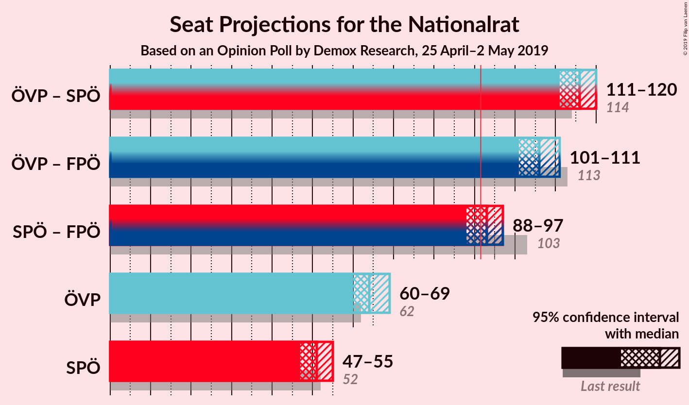

### Confidence Intervals

| Coalition | Last Result | Median | Majority? | 80% Confidence Interval | 90% Confidence Interval | 95% Confidence Interval | 99% Confidence Interval |
|:---------:|:-----------:|:------:|:---------:|:-----------------------:|:-----------------------:|:-----------------------:|:-----------------------:|
| Österreichische Volkspartei – Sozialdemokratische Partei Österreichs | 114 | 116 | 100% | 112–119 | 112–119 | 111–120 | 109–122 |
| Österreichische Volkspartei – Freiheitliche Partei Österreichs | 113 | 106 | 100% | 103–109 | 102–110 | 101–111 | 100–112 |
| Sozialdemokratische Partei Österreichs – Freiheitliche Partei Österreichs | 103 | 93 | 67% | 89–96 | 89–97 | 88–97 | 86–99 |
| Österreichische Volkspartei | 62 | 64 | 0% | 61–67 | 61–68 | 60–69 | 59–71 |
| Sozialdemokratische Partei Österreichs | 52 | 51 | 0% | 48–54 | 48–55 | 47–55 | 46–57 |

### Österreichische Volkspartei – Sozialdemokratische Partei Österreichs

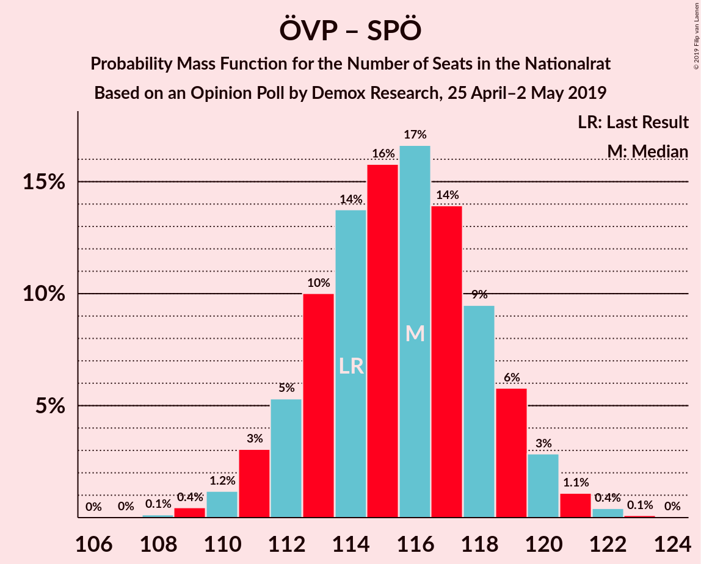

| Number of Seats | Probability | Accumulated | Special Marks |
|:---------------:|:-----------:|:-----------:|:-------------:|
| 108 | 0.1% | 100% |  |
| 109 | 0.4% | 99.8% |  |
| 110 | 1.2% | 99.4% |  |
| 111 | 3% | 98% |  |
| 112 | 5% | 95% |  |
| 113 | 10% | 90% |  |
| 114 | 14% | 80% | Last Result |
| 115 | 16% | 66% | Median |
| 116 | 17% | 50% |  |
| 117 | 14% | 34% |  |
| 118 | 9% | 20% |  |
| 119 | 6% | 10% |  |
| 120 | 3% | 4% |  |
| 121 | 1.1% | 2% |  |
| 122 | 0.4% | 0.5% |  |
| 123 | 0.1% | 0.1% |  |
| 124 | 0% | 0% |  |

### Österreichische Volkspartei – Freiheitliche Partei Österreichs

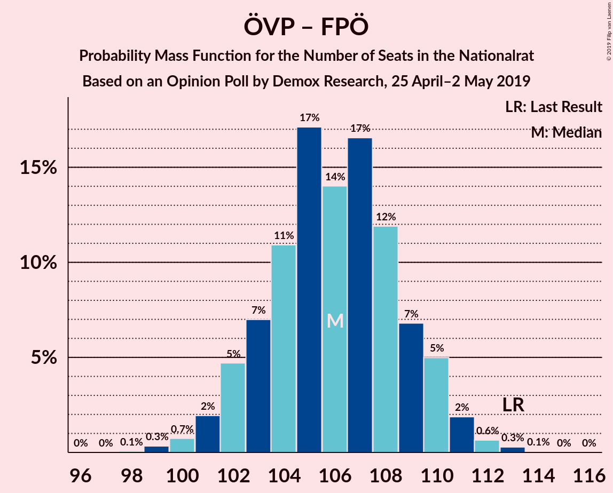

| Number of Seats | Probability | Accumulated | Special Marks |
|:---------------:|:-----------:|:-----------:|:-------------:|
| 98 | 0.1% | 100% |  |
| 99 | 0.3% | 99.9% |  |
| 100 | 0.7% | 99.6% |  |
| 101 | 2% | 98.8% |  |
| 102 | 5% | 97% |  |
| 103 | 7% | 92% |  |
| 104 | 11% | 85% |  |
| 105 | 17% | 74% |  |
| 106 | 14% | 57% | Median |
| 107 | 17% | 43% |  |
| 108 | 12% | 27% |  |
| 109 | 7% | 15% |  |
| 110 | 5% | 8% |  |
| 111 | 2% | 3% |  |
| 112 | 0.6% | 1.0% |  |
| 113 | 0.3% | 0.4% | Last Result |
| 114 | 0.1% | 0.1% |  |
| 115 | 0% | 0% |  |

### Sozialdemokratische Partei Österreichs – Freiheitliche Partei Österreichs

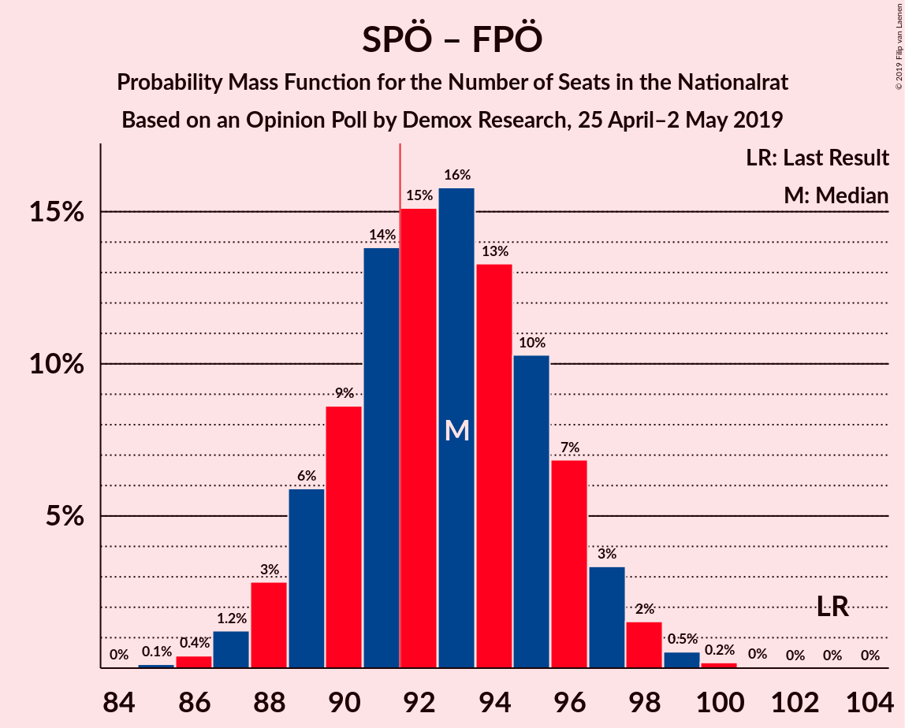

| Number of Seats | Probability | Accumulated | Special Marks |
|:---------------:|:-----------:|:-----------:|:-------------:|
| 85 | 0.1% | 100% |  |
| 86 | 0.4% | 99.8% |  |
| 87 | 1.2% | 99.4% |  |
| 88 | 3% | 98% |  |
| 89 | 6% | 95% |  |
| 90 | 9% | 89% |  |
| 91 | 14% | 81% |  |
| 92 | 15% | 67% | Majority |
| 93 | 16% | 52% | Median |
| 94 | 13% | 36% |  |
| 95 | 10% | 23% |  |
| 96 | 7% | 13% |  |
| 97 | 3% | 6% |  |
| 98 | 2% | 2% |  |
| 99 | 0.5% | 0.8% |  |
| 100 | 0.2% | 0.2% |  |
| 101 | 0% | 0.1% |  |
| 102 | 0% | 0% |  |
| 103 | 0% | 0% | Last Result |

### Österreichische Volkspartei

| Number of Seats | Probability | Accumulated | Special Marks |
|:---------------:|:-----------:|:-----------:|:-------------:|
| 57 | 0.1% | 100% |  |
| 58 | 0.4% | 99.9% |  |
| 59 | 1.1% | 99.5% |  |
| 60 | 3% | 98% |  |
| 61 | 6% | 96% |  |
| 62 | 11% | 90% | Last Result |
| 63 | 13% | 79% |  |
| 64 | 17% | 66% | Median |
| 65 | 17% | 49% |  |
| 66 | 13% | 32% |  |
| 67 | 10% | 19% |  |
| 68 | 5% | 9% |  |
| 69 | 3% | 4% |  |
| 70 | 1.1% | 2% |  |
| 71 | 0.4% | 0.5% |  |
| 72 | 0.1% | 0.1% |  |
| 73 | 0% | 0% |  |

### Sozialdemokratische Partei Österreichs

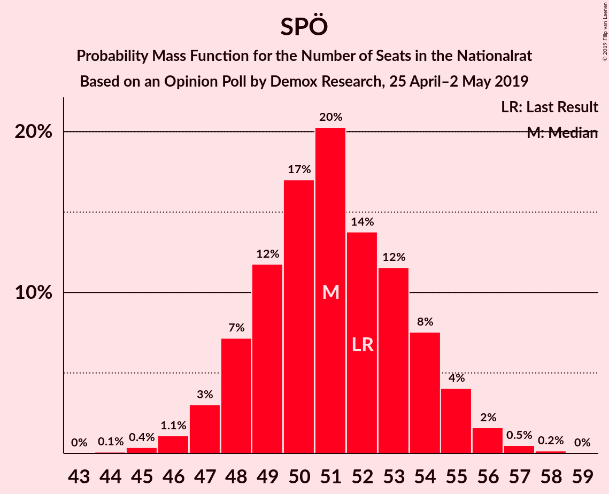

| Number of Seats | Probability | Accumulated | Special Marks |
|:---------------:|:-----------:|:-----------:|:-------------:|
| 44 | 0.1% | 100% |  |
| 45 | 0.4% | 99.9% |  |
| 46 | 1.1% | 99.5% |  |
| 47 | 3% | 98% |  |
| 48 | 7% | 95% |  |
| 49 | 12% | 88% |  |
| 50 | 17% | 76% |  |
| 51 | 20% | 59% | Median |
| 52 | 14% | 39% | Last Result |
| 53 | 12% | 25% |  |
| 54 | 8% | 14% |  |
| 55 | 4% | 6% |  |
| 56 | 2% | 2% |  |
| 57 | 0.5% | 0.7% |  |
| 58 | 0.2% | 0.2% |  |
| 59 | 0% | 0% |  |

## Technical Information

### Opinion Poll

+ **Polling firm:** Demox Research
+ **Commissioner(s):** —
+ **Fieldwork period:** 25 April–2 May 2019

### Calculations

+ **Sample size:** 1500
+ **Simulations done:** 1,048,576
+ **Error estimate:** 0.32%

