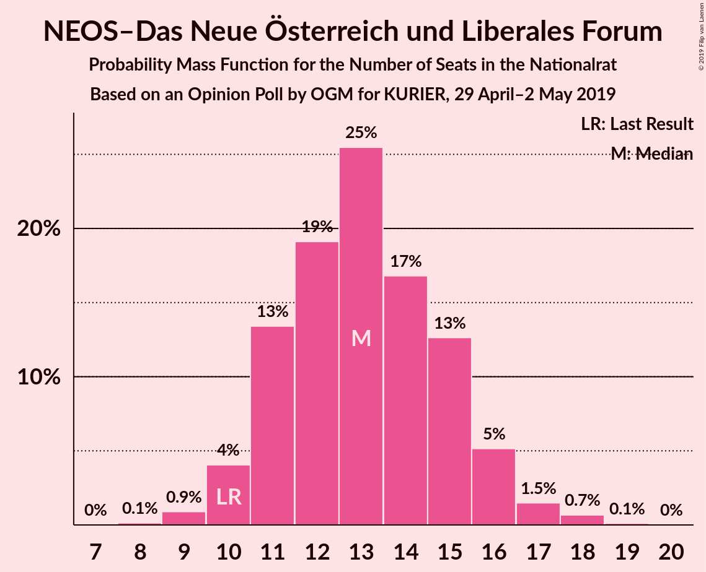
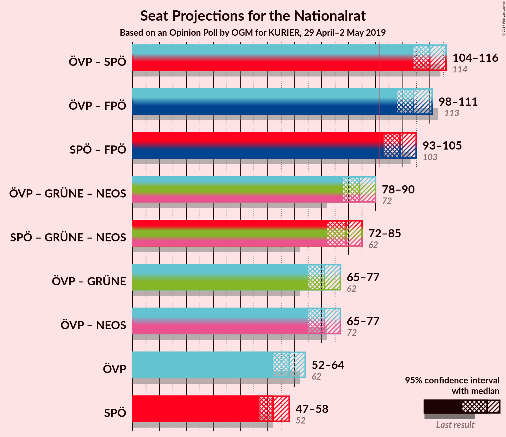
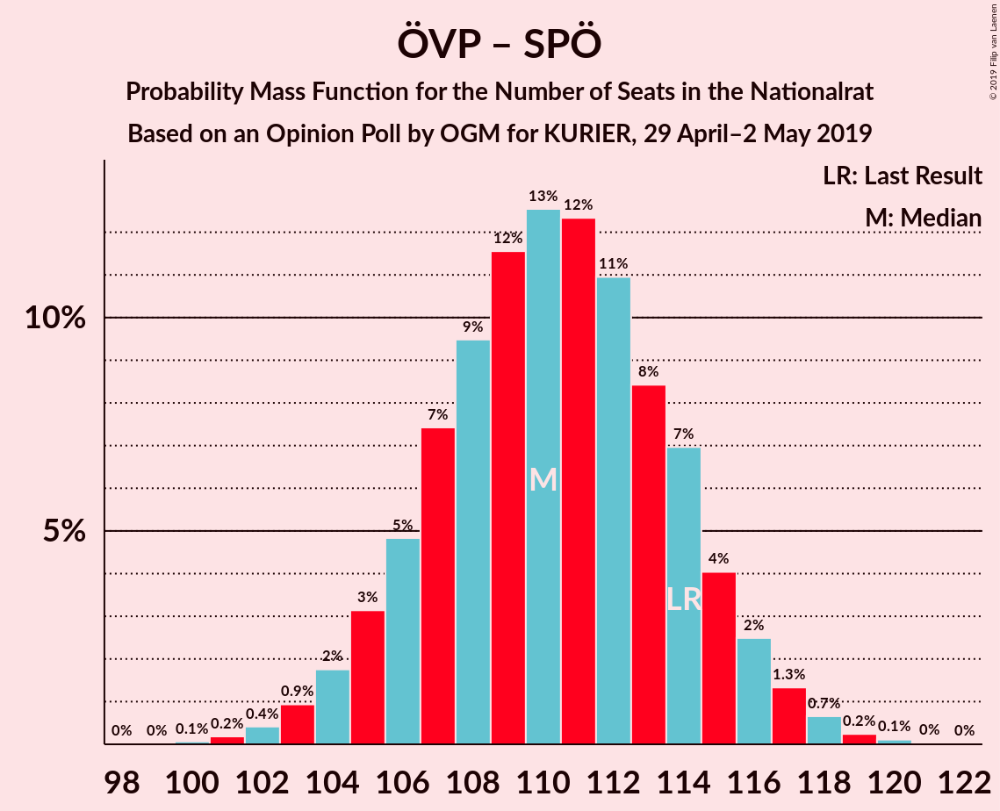
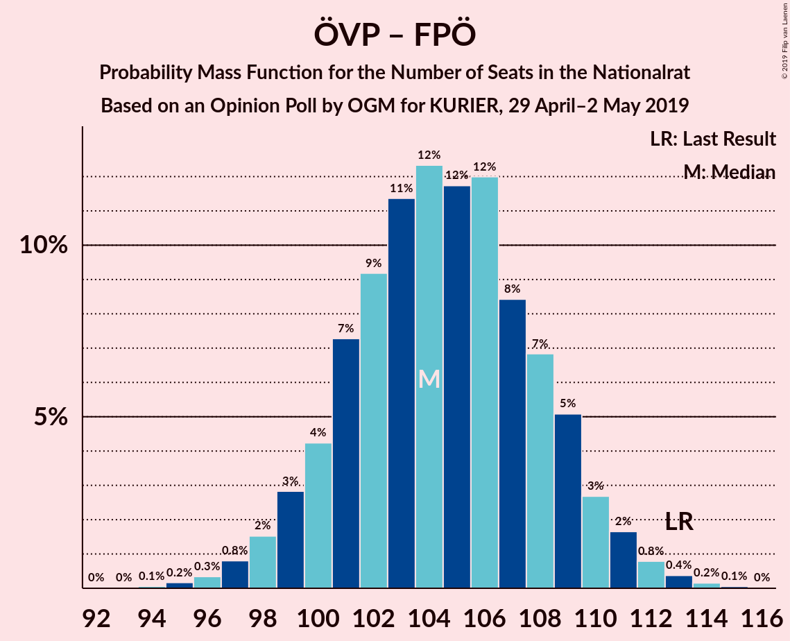

# Opinion Poll by OGM for KURIER, 29 April–2 May 2019

<a href="#voting-intentions">Voting Intentions</a> | <a href="#seats">Seats</a> | <a href="#coalitions">Coalitions</a> | <a href="#technical-information">Technical Information</a>

## Voting Intentions

### Confidence Intervals

| Party | Last Result | Poll Result | 80% Confidence Interval | 90% Confidence Interval | 95% Confidence Interval | 99% Confidence Interval |
|:-----:|:-----------:|:-----------:|:-----------------------:|:-----------------------:|:-----------------------:|:-----------------------:|
| Österreichische Volkspartei | 31.5% | 30.5% | 28.5–32.5% |28.0–33.1% |27.5–33.6% |26.6–34.6% |
| Sozialdemokratische Partei Österreichs | 26.9% | 27.6% | 25.7–29.6% |25.1–30.1% |24.7–30.7% |23.8–31.6% |
| Freiheitliche Partei Österreichs | 26.0% | 24.5% | 22.7–26.5% |22.2–27.0% |21.8–27.5% |20.9–28.5% |
| NEOS–Das Neue Österreich und Liberales Forum | 5.3% | 7.0% | 6.0–8.2% |5.7–8.6% |5.5–8.9% |5.0–9.5% |
| Die Grünen–Die Grüne Alternative | 3.8% | 7.0% | 6.0–8.2% |5.7–8.6% |5.5–8.9% |5.0–9.5% |
| JETZT–Liste Pilz | 4.4% | 1.5% | 1.1–2.2% |1.0–2.4% |0.9–2.6% |0.7–2.9% |

*Note:* The poll result column reflects the actual value used in the calculations. Published results may vary slightly, and in addition be rounded to fewer digits.

## Seats

### Confidence Intervals

| Party | Last Result | Median | 80% Confidence Interval | 90% Confidence Interval | 95% Confidence Interval | 99% Confidence Interval |
|:-----:|:-----------:|:------:|:-----------------------:|:-----------------------:|:-----------------------:|:-----------------------:|
| <a href="#österreichische-volkspartei">Österreichische Volkspartei</a> | 62 | 58 | 54–62 |53–63 |52–64 |50–66 |
| <a href="#sozialdemokratische-partei-österreichs">Sozialdemokratische Partei Österreichs</a> | 52 | 52 | 49–56 |48–57 |47–58 |45–60 |
| <a href="#freiheitliche-partei-österreichs">Freiheitliche Partei Österreichs</a> | 51 | 47 | 43–50 |42–51 |41–52 |40–54 |
| <a href="#neos–das-neue-österreich-und-liberales-forum">NEOS–Das Neue Österreich und Liberales Forum</a> | 10 | 13 | 11–15 |10–16 |10–16 |9–18 |
| <a href="#die-grünen–die-grüne-alternative">Die Grünen–Die Grüne Alternative</a> | 0 | 13 | 11–15 |10–16 |10–16 |9–18 |
| <a href="#jetzt–liste-pilz">JETZT–Liste Pilz</a> | 8 | 0 | 0 |0 |0 |0 |

### Österreichische Volkspartei

*For a full overview of the results for this party, see the [Österreichische Volkspartei](party-österreichischevolkspartei.html) page.*

| Number of Seats | Probability | Accumulated | Special Marks |
|:---------------:|:-----------:|:-----------:|:-------------:|
| 48 | 0% | 100% |  |
| 49 | 0.1% | 99.9% |  |
| 50 | 0.3% | 99.8% |  |
| 51 | 1.0% | 99.5% |  |
| 52 | 2% | 98.5% |  |
| 53 | 3% | 97% |  |
| 54 | 6% | 93% |  |
| 55 | 8% | 87% |  |
| 56 | 10% | 79% |  |
| 57 | 13% | 69% |  |
| 58 | 14% | 56% | Median |
| 59 | 13% | 41% |  |
| 60 | 9% | 28% |  |
| 61 | 8% | 19% |  |
| 62 | 5% | 11% | Last Result |
| 63 | 3% | 6% |  |
| 64 | 2% | 3% |  |
| 65 | 0.7% | 1.4% |  |
| 66 | 0.4% | 0.6% |  |
| 67 | 0.1% | 0.2% |  |
| 68 | 0.1% | 0.1% |  |
| 69 | 0% | 0% |  |

### Sozialdemokratische Partei Österreichs

*For a full overview of the results for this party, see the [Sozialdemokratische Partei Österreichs](party-sozialdemokratischeparteiösterreichs.html) page.*

| Number of Seats | Probability | Accumulated | Special Marks |
|:---------------:|:-----------:|:-----------:|:-------------:|
| 43 | 0.1% | 100% |  |
| 44 | 0.2% | 99.9% |  |
| 45 | 0.5% | 99.7% |  |
| 46 | 1.1% | 99.2% |  |
| 47 | 2% | 98% |  |
| 48 | 5% | 96% |  |
| 49 | 7% | 91% |  |
| 50 | 9% | 84% |  |
| 51 | 13% | 75% |  |
| 52 | 13% | 61% | Last Result, Median |
| 53 | 13% | 48% |  |
| 54 | 12% | 35% |  |
| 55 | 9% | 23% |  |
| 56 | 6% | 14% |  |
| 57 | 4% | 8% |  |
| 58 | 2% | 4% |  |
| 59 | 1.0% | 2% |  |
| 60 | 0.5% | 0.9% |  |
| 61 | 0.2% | 0.3% |  |
| 62 | 0.1% | 0.1% |  |
| 63 | 0% | 0% |  |

### Freiheitliche Partei Österreichs

*For a full overview of the results for this party, see the [Freiheitliche Partei Österreichs](party-freiheitlicheparteiösterreichs.html) page.*

| Number of Seats | Probability | Accumulated | Special Marks |
|:---------------:|:-----------:|:-----------:|:-------------:|
| 38 | 0.1% | 100% |  |
| 39 | 0.3% | 99.9% |  |
| 40 | 0.8% | 99.6% |  |
| 41 | 2% | 98.8% |  |
| 42 | 3% | 97% |  |
| 43 | 7% | 93% |  |
| 44 | 10% | 86% |  |
| 45 | 11% | 77% |  |
| 46 | 15% | 65% |  |
| 47 | 14% | 50% | Median |
| 48 | 13% | 37% |  |
| 49 | 9% | 24% |  |
| 50 | 7% | 15% |  |
| 51 | 4% | 8% | Last Result |
| 52 | 2% | 4% |  |
| 53 | 1.1% | 2% |  |
| 54 | 0.5% | 0.8% |  |
| 55 | 0.2% | 0.3% |  |
| 56 | 0.1% | 0.1% |  |
| 57 | 0% | 0% |  |

### NEOS–Das Neue Österreich und Liberales Forum

*For a full overview of the results for this party, see the [NEOS–Das Neue Österreich und Liberales Forum](party-neos–dasneueösterreichundliberalesforum.html) page.*

| Number of Seats | Probability | Accumulated | Special Marks |
|:---------------:|:-----------:|:-----------:|:-------------:|
| 8 | 0.1% | 100% |  |
| 9 | 0.8% | 99.9% |  |
| 10 | 4% | 99.0% | Last Result |
| 11 | 14% | 95% |  |
| 12 | 19% | 81% |  |
| 13 | 24% | 62% | Median |
| 14 | 18% | 38% |  |
| 15 | 13% | 20% |  |
| 16 | 5% | 7% |  |
| 17 | 2% | 2% |  |
| 18 | 0.7% | 0.8% |  |
| 19 | 0.1% | 0.1% |  |
| 20 | 0% | 0% |  |

### Die Grünen–Die Grüne Alternative

*For a full overview of the results for this party, see the [Die Grünen–Die Grüne Alternative](party-diegrünen–diegrünealternative.html) page.*

| Number of Seats | Probability | Accumulated | Special Marks |
|:---------------:|:-----------:|:-----------:|:-------------:|
| 0 | 0% | 100% | Last Result |
| 1 | 0% | 100% |  |
| 2 | 0% | 100% |  |
| 3 | 0% | 100% |  |
| 4 | 0% | 100% |  |
| 5 | 0% | 100% |  |
| 6 | 0% | 100% |  |
| 7 | 0% | 100% |  |
| 8 | 0.1% | 100% |  |
| 9 | 0.9% | 99.9% |  |
| 10 | 5% | 98.9% |  |
| 11 | 11% | 94% |  |
| 12 | 21% | 83% |  |
| 13 | 24% | 62% | Median |
| 14 | 19% | 38% |  |
| 15 | 11% | 19% |  |
| 16 | 5% | 8% |  |
| 17 | 2% | 2% |  |
| 18 | 0.6% | 0.7% |  |
| 19 | 0.1% | 0.1% |  |
| 20 | 0% | 0% |  |

### JETZT–Liste Pilz

*For a full overview of the results for this party, see the [JETZT–Liste Pilz](party-jetzt–listepilz.html) page.*

| Number of Seats | Probability | Accumulated | Special Marks |
|:---------------:|:-----------:|:-----------:|:-------------:|
| 0 | 100% | 100% | Median |
| 1 | 0% | 0% |  |
| 2 | 0% | 0% |  |
| 3 | 0% | 0% |  |
| 4 | 0% | 0% |  |
| 5 | 0% | 0% |  |
| 6 | 0% | 0% |  |
| 7 | 0% | 0% |  |
| 8 | 0% | 0% | Last Result |

## Coalitions

### Confidence Intervals

| Coalition | Last Result | Median | Majority? | 80% Confidence Interval | 90% Confidence Interval | 95% Confidence Interval | 99% Confidence Interval |
|:---------:|:-----------:|:------:|:---------:|:-----------------------:|:-----------------------:|:-----------------------:|:-----------------------:|
| Österreichische Volkspartei – Sozialdemokratische Partei Österreichs | 114 | 110 | 100% | 106–114 | 105–116 | 104–117 | 102–118 |
| Österreichische Volkspartei – Freiheitliche Partei Österreichs | 113 | 104 | 100% | 100–109 | 99–110 | 98–111 | 96–113 |
| Sozialdemokratische Partei Österreichs – Freiheitliche Partei Österreichs | 103 | 99 | 99.1% | 95–103 | 94–104 | 93–105 | 91–107 |
| Österreichische Volkspartei | 62 | 58 | 0% | 54–62 | 53–63 | 52–64 | 50–66 |
| Sozialdemokratische Partei Österreichs | 52 | 52 | 0% | 49–56 | 48–57 | 47–58 | 45–60 |

### Österreichische Volkspartei – Sozialdemokratische Partei Österreichs

| Number of Seats | Probability | Accumulated | Special Marks |
|:---------------:|:-----------:|:-----------:|:-------------:|
| 100 | 0.1% | 100% |  |
| 101 | 0.2% | 99.9% |  |
| 102 | 0.4% | 99.7% |  |
| 103 | 0.9% | 99.3% |  |
| 104 | 2% | 98% |  |
| 105 | 3% | 97% |  |
| 106 | 5% | 93% |  |
| 107 | 8% | 89% |  |
| 108 | 9% | 81% |  |
| 109 | 11% | 72% |  |
| 110 | 14% | 61% | Median |
| 111 | 11% | 47% |  |
| 112 | 11% | 36% |  |
| 113 | 9% | 24% |  |
| 114 | 7% | 16% | Last Result |
| 115 | 4% | 9% |  |
| 116 | 3% | 5% |  |
| 117 | 1.5% | 3% |  |
| 118 | 0.6% | 1.1% |  |
| 119 | 0.2% | 0.4% |  |
| 120 | 0.1% | 0.2% |  |
| 121 | 0% | 0.1% |  |
| 122 | 0% | 0% |  |

### Österreichische Volkspartei – Freiheitliche Partei Österreichs

| Number of Seats | Probability | Accumulated | Special Marks |
|:---------------:|:-----------:|:-----------:|:-------------:|
| 94 | 0.1% | 100% |  |
| 95 | 0.2% | 99.9% |  |
| 96 | 0.3% | 99.7% |  |
| 97 | 0.7% | 99.4% |  |
| 98 | 1.4% | 98.7% |  |
| 99 | 3% | 97% |  |
| 100 | 5% | 94% |  |
| 101 | 7% | 90% |  |
| 102 | 9% | 82% |  |
| 103 | 11% | 74% |  |
| 104 | 13% | 63% |  |
| 105 | 11% | 49% | Median |
| 106 | 12% | 38% |  |
| 107 | 8% | 26% |  |
| 108 | 6% | 17% |  |
| 109 | 5% | 11% |  |
| 110 | 3% | 6% |  |
| 111 | 2% | 3% |  |
| 112 | 0.7% | 1.3% |  |
| 113 | 0.4% | 0.6% | Last Result |
| 114 | 0.1% | 0.2% |  |
| 115 | 0.1% | 0.1% |  |
| 116 | 0% | 0% |  |

### Sozialdemokratische Partei Österreichs – Freiheitliche Partei Österreichs

| Number of Seats | Probability | Accumulated | Special Marks |
|:---------------:|:-----------:|:-----------:|:-------------:|
| 88 | 0% | 100% |  |
| 89 | 0.1% | 99.9% |  |
| 90 | 0.2% | 99.8% |  |
| 91 | 0.5% | 99.6% |  |
| 92 | 1.2% | 99.1% | Majority |
| 93 | 2% | 98% |  |
| 94 | 4% | 95% |  |
| 95 | 6% | 91% |  |
| 96 | 7% | 86% |  |
| 97 | 9% | 78% |  |
| 98 | 11% | 70% |  |
| 99 | 14% | 58% | Median |
| 100 | 13% | 44% |  |
| 101 | 11% | 31% |  |
| 102 | 7% | 20% |  |
| 103 | 4% | 12% | Last Result |
| 104 | 3% | 8% |  |
| 105 | 2% | 5% |  |
| 106 | 1.3% | 2% |  |
| 107 | 0.6% | 1.0% |  |
| 108 | 0.3% | 0.4% |  |
| 109 | 0.1% | 0.1% |  |
| 110 | 0% | 0% |  |

### Österreichische Volkspartei

| Number of Seats | Probability | Accumulated | Special Marks |
|:---------------:|:-----------:|:-----------:|:-------------:|
| 48 | 0% | 100% |  |
| 49 | 0.1% | 99.9% |  |
| 50 | 0.3% | 99.8% |  |
| 51 | 1.0% | 99.5% |  |
| 52 | 2% | 98.5% |  |
| 53 | 3% | 97% |  |
| 54 | 6% | 93% |  |
| 55 | 8% | 87% |  |
| 56 | 10% | 79% |  |
| 57 | 13% | 69% |  |
| 58 | 14% | 56% | Median |
| 59 | 13% | 41% |  |
| 60 | 9% | 28% |  |
| 61 | 8% | 19% |  |
| 62 | 5% | 11% | Last Result |
| 63 | 3% | 6% |  |
| 64 | 2% | 3% |  |
| 65 | 0.7% | 1.4% |  |
| 66 | 0.4% | 0.6% |  |
| 67 | 0.1% | 0.2% |  |
| 68 | 0.1% | 0.1% |  |
| 69 | 0% | 0% |  |

### Sozialdemokratische Partei Österreichs

| Number of Seats | Probability | Accumulated | Special Marks |
|:---------------:|:-----------:|:-----------:|:-------------:|
| 43 | 0.1% | 100% |  |
| 44 | 0.2% | 99.9% |  |
| 45 | 0.5% | 99.7% |  |
| 46 | 1.1% | 99.2% |  |
| 47 | 2% | 98% |  |
| 48 | 5% | 96% |  |
| 49 | 7% | 91% |  |
| 50 | 9% | 84% |  |
| 51 | 13% | 75% |  |
| 52 | 13% | 61% | Last Result, Median |
| 53 | 13% | 48% |  |
| 54 | 12% | 35% |  |
| 55 | 9% | 23% |  |
| 56 | 6% | 14% |  |
| 57 | 4% | 8% |  |
| 58 | 2% | 4% |  |
| 59 | 1.0% | 2% |  |
| 60 | 0.5% | 0.9% |  |
| 61 | 0.2% | 0.3% |  |
| 62 | 0.1% | 0.1% |  |
| 63 | 0% | 0% |  |

## Technical Information

### Opinion Poll

+ **Polling firm:** OGM
+ **Commissioner(s):** KURIER
+ **Fieldwork period:** 29 April–2 May 2019

### Calculations

+ **Sample size:** 860
+ **Simulations done:** 524,288
+ **Error estimate:** 0.55%

