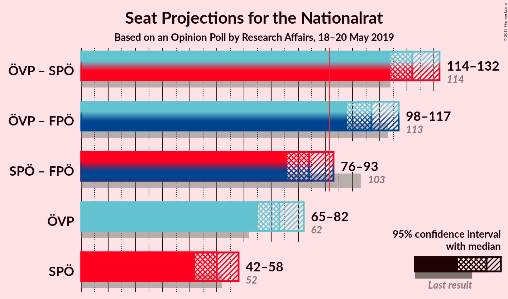

# Opinion Poll by Research Affairs, 18–20 May 2019

<a href="#voting-intentions">Voting Intentions</a> | <a href="#seats">Seats</a> | <a href="#coalitions">Coalitions</a> | <a href="#technical-information">Technical Information</a>

## Voting Intentions

### Confidence Intervals

| Party | Last Result | Poll Result | 80% Confidence Interval | 90% Confidence Interval | 95% Confidence Interval | 99% Confidence Interval |
|:-----:|:-----------:|:-----------:|:-----------------------:|:-----------------------:|:-----------------------:|:-----------------------:|
| Österreichische Volkspartei | 31.5% | 38.0% | 35.3–40.8% |34.5–41.6% |33.9–42.3% |32.6–43.7% |
| Sozialdemokratische Partei Österreichs | 26.9% | 26.0% | 23.6–28.6% |22.9–29.4% |22.3–30.0% |21.2–31.3% |
| Freiheitliche Partei Österreichs | 26.0% | 18.0% | 15.9–20.4% |15.4–21.0% |14.9–21.6% |13.9–22.8% |
| NEOS–Das Neue Österreich und Liberales Forum | 5.3% | 9.0% | 7.5–10.9% |7.1–11.4% |6.8–11.8% |6.2–12.8% |
| Die Grünen–Die Grüne Alternative | 3.8% | 5.0% | 3.9–6.5% |3.7–6.9% |3.4–7.3% |3.0–8.1% |
| JETZT–Liste Pilz | 4.4% | 2.0% | 1.4–3.1% |1.2–3.4% |1.1–3.6% |0.9–4.2% |

*Note:* The poll result column reflects the actual value used in the calculations. Published results may vary slightly, and in addition be rounded to fewer digits.

## Seats

### Confidence Intervals

| Party | Last Result | Median | 80% Confidence Interval | 90% Confidence Interval | 95% Confidence Interval | 99% Confidence Interval |
|:-----:|:-----------:|:------:|:-----------------------:|:-----------------------:|:-----------------------:|:-----------------------:|
| <a href="#österreichische-volkspartei">Österreichische Volkspartei</a> | 62 | 73 | 68–77 |67–78 |66–79 |62–82 |
| <a href="#sozialdemokratische-partei-österreichs">Sozialdemokratische Partei Österreichs</a> | 52 | 50 | 45–55 |43–56 |43–57 |41–60 |
| <a href="#freiheitliche-partei-österreichs">Freiheitliche Partei Österreichs</a> | 51 | 35 | 31–39 |29–40 |29–40 |27–44 |
| <a href="#neos–das-neue-österreich-und-liberales-forum">NEOS–Das Neue Österreich und Liberales Forum</a> | 10 | 16 | 14–21 |13–21 |13–22 |12–23 |
| <a href="#die-grünen–die-grüne-alternative">Die Grünen–Die Grüne Alternative</a> | 0 | 9 | 7–12 |0–13 |0–13 |0–14 |
| <a href="#jetzt–liste-pilz">JETZT–Liste Pilz</a> | 8 | 0 | 0 |0 |0 |0–7 |

### Österreichische Volkspartei

*For a full overview of the results for this party, see the [Österreichische Volkspartei](party-österreichischevolkspartei.html) page.*

| Number of Seats | Probability | Accumulated | Special Marks |
|:---------------:|:-----------:|:-----------:|:-------------:|
| 59 | 0% | 100% |  |
| 60 | 0.1% | 99.9% |  |
| 61 | 0.2% | 99.8% |  |
| 62 | 0.3% | 99.6% | Last Result |
| 63 | 0.4% | 99.3% |  |
| 64 | 0.7% | 98.9% |  |
| 65 | 0.4% | 98% |  |
| 66 | 1.0% | 98% |  |
| 67 | 2% | 97% |  |
| 68 | 6% | 94% |  |
| 69 | 4% | 88% |  |
| 70 | 3% | 84% |  |
| 71 | 4% | 81% |  |
| 72 | 20% | 77% |  |
| 73 | 13% | 57% | Median |
| 74 | 9% | 44% |  |
| 75 | 8% | 35% |  |
| 76 | 10% | 27% |  |
| 77 | 12% | 18% |  |
| 78 | 3% | 6% |  |
| 79 | 0.5% | 3% |  |
| 80 | 0.6% | 2% |  |
| 81 | 0.7% | 2% |  |
| 82 | 0.6% | 1.0% |  |
| 83 | 0.2% | 0.4% |  |
| 84 | 0% | 0.2% |  |
| 85 | 0% | 0.2% |  |
| 86 | 0% | 0.2% |  |
| 87 | 0.1% | 0.1% |  |
| 88 | 0% | 0.1% |  |
| 89 | 0% | 0% |  |

### Sozialdemokratische Partei Österreichs

*For a full overview of the results for this party, see the [Sozialdemokratische Partei Österreichs](party-sozialdemokratischeparteiösterreichs.html) page.*

| Number of Seats | Probability | Accumulated | Special Marks |
|:---------------:|:-----------:|:-----------:|:-------------:|
| 38 | 0.1% | 100% |  |
| 39 | 0.1% | 99.9% |  |
| 40 | 0.1% | 99.8% |  |
| 41 | 0.7% | 99.7% |  |
| 42 | 0.2% | 99.0% |  |
| 43 | 4% | 98.8% |  |
| 44 | 0.5% | 95% |  |
| 45 | 9% | 94% |  |
| 46 | 4% | 85% |  |
| 47 | 6% | 82% |  |
| 48 | 17% | 76% |  |
| 49 | 5% | 59% |  |
| 50 | 19% | 55% | Median |
| 51 | 2% | 36% |  |
| 52 | 14% | 34% | Last Result |
| 53 | 4% | 20% |  |
| 54 | 4% | 16% |  |
| 55 | 7% | 12% |  |
| 56 | 0.5% | 5% |  |
| 57 | 3% | 5% |  |
| 58 | 0.5% | 2% |  |
| 59 | 0.5% | 1.3% |  |
| 60 | 0.4% | 0.8% |  |
| 61 | 0.1% | 0.4% |  |
| 62 | 0.2% | 0.3% |  |
| 63 | 0% | 0% |  |

### Freiheitliche Partei Österreichs

*For a full overview of the results for this party, see the [Freiheitliche Partei Österreichs](party-freiheitlicheparteiösterreichs.html) page.*

| Number of Seats | Probability | Accumulated | Special Marks |
|:---------------:|:-----------:|:-----------:|:-------------:|
| 25 | 0.2% | 100% |  |
| 26 | 0.2% | 99.8% |  |
| 27 | 0.9% | 99.6% |  |
| 28 | 0.8% | 98.7% |  |
| 29 | 6% | 98% |  |
| 30 | 1.4% | 92% |  |
| 31 | 6% | 91% |  |
| 32 | 7% | 84% |  |
| 33 | 21% | 77% |  |
| 34 | 2% | 56% |  |
| 35 | 17% | 54% | Median |
| 36 | 7% | 37% |  |
| 37 | 15% | 30% |  |
| 38 | 4% | 15% |  |
| 39 | 5% | 11% |  |
| 40 | 4% | 6% |  |
| 41 | 0.2% | 2% |  |
| 42 | 0.4% | 2% |  |
| 43 | 1.0% | 2% |  |
| 44 | 0.4% | 0.5% |  |
| 45 | 0% | 0.1% |  |
| 46 | 0% | 0.1% |  |
| 47 | 0% | 0% |  |
| 48 | 0% | 0% |  |
| 49 | 0% | 0% |  |
| 50 | 0% | 0% |  |
| 51 | 0% | 0% | Last Result |

### NEOS–Das Neue Österreich und Liberales Forum

*For a full overview of the results for this party, see the [NEOS–Das Neue Österreich und Liberales Forum](party-neos–dasneueösterreichundliberalesforum.html) page.*

| Number of Seats | Probability | Accumulated | Special Marks |
|:---------------:|:-----------:|:-----------:|:-------------:|
| 10 | 0% | 100% | Last Result |
| 11 | 0.1% | 100% |  |
| 12 | 0.9% | 99.8% |  |
| 13 | 5% | 98.9% |  |
| 14 | 11% | 94% |  |
| 15 | 31% | 83% |  |
| 16 | 11% | 52% | Median |
| 17 | 10% | 41% |  |
| 18 | 2% | 30% |  |
| 19 | 10% | 29% |  |
| 20 | 6% | 19% |  |
| 21 | 10% | 13% |  |
| 22 | 2% | 3% |  |
| 23 | 0.6% | 1.1% |  |
| 24 | 0.1% | 0.4% |  |
| 25 | 0.2% | 0.4% |  |
| 26 | 0% | 0.1% |  |
| 27 | 0.1% | 0.1% |  |
| 28 | 0% | 0% |  |

### Die Grünen–Die Grüne Alternative

*For a full overview of the results for this party, see the [Die Grünen–Die Grüne Alternative](party-diegrünen–diegrünealternative.html) page.*

| Number of Seats | Probability | Accumulated | Special Marks |
|:---------------:|:-----------:|:-----------:|:-------------:|
| 0 | 6% | 100% | Last Result |
| 1 | 0% | 94% |  |
| 2 | 0% | 94% |  |
| 3 | 0% | 94% |  |
| 4 | 0% | 94% |  |
| 5 | 0% | 94% |  |
| 6 | 0% | 94% |  |
| 7 | 10% | 94% |  |
| 8 | 32% | 83% |  |
| 9 | 21% | 51% | Median |
| 10 | 2% | 30% |  |
| 11 | 5% | 28% |  |
| 12 | 16% | 23% |  |
| 13 | 6% | 7% |  |
| 14 | 0.5% | 0.9% |  |
| 15 | 0.3% | 0.4% |  |
| 16 | 0.1% | 0.1% |  |
| 17 | 0% | 0% |  |

### JETZT–Liste Pilz

*For a full overview of the results for this party, see the [JETZT–Liste Pilz](party-jetzt–listepilz.html) page.*

| Number of Seats | Probability | Accumulated | Special Marks |
|:---------------:|:-----------:|:-----------:|:-------------:|
| 0 | 99.5% | 100% | Median |
| 1 | 0% | 0.5% |  |
| 2 | 0% | 0.5% |  |
| 3 | 0% | 0.5% |  |
| 4 | 0% | 0.5% |  |
| 5 | 0% | 0.5% |  |
| 6 | 0% | 0.5% |  |
| 7 | 0.3% | 0.5% |  |
| 8 | 0.2% | 0.2% | Last Result |
| 9 | 0.1% | 0.1% |  |
| 10 | 0% | 0% |  |

## Coalitions

### Confidence Intervals

| Coalition | Last Result | Median | Majority? | 80% Confidence Interval | 90% Confidence Interval | 95% Confidence Interval | 99% Confidence Interval |
|:---------:|:-----------:|:------:|:---------:|:-----------------------:|:-----------------------:|:-----------------------:|:-----------------------:|
| Österreichische Volkspartei – Sozialdemokratische Partei Österreichs | 114 | 123 | 100% | 121–125 | 120–126 | 115–127 | 111–132 |
| Österreichische Volkspartei – Freiheitliche Partei Österreichs | 113 | 108 | 100% | 101–113 | 101–115 | 98–117 | 95–121 |
| Sozialdemokratische Partei Österreichs – Freiheitliche Partei Österreichs | 103 | 86 | 6% | 80–89 | 76–92 | 75–92 | 74–94 |
| Österreichische Volkspartei | 62 | 73 | 0% | 68–77 | 67–78 | 66–79 | 62–82 |
| Sozialdemokratische Partei Österreichs | 52 | 50 | 0% | 45–55 | 43–56 | 43–57 | 41–60 |

### Österreichische Volkspartei – Sozialdemokratische Partei Österreichs

| Number of Seats | Probability | Accumulated | Special Marks |
|:---------------:|:-----------:|:-----------:|:-------------:|
| 108 | 0% | 100% |  |
| 109 | 0.1% | 99.9% |  |
| 110 | 0.3% | 99.8% |  |
| 111 | 0.6% | 99.5% |  |
| 112 | 0.4% | 98.9% |  |
| 113 | 0.4% | 98% |  |
| 114 | 0.5% | 98% | Last Result |
| 115 | 0.2% | 98% |  |
| 116 | 0.1% | 97% |  |
| 117 | 0.1% | 97% |  |
| 118 | 0.1% | 97% |  |
| 119 | 0.5% | 97% |  |
| 120 | 3% | 97% |  |
| 121 | 14% | 94% |  |
| 122 | 15% | 79% |  |
| 123 | 29% | 64% | Median |
| 124 | 15% | 35% |  |
| 125 | 12% | 21% |  |
| 126 | 5% | 8% |  |
| 127 | 2% | 3% |  |
| 128 | 0.2% | 0.9% |  |
| 129 | 0.1% | 0.6% |  |
| 130 | 0% | 0.6% |  |
| 131 | 0% | 0.5% |  |
| 132 | 0% | 0.5% |  |
| 133 | 0% | 0.5% |  |
| 134 | 0.1% | 0.5% |  |
| 135 | 0% | 0.4% |  |
| 136 | 0.1% | 0.4% |  |
| 137 | 0% | 0.3% |  |
| 138 | 0% | 0.3% |  |
| 139 | 0.2% | 0.2% |  |
| 140 | 0% | 0.1% |  |
| 141 | 0% | 0% |  |

### Österreichische Volkspartei – Freiheitliche Partei Österreichs

| Number of Seats | Probability | Accumulated | Special Marks |
|:---------------:|:-----------:|:-----------:|:-------------:|
| 92 | 0% | 100% | Majority |
| 93 | 0% | 99.9% |  |
| 94 | 0.1% | 99.9% |  |
| 95 | 0.5% | 99.8% |  |
| 96 | 0.3% | 99.3% |  |
| 97 | 0.2% | 99.0% |  |
| 98 | 3% | 98.8% |  |
| 99 | 0.8% | 96% |  |
| 100 | 0.1% | 95% |  |
| 101 | 9% | 95% |  |
| 102 | 3% | 86% |  |
| 103 | 0.3% | 83% |  |
| 104 | 7% | 83% |  |
| 105 | 3% | 76% |  |
| 106 | 2% | 73% |  |
| 107 | 19% | 71% |  |
| 108 | 11% | 52% | Median |
| 109 | 2% | 40% |  |
| 110 | 14% | 38% |  |
| 111 | 7% | 23% |  |
| 112 | 0.1% | 16% |  |
| 113 | 9% | 16% | Last Result |
| 114 | 1.3% | 7% |  |
| 115 | 2% | 6% |  |
| 116 | 0.3% | 4% |  |
| 117 | 2% | 4% |  |
| 118 | 0% | 2% |  |
| 119 | 0.1% | 2% |  |
| 120 | 0% | 2% |  |
| 121 | 1.2% | 2% |  |
| 122 | 0% | 0.3% |  |
| 123 | 0.2% | 0.3% |  |
| 124 | 0.2% | 0.2% |  |
| 125 | 0% | 0% |  |

### Sozialdemokratische Partei Österreichs – Freiheitliche Partei Österreichs

| Number of Seats | Probability | Accumulated | Special Marks |
|:---------------:|:-----------:|:-----------:|:-------------:|
| 70 | 0.1% | 100% |  |
| 71 | 0% | 99.9% |  |
| 72 | 0.1% | 99.9% |  |
| 73 | 0% | 99.7% |  |
| 74 | 1.0% | 99.7% |  |
| 75 | 2% | 98.7% |  |
| 76 | 2% | 97% |  |
| 77 | 0.3% | 95% |  |
| 78 | 0.3% | 95% |  |
| 79 | 0.4% | 94% |  |
| 80 | 9% | 94% |  |
| 81 | 22% | 85% |  |
| 82 | 9% | 63% |  |
| 83 | 1.0% | 55% |  |
| 84 | 0.3% | 54% |  |
| 85 | 2% | 54% | Median |
| 86 | 10% | 51% |  |
| 87 | 22% | 42% |  |
| 88 | 7% | 19% |  |
| 89 | 3% | 12% |  |
| 90 | 0.9% | 8% |  |
| 91 | 1.0% | 7% |  |
| 92 | 4% | 6% | Majority |
| 93 | 1.4% | 2% |  |
| 94 | 0.3% | 0.7% |  |
| 95 | 0.3% | 0.4% |  |
| 96 | 0% | 0.2% |  |
| 97 | 0% | 0.1% |  |
| 98 | 0% | 0.1% |  |
| 99 | 0% | 0.1% |  |
| 100 | 0% | 0% |  |
| 101 | 0% | 0% |  |
| 102 | 0% | 0% |  |
| 103 | 0% | 0% | Last Result |

### Österreichische Volkspartei

| Number of Seats | Probability | Accumulated | Special Marks |
|:---------------:|:-----------:|:-----------:|:-------------:|
| 59 | 0% | 100% |  |
| 60 | 0.1% | 99.9% |  |
| 61 | 0.2% | 99.8% |  |
| 62 | 0.3% | 99.6% | Last Result |
| 63 | 0.4% | 99.3% |  |
| 64 | 0.7% | 98.9% |  |
| 65 | 0.4% | 98% |  |
| 66 | 1.0% | 98% |  |
| 67 | 2% | 97% |  |
| 68 | 6% | 94% |  |
| 69 | 4% | 88% |  |
| 70 | 3% | 84% |  |
| 71 | 4% | 81% |  |
| 72 | 20% | 77% |  |
| 73 | 13% | 57% | Median |
| 74 | 9% | 44% |  |
| 75 | 8% | 35% |  |
| 76 | 10% | 27% |  |
| 77 | 12% | 18% |  |
| 78 | 3% | 6% |  |
| 79 | 0.5% | 3% |  |
| 80 | 0.6% | 2% |  |
| 81 | 0.7% | 2% |  |
| 82 | 0.6% | 1.0% |  |
| 83 | 0.2% | 0.4% |  |
| 84 | 0% | 0.2% |  |
| 85 | 0% | 0.2% |  |
| 86 | 0% | 0.2% |  |
| 87 | 0.1% | 0.1% |  |
| 88 | 0% | 0.1% |  |
| 89 | 0% | 0% |  |

### Sozialdemokratische Partei Österreichs

| Number of Seats | Probability | Accumulated | Special Marks |
|:---------------:|:-----------:|:-----------:|:-------------:|
| 38 | 0.1% | 100% |  |
| 39 | 0.1% | 99.9% |  |
| 40 | 0.1% | 99.8% |  |
| 41 | 0.7% | 99.7% |  |
| 42 | 0.2% | 99.0% |  |
| 43 | 4% | 98.8% |  |
| 44 | 0.5% | 95% |  |
| 45 | 9% | 94% |  |
| 46 | 4% | 85% |  |
| 47 | 6% | 82% |  |
| 48 | 17% | 76% |  |
| 49 | 5% | 59% |  |
| 50 | 19% | 55% | Median |
| 51 | 2% | 36% |  |
| 52 | 14% | 34% | Last Result |
| 53 | 4% | 20% |  |
| 54 | 4% | 16% |  |
| 55 | 7% | 12% |  |
| 56 | 0.5% | 5% |  |
| 57 | 3% | 5% |  |
| 58 | 0.5% | 2% |  |
| 59 | 0.5% | 1.3% |  |
| 60 | 0.4% | 0.8% |  |
| 61 | 0.1% | 0.4% |  |
| 62 | 0.2% | 0.3% |  |
| 63 | 0% | 0% |  |

## Technical Information

### Opinion Poll

+ **Polling firm:** Research Affairs
+ **Commissioner(s):** —
+ **Fieldwork period:** 18–20 May 2019

### Calculations

+ **Sample size:** 500
+ **Simulations done:** 16,384
+ **Error estimate:** 1.33%

