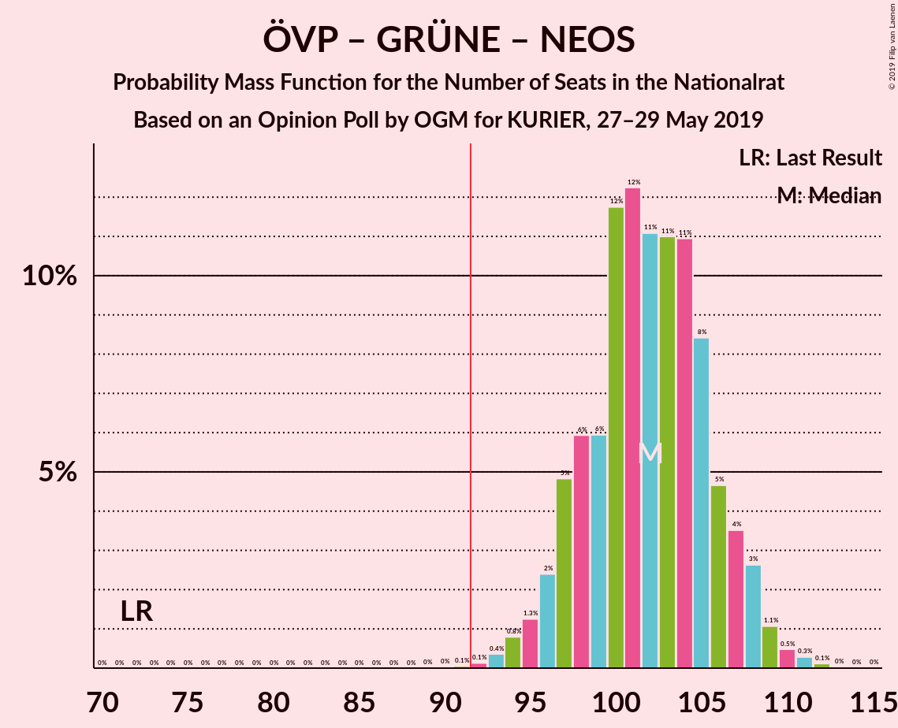

# Opinion Poll by OGM for KURIER, 27–29 May 2019

<a href="#voting-intentions">Voting Intentions</a> | <a href="#seats">Seats</a> | <a href="#coalitions">Coalitions</a> | <a href="#technical-information">Technical Information</a>

## Voting Intentions

### Confidence Intervals

| Party | Last Result | Poll Result | 80% Confidence Interval | 90% Confidence Interval | 95% Confidence Interval | 99% Confidence Interval |
|:-----:|:-----------:|:-----------:|:-----------------------:|:-----------------------:|:-----------------------:|:-----------------------:|
| Österreichische Volkspartei | 31.5% | 36.0% | 33.9–38.2% |33.3–38.9% |32.8–39.4% |31.8–40.5% |
| Sozialdemokratische Partei Österreichs | 26.9% | 22.0% | 20.2–23.9% |19.7–24.5% |19.3–25.0% |18.4–25.9% |
| Freiheitliche Partei Österreichs | 26.0% | 21.0% | 19.2–22.9% |18.7–23.5% |18.3–23.9% |17.5–24.9% |
| Die Grünen–Die Grüne Alternative | 3.8% | 10.1% | 8.8–11.6% |8.5–12.0% |8.2–12.3% |7.6–13.1% |
| NEOS–Das Neue Österreich und Liberales Forum | 5.3% | 8.0% | 6.8–9.3% |6.5–9.7% |6.3–10.0% |5.8–10.7% |
| JETZT–Liste Pilz | 4.4% | 1.5% | 1.1–2.2% |0.9–2.4% |0.9–2.6% |0.7–3.0% |

*Note:* The poll result column reflects the actual value used in the calculations. Published results may vary slightly, and in addition be rounded to fewer digits.

## Seats

### Confidence Intervals

| Party | Last Result | Median | 80% Confidence Interval | 90% Confidence Interval | 95% Confidence Interval | 99% Confidence Interval |
|:-----:|:-----------:|:------:|:-----------------------:|:-----------------------:|:-----------------------:|:-----------------------:|
| <a href="#österreichische-volkspartei">Österreichische Volkspartei</a> | 62 | 69 | 67–70 |67–72 |67–76 |61–76 |
| <a href="#sozialdemokratische-partei-österreichs">Sozialdemokratische Partei Österreichs</a> | 52 | 40 | 40–41 |39–41 |36–43 |35–47 |
| <a href="#freiheitliche-partei-österreichs">Freiheitliche Partei Österreichs</a> | 51 | 39 | 36–40 |36–40 |36–40 |36–45 |
| <a href="#die-grünen–die-grüne-alternative">Die Grünen–Die Grüne Alternative</a> | 0 | 20 | 18–23 |16–23 |16–23 |15–25 |
| <a href="#neos–das-neue-österreich-und-liberales-forum">NEOS–Das Neue Österreich und Liberales Forum</a> | 10 | 15 | 13–18 |13–18 |13–18 |11–20 |
| <a href="#jetzt–liste-pilz">JETZT–Liste Pilz</a> | 8 | 0 | 0 |0 |0 |0 |

### Österreichische Volkspartei

*For a full overview of the results for this party, see the [Österreichische Volkspartei](party-österreichischevolkspartei.html) page.*

| Number of Seats | Probability | Accumulated | Special Marks |
|:---------------:|:-----------:|:-----------:|:-------------:|
| 59 | 0.1% | 100% |  |
| 60 | 0% | 99.9% |  |
| 61 | 0.7% | 99.9% |  |
| 62 | 0% | 99.2% | Last Result |
| 63 | 0.1% | 99.2% |  |
| 64 | 0.4% | 99.1% |  |
| 65 | 0.1% | 98.7% |  |
| 66 | 0% | 98.6% |  |
| 67 | 49% | 98.6% |  |
| 68 | 0% | 50% |  |
| 69 | 2% | 50% | Median |
| 70 | 43% | 49% |  |
| 71 | 0% | 5% |  |
| 72 | 0.5% | 5% |  |
| 73 | 0% | 4% |  |
| 74 | 0% | 4% |  |
| 75 | 0.1% | 4% |  |
| 76 | 4% | 4% |  |
| 77 | 0% | 0% |  |

### Sozialdemokratische Partei Österreichs

*For a full overview of the results for this party, see the [Sozialdemokratische Partei Österreichs](party-sozialdemokratischeparteiösterreichs.html) page.*

| Number of Seats | Probability | Accumulated | Special Marks |
|:---------------:|:-----------:|:-----------:|:-------------:|
| 33 | 0.1% | 100% |  |
| 34 | 0% | 99.9% |  |
| 35 | 0.4% | 99.9% |  |
| 36 | 4% | 99.4% |  |
| 37 | 0% | 95% |  |
| 38 | 0% | 95% |  |
| 39 | 1.1% | 95% |  |
| 40 | 47% | 94% | Median |
| 41 | 43% | 47% |  |
| 42 | 0.4% | 3% |  |
| 43 | 2% | 3% |  |
| 44 | 0.1% | 1.5% |  |
| 45 | 0.7% | 1.4% |  |
| 46 | 0.1% | 0.7% |  |
| 47 | 0.4% | 0.6% |  |
| 48 | 0% | 0.2% |  |
| 49 | 0.2% | 0.2% |  |
| 50 | 0% | 0% |  |
| 51 | 0% | 0% |  |
| 52 | 0% | 0% | Last Result |

### Freiheitliche Partei Österreichs

*For a full overview of the results for this party, see the [Freiheitliche Partei Österreichs](party-freiheitlicheparteiösterreichs.html) page.*

| Number of Seats | Probability | Accumulated | Special Marks |
|:---------------:|:-----------:|:-----------:|:-------------:|
| 33 | 0.3% | 100% |  |
| 34 | 0% | 99.7% |  |
| 35 | 0% | 99.7% |  |
| 36 | 45% | 99.7% |  |
| 37 | 0.8% | 55% |  |
| 38 | 0% | 54% |  |
| 39 | 4% | 54% | Median |
| 40 | 49% | 50% |  |
| 41 | 0% | 0.7% |  |
| 42 | 0% | 0.7% |  |
| 43 | 0.1% | 0.7% |  |
| 44 | 0% | 0.5% |  |
| 45 | 0.3% | 0.5% |  |
| 46 | 0% | 0.2% |  |
| 47 | 0% | 0.2% |  |
| 48 | 0.1% | 0.2% |  |
| 49 | 0.1% | 0.1% |  |
| 50 | 0% | 0% |  |
| 51 | 0% | 0% | Last Result |

### Die Grünen–Die Grüne Alternative

*For a full overview of the results for this party, see the [Die Grünen–Die Grüne Alternative](party-diegrünen–diegrünealternative.html) page.*

| Number of Seats | Probability | Accumulated | Special Marks |
|:---------------:|:-----------:|:-----------:|:-------------:|
| 0 | 0% | 100% | Last Result |
| 1 | 0% | 100% |  |
| 2 | 0% | 100% |  |
| 3 | 0% | 100% |  |
| 4 | 0% | 100% |  |
| 5 | 0% | 100% |  |
| 6 | 0% | 100% |  |
| 7 | 0% | 100% |  |
| 8 | 0% | 100% |  |
| 9 | 0% | 100% |  |
| 10 | 0% | 100% |  |
| 11 | 0% | 100% |  |
| 12 | 0% | 100% |  |
| 13 | 0% | 100% |  |
| 14 | 0% | 100% |  |
| 15 | 0.5% | 100% |  |
| 16 | 5% | 99.5% |  |
| 17 | 0.5% | 95% |  |
| 18 | 43% | 94% |  |
| 19 | 0% | 51% |  |
| 20 | 1.5% | 51% | Median |
| 21 | 1.1% | 50% |  |
| 22 | 0.1% | 49% |  |
| 23 | 47% | 49% |  |
| 24 | 0.4% | 1.1% |  |
| 25 | 0.7% | 0.7% |  |
| 26 | 0% | 0% |  |

### NEOS–Das Neue Österreich und Liberales Forum

*For a full overview of the results for this party, see the [NEOS–Das Neue Österreich und Liberales Forum](party-neos–dasneueösterreichundliberalesforum.html) page.*

| Number of Seats | Probability | Accumulated | Special Marks |
|:---------------:|:-----------:|:-----------:|:-------------:|
| 10 | 0.1% | 100% | Last Result |
| 11 | 2% | 99.9% |  |
| 12 | 0.4% | 98% |  |
| 13 | 47% | 98% |  |
| 14 | 0.1% | 50% |  |
| 15 | 0.9% | 50% | Median |
| 16 | 5% | 49% |  |
| 17 | 0% | 45% |  |
| 18 | 43% | 45% |  |
| 19 | 0.4% | 1.5% |  |
| 20 | 1.1% | 1.1% |  |
| 21 | 0% | 0% |  |

### JETZT–Liste Pilz

*For a full overview of the results for this party, see the [JETZT–Liste Pilz](party-jetzt–listepilz.html) page.*

| Number of Seats | Probability | Accumulated | Special Marks |
|:---------------:|:-----------:|:-----------:|:-------------:|
| 0 | 100% | 100% | Median |
| 1 | 0% | 0% |  |
| 2 | 0% | 0% |  |
| 3 | 0% | 0% |  |
| 4 | 0% | 0% |  |
| 5 | 0% | 0% |  |
| 6 | 0% | 0% |  |
| 7 | 0% | 0% |  |
| 8 | 0% | 0% | Last Result |

## Coalitions

### Confidence Intervals

| Coalition | Last Result | Median | Majority? | 80% Confidence Interval | 90% Confidence Interval | 95% Confidence Interval | 99% Confidence Interval |
|:---------:|:-----------:|:------:|:---------:|:-----------------------:|:-----------------------:|:-----------------------:|:-----------------------:|
| Österreichische Volkspartei – Freiheitliche Partei Österreichs | 113 | 107 | 100% | 106–107 | 106–112 | 106–115 | 98–115 |
| Österreichische Volkspartei – Sozialdemokratische Partei Österreichs | 114 | 111 | 100% | 107–111 | 107–112 | 107–112 | 106–112 |
| Österreichische Volkspartei – Die Grünen–Die Grüne Alternative – NEOS–Das Neue Österreich und Liberales Forum | 72 | 103 | 100% | 103–106 | 103–108 | 101–108 | 95–108 |
| Österreichische Volkspartei – Die Grünen–Die Grüne Alternative | 62 | 90 | 5% | 88–90 | 88–91 | 88–92 | 81–94 |
| Österreichische Volkspartei – NEOS–Das Neue Österreich und Liberales Forum | 72 | 81 | 4% | 80–88 | 80–88 | 80–92 | 76–92 |
| Sozialdemokratische Partei Österreichs – Freiheitliche Partei Österreichs | 103 | 80 | 0% | 77–80 | 75–80 | 75–82 | 75–88 |
| Sozialdemokratische Partei Österreichs – Die Grünen–Die Grüne Alternative – NEOS–Das Neue Österreich und Liberales Forum | 62 | 76 | 0% | 76–77 | 71–77 | 68–77 | 68–85 |
| Österreichische Volkspartei | 62 | 69 | 0% | 67–70 | 67–72 | 67–76 | 61–76 |
| Sozialdemokratische Partei Österreichs | 52 | 40 | 0% | 40–41 | 39–41 | 36–43 | 35–47 |

### Österreichische Volkspartei – Freiheitliche Partei Österreichs

| Number of Seats | Probability | Accumulated | Special Marks |
|:---------------:|:-----------:|:-----------:|:-------------:|
| 98 | 0.7% | 100% |  |
| 99 | 0% | 99.3% |  |
| 100 | 0.4% | 99.3% |  |
| 101 | 0% | 98.9% |  |
| 102 | 0.1% | 98.9% |  |
| 103 | 1.2% | 98.8% |  |
| 104 | 0% | 98% |  |
| 105 | 0% | 98% |  |
| 106 | 43% | 98% |  |
| 107 | 47% | 54% |  |
| 108 | 0.1% | 7% | Median |
| 109 | 1.3% | 7% |  |
| 110 | 0% | 5% |  |
| 111 | 0.1% | 5% |  |
| 112 | 0.4% | 5% |  |
| 113 | 0% | 5% | Last Result |
| 114 | 0.4% | 5% |  |
| 115 | 4% | 4% |  |
| 116 | 0% | 0% |  |

### Österreichische Volkspartei – Sozialdemokratische Partei Österreichs

| Number of Seats | Probability | Accumulated | Special Marks |
|:---------------:|:-----------:|:-----------:|:-------------:|
| 98 | 0.1% | 100% |  |
| 99 | 0% | 99.9% |  |
| 100 | 0% | 99.9% |  |
| 101 | 0% | 99.9% |  |
| 102 | 0% | 99.9% |  |
| 103 | 0% | 99.9% |  |
| 104 | 0% | 99.9% |  |
| 105 | 0.2% | 99.9% |  |
| 106 | 2% | 99.6% |  |
| 107 | 48% | 98% |  |
| 108 | 0% | 50% |  |
| 109 | 0% | 50% | Median |
| 110 | 0% | 50% |  |
| 111 | 44% | 50% |  |
| 112 | 6% | 6% |  |
| 113 | 0% | 0.4% |  |
| 114 | 0.1% | 0.4% | Last Result |
| 115 | 0% | 0.3% |  |
| 116 | 0% | 0.3% |  |
| 117 | 0% | 0.3% |  |
| 118 | 0% | 0.3% |  |
| 119 | 0.3% | 0.3% |  |
| 120 | 0% | 0% |  |

### Österreichische Volkspartei – Die Grünen–Die Grüne Alternative – NEOS–Das Neue Österreich und Liberales Forum

| Number of Seats | Probability | Accumulated | Special Marks |
|:---------------:|:-----------:|:-----------:|:-------------:|
| 72 | 0% | 100% | Last Result |
| 73 | 0% | 100% |  |
| 74 | 0% | 100% |  |
| 75 | 0% | 100% |  |
| 76 | 0% | 100% |  |
| 77 | 0% | 100% |  |
| 78 | 0% | 100% |  |
| 79 | 0% | 100% |  |
| 80 | 0% | 100% |  |
| 81 | 0% | 100% |  |
| 82 | 0% | 100% |  |
| 83 | 0% | 100% |  |
| 84 | 0% | 100% |  |
| 85 | 0% | 100% |  |
| 86 | 0% | 100% |  |
| 87 | 0% | 100% |  |
| 88 | 0% | 100% |  |
| 89 | 0% | 100% |  |
| 90 | 0% | 100% |  |
| 91 | 0% | 100% |  |
| 92 | 0% | 100% | Majority |
| 93 | 0.1% | 100% |  |
| 94 | 0.1% | 99.9% |  |
| 95 | 0.3% | 99.8% |  |
| 96 | 0% | 99.5% |  |
| 97 | 0% | 99.4% |  |
| 98 | 0% | 99.4% |  |
| 99 | 0% | 99.4% |  |
| 100 | 2% | 99.4% |  |
| 101 | 1.0% | 98% |  |
| 102 | 0% | 97% |  |
| 103 | 47% | 97% |  |
| 104 | 0.1% | 49% | Median |
| 105 | 0.2% | 49% |  |
| 106 | 43% | 49% |  |
| 107 | 0% | 6% |  |
| 108 | 6% | 6% |  |
| 109 | 0% | 0% |  |

### Österreichische Volkspartei – Die Grünen–Die Grüne Alternative

| Number of Seats | Probability | Accumulated | Special Marks |
|:---------------:|:-----------:|:-----------:|:-------------:|
| 62 | 0% | 100% | Last Result |
| 63 | 0% | 100% |  |
| 64 | 0% | 100% |  |
| 65 | 0% | 100% |  |
| 66 | 0% | 100% |  |
| 67 | 0% | 100% |  |
| 68 | 0% | 100% |  |
| 69 | 0% | 100% |  |
| 70 | 0% | 100% |  |
| 71 | 0% | 100% |  |
| 72 | 0% | 100% |  |
| 73 | 0% | 100% |  |
| 74 | 0% | 100% |  |
| 75 | 0% | 100% |  |
| 76 | 0% | 100% |  |
| 77 | 0% | 100% |  |
| 78 | 0% | 100% |  |
| 79 | 0.2% | 100% |  |
| 80 | 0% | 99.7% |  |
| 81 | 0.4% | 99.7% |  |
| 82 | 0% | 99.4% |  |
| 83 | 0% | 99.4% |  |
| 84 | 0.3% | 99.4% |  |
| 85 | 0.3% | 99.0% |  |
| 86 | 0.7% | 98.8% |  |
| 87 | 0.2% | 98% |  |
| 88 | 44% | 98% |  |
| 89 | 1.2% | 54% | Median |
| 90 | 47% | 52% |  |
| 91 | 0.1% | 5% |  |
| 92 | 4% | 5% | Majority |
| 93 | 0% | 0.5% |  |
| 94 | 0.1% | 0.5% |  |
| 95 | 0% | 0.5% |  |
| 96 | 0.4% | 0.5% |  |
| 97 | 0% | 0% |  |

### Österreichische Volkspartei – NEOS–Das Neue Österreich und Liberales Forum

| Number of Seats | Probability | Accumulated | Special Marks |
|:---------------:|:-----------:|:-----------:|:-------------:|
| 72 | 0% | 100% | Last Result |
| 73 | 0% | 100% |  |
| 74 | 0.1% | 100% |  |
| 75 | 0% | 99.9% |  |
| 76 | 0.7% | 99.9% |  |
| 77 | 0.1% | 99.2% |  |
| 78 | 0% | 99.1% |  |
| 79 | 0% | 99.1% |  |
| 80 | 49% | 99.1% |  |
| 81 | 0.1% | 50% |  |
| 82 | 0.1% | 50% |  |
| 83 | 0.4% | 50% |  |
| 84 | 0.5% | 49% | Median |
| 85 | 0% | 49% |  |
| 86 | 0.2% | 49% |  |
| 87 | 1.1% | 49% |  |
| 88 | 43% | 48% |  |
| 89 | 0% | 5% |  |
| 90 | 0.1% | 4% |  |
| 91 | 0% | 4% |  |
| 92 | 4% | 4% | Majority |
| 93 | 0% | 0% |  |

### Sozialdemokratische Partei Österreichs – Freiheitliche Partei Österreichs

| Number of Seats | Probability | Accumulated | Special Marks |
|:---------------:|:-----------:|:-----------:|:-------------:|
| 75 | 6% | 100% |  |
| 76 | 0% | 94% |  |
| 77 | 43% | 94% |  |
| 78 | 0.2% | 51% |  |
| 79 | 0.1% | 51% | Median |
| 80 | 47% | 51% |  |
| 81 | 0% | 3% |  |
| 82 | 1.0% | 3% |  |
| 83 | 2% | 2% |  |
| 84 | 0% | 0.6% |  |
| 85 | 0% | 0.6% |  |
| 86 | 0% | 0.6% |  |
| 87 | 0% | 0.6% |  |
| 88 | 0.3% | 0.5% |  |
| 89 | 0.1% | 0.2% |  |
| 90 | 0.1% | 0.1% |  |
| 91 | 0% | 0% |  |
| 92 | 0% | 0% | Majority |
| 93 | 0% | 0% |  |
| 94 | 0% | 0% |  |
| 95 | 0% | 0% |  |
| 96 | 0% | 0% |  |
| 97 | 0% | 0% |  |
| 98 | 0% | 0% |  |
| 99 | 0% | 0% |  |
| 100 | 0% | 0% |  |
| 101 | 0% | 0% |  |
| 102 | 0% | 0% |  |
| 103 | 0% | 0% | Last Result |

### Sozialdemokratische Partei Österreichs – Die Grünen–Die Grüne Alternative – NEOS–Das Neue Österreich und Liberales Forum

| Number of Seats | Probability | Accumulated | Special Marks |
|:---------------:|:-----------:|:-----------:|:-------------:|
| 62 | 0% | 100% | Last Result |
| 63 | 0% | 100% |  |
| 64 | 0% | 100% |  |
| 65 | 0% | 100% |  |
| 66 | 0% | 100% |  |
| 67 | 0% | 100% |  |
| 68 | 4% | 100% |  |
| 69 | 0.4% | 96% |  |
| 70 | 0% | 95% |  |
| 71 | 0.4% | 95% |  |
| 72 | 0.1% | 95% |  |
| 73 | 0% | 95% |  |
| 74 | 1.3% | 95% |  |
| 75 | 0.1% | 93% | Median |
| 76 | 47% | 93% |  |
| 77 | 43% | 46% |  |
| 78 | 0% | 2% |  |
| 79 | 0% | 2% |  |
| 80 | 1.2% | 2% |  |
| 81 | 0.1% | 1.2% |  |
| 82 | 0% | 1.1% |  |
| 83 | 0.4% | 1.1% |  |
| 84 | 0% | 0.7% |  |
| 85 | 0.7% | 0.7% |  |
| 86 | 0% | 0% |  |

### Österreichische Volkspartei

| Number of Seats | Probability | Accumulated | Special Marks |
|:---------------:|:-----------:|:-----------:|:-------------:|
| 59 | 0.1% | 100% |  |
| 60 | 0% | 99.9% |  |
| 61 | 0.7% | 99.9% |  |
| 62 | 0% | 99.2% | Last Result |
| 63 | 0.1% | 99.2% |  |
| 64 | 0.4% | 99.1% |  |
| 65 | 0.1% | 98.7% |  |
| 66 | 0% | 98.6% |  |
| 67 | 49% | 98.6% |  |
| 68 | 0% | 50% |  |
| 69 | 2% | 50% | Median |
| 70 | 43% | 49% |  |
| 71 | 0% | 5% |  |
| 72 | 0.5% | 5% |  |
| 73 | 0% | 4% |  |
| 74 | 0% | 4% |  |
| 75 | 0.1% | 4% |  |
| 76 | 4% | 4% |  |
| 77 | 0% | 0% |  |

### Sozialdemokratische Partei Österreichs

| Number of Seats | Probability | Accumulated | Special Marks |
|:---------------:|:-----------:|:-----------:|:-------------:|
| 33 | 0.1% | 100% |  |
| 34 | 0% | 99.9% |  |
| 35 | 0.4% | 99.9% |  |
| 36 | 4% | 99.4% |  |
| 37 | 0% | 95% |  |
| 38 | 0% | 95% |  |
| 39 | 1.1% | 95% |  |
| 40 | 47% | 94% | Median |
| 41 | 43% | 47% |  |
| 42 | 0.4% | 3% |  |
| 43 | 2% | 3% |  |
| 44 | 0.1% | 1.5% |  |
| 45 | 0.7% | 1.4% |  |
| 46 | 0.1% | 0.7% |  |
| 47 | 0.4% | 0.6% |  |
| 48 | 0% | 0.2% |  |
| 49 | 0.2% | 0.2% |  |
| 50 | 0% | 0% |  |
| 51 | 0% | 0% |  |
| 52 | 0% | 0% | Last Result |

## Technical Information

### Opinion Poll

+ **Polling firm:** OGM
+ **Commissioner(s):** KURIER
+ **Fieldwork period:** 27–29 May 2019

### Calculations

+ **Sample size:** 805
+ **Simulations done:** 1,024
+ **Error estimate:** 2.77%

