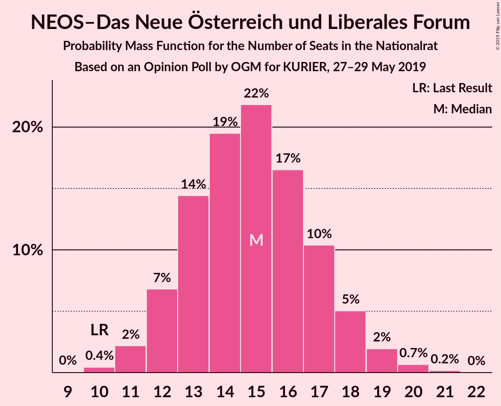
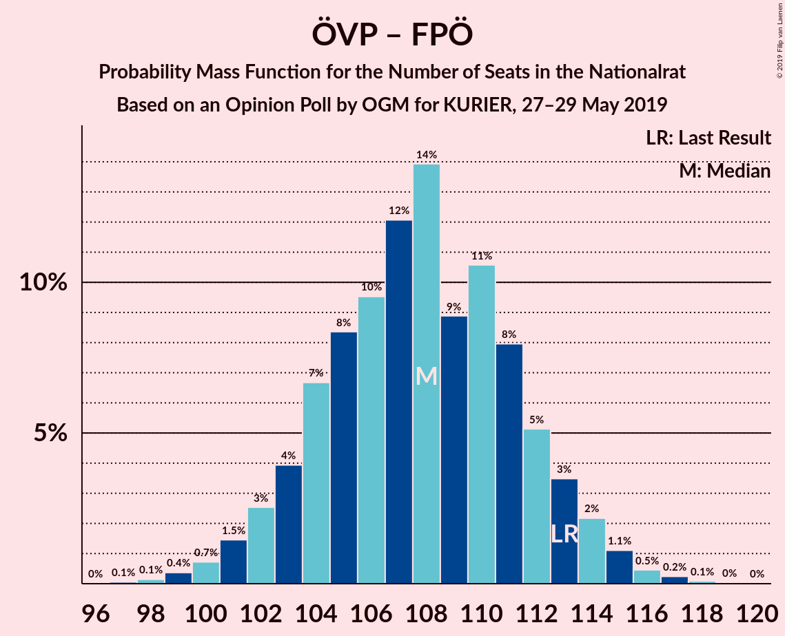

# Opinion Poll by OGM for KURIER, 27–29 May 2019

<a href="#voting-intentions">Voting Intentions</a> | <a href="#seats">Seats</a> | <a href="#coalitions">Coalitions</a> | <a href="#technical-information">Technical Information</a>

## Voting Intentions

### Confidence Intervals

| Party | Last Result | Poll Result | 80% Confidence Interval | 90% Confidence Interval | 95% Confidence Interval | 99% Confidence Interval |
|:-----:|:-----------:|:-----------:|:-----------------------:|:-----------------------:|:-----------------------:|:-----------------------:|
| Österreichische Volkspartei | 31.5% | 36.0% | 33.9–38.2% |33.3–38.9% |32.8–39.4% |31.8–40.5% |
| Sozialdemokratische Partei Österreichs | 26.9% | 22.0% | 20.2–23.9% |19.7–24.5% |19.3–25.0% |18.4–25.9% |
| Freiheitliche Partei Österreichs | 26.0% | 21.0% | 19.2–22.9% |18.7–23.5% |18.3–23.9% |17.5–24.9% |
| Die Grünen–Die Grüne Alternative | 3.8% | 10.1% | 8.8–11.6% |8.5–12.0% |8.2–12.3% |7.6–13.1% |
| NEOS–Das Neue Österreich und Liberales Forum | 5.3% | 8.0% | 6.8–9.3% |6.5–9.7% |6.3–10.0% |5.8–10.7% |
| JETZT–Liste Pilz | 4.4% | 1.5% | 1.1–2.2% |0.9–2.4% |0.9–2.6% |0.7–3.0% |

*Note:* The poll result column reflects the actual value used in the calculations. Published results may vary slightly, and in addition be rounded to fewer digits.

## Seats

### Confidence Intervals

| Party | Last Result | Median | 80% Confidence Interval | 90% Confidence Interval | 95% Confidence Interval | 99% Confidence Interval |
|:-----:|:-----------:|:------:|:-----------------------:|:-----------------------:|:-----------------------:|:-----------------------:|
| <a href="#österreichische-volkspartei">Österreichische Volkspartei</a> | 62 | 68 | 64–72 |63–74 |62–74 |60–77 |
| <a href="#sozialdemokratische-partei-österreichs">Sozialdemokratische Partei Österreichs</a> | 52 | 41 | 38–45 |37–46 |36–47 |35–49 |
| <a href="#freiheitliche-partei-österreichs">Freiheitliche Partei Österreichs</a> | 51 | 40 | 36–43 |35–44 |34–45 |33–47 |
| <a href="#die-grünen–die-grüne-alternative">Die Grünen–Die Grüne Alternative</a> | 0 | 19 | 16–22 |16–22 |15–23 |14–24 |
| <a href="#neos–das-neue-österreich-und-liberales-forum">NEOS–Das Neue Österreich und Liberales Forum</a> | 10 | 15 | 13–17 |12–18 |11–19 |11–20 |
| <a href="#jetzt–liste-pilz">JETZT–Liste Pilz</a> | 8 | 0 | 0 |0 |0 |0 |

### Österreichische Volkspartei

*For a full overview of the results for this party, see the [Österreichische Volkspartei](party-österreichischevolkspartei.html) page.*

| Number of Seats | Probability | Accumulated | Special Marks |
|:---------------:|:-----------:|:-----------:|:-------------:|
| 58 | 0.1% | 100% |  |
| 59 | 0.2% | 99.9% |  |
| 60 | 0.5% | 99.7% |  |
| 61 | 1.0% | 99.3% |  |
| 62 | 2% | 98% | Last Result |
| 63 | 3% | 96% |  |
| 64 | 5% | 93% |  |
| 65 | 8% | 88% |  |
| 66 | 10% | 80% |  |
| 67 | 11% | 70% |  |
| 68 | 12% | 59% | Median |
| 69 | 12% | 46% |  |
| 70 | 11% | 34% |  |
| 71 | 8% | 23% |  |
| 72 | 6% | 15% |  |
| 73 | 4% | 9% |  |
| 74 | 3% | 5% |  |
| 75 | 1.3% | 2% |  |
| 76 | 0.6% | 1.1% |  |
| 77 | 0.3% | 0.5% |  |
| 78 | 0.1% | 0.2% |  |
| 79 | 0% | 0.1% |  |
| 80 | 0% | 0% |  |

### Sozialdemokratische Partei Österreichs

*For a full overview of the results for this party, see the [Sozialdemokratische Partei Österreichs](party-sozialdemokratischeparteiösterreichs.html) page.*

| Number of Seats | Probability | Accumulated | Special Marks |
|:---------------:|:-----------:|:-----------:|:-------------:|
| 33 | 0.1% | 100% |  |
| 34 | 0.3% | 99.9% |  |
| 35 | 0.9% | 99.6% |  |
| 36 | 2% | 98.7% |  |
| 37 | 4% | 97% |  |
| 38 | 7% | 93% |  |
| 39 | 9% | 86% |  |
| 40 | 14% | 77% |  |
| 41 | 14% | 63% | Median |
| 42 | 14% | 49% |  |
| 43 | 12% | 35% |  |
| 44 | 9% | 23% |  |
| 45 | 6% | 14% |  |
| 46 | 4% | 8% |  |
| 47 | 2% | 4% |  |
| 48 | 1.1% | 2% |  |
| 49 | 0.4% | 0.7% |  |
| 50 | 0.2% | 0.3% |  |
| 51 | 0.1% | 0.1% |  |
| 52 | 0% | 0% | Last Result |

### Freiheitliche Partei Österreichs

*For a full overview of the results for this party, see the [Freiheitliche Partei Österreichs](party-freiheitlicheparteiösterreichs.html) page.*

| Number of Seats | Probability | Accumulated | Special Marks |
|:---------------:|:-----------:|:-----------:|:-------------:|
| 31 | 0.1% | 100% |  |
| 32 | 0.3% | 99.9% |  |
| 33 | 0.7% | 99.7% |  |
| 34 | 2% | 98.9% |  |
| 35 | 3% | 97% |  |
| 36 | 6% | 94% |  |
| 37 | 10% | 88% |  |
| 38 | 13% | 78% |  |
| 39 | 14% | 65% |  |
| 40 | 14% | 51% | Median |
| 41 | 13% | 37% |  |
| 42 | 10% | 24% |  |
| 43 | 6% | 14% |  |
| 44 | 4% | 8% |  |
| 45 | 2% | 4% |  |
| 46 | 1.1% | 2% |  |
| 47 | 0.5% | 0.7% |  |
| 48 | 0.2% | 0.3% |  |
| 49 | 0.1% | 0.1% |  |
| 50 | 0% | 0% |  |
| 51 | 0% | 0% | Last Result |

### Die Grünen–Die Grüne Alternative

*For a full overview of the results for this party, see the [Die Grünen–Die Grüne Alternative](party-diegrünen–diegrünealternative.html) page.*

| Number of Seats | Probability | Accumulated | Special Marks |
|:---------------:|:-----------:|:-----------:|:-------------:|
| 0 | 0% | 100% | Last Result |
| 1 | 0% | 100% |  |
| 2 | 0% | 100% |  |
| 3 | 0% | 100% |  |
| 4 | 0% | 100% |  |
| 5 | 0% | 100% |  |
| 6 | 0% | 100% |  |
| 7 | 0% | 100% |  |
| 8 | 0% | 100% |  |
| 9 | 0% | 100% |  |
| 10 | 0% | 100% |  |
| 11 | 0% | 100% |  |
| 12 | 0% | 100% |  |
| 13 | 0.2% | 100% |  |
| 14 | 0.9% | 99.8% |  |
| 15 | 3% | 98.9% |  |
| 16 | 8% | 96% |  |
| 17 | 14% | 88% |  |
| 18 | 19% | 74% |  |
| 19 | 18% | 55% | Median |
| 20 | 16% | 37% |  |
| 21 | 11% | 21% |  |
| 22 | 6% | 10% |  |
| 23 | 3% | 4% |  |
| 24 | 1.0% | 1.4% |  |
| 25 | 0.3% | 0.4% |  |
| 26 | 0.1% | 0.1% |  |
| 27 | 0% | 0% |  |

### NEOS–Das Neue Österreich und Liberales Forum

*For a full overview of the results for this party, see the [NEOS–Das Neue Österreich und Liberales Forum](party-neos–dasneueösterreichundliberalesforum.html) page.*

| Number of Seats | Probability | Accumulated | Special Marks |
|:---------------:|:-----------:|:-----------:|:-------------:|
| 9 | 0% | 100% |  |
| 10 | 0.4% | 99.9% | Last Result |
| 11 | 2% | 99.5% |  |
| 12 | 7% | 97% |  |
| 13 | 14% | 91% |  |
| 14 | 19% | 76% |  |
| 15 | 22% | 57% | Median |
| 16 | 17% | 35% |  |
| 17 | 10% | 18% |  |
| 18 | 5% | 8% |  |
| 19 | 2% | 3% |  |
| 20 | 0.7% | 0.9% |  |
| 21 | 0.2% | 0.2% |  |
| 22 | 0% | 0% |  |

### JETZT–Liste Pilz

*For a full overview of the results for this party, see the [JETZT–Liste Pilz](party-jetzt–listepilz.html) page.*

| Number of Seats | Probability | Accumulated | Special Marks |
|:---------------:|:-----------:|:-----------:|:-------------:|
| 0 | 100% | 100% | Median |
| 1 | 0% | 0% |  |
| 2 | 0% | 0% |  |
| 3 | 0% | 0% |  |
| 4 | 0% | 0% |  |
| 5 | 0% | 0% |  |
| 6 | 0% | 0% |  |
| 7 | 0% | 0% |  |
| 8 | 0% | 0% | Last Result |

## Coalitions

### Confidence Intervals

| Coalition | Last Result | Median | Majority? | 80% Confidence Interval | 90% Confidence Interval | 95% Confidence Interval | 99% Confidence Interval |
|:---------:|:-----------:|:------:|:---------:|:-----------------------:|:-----------------------:|:-----------------------:|:-----------------------:|
| Österreichische Volkspartei – Sozialdemokratische Partei Österreichs | 114 | 110 | 100% | 105–114 | 104–115 | 103–116 | 101–118 |
| Österreichische Volkspartei – Freiheitliche Partei Österreichs | 113 | 108 | 100% | 104–112 | 102–113 | 101–114 | 99–116 |
| Sozialdemokratische Partei Österreichs – Freiheitliche Partei Österreichs | 103 | 81 | 0.1% | 77–85 | 76–87 | 75–88 | 73–90 |
| Österreichische Volkspartei | 62 | 68 | 0% | 64–72 | 63–74 | 62–74 | 60–77 |
| Sozialdemokratische Partei Österreichs | 52 | 41 | 0% | 38–45 | 37–46 | 36–47 | 35–49 |

### Österreichische Volkspartei – Sozialdemokratische Partei Österreichs

| Number of Seats | Probability | Accumulated | Special Marks |
|:---------------:|:-----------:|:-----------:|:-------------:|
| 99 | 0.1% | 100% |  |
| 100 | 0.2% | 99.9% |  |
| 101 | 0.4% | 99.7% |  |
| 102 | 0.8% | 99.4% |  |
| 103 | 2% | 98.6% |  |
| 104 | 3% | 97% |  |
| 105 | 4% | 94% |  |
| 106 | 6% | 90% |  |
| 107 | 10% | 84% |  |
| 108 | 10% | 75% |  |
| 109 | 13% | 64% | Median |
| 110 | 12% | 52% |  |
| 111 | 11% | 40% |  |
| 112 | 9% | 29% |  |
| 113 | 8% | 20% |  |
| 114 | 6% | 12% | Last Result |
| 115 | 3% | 7% |  |
| 116 | 2% | 3% |  |
| 117 | 1.0% | 2% |  |
| 118 | 0.4% | 0.7% |  |
| 119 | 0.2% | 0.3% |  |
| 120 | 0.1% | 0.1% |  |
| 121 | 0% | 0% |  |

### Österreichische Volkspartei – Freiheitliche Partei Österreichs

| Number of Seats | Probability | Accumulated | Special Marks |
|:---------------:|:-----------:|:-----------:|:-------------:|
| 97 | 0.1% | 100% |  |
| 98 | 0.1% | 99.9% |  |
| 99 | 0.4% | 99.8% |  |
| 100 | 0.7% | 99.4% |  |
| 101 | 1.5% | 98.7% |  |
| 102 | 3% | 97% |  |
| 103 | 4% | 95% |  |
| 104 | 7% | 91% |  |
| 105 | 8% | 84% |  |
| 106 | 10% | 76% |  |
| 107 | 12% | 66% |  |
| 108 | 14% | 54% | Median |
| 109 | 9% | 40% |  |
| 110 | 11% | 31% |  |
| 111 | 8% | 21% |  |
| 112 | 5% | 13% |  |
| 113 | 3% | 8% | Last Result |
| 114 | 2% | 4% |  |
| 115 | 1.1% | 2% |  |
| 116 | 0.5% | 0.8% |  |
| 117 | 0.2% | 0.4% |  |
| 118 | 0.1% | 0.1% |  |
| 119 | 0% | 0% |  |

### Sozialdemokratische Partei Österreichs – Freiheitliche Partei Österreichs

| Number of Seats | Probability | Accumulated | Special Marks |
|:---------------:|:-----------:|:-----------:|:-------------:|
| 71 | 0.1% | 100% |  |
| 72 | 0.3% | 99.8% |  |
| 73 | 0.5% | 99.6% |  |
| 74 | 1.1% | 99.1% |  |
| 75 | 3% | 98% |  |
| 76 | 4% | 95% |  |
| 77 | 5% | 92% |  |
| 78 | 8% | 87% |  |
| 79 | 11% | 79% |  |
| 80 | 11% | 68% |  |
| 81 | 11% | 57% | Median |
| 82 | 12% | 46% |  |
| 83 | 12% | 33% |  |
| 84 | 6% | 22% |  |
| 85 | 6% | 16% |  |
| 86 | 5% | 10% |  |
| 87 | 2% | 5% |  |
| 88 | 1.3% | 3% |  |
| 89 | 0.8% | 1.4% |  |
| 90 | 0.4% | 0.6% |  |
| 91 | 0.1% | 0.2% |  |
| 92 | 0.1% | 0.1% | Majority |
| 93 | 0% | 0% |  |
| 94 | 0% | 0% |  |
| 95 | 0% | 0% |  |
| 96 | 0% | 0% |  |
| 97 | 0% | 0% |  |
| 98 | 0% | 0% |  |
| 99 | 0% | 0% |  |
| 100 | 0% | 0% |  |
| 101 | 0% | 0% |  |
| 102 | 0% | 0% |  |
| 103 | 0% | 0% | Last Result |

### Österreichische Volkspartei

| Number of Seats | Probability | Accumulated | Special Marks |
|:---------------:|:-----------:|:-----------:|:-------------:|
| 58 | 0.1% | 100% |  |
| 59 | 0.2% | 99.9% |  |
| 60 | 0.5% | 99.7% |  |
| 61 | 1.0% | 99.3% |  |
| 62 | 2% | 98% | Last Result |
| 63 | 3% | 96% |  |
| 64 | 5% | 93% |  |
| 65 | 8% | 88% |  |
| 66 | 10% | 80% |  |
| 67 | 11% | 70% |  |
| 68 | 12% | 59% | Median |
| 69 | 12% | 46% |  |
| 70 | 11% | 34% |  |
| 71 | 8% | 23% |  |
| 72 | 6% | 15% |  |
| 73 | 4% | 9% |  |
| 74 | 3% | 5% |  |
| 75 | 1.3% | 2% |  |
| 76 | 0.6% | 1.1% |  |
| 77 | 0.3% | 0.5% |  |
| 78 | 0.1% | 0.2% |  |
| 79 | 0% | 0.1% |  |
| 80 | 0% | 0% |  |

### Sozialdemokratische Partei Österreichs

| Number of Seats | Probability | Accumulated | Special Marks |
|:---------------:|:-----------:|:-----------:|:-------------:|
| 33 | 0.1% | 100% |  |
| 34 | 0.3% | 99.9% |  |
| 35 | 0.9% | 99.6% |  |
| 36 | 2% | 98.7% |  |
| 37 | 4% | 97% |  |
| 38 | 7% | 93% |  |
| 39 | 9% | 86% |  |
| 40 | 14% | 77% |  |
| 41 | 14% | 63% | Median |
| 42 | 14% | 49% |  |
| 43 | 12% | 35% |  |
| 44 | 9% | 23% |  |
| 45 | 6% | 14% |  |
| 46 | 4% | 8% |  |
| 47 | 2% | 4% |  |
| 48 | 1.1% | 2% |  |
| 49 | 0.4% | 0.7% |  |
| 50 | 0.2% | 0.3% |  |
| 51 | 0.1% | 0.1% |  |
| 52 | 0% | 0% | Last Result |

## Technical Information

### Opinion Poll

+ **Polling firm:** OGM
+ **Commissioner(s):** KURIER
+ **Fieldwork period:** 27–29 May 2019

### Calculations

+ **Sample size:** 805
+ **Simulations done:** 1,048,576
+ **Error estimate:** 1.34%

