# Opinion Poll by Demox Research, 1–31 May 2019

<a href="#voting-intentions">Voting Intentions</a> | <a href="#seats">Seats</a> | <a href="#coalitions">Coalitions</a> | <a href="#technical-information">Technical Information</a>

## Voting Intentions

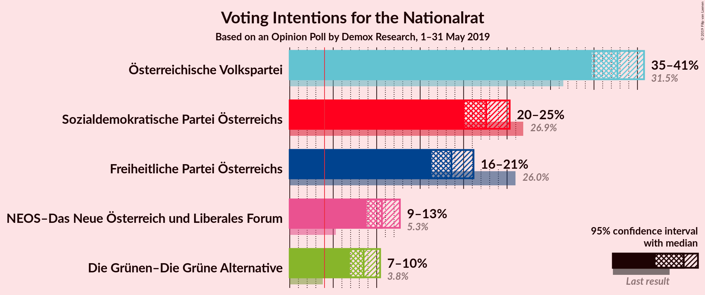

### Confidence Intervals

| Party | Last Result | Poll Result | 80% Confidence Interval | 90% Confidence Interval | 95% Confidence Interval | 99% Confidence Interval |
|:-----:|:-----------:|:-----------:|:-----------------------:|:-----------------------:|:-----------------------:|:-----------------------:|
| Österreichische Volkspartei | 31.5% | 37.7% | 35.8–39.7% |35.2–40.3% |34.7–40.8% |33.8–41.7% |
| Sozialdemokratische Partei Österreichs | 26.9% | 22.6% | 21.0–24.4% |20.5–24.9% |20.1–25.3% |19.3–26.2% |
| Freiheitliche Partei Österreichs | 26.0% | 18.6% | 17.1–20.3% |16.7–20.7% |16.3–21.1% |15.6–21.9% |
| NEOS–Das Neue Österreich und Liberales Forum | 5.3% | 10.6% | 9.4–11.9% |9.1–12.3% |8.8–12.7% |8.3–13.3% |
| Die Grünen–Die Grüne Alternative | 3.8% | 8.5% | 7.5–9.7% |7.2–10.1% |6.9–10.4% |6.4–11.0% |

*Note:* The poll result column reflects the actual value used in the calculations. Published results may vary slightly, and in addition be rounded to fewer digits.

## Seats

### Confidence Intervals

| Party | Last Result | Median | 80% Confidence Interval | 90% Confidence Interval | 95% Confidence Interval | 99% Confidence Interval |
|:-----:|:-----------:|:------:|:-----------------------:|:-----------------------:|:-----------------------:|:-----------------------:|
| <a href="#österreichische-volkspartei">Österreichische Volkspartei</a> | 62 | 71 | 67–74 |66–76 |65–76 |63–78 |
| <a href="#sozialdemokratische-partei-österreichs">Sozialdemokratische Partei Österreichs</a> | 52 | 42 | 39–45 |38–46 |37–47 |36–49 |
| <a href="#freiheitliche-partei-österreichs">Freiheitliche Partei Österreichs</a> | 51 | 35 | 32–38 |31–39 |30–39 |29–41 |
| <a href="#neos–das-neue-österreich-und-liberales-forum">NEOS–Das Neue Österreich und Liberales Forum</a> | 10 | 19 | 17–22 |17–23 |16–24 |15–25 |
| <a href="#die-grünen–die-grüne-alternative">Die Grünen–Die Grüne Alternative</a> | 0 | 16 | 14–18 |13–19 |13–19 |12–20 |

### Österreichische Volkspartei

*For a full overview of the results for this party, see the [Österreichische Volkspartei](party-österreichischevolkspartei.html) page.*

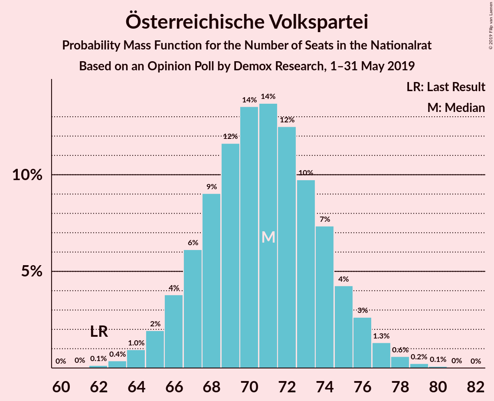

| Number of Seats | Probability | Accumulated | Special Marks |
|:---------------:|:-----------:|:-----------:|:-------------:|
| 61 | 0% | 100% |  |
| 62 | 0.1% | 99.9% | Last Result |
| 63 | 0.3% | 99.8% |  |
| 64 | 1.1% | 99.5% |  |
| 65 | 2% | 98% |  |
| 66 | 4% | 97% |  |
| 67 | 6% | 93% |  |
| 68 | 9% | 87% |  |
| 69 | 12% | 78% |  |
| 70 | 12% | 66% |  |
| 71 | 17% | 54% | Median |
| 72 | 12% | 37% |  |
| 73 | 8% | 24% |  |
| 74 | 7% | 17% |  |
| 75 | 4% | 9% |  |
| 76 | 3% | 5% |  |
| 77 | 1.4% | 2% |  |
| 78 | 0.6% | 1.0% |  |
| 79 | 0.2% | 0.3% |  |
| 80 | 0.1% | 0.1% |  |
| 81 | 0% | 0% |  |

### Sozialdemokratische Partei Österreichs

*For a full overview of the results for this party, see the [Sozialdemokratische Partei Österreichs](party-sozialdemokratischeparteiösterreichs.html) page.*

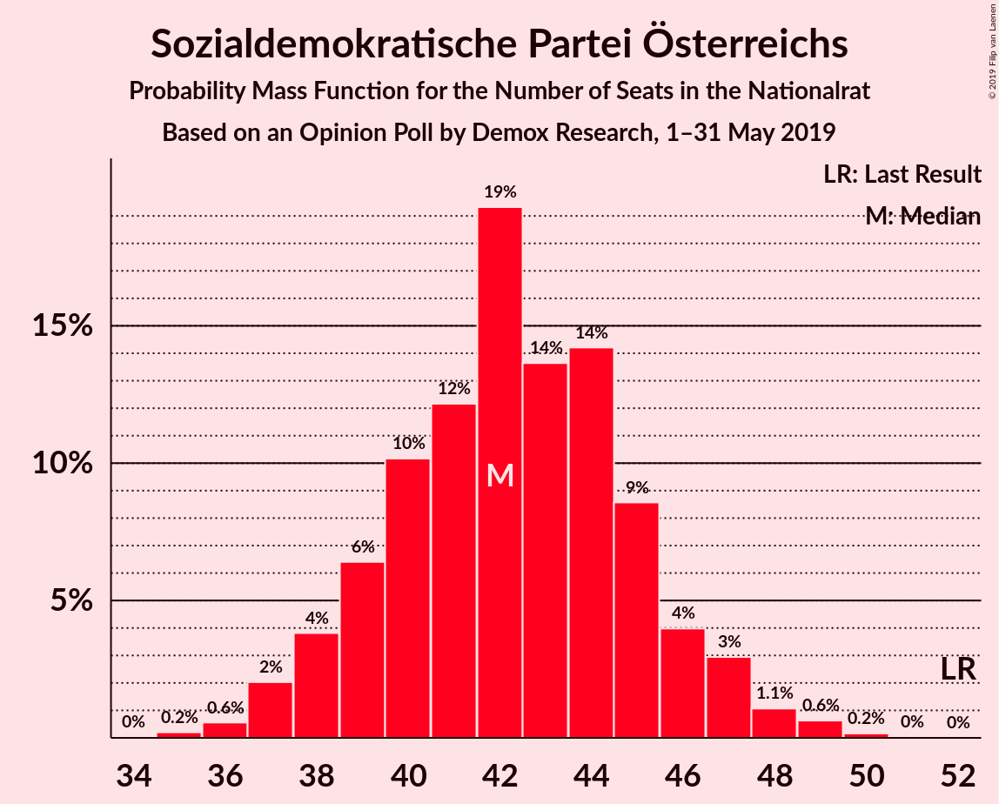

| Number of Seats | Probability | Accumulated | Special Marks |
|:---------------:|:-----------:|:-----------:|:-------------:|
| 34 | 0% | 100% |  |
| 35 | 0.2% | 99.9% |  |
| 36 | 0.6% | 99.7% |  |
| 37 | 2% | 99.2% |  |
| 38 | 4% | 97% |  |
| 39 | 6% | 93% |  |
| 40 | 10% | 87% |  |
| 41 | 12% | 77% |  |
| 42 | 19% | 65% | Median |
| 43 | 14% | 45% |  |
| 44 | 14% | 32% |  |
| 45 | 9% | 17% |  |
| 46 | 4% | 9% |  |
| 47 | 3% | 5% |  |
| 48 | 1.1% | 2% |  |
| 49 | 0.6% | 0.9% |  |
| 50 | 0.2% | 0.2% |  |
| 51 | 0% | 0.1% |  |
| 52 | 0% | 0% | Last Result |

### Freiheitliche Partei Österreichs

*For a full overview of the results for this party, see the [Freiheitliche Partei Österreichs](party-freiheitlicheparteiösterreichs.html) page.*

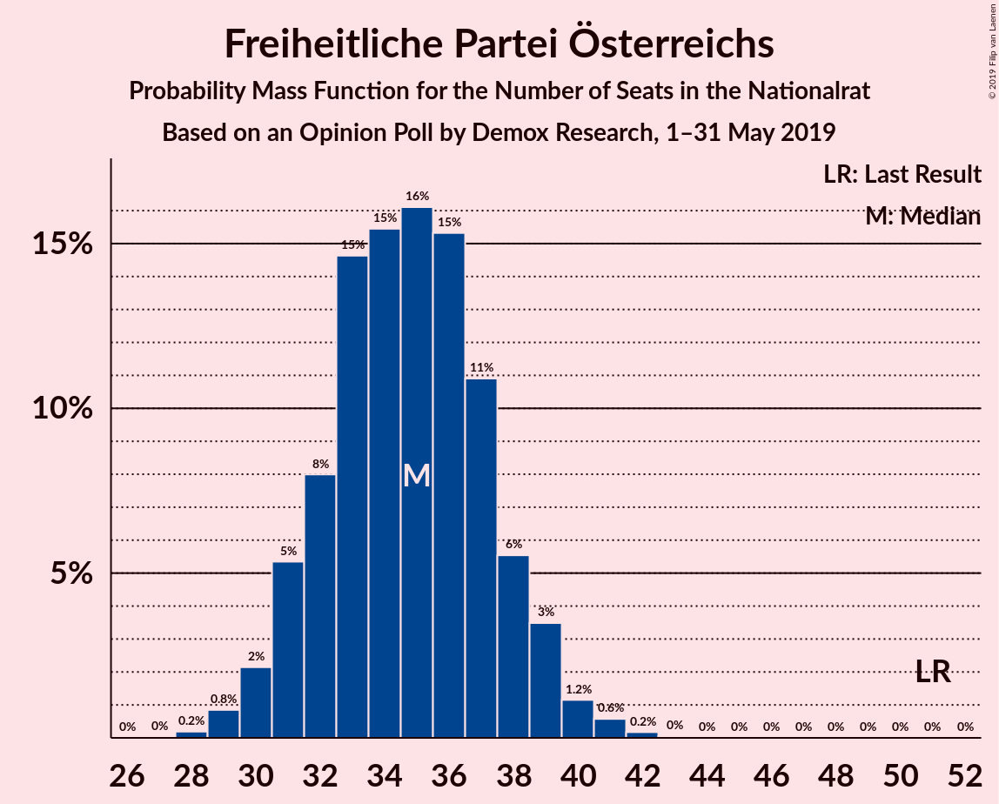

| Number of Seats | Probability | Accumulated | Special Marks |
|:---------------:|:-----------:|:-----------:|:-------------:|
| 27 | 0% | 100% |  |
| 28 | 0.2% | 99.9% |  |
| 29 | 0.8% | 99.8% |  |
| 30 | 2% | 98.9% |  |
| 31 | 5% | 97% |  |
| 32 | 8% | 91% |  |
| 33 | 15% | 83% |  |
| 34 | 15% | 69% |  |
| 35 | 16% | 53% | Median |
| 36 | 15% | 37% |  |
| 37 | 11% | 22% |  |
| 38 | 6% | 11% |  |
| 39 | 3% | 5% |  |
| 40 | 1.2% | 2% |  |
| 41 | 0.6% | 0.8% |  |
| 42 | 0.2% | 0.2% |  |
| 43 | 0% | 0.1% |  |
| 44 | 0% | 0% |  |
| 45 | 0% | 0% |  |
| 46 | 0% | 0% |  |
| 47 | 0% | 0% |  |
| 48 | 0% | 0% |  |
| 49 | 0% | 0% |  |
| 50 | 0% | 0% |  |
| 51 | 0% | 0% | Last Result |

### NEOS–Das Neue Österreich und Liberales Forum

*For a full overview of the results for this party, see the [NEOS–Das Neue Österreich und Liberales Forum](party-neos–dasneueösterreichundliberalesforum.html) page.*

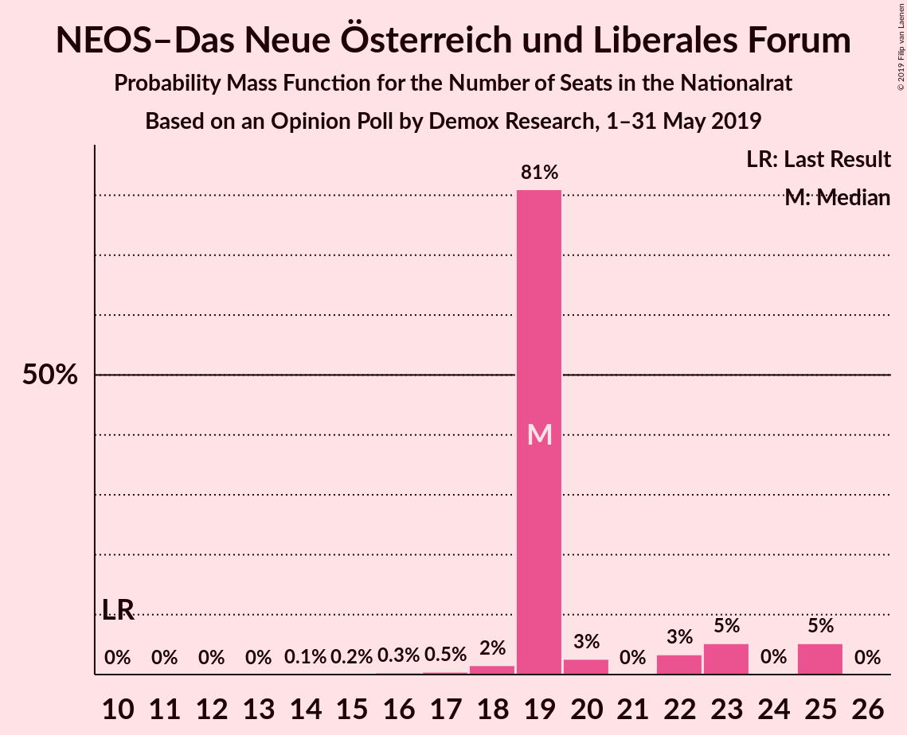

| Number of Seats | Probability | Accumulated | Special Marks |
|:---------------:|:-----------:|:-----------:|:-------------:|
| 10 | 0% | 100% | Last Result |
| 11 | 0% | 100% |  |
| 12 | 0% | 100% |  |
| 13 | 0% | 100% |  |
| 14 | 0.1% | 100% |  |
| 15 | 0.8% | 99.9% |  |
| 16 | 3% | 99.1% |  |
| 17 | 10% | 96% |  |
| 18 | 10% | 86% |  |
| 19 | 28% | 76% | Median |
| 20 | 16% | 48% |  |
| 21 | 18% | 32% |  |
| 22 | 8% | 14% |  |
| 23 | 3% | 6% |  |
| 24 | 2% | 3% |  |
| 25 | 0.3% | 0.5% |  |
| 26 | 0.2% | 0.2% |  |
| 27 | 0% | 0% |  |

### Die Grünen–Die Grüne Alternative

*For a full overview of the results for this party, see the [Die Grünen–Die Grüne Alternative](party-diegrünen–diegrünealternative.html) page.*

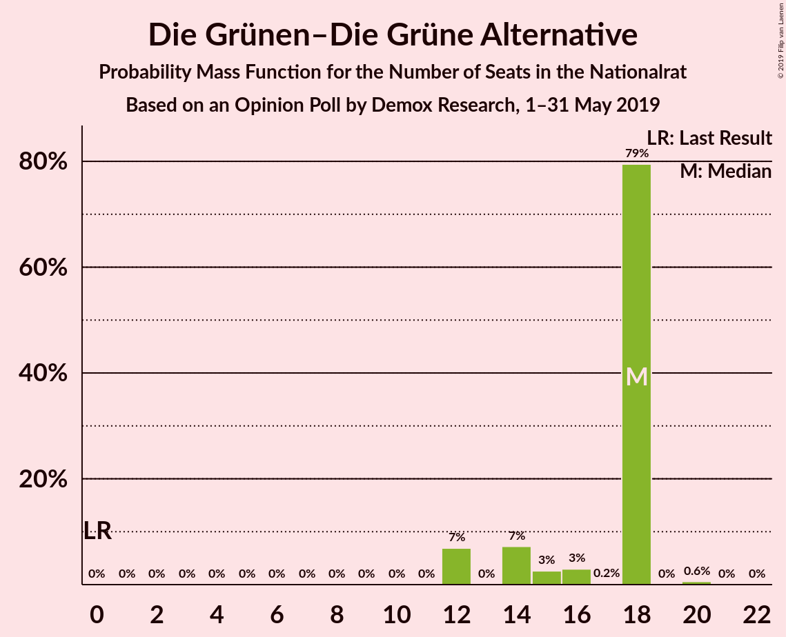

| Number of Seats | Probability | Accumulated | Special Marks |
|:---------------:|:-----------:|:-----------:|:-------------:|
| 0 | 0% | 100% | Last Result |
| 1 | 0% | 100% |  |
| 2 | 0% | 100% |  |
| 3 | 0% | 100% |  |
| 4 | 0% | 100% |  |
| 5 | 0% | 100% |  |
| 6 | 0% | 100% |  |
| 7 | 0% | 100% |  |
| 8 | 0% | 100% |  |
| 9 | 0% | 100% |  |
| 10 | 0% | 100% |  |
| 11 | 0.3% | 100% |  |
| 12 | 2% | 99.7% |  |
| 13 | 7% | 98% |  |
| 14 | 15% | 91% |  |
| 15 | 23% | 76% |  |
| 16 | 22% | 53% | Median |
| 17 | 17% | 31% |  |
| 18 | 9% | 14% |  |
| 19 | 4% | 5% |  |
| 20 | 1.1% | 1.4% |  |
| 21 | 0.3% | 0.4% |  |
| 22 | 0.1% | 0.1% |  |
| 23 | 0% | 0% |  |

## Coalitions

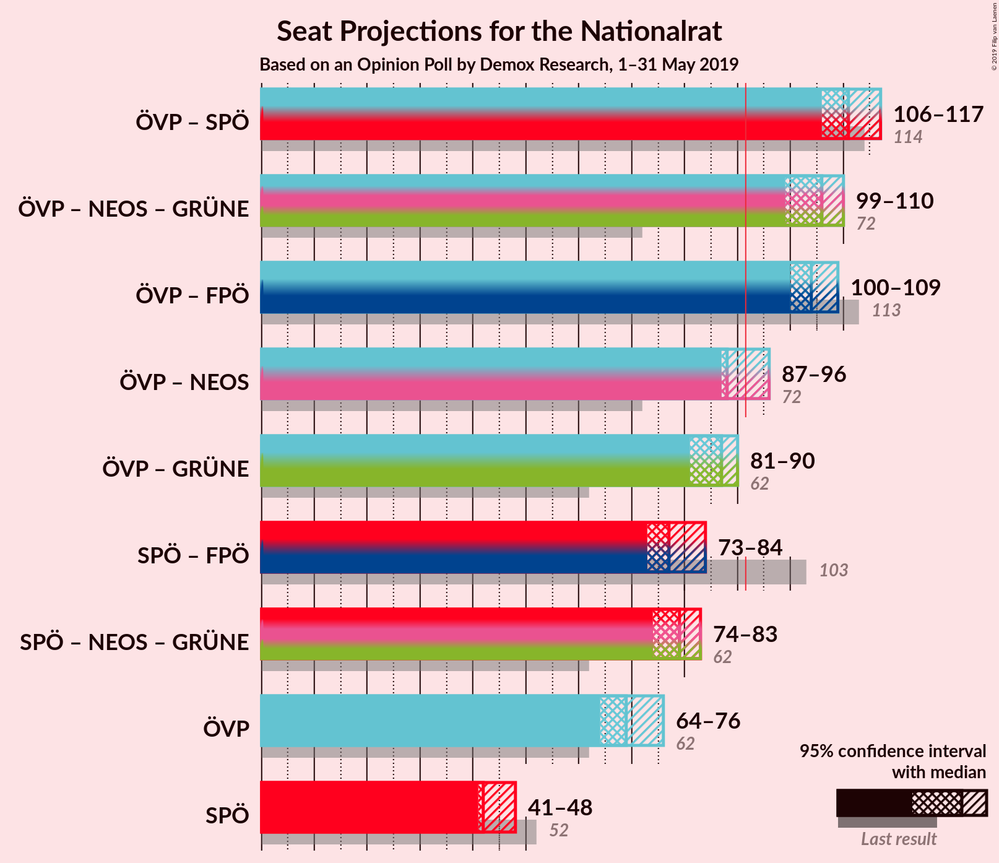

### Confidence Intervals

| Coalition | Last Result | Median | Majority? | 80% Confidence Interval | 90% Confidence Interval | 95% Confidence Interval | 99% Confidence Interval |
|:---------:|:-----------:|:------:|:---------:|:-----------------------:|:-----------------------:|:-----------------------:|:-----------------------:|
| Österreichische Volkspartei – Sozialdemokratische Partei Österreichs | 114 | 113 | 100% | 109–117 | 108–118 | 107–118 | 105–120 |
| Österreichische Volkspartei – NEOS–Das Neue Österreich und Liberales Forum – Die Grünen–Die Grüne Alternative | 72 | 106 | 100% | 102–110 | 101–111 | 100–112 | 98–114 |
| Österreichische Volkspartei – Freiheitliche Partei Österreichs | 113 | 105 | 100% | 102–109 | 101–110 | 100–111 | 98–113 |
| Österreichische Volkspartei – NEOS–Das Neue Österreich und Liberales Forum | 72 | 90 | 31% | 86–94 | 85–95 | 84–96 | 83–98 |
| Österreichische Volkspartei – Die Grünen–Die Grüne Alternative | 62 | 86 | 4% | 83–90 | 81–91 | 81–92 | 79–94 |
| Sozialdemokratische Partei Österreichs – NEOS–Das Neue Österreich und Liberales Forum – Die Grünen–Die Grüne Alternative | 62 | 78 | 0% | 74–81 | 73–82 | 72–83 | 70–85 |
| Sozialdemokratische Partei Österreichs – Freiheitliche Partei Österreichs | 103 | 77 | 0% | 73–81 | 72–82 | 71–83 | 69–85 |
| Österreichische Volkspartei | 62 | 71 | 0% | 67–74 | 66–76 | 65–76 | 63–78 |
| Sozialdemokratische Partei Österreichs | 52 | 42 | 0% | 39–45 | 38–46 | 37–47 | 36–49 |

### Österreichische Volkspartei – Sozialdemokratische Partei Österreichs

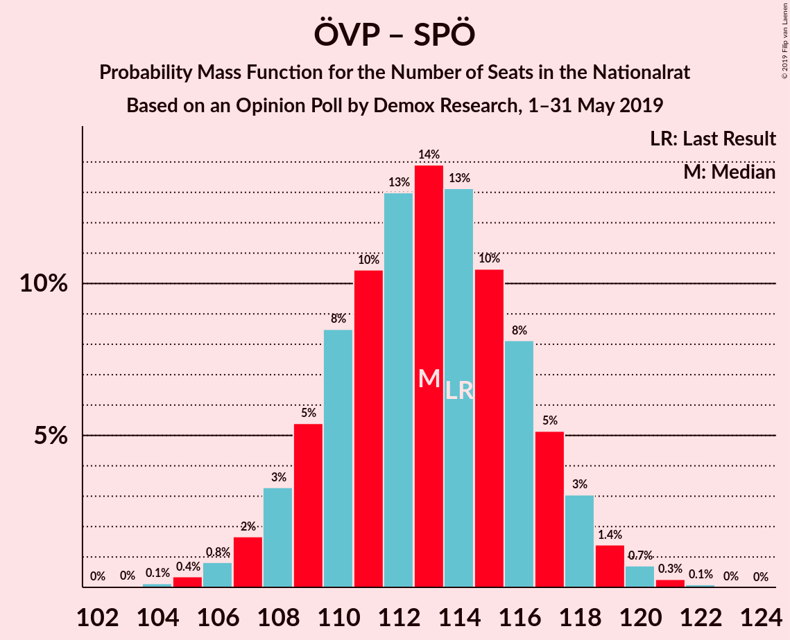

| Number of Seats | Probability | Accumulated | Special Marks |
|:---------------:|:-----------:|:-----------:|:-------------:|
| 103 | 0.1% | 100% |  |
| 104 | 0.1% | 99.9% |  |
| 105 | 0.4% | 99.8% |  |
| 106 | 0.8% | 99.4% |  |
| 107 | 2% | 98.6% |  |
| 108 | 3% | 97% |  |
| 109 | 5% | 94% |  |
| 110 | 8% | 89% |  |
| 111 | 11% | 81% |  |
| 112 | 13% | 70% |  |
| 113 | 15% | 58% | Median |
| 114 | 14% | 42% | Last Result |
| 115 | 9% | 29% |  |
| 116 | 9% | 20% |  |
| 117 | 5% | 11% |  |
| 118 | 3% | 6% |  |
| 119 | 1.4% | 2% |  |
| 120 | 0.7% | 1.0% |  |
| 121 | 0.2% | 0.4% |  |
| 122 | 0.1% | 0.1% |  |
| 123 | 0% | 0% |  |

### Österreichische Volkspartei – NEOS–Das Neue Österreich und Liberales Forum – Die Grünen–Die Grüne Alternative

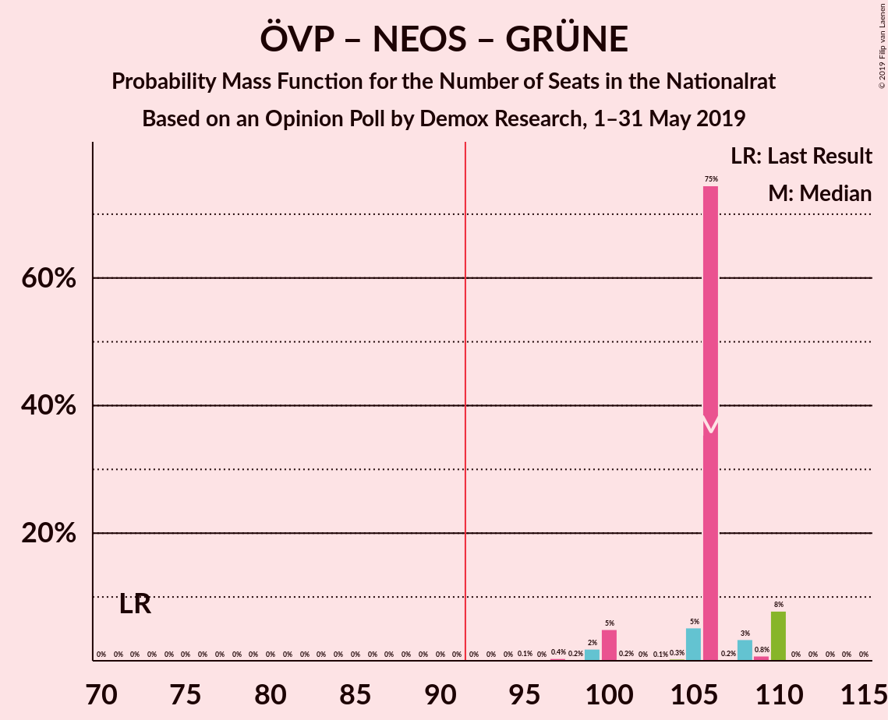

| Number of Seats | Probability | Accumulated | Special Marks |
|:---------------:|:-----------:|:-----------:|:-------------:|
| 72 | 0% | 100% | Last Result |
| 73 | 0% | 100% |  |
| 74 | 0% | 100% |  |
| 75 | 0% | 100% |  |
| 76 | 0% | 100% |  |
| 77 | 0% | 100% |  |
| 78 | 0% | 100% |  |
| 79 | 0% | 100% |  |
| 80 | 0% | 100% |  |
| 81 | 0% | 100% |  |
| 82 | 0% | 100% |  |
| 83 | 0% | 100% |  |
| 84 | 0% | 100% |  |
| 85 | 0% | 100% |  |
| 86 | 0% | 100% |  |
| 87 | 0% | 100% |  |
| 88 | 0% | 100% |  |
| 89 | 0% | 100% |  |
| 90 | 0% | 100% |  |
| 91 | 0% | 100% |  |
| 92 | 0% | 100% | Majority |
| 93 | 0% | 100% |  |
| 94 | 0% | 100% |  |
| 95 | 0% | 100% |  |
| 96 | 0% | 100% |  |
| 97 | 0.2% | 99.9% |  |
| 98 | 0.3% | 99.8% |  |
| 99 | 0.8% | 99.5% |  |
| 100 | 2% | 98.7% |  |
| 101 | 3% | 97% |  |
| 102 | 6% | 94% |  |
| 103 | 6% | 88% |  |
| 104 | 14% | 82% |  |
| 105 | 11% | 68% |  |
| 106 | 17% | 58% | Median |
| 107 | 8% | 41% |  |
| 108 | 15% | 33% |  |
| 109 | 5% | 18% |  |
| 110 | 7% | 13% |  |
| 111 | 3% | 6% |  |
| 112 | 2% | 4% |  |
| 113 | 0.6% | 1.1% |  |
| 114 | 0.3% | 0.5% |  |
| 115 | 0.1% | 0.2% |  |
| 116 | 0% | 0% |  |

### Österreichische Volkspartei – Freiheitliche Partei Österreichs

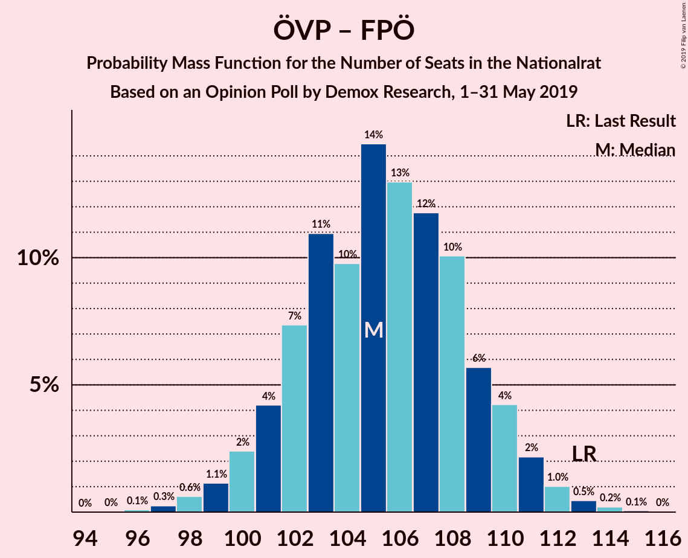

| Number of Seats | Probability | Accumulated | Special Marks |
|:---------------:|:-----------:|:-----------:|:-------------:|
| 96 | 0.1% | 100% |  |
| 97 | 0.3% | 99.9% |  |
| 98 | 0.6% | 99.6% |  |
| 99 | 1.1% | 99.0% |  |
| 100 | 2% | 98% |  |
| 101 | 4% | 95% |  |
| 102 | 7% | 91% |  |
| 103 | 11% | 84% |  |
| 104 | 10% | 73% |  |
| 105 | 14% | 63% |  |
| 106 | 13% | 49% | Median |
| 107 | 12% | 36% |  |
| 108 | 10% | 24% |  |
| 109 | 6% | 14% |  |
| 110 | 4% | 8% |  |
| 111 | 2% | 4% |  |
| 112 | 1.0% | 2% |  |
| 113 | 0.5% | 0.7% | Last Result |
| 114 | 0.2% | 0.3% |  |
| 115 | 0.1% | 0.1% |  |
| 116 | 0% | 0% |  |

### Österreichische Volkspartei – NEOS–Das Neue Österreich und Liberales Forum

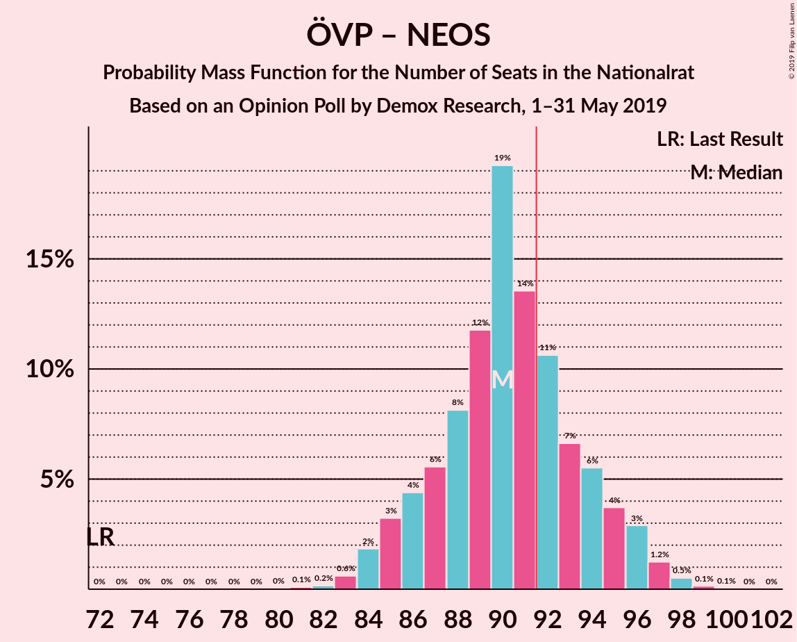

| Number of Seats | Probability | Accumulated | Special Marks |
|:---------------:|:-----------:|:-----------:|:-------------:|
| 72 | 0% | 100% | Last Result |
| 73 | 0% | 100% |  |
| 74 | 0% | 100% |  |
| 75 | 0% | 100% |  |
| 76 | 0% | 100% |  |
| 77 | 0% | 100% |  |
| 78 | 0% | 100% |  |
| 79 | 0% | 100% |  |
| 80 | 0% | 100% |  |
| 81 | 0.1% | 100% |  |
| 82 | 0.2% | 99.9% |  |
| 83 | 0.6% | 99.7% |  |
| 84 | 2% | 99.1% |  |
| 85 | 3% | 97% |  |
| 86 | 4% | 94% |  |
| 87 | 6% | 90% |  |
| 88 | 8% | 84% |  |
| 89 | 12% | 76% |  |
| 90 | 19% | 64% | Median |
| 91 | 14% | 45% |  |
| 92 | 11% | 31% | Majority |
| 93 | 7% | 21% |  |
| 94 | 6% | 14% |  |
| 95 | 4% | 9% |  |
| 96 | 3% | 5% |  |
| 97 | 1.2% | 2% |  |
| 98 | 0.5% | 0.7% |  |
| 99 | 0.1% | 0.2% |  |
| 100 | 0.1% | 0.1% |  |
| 101 | 0% | 0% |  |

### Österreichische Volkspartei – Die Grünen–Die Grüne Alternative

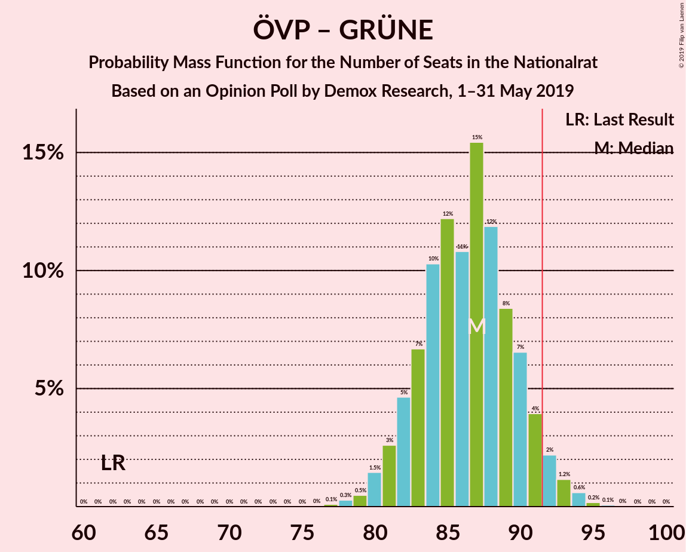

| Number of Seats | Probability | Accumulated | Special Marks |
|:---------------:|:-----------:|:-----------:|:-------------:|
| 62 | 0% | 100% | Last Result |
| 63 | 0% | 100% |  |
| 64 | 0% | 100% |  |
| 65 | 0% | 100% |  |
| 66 | 0% | 100% |  |
| 67 | 0% | 100% |  |
| 68 | 0% | 100% |  |
| 69 | 0% | 100% |  |
| 70 | 0% | 100% |  |
| 71 | 0% | 100% |  |
| 72 | 0% | 100% |  |
| 73 | 0% | 100% |  |
| 74 | 0% | 100% |  |
| 75 | 0% | 100% |  |
| 76 | 0% | 100% |  |
| 77 | 0.1% | 100% |  |
| 78 | 0.3% | 99.9% |  |
| 79 | 0.4% | 99.6% |  |
| 80 | 2% | 99.2% |  |
| 81 | 3% | 98% |  |
| 82 | 5% | 95% |  |
| 83 | 7% | 90% |  |
| 84 | 9% | 83% |  |
| 85 | 11% | 74% |  |
| 86 | 13% | 63% |  |
| 87 | 17% | 50% | Median |
| 88 | 9% | 32% |  |
| 89 | 9% | 24% |  |
| 90 | 7% | 15% |  |
| 91 | 3% | 8% |  |
| 92 | 2% | 4% | Majority |
| 93 | 1.1% | 2% |  |
| 94 | 0.6% | 0.9% |  |
| 95 | 0.2% | 0.3% |  |
| 96 | 0.1% | 0.1% |  |
| 97 | 0% | 0% |  |

### Sozialdemokratische Partei Österreichs – NEOS–Das Neue Österreich und Liberales Forum – Die Grünen–Die Grüne Alternative

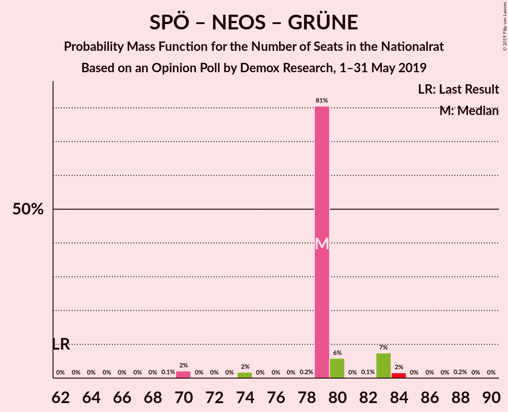

| Number of Seats | Probability | Accumulated | Special Marks |
|:---------------:|:-----------:|:-----------:|:-------------:|
| 62 | 0% | 100% | Last Result |
| 63 | 0% | 100% |  |
| 64 | 0% | 100% |  |
| 65 | 0% | 100% |  |
| 66 | 0% | 100% |  |
| 67 | 0% | 100% |  |
| 68 | 0.1% | 100% |  |
| 69 | 0.2% | 99.9% |  |
| 70 | 0.5% | 99.7% |  |
| 71 | 1.0% | 99.3% |  |
| 72 | 2% | 98% |  |
| 73 | 4% | 96% |  |
| 74 | 6% | 92% |  |
| 75 | 10% | 86% |  |
| 76 | 12% | 76% |  |
| 77 | 13% | 64% | Median |
| 78 | 14% | 51% |  |
| 79 | 10% | 37% |  |
| 80 | 11% | 27% |  |
| 81 | 7% | 16% |  |
| 82 | 4% | 9% |  |
| 83 | 2% | 5% |  |
| 84 | 1.1% | 2% |  |
| 85 | 0.6% | 1.0% |  |
| 86 | 0.2% | 0.4% |  |
| 87 | 0.1% | 0.1% |  |
| 88 | 0% | 0% |  |

### Sozialdemokratische Partei Österreichs – Freiheitliche Partei Österreichs

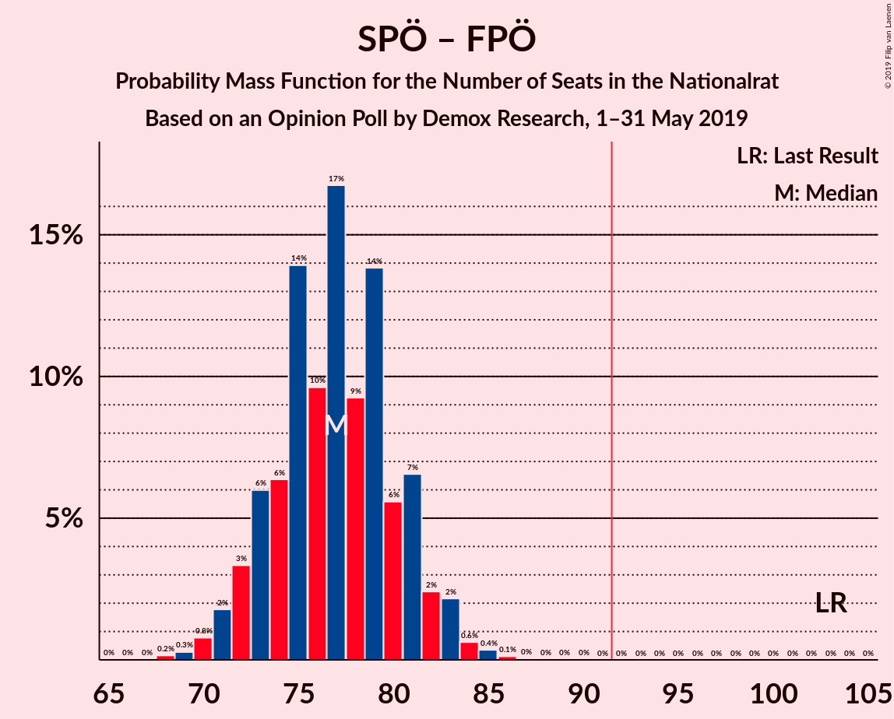

| Number of Seats | Probability | Accumulated | Special Marks |
|:---------------:|:-----------:|:-----------:|:-------------:|
| 68 | 0.1% | 100% |  |
| 69 | 0.3% | 99.8% |  |
| 70 | 0.6% | 99.5% |  |
| 71 | 2% | 98.9% |  |
| 72 | 3% | 96% |  |
| 73 | 7% | 94% |  |
| 74 | 5% | 87% |  |
| 75 | 15% | 82% |  |
| 76 | 8% | 67% |  |
| 77 | 17% | 59% | Median |
| 78 | 11% | 42% |  |
| 79 | 14% | 32% |  |
| 80 | 6% | 18% |  |
| 81 | 6% | 12% |  |
| 82 | 3% | 6% |  |
| 83 | 2% | 3% |  |
| 84 | 0.8% | 1.3% |  |
| 85 | 0.3% | 0.5% |  |
| 86 | 0.2% | 0.2% |  |
| 87 | 0% | 0% |  |
| 88 | 0% | 0% |  |
| 89 | 0% | 0% |  |
| 90 | 0% | 0% |  |
| 91 | 0% | 0% |  |
| 92 | 0% | 0% | Majority |
| 93 | 0% | 0% |  |
| 94 | 0% | 0% |  |
| 95 | 0% | 0% |  |
| 96 | 0% | 0% |  |
| 97 | 0% | 0% |  |
| 98 | 0% | 0% |  |
| 99 | 0% | 0% |  |
| 100 | 0% | 0% |  |
| 101 | 0% | 0% |  |
| 102 | 0% | 0% |  |
| 103 | 0% | 0% | Last Result |

### Österreichische Volkspartei

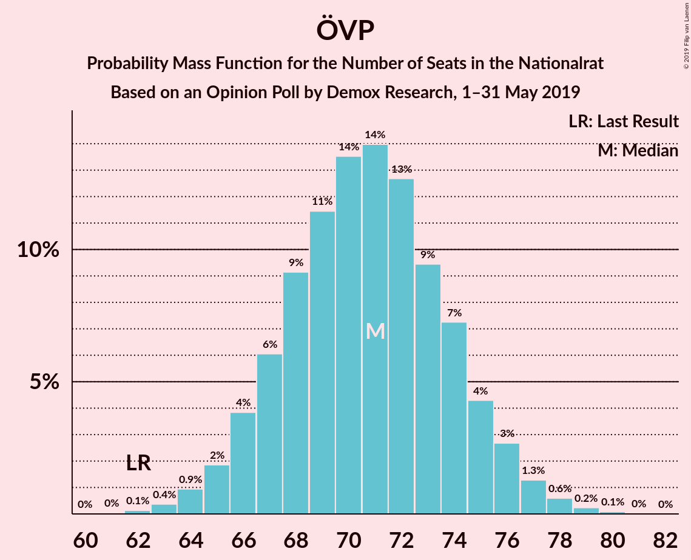

| Number of Seats | Probability | Accumulated | Special Marks |
|:---------------:|:-----------:|:-----------:|:-------------:|
| 61 | 0% | 100% |  |
| 62 | 0.1% | 99.9% | Last Result |
| 63 | 0.3% | 99.8% |  |
| 64 | 1.1% | 99.5% |  |
| 65 | 2% | 98% |  |
| 66 | 4% | 97% |  |
| 67 | 6% | 93% |  |
| 68 | 9% | 87% |  |
| 69 | 12% | 78% |  |
| 70 | 12% | 66% |  |
| 71 | 17% | 54% | Median |
| 72 | 12% | 37% |  |
| 73 | 8% | 24% |  |
| 74 | 7% | 17% |  |
| 75 | 4% | 9% |  |
| 76 | 3% | 5% |  |
| 77 | 1.4% | 2% |  |
| 78 | 0.6% | 1.0% |  |
| 79 | 0.2% | 0.3% |  |
| 80 | 0.1% | 0.1% |  |
| 81 | 0% | 0% |  |

### Sozialdemokratische Partei Österreichs

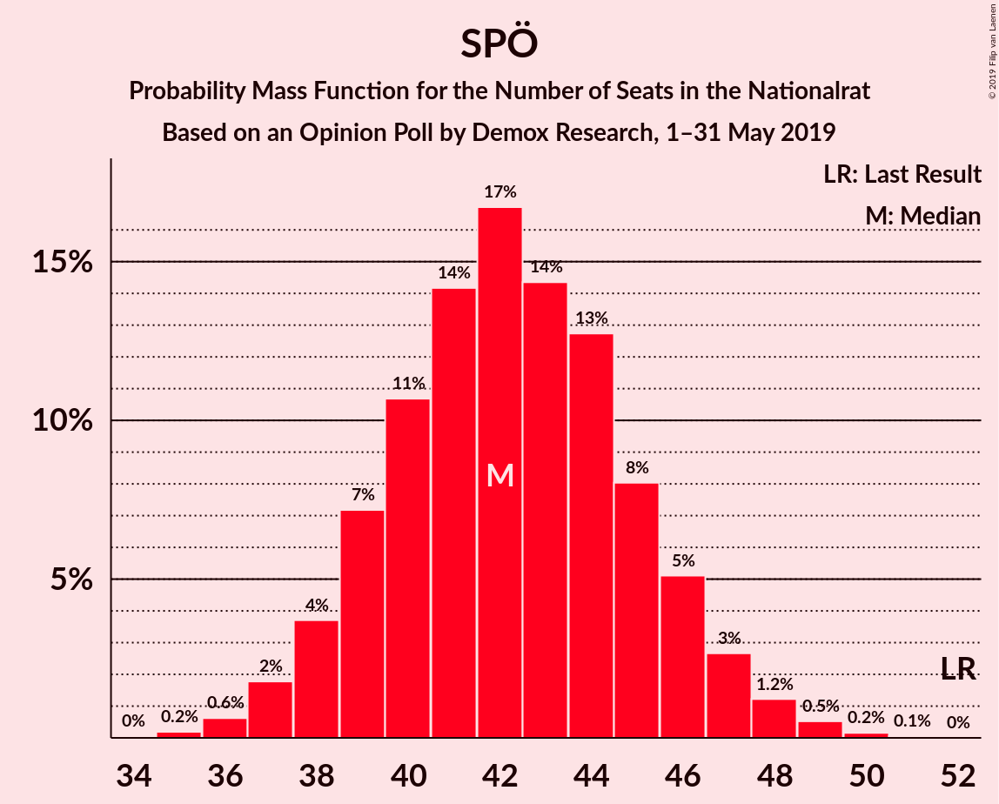

| Number of Seats | Probability | Accumulated | Special Marks |
|:---------------:|:-----------:|:-----------:|:-------------:|
| 34 | 0% | 100% |  |
| 35 | 0.2% | 99.9% |  |
| 36 | 0.6% | 99.7% |  |
| 37 | 2% | 99.2% |  |
| 38 | 4% | 97% |  |
| 39 | 6% | 93% |  |
| 40 | 10% | 87% |  |
| 41 | 12% | 77% |  |
| 42 | 19% | 65% | Median |
| 43 | 14% | 45% |  |
| 44 | 14% | 32% |  |
| 45 | 9% | 17% |  |
| 46 | 4% | 9% |  |
| 47 | 3% | 5% |  |
| 48 | 1.1% | 2% |  |
| 49 | 0.6% | 0.9% |  |
| 50 | 0.2% | 0.2% |  |
| 51 | 0% | 0.1% |  |
| 52 | 0% | 0% | Last Result |

## Technical Information

### Opinion Poll

+ **Polling firm:** Demox Research
+ **Commissioner(s):** —
+ **Fieldwork period:** 1–31 May 2019

### Calculations

+ **Sample size:** 1000
+ **Simulations done:** 131,072
+ **Error estimate:** 1.04%

