# Opinion Poll by Research Affairs, 29–31 May 2019

<a href="#voting-intentions">Voting Intentions</a> | <a href="#seats">Seats</a> | <a href="#coalitions">Coalitions</a> | <a href="#technical-information">Technical Information</a>

## Voting Intentions

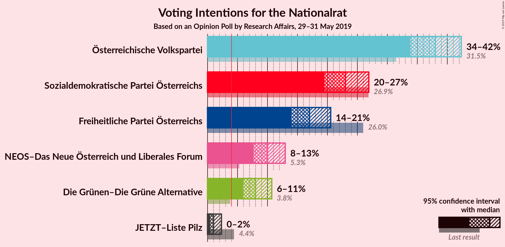

### Confidence Intervals

| Party | Last Result | Poll Result | 80% Confidence Interval | 90% Confidence Interval | 95% Confidence Interval | 99% Confidence Interval |
|:-----:|:-----------:|:-----------:|:-----------------------:|:-----------------------:|:-----------------------:|:-----------------------:|
| Österreichische Volkspartei | 31.5% | 38.0% | 35.3–40.8% |34.5–41.6% |33.9–42.3% |32.6–43.7% |
| Sozialdemokratische Partei Österreichs | 26.9% | 23.0% | 20.7–25.5% |20.1–26.3% |19.5–26.9% |18.5–28.2% |
| Freiheitliche Partei Österreichs | 26.0% | 17.0% | 15.0–19.3% |14.4–20.0% |14.0–20.5% |13.0–21.7% |
| NEOS–Das Neue Österreich und Liberales Forum | 5.3% | 10.0% | 8.5–11.9% |8.0–12.5% |7.7–13.0% |7.0–13.9% |
| Die Grünen–Die Grüne Alternative | 3.8% | 8.0% | 6.6–9.8% |6.2–10.3% |5.9–10.7% |5.3–11.6% |
| JETZT–Liste Pilz | 4.4% | 1.0% | 0.6–1.8% |0.5–2.1% |0.4–2.3% |0.3–2.8% |

*Note:* The poll result column reflects the actual value used in the calculations. Published results may vary slightly, and in addition be rounded to fewer digits.

## Seats

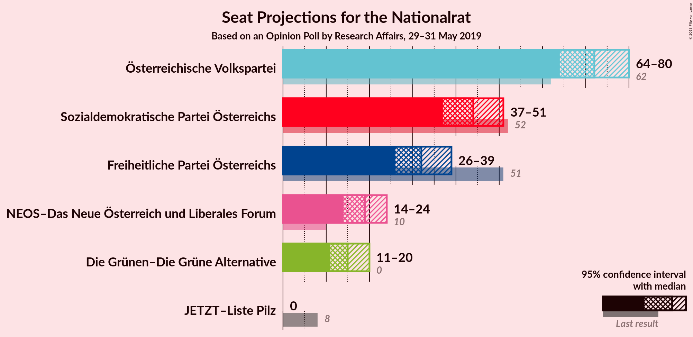

### Confidence Intervals

| Party | Last Result | Median | 80% Confidence Interval | 90% Confidence Interval | 95% Confidence Interval | 99% Confidence Interval |
|:-----:|:-----------:|:------:|:-----------------------:|:-----------------------:|:-----------------------:|:-----------------------:|
| <a href="#österreichische-volkspartei">Österreichische Volkspartei</a> | 62 | 74 | 68–79 |66–80 |64–82 |61–84 |
| <a href="#sozialdemokratische-partei-österreichs">Sozialdemokratische Partei Österreichs</a> | 52 | 44 | 39–48 |38–50 |37–51 |35–53 |
| <a href="#freiheitliche-partei-österreichs">Freiheitliche Partei Österreichs</a> | 51 | 32 | 28–36 |27–37 |26–39 |24–41 |
| <a href="#neos–das-neue-österreich-und-liberales-forum">NEOS–Das Neue Österreich und Liberales Forum</a> | 10 | 17 | 15–22 |14–24 |14–25 |13–27 |
| <a href="#die-grünen–die-grüne-alternative">Die Grünen–Die Grüne Alternative</a> | 0 | 15 | 12–18 |11–19 |11–20 |9–22 |
| <a href="#jetzt–liste-pilz">JETZT–Liste Pilz</a> | 8 | 0 | 0 |0 |0 |0 |

### Österreichische Volkspartei

*For a full overview of the results for this party, see the [Österreichische Volkspartei](party-österreichischevolkspartei.html) page.*

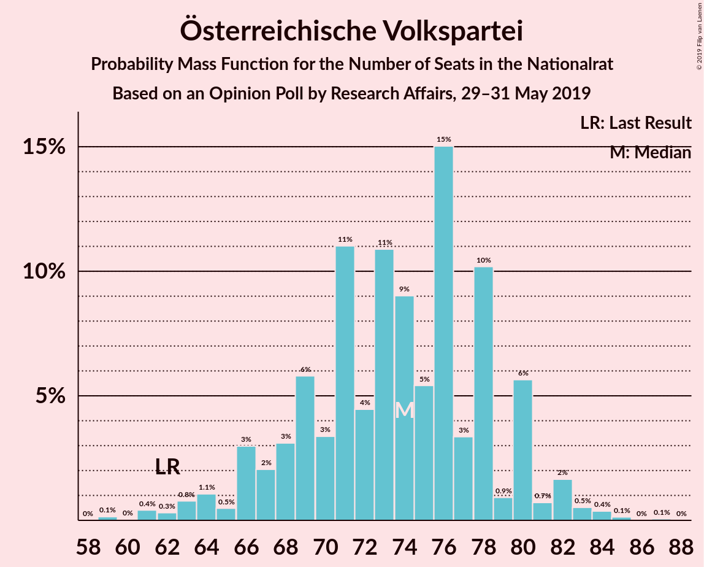

| Number of Seats | Probability | Accumulated | Special Marks |
|:---------------:|:-----------:|:-----------:|:-------------:|
| 59 | 0.1% | 100% |  |
| 60 | 0% | 99.8% |  |
| 61 | 0.4% | 99.8% |  |
| 62 | 0.3% | 99.4% | Last Result |
| 63 | 0.8% | 99.0% |  |
| 64 | 1.1% | 98% |  |
| 65 | 0.5% | 97% |  |
| 66 | 3% | 97% |  |
| 67 | 2% | 94% |  |
| 68 | 3% | 92% |  |
| 69 | 6% | 89% |  |
| 70 | 3% | 83% |  |
| 71 | 11% | 79% |  |
| 72 | 4% | 68% |  |
| 73 | 11% | 64% |  |
| 74 | 9% | 53% | Median |
| 75 | 5% | 44% |  |
| 76 | 15% | 39% |  |
| 77 | 3% | 24% |  |
| 78 | 10% | 20% |  |
| 79 | 0.9% | 10% |  |
| 80 | 6% | 9% |  |
| 81 | 0.7% | 3% |  |
| 82 | 2% | 3% |  |
| 83 | 0.5% | 1.1% |  |
| 84 | 0.4% | 0.6% |  |
| 85 | 0.1% | 0.2% |  |
| 86 | 0% | 0.1% |  |
| 87 | 0.1% | 0.1% |  |
| 88 | 0% | 0% |  |

### Sozialdemokratische Partei Österreichs

*For a full overview of the results for this party, see the [Sozialdemokratische Partei Österreichs](party-sozialdemokratischeparteiösterreichs.html) page.*

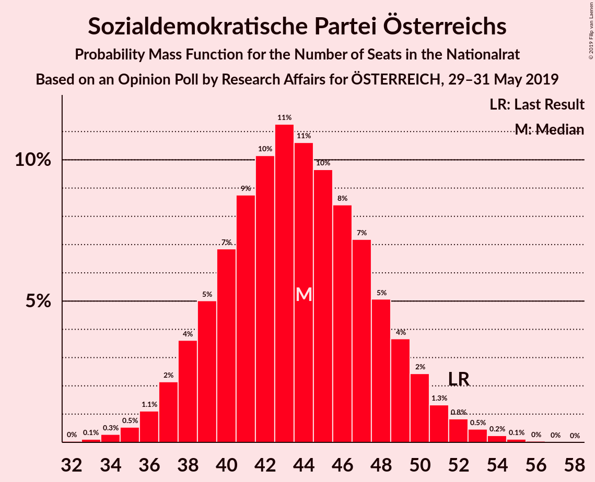

| Number of Seats | Probability | Accumulated | Special Marks |
|:---------------:|:-----------:|:-----------:|:-------------:|
| 32 | 0.1% | 100% |  |
| 33 | 0.1% | 99.9% |  |
| 34 | 0.2% | 99.8% |  |
| 35 | 0.9% | 99.6% |  |
| 36 | 0.9% | 98.7% |  |
| 37 | 2% | 98% |  |
| 38 | 6% | 96% |  |
| 39 | 3% | 90% |  |
| 40 | 4% | 87% |  |
| 41 | 17% | 82% |  |
| 42 | 7% | 66% |  |
| 43 | 7% | 59% |  |
| 44 | 17% | 52% | Median |
| 45 | 8% | 35% |  |
| 46 | 5% | 28% |  |
| 47 | 11% | 23% |  |
| 48 | 4% | 12% |  |
| 49 | 2% | 8% |  |
| 50 | 4% | 6% |  |
| 51 | 1.3% | 3% |  |
| 52 | 0.4% | 1.3% | Last Result |
| 53 | 0.6% | 1.0% |  |
| 54 | 0.2% | 0.3% |  |
| 55 | 0.1% | 0.1% |  |
| 56 | 0.1% | 0.1% |  |
| 57 | 0% | 0% |  |

### Freiheitliche Partei Österreichs

*For a full overview of the results for this party, see the [Freiheitliche Partei Österreichs](party-freiheitlicheparteiösterreichs.html) page.*

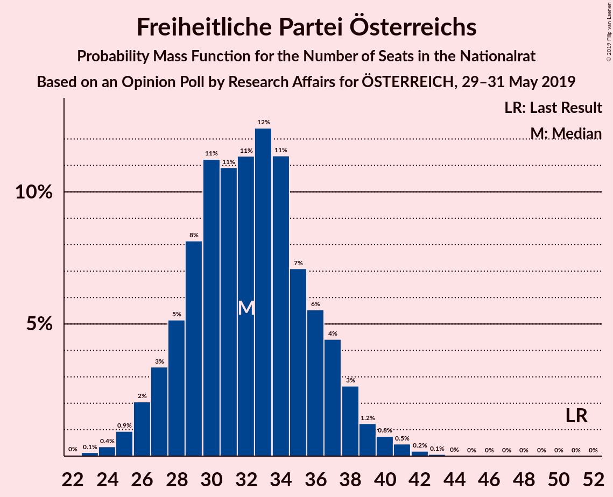

| Number of Seats | Probability | Accumulated | Special Marks |
|:---------------:|:-----------:|:-----------:|:-------------:|
| 22 | 0.1% | 100% |  |
| 23 | 0.1% | 99.9% |  |
| 24 | 0.4% | 99.8% |  |
| 25 | 1.2% | 99.4% |  |
| 26 | 2% | 98% |  |
| 27 | 2% | 96% |  |
| 28 | 6% | 94% |  |
| 29 | 11% | 88% |  |
| 30 | 8% | 76% |  |
| 31 | 7% | 68% |  |
| 32 | 15% | 61% | Median |
| 33 | 17% | 45% |  |
| 34 | 6% | 28% |  |
| 35 | 5% | 22% |  |
| 36 | 8% | 17% |  |
| 37 | 4% | 9% |  |
| 38 | 2% | 5% |  |
| 39 | 1.1% | 3% |  |
| 40 | 1.1% | 2% |  |
| 41 | 0.3% | 0.5% |  |
| 42 | 0.1% | 0.3% |  |
| 43 | 0.1% | 0.1% |  |
| 44 | 0% | 0.1% |  |
| 45 | 0% | 0% |  |
| 46 | 0% | 0% |  |
| 47 | 0% | 0% |  |
| 48 | 0% | 0% |  |
| 49 | 0% | 0% |  |
| 50 | 0% | 0% |  |
| 51 | 0% | 0% | Last Result |

### NEOS–Das Neue Österreich und Liberales Forum

*For a full overview of the results for this party, see the [NEOS–Das Neue Österreich und Liberales Forum](party-neos–dasneueösterreichundliberalesforum.html) page.*

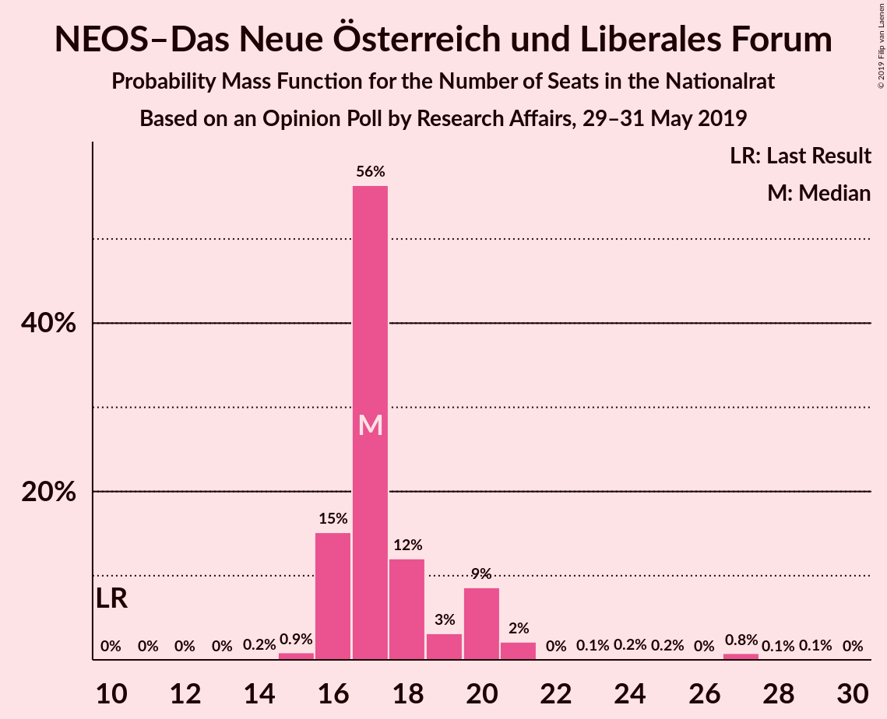

| Number of Seats | Probability | Accumulated | Special Marks |
|:---------------:|:-----------:|:-----------:|:-------------:|
| 10 | 0% | 100% | Last Result |
| 11 | 0% | 100% |  |
| 12 | 0.1% | 100% |  |
| 13 | 1.1% | 99.9% |  |
| 14 | 4% | 98.8% |  |
| 15 | 13% | 94% |  |
| 16 | 23% | 81% |  |
| 17 | 25% | 58% | Median |
| 18 | 13% | 33% |  |
| 19 | 6% | 20% |  |
| 20 | 2% | 13% |  |
| 21 | 0.5% | 11% |  |
| 22 | 1.1% | 11% |  |
| 23 | 2% | 9% |  |
| 24 | 3% | 7% |  |
| 25 | 3% | 5% |  |
| 26 | 1.3% | 2% |  |
| 27 | 0.6% | 0.8% |  |
| 28 | 0.2% | 0.2% |  |
| 29 | 0.1% | 0.1% |  |
| 30 | 0% | 0% |  |

### Die Grünen–Die Grüne Alternative

*For a full overview of the results for this party, see the [Die Grünen–Die Grüne Alternative](party-diegrünen–diegrünealternative.html) page.*

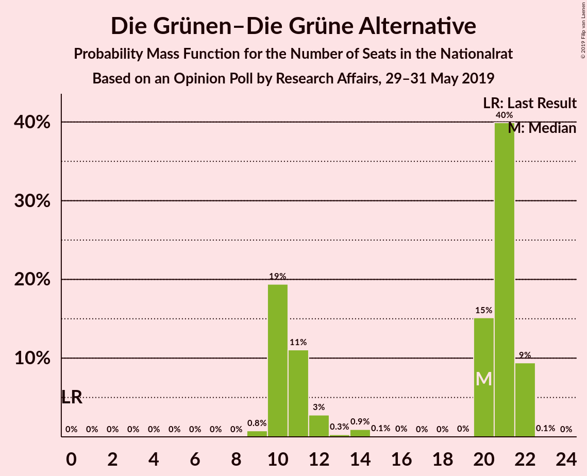

| Number of Seats | Probability | Accumulated | Special Marks |
|:---------------:|:-----------:|:-----------:|:-------------:|
| 0 | 0% | 100% | Last Result |
| 1 | 0% | 100% |  |
| 2 | 0% | 100% |  |
| 3 | 0% | 100% |  |
| 4 | 0% | 100% |  |
| 5 | 0% | 100% |  |
| 6 | 0% | 100% |  |
| 7 | 0% | 100% |  |
| 8 | 0.1% | 100% |  |
| 9 | 0.4% | 99.9% |  |
| 10 | 2% | 99.5% |  |
| 11 | 3% | 98% |  |
| 12 | 7% | 95% |  |
| 13 | 13% | 88% |  |
| 14 | 15% | 75% |  |
| 15 | 16% | 61% | Median |
| 16 | 15% | 44% |  |
| 17 | 12% | 30% |  |
| 18 | 8% | 17% |  |
| 19 | 5% | 9% |  |
| 20 | 3% | 4% |  |
| 21 | 1.1% | 2% |  |
| 22 | 0.4% | 0.5% |  |
| 23 | 0.1% | 0.2% |  |
| 24 | 0% | 0.1% |  |
| 25 | 0% | 0% |  |

### JETZT–Liste Pilz

*For a full overview of the results for this party, see the [JETZT–Liste Pilz](party-jetzt–listepilz.html) page.*

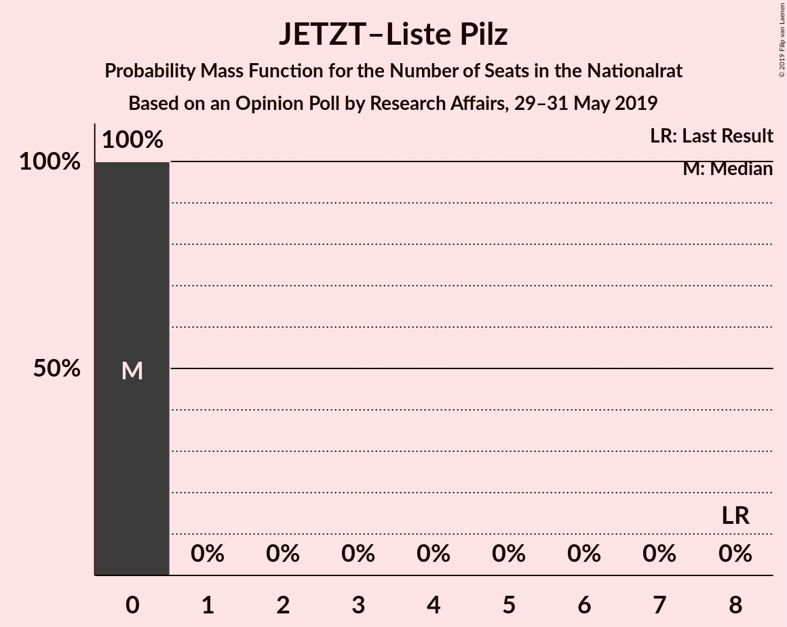

| Number of Seats | Probability | Accumulated | Special Marks |
|:---------------:|:-----------:|:-----------:|:-------------:|
| 0 | 100% | 100% | Median |
| 1 | 0% | 0% |  |
| 2 | 0% | 0% |  |
| 3 | 0% | 0% |  |
| 4 | 0% | 0% |  |
| 5 | 0% | 0% |  |
| 6 | 0% | 0% |  |
| 7 | 0% | 0% |  |
| 8 | 0% | 0% | Last Result |

## Coalitions

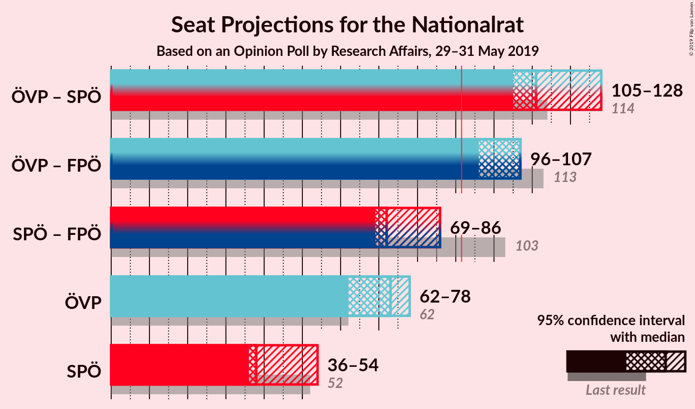

### Confidence Intervals

| Coalition | Last Result | Median | Majority? | 80% Confidence Interval | 90% Confidence Interval | 95% Confidence Interval | 99% Confidence Interval |
|:---------:|:-----------:|:------:|:---------:|:-----------------------:|:-----------------------:|:-----------------------:|:-----------------------:|
| Österreichische Volkspartei – Sozialdemokratische Partei Österreichs | 114 | 118 | 100% | 111–123 | 109–124 | 107–125 | 104–127 |
| Österreichische Volkspartei – Freiheitliche Partei Österreichs | 113 | 106 | 99.7% | 100–111 | 98–113 | 96–114 | 93–116 |
| Sozialdemokratische Partei Österreichs – Freiheitliche Partei Österreichs | 103 | 76 | 0% | 70–81 | 69–82 | 67–84 | 65–86 |
| Österreichische Volkspartei | 62 | 74 | 0% | 68–79 | 66–80 | 64–82 | 61–84 |
| Sozialdemokratische Partei Österreichs | 52 | 44 | 0% | 39–48 | 38–50 | 37–51 | 35–53 |

### Österreichische Volkspartei – Sozialdemokratische Partei Österreichs

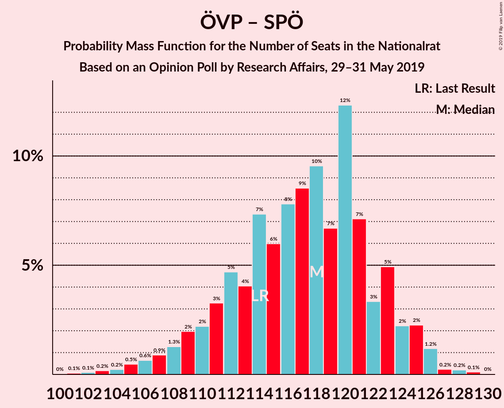

| Number of Seats | Probability | Accumulated | Special Marks |
|:---------------:|:-----------:|:-----------:|:-------------:|
| 100 | 0% | 100% |  |
| 101 | 0.1% | 99.9% |  |
| 102 | 0.1% | 99.9% |  |
| 103 | 0.2% | 99.8% |  |
| 104 | 0.2% | 99.6% |  |
| 105 | 0.5% | 99.4% |  |
| 106 | 0.6% | 98.9% |  |
| 107 | 0.9% | 98% |  |
| 108 | 1.3% | 97% |  |
| 109 | 2% | 96% |  |
| 110 | 2% | 94% |  |
| 111 | 3% | 92% |  |
| 112 | 5% | 89% |  |
| 113 | 4% | 84% |  |
| 114 | 7% | 80% | Last Result |
| 115 | 6% | 73% |  |
| 116 | 8% | 67% |  |
| 117 | 9% | 59% |  |
| 118 | 10% | 50% | Median |
| 119 | 7% | 41% |  |
| 120 | 12% | 34% |  |
| 121 | 7% | 22% |  |
| 122 | 3% | 15% |  |
| 123 | 5% | 11% |  |
| 124 | 2% | 6% |  |
| 125 | 2% | 4% |  |
| 126 | 1.2% | 2% |  |
| 127 | 0.2% | 0.6% |  |
| 128 | 0.2% | 0.4% |  |
| 129 | 0.1% | 0.2% |  |
| 130 | 0% | 0% |  |

### Österreichische Volkspartei – Freiheitliche Partei Österreichs

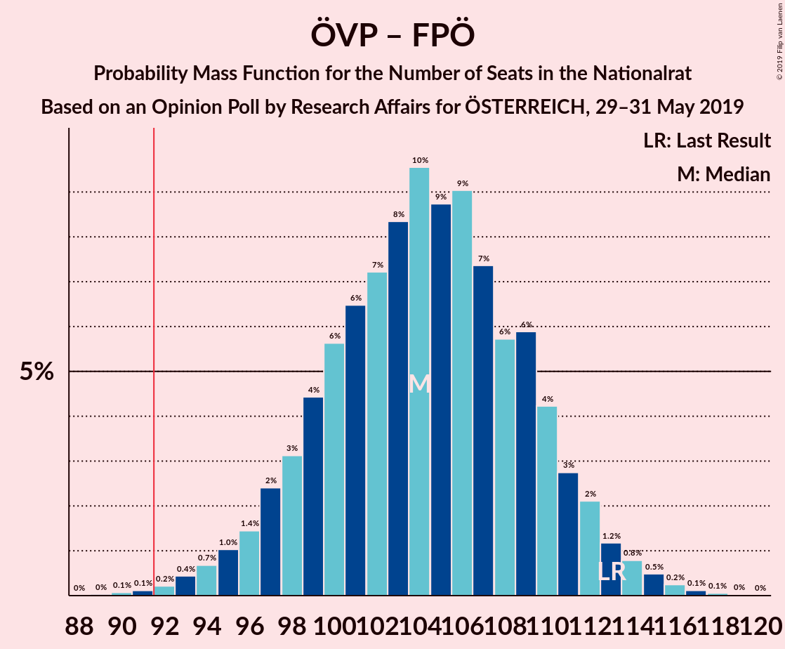

| Number of Seats | Probability | Accumulated | Special Marks |
|:---------------:|:-----------:|:-----------:|:-------------:|
| 89 | 0% | 100% |  |
| 90 | 0.1% | 99.9% |  |
| 91 | 0.1% | 99.9% |  |
| 92 | 0.2% | 99.7% | Majority |
| 93 | 0.4% | 99.6% |  |
| 94 | 0.4% | 99.2% |  |
| 95 | 0.8% | 98.8% |  |
| 96 | 0.8% | 98% |  |
| 97 | 2% | 97% |  |
| 98 | 2% | 96% |  |
| 99 | 3% | 94% |  |
| 100 | 4% | 91% |  |
| 101 | 3% | 87% |  |
| 102 | 7% | 84% |  |
| 103 | 5% | 77% |  |
| 104 | 9% | 72% |  |
| 105 | 8% | 63% |  |
| 106 | 8% | 55% | Median |
| 107 | 11% | 47% |  |
| 108 | 7% | 36% |  |
| 109 | 10% | 29% |  |
| 110 | 5% | 19% |  |
| 111 | 4% | 14% |  |
| 112 | 4% | 10% |  |
| 113 | 2% | 5% | Last Result |
| 114 | 2% | 3% |  |
| 115 | 1.0% | 2% |  |
| 116 | 0.5% | 0.8% |  |
| 117 | 0.2% | 0.3% |  |
| 118 | 0.1% | 0.1% |  |
| 119 | 0% | 0.1% |  |
| 120 | 0% | 0% |  |

### Sozialdemokratische Partei Österreichs – Freiheitliche Partei Österreichs

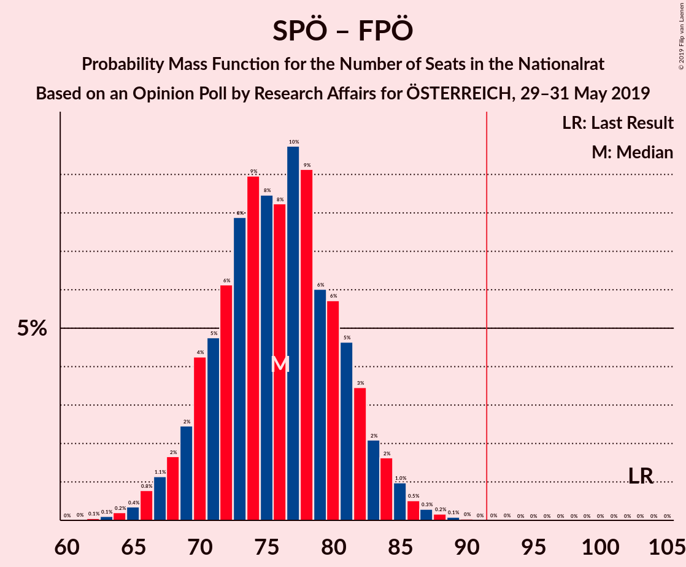

| Number of Seats | Probability | Accumulated | Special Marks |
|:---------------:|:-----------:|:-----------:|:-------------:|
| 62 | 0.1% | 100% |  |
| 63 | 0.1% | 99.9% |  |
| 64 | 0.1% | 99.8% |  |
| 65 | 0.5% | 99.7% |  |
| 66 | 1.1% | 99.2% |  |
| 67 | 1.0% | 98% |  |
| 68 | 1.0% | 97% |  |
| 69 | 4% | 96% |  |
| 70 | 5% | 92% |  |
| 71 | 3% | 87% |  |
| 72 | 5% | 84% |  |
| 73 | 12% | 79% |  |
| 74 | 11% | 67% |  |
| 75 | 3% | 57% |  |
| 76 | 9% | 53% | Median |
| 77 | 16% | 44% |  |
| 78 | 6% | 29% |  |
| 79 | 3% | 22% |  |
| 80 | 6% | 20% |  |
| 81 | 6% | 14% |  |
| 82 | 2% | 7% |  |
| 83 | 1.0% | 5% |  |
| 84 | 2% | 4% |  |
| 85 | 1.3% | 2% |  |
| 86 | 0.3% | 0.8% |  |
| 87 | 0.1% | 0.5% |  |
| 88 | 0.2% | 0.3% |  |
| 89 | 0.1% | 0.1% |  |
| 90 | 0% | 0% |  |
| 91 | 0% | 0% |  |
| 92 | 0% | 0% | Majority |
| 93 | 0% | 0% |  |
| 94 | 0% | 0% |  |
| 95 | 0% | 0% |  |
| 96 | 0% | 0% |  |
| 97 | 0% | 0% |  |
| 98 | 0% | 0% |  |
| 99 | 0% | 0% |  |
| 100 | 0% | 0% |  |
| 101 | 0% | 0% |  |
| 102 | 0% | 0% |  |
| 103 | 0% | 0% | Last Result |

### Österreichische Volkspartei

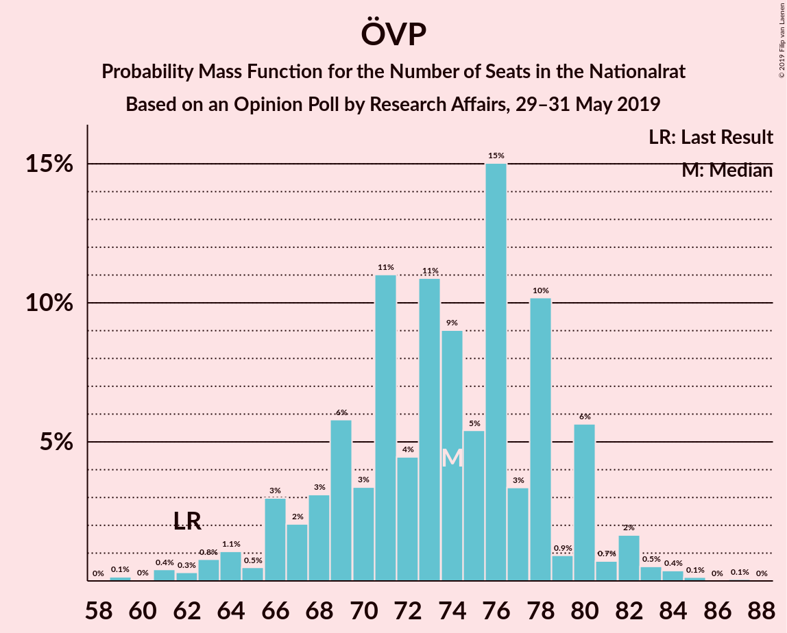

| Number of Seats | Probability | Accumulated | Special Marks |
|:---------------:|:-----------:|:-----------:|:-------------:|
| 59 | 0.1% | 100% |  |
| 60 | 0% | 99.8% |  |
| 61 | 0.4% | 99.8% |  |
| 62 | 0.3% | 99.4% | Last Result |
| 63 | 0.8% | 99.0% |  |
| 64 | 1.1% | 98% |  |
| 65 | 0.5% | 97% |  |
| 66 | 3% | 97% |  |
| 67 | 2% | 94% |  |
| 68 | 3% | 92% |  |
| 69 | 6% | 89% |  |
| 70 | 3% | 83% |  |
| 71 | 11% | 79% |  |
| 72 | 4% | 68% |  |
| 73 | 11% | 64% |  |
| 74 | 9% | 53% | Median |
| 75 | 5% | 44% |  |
| 76 | 15% | 39% |  |
| 77 | 3% | 24% |  |
| 78 | 10% | 20% |  |
| 79 | 0.9% | 10% |  |
| 80 | 6% | 9% |  |
| 81 | 0.7% | 3% |  |
| 82 | 2% | 3% |  |
| 83 | 0.5% | 1.1% |  |
| 84 | 0.4% | 0.6% |  |
| 85 | 0.1% | 0.2% |  |
| 86 | 0% | 0.1% |  |
| 87 | 0.1% | 0.1% |  |
| 88 | 0% | 0% |  |

### Sozialdemokratische Partei Österreichs

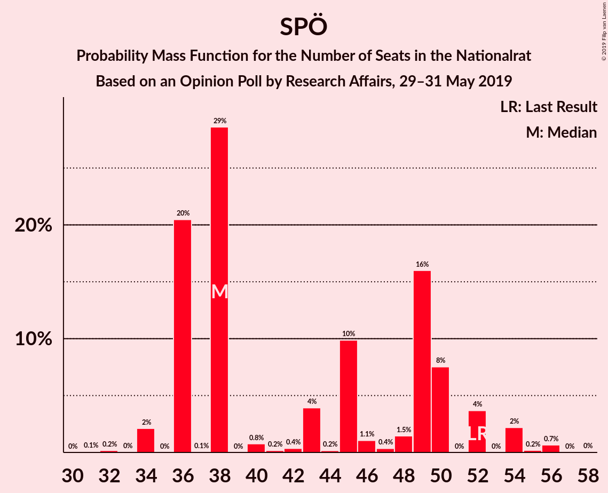

| Number of Seats | Probability | Accumulated | Special Marks |
|:---------------:|:-----------:|:-----------:|:-------------:|
| 32 | 0.1% | 100% |  |
| 33 | 0.1% | 99.9% |  |
| 34 | 0.2% | 99.8% |  |
| 35 | 0.9% | 99.6% |  |
| 36 | 0.9% | 98.7% |  |
| 37 | 2% | 98% |  |
| 38 | 6% | 96% |  |
| 39 | 3% | 90% |  |
| 40 | 4% | 87% |  |
| 41 | 17% | 82% |  |
| 42 | 7% | 66% |  |
| 43 | 7% | 59% |  |
| 44 | 17% | 52% | Median |
| 45 | 8% | 35% |  |
| 46 | 5% | 28% |  |
| 47 | 11% | 23% |  |
| 48 | 4% | 12% |  |
| 49 | 2% | 8% |  |
| 50 | 4% | 6% |  |
| 51 | 1.3% | 3% |  |
| 52 | 0.4% | 1.3% | Last Result |
| 53 | 0.6% | 1.0% |  |
| 54 | 0.2% | 0.3% |  |
| 55 | 0.1% | 0.1% |  |
| 56 | 0.1% | 0.1% |  |
| 57 | 0% | 0% |  |

## Technical Information

### Opinion Poll

+ **Polling firm:** Research Affairs
+ **Commissioner(s):** —
+ **Fieldwork period:** 29–31 May 2019

### Calculations

+ **Sample size:** 500
+ **Simulations done:** 131,072
+ **Error estimate:** 1.14%

