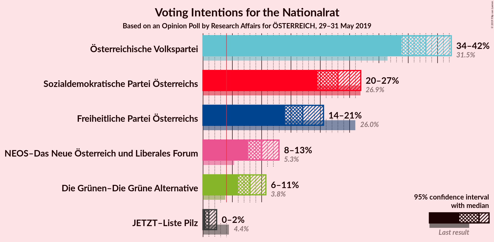
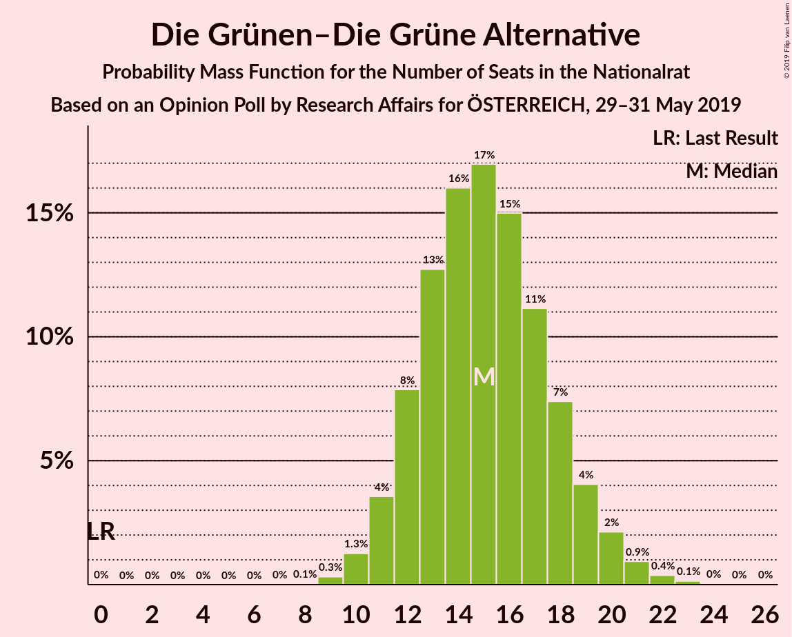
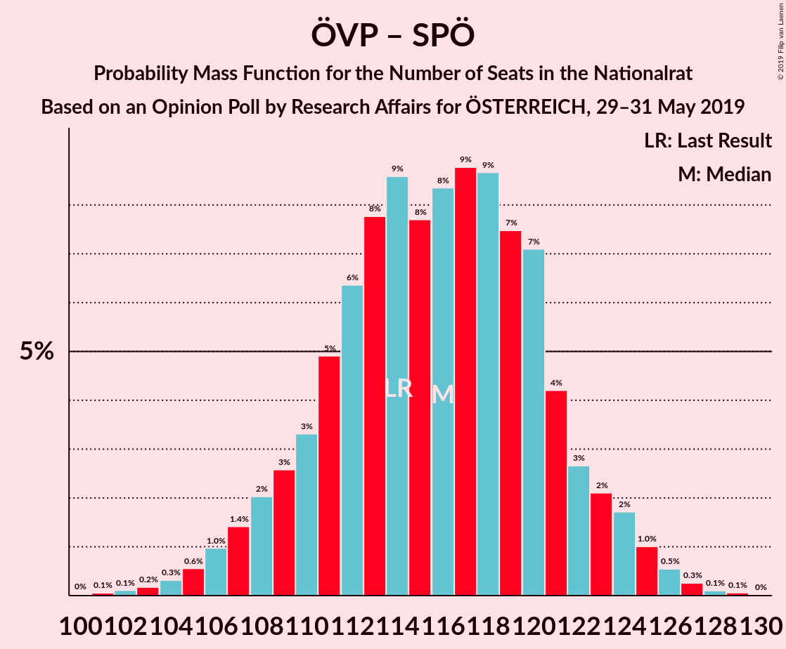

# Opinion Poll by Research Affairs, 29–31 May 2019

<a href="#voting-intentions">Voting Intentions</a> | <a href="#seats">Seats</a> | <a href="#coalitions">Coalitions</a> | <a href="#technical-information">Technical Information</a>

## Voting Intentions

### Confidence Intervals

| Party | Last Result | Poll Result | 80% Confidence Interval | 90% Confidence Interval | 95% Confidence Interval | 99% Confidence Interval |
|:-----:|:-----------:|:-----------:|:-----------------------:|:-----------------------:|:-----------------------:|:-----------------------:|
| Österreichische Volkspartei | 31.5% | 38.0% | 35.3–40.8% |34.5–41.6% |33.9–42.3% |32.6–43.7% |
| Sozialdemokratische Partei Österreichs | 26.9% | 23.0% | 20.7–25.5% |20.1–26.3% |19.5–26.9% |18.5–28.2% |
| Freiheitliche Partei Österreichs | 26.0% | 17.0% | 15.0–19.3% |14.4–20.0% |14.0–20.5% |13.0–21.7% |
| NEOS–Das Neue Österreich und Liberales Forum | 5.3% | 10.0% | 8.5–11.9% |8.0–12.5% |7.7–13.0% |7.0–13.9% |
| Die Grünen–Die Grüne Alternative | 3.8% | 8.0% | 6.6–9.8% |6.2–10.3% |5.9–10.7% |5.3–11.6% |
| JETZT–Liste Pilz | 4.4% | 1.0% | 0.6–1.8% |0.5–2.1% |0.4–2.3% |0.3–2.8% |

*Note:* The poll result column reflects the actual value used in the calculations. Published results may vary slightly, and in addition be rounded to fewer digits.

## Seats

### Confidence Intervals

| Party | Last Result | Median | 80% Confidence Interval | 90% Confidence Interval | 95% Confidence Interval | 99% Confidence Interval |
|:-----:|:-----------:|:------:|:-----------------------:|:-----------------------:|:-----------------------:|:-----------------------:|
| <a href="#österreichische-volkspartei">Österreichische Volkspartei</a> | 62 | 73 | 65–78 |65–78 |62–78 |61–78 |
| <a href="#sozialdemokratische-partei-österreichs">Sozialdemokratische Partei Österreichs</a> | 52 | 38 | 36–50 |36–52 |36–54 |34–56 |
| <a href="#freiheitliche-partei-österreichs">Freiheitliche Partei Österreichs</a> | 51 | 34 | 24–35 |24–35 |24–39 |23–41 |
| <a href="#neos–das-neue-österreich-und-liberales-forum">NEOS–Das Neue Österreich und Liberales Forum</a> | 10 | 17 | 16–20 |16–20 |16–21 |15–27 |
| <a href="#die-grünen–die-grüne-alternative">Die Grünen–Die Grüne Alternative</a> | 0 | 20 | 10–21 |10–22 |10–22 |9–22 |
| <a href="#jetzt–liste-pilz">JETZT–Liste Pilz</a> | 8 | 0 | 0 |0 |0 |0 |

### Österreichische Volkspartei

*For a full overview of the results for this party, see the [Österreichische Volkspartei](party-österreichischevolkspartei.html) page.*

| Number of Seats | Probability | Accumulated | Special Marks |
|:---------------:|:-----------:|:-----------:|:-------------:|
| 59 | 0.3% | 100% |  |
| 60 | 0% | 99.6% |  |
| 61 | 0.1% | 99.6% |  |
| 62 | 4% | 99.5% | Last Result |
| 63 | 0.3% | 96% |  |
| 64 | 0.4% | 96% |  |
| 65 | 11% | 95% |  |
| 66 | 0% | 84% |  |
| 67 | 4% | 84% |  |
| 68 | 0% | 80% |  |
| 69 | 0% | 80% |  |
| 70 | 0.7% | 80% |  |
| 71 | 13% | 79% |  |
| 72 | 0.4% | 66% |  |
| 73 | 37% | 66% | Median |
| 74 | 0.5% | 29% |  |
| 75 | 16% | 29% |  |
| 76 | 0.2% | 12% |  |
| 77 | 0% | 12% |  |
| 78 | 12% | 12% |  |
| 79 | 0.1% | 0.2% |  |
| 80 | 0% | 0.1% |  |
| 81 | 0% | 0.1% |  |
| 82 | 0% | 0.1% |  |
| 83 | 0% | 0.1% |  |
| 84 | 0% | 0.1% |  |
| 85 | 0% | 0% |  |

### Sozialdemokratische Partei Österreichs

*For a full overview of the results for this party, see the [Sozialdemokratische Partei Österreichs](party-sozialdemokratischeparteiösterreichs.html) page.*

| Number of Seats | Probability | Accumulated | Special Marks |
|:---------------:|:-----------:|:-----------:|:-------------:|
| 31 | 0.1% | 100% |  |
| 32 | 0.2% | 99.9% |  |
| 33 | 0% | 99.7% |  |
| 34 | 2% | 99.7% |  |
| 35 | 0% | 98% |  |
| 36 | 20% | 98% |  |
| 37 | 0.1% | 77% |  |
| 38 | 29% | 77% | Median |
| 39 | 0% | 48% |  |
| 40 | 0.8% | 48% |  |
| 41 | 0.2% | 48% |  |
| 42 | 0.4% | 47% |  |
| 43 | 4% | 47% |  |
| 44 | 0.2% | 43% |  |
| 45 | 10% | 43% |  |
| 46 | 1.1% | 33% |  |
| 47 | 0.4% | 32% |  |
| 48 | 1.5% | 32% |  |
| 49 | 16% | 30% |  |
| 50 | 8% | 14% |  |
| 51 | 0% | 7% |  |
| 52 | 4% | 7% | Last Result |
| 53 | 0% | 3% |  |
| 54 | 2% | 3% |  |
| 55 | 0.2% | 0.9% |  |
| 56 | 0.7% | 0.7% |  |
| 57 | 0% | 0% |  |

### Freiheitliche Partei Österreichs

*For a full overview of the results for this party, see the [Freiheitliche Partei Österreichs](party-freiheitlicheparteiösterreichs.html) page.*

| Number of Seats | Probability | Accumulated | Special Marks |
|:---------------:|:-----------:|:-----------:|:-------------:|
| 22 | 0.1% | 100% |  |
| 23 | 1.0% | 99.9% |  |
| 24 | 9% | 98.9% |  |
| 25 | 2% | 90% |  |
| 26 | 0% | 88% |  |
| 27 | 0% | 88% |  |
| 28 | 0% | 88% |  |
| 29 | 0% | 88% |  |
| 30 | 0.1% | 88% |  |
| 31 | 0.8% | 88% |  |
| 32 | 21% | 87% |  |
| 33 | 13% | 65% |  |
| 34 | 39% | 53% | Median |
| 35 | 11% | 14% |  |
| 36 | 0% | 3% |  |
| 37 | 0% | 3% |  |
| 38 | 0% | 3% |  |
| 39 | 0.3% | 3% |  |
| 40 | 0.9% | 2% |  |
| 41 | 0.9% | 1.3% |  |
| 42 | 0.3% | 0.5% |  |
| 43 | 0.2% | 0.2% |  |
| 44 | 0% | 0% |  |
| 45 | 0% | 0% |  |
| 46 | 0% | 0% |  |
| 47 | 0% | 0% |  |
| 48 | 0% | 0% |  |
| 49 | 0% | 0% |  |
| 50 | 0% | 0% |  |
| 51 | 0% | 0% | Last Result |

### NEOS–Das Neue Österreich und Liberales Forum

*For a full overview of the results for this party, see the [NEOS–Das Neue Österreich und Liberales Forum](party-neos–dasneueösterreichundliberalesforum.html) page.*

| Number of Seats | Probability | Accumulated | Special Marks |
|:---------------:|:-----------:|:-----------:|:-------------:|
| 10 | 0% | 100% | Last Result |
| 11 | 0% | 100% |  |
| 12 | 0% | 100% |  |
| 13 | 0% | 100% |  |
| 14 | 0.2% | 100% |  |
| 15 | 0.9% | 99.8% |  |
| 16 | 15% | 98.9% |  |
| 17 | 56% | 84% | Median |
| 18 | 12% | 27% |  |
| 19 | 3% | 15% |  |
| 20 | 9% | 12% |  |
| 21 | 2% | 4% |  |
| 22 | 0% | 1.4% |  |
| 23 | 0.1% | 1.4% |  |
| 24 | 0.2% | 1.3% |  |
| 25 | 0.2% | 1.1% |  |
| 26 | 0% | 0.9% |  |
| 27 | 0.8% | 0.9% |  |
| 28 | 0.1% | 0.1% |  |
| 29 | 0.1% | 0.1% |  |
| 30 | 0% | 0% |  |

### Die Grünen–Die Grüne Alternative

*For a full overview of the results for this party, see the [Die Grünen–Die Grüne Alternative](party-diegrünen–diegrünealternative.html) page.*

| Number of Seats | Probability | Accumulated | Special Marks |
|:---------------:|:-----------:|:-----------:|:-------------:|
| 0 | 0% | 100% | Last Result |
| 1 | 0% | 100% |  |
| 2 | 0% | 100% |  |
| 3 | 0% | 100% |  |
| 4 | 0% | 100% |  |
| 5 | 0% | 100% |  |
| 6 | 0% | 100% |  |
| 7 | 0% | 100% |  |
| 8 | 0% | 100% |  |
| 9 | 0.8% | 100% |  |
| 10 | 19% | 99.2% |  |
| 11 | 11% | 80% |  |
| 12 | 3% | 69% |  |
| 13 | 0.3% | 66% |  |
| 14 | 0.9% | 66% |  |
| 15 | 0.1% | 65% |  |
| 16 | 0% | 65% |  |
| 17 | 0% | 65% |  |
| 18 | 0% | 65% |  |
| 19 | 0% | 65% |  |
| 20 | 15% | 65% | Median |
| 21 | 40% | 49% |  |
| 22 | 9% | 10% |  |
| 23 | 0.1% | 0.1% |  |
| 24 | 0% | 0% |  |

### JETZT–Liste Pilz

*For a full overview of the results for this party, see the [JETZT–Liste Pilz](party-jetzt–listepilz.html) page.*

| Number of Seats | Probability | Accumulated | Special Marks |
|:---------------:|:-----------:|:-----------:|:-------------:|
| 0 | 100% | 100% | Median |
| 1 | 0% | 0% |  |
| 2 | 0% | 0% |  |
| 3 | 0% | 0% |  |
| 4 | 0% | 0% |  |
| 5 | 0% | 0% |  |
| 6 | 0% | 0% |  |
| 7 | 0% | 0% |  |
| 8 | 0% | 0% | Last Result |

## Coalitions

### Confidence Intervals

| Coalition | Last Result | Median | Majority? | 80% Confidence Interval | 90% Confidence Interval | 95% Confidence Interval | 99% Confidence Interval |
|:---------:|:-----------:|:------:|:---------:|:-----------------------:|:-----------------------:|:-----------------------:|:-----------------------:|
| Österreichische Volkspartei – Sozialdemokratische Partei Österreichs | 114 | 111 | 100% | 107–126 | 105–128 | 105–128 | 102–130 |
| Österreichische Volkspartei – Freiheitliche Partei Österreichs | 113 | 107 | 99.8% | 100–107 | 98–107 | 96–107 | 95–119 |
| Sozialdemokratische Partei Österreichs – Freiheitliche Partei Österreichs | 103 | 72 | 0% | 69–81 | 69–83 | 69–86 | 66–89 |
| Österreichische Volkspartei | 62 | 73 | 0% | 65–78 | 65–78 | 62–78 | 61–78 |
| Sozialdemokratische Partei Österreichs | 52 | 38 | 0% | 36–50 | 36–52 | 36–54 | 34–56 |

### Österreichische Volkspartei – Sozialdemokratische Partei Österreichs

| Number of Seats | Probability | Accumulated | Special Marks |
|:---------------:|:-----------:|:-----------:|:-------------:|
| 97 | 0.2% | 100% |  |
| 98 | 0% | 99.8% |  |
| 99 | 0% | 99.8% |  |
| 100 | 0.1% | 99.8% |  |
| 101 | 0% | 99.8% |  |
| 102 | 0.8% | 99.7% |  |
| 103 | 0.1% | 99.0% |  |
| 104 | 0.1% | 98.8% |  |
| 105 | 4% | 98.7% |  |
| 106 | 0.7% | 95% |  |
| 107 | 12% | 94% |  |
| 108 | 1.4% | 82% |  |
| 109 | 8% | 81% |  |
| 110 | 10% | 72% |  |
| 111 | 28% | 63% | Median |
| 112 | 0.8% | 34% |  |
| 113 | 0% | 33% |  |
| 114 | 0.3% | 33% | Last Result |
| 115 | 0% | 33% |  |
| 116 | 0.4% | 33% |  |
| 117 | 0.1% | 33% |  |
| 118 | 0.4% | 33% |  |
| 119 | 2% | 32% |  |
| 120 | 0% | 31% |  |
| 121 | 3% | 31% |  |
| 122 | 0% | 28% |  |
| 123 | 0.7% | 28% |  |
| 124 | 16% | 27% |  |
| 125 | 0% | 11% |  |
| 126 | 1.5% | 11% |  |
| 127 | 0% | 9% |  |
| 128 | 7% | 9% |  |
| 129 | 0% | 2% |  |
| 130 | 2% | 2% |  |
| 131 | 0% | 0% |  |

### Österreichische Volkspartei – Freiheitliche Partei Österreichs

| Number of Seats | Probability | Accumulated | Special Marks |
|:---------------:|:-----------:|:-----------:|:-------------:|
| 91 | 0.2% | 100% |  |
| 92 | 0.1% | 99.8% | Majority |
| 93 | 0% | 99.7% |  |
| 94 | 0.1% | 99.6% |  |
| 95 | 0.6% | 99.5% |  |
| 96 | 3% | 99.0% |  |
| 97 | 0.6% | 96% |  |
| 98 | 1.0% | 96% |  |
| 99 | 3% | 95% |  |
| 100 | 12% | 92% |  |
| 101 | 0.1% | 80% |  |
| 102 | 10% | 80% |  |
| 103 | 4% | 70% |  |
| 104 | 12% | 66% |  |
| 105 | 0.5% | 54% |  |
| 106 | 0% | 54% |  |
| 107 | 52% | 54% | Median |
| 108 | 0% | 1.1% |  |
| 109 | 0% | 1.1% |  |
| 110 | 0.1% | 1.1% |  |
| 111 | 0% | 1.1% |  |
| 112 | 0% | 1.1% |  |
| 113 | 0% | 1.1% | Last Result |
| 114 | 0% | 1.1% |  |
| 115 | 0.1% | 1.1% |  |
| 116 | 0% | 0.9% |  |
| 117 | 0% | 0.9% |  |
| 118 | 0% | 0.9% |  |
| 119 | 0.9% | 0.9% |  |
| 120 | 0% | 0% |  |

### Sozialdemokratische Partei Österreichs – Freiheitliche Partei Österreichs

| Number of Seats | Probability | Accumulated | Special Marks |
|:---------------:|:-----------:|:-----------:|:-------------:|
| 63 | 0% | 100% |  |
| 64 | 0% | 99.9% |  |
| 65 | 0% | 99.9% |  |
| 66 | 1.3% | 99.9% |  |
| 67 | 0% | 98.6% |  |
| 68 | 0.7% | 98.5% |  |
| 69 | 12% | 98% |  |
| 70 | 8% | 85% |  |
| 71 | 0.2% | 77% |  |
| 72 | 30% | 77% | Median |
| 73 | 0% | 47% |  |
| 74 | 8% | 47% |  |
| 75 | 0.9% | 39% |  |
| 76 | 0.1% | 38% |  |
| 77 | 5% | 38% |  |
| 78 | 1.4% | 33% |  |
| 79 | 0.1% | 32% |  |
| 80 | 11% | 32% |  |
| 81 | 16% | 21% |  |
| 82 | 0% | 5% |  |
| 83 | 0.4% | 5% |  |
| 84 | 2% | 5% |  |
| 85 | 0% | 3% |  |
| 86 | 2% | 3% |  |
| 87 | 0.3% | 1.0% |  |
| 88 | 0% | 0.7% |  |
| 89 | 0.7% | 0.7% |  |
| 90 | 0% | 0% |  |
| 91 | 0% | 0% |  |
| 92 | 0% | 0% | Majority |
| 93 | 0% | 0% |  |
| 94 | 0% | 0% |  |
| 95 | 0% | 0% |  |
| 96 | 0% | 0% |  |
| 97 | 0% | 0% |  |
| 98 | 0% | 0% |  |
| 99 | 0% | 0% |  |
| 100 | 0% | 0% |  |
| 101 | 0% | 0% |  |
| 102 | 0% | 0% |  |
| 103 | 0% | 0% | Last Result |

### Österreichische Volkspartei

| Number of Seats | Probability | Accumulated | Special Marks |
|:---------------:|:-----------:|:-----------:|:-------------:|
| 59 | 0.3% | 100% |  |
| 60 | 0% | 99.6% |  |
| 61 | 0.1% | 99.6% |  |
| 62 | 4% | 99.5% | Last Result |
| 63 | 0.3% | 96% |  |
| 64 | 0.4% | 96% |  |
| 65 | 11% | 95% |  |
| 66 | 0% | 84% |  |
| 67 | 4% | 84% |  |
| 68 | 0% | 80% |  |
| 69 | 0% | 80% |  |
| 70 | 0.7% | 80% |  |
| 71 | 13% | 79% |  |
| 72 | 0.4% | 66% |  |
| 73 | 37% | 66% | Median |
| 74 | 0.5% | 29% |  |
| 75 | 16% | 29% |  |
| 76 | 0.2% | 12% |  |
| 77 | 0% | 12% |  |
| 78 | 12% | 12% |  |
| 79 | 0.1% | 0.2% |  |
| 80 | 0% | 0.1% |  |
| 81 | 0% | 0.1% |  |
| 82 | 0% | 0.1% |  |
| 83 | 0% | 0.1% |  |
| 84 | 0% | 0.1% |  |
| 85 | 0% | 0% |  |

### Sozialdemokratische Partei Österreichs

| Number of Seats | Probability | Accumulated | Special Marks |
|:---------------:|:-----------:|:-----------:|:-------------:|
| 31 | 0.1% | 100% |  |
| 32 | 0.2% | 99.9% |  |
| 33 | 0% | 99.7% |  |
| 34 | 2% | 99.7% |  |
| 35 | 0% | 98% |  |
| 36 | 20% | 98% |  |
| 37 | 0.1% | 77% |  |
| 38 | 29% | 77% | Median |
| 39 | 0% | 48% |  |
| 40 | 0.8% | 48% |  |
| 41 | 0.2% | 48% |  |
| 42 | 0.4% | 47% |  |
| 43 | 4% | 47% |  |
| 44 | 0.2% | 43% |  |
| 45 | 10% | 43% |  |
| 46 | 1.1% | 33% |  |
| 47 | 0.4% | 32% |  |
| 48 | 1.5% | 32% |  |
| 49 | 16% | 30% |  |
| 50 | 8% | 14% |  |
| 51 | 0% | 7% |  |
| 52 | 4% | 7% | Last Result |
| 53 | 0% | 3% |  |
| 54 | 2% | 3% |  |
| 55 | 0.2% | 0.9% |  |
| 56 | 0.7% | 0.7% |  |
| 57 | 0% | 0% |  |

## Technical Information

### Opinion Poll

+ **Polling firm:** Research Affairs
+ **Commissioner(s):** —
+ **Fieldwork period:** 29–31 May 2019

### Calculations

+ **Sample size:** 500
+ **Simulations done:** 1,024
+ **Error estimate:** 4.91%

