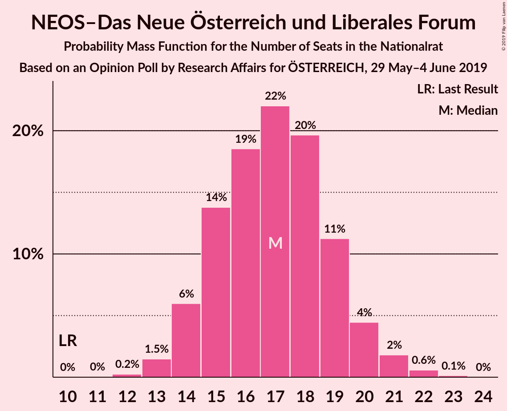
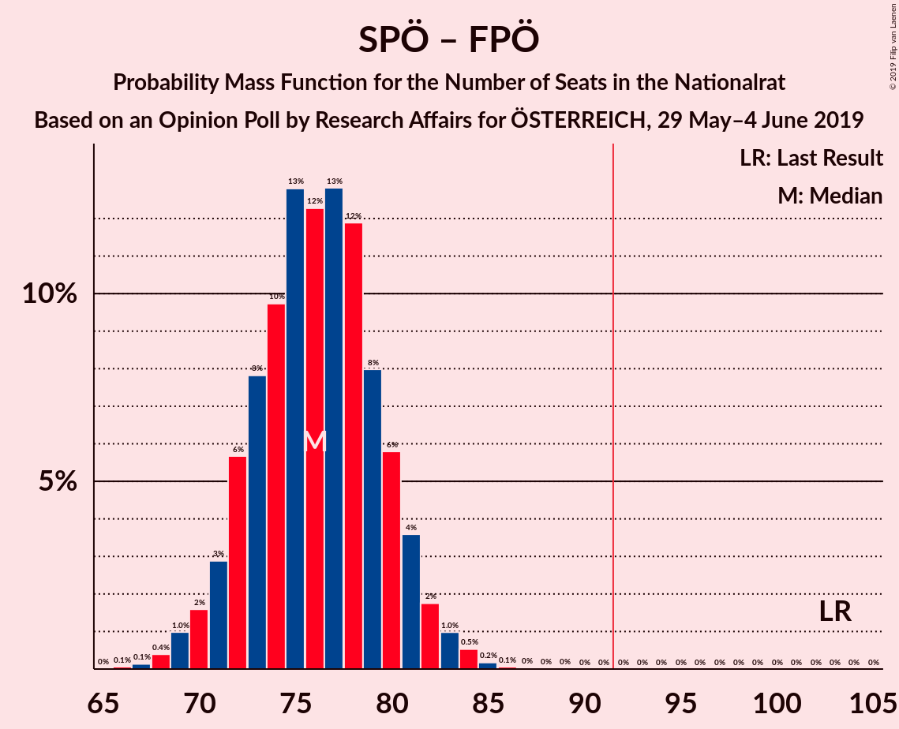

# Opinion Poll by Research Affairs for ÖSTERREICH, 29 May–4 June 2019

<a href="#voting-intentions">Voting Intentions</a> | <a href="#seats">Seats</a> | <a href="#coalitions">Coalitions</a> | <a href="#technical-information">Technical Information</a>

## Voting Intentions

### Confidence Intervals

| Party | Last Result | Poll Result | 80% Confidence Interval | 90% Confidence Interval | 95% Confidence Interval | 99% Confidence Interval |
|:-----:|:-----------:|:-----------:|:-----------------------:|:-----------------------:|:-----------------------:|:-----------------------:|
| Österreichische Volkspartei | 31.5% | 38.0% | 36.1–40.0% |35.5–40.6% |35.0–41.1% |34.1–42.0% |
| Sozialdemokratische Partei Österreichs | 26.9% | 23.0% | 21.4–24.8% |20.9–25.3% |20.5–25.7% |19.7–26.6% |
| Freiheitliche Partei Österreichs | 26.0% | 17.0% | 15.5–18.6% |15.1–19.1% |14.8–19.5% |14.1–20.3% |
| NEOS–Das Neue Österreich und Liberales Forum | 5.3% | 9.0% | 7.9–10.3% |7.6–10.6% |7.4–10.9% |6.9–11.6% |
| Die Grünen–Die Grüne Alternative | 3.8% | 9.0% | 7.9–10.3% |7.6–10.6% |7.4–10.9% |6.9–11.6% |
| JETZT–Liste Pilz | 4.4% | 1.0% | 0.7–1.5% |0.6–1.7% |0.5–1.8% |0.4–2.1% |

*Note:* The poll result column reflects the actual value used in the calculations. Published results may vary slightly, and in addition be rounded to fewer digits.

## Seats

### Confidence Intervals

| Party | Last Result | Median | 80% Confidence Interval | 90% Confidence Interval | 95% Confidence Interval | 99% Confidence Interval |
|:-----:|:-----------:|:------:|:-----------------------:|:-----------------------:|:-----------------------:|:-----------------------:|
| <a href="#österreichische-volkspartei">Österreichische Volkspartei</a> | 62 | 73 | 69–76 |68–77 |67–78 |65–80 |
| <a href="#sozialdemokratische-partei-österreichs">Sozialdemokratische Partei Österreichs</a> | 52 | 44 | 40–47 |40–48 |39–49 |37–51 |
| <a href="#freiheitliche-partei-österreichs">Freiheitliche Partei Österreichs</a> | 51 | 32 | 29–35 |29–36 |28–37 |27–38 |
| <a href="#neos–das-neue-österreich-und-liberales-forum">NEOS–Das Neue Österreich und Liberales Forum</a> | 10 | 17 | 15–19 |14–20 |14–21 |13–22 |
| <a href="#die-grünen–die-grüne-alternative">Die Grünen–Die Grüne Alternative</a> | 0 | 17 | 15–19 |14–20 |14–20 |13–22 |
| <a href="#jetzt–liste-pilz">JETZT–Liste Pilz</a> | 8 | 0 | 0 |0 |0 |0 |

### Österreichische Volkspartei

*For a full overview of the results for this party, see the [Österreichische Volkspartei](party-österreichischevolkspartei.html) page.*

| Number of Seats | Probability | Accumulated | Special Marks |
|:---------------:|:-----------:|:-----------:|:-------------:|
| 62 | 0% | 100% | Last Result |
| 63 | 0.1% | 100% |  |
| 64 | 0.2% | 99.9% |  |
| 65 | 0.6% | 99.6% |  |
| 66 | 1.2% | 99.1% |  |
| 67 | 2% | 98% |  |
| 68 | 4% | 95% |  |
| 69 | 7% | 92% |  |
| 70 | 9% | 85% |  |
| 71 | 12% | 76% |  |
| 72 | 12% | 64% |  |
| 73 | 14% | 52% | Median |
| 74 | 12% | 38% |  |
| 75 | 9% | 26% |  |
| 76 | 7% | 17% |  |
| 77 | 5% | 10% |  |
| 78 | 3% | 5% |  |
| 79 | 1.4% | 2% |  |
| 80 | 0.6% | 1.0% |  |
| 81 | 0.3% | 0.4% |  |
| 82 | 0.1% | 0.1% |  |
| 83 | 0% | 0% |  |

### Sozialdemokratische Partei Österreichs

*For a full overview of the results for this party, see the [Sozialdemokratische Partei Österreichs](party-sozialdemokratischeparteiösterreichs.html) page.*

| Number of Seats | Probability | Accumulated | Special Marks |
|:---------------:|:-----------:|:-----------:|:-------------:|
| 36 | 0.1% | 100% |  |
| 37 | 0.4% | 99.8% |  |
| 38 | 1.2% | 99.4% |  |
| 39 | 3% | 98% |  |
| 40 | 5% | 95% |  |
| 41 | 9% | 90% |  |
| 42 | 12% | 81% |  |
| 43 | 14% | 69% |  |
| 44 | 15% | 55% | Median |
| 45 | 15% | 40% |  |
| 46 | 10% | 25% |  |
| 47 | 7% | 14% |  |
| 48 | 4% | 8% |  |
| 49 | 2% | 4% |  |
| 50 | 0.9% | 1.4% |  |
| 51 | 0.4% | 0.5% |  |
| 52 | 0.1% | 0.2% | Last Result |
| 53 | 0% | 0.1% |  |
| 54 | 0% | 0% |  |

### Freiheitliche Partei Österreichs

*For a full overview of the results for this party, see the [Freiheitliche Partei Österreichs](party-freiheitlicheparteiösterreichs.html) page.*

| Number of Seats | Probability | Accumulated | Special Marks |
|:---------------:|:-----------:|:-----------:|:-------------:|
| 25 | 0.1% | 100% |  |
| 26 | 0.3% | 99.9% |  |
| 27 | 1.1% | 99.6% |  |
| 28 | 3% | 98% |  |
| 29 | 6% | 95% |  |
| 30 | 11% | 89% |  |
| 31 | 15% | 78% |  |
| 32 | 17% | 63% | Median |
| 33 | 15% | 46% |  |
| 34 | 13% | 30% |  |
| 35 | 9% | 17% |  |
| 36 | 5% | 8% |  |
| 37 | 2% | 4% |  |
| 38 | 0.9% | 1.3% |  |
| 39 | 0.3% | 0.5% |  |
| 40 | 0.1% | 0.1% |  |
| 41 | 0% | 0% |  |
| 42 | 0% | 0% |  |
| 43 | 0% | 0% |  |
| 44 | 0% | 0% |  |
| 45 | 0% | 0% |  |
| 46 | 0% | 0% |  |
| 47 | 0% | 0% |  |
| 48 | 0% | 0% |  |
| 49 | 0% | 0% |  |
| 50 | 0% | 0% |  |
| 51 | 0% | 0% | Last Result |

### NEOS–Das Neue Österreich und Liberales Forum

*For a full overview of the results for this party, see the [NEOS–Das Neue Österreich und Liberales Forum](party-neos–dasneueösterreichundliberalesforum.html) page.*

| Number of Seats | Probability | Accumulated | Special Marks |
|:---------------:|:-----------:|:-----------:|:-------------:|
| 10 | 0% | 100% | Last Result |
| 11 | 0% | 100% |  |
| 12 | 0.2% | 100% |  |
| 13 | 1.5% | 99.7% |  |
| 14 | 6% | 98% |  |
| 15 | 14% | 92% |  |
| 16 | 19% | 78% |  |
| 17 | 22% | 60% | Median |
| 18 | 20% | 38% |  |
| 19 | 11% | 18% |  |
| 20 | 4% | 7% |  |
| 21 | 2% | 3% |  |
| 22 | 0.6% | 0.7% |  |
| 23 | 0.1% | 0.2% |  |
| 24 | 0% | 0% |  |

### Die Grünen–Die Grüne Alternative

*For a full overview of the results for this party, see the [Die Grünen–Die Grüne Alternative](party-diegrünen–diegrünealternative.html) page.*

| Number of Seats | Probability | Accumulated | Special Marks |
|:---------------:|:-----------:|:-----------:|:-------------:|
| 0 | 0% | 100% | Last Result |
| 1 | 0% | 100% |  |
| 2 | 0% | 100% |  |
| 3 | 0% | 100% |  |
| 4 | 0% | 100% |  |
| 5 | 0% | 100% |  |
| 6 | 0% | 100% |  |
| 7 | 0% | 100% |  |
| 8 | 0% | 100% |  |
| 9 | 0% | 100% |  |
| 10 | 0% | 100% |  |
| 11 | 0% | 100% |  |
| 12 | 0.3% | 100% |  |
| 13 | 2% | 99.7% |  |
| 14 | 6% | 98% |  |
| 15 | 13% | 92% |  |
| 16 | 20% | 79% |  |
| 17 | 23% | 59% | Median |
| 18 | 18% | 36% |  |
| 19 | 11% | 18% |  |
| 20 | 5% | 8% |  |
| 21 | 2% | 2% |  |
| 22 | 0.6% | 0.7% |  |
| 23 | 0.1% | 0.2% |  |
| 24 | 0% | 0% |  |

### JETZT–Liste Pilz

*For a full overview of the results for this party, see the [JETZT–Liste Pilz](party-jetzt–listepilz.html) page.*

| Number of Seats | Probability | Accumulated | Special Marks |
|:---------------:|:-----------:|:-----------:|:-------------:|
| 0 | 100% | 100% | Median |
| 1 | 0% | 0% |  |
| 2 | 0% | 0% |  |
| 3 | 0% | 0% |  |
| 4 | 0% | 0% |  |
| 5 | 0% | 0% |  |
| 6 | 0% | 0% |  |
| 7 | 0% | 0% |  |
| 8 | 0% | 0% | Last Result |

## Coalitions

### Confidence Intervals

| Coalition | Last Result | Median | Majority? | 80% Confidence Interval | 90% Confidence Interval | 95% Confidence Interval | 99% Confidence Interval |
|:---------:|:-----------:|:------:|:---------:|:-----------------------:|:-----------------------:|:-----------------------:|:-----------------------:|
| Österreichische Volkspartei – Sozialdemokratische Partei Österreichs | 114 | 117 | 100% | 112–120 | 111–121 | 110–122 | 108–124 |
| Österreichische Volkspartei – Freiheitliche Partei Österreichs | 113 | 105 | 100% | 101–109 | 100–110 | 99–111 | 96–113 |
| Sozialdemokratische Partei Österreichs – Freiheitliche Partei Österreichs | 103 | 76 | 0% | 72–80 | 71–81 | 70–82 | 68–84 |
| Österreichische Volkspartei | 62 | 73 | 0% | 69–76 | 68–77 | 67–78 | 65–80 |
| Sozialdemokratische Partei Österreichs | 52 | 44 | 0% | 40–47 | 40–48 | 39–49 | 37–51 |

### Österreichische Volkspartei – Sozialdemokratische Partei Österreichs

| Number of Seats | Probability | Accumulated | Special Marks |
|:---------------:|:-----------:|:-----------:|:-------------:|
| 105 | 0% | 100% |  |
| 106 | 0.1% | 99.9% |  |
| 107 | 0.2% | 99.8% |  |
| 108 | 0.4% | 99.6% |  |
| 109 | 0.8% | 99.2% |  |
| 110 | 2% | 98% |  |
| 111 | 3% | 97% |  |
| 112 | 4% | 94% |  |
| 113 | 7% | 90% |  |
| 114 | 9% | 83% | Last Result |
| 115 | 12% | 74% |  |
| 116 | 12% | 62% |  |
| 117 | 13% | 50% | Median |
| 118 | 12% | 37% |  |
| 119 | 10% | 25% |  |
| 120 | 7% | 15% |  |
| 121 | 4% | 8% |  |
| 122 | 2% | 4% |  |
| 123 | 1.2% | 2% |  |
| 124 | 0.5% | 0.7% |  |
| 125 | 0.2% | 0.3% |  |
| 126 | 0.1% | 0.1% |  |
| 127 | 0% | 0% |  |

### Österreichische Volkspartei – Freiheitliche Partei Österreichs

| Number of Seats | Probability | Accumulated | Special Marks |
|:---------------:|:-----------:|:-----------:|:-------------:|
| 94 | 0.1% | 100% |  |
| 95 | 0.1% | 99.9% |  |
| 96 | 0.3% | 99.8% |  |
| 97 | 0.6% | 99.5% |  |
| 98 | 1.2% | 98.9% |  |
| 99 | 2% | 98% |  |
| 100 | 4% | 95% |  |
| 101 | 6% | 92% |  |
| 102 | 8% | 86% |  |
| 103 | 10% | 78% |  |
| 104 | 12% | 68% |  |
| 105 | 13% | 56% | Median |
| 106 | 12% | 43% |  |
| 107 | 11% | 31% |  |
| 108 | 7% | 20% |  |
| 109 | 6% | 12% |  |
| 110 | 3% | 7% |  |
| 111 | 2% | 3% |  |
| 112 | 0.9% | 1.5% |  |
| 113 | 0.4% | 0.6% | Last Result |
| 114 | 0.1% | 0.2% |  |
| 115 | 0% | 0.1% |  |
| 116 | 0% | 0% |  |

### Sozialdemokratische Partei Österreichs – Freiheitliche Partei Österreichs

| Number of Seats | Probability | Accumulated | Special Marks |
|:---------------:|:-----------:|:-----------:|:-------------:|
| 66 | 0.1% | 100% |  |
| 67 | 0.1% | 99.9% |  |
| 68 | 0.4% | 99.8% |  |
| 69 | 1.0% | 99.4% |  |
| 70 | 2% | 98% |  |
| 71 | 3% | 97% |  |
| 72 | 6% | 94% |  |
| 73 | 8% | 88% |  |
| 74 | 10% | 80% |  |
| 75 | 13% | 71% |  |
| 76 | 12% | 58% | Median |
| 77 | 13% | 46% |  |
| 78 | 12% | 33% |  |
| 79 | 8% | 21% |  |
| 80 | 6% | 13% |  |
| 81 | 4% | 7% |  |
| 82 | 2% | 4% |  |
| 83 | 1.0% | 2% |  |
| 84 | 0.5% | 0.8% |  |
| 85 | 0.2% | 0.3% |  |
| 86 | 0.1% | 0.1% |  |
| 87 | 0% | 0% |  |
| 88 | 0% | 0% |  |
| 89 | 0% | 0% |  |
| 90 | 0% | 0% |  |
| 91 | 0% | 0% |  |
| 92 | 0% | 0% | Majority |
| 93 | 0% | 0% |  |
| 94 | 0% | 0% |  |
| 95 | 0% | 0% |  |
| 96 | 0% | 0% |  |
| 97 | 0% | 0% |  |
| 98 | 0% | 0% |  |
| 99 | 0% | 0% |  |
| 100 | 0% | 0% |  |
| 101 | 0% | 0% |  |
| 102 | 0% | 0% |  |
| 103 | 0% | 0% | Last Result |

### Österreichische Volkspartei

| Number of Seats | Probability | Accumulated | Special Marks |
|:---------------:|:-----------:|:-----------:|:-------------:|
| 62 | 0% | 100% | Last Result |
| 63 | 0.1% | 100% |  |
| 64 | 0.2% | 99.9% |  |
| 65 | 0.6% | 99.6% |  |
| 66 | 1.2% | 99.1% |  |
| 67 | 2% | 98% |  |
| 68 | 4% | 95% |  |
| 69 | 7% | 92% |  |
| 70 | 9% | 85% |  |
| 71 | 12% | 76% |  |
| 72 | 12% | 64% |  |
| 73 | 14% | 52% | Median |
| 74 | 12% | 38% |  |
| 75 | 9% | 26% |  |
| 76 | 7% | 17% |  |
| 77 | 5% | 10% |  |
| 78 | 3% | 5% |  |
| 79 | 1.4% | 2% |  |
| 80 | 0.6% | 1.0% |  |
| 81 | 0.3% | 0.4% |  |
| 82 | 0.1% | 0.1% |  |
| 83 | 0% | 0% |  |

### Sozialdemokratische Partei Österreichs

| Number of Seats | Probability | Accumulated | Special Marks |
|:---------------:|:-----------:|:-----------:|:-------------:|
| 36 | 0.1% | 100% |  |
| 37 | 0.4% | 99.8% |  |
| 38 | 1.2% | 99.4% |  |
| 39 | 3% | 98% |  |
| 40 | 5% | 95% |  |
| 41 | 9% | 90% |  |
| 42 | 12% | 81% |  |
| 43 | 14% | 69% |  |
| 44 | 15% | 55% | Median |
| 45 | 15% | 40% |  |
| 46 | 10% | 25% |  |
| 47 | 7% | 14% |  |
| 48 | 4% | 8% |  |
| 49 | 2% | 4% |  |
| 50 | 0.9% | 1.4% |  |
| 51 | 0.4% | 0.5% |  |
| 52 | 0.1% | 0.2% | Last Result |
| 53 | 0% | 0.1% |  |
| 54 | 0% | 0% |  |

## Technical Information

### Opinion Poll

+ **Polling firm:** Research Affairs
+ **Commissioner(s):** ÖSTERREICH
+ **Fieldwork period:** 29 May–4 June 2019

### Calculations

+ **Sample size:** 1000
+ **Simulations done:** 1,048,576
+ **Error estimate:** 0.75%

