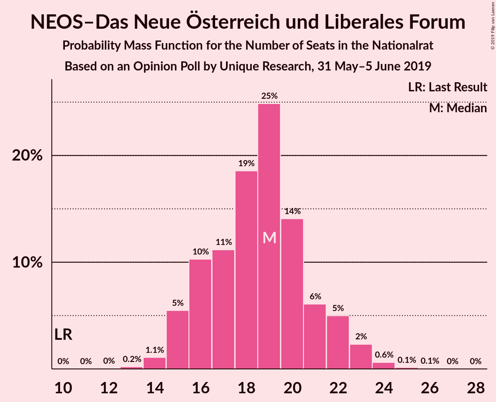
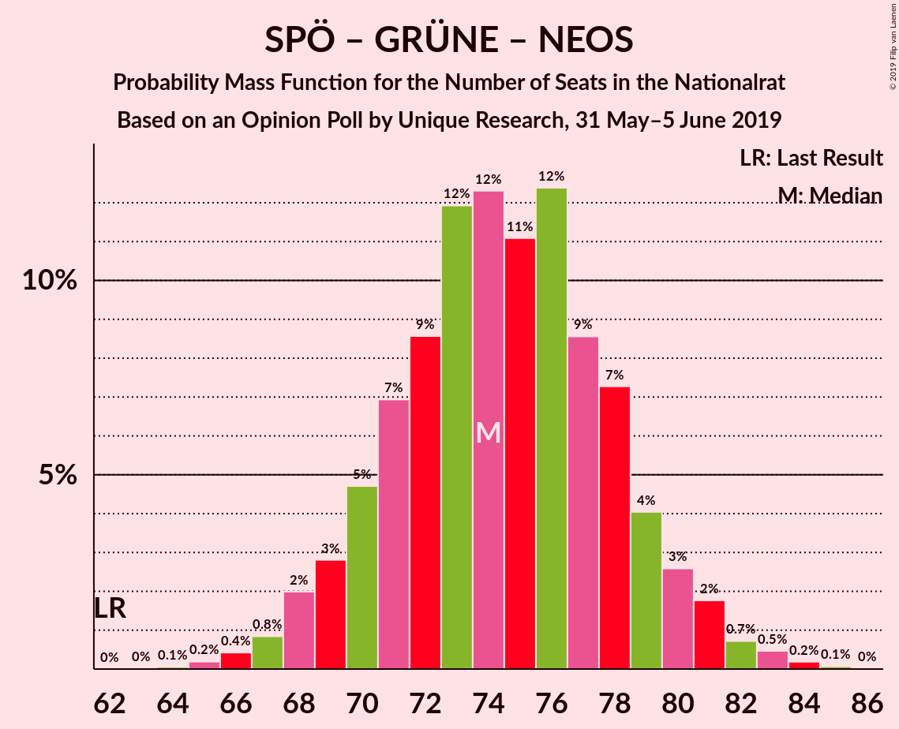

# Opinion Poll by Unique Research, 31 May–5 June 2019

<a href="#voting-intentions">Voting Intentions</a> | <a href="#seats">Seats</a> | <a href="#coalitions">Coalitions</a> | <a href="#technical-information">Technical Information</a>

## Voting Intentions

### Confidence Intervals

| Party | Last Result | Poll Result | 80% Confidence Interval | 90% Confidence Interval | 95% Confidence Interval | 99% Confidence Interval |
|:-----:|:-----------:|:-----------:|:-----------------------:|:-----------------------:|:-----------------------:|:-----------------------:|
| Österreichische Volkspartei | 31.5% | 37.0% | 34.8–39.2% |34.2–39.9% |33.7–40.4% |32.7–41.5% |
| Freiheitliche Partei Österreichs | 26.0% | 21.0% | 19.2–22.9% |18.7–23.5% |18.3–24.0% |17.5–24.9% |
| Sozialdemokratische Partei Österreichs | 26.9% | 20.0% | 18.3–21.9% |17.8–22.5% |17.4–22.9% |16.6–23.9% |
| NEOS–Das Neue Österreich und Liberales Forum | 5.3% | 10.0% | 8.7–11.5% |8.4–11.9% |8.1–12.3% |7.5–13.0% |
| Die Grünen–Die Grüne Alternative | 3.8% | 10.0% | 8.7–11.5% |8.4–11.9% |8.1–12.3% |7.5–13.0% |
| JETZT–Liste Pilz | 4.4% | 1.0% | 0.7–1.6% |0.6–1.8% |0.5–2.0% |0.4–2.3% |

*Note:* The poll result column reflects the actual value used in the calculations. Published results may vary slightly, and in addition be rounded to fewer digits.

## Seats

### Confidence Intervals

| Party | Last Result | Median | 80% Confidence Interval | 90% Confidence Interval | 95% Confidence Interval | 99% Confidence Interval |
|:-----:|:-----------:|:------:|:-----------------------:|:-----------------------:|:-----------------------:|:-----------------------:|
| <a href="#österreichische-volkspartei">Österreichische Volkspartei</a> | 62 | 71 | 68–71 |68–71 |66–71 |66–73 |
| <a href="#freiheitliche-partei-österreichs">Freiheitliche Partei Österreichs</a> | 51 | 40 | 40–42 |37–42 |37–42 |37–42 |
| <a href="#sozialdemokratische-partei-österreichs">Sozialdemokratische Partei Österreichs</a> | 52 | 37 | 36–37 |36–38 |36–41 |35–41 |
| <a href="#neos–das-neue-österreich-und-liberales-forum">NEOS–Das Neue Österreich und Liberales Forum</a> | 10 | 18 | 18–19 |18–19 |18–22 |15–22 |
| <a href="#die-grünen–die-grüne-alternative">Die Grünen–Die Grüne Alternative</a> | 0 | 17 | 17–18 |17–18 |17–18 |17–19 |
| <a href="#jetzt–liste-pilz">JETZT–Liste Pilz</a> | 8 | 0 | 0 |0 |0 |0 |

### Österreichische Volkspartei

*For a full overview of the results for this party, see the [Österreichische Volkspartei](party-österreichischevolkspartei.html) page.*

| Number of Seats | Probability | Accumulated | Special Marks |
|:---------------:|:-----------:|:-----------:|:-------------:|
| 62 | 0.1% | 100% | Last Result |
| 63 | 0% | 99.9% |  |
| 64 | 0% | 99.9% |  |
| 65 | 0% | 99.9% |  |
| 66 | 3% | 99.9% |  |
| 67 | 0% | 97% |  |
| 68 | 10% | 97% |  |
| 69 | 0.4% | 87% |  |
| 70 | 0% | 86% |  |
| 71 | 84% | 86% | Median |
| 72 | 0.2% | 2% |  |
| 73 | 2% | 2% |  |
| 74 | 0.2% | 0.4% |  |
| 75 | 0% | 0.2% |  |
| 76 | 0% | 0.2% |  |
| 77 | 0.2% | 0.2% |  |
| 78 | 0% | 0% |  |

### Freiheitliche Partei Österreichs

*For a full overview of the results for this party, see the [Freiheitliche Partei Österreichs](party-freiheitlicheparteiösterreichs.html) page.*

| Number of Seats | Probability | Accumulated | Special Marks |
|:---------------:|:-----------:|:-----------:|:-------------:|
| 32 | 0.2% | 100% |  |
| 33 | 0% | 99.8% |  |
| 34 | 0% | 99.8% |  |
| 35 | 0% | 99.8% |  |
| 36 | 0% | 99.8% |  |
| 37 | 5% | 99.8% |  |
| 38 | 0% | 95% |  |
| 39 | 0% | 95% |  |
| 40 | 84% | 95% | Median |
| 41 | 0% | 11% |  |
| 42 | 11% | 11% |  |
| 43 | 0% | 0.2% |  |
| 44 | 0% | 0.2% |  |
| 45 | 0.2% | 0.2% |  |
| 46 | 0% | 0% |  |
| 47 | 0% | 0% |  |
| 48 | 0% | 0% |  |
| 49 | 0% | 0% |  |
| 50 | 0% | 0% |  |
| 51 | 0% | 0% | Last Result |

### Sozialdemokratische Partei Österreichs

*For a full overview of the results for this party, see the [Sozialdemokratische Partei Österreichs](party-sozialdemokratischeparteiösterreichs.html) page.*

| Number of Seats | Probability | Accumulated | Special Marks |
|:---------------:|:-----------:|:-----------:|:-------------:|
| 32 | 0.2% | 100% |  |
| 33 | 0% | 99.8% |  |
| 34 | 0.2% | 99.8% |  |
| 35 | 0.3% | 99.6% |  |
| 36 | 10% | 99.4% |  |
| 37 | 84% | 89% | Median |
| 38 | 0% | 5% |  |
| 39 | 0.1% | 5% |  |
| 40 | 2% | 5% |  |
| 41 | 3% | 3% |  |
| 42 | 0% | 0.2% |  |
| 43 | 0.2% | 0.2% |  |
| 44 | 0% | 0% |  |
| 45 | 0% | 0% |  |
| 46 | 0% | 0% |  |
| 47 | 0% | 0% |  |
| 48 | 0% | 0% |  |
| 49 | 0% | 0% |  |
| 50 | 0% | 0% |  |
| 51 | 0% | 0% |  |
| 52 | 0% | 0% | Last Result |

### NEOS–Das Neue Österreich und Liberales Forum

*For a full overview of the results for this party, see the [NEOS–Das Neue Österreich und Liberales Forum](party-neos–dasneueösterreichundliberalesforum.html) page.*

| Number of Seats | Probability | Accumulated | Special Marks |
|:---------------:|:-----------:|:-----------:|:-------------:|
| 10 | 0% | 100% | Last Result |
| 11 | 0% | 100% |  |
| 12 | 0% | 100% |  |
| 13 | 0% | 100% |  |
| 14 | 0.4% | 100% |  |
| 15 | 2% | 99.6% |  |
| 16 | 0% | 98% |  |
| 17 | 0.2% | 98% |  |
| 18 | 84% | 98% | Median |
| 19 | 10% | 13% |  |
| 20 | 0% | 3% |  |
| 21 | 0% | 3% |  |
| 22 | 3% | 3% |  |
| 23 | 0.1% | 0.1% |  |
| 24 | 0% | 0% |  |

### Die Grünen–Die Grüne Alternative

*For a full overview of the results for this party, see the [Die Grünen–Die Grüne Alternative](party-diegrünen–diegrünealternative.html) page.*

| Number of Seats | Probability | Accumulated | Special Marks |
|:---------------:|:-----------:|:-----------:|:-------------:|
| 0 | 0% | 100% | Last Result |
| 1 | 0% | 100% |  |
| 2 | 0% | 100% |  |
| 3 | 0% | 100% |  |
| 4 | 0% | 100% |  |
| 5 | 0% | 100% |  |
| 6 | 0% | 100% |  |
| 7 | 0% | 100% |  |
| 8 | 0% | 100% |  |
| 9 | 0% | 100% |  |
| 10 | 0% | 100% |  |
| 11 | 0% | 100% |  |
| 12 | 0% | 100% |  |
| 13 | 0% | 100% |  |
| 14 | 0% | 100% |  |
| 15 | 0% | 100% |  |
| 16 | 0.2% | 100% |  |
| 17 | 87% | 99.8% | Median |
| 18 | 12% | 13% |  |
| 19 | 0.1% | 0.5% |  |
| 20 | 0% | 0.4% |  |
| 21 | 0% | 0.4% |  |
| 22 | 0.2% | 0.4% |  |
| 23 | 0.2% | 0.2% |  |
| 24 | 0% | 0% |  |

### JETZT–Liste Pilz

*For a full overview of the results for this party, see the [JETZT–Liste Pilz](party-jetzt–listepilz.html) page.*

| Number of Seats | Probability | Accumulated | Special Marks |
|:---------------:|:-----------:|:-----------:|:-------------:|
| 0 | 100% | 100% | Median |
| 1 | 0% | 0% |  |
| 2 | 0% | 0% |  |
| 3 | 0% | 0% |  |
| 4 | 0% | 0% |  |
| 5 | 0% | 0% |  |
| 6 | 0% | 0% |  |
| 7 | 0% | 0% |  |
| 8 | 0% | 0% | Last Result |

## Coalitions

### Confidence Intervals

| Coalition | Last Result | Median | Majority? | 80% Confidence Interval | 90% Confidence Interval | 95% Confidence Interval | 99% Confidence Interval |
|:---------:|:-----------:|:------:|:---------:|:-----------------------:|:-----------------------:|:-----------------------:|:-----------------------:|
| Österreichische Volkspartei – Freiheitliche Partei Österreichs | 113 | 111 | 100% | 110–111 | 110–111 | 103–111 | 103–111 |
| Österreichische Volkspartei – Sozialdemokratische Partei Österreichs | 114 | 108 | 100% | 104–108 | 104–108 | 104–108 | 104–113 |
| Österreichische Volkspartei – Die Grünen–Die Grüne Alternative – NEOS–Das Neue Österreich und Liberales Forum | 72 | 106 | 100% | 105–106 | 105–106 | 105–106 | 105–107 |
| Österreichische Volkspartei – NEOS–Das Neue Österreich und Liberales Forum | 72 | 89 | 0% | 87–89 | 87–89 | 87–89 | 86–89 |
| Österreichische Volkspartei – Die Grünen–Die Grüne Alternative | 62 | 88 | 0.4% | 86–88 | 86–88 | 83–88 | 83–91 |
| Sozialdemokratische Partei Österreichs – Die Grünen–Die Grüne Alternative – NEOS–Das Neue Österreich und Liberales Forum | 62 | 72 | 0% | 72–73 | 72–73 | 72–80 | 72–80 |
| Freiheitliche Partei Österreichs – Sozialdemokratische Partei Österreichs | 103 | 77 | 0% | 77–78 | 77–78 | 77–78 | 76–78 |
| Österreichische Volkspartei | 62 | 71 | 0% | 68–71 | 68–71 | 66–71 | 66–73 |
| Sozialdemokratische Partei Österreichs | 52 | 37 | 0% | 36–37 | 36–38 | 36–41 | 35–41 |

### Österreichische Volkspartei – Freiheitliche Partei Österreichs

| Number of Seats | Probability | Accumulated | Special Marks |
|:---------------:|:-----------:|:-----------:|:-------------:|
| 101 | 0.2% | 100% |  |
| 102 | 0.1% | 99.8% |  |
| 103 | 3% | 99.7% |  |
| 104 | 0% | 97% |  |
| 105 | 0% | 97% |  |
| 106 | 0% | 97% |  |
| 107 | 0% | 97% |  |
| 108 | 0% | 97% |  |
| 109 | 0.2% | 97% |  |
| 110 | 12% | 97% |  |
| 111 | 84% | 85% | Median |
| 112 | 0% | 0.4% |  |
| 113 | 0% | 0.4% | Last Result |
| 114 | 0% | 0.4% |  |
| 115 | 0% | 0.4% |  |
| 116 | 0% | 0.4% |  |
| 117 | 0% | 0.4% |  |
| 118 | 0% | 0.4% |  |
| 119 | 0.4% | 0.4% |  |
| 120 | 0% | 0% |  |

### Österreichische Volkspartei – Sozialdemokratische Partei Österreichs

| Number of Seats | Probability | Accumulated | Special Marks |
|:---------------:|:-----------:|:-----------:|:-------------:|
| 101 | 0.1% | 100% |  |
| 102 | 0% | 99.9% |  |
| 103 | 0% | 99.9% |  |
| 104 | 10% | 99.9% |  |
| 105 | 0% | 90% |  |
| 106 | 0.2% | 90% |  |
| 107 | 3% | 89% |  |
| 108 | 84% | 86% | Median |
| 109 | 0.2% | 2% |  |
| 110 | 0% | 2% |  |
| 111 | 0.2% | 2% |  |
| 112 | 0.2% | 2% |  |
| 113 | 2% | 2% |  |
| 114 | 0% | 0% | Last Result |

### Österreichische Volkspartei – Die Grünen–Die Grüne Alternative – NEOS–Das Neue Österreich und Liberales Forum

| Number of Seats | Probability | Accumulated | Special Marks |
|:---------------:|:-----------:|:-----------:|:-------------:|
| 72 | 0% | 100% | Last Result |
| 73 | 0% | 100% |  |
| 74 | 0% | 100% |  |
| 75 | 0% | 100% |  |
| 76 | 0% | 100% |  |
| 77 | 0% | 100% |  |
| 78 | 0% | 100% |  |
| 79 | 0% | 100% |  |
| 80 | 0% | 100% |  |
| 81 | 0% | 100% |  |
| 82 | 0% | 100% |  |
| 83 | 0% | 100% |  |
| 84 | 0% | 100% |  |
| 85 | 0% | 100% |  |
| 86 | 0% | 100% |  |
| 87 | 0% | 100% |  |
| 88 | 0% | 100% |  |
| 89 | 0% | 100% |  |
| 90 | 0% | 100% |  |
| 91 | 0% | 100% |  |
| 92 | 0% | 100% | Majority |
| 93 | 0% | 100% |  |
| 94 | 0% | 100% |  |
| 95 | 0% | 100% |  |
| 96 | 0% | 100% |  |
| 97 | 0% | 100% |  |
| 98 | 0% | 100% |  |
| 99 | 0% | 100% |  |
| 100 | 0% | 100% |  |
| 101 | 0% | 100% |  |
| 102 | 0% | 100% |  |
| 103 | 0% | 100% |  |
| 104 | 0.1% | 100% |  |
| 105 | 13% | 99.9% |  |
| 106 | 86% | 87% | Median |
| 107 | 0.2% | 0.6% |  |
| 108 | 0.2% | 0.4% |  |
| 109 | 0.2% | 0.2% |  |
| 110 | 0% | 0% |  |

### Österreichische Volkspartei – NEOS–Das Neue Österreich und Liberales Forum

| Number of Seats | Probability | Accumulated | Special Marks |
|:---------------:|:-----------:|:-----------:|:-------------:|
| 72 | 0% | 100% | Last Result |
| 73 | 0% | 100% |  |
| 74 | 0% | 100% |  |
| 75 | 0% | 100% |  |
| 76 | 0% | 100% |  |
| 77 | 0% | 100% |  |
| 78 | 0% | 100% |  |
| 79 | 0% | 100% |  |
| 80 | 0% | 100% |  |
| 81 | 0% | 100% |  |
| 82 | 0% | 100% |  |
| 83 | 0% | 100% |  |
| 84 | 0% | 100% |  |
| 85 | 0.1% | 100% |  |
| 86 | 0.4% | 99.9% |  |
| 87 | 10% | 99.5% |  |
| 88 | 5% | 89% |  |
| 89 | 84% | 84% | Median |
| 90 | 0% | 0.2% |  |
| 91 | 0.2% | 0.2% |  |
| 92 | 0% | 0% | Majority |

### Österreichische Volkspartei – Die Grünen–Die Grüne Alternative

| Number of Seats | Probability | Accumulated | Special Marks |
|:---------------:|:-----------:|:-----------:|:-------------:|
| 62 | 0% | 100% | Last Result |
| 63 | 0% | 100% |  |
| 64 | 0% | 100% |  |
| 65 | 0% | 100% |  |
| 66 | 0% | 100% |  |
| 67 | 0% | 100% |  |
| 68 | 0% | 100% |  |
| 69 | 0% | 100% |  |
| 70 | 0% | 100% |  |
| 71 | 0% | 100% |  |
| 72 | 0% | 100% |  |
| 73 | 0% | 100% |  |
| 74 | 0% | 100% |  |
| 75 | 0% | 100% |  |
| 76 | 0% | 100% |  |
| 77 | 0% | 100% |  |
| 78 | 0% | 100% |  |
| 79 | 0% | 100% |  |
| 80 | 0% | 100% |  |
| 81 | 0.1% | 100% |  |
| 82 | 0% | 99.9% |  |
| 83 | 3% | 99.9% |  |
| 84 | 0% | 97% |  |
| 85 | 0% | 97% |  |
| 86 | 10% | 97% |  |
| 87 | 0.3% | 87% |  |
| 88 | 84% | 86% | Median |
| 89 | 0% | 2% |  |
| 90 | 0% | 2% |  |
| 91 | 2% | 2% |  |
| 92 | 0% | 0.4% | Majority |
| 93 | 0.2% | 0.4% |  |
| 94 | 0% | 0.2% |  |
| 95 | 0.2% | 0.2% |  |
| 96 | 0% | 0% |  |

### Sozialdemokratische Partei Österreichs – Die Grünen–Die Grüne Alternative – NEOS–Das Neue Österreich und Liberales Forum

| Number of Seats | Probability | Accumulated | Special Marks |
|:---------------:|:-----------:|:-----------:|:-------------:|
| 62 | 0% | 100% | Last Result |
| 63 | 0% | 100% |  |
| 64 | 0.4% | 100% |  |
| 65 | 0% | 99.6% |  |
| 66 | 0% | 99.6% |  |
| 67 | 0% | 99.6% |  |
| 68 | 0% | 99.6% |  |
| 69 | 0% | 99.6% |  |
| 70 | 0% | 99.6% |  |
| 71 | 0% | 99.6% |  |
| 72 | 84% | 99.6% | Median |
| 73 | 12% | 15% |  |
| 74 | 0.2% | 3% |  |
| 75 | 0% | 3% |  |
| 76 | 0% | 3% |  |
| 77 | 0% | 3% |  |
| 78 | 0% | 3% |  |
| 79 | 0% | 3% |  |
| 80 | 3% | 3% |  |
| 81 | 0.1% | 0.3% |  |
| 82 | 0.2% | 0.2% |  |
| 83 | 0% | 0% |  |

### Freiheitliche Partei Österreichs – Sozialdemokratische Partei Österreichs

| Number of Seats | Probability | Accumulated | Special Marks |
|:---------------:|:-----------:|:-----------:|:-------------:|
| 74 | 0.2% | 100% |  |
| 75 | 0.2% | 99.8% |  |
| 76 | 0.2% | 99.6% |  |
| 77 | 86% | 99.4% | Median |
| 78 | 13% | 13% |  |
| 79 | 0.1% | 0.1% |  |
| 80 | 0% | 0% |  |
| 81 | 0% | 0% |  |
| 82 | 0% | 0% |  |
| 83 | 0% | 0% |  |
| 84 | 0% | 0% |  |
| 85 | 0% | 0% |  |
| 86 | 0% | 0% |  |
| 87 | 0% | 0% |  |
| 88 | 0% | 0% |  |
| 89 | 0% | 0% |  |
| 90 | 0% | 0% |  |
| 91 | 0% | 0% |  |
| 92 | 0% | 0% | Majority |
| 93 | 0% | 0% |  |
| 94 | 0% | 0% |  |
| 95 | 0% | 0% |  |
| 96 | 0% | 0% |  |
| 97 | 0% | 0% |  |
| 98 | 0% | 0% |  |
| 99 | 0% | 0% |  |
| 100 | 0% | 0% |  |
| 101 | 0% | 0% |  |
| 102 | 0% | 0% |  |
| 103 | 0% | 0% | Last Result |

### Österreichische Volkspartei

| Number of Seats | Probability | Accumulated | Special Marks |
|:---------------:|:-----------:|:-----------:|:-------------:|
| 62 | 0.1% | 100% | Last Result |
| 63 | 0% | 99.9% |  |
| 64 | 0% | 99.9% |  |
| 65 | 0% | 99.9% |  |
| 66 | 3% | 99.9% |  |
| 67 | 0% | 97% |  |
| 68 | 10% | 97% |  |
| 69 | 0.4% | 87% |  |
| 70 | 0% | 86% |  |
| 71 | 84% | 86% | Median |
| 72 | 0.2% | 2% |  |
| 73 | 2% | 2% |  |
| 74 | 0.2% | 0.4% |  |
| 75 | 0% | 0.2% |  |
| 76 | 0% | 0.2% |  |
| 77 | 0.2% | 0.2% |  |
| 78 | 0% | 0% |  |

### Sozialdemokratische Partei Österreichs

| Number of Seats | Probability | Accumulated | Special Marks |
|:---------------:|:-----------:|:-----------:|:-------------:|
| 32 | 0.2% | 100% |  |
| 33 | 0% | 99.8% |  |
| 34 | 0.2% | 99.8% |  |
| 35 | 0.3% | 99.6% |  |
| 36 | 10% | 99.4% |  |
| 37 | 84% | 89% | Median |
| 38 | 0% | 5% |  |
| 39 | 0.1% | 5% |  |
| 40 | 2% | 5% |  |
| 41 | 3% | 3% |  |
| 42 | 0% | 0.2% |  |
| 43 | 0.2% | 0.2% |  |
| 44 | 0% | 0% |  |
| 45 | 0% | 0% |  |
| 46 | 0% | 0% |  |
| 47 | 0% | 0% |  |
| 48 | 0% | 0% |  |
| 49 | 0% | 0% |  |
| 50 | 0% | 0% |  |
| 51 | 0% | 0% |  |
| 52 | 0% | 0% | Last Result |

## Technical Information

### Opinion Poll

+ **Polling firm:** Unique Research
+ **Commissioner(s):** —
+ **Fieldwork period:** 31 May–5 June 2019

### Calculations

+ **Sample size:** 800
+ **Simulations done:** 1,024
+ **Error estimate:** 1.87%

