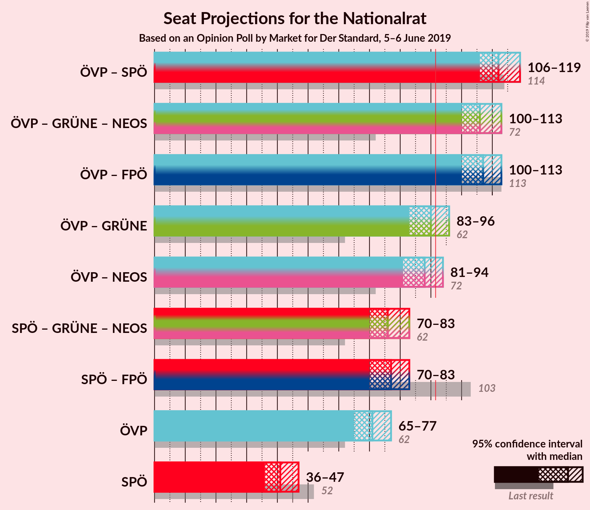
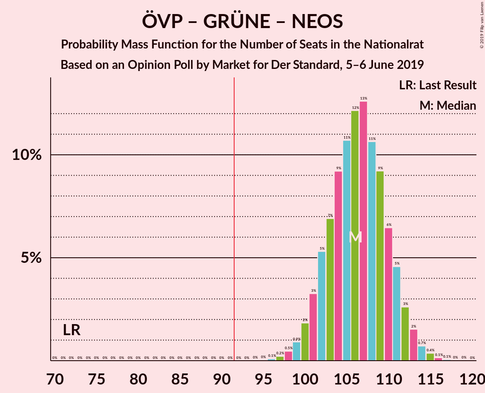
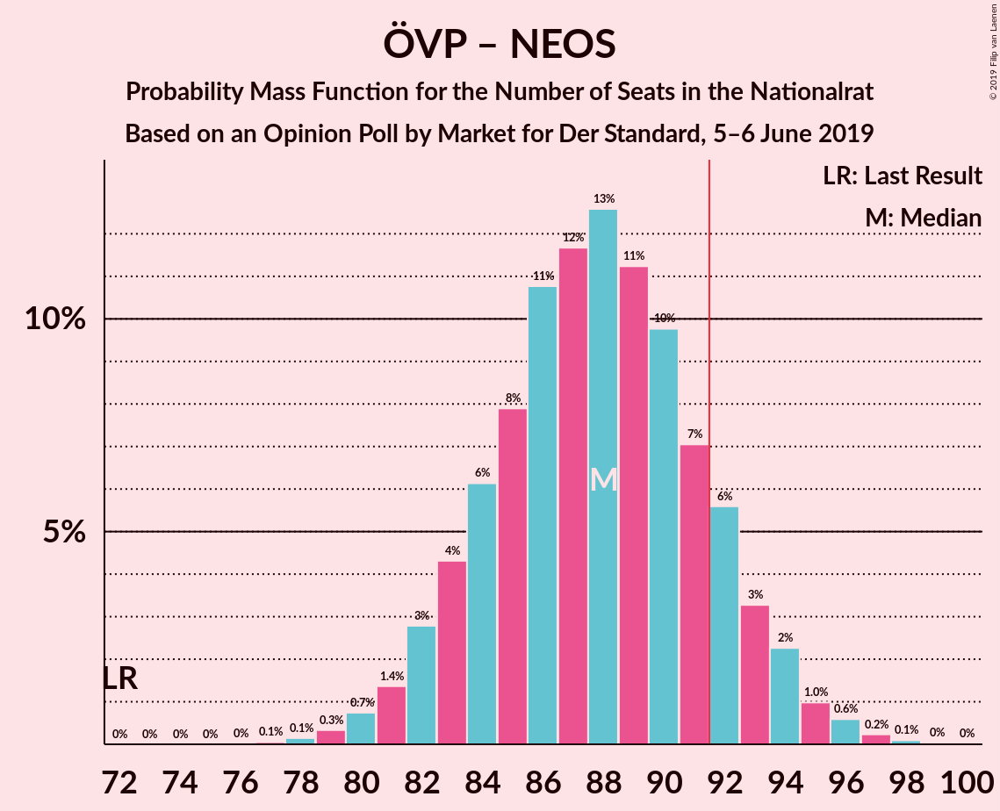
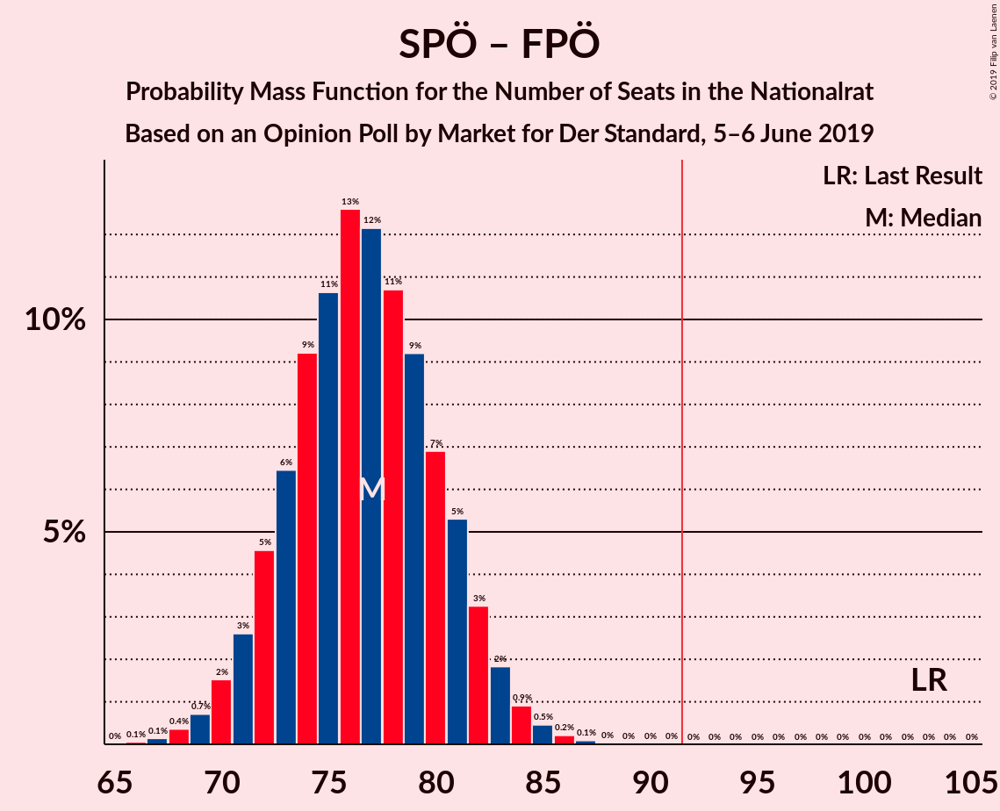

# Opinion Poll by Market for Der Standard, 5–6 June 2019

<a href="#voting-intentions">Voting Intentions</a> | <a href="#seats">Seats</a> | <a href="#coalitions">Coalitions</a> | <a href="#technical-information">Technical Information</a>

## Voting Intentions

### Confidence Intervals

| Party | Last Result | Poll Result | 80% Confidence Interval | 90% Confidence Interval | 95% Confidence Interval | 99% Confidence Interval |
|:-----:|:-----------:|:-----------:|:-----------------------:|:-----------------------:|:-----------------------:|:-----------------------:|
| Österreichische Volkspartei | 31.5% | 37.9% | 35.8–40.2% |35.2–40.8% |34.7–41.4% |33.6–42.4% |
| Sozialdemokratische Partei Österreichs | 26.9% | 22.0% | 20.2–24.0% |19.7–24.5% |19.3–25.0% |18.4–26.0% |
| Freiheitliche Partei Österreichs | 26.0% | 19.0% | 17.4–20.9% |16.9–21.4% |16.5–21.9% |15.7–22.8% |
| Die Grünen–Die Grüne Alternative | 3.8% | 10.0% | 8.8–11.5% |8.4–11.9% |8.1–12.3% |7.6–13.0% |
| NEOS–Das Neue Österreich und Liberales Forum | 5.3% | 9.0% | 7.8–10.4% |7.5–10.9% |7.2–11.2% |6.7–11.9% |
| JETZT–Liste Pilz | 4.4% | 1.0% | 0.7–1.6% |0.6–1.8% |0.5–2.0% |0.4–2.3% |

*Note:* The poll result column reflects the actual value used in the calculations. Published results may vary slightly, and in addition be rounded to fewer digits.

## Seats

### Confidence Intervals

| Party | Last Result | Median | 80% Confidence Interval | 90% Confidence Interval | 95% Confidence Interval | 99% Confidence Interval |
|:-----:|:-----------:|:------:|:-----------------------:|:-----------------------:|:-----------------------:|:-----------------------:|
| <a href="#österreichische-volkspartei">Österreichische Volkspartei</a> | 62 | 71 | 67–75 |66–76 |65–77 |63–79 |
| <a href="#sozialdemokratische-partei-österreichs">Sozialdemokratische Partei Österreichs</a> | 52 | 41 | 38–45 |37–46 |36–47 |34–48 |
| <a href="#freiheitliche-partei-österreichs">Freiheitliche Partei Österreichs</a> | 51 | 35 | 32–39 |31–40 |31–41 |29–43 |
| <a href="#die-grünen–die-grüne-alternative">Die Grünen–Die Grüne Alternative</a> | 0 | 18 | 16–21 |15–22 |15–23 |14–24 |
| <a href="#neos–das-neue-österreich-und-liberales-forum">NEOS–Das Neue Österreich und Liberales Forum</a> | 10 | 17 | 14–19 |14–20 |13–21 |12–22 |
| <a href="#jetzt–liste-pilz">JETZT–Liste Pilz</a> | 8 | 0 | 0 |0 |0 |0 |

### Österreichische Volkspartei

*For a full overview of the results for this party, see the [Österreichische Volkspartei](party-österreichischevolkspartei.html) page.*

| Number of Seats | Probability | Accumulated | Special Marks |
|:---------------:|:-----------:|:-----------:|:-------------:|
| 61 | 0.1% | 100% |  |
| 62 | 0.2% | 99.9% | Last Result |
| 63 | 0.5% | 99.7% |  |
| 64 | 1.0% | 99.2% |  |
| 65 | 2% | 98% |  |
| 66 | 4% | 96% |  |
| 67 | 5% | 92% |  |
| 68 | 8% | 87% |  |
| 69 | 10% | 79% |  |
| 70 | 11% | 69% |  |
| 71 | 13% | 58% | Median |
| 72 | 13% | 45% |  |
| 73 | 10% | 32% |  |
| 74 | 8% | 22% |  |
| 75 | 6% | 14% |  |
| 76 | 4% | 9% |  |
| 77 | 2% | 4% |  |
| 78 | 1.3% | 2% |  |
| 79 | 0.7% | 1.1% |  |
| 80 | 0.3% | 0.4% |  |
| 81 | 0.1% | 0.2% |  |
| 82 | 0% | 0.1% |  |
| 83 | 0% | 0% |  |

### Sozialdemokratische Partei Österreichs

*For a full overview of the results for this party, see the [Sozialdemokratische Partei Österreichs](party-sozialdemokratischeparteiösterreichs.html) page.*

| Number of Seats | Probability | Accumulated | Special Marks |
|:---------------:|:-----------:|:-----------:|:-------------:|
| 33 | 0.1% | 100% |  |
| 34 | 0.4% | 99.8% |  |
| 35 | 1.1% | 99.4% |  |
| 36 | 3% | 98% |  |
| 37 | 5% | 96% |  |
| 38 | 8% | 91% |  |
| 39 | 11% | 83% |  |
| 40 | 14% | 72% |  |
| 41 | 15% | 58% | Median |
| 42 | 13% | 43% |  |
| 43 | 11% | 30% |  |
| 44 | 8% | 19% |  |
| 45 | 5% | 11% |  |
| 46 | 3% | 6% |  |
| 47 | 2% | 3% |  |
| 48 | 0.8% | 1.2% |  |
| 49 | 0.3% | 0.4% |  |
| 50 | 0.1% | 0.2% |  |
| 51 | 0% | 0% |  |
| 52 | 0% | 0% | Last Result |

### Freiheitliche Partei Österreichs

*For a full overview of the results for this party, see the [Freiheitliche Partei Österreichs](party-freiheitlicheparteiösterreichs.html) page.*

| Number of Seats | Probability | Accumulated | Special Marks |
|:---------------:|:-----------:|:-----------:|:-------------:|
| 27 | 0% | 100% |  |
| 28 | 0.2% | 99.9% |  |
| 29 | 0.6% | 99.8% |  |
| 30 | 2% | 99.2% |  |
| 31 | 4% | 98% |  |
| 32 | 6% | 94% |  |
| 33 | 10% | 88% |  |
| 34 | 13% | 78% |  |
| 35 | 15% | 65% | Median |
| 36 | 14% | 50% |  |
| 37 | 13% | 35% |  |
| 38 | 9% | 22% |  |
| 39 | 6% | 13% |  |
| 40 | 4% | 7% |  |
| 41 | 2% | 3% |  |
| 42 | 0.8% | 1.3% |  |
| 43 | 0.3% | 0.5% |  |
| 44 | 0.1% | 0.2% |  |
| 45 | 0% | 0% |  |
| 46 | 0% | 0% |  |
| 47 | 0% | 0% |  |
| 48 | 0% | 0% |  |
| 49 | 0% | 0% |  |
| 50 | 0% | 0% |  |
| 51 | 0% | 0% | Last Result |

### Die Grünen–Die Grüne Alternative

*For a full overview of the results for this party, see the [Die Grünen–Die Grüne Alternative](party-diegrünen–diegrünealternative.html) page.*

| Number of Seats | Probability | Accumulated | Special Marks |
|:---------------:|:-----------:|:-----------:|:-------------:|
| 0 | 0% | 100% | Last Result |
| 1 | 0% | 100% |  |
| 2 | 0% | 100% |  |
| 3 | 0% | 100% |  |
| 4 | 0% | 100% |  |
| 5 | 0% | 100% |  |
| 6 | 0% | 100% |  |
| 7 | 0% | 100% |  |
| 8 | 0% | 100% |  |
| 9 | 0% | 100% |  |
| 10 | 0% | 100% |  |
| 11 | 0% | 100% |  |
| 12 | 0% | 100% |  |
| 13 | 0.3% | 100% |  |
| 14 | 1.3% | 99.7% |  |
| 15 | 4% | 98% |  |
| 16 | 9% | 95% |  |
| 17 | 15% | 85% |  |
| 18 | 20% | 70% | Median |
| 19 | 18% | 50% |  |
| 20 | 15% | 31% |  |
| 21 | 9% | 17% |  |
| 22 | 5% | 7% |  |
| 23 | 2% | 3% |  |
| 24 | 0.7% | 1.0% |  |
| 25 | 0.2% | 0.3% |  |
| 26 | 0.1% | 0.1% |  |
| 27 | 0% | 0% |  |

### NEOS–Das Neue Österreich und Liberales Forum

*For a full overview of the results for this party, see the [NEOS–Das Neue Österreich und Liberales Forum](party-neos–dasneueösterreichundliberalesforum.html) page.*

| Number of Seats | Probability | Accumulated | Special Marks |
|:---------------:|:-----------:|:-----------:|:-------------:|
| 10 | 0% | 100% | Last Result |
| 11 | 0.1% | 100% |  |
| 12 | 0.8% | 99.9% |  |
| 13 | 3% | 99.1% |  |
| 14 | 8% | 96% |  |
| 15 | 15% | 88% |  |
| 16 | 21% | 73% |  |
| 17 | 20% | 53% | Median |
| 18 | 16% | 33% |  |
| 19 | 10% | 17% |  |
| 20 | 5% | 8% |  |
| 21 | 2% | 3% |  |
| 22 | 0.6% | 0.9% |  |
| 23 | 0.2% | 0.2% |  |
| 24 | 0% | 0.1% |  |
| 25 | 0% | 0% |  |

### JETZT–Liste Pilz

*For a full overview of the results for this party, see the [JETZT–Liste Pilz](party-jetzt–listepilz.html) page.*

| Number of Seats | Probability | Accumulated | Special Marks |
|:---------------:|:-----------:|:-----------:|:-------------:|
| 0 | 100% | 100% | Median |
| 1 | 0% | 0% |  |
| 2 | 0% | 0% |  |
| 3 | 0% | 0% |  |
| 4 | 0% | 0% |  |
| 5 | 0% | 0% |  |
| 6 | 0% | 0% |  |
| 7 | 0% | 0% |  |
| 8 | 0% | 0% | Last Result |

## Coalitions

### Confidence Intervals

| Coalition | Last Result | Median | Majority? | 80% Confidence Interval | 90% Confidence Interval | 95% Confidence Interval | 99% Confidence Interval |
|:---------:|:-----------:|:------:|:---------:|:-----------------------:|:-----------------------:|:-----------------------:|:-----------------------:|
| Österreichische Volkspartei – Sozialdemokratische Partei Österreichs | 114 | 112 | 100% | 108–116 | 107–117 | 106–119 | 104–120 |
| Österreichische Volkspartei – Die Grünen–Die Grüne Alternative – NEOS–Das Neue Österreich und Liberales Forum | 72 | 106 | 100% | 102–111 | 101–112 | 100–113 | 98–115 |
| Österreichische Volkspartei – Freiheitliche Partei Österreichs | 113 | 107 | 100% | 102–111 | 101–112 | 100–113 | 98–115 |
| Österreichische Volkspartei – Die Grünen–Die Grüne Alternative | 62 | 90 | 29% | 85–94 | 84–95 | 83–96 | 81–98 |
| Österreichische Volkspartei – NEOS–Das Neue Österreich und Liberales Forum | 72 | 88 | 13% | 84–92 | 82–93 | 81–94 | 79–96 |
| Sozialdemokratische Partei Österreichs – Die Grünen–Die Grüne Alternative – NEOS–Das Neue Österreich und Liberales Forum | 62 | 76 | 0% | 72–81 | 71–82 | 70–83 | 68–85 |
| Sozialdemokratische Partei Österreichs – Freiheitliche Partei Österreichs | 103 | 77 | 0% | 72–81 | 71–82 | 70–83 | 68–85 |
| Österreichische Volkspartei | 62 | 71 | 0% | 67–75 | 66–76 | 65–77 | 63–79 |
| Sozialdemokratische Partei Österreichs | 52 | 41 | 0% | 38–45 | 37–46 | 36–47 | 34–48 |

### Österreichische Volkspartei – Sozialdemokratische Partei Österreichs

| Number of Seats | Probability | Accumulated | Special Marks |
|:---------------:|:-----------:|:-----------:|:-------------:|
| 102 | 0.1% | 100% |  |
| 103 | 0.2% | 99.8% |  |
| 104 | 0.6% | 99.7% |  |
| 105 | 0.8% | 99.0% |  |
| 106 | 2% | 98% |  |
| 107 | 3% | 96% |  |
| 108 | 6% | 93% |  |
| 109 | 6% | 87% |  |
| 110 | 11% | 81% |  |
| 111 | 10% | 70% |  |
| 112 | 14% | 59% | Median |
| 113 | 11% | 45% |  |
| 114 | 11% | 35% | Last Result |
| 115 | 9% | 24% |  |
| 116 | 6% | 15% |  |
| 117 | 4% | 9% |  |
| 118 | 2% | 5% |  |
| 119 | 1.4% | 3% |  |
| 120 | 0.6% | 1.1% |  |
| 121 | 0.3% | 0.5% |  |
| 122 | 0.1% | 0.2% |  |
| 123 | 0% | 0.1% |  |
| 124 | 0% | 0% |  |

### Österreichische Volkspartei – Die Grünen–Die Grüne Alternative – NEOS–Das Neue Österreich und Liberales Forum

| Number of Seats | Probability | Accumulated | Special Marks |
|:---------------:|:-----------:|:-----------:|:-------------:|
| 72 | 0% | 100% | Last Result |
| 73 | 0% | 100% |  |
| 74 | 0% | 100% |  |
| 75 | 0% | 100% |  |
| 76 | 0% | 100% |  |
| 77 | 0% | 100% |  |
| 78 | 0% | 100% |  |
| 79 | 0% | 100% |  |
| 80 | 0% | 100% |  |
| 81 | 0% | 100% |  |
| 82 | 0% | 100% |  |
| 83 | 0% | 100% |  |
| 84 | 0% | 100% |  |
| 85 | 0% | 100% |  |
| 86 | 0% | 100% |  |
| 87 | 0% | 100% |  |
| 88 | 0% | 100% |  |
| 89 | 0% | 100% |  |
| 90 | 0% | 100% |  |
| 91 | 0% | 100% |  |
| 92 | 0% | 100% | Majority |
| 93 | 0% | 100% |  |
| 94 | 0% | 100% |  |
| 95 | 0% | 100% |  |
| 96 | 0.1% | 100% |  |
| 97 | 0.2% | 99.9% |  |
| 98 | 0.5% | 99.7% |  |
| 99 | 0.9% | 99.2% |  |
| 100 | 2% | 98% |  |
| 101 | 3% | 96% |  |
| 102 | 5% | 93% |  |
| 103 | 7% | 88% |  |
| 104 | 9% | 81% |  |
| 105 | 11% | 72% |  |
| 106 | 12% | 61% | Median |
| 107 | 13% | 49% |  |
| 108 | 11% | 36% |  |
| 109 | 9% | 26% |  |
| 110 | 6% | 16% |  |
| 111 | 5% | 10% |  |
| 112 | 3% | 5% |  |
| 113 | 2% | 3% |  |
| 114 | 0.7% | 1.3% |  |
| 115 | 0.4% | 0.6% |  |
| 116 | 0.1% | 0.2% |  |
| 117 | 0.1% | 0.1% |  |
| 118 | 0% | 0% |  |

### Österreichische Volkspartei – Freiheitliche Partei Österreichs

| Number of Seats | Probability | Accumulated | Special Marks |
|:---------------:|:-----------:|:-----------:|:-------------:|
| 96 | 0.1% | 100% |  |
| 97 | 0.2% | 99.9% |  |
| 98 | 0.4% | 99.7% |  |
| 99 | 0.8% | 99.3% |  |
| 100 | 2% | 98.6% |  |
| 101 | 3% | 97% |  |
| 102 | 4% | 94% |  |
| 103 | 6% | 90% |  |
| 104 | 9% | 83% |  |
| 105 | 11% | 75% |  |
| 106 | 12% | 63% | Median |
| 107 | 11% | 51% |  |
| 108 | 11% | 40% |  |
| 109 | 10% | 29% |  |
| 110 | 7% | 19% |  |
| 111 | 5% | 12% |  |
| 112 | 3% | 7% |  |
| 113 | 2% | 4% | Last Result |
| 114 | 1.0% | 2% |  |
| 115 | 0.4% | 0.7% |  |
| 116 | 0.2% | 0.3% |  |
| 117 | 0.1% | 0.1% |  |
| 118 | 0% | 0% |  |

### Österreichische Volkspartei – Die Grünen–Die Grüne Alternative

| Number of Seats | Probability | Accumulated | Special Marks |
|:---------------:|:-----------:|:-----------:|:-------------:|
| 62 | 0% | 100% | Last Result |
| 63 | 0% | 100% |  |
| 64 | 0% | 100% |  |
| 65 | 0% | 100% |  |
| 66 | 0% | 100% |  |
| 67 | 0% | 100% |  |
| 68 | 0% | 100% |  |
| 69 | 0% | 100% |  |
| 70 | 0% | 100% |  |
| 71 | 0% | 100% |  |
| 72 | 0% | 100% |  |
| 73 | 0% | 100% |  |
| 74 | 0% | 100% |  |
| 75 | 0% | 100% |  |
| 76 | 0% | 100% |  |
| 77 | 0% | 100% |  |
| 78 | 0% | 100% |  |
| 79 | 0.1% | 100% |  |
| 80 | 0.1% | 99.9% |  |
| 81 | 0.4% | 99.8% |  |
| 82 | 0.8% | 99.3% |  |
| 83 | 2% | 98.6% |  |
| 84 | 3% | 97% |  |
| 85 | 5% | 94% |  |
| 86 | 7% | 89% |  |
| 87 | 8% | 83% |  |
| 88 | 11% | 75% |  |
| 89 | 12% | 64% | Median |
| 90 | 12% | 52% |  |
| 91 | 11% | 40% |  |
| 92 | 11% | 29% | Majority |
| 93 | 6% | 19% |  |
| 94 | 5% | 12% |  |
| 95 | 3% | 7% |  |
| 96 | 2% | 4% |  |
| 97 | 0.9% | 2% |  |
| 98 | 0.5% | 0.9% |  |
| 99 | 0.2% | 0.4% |  |
| 100 | 0.1% | 0.1% |  |
| 101 | 0% | 0.1% |  |
| 102 | 0% | 0% |  |

### Österreichische Volkspartei – NEOS–Das Neue Österreich und Liberales Forum

| Number of Seats | Probability | Accumulated | Special Marks |
|:---------------:|:-----------:|:-----------:|:-------------:|
| 72 | 0% | 100% | Last Result |
| 73 | 0% | 100% |  |
| 74 | 0% | 100% |  |
| 75 | 0% | 100% |  |
| 76 | 0% | 100% |  |
| 77 | 0.1% | 100% |  |
| 78 | 0.1% | 99.9% |  |
| 79 | 0.3% | 99.8% |  |
| 80 | 0.7% | 99.4% |  |
| 81 | 1.4% | 98.7% |  |
| 82 | 3% | 97% |  |
| 83 | 4% | 95% |  |
| 84 | 6% | 90% |  |
| 85 | 8% | 84% |  |
| 86 | 11% | 76% |  |
| 87 | 12% | 65% |  |
| 88 | 13% | 54% | Median |
| 89 | 11% | 41% |  |
| 90 | 10% | 30% |  |
| 91 | 7% | 20% |  |
| 92 | 6% | 13% | Majority |
| 93 | 3% | 8% |  |
| 94 | 2% | 4% |  |
| 95 | 1.0% | 2% |  |
| 96 | 0.6% | 1.0% |  |
| 97 | 0.2% | 0.4% |  |
| 98 | 0.1% | 0.2% |  |
| 99 | 0% | 0.1% |  |
| 100 | 0% | 0% |  |

### Sozialdemokratische Partei Österreichs – Die Grünen–Die Grüne Alternative – NEOS–Das Neue Österreich und Liberales Forum

| Number of Seats | Probability | Accumulated | Special Marks |
|:---------------:|:-----------:|:-----------:|:-------------:|
| 62 | 0% | 100% | Last Result |
| 63 | 0% | 100% |  |
| 64 | 0% | 100% |  |
| 65 | 0% | 100% |  |
| 66 | 0.1% | 100% |  |
| 67 | 0.2% | 99.9% |  |
| 68 | 0.4% | 99.7% |  |
| 69 | 1.0% | 99.3% |  |
| 70 | 2% | 98% |  |
| 71 | 3% | 96% |  |
| 72 | 5% | 93% |  |
| 73 | 7% | 88% |  |
| 74 | 10% | 81% |  |
| 75 | 11% | 71% |  |
| 76 | 11% | 60% | Median |
| 77 | 12% | 49% |  |
| 78 | 11% | 37% |  |
| 79 | 9% | 25% |  |
| 80 | 6% | 17% |  |
| 81 | 4% | 10% |  |
| 82 | 3% | 6% |  |
| 83 | 2% | 3% |  |
| 84 | 0.8% | 1.4% |  |
| 85 | 0.4% | 0.7% |  |
| 86 | 0.2% | 0.3% |  |
| 87 | 0.1% | 0.1% |  |
| 88 | 0% | 0% |  |

### Sozialdemokratische Partei Österreichs – Freiheitliche Partei Österreichs

| Number of Seats | Probability | Accumulated | Special Marks |
|:---------------:|:-----------:|:-----------:|:-------------:|
| 66 | 0.1% | 100% |  |
| 67 | 0.1% | 99.9% |  |
| 68 | 0.4% | 99.8% |  |
| 69 | 0.7% | 99.4% |  |
| 70 | 2% | 98.7% |  |
| 71 | 3% | 97% |  |
| 72 | 5% | 95% |  |
| 73 | 6% | 90% |  |
| 74 | 9% | 84% |  |
| 75 | 11% | 74% |  |
| 76 | 13% | 64% | Median |
| 77 | 12% | 51% |  |
| 78 | 11% | 39% |  |
| 79 | 9% | 28% |  |
| 80 | 7% | 19% |  |
| 81 | 5% | 12% |  |
| 82 | 3% | 7% |  |
| 83 | 2% | 4% |  |
| 84 | 0.9% | 2% |  |
| 85 | 0.5% | 0.8% |  |
| 86 | 0.2% | 0.3% |  |
| 87 | 0.1% | 0.1% |  |
| 88 | 0% | 0% |  |
| 89 | 0% | 0% |  |
| 90 | 0% | 0% |  |
| 91 | 0% | 0% |  |
| 92 | 0% | 0% | Majority |
| 93 | 0% | 0% |  |
| 94 | 0% | 0% |  |
| 95 | 0% | 0% |  |
| 96 | 0% | 0% |  |
| 97 | 0% | 0% |  |
| 98 | 0% | 0% |  |
| 99 | 0% | 0% |  |
| 100 | 0% | 0% |  |
| 101 | 0% | 0% |  |
| 102 | 0% | 0% |  |
| 103 | 0% | 0% | Last Result |

### Österreichische Volkspartei

| Number of Seats | Probability | Accumulated | Special Marks |
|:---------------:|:-----------:|:-----------:|:-------------:|
| 61 | 0.1% | 100% |  |
| 62 | 0.2% | 99.9% | Last Result |
| 63 | 0.5% | 99.7% |  |
| 64 | 1.0% | 99.2% |  |
| 65 | 2% | 98% |  |
| 66 | 4% | 96% |  |
| 67 | 5% | 92% |  |
| 68 | 8% | 87% |  |
| 69 | 10% | 79% |  |
| 70 | 11% | 69% |  |
| 71 | 13% | 58% | Median |
| 72 | 13% | 45% |  |
| 73 | 10% | 32% |  |
| 74 | 8% | 22% |  |
| 75 | 6% | 14% |  |
| 76 | 4% | 9% |  |
| 77 | 2% | 4% |  |
| 78 | 1.3% | 2% |  |
| 79 | 0.7% | 1.1% |  |
| 80 | 0.3% | 0.4% |  |
| 81 | 0.1% | 0.2% |  |
| 82 | 0% | 0.1% |  |
| 83 | 0% | 0% |  |

### Sozialdemokratische Partei Österreichs

| Number of Seats | Probability | Accumulated | Special Marks |
|:---------------:|:-----------:|:-----------:|:-------------:|
| 33 | 0.1% | 100% |  |
| 34 | 0.4% | 99.8% |  |
| 35 | 1.1% | 99.4% |  |
| 36 | 3% | 98% |  |
| 37 | 5% | 96% |  |
| 38 | 8% | 91% |  |
| 39 | 11% | 83% |  |
| 40 | 14% | 72% |  |
| 41 | 15% | 58% | Median |
| 42 | 13% | 43% |  |
| 43 | 11% | 30% |  |
| 44 | 8% | 19% |  |
| 45 | 5% | 11% |  |
| 46 | 3% | 6% |  |
| 47 | 2% | 3% |  |
| 48 | 0.8% | 1.2% |  |
| 49 | 0.3% | 0.4% |  |
| 50 | 0.1% | 0.2% |  |
| 51 | 0% | 0% |  |
| 52 | 0% | 0% | Last Result |

## Technical Information

### Opinion Poll

+ **Polling firm:** Market
+ **Commissioner(s):** Der Standard
+ **Fieldwork period:** 5–6 June 2019

### Calculations

+ **Sample size:** 809
+ **Simulations done:** 1,048,576
+ **Error estimate:** 1.08%

