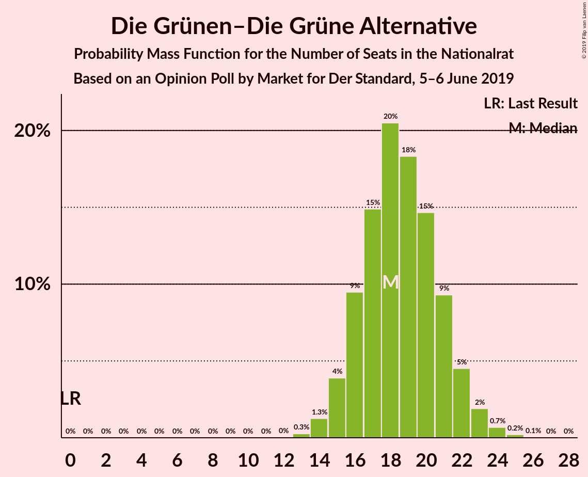
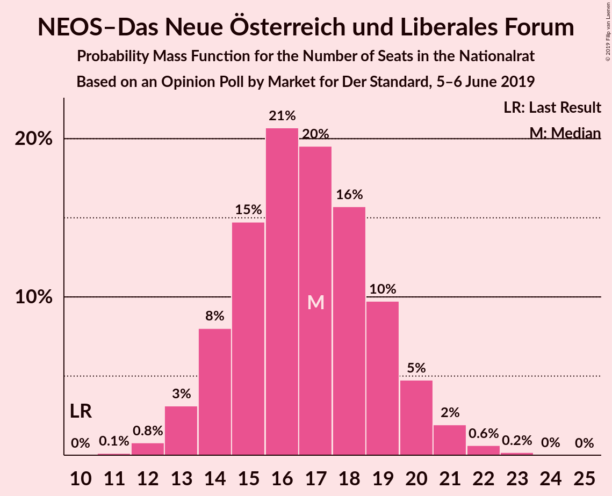
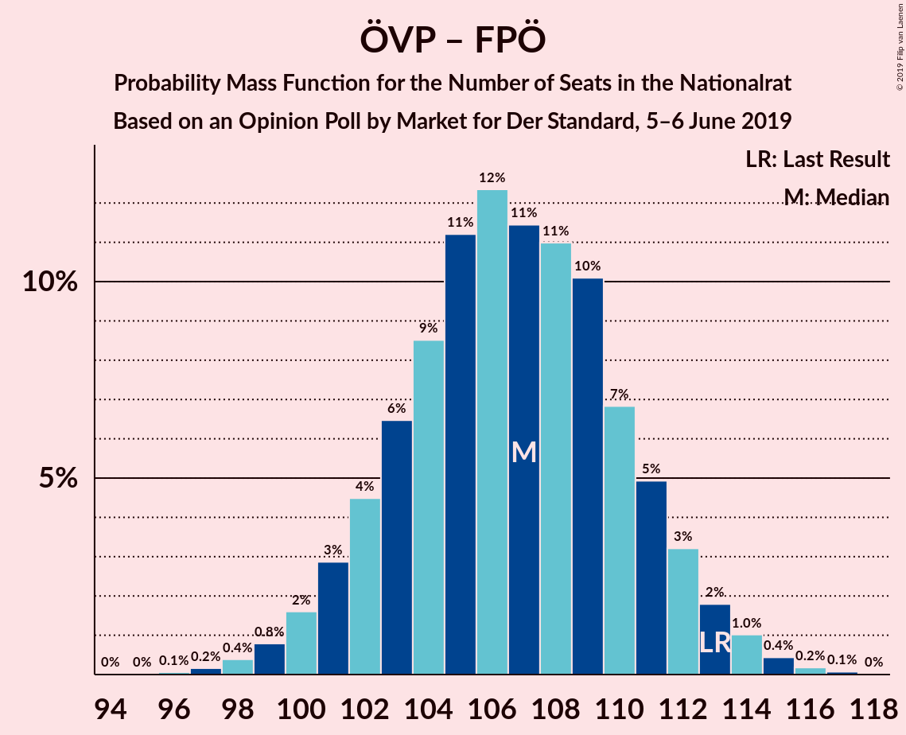

# Opinion Poll by Market for Der Standard, 5–6 June 2019

<a href="#voting-intentions">Voting Intentions</a> | <a href="#seats">Seats</a> | <a href="#coalitions">Coalitions</a> | <a href="#technical-information">Technical Information</a>

## Voting Intentions

### Confidence Intervals

| Party | Last Result | Poll Result | 80% Confidence Interval | 90% Confidence Interval | 95% Confidence Interval | 99% Confidence Interval |
|:-----:|:-----------:|:-----------:|:-----------------------:|:-----------------------:|:-----------------------:|:-----------------------:|
| Österreichische Volkspartei | 31.5% | 37.9% | 35.8–40.2% |35.2–40.8% |34.7–41.4% |33.6–42.4% |
| Sozialdemokratische Partei Österreichs | 26.9% | 22.0% | 20.2–24.0% |19.7–24.5% |19.3–25.0% |18.4–26.0% |
| Freiheitliche Partei Österreichs | 26.0% | 19.0% | 17.4–20.9% |16.9–21.4% |16.5–21.9% |15.7–22.8% |
| Die Grünen–Die Grüne Alternative | 3.8% | 10.0% | 8.8–11.5% |8.4–11.9% |8.1–12.3% |7.6–13.0% |
| NEOS–Das Neue Österreich und Liberales Forum | 5.3% | 9.0% | 7.8–10.4% |7.5–10.9% |7.2–11.2% |6.7–11.9% |
| JETZT–Liste Pilz | 4.4% | 1.0% | 0.7–1.6% |0.6–1.8% |0.5–2.0% |0.4–2.3% |

*Note:* The poll result column reflects the actual value used in the calculations. Published results may vary slightly, and in addition be rounded to fewer digits.

## Seats

### Confidence Intervals

| Party | Last Result | Median | 80% Confidence Interval | 90% Confidence Interval | 95% Confidence Interval | 99% Confidence Interval |
|:-----:|:-----------:|:------:|:-----------------------:|:-----------------------:|:-----------------------:|:-----------------------:|
| <a href="#österreichische-volkspartei">Österreichische Volkspartei</a> | 62 | 73 | 70–73 |69–74 |69–75 |66–79 |
| <a href="#sozialdemokratische-partei-österreichs">Sozialdemokratische Partei Österreichs</a> | 52 | 43 | 38–43 |37–43 |37–43 |37–47 |
| <a href="#freiheitliche-partei-österreichs">Freiheitliche Partei Österreichs</a> | 51 | 32 | 32–35 |32–36 |32–36 |31–38 |
| <a href="#die-grünen–die-grüne-alternative">Die Grünen–Die Grüne Alternative</a> | 0 | 18 | 17–20 |17–20 |17–21 |15–21 |
| <a href="#neos–das-neue-österreich-und-liberales-forum">NEOS–Das Neue Österreich und Liberales Forum</a> | 10 | 17 | 16–20 |16–20 |15–20 |13–20 |
| <a href="#jetzt–liste-pilz">JETZT–Liste Pilz</a> | 8 | 0 | 0 |0 |0 |0 |

### Österreichische Volkspartei

*For a full overview of the results for this party, see the [Österreichische Volkspartei](party-österreichischevolkspartei.html) page.*

| Number of Seats | Probability | Accumulated | Special Marks |
|:---------------:|:-----------:|:-----------:|:-------------:|
| 62 | 0% | 100% | Last Result |
| 63 | 0% | 100% |  |
| 64 | 0% | 100% |  |
| 65 | 0% | 99.9% |  |
| 66 | 0.5% | 99.9% |  |
| 67 | 0% | 99.5% |  |
| 68 | 0% | 99.5% |  |
| 69 | 9% | 99.5% |  |
| 70 | 6% | 90% |  |
| 71 | 0% | 84% |  |
| 72 | 16% | 84% |  |
| 73 | 62% | 68% | Median |
| 74 | 3% | 6% |  |
| 75 | 1.3% | 3% |  |
| 76 | 0.5% | 2% |  |
| 77 | 0% | 2% |  |
| 78 | 1.0% | 2% |  |
| 79 | 0.4% | 0.5% |  |
| 80 | 0% | 0.2% |  |
| 81 | 0% | 0.2% |  |
| 82 | 0.2% | 0.2% |  |
| 83 | 0% | 0% |  |

### Sozialdemokratische Partei Österreichs

*For a full overview of the results for this party, see the [Sozialdemokratische Partei Österreichs](party-sozialdemokratischeparteiösterreichs.html) page.*

| Number of Seats | Probability | Accumulated | Special Marks |
|:---------------:|:-----------:|:-----------:|:-------------:|
| 32 | 0.1% | 100% |  |
| 33 | 0.1% | 99.9% |  |
| 34 | 0% | 99.8% |  |
| 35 | 0% | 99.8% |  |
| 36 | 0.3% | 99.8% |  |
| 37 | 7% | 99.6% |  |
| 38 | 3% | 92% |  |
| 39 | 0% | 89% |  |
| 40 | 0% | 89% |  |
| 41 | 16% | 89% |  |
| 42 | 10% | 73% |  |
| 43 | 62% | 63% | Median |
| 44 | 0.1% | 0.8% |  |
| 45 | 0% | 0.8% |  |
| 46 | 0% | 0.8% |  |
| 47 | 0.5% | 0.7% |  |
| 48 | 0.2% | 0.2% |  |
| 49 | 0% | 0% |  |
| 50 | 0% | 0% |  |
| 51 | 0% | 0% |  |
| 52 | 0% | 0% | Last Result |

### Freiheitliche Partei Österreichs

*For a full overview of the results for this party, see the [Freiheitliche Partei Österreichs](party-freiheitlicheparteiösterreichs.html) page.*

| Number of Seats | Probability | Accumulated | Special Marks |
|:---------------:|:-----------:|:-----------:|:-------------:|
| 30 | 0.1% | 100% |  |
| 31 | 0.5% | 99.9% |  |
| 32 | 63% | 99.4% | Median |
| 33 | 3% | 36% |  |
| 34 | 16% | 33% |  |
| 35 | 9% | 18% |  |
| 36 | 6% | 8% |  |
| 37 | 1.5% | 2% |  |
| 38 | 0.1% | 0.5% |  |
| 39 | 0.3% | 0.4% |  |
| 40 | 0.1% | 0.1% |  |
| 41 | 0% | 0% |  |
| 42 | 0% | 0% |  |
| 43 | 0% | 0% |  |
| 44 | 0% | 0% |  |
| 45 | 0% | 0% |  |
| 46 | 0% | 0% |  |
| 47 | 0% | 0% |  |
| 48 | 0% | 0% |  |
| 49 | 0% | 0% |  |
| 50 | 0% | 0% |  |
| 51 | 0% | 0% | Last Result |

### Die Grünen–Die Grüne Alternative

*For a full overview of the results for this party, see the [Die Grünen–Die Grüne Alternative](party-diegrünen–diegrünealternative.html) page.*

| Number of Seats | Probability | Accumulated | Special Marks |
|:---------------:|:-----------:|:-----------:|:-------------:|
| 0 | 0% | 100% | Last Result |
| 1 | 0% | 100% |  |
| 2 | 0% | 100% |  |
| 3 | 0% | 100% |  |
| 4 | 0% | 100% |  |
| 5 | 0% | 100% |  |
| 6 | 0% | 100% |  |
| 7 | 0% | 100% |  |
| 8 | 0% | 100% |  |
| 9 | 0% | 100% |  |
| 10 | 0% | 100% |  |
| 11 | 0% | 100% |  |
| 12 | 0% | 100% |  |
| 13 | 0% | 100% |  |
| 14 | 0.2% | 100% |  |
| 15 | 0.3% | 99.7% |  |
| 16 | 1.2% | 99.5% |  |
| 17 | 10% | 98% |  |
| 18 | 62% | 89% | Median |
| 19 | 0.3% | 26% |  |
| 20 | 22% | 26% |  |
| 21 | 4% | 4% |  |
| 22 | 0% | 0.1% |  |
| 23 | 0% | 0% |  |

### NEOS–Das Neue Österreich und Liberales Forum

*For a full overview of the results for this party, see the [NEOS–Das Neue Österreich und Liberales Forum](party-neos–dasneueösterreichundliberalesforum.html) page.*

| Number of Seats | Probability | Accumulated | Special Marks |
|:---------------:|:-----------:|:-----------:|:-------------:|
| 10 | 0% | 100% | Last Result |
| 11 | 0% | 100% |  |
| 12 | 0.2% | 100% |  |
| 13 | 2% | 99.8% |  |
| 14 | 0.1% | 98% |  |
| 15 | 1.4% | 98% |  |
| 16 | 16% | 97% |  |
| 17 | 65% | 81% | Median |
| 18 | 0.3% | 16% |  |
| 19 | 0% | 16% |  |
| 20 | 15% | 16% |  |
| 21 | 0% | 0.3% |  |
| 22 | 0% | 0.3% |  |
| 23 | 0.3% | 0.3% |  |
| 24 | 0% | 0% |  |

### JETZT–Liste Pilz

*For a full overview of the results for this party, see the [JETZT–Liste Pilz](party-jetzt–listepilz.html) page.*

| Number of Seats | Probability | Accumulated | Special Marks |
|:---------------:|:-----------:|:-----------:|:-------------:|
| 0 | 100% | 100% | Median |
| 1 | 0% | 0% |  |
| 2 | 0% | 0% |  |
| 3 | 0% | 0% |  |
| 4 | 0% | 0% |  |
| 5 | 0% | 0% |  |
| 6 | 0% | 0% |  |
| 7 | 0% | 0% |  |
| 8 | 0% | 0% | Last Result |

## Coalitions

### Confidence Intervals

| Coalition | Last Result | Median | Majority? | 80% Confidence Interval | 90% Confidence Interval | 95% Confidence Interval | 99% Confidence Interval |
|:---------:|:-----------:|:------:|:---------:|:-----------------------:|:-----------------------:|:-----------------------:|:-----------------------:|
| Österreichische Volkspartei – Sozialdemokratische Partei Österreichs | 114 | 116 | 100% | 111–116 | 107–116 | 107–116 | 107–120 |
| Österreichische Volkspartei – Freiheitliche Partei Österreichs | 113 | 105 | 100% | 105–106 | 104–107 | 104–107 | 104–116 |
| Sozialdemokratische Partei Österreichs – Freiheitliche Partei Österreichs | 103 | 75 | 0% | 74–77 | 73–77 | 71–77 | 71–78 |
| Österreichische Volkspartei | 62 | 73 | 0% | 70–73 | 69–74 | 69–75 | 66–79 |
| Sozialdemokratische Partei Österreichs | 52 | 43 | 0% | 38–43 | 37–43 | 37–43 | 37–47 |

### Österreichische Volkspartei – Sozialdemokratische Partei Österreichs

| Number of Seats | Probability | Accumulated | Special Marks |
|:---------------:|:-----------:|:-----------:|:-------------:|
| 102 | 0.3% | 100% |  |
| 103 | 0% | 99.7% |  |
| 104 | 0% | 99.7% |  |
| 105 | 0% | 99.7% |  |
| 106 | 0% | 99.7% |  |
| 107 | 6% | 99.7% |  |
| 108 | 0% | 93% |  |
| 109 | 0% | 93% |  |
| 110 | 0% | 93% |  |
| 111 | 9% | 93% |  |
| 112 | 3% | 84% |  |
| 113 | 16% | 81% |  |
| 114 | 0.2% | 66% | Last Result |
| 115 | 1.0% | 65% |  |
| 116 | 62% | 64% | Median |
| 117 | 0.7% | 2% |  |
| 118 | 0.5% | 1.2% |  |
| 119 | 0% | 0.7% |  |
| 120 | 0.2% | 0.7% |  |
| 121 | 0% | 0.5% |  |
| 122 | 0.5% | 0.5% |  |
| 123 | 0% | 0% |  |

### Österreichische Volkspartei – Freiheitliche Partei Österreichs

| Number of Seats | Probability | Accumulated | Special Marks |
|:---------------:|:-----------:|:-----------:|:-------------:|
| 99 | 0% | 100% |  |
| 100 | 0% | 99.9% |  |
| 101 | 0% | 99.9% |  |
| 102 | 0% | 99.9% |  |
| 103 | 0.2% | 99.9% |  |
| 104 | 9% | 99.7% |  |
| 105 | 62% | 91% | Median |
| 106 | 22% | 28% |  |
| 107 | 4% | 6% |  |
| 108 | 0.5% | 2% |  |
| 109 | 0% | 2% |  |
| 110 | 0% | 2% |  |
| 111 | 0% | 2% |  |
| 112 | 0% | 2% |  |
| 113 | 0% | 2% | Last Result |
| 114 | 0% | 2% |  |
| 115 | 1.1% | 2% |  |
| 116 | 0.3% | 0.5% |  |
| 117 | 0.3% | 0.3% |  |
| 118 | 0% | 0% |  |

### Sozialdemokratische Partei Österreichs – Freiheitliche Partei Österreichs

| Number of Seats | Probability | Accumulated | Special Marks |
|:---------------:|:-----------:|:-----------:|:-------------:|
| 71 | 3% | 100% |  |
| 72 | 0.1% | 97% |  |
| 73 | 6% | 97% |  |
| 74 | 3% | 91% |  |
| 75 | 78% | 88% | Median |
| 76 | 0% | 10% |  |
| 77 | 9% | 10% |  |
| 78 | 0.5% | 0.8% |  |
| 79 | 0% | 0.3% |  |
| 80 | 0% | 0.3% |  |
| 81 | 0% | 0.3% |  |
| 82 | 0% | 0.3% |  |
| 83 | 0% | 0.3% |  |
| 84 | 0% | 0.3% |  |
| 85 | 0.2% | 0.2% |  |
| 86 | 0% | 0% |  |
| 87 | 0% | 0% |  |
| 88 | 0% | 0% |  |
| 89 | 0% | 0% |  |
| 90 | 0% | 0% |  |
| 91 | 0% | 0% |  |
| 92 | 0% | 0% | Majority |
| 93 | 0% | 0% |  |
| 94 | 0% | 0% |  |
| 95 | 0% | 0% |  |
| 96 | 0% | 0% |  |
| 97 | 0% | 0% |  |
| 98 | 0% | 0% |  |
| 99 | 0% | 0% |  |
| 100 | 0% | 0% |  |
| 101 | 0% | 0% |  |
| 102 | 0% | 0% |  |
| 103 | 0% | 0% | Last Result |

### Österreichische Volkspartei

| Number of Seats | Probability | Accumulated | Special Marks |
|:---------------:|:-----------:|:-----------:|:-------------:|
| 62 | 0% | 100% | Last Result |
| 63 | 0% | 100% |  |
| 64 | 0% | 100% |  |
| 65 | 0% | 99.9% |  |
| 66 | 0.5% | 99.9% |  |
| 67 | 0% | 99.5% |  |
| 68 | 0% | 99.5% |  |
| 69 | 9% | 99.5% |  |
| 70 | 6% | 90% |  |
| 71 | 0% | 84% |  |
| 72 | 16% | 84% |  |
| 73 | 62% | 68% | Median |
| 74 | 3% | 6% |  |
| 75 | 1.3% | 3% |  |
| 76 | 0.5% | 2% |  |
| 77 | 0% | 2% |  |
| 78 | 1.0% | 2% |  |
| 79 | 0.4% | 0.5% |  |
| 80 | 0% | 0.2% |  |
| 81 | 0% | 0.2% |  |
| 82 | 0.2% | 0.2% |  |
| 83 | 0% | 0% |  |

### Sozialdemokratische Partei Österreichs

| Number of Seats | Probability | Accumulated | Special Marks |
|:---------------:|:-----------:|:-----------:|:-------------:|
| 32 | 0.1% | 100% |  |
| 33 | 0.1% | 99.9% |  |
| 34 | 0% | 99.8% |  |
| 35 | 0% | 99.8% |  |
| 36 | 0.3% | 99.8% |  |
| 37 | 7% | 99.6% |  |
| 38 | 3% | 92% |  |
| 39 | 0% | 89% |  |
| 40 | 0% | 89% |  |
| 41 | 16% | 89% |  |
| 42 | 10% | 73% |  |
| 43 | 62% | 63% | Median |
| 44 | 0.1% | 0.8% |  |
| 45 | 0% | 0.8% |  |
| 46 | 0% | 0.8% |  |
| 47 | 0.5% | 0.7% |  |
| 48 | 0.2% | 0.2% |  |
| 49 | 0% | 0% |  |
| 50 | 0% | 0% |  |
| 51 | 0% | 0% |  |
| 52 | 0% | 0% | Last Result |

## Technical Information

### Opinion Poll

+ **Polling firm:** Market
+ **Commissioner(s):** Der Standard
+ **Fieldwork period:** 5–6 June 2019

### Calculations

+ **Sample size:** 809
+ **Simulations done:** 1,024
+ **Error estimate:** 1.20%

