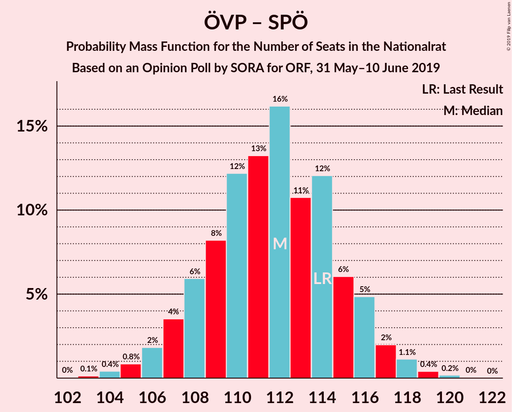
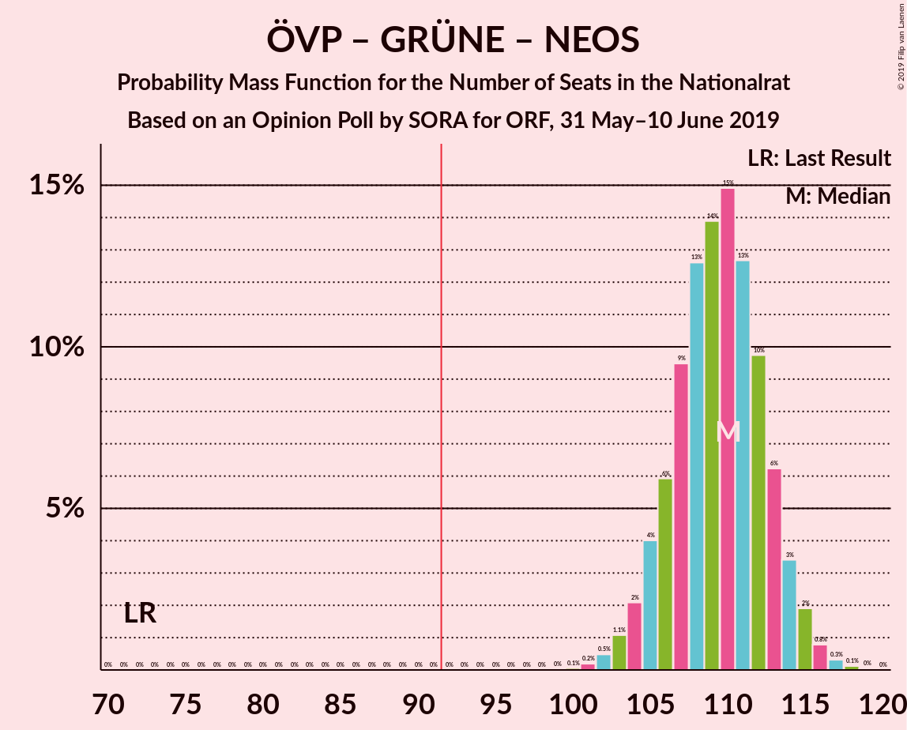
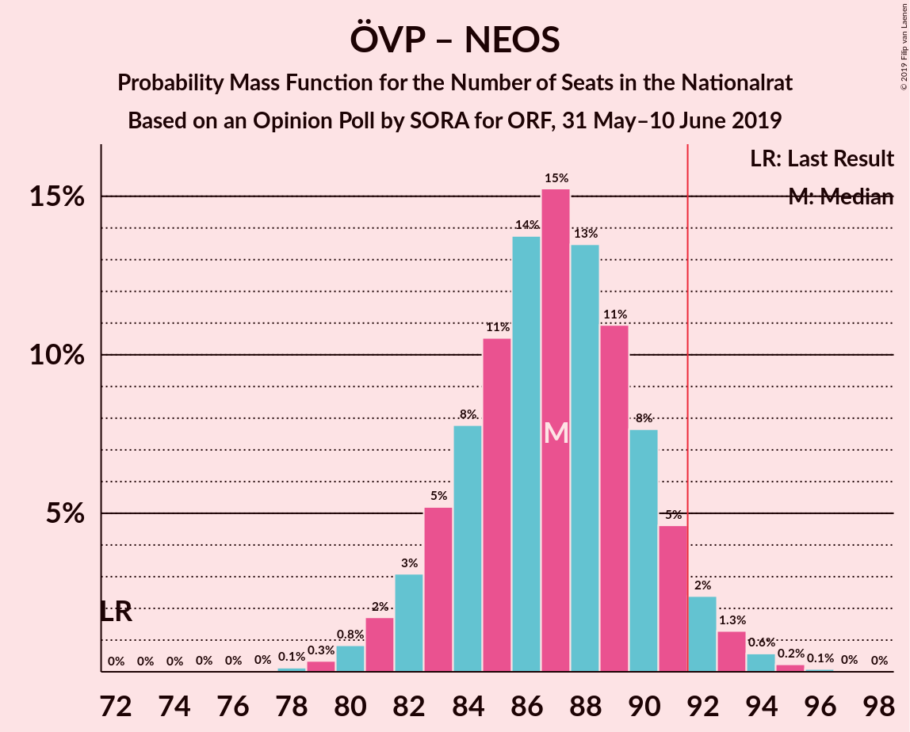
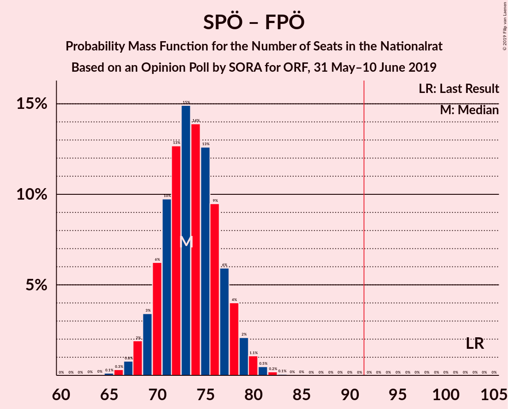

# Opinion Poll by SORA for ORF, 31 May–10 June 2019

<a href="#voting-intentions">Voting Intentions</a> | <a href="#seats">Seats</a> | <a href="#coalitions">Coalitions</a> | <a href="#technical-information">Technical Information</a>

## Voting Intentions

### Confidence Intervals

| Party | Last Result | Poll Result | 80% Confidence Interval | 90% Confidence Interval | 95% Confidence Interval | 99% Confidence Interval |
|:-----:|:-----------:|:-----------:|:-----------------------:|:-----------------------:|:-----------------------:|:-----------------------:|
| Österreichische Volkspartei | 31.5% | 38.0% | 36.2–39.9% |35.6–40.5% |35.2–40.9% |34.3–41.9% |
| Sozialdemokratische Partei Österreichs | 26.9% | 21.0% | 19.5–22.7% |19.1–23.2% |18.7–23.6% |18.0–24.4% |
| Freiheitliche Partei Österreichs | 26.0% | 18.0% | 16.6–19.6% |16.2–20.0% |15.8–20.4% |15.2–21.2% |
| Die Grünen–Die Grüne Alternative | 3.8% | 12.0% | 10.8–13.4% |10.5–13.8% |10.2–14.1% |9.7–14.8% |
| NEOS–Das Neue Österreich und Liberales Forum | 5.3% | 8.0% | 7.0–9.1% |6.8–9.5% |6.5–9.8% |6.1–10.3% |
| JETZT–Liste Pilz | 4.4% | 1.0% | 0.7–1.5% |0.6–1.7% |0.6–1.8% |0.4–2.1% |

*Note:* The poll result column reflects the actual value used in the calculations. Published results may vary slightly, and in addition be rounded to fewer digits.

## Seats

### Confidence Intervals

| Party | Last Result | Median | 80% Confidence Interval | 90% Confidence Interval | 95% Confidence Interval | 99% Confidence Interval |
|:-----:|:-----------:|:------:|:-----------------------:|:-----------------------:|:-----------------------:|:-----------------------:|
| <a href="#österreichische-volkspartei">Österreichische Volkspartei</a> | 62 | 72 | 69–76 |67–76 |67–77 |65–79 |
| <a href="#sozialdemokratische-partei-österreichs">Sozialdemokratische Partei Österreichs</a> | 52 | 40 | 37–43 |36–44 |35–44 |34–46 |
| <a href="#freiheitliche-partei-österreichs">Freiheitliche Partei Österreichs</a> | 51 | 34 | 31–37 |30–38 |30–38 |28–40 |
| <a href="#die-grünen–die-grüne-alternative">Die Grünen–Die Grüne Alternative</a> | 0 | 23 | 20–25 |20–26 |19–26 |18–28 |
| <a href="#neos–das-neue-österreich-und-liberales-forum">NEOS–Das Neue Österreich und Liberales Forum</a> | 10 | 15 | 13–17 |12–18 |12–18 |11–19 |
| <a href="#jetzt–liste-pilz">JETZT–Liste Pilz</a> | 8 | 0 | 0 |0 |0 |0 |

### Österreichische Volkspartei

*For a full overview of the results for this party, see the [Österreichische Volkspartei](party-österreichischevolkspartei.html) page.*

| Number of Seats | Probability | Accumulated | Special Marks |
|:---------------:|:-----------:|:-----------:|:-------------:|
| 62 | 0% | 100% | Last Result |
| 63 | 0.1% | 100% |  |
| 64 | 0.2% | 99.9% |  |
| 65 | 0.7% | 99.6% |  |
| 66 | 1.4% | 99.0% |  |
| 67 | 3% | 98% |  |
| 68 | 5% | 95% |  |
| 69 | 8% | 90% |  |
| 70 | 11% | 82% |  |
| 71 | 14% | 72% |  |
| 72 | 15% | 58% | Median |
| 73 | 14% | 43% |  |
| 74 | 12% | 30% |  |
| 75 | 8% | 18% |  |
| 76 | 5% | 10% |  |
| 77 | 2% | 5% |  |
| 78 | 1.4% | 2% |  |
| 79 | 0.6% | 1.0% |  |
| 80 | 0.3% | 0.4% |  |
| 81 | 0.1% | 0.1% |  |
| 82 | 0% | 0% |  |

### Sozialdemokratische Partei Österreichs

*For a full overview of the results for this party, see the [Sozialdemokratische Partei Österreichs](party-sozialdemokratischeparteiösterreichs.html) page.*

| Number of Seats | Probability | Accumulated | Special Marks |
|:---------------:|:-----------:|:-----------:|:-------------:|
| 32 | 0.1% | 100% |  |
| 33 | 0.3% | 99.9% |  |
| 34 | 0.9% | 99.7% |  |
| 35 | 2% | 98.8% |  |
| 36 | 5% | 96% |  |
| 37 | 9% | 91% |  |
| 38 | 14% | 82% |  |
| 39 | 16% | 68% |  |
| 40 | 17% | 53% | Median |
| 41 | 14% | 36% |  |
| 42 | 10% | 22% |  |
| 43 | 6% | 11% |  |
| 44 | 3% | 5% |  |
| 45 | 1.3% | 2% |  |
| 46 | 0.5% | 0.7% |  |
| 47 | 0.2% | 0.2% |  |
| 48 | 0% | 0.1% |  |
| 49 | 0% | 0% |  |
| 50 | 0% | 0% |  |
| 51 | 0% | 0% |  |
| 52 | 0% | 0% | Last Result |

### Freiheitliche Partei Österreichs

*For a full overview of the results for this party, see the [Freiheitliche Partei Österreichs](party-freiheitlicheparteiösterreichs.html) page.*

| Number of Seats | Probability | Accumulated | Special Marks |
|:---------------:|:-----------:|:-----------:|:-------------:|
| 27 | 0.1% | 100% |  |
| 28 | 0.4% | 99.9% |  |
| 29 | 1.4% | 99.5% |  |
| 30 | 4% | 98% |  |
| 31 | 8% | 94% |  |
| 32 | 13% | 86% |  |
| 33 | 17% | 73% |  |
| 34 | 17% | 56% | Median |
| 35 | 15% | 39% |  |
| 36 | 12% | 23% |  |
| 37 | 7% | 12% |  |
| 38 | 3% | 5% |  |
| 39 | 1.2% | 2% |  |
| 40 | 0.5% | 0.7% |  |
| 41 | 0.2% | 0.2% |  |
| 42 | 0% | 0.1% |  |
| 43 | 0% | 0% |  |
| 44 | 0% | 0% |  |
| 45 | 0% | 0% |  |
| 46 | 0% | 0% |  |
| 47 | 0% | 0% |  |
| 48 | 0% | 0% |  |
| 49 | 0% | 0% |  |
| 50 | 0% | 0% |  |
| 51 | 0% | 0% | Last Result |

### Die Grünen–Die Grüne Alternative

*For a full overview of the results for this party, see the [Die Grünen–Die Grüne Alternative](party-diegrünen–diegrünealternative.html) page.*

| Number of Seats | Probability | Accumulated | Special Marks |
|:---------------:|:-----------:|:-----------:|:-------------:|
| 0 | 0% | 100% | Last Result |
| 1 | 0% | 100% |  |
| 2 | 0% | 100% |  |
| 3 | 0% | 100% |  |
| 4 | 0% | 100% |  |
| 5 | 0% | 100% |  |
| 6 | 0% | 100% |  |
| 7 | 0% | 100% |  |
| 8 | 0% | 100% |  |
| 9 | 0% | 100% |  |
| 10 | 0% | 100% |  |
| 11 | 0% | 100% |  |
| 12 | 0% | 100% |  |
| 13 | 0% | 100% |  |
| 14 | 0% | 100% |  |
| 15 | 0% | 100% |  |
| 16 | 0% | 100% |  |
| 17 | 0.2% | 100% |  |
| 18 | 1.0% | 99.8% |  |
| 19 | 3% | 98.8% |  |
| 20 | 9% | 95% |  |
| 21 | 16% | 87% |  |
| 22 | 21% | 71% |  |
| 23 | 20% | 50% | Median |
| 24 | 15% | 30% |  |
| 25 | 8% | 15% |  |
| 26 | 4% | 6% |  |
| 27 | 2% | 2% |  |
| 28 | 0.4% | 0.6% |  |
| 29 | 0.1% | 0.2% |  |
| 30 | 0% | 0% |  |

### NEOS–Das Neue Österreich und Liberales Forum

*For a full overview of the results for this party, see the [NEOS–Das Neue Österreich und Liberales Forum](party-neos–dasneueösterreichundliberalesforum.html) page.*

| Number of Seats | Probability | Accumulated | Special Marks |
|:---------------:|:-----------:|:-----------:|:-------------:|
| 10 | 0.1% | 100% | Last Result |
| 11 | 1.0% | 99.9% |  |
| 12 | 5% | 98.9% |  |
| 13 | 14% | 94% |  |
| 14 | 24% | 80% |  |
| 15 | 23% | 57% | Median |
| 16 | 18% | 34% |  |
| 17 | 10% | 15% |  |
| 18 | 4% | 6% |  |
| 19 | 1.1% | 1.4% |  |
| 20 | 0.2% | 0.3% |  |
| 21 | 0% | 0% |  |

### JETZT–Liste Pilz

*For a full overview of the results for this party, see the [JETZT–Liste Pilz](party-jetzt–listepilz.html) page.*

| Number of Seats | Probability | Accumulated | Special Marks |
|:---------------:|:-----------:|:-----------:|:-------------:|
| 0 | 100% | 100% | Median |
| 1 | 0% | 0% |  |
| 2 | 0% | 0% |  |
| 3 | 0% | 0% |  |
| 4 | 0% | 0% |  |
| 5 | 0% | 0% |  |
| 6 | 0% | 0% |  |
| 7 | 0% | 0% |  |
| 8 | 0% | 0% | Last Result |

## Coalitions

### Confidence Intervals

| Coalition | Last Result | Median | Majority? | 80% Confidence Interval | 90% Confidence Interval | 95% Confidence Interval | 99% Confidence Interval |
|:---------:|:-----------:|:------:|:---------:|:-----------------------:|:-----------------------:|:-----------------------:|:-----------------------:|
| Österreichische Volkspartei – Sozialdemokratische Partei Österreichs | 114 | 112 | 100% | 108–115 | 107–116 | 106–117 | 104–119 |
| Österreichische Volkspartei – Die Grünen–Die Grüne Alternative – NEOS–Das Neue Österreich und Liberales Forum | 72 | 110 | 100% | 106–113 | 105–114 | 104–115 | 102–116 |
| Österreichische Volkspartei – Freiheitliche Partei Österreichs | 113 | 106 | 100% | 102–110 | 101–111 | 100–111 | 99–113 |
| Österreichische Volkspartei – Die Grünen–Die Grüne Alternative | 62 | 95 | 86% | 91–98 | 90–99 | 89–100 | 87–102 |
| Österreichische Volkspartei – NEOS–Das Neue Österreich und Liberales Forum | 72 | 87 | 5% | 83–90 | 82–91 | 81–92 | 79–94 |
| Sozialdemokratische Partei Österreichs – Die Grünen–Die Grüne Alternative – NEOS–Das Neue Österreich und Liberales Forum | 62 | 77 | 0% | 73–81 | 72–82 | 72–83 | 70–84 |
| Sozialdemokratische Partei Österreichs – Freiheitliche Partei Österreichs | 103 | 73 | 0% | 70–77 | 69–78 | 68–79 | 67–81 |
| Österreichische Volkspartei | 62 | 72 | 0% | 69–76 | 67–76 | 67–77 | 65–79 |
| Sozialdemokratische Partei Österreichs | 52 | 40 | 0% | 37–43 | 36–44 | 35–44 | 34–46 |

### Österreichische Volkspartei – Sozialdemokratische Partei Österreichs

| Number of Seats | Probability | Accumulated | Special Marks |
|:---------------:|:-----------:|:-----------:|:-------------:|
| 102 | 0% | 100% |  |
| 103 | 0.1% | 99.9% |  |
| 104 | 0.4% | 99.8% |  |
| 105 | 0.8% | 99.4% |  |
| 106 | 2% | 98.6% |  |
| 107 | 4% | 97% |  |
| 108 | 6% | 93% |  |
| 109 | 8% | 87% |  |
| 110 | 12% | 79% |  |
| 111 | 13% | 67% |  |
| 112 | 16% | 54% | Median |
| 113 | 11% | 37% |  |
| 114 | 12% | 27% | Last Result |
| 115 | 6% | 15% |  |
| 116 | 5% | 9% |  |
| 117 | 2% | 4% |  |
| 118 | 1.1% | 2% |  |
| 119 | 0.4% | 0.6% |  |
| 120 | 0.2% | 0.2% |  |
| 121 | 0% | 0.1% |  |
| 122 | 0% | 0% |  |

### Österreichische Volkspartei – Die Grünen–Die Grüne Alternative – NEOS–Das Neue Österreich und Liberales Forum

| Number of Seats | Probability | Accumulated | Special Marks |
|:---------------:|:-----------:|:-----------:|:-------------:|
| 72 | 0% | 100% | Last Result |
| 73 | 0% | 100% |  |
| 74 | 0% | 100% |  |
| 75 | 0% | 100% |  |
| 76 | 0% | 100% |  |
| 77 | 0% | 100% |  |
| 78 | 0% | 100% |  |
| 79 | 0% | 100% |  |
| 80 | 0% | 100% |  |
| 81 | 0% | 100% |  |
| 82 | 0% | 100% |  |
| 83 | 0% | 100% |  |
| 84 | 0% | 100% |  |
| 85 | 0% | 100% |  |
| 86 | 0% | 100% |  |
| 87 | 0% | 100% |  |
| 88 | 0% | 100% |  |
| 89 | 0% | 100% |  |
| 90 | 0% | 100% |  |
| 91 | 0% | 100% |  |
| 92 | 0% | 100% | Majority |
| 93 | 0% | 100% |  |
| 94 | 0% | 100% |  |
| 95 | 0% | 100% |  |
| 96 | 0% | 100% |  |
| 97 | 0% | 100% |  |
| 98 | 0% | 100% |  |
| 99 | 0% | 100% |  |
| 100 | 0.1% | 100% |  |
| 101 | 0.2% | 99.9% |  |
| 102 | 0.5% | 99.7% |  |
| 103 | 1.1% | 99.2% |  |
| 104 | 2% | 98% |  |
| 105 | 4% | 96% |  |
| 106 | 6% | 92% |  |
| 107 | 9% | 86% |  |
| 108 | 13% | 77% |  |
| 109 | 14% | 64% |  |
| 110 | 15% | 50% | Median |
| 111 | 13% | 35% |  |
| 112 | 10% | 23% |  |
| 113 | 6% | 13% |  |
| 114 | 3% | 7% |  |
| 115 | 2% | 3% |  |
| 116 | 0.8% | 1.3% |  |
| 117 | 0.3% | 0.5% |  |
| 118 | 0.1% | 0.2% |  |
| 119 | 0% | 0.1% |  |
| 120 | 0% | 0% |  |

### Österreichische Volkspartei – Freiheitliche Partei Österreichs

| Number of Seats | Probability | Accumulated | Special Marks |
|:---------------:|:-----------:|:-----------:|:-------------:|
| 97 | 0.1% | 100% |  |
| 98 | 0.3% | 99.8% |  |
| 99 | 0.8% | 99.6% |  |
| 100 | 2% | 98.8% |  |
| 101 | 3% | 97% |  |
| 102 | 6% | 94% |  |
| 103 | 8% | 88% |  |
| 104 | 11% | 80% |  |
| 105 | 14% | 69% |  |
| 106 | 14% | 56% | Median |
| 107 | 12% | 42% |  |
| 108 | 11% | 30% |  |
| 109 | 8% | 18% |  |
| 110 | 5% | 10% |  |
| 111 | 3% | 5% |  |
| 112 | 1.3% | 2% |  |
| 113 | 0.6% | 0.9% | Last Result |
| 114 | 0.2% | 0.3% |  |
| 115 | 0.1% | 0.1% |  |
| 116 | 0% | 0% |  |

### Österreichische Volkspartei – Die Grünen–Die Grüne Alternative

| Number of Seats | Probability | Accumulated | Special Marks |
|:---------------:|:-----------:|:-----------:|:-------------:|
| 62 | 0% | 100% | Last Result |
| 63 | 0% | 100% |  |
| 64 | 0% | 100% |  |
| 65 | 0% | 100% |  |
| 66 | 0% | 100% |  |
| 67 | 0% | 100% |  |
| 68 | 0% | 100% |  |
| 69 | 0% | 100% |  |
| 70 | 0% | 100% |  |
| 71 | 0% | 100% |  |
| 72 | 0% | 100% |  |
| 73 | 0% | 100% |  |
| 74 | 0% | 100% |  |
| 75 | 0% | 100% |  |
| 76 | 0% | 100% |  |
| 77 | 0% | 100% |  |
| 78 | 0% | 100% |  |
| 79 | 0% | 100% |  |
| 80 | 0% | 100% |  |
| 81 | 0% | 100% |  |
| 82 | 0% | 100% |  |
| 83 | 0% | 100% |  |
| 84 | 0% | 100% |  |
| 85 | 0.1% | 100% |  |
| 86 | 0.2% | 99.9% |  |
| 87 | 0.4% | 99.8% |  |
| 88 | 1.0% | 99.3% |  |
| 89 | 2% | 98% |  |
| 90 | 4% | 96% |  |
| 91 | 6% | 92% |  |
| 92 | 9% | 86% | Majority |
| 93 | 11% | 77% |  |
| 94 | 15% | 65% |  |
| 95 | 13% | 51% | Median |
| 96 | 13% | 38% |  |
| 97 | 10% | 25% |  |
| 98 | 7% | 15% |  |
| 99 | 4% | 8% |  |
| 100 | 2% | 4% |  |
| 101 | 1.1% | 2% |  |
| 102 | 0.5% | 0.7% |  |
| 103 | 0.2% | 0.2% |  |
| 104 | 0.1% | 0.1% |  |
| 105 | 0% | 0% |  |

### Österreichische Volkspartei – NEOS–Das Neue Österreich und Liberales Forum

| Number of Seats | Probability | Accumulated | Special Marks |
|:---------------:|:-----------:|:-----------:|:-------------:|
| 72 | 0% | 100% | Last Result |
| 73 | 0% | 100% |  |
| 74 | 0% | 100% |  |
| 75 | 0% | 100% |  |
| 76 | 0% | 100% |  |
| 77 | 0% | 100% |  |
| 78 | 0.1% | 99.9% |  |
| 79 | 0.3% | 99.8% |  |
| 80 | 0.8% | 99.5% |  |
| 81 | 2% | 98.6% |  |
| 82 | 3% | 97% |  |
| 83 | 5% | 94% |  |
| 84 | 8% | 89% |  |
| 85 | 11% | 81% |  |
| 86 | 14% | 70% |  |
| 87 | 15% | 57% | Median |
| 88 | 13% | 41% |  |
| 89 | 11% | 28% |  |
| 90 | 8% | 17% |  |
| 91 | 5% | 9% |  |
| 92 | 2% | 5% | Majority |
| 93 | 1.3% | 2% |  |
| 94 | 0.6% | 0.9% |  |
| 95 | 0.2% | 0.4% |  |
| 96 | 0.1% | 0.1% |  |
| 97 | 0% | 0% |  |

### Sozialdemokratische Partei Österreichs – Die Grünen–Die Grüne Alternative – NEOS–Das Neue Österreich und Liberales Forum

| Number of Seats | Probability | Accumulated | Special Marks |
|:---------------:|:-----------:|:-----------:|:-------------:|
| 62 | 0% | 100% | Last Result |
| 63 | 0% | 100% |  |
| 64 | 0% | 100% |  |
| 65 | 0% | 100% |  |
| 66 | 0% | 100% |  |
| 67 | 0% | 100% |  |
| 68 | 0.1% | 100% |  |
| 69 | 0.2% | 99.9% |  |
| 70 | 0.6% | 99.7% |  |
| 71 | 1.3% | 99.1% |  |
| 72 | 3% | 98% |  |
| 73 | 5% | 95% |  |
| 74 | 8% | 90% |  |
| 75 | 11% | 82% |  |
| 76 | 12% | 70% |  |
| 77 | 14% | 58% |  |
| 78 | 14% | 44% | Median |
| 79 | 11% | 31% |  |
| 80 | 8% | 20% |  |
| 81 | 6% | 12% |  |
| 82 | 3% | 6% |  |
| 83 | 2% | 3% |  |
| 84 | 0.8% | 1.2% |  |
| 85 | 0.3% | 0.4% |  |
| 86 | 0.1% | 0.2% |  |
| 87 | 0% | 0% |  |

### Sozialdemokratische Partei Österreichs – Freiheitliche Partei Österreichs

| Number of Seats | Probability | Accumulated | Special Marks |
|:---------------:|:-----------:|:-----------:|:-------------:|
| 64 | 0% | 100% |  |
| 65 | 0.1% | 99.9% |  |
| 66 | 0.3% | 99.8% |  |
| 67 | 0.8% | 99.5% |  |
| 68 | 2% | 98.7% |  |
| 69 | 3% | 97% |  |
| 70 | 6% | 93% |  |
| 71 | 10% | 87% |  |
| 72 | 13% | 77% |  |
| 73 | 15% | 65% |  |
| 74 | 14% | 50% | Median |
| 75 | 13% | 36% |  |
| 76 | 9% | 23% |  |
| 77 | 6% | 14% |  |
| 78 | 4% | 8% |  |
| 79 | 2% | 4% |  |
| 80 | 1.1% | 2% |  |
| 81 | 0.5% | 0.8% |  |
| 82 | 0.2% | 0.3% |  |
| 83 | 0.1% | 0.1% |  |
| 84 | 0% | 0% |  |
| 85 | 0% | 0% |  |
| 86 | 0% | 0% |  |
| 87 | 0% | 0% |  |
| 88 | 0% | 0% |  |
| 89 | 0% | 0% |  |
| 90 | 0% | 0% |  |
| 91 | 0% | 0% |  |
| 92 | 0% | 0% | Majority |
| 93 | 0% | 0% |  |
| 94 | 0% | 0% |  |
| 95 | 0% | 0% |  |
| 96 | 0% | 0% |  |
| 97 | 0% | 0% |  |
| 98 | 0% | 0% |  |
| 99 | 0% | 0% |  |
| 100 | 0% | 0% |  |
| 101 | 0% | 0% |  |
| 102 | 0% | 0% |  |
| 103 | 0% | 0% | Last Result |

### Österreichische Volkspartei

| Number of Seats | Probability | Accumulated | Special Marks |
|:---------------:|:-----------:|:-----------:|:-------------:|
| 62 | 0% | 100% | Last Result |
| 63 | 0.1% | 100% |  |
| 64 | 0.2% | 99.9% |  |
| 65 | 0.7% | 99.6% |  |
| 66 | 1.4% | 99.0% |  |
| 67 | 3% | 98% |  |
| 68 | 5% | 95% |  |
| 69 | 8% | 90% |  |
| 70 | 11% | 82% |  |
| 71 | 14% | 72% |  |
| 72 | 15% | 58% | Median |
| 73 | 14% | 43% |  |
| 74 | 12% | 30% |  |
| 75 | 8% | 18% |  |
| 76 | 5% | 10% |  |
| 77 | 2% | 5% |  |
| 78 | 1.4% | 2% |  |
| 79 | 0.6% | 1.0% |  |
| 80 | 0.3% | 0.4% |  |
| 81 | 0.1% | 0.1% |  |
| 82 | 0% | 0% |  |

### Sozialdemokratische Partei Österreichs

| Number of Seats | Probability | Accumulated | Special Marks |
|:---------------:|:-----------:|:-----------:|:-------------:|
| 32 | 0.1% | 100% |  |
| 33 | 0.3% | 99.9% |  |
| 34 | 0.9% | 99.7% |  |
| 35 | 2% | 98.8% |  |
| 36 | 5% | 96% |  |
| 37 | 9% | 91% |  |
| 38 | 14% | 82% |  |
| 39 | 16% | 68% |  |
| 40 | 17% | 53% | Median |
| 41 | 14% | 36% |  |
| 42 | 10% | 22% |  |
| 43 | 6% | 11% |  |
| 44 | 3% | 5% |  |
| 45 | 1.3% | 2% |  |
| 46 | 0.5% | 0.7% |  |
| 47 | 0.2% | 0.2% |  |
| 48 | 0% | 0.1% |  |
| 49 | 0% | 0% |  |
| 50 | 0% | 0% |  |
| 51 | 0% | 0% |  |
| 52 | 0% | 0% | Last Result |

## Technical Information

### Opinion Poll

+ **Polling firm:** SORA
+ **Commissioner(s):** ORF
+ **Fieldwork period:** 31 May–10 June 2019

### Calculations

+ **Sample size:** 1089
+ **Simulations done:** 1,048,576
+ **Error estimate:** 0.72%

