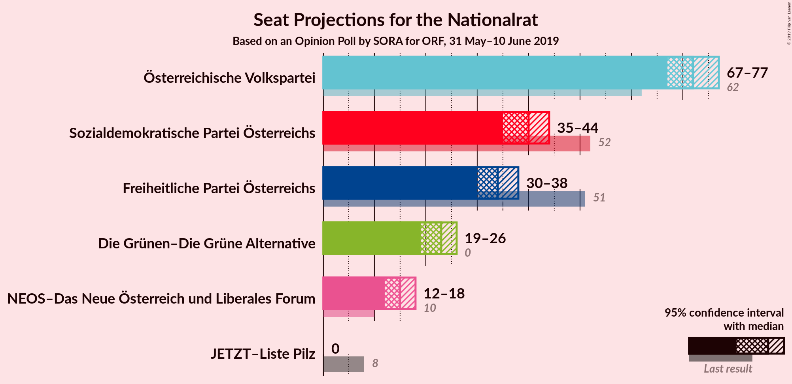
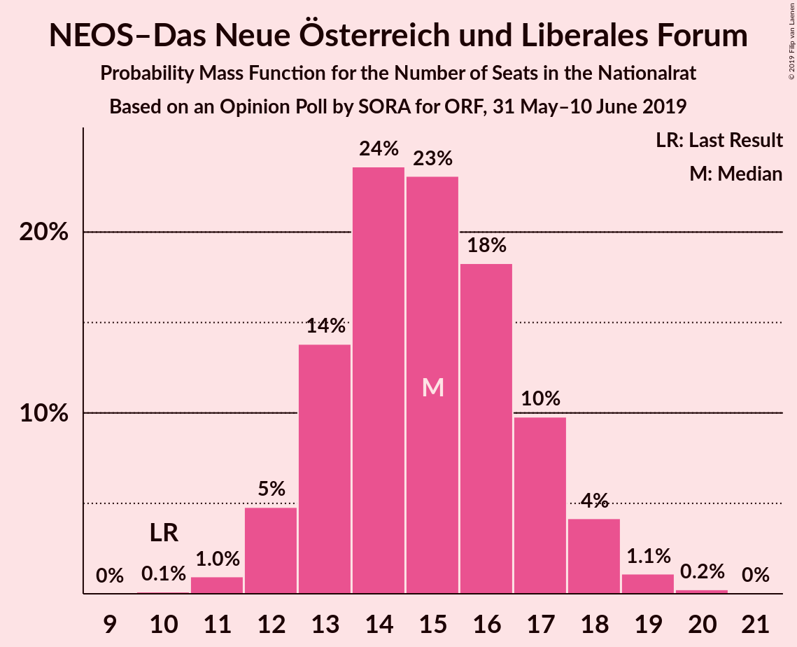
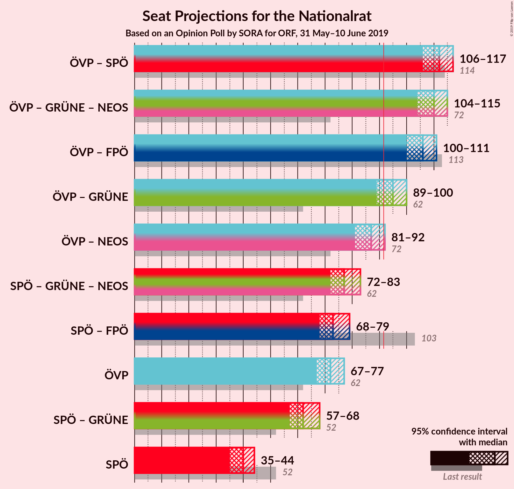

# Opinion Poll by SORA for ORF, 31 May–10 June 2019

<a href="#voting-intentions">Voting Intentions</a> | <a href="#seats">Seats</a> | <a href="#coalitions">Coalitions</a> | <a href="#technical-information">Technical Information</a>

## Voting Intentions

### Confidence Intervals

| Party | Last Result | Poll Result | 80% Confidence Interval | 90% Confidence Interval | 95% Confidence Interval | 99% Confidence Interval |
|:-----:|:-----------:|:-----------:|:-----------------------:|:-----------------------:|:-----------------------:|:-----------------------:|
| Österreichische Volkspartei | 31.5% | 38.0% | 36.2–39.9% |35.6–40.5% |35.2–40.9% |34.3–41.9% |
| Sozialdemokratische Partei Österreichs | 26.9% | 21.0% | 19.5–22.7% |19.1–23.2% |18.7–23.6% |18.0–24.4% |
| Freiheitliche Partei Österreichs | 26.0% | 18.0% | 16.6–19.6% |16.2–20.0% |15.8–20.4% |15.2–21.2% |
| Die Grünen–Die Grüne Alternative | 3.8% | 12.0% | 10.8–13.4% |10.5–13.8% |10.2–14.1% |9.7–14.8% |
| NEOS–Das Neue Österreich und Liberales Forum | 5.3% | 8.0% | 7.0–9.1% |6.8–9.5% |6.5–9.8% |6.1–10.3% |
| JETZT–Liste Pilz | 4.4% | 1.0% | 0.7–1.5% |0.6–1.7% |0.6–1.8% |0.4–2.1% |

*Note:* The poll result column reflects the actual value used in the calculations. Published results may vary slightly, and in addition be rounded to fewer digits.

## Seats

### Confidence Intervals

| Party | Last Result | Median | 80% Confidence Interval | 90% Confidence Interval | 95% Confidence Interval | 99% Confidence Interval |
|:-----:|:-----------:|:------:|:-----------------------:|:-----------------------:|:-----------------------:|:-----------------------:|
| <a href="#österreichische-volkspartei">Österreichische Volkspartei</a> | 62 | 75 | 74–75 |72–75 |68–75 |63–76 |
| <a href="#sozialdemokratische-partei-österreichs">Sozialdemokratische Partei Österreichs</a> | 52 | 40 | 39–40 |39–40 |38–45 |33–45 |
| <a href="#freiheitliche-partei-österreichs">Freiheitliche Partei Österreichs</a> | 51 | 31 | 31–33 |31–35 |31–37 |28–38 |
| <a href="#die-grünen–die-grüne-alternative">Die Grünen–Die Grüne Alternative</a> | 0 | 21 | 20–22 |20–22 |20–23 |18–28 |
| <a href="#neos–das-neue-österreich-und-liberales-forum">NEOS–Das Neue Österreich und Liberales Forum</a> | 10 | 17 | 14–17 |14–17 |14–17 |13–19 |
| <a href="#jetzt–liste-pilz">JETZT–Liste Pilz</a> | 8 | 0 | 0 |0 |0 |0 |

### Österreichische Volkspartei

*For a full overview of the results for this party, see the [Österreichische Volkspartei](party-österreichischevolkspartei.html) page.*

| Number of Seats | Probability | Accumulated | Special Marks |
|:---------------:|:-----------:|:-----------:|:-------------:|
| 62 | 0% | 100% | Last Result |
| 63 | 2% | 100% |  |
| 64 | 0% | 98% |  |
| 65 | 0% | 98% |  |
| 66 | 0.5% | 98% |  |
| 67 | 0.2% | 98% |  |
| 68 | 0.3% | 98% |  |
| 69 | 0.3% | 97% |  |
| 70 | 1.1% | 97% |  |
| 71 | 1.0% | 96% |  |
| 72 | 0% | 95% |  |
| 73 | 0% | 95% |  |
| 74 | 30% | 95% |  |
| 75 | 63% | 65% | Median |
| 76 | 2% | 2% |  |
| 77 | 0.2% | 0.5% |  |
| 78 | 0% | 0.3% |  |
| 79 | 0.1% | 0.3% |  |
| 80 | 0% | 0.2% |  |
| 81 | 0% | 0.2% |  |
| 82 | 0.2% | 0.2% |  |
| 83 | 0% | 0% |  |

### Sozialdemokratische Partei Österreichs

*For a full overview of the results for this party, see the [Sozialdemokratische Partei Österreichs](party-sozialdemokratischeparteiösterreichs.html) page.*

| Number of Seats | Probability | Accumulated | Special Marks |
|:---------------:|:-----------:|:-----------:|:-------------:|
| 33 | 2% | 100% |  |
| 34 | 0% | 98% |  |
| 35 | 0% | 98% |  |
| 36 | 0% | 98% |  |
| 37 | 0% | 98% |  |
| 38 | 0.6% | 98% |  |
| 39 | 39% | 97% |  |
| 40 | 54% | 58% | Median |
| 41 | 0.2% | 4% |  |
| 42 | 1.0% | 4% |  |
| 43 | 0.2% | 3% |  |
| 44 | 0.1% | 3% |  |
| 45 | 3% | 3% |  |
| 46 | 0% | 0% |  |
| 47 | 0% | 0% |  |
| 48 | 0% | 0% |  |
| 49 | 0% | 0% |  |
| 50 | 0% | 0% |  |
| 51 | 0% | 0% |  |
| 52 | 0% | 0% | Last Result |

### Freiheitliche Partei Österreichs

*For a full overview of the results for this party, see the [Freiheitliche Partei Österreichs](party-freiheitlicheparteiösterreichs.html) page.*

| Number of Seats | Probability | Accumulated | Special Marks |
|:---------------:|:-----------:|:-----------:|:-------------:|
| 27 | 0.2% | 100% |  |
| 28 | 1.0% | 99.8% |  |
| 29 | 0.3% | 98.8% |  |
| 30 | 0.1% | 98% |  |
| 31 | 53% | 98% | Median |
| 32 | 0.2% | 45% |  |
| 33 | 39% | 45% |  |
| 34 | 0.1% | 6% |  |
| 35 | 1.1% | 6% |  |
| 36 | 2% | 5% |  |
| 37 | 2% | 3% |  |
| 38 | 0.5% | 0.8% |  |
| 39 | 0% | 0.3% |  |
| 40 | 0.3% | 0.3% |  |
| 41 | 0% | 0% |  |
| 42 | 0% | 0% |  |
| 43 | 0% | 0% |  |
| 44 | 0% | 0% |  |
| 45 | 0% | 0% |  |
| 46 | 0% | 0% |  |
| 47 | 0% | 0% |  |
| 48 | 0% | 0% |  |
| 49 | 0% | 0% |  |
| 50 | 0% | 0% |  |
| 51 | 0% | 0% | Last Result |

### Die Grünen–Die Grüne Alternative

*For a full overview of the results for this party, see the [Die Grünen–Die Grüne Alternative](party-diegrünen–diegrünealternative.html) page.*

| Number of Seats | Probability | Accumulated | Special Marks |
|:---------------:|:-----------:|:-----------:|:-------------:|
| 0 | 0% | 100% | Last Result |
| 1 | 0% | 100% |  |
| 2 | 0% | 100% |  |
| 3 | 0% | 100% |  |
| 4 | 0% | 100% |  |
| 5 | 0% | 100% |  |
| 6 | 0% | 100% |  |
| 7 | 0% | 100% |  |
| 8 | 0% | 100% |  |
| 9 | 0% | 100% |  |
| 10 | 0% | 100% |  |
| 11 | 0% | 100% |  |
| 12 | 0% | 100% |  |
| 13 | 0% | 100% |  |
| 14 | 0% | 100% |  |
| 15 | 0% | 100% |  |
| 16 | 0.1% | 100% |  |
| 17 | 0.1% | 99.9% |  |
| 18 | 0.4% | 99.9% |  |
| 19 | 1.0% | 99.5% |  |
| 20 | 24% | 98% |  |
| 21 | 30% | 74% | Median |
| 22 | 41% | 44% |  |
| 23 | 2% | 4% |  |
| 24 | 0.1% | 2% |  |
| 25 | 1.3% | 2% |  |
| 26 | 0% | 0.5% |  |
| 27 | 0% | 0.5% |  |
| 28 | 0.5% | 0.5% |  |
| 29 | 0% | 0% |  |

### NEOS–Das Neue Österreich und Liberales Forum

*For a full overview of the results for this party, see the [NEOS–Das Neue Österreich und Liberales Forum](party-neos–dasneueösterreichundliberalesforum.html) page.*

| Number of Seats | Probability | Accumulated | Special Marks |
|:---------------:|:-----------:|:-----------:|:-------------:|
| 10 | 0% | 100% | Last Result |
| 11 | 0% | 100% |  |
| 12 | 0.2% | 100% |  |
| 13 | 2% | 99.8% |  |
| 14 | 39% | 98% |  |
| 15 | 2% | 59% |  |
| 16 | 2% | 57% |  |
| 17 | 53% | 55% | Median |
| 18 | 1.1% | 2% |  |
| 19 | 0.4% | 0.8% |  |
| 20 | 0.3% | 0.4% |  |
| 21 | 0% | 0.1% |  |
| 22 | 0% | 0% |  |

### JETZT–Liste Pilz

*For a full overview of the results for this party, see the [JETZT–Liste Pilz](party-jetzt–listepilz.html) page.*

| Number of Seats | Probability | Accumulated | Special Marks |
|:---------------:|:-----------:|:-----------:|:-------------:|
| 0 | 100% | 100% | Median |
| 1 | 0% | 0% |  |
| 2 | 0% | 0% |  |
| 3 | 0% | 0% |  |
| 4 | 0% | 0% |  |
| 5 | 0% | 0% |  |
| 6 | 0% | 0% |  |
| 7 | 0% | 0% |  |
| 8 | 0% | 0% | Last Result |

## Coalitions

### Confidence Intervals

| Coalition | Last Result | Median | Majority? | 80% Confidence Interval | 90% Confidence Interval | 95% Confidence Interval | 99% Confidence Interval |
|:---------:|:-----------:|:------:|:---------:|:-----------------------:|:-----------------------:|:-----------------------:|:-----------------------:|
| Österreichische Volkspartei – Sozialdemokratische Partei Österreichs | 114 | 114 | 100% | 114–115 | 112–115 | 108–115 | 104–116 |
| Österreichische Volkspartei – Freiheitliche Partei Österreichs | 113 | 106 | 100% | 105–108 | 105–108 | 100–108 | 98–112 |
| Sozialdemokratische Partei Österreichs – Freiheitliche Partei Österreichs | 103 | 71 | 0% | 71–72 | 71–72 | 69–80 | 69–82 |
| Österreichische Volkspartei | 62 | 75 | 0% | 74–75 | 72–75 | 68–75 | 63–76 |
| Sozialdemokratische Partei Österreichs | 52 | 40 | 0% | 39–40 | 39–40 | 38–45 | 33–45 |

### Österreichische Volkspartei – Sozialdemokratische Partei Österreichs

| Number of Seats | Probability | Accumulated | Special Marks |
|:---------------:|:-----------:|:-----------:|:-------------:|
| 102 | 0.2% | 100% |  |
| 103 | 0% | 99.8% |  |
| 104 | 0.5% | 99.7% |  |
| 105 | 0% | 99.2% |  |
| 106 | 0% | 99.2% |  |
| 107 | 0.1% | 99.2% |  |
| 108 | 2% | 99.1% |  |
| 109 | 2% | 97% |  |
| 110 | 0.1% | 95% |  |
| 111 | 0.2% | 95% |  |
| 112 | 1.1% | 95% |  |
| 113 | 0% | 94% |  |
| 114 | 68% | 94% | Last Result |
| 115 | 25% | 26% | Median |
| 116 | 1.0% | 1.4% |  |
| 117 | 0.1% | 0.4% |  |
| 118 | 0.2% | 0.4% |  |
| 119 | 0% | 0.2% |  |
| 120 | 0.1% | 0.2% |  |
| 121 | 0.2% | 0.2% |  |
| 122 | 0% | 0% |  |

### Österreichische Volkspartei – Freiheitliche Partei Österreichs

| Number of Seats | Probability | Accumulated | Special Marks |
|:---------------:|:-----------:|:-----------:|:-------------:|
| 98 | 1.1% | 100% |  |
| 99 | 0% | 98.9% |  |
| 100 | 2% | 98.9% |  |
| 101 | 0% | 97% |  |
| 102 | 0% | 97% |  |
| 103 | 0.3% | 97% |  |
| 104 | 0.7% | 97% |  |
| 105 | 29% | 96% |  |
| 106 | 25% | 67% | Median |
| 107 | 0% | 42% |  |
| 108 | 39% | 42% |  |
| 109 | 0% | 2% |  |
| 110 | 0.1% | 2% |  |
| 111 | 0% | 2% |  |
| 112 | 2% | 2% |  |
| 113 | 0.1% | 0.2% | Last Result |
| 114 | 0.2% | 0.2% |  |
| 115 | 0% | 0% |  |

### Sozialdemokratische Partei Österreichs – Freiheitliche Partei Österreichs

| Number of Seats | Probability | Accumulated | Special Marks |
|:---------------:|:-----------:|:-----------:|:-------------:|
| 68 | 0.2% | 100% |  |
| 69 | 2% | 99.8% |  |
| 70 | 1.3% | 97% |  |
| 71 | 53% | 96% | Median |
| 72 | 38% | 43% |  |
| 73 | 0.8% | 4% |  |
| 74 | 0% | 4% |  |
| 75 | 0% | 4% |  |
| 76 | 0.5% | 4% |  |
| 77 | 0% | 3% |  |
| 78 | 0% | 3% |  |
| 79 | 0.1% | 3% |  |
| 80 | 1.0% | 3% |  |
| 81 | 0% | 2% |  |
| 82 | 2% | 2% |  |
| 83 | 0.2% | 0.2% |  |
| 84 | 0% | 0% |  |
| 85 | 0% | 0% |  |
| 86 | 0% | 0% |  |
| 87 | 0% | 0% |  |
| 88 | 0% | 0% |  |
| 89 | 0% | 0% |  |
| 90 | 0% | 0% |  |
| 91 | 0% | 0% |  |
| 92 | 0% | 0% | Majority |
| 93 | 0% | 0% |  |
| 94 | 0% | 0% |  |
| 95 | 0% | 0% |  |
| 96 | 0% | 0% |  |
| 97 | 0% | 0% |  |
| 98 | 0% | 0% |  |
| 99 | 0% | 0% |  |
| 100 | 0% | 0% |  |
| 101 | 0% | 0% |  |
| 102 | 0% | 0% |  |
| 103 | 0% | 0% | Last Result |

### Österreichische Volkspartei

| Number of Seats | Probability | Accumulated | Special Marks |
|:---------------:|:-----------:|:-----------:|:-------------:|
| 62 | 0% | 100% | Last Result |
| 63 | 2% | 100% |  |
| 64 | 0% | 98% |  |
| 65 | 0% | 98% |  |
| 66 | 0.5% | 98% |  |
| 67 | 0.2% | 98% |  |
| 68 | 0.3% | 98% |  |
| 69 | 0.3% | 97% |  |
| 70 | 1.1% | 97% |  |
| 71 | 1.0% | 96% |  |
| 72 | 0% | 95% |  |
| 73 | 0% | 95% |  |
| 74 | 30% | 95% |  |
| 75 | 63% | 65% | Median |
| 76 | 2% | 2% |  |
| 77 | 0.2% | 0.5% |  |
| 78 | 0% | 0.3% |  |
| 79 | 0.1% | 0.3% |  |
| 80 | 0% | 0.2% |  |
| 81 | 0% | 0.2% |  |
| 82 | 0.2% | 0.2% |  |
| 83 | 0% | 0% |  |

### Sozialdemokratische Partei Österreichs

| Number of Seats | Probability | Accumulated | Special Marks |
|:---------------:|:-----------:|:-----------:|:-------------:|
| 33 | 2% | 100% |  |
| 34 | 0% | 98% |  |
| 35 | 0% | 98% |  |
| 36 | 0% | 98% |  |
| 37 | 0% | 98% |  |
| 38 | 0.6% | 98% |  |
| 39 | 39% | 97% |  |
| 40 | 54% | 58% | Median |
| 41 | 0.2% | 4% |  |
| 42 | 1.0% | 4% |  |
| 43 | 0.2% | 3% |  |
| 44 | 0.1% | 3% |  |
| 45 | 3% | 3% |  |
| 46 | 0% | 0% |  |
| 47 | 0% | 0% |  |
| 48 | 0% | 0% |  |
| 49 | 0% | 0% |  |
| 50 | 0% | 0% |  |
| 51 | 0% | 0% |  |
| 52 | 0% | 0% | Last Result |

## Technical Information

### Opinion Poll

+ **Polling firm:** SORA
+ **Commissioner(s):** ORF
+ **Fieldwork period:** 31 May–10 June 2019

### Calculations

+ **Sample size:** 1089
+ **Simulations done:** 1,024
+ **Error estimate:** 4.60%

