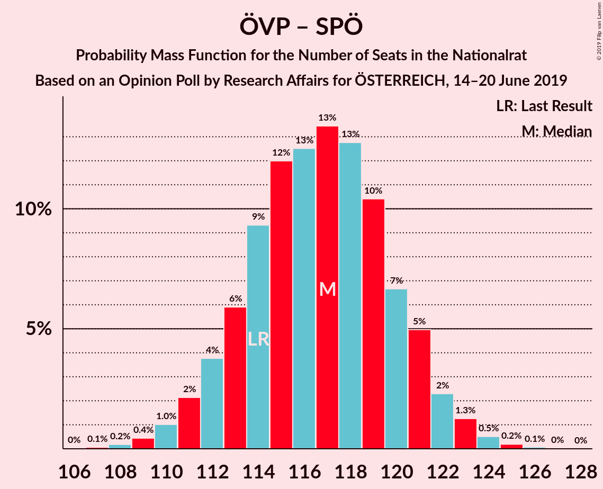
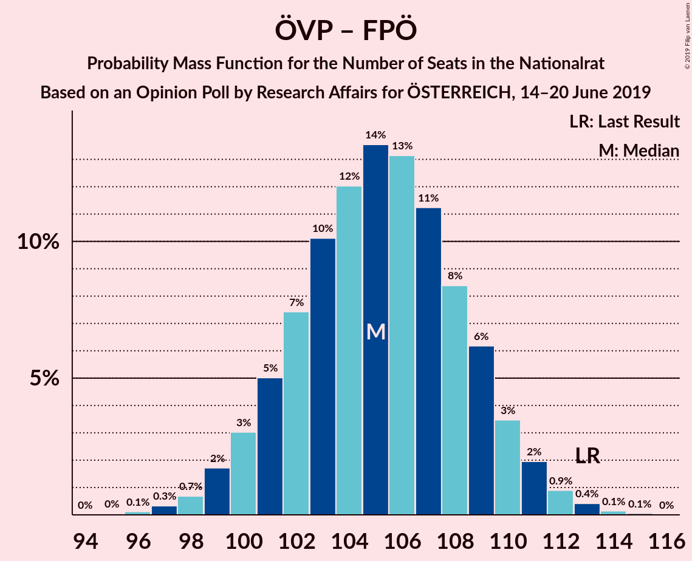
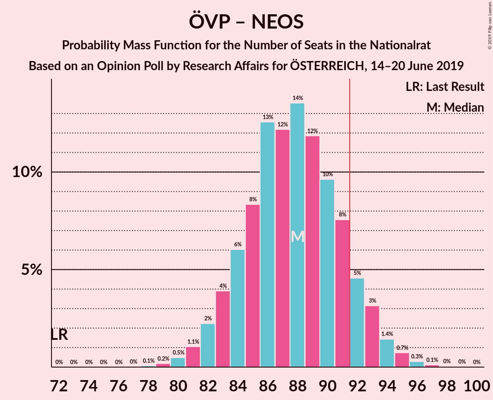

# Opinion Poll by Research Affairs, 14–20 June 2019

<a href="#voting-intentions">Voting Intentions</a> | <a href="#seats">Seats</a> | <a href="#coalitions">Coalitions</a> | <a href="#technical-information">Technical Information</a>

## Voting Intentions

### Confidence Intervals

| Party | Last Result | Poll Result | 80% Confidence Interval | 90% Confidence Interval | 95% Confidence Interval | 99% Confidence Interval |
|:-----:|:-----------:|:-----------:|:-----------------------:|:-----------------------:|:-----------------------:|:-----------------------:|
| Österreichische Volkspartei | 31.5% | 38.0% | 36.0–40.0% |35.5–40.5% |35.0–41.0% |34.1–42.0% |
| Sozialdemokratische Partei Österreichs | 26.9% | 23.0% | 21.4–24.8% |20.9–25.3% |20.5–25.7% |19.8–26.6% |
| Freiheitliche Partei Österreichs | 26.0% | 17.0% | 15.6–18.7% |15.2–19.1% |14.8–19.5% |14.2–20.3% |
| Die Grünen–Die Grüne Alternative | 3.8% | 10.0% | 8.8–11.3% |8.5–11.7% |8.3–12.0% |7.8–12.7% |
| NEOS–Das Neue Österreich und Liberales Forum | 5.3% | 8.0% | 7.0–9.2% |6.7–9.5% |6.4–9.8% |6.0–10.4% |
| JETZT–Liste Pilz | 4.4% | 2.0% | 1.5–2.7% |1.4–2.9% |1.3–3.1% |1.1–3.4% |

*Note:* The poll result column reflects the actual value used in the calculations. Published results may vary slightly, and in addition be rounded to fewer digits.

## Seats

### Confidence Intervals

| Party | Last Result | Median | 80% Confidence Interval | 90% Confidence Interval | 95% Confidence Interval | 99% Confidence Interval |
|:-----:|:-----------:|:------:|:-----------------------:|:-----------------------:|:-----------------------:|:-----------------------:|
| <a href="#österreichische-volkspartei">Österreichische Volkspartei</a> | 62 | 73 | 69–76 |68–78 |67–78 |65–80 |
| <a href="#sozialdemokratische-partei-österreichs">Sozialdemokratische Partei Österreichs</a> | 52 | 44 | 41–47 |40–48 |39–49 |38–51 |
| <a href="#freiheitliche-partei-österreichs">Freiheitliche Partei Österreichs</a> | 51 | 32 | 30–35 |29–36 |28–37 |27–38 |
| <a href="#die-grünen–die-grüne-alternative">Die Grünen–Die Grüne Alternative</a> | 0 | 19 | 16–21 |16–22 |16–22 |15–24 |
| <a href="#neos–das-neue-österreich-und-liberales-forum">NEOS–Das Neue Österreich und Liberales Forum</a> | 10 | 15 | 13–17 |12–18 |12–18 |11–20 |
| <a href="#jetzt–liste-pilz">JETZT–Liste Pilz</a> | 8 | 0 | 0 |0 |0 |0 |

### Österreichische Volkspartei

*For a full overview of the results for this party, see the [Österreichische Volkspartei](party-österreichischevolkspartei.html) page.*

| Number of Seats | Probability | Accumulated | Special Marks |
|:---------------:|:-----------:|:-----------:|:-------------:|
| 62 | 0% | 100% | Last Result |
| 63 | 0.1% | 100% |  |
| 64 | 0.1% | 99.9% |  |
| 65 | 0.5% | 99.8% |  |
| 66 | 1.0% | 99.3% |  |
| 67 | 2% | 98% |  |
| 68 | 4% | 97% |  |
| 69 | 6% | 93% |  |
| 70 | 7% | 87% |  |
| 71 | 11% | 80% |  |
| 72 | 13% | 68% |  |
| 73 | 14% | 56% | Median |
| 74 | 13% | 42% |  |
| 75 | 13% | 29% |  |
| 76 | 6% | 16% |  |
| 77 | 5% | 10% |  |
| 78 | 3% | 5% |  |
| 79 | 1.4% | 2% |  |
| 80 | 0.5% | 0.9% |  |
| 81 | 0.2% | 0.4% |  |
| 82 | 0.1% | 0.2% |  |
| 83 | 0% | 0% |  |

### Sozialdemokratische Partei Österreichs

*For a full overview of the results for this party, see the [Sozialdemokratische Partei Österreichs](party-sozialdemokratischeparteiösterreichs.html) page.*

| Number of Seats | Probability | Accumulated | Special Marks |
|:---------------:|:-----------:|:-----------:|:-------------:|
| 36 | 0.1% | 100% |  |
| 37 | 0.4% | 99.9% |  |
| 38 | 1.1% | 99.5% |  |
| 39 | 3% | 98% |  |
| 40 | 5% | 95% |  |
| 41 | 7% | 90% |  |
| 42 | 13% | 83% |  |
| 43 | 15% | 70% |  |
| 44 | 15% | 55% | Median |
| 45 | 12% | 40% |  |
| 46 | 12% | 28% |  |
| 47 | 7% | 16% |  |
| 48 | 5% | 9% |  |
| 49 | 3% | 4% |  |
| 50 | 0.8% | 1.4% |  |
| 51 | 0.4% | 0.6% |  |
| 52 | 0.1% | 0.2% | Last Result |
| 53 | 0.1% | 0.1% |  |
| 54 | 0% | 0% |  |

### Freiheitliche Partei Österreichs

*For a full overview of the results for this party, see the [Freiheitliche Partei Österreichs](party-freiheitlicheparteiösterreichs.html) page.*

| Number of Seats | Probability | Accumulated | Special Marks |
|:---------------:|:-----------:|:-----------:|:-------------:|
| 25 | 0.1% | 100% |  |
| 26 | 0.3% | 99.9% |  |
| 27 | 0.8% | 99.7% |  |
| 28 | 1.5% | 98.9% |  |
| 29 | 3% | 97% |  |
| 30 | 9% | 94% |  |
| 31 | 15% | 85% |  |
| 32 | 24% | 69% | Median |
| 33 | 18% | 45% |  |
| 34 | 10% | 28% |  |
| 35 | 8% | 18% |  |
| 36 | 6% | 9% |  |
| 37 | 2% | 4% |  |
| 38 | 1.0% | 1.4% |  |
| 39 | 0.3% | 0.4% |  |
| 40 | 0.1% | 0.1% |  |
| 41 | 0% | 0% |  |
| 42 | 0% | 0% |  |
| 43 | 0% | 0% |  |
| 44 | 0% | 0% |  |
| 45 | 0% | 0% |  |
| 46 | 0% | 0% |  |
| 47 | 0% | 0% |  |
| 48 | 0% | 0% |  |
| 49 | 0% | 0% |  |
| 50 | 0% | 0% |  |
| 51 | 0% | 0% | Last Result |

### Die Grünen–Die Grüne Alternative

*For a full overview of the results for this party, see the [Die Grünen–Die Grüne Alternative](party-diegrünen–diegrünealternative.html) page.*

| Number of Seats | Probability | Accumulated | Special Marks |
|:---------------:|:-----------:|:-----------:|:-------------:|
| 0 | 0% | 100% | Last Result |
| 1 | 0% | 100% |  |
| 2 | 0% | 100% |  |
| 3 | 0% | 100% |  |
| 4 | 0% | 100% |  |
| 5 | 0% | 100% |  |
| 6 | 0% | 100% |  |
| 7 | 0% | 100% |  |
| 8 | 0% | 100% |  |
| 9 | 0% | 100% |  |
| 10 | 0% | 100% |  |
| 11 | 0% | 100% |  |
| 12 | 0% | 100% |  |
| 13 | 0% | 100% |  |
| 14 | 0.4% | 100% |  |
| 15 | 2% | 99.6% |  |
| 16 | 10% | 98% |  |
| 17 | 19% | 87% |  |
| 18 | 18% | 69% |  |
| 19 | 13% | 51% | Median |
| 20 | 17% | 38% |  |
| 21 | 11% | 21% |  |
| 22 | 8% | 10% |  |
| 23 | 2% | 2% |  |
| 24 | 0.5% | 0.6% |  |
| 25 | 0.1% | 0.1% |  |
| 26 | 0% | 0% |  |

### NEOS–Das Neue Österreich und Liberales Forum

*For a full overview of the results for this party, see the [NEOS–Das Neue Österreich und Liberales Forum](party-neos–dasneueösterreichundliberalesforum.html) page.*

| Number of Seats | Probability | Accumulated | Special Marks |
|:---------------:|:-----------:|:-----------:|:-------------:|
| 10 | 0.1% | 100% | Last Result |
| 11 | 1.0% | 99.9% |  |
| 12 | 4% | 98.8% |  |
| 13 | 13% | 94% |  |
| 14 | 22% | 82% |  |
| 15 | 19% | 59% | Median |
| 16 | 24% | 40% |  |
| 17 | 9% | 16% |  |
| 18 | 5% | 7% |  |
| 19 | 1.1% | 2% |  |
| 20 | 0.4% | 0.5% |  |
| 21 | 0.1% | 0.1% |  |
| 22 | 0% | 0% |  |

### JETZT–Liste Pilz

*For a full overview of the results for this party, see the [JETZT–Liste Pilz](party-jetzt–listepilz.html) page.*

| Number of Seats | Probability | Accumulated | Special Marks |
|:---------------:|:-----------:|:-----------:|:-------------:|
| 0 | 100% | 100% | Median |
| 1 | 0% | 0% |  |
| 2 | 0% | 0% |  |
| 3 | 0% | 0% |  |
| 4 | 0% | 0% |  |
| 5 | 0% | 0% |  |
| 6 | 0% | 0% |  |
| 7 | 0% | 0% |  |
| 8 | 0% | 0% | Last Result |

## Coalitions

### Confidence Intervals

| Coalition | Last Result | Median | Majority? | 80% Confidence Interval | 90% Confidence Interval | 95% Confidence Interval | 99% Confidence Interval |
|:---------:|:-----------:|:------:|:---------:|:-----------------------:|:-----------------------:|:-----------------------:|:-----------------------:|
| Österreichische Volkspartei – Sozialdemokratische Partei Österreichs | 114 | 117 | 100% | 113–121 | 112–121 | 111–122 | 109–124 |
| Österreichische Volkspartei – Die Grünen–Die Grüne Alternative – NEOS–Das Neue Österreich und Liberales Forum | 72 | 107 | 100% | 103–110 | 101–111 | 101–112 | 99–114 |
| Österreichische Volkspartei – Freiheitliche Partei Österreichs | 113 | 105 | 100% | 102–109 | 100–110 | 100–111 | 98–113 |
| Österreichische Volkspartei – Die Grünen–Die Grüne Alternative | 62 | 92 | 51% | 88–95 | 87–97 | 86–98 | 84–99 |
| Österreichische Volkspartei – NEOS–Das Neue Österreich und Liberales Forum | 72 | 88 | 9% | 84–91 | 83–93 | 82–93 | 80–95 |
| Sozialdemokratische Partei Österreichs – Die Grünen–Die Grüne Alternative – NEOS–Das Neue Österreich und Liberales Forum | 62 | 78 | 0% | 74–81 | 73–83 | 72–83 | 70–85 |
| Sozialdemokratische Partei Österreichs – Freiheitliche Partei Österreichs | 103 | 76 | 0% | 73–80 | 72–82 | 71–82 | 69–84 |
| Österreichische Volkspartei | 62 | 73 | 0% | 69–76 | 68–78 | 67–78 | 65–80 |
| Sozialdemokratische Partei Österreichs | 52 | 44 | 0% | 41–47 | 40–48 | 39–49 | 38–51 |

### Österreichische Volkspartei – Sozialdemokratische Partei Österreichs

| Number of Seats | Probability | Accumulated | Special Marks |
|:---------------:|:-----------:|:-----------:|:-------------:|
| 107 | 0.1% | 100% |  |
| 108 | 0.2% | 99.9% |  |
| 109 | 0.4% | 99.7% |  |
| 110 | 1.0% | 99.3% |  |
| 111 | 2% | 98% |  |
| 112 | 3% | 96% |  |
| 113 | 8% | 93% |  |
| 114 | 9% | 86% | Last Result |
| 115 | 9% | 76% |  |
| 116 | 13% | 68% |  |
| 117 | 14% | 55% | Median |
| 118 | 15% | 40% |  |
| 119 | 9% | 26% |  |
| 120 | 3% | 17% |  |
| 121 | 9% | 13% |  |
| 122 | 3% | 4% |  |
| 123 | 0.7% | 1.3% |  |
| 124 | 0.3% | 0.7% |  |
| 125 | 0.2% | 0.3% |  |
| 126 | 0.1% | 0.1% |  |
| 127 | 0% | 0% |  |

### Österreichische Volkspartei – Die Grünen–Die Grüne Alternative – NEOS–Das Neue Österreich und Liberales Forum

| Number of Seats | Probability | Accumulated | Special Marks |
|:---------------:|:-----------:|:-----------:|:-------------:|
| 72 | 0% | 100% | Last Result |
| 73 | 0% | 100% |  |
| 74 | 0% | 100% |  |
| 75 | 0% | 100% |  |
| 76 | 0% | 100% |  |
| 77 | 0% | 100% |  |
| 78 | 0% | 100% |  |
| 79 | 0% | 100% |  |
| 80 | 0% | 100% |  |
| 81 | 0% | 100% |  |
| 82 | 0% | 100% |  |
| 83 | 0% | 100% |  |
| 84 | 0% | 100% |  |
| 85 | 0% | 100% |  |
| 86 | 0% | 100% |  |
| 87 | 0% | 100% |  |
| 88 | 0% | 100% |  |
| 89 | 0% | 100% |  |
| 90 | 0% | 100% |  |
| 91 | 0% | 100% |  |
| 92 | 0% | 100% | Majority |
| 93 | 0% | 100% |  |
| 94 | 0% | 100% |  |
| 95 | 0% | 100% |  |
| 96 | 0% | 100% |  |
| 97 | 0.1% | 100% |  |
| 98 | 0.1% | 99.9% |  |
| 99 | 0.5% | 99.8% |  |
| 100 | 1.0% | 99.3% |  |
| 101 | 3% | 98% |  |
| 102 | 1.4% | 95% |  |
| 103 | 11% | 94% |  |
| 104 | 3% | 82% |  |
| 105 | 18% | 80% |  |
| 106 | 7% | 62% |  |
| 107 | 21% | 55% | Median |
| 108 | 4% | 34% |  |
| 109 | 14% | 29% |  |
| 110 | 6% | 15% |  |
| 111 | 5% | 9% |  |
| 112 | 2% | 4% |  |
| 113 | 1.3% | 2% |  |
| 114 | 0.5% | 0.8% |  |
| 115 | 0.2% | 0.3% |  |
| 116 | 0.1% | 0.1% |  |
| 117 | 0% | 0% |  |

### Österreichische Volkspartei – Freiheitliche Partei Österreichs

| Number of Seats | Probability | Accumulated | Special Marks |
|:---------------:|:-----------:|:-----------:|:-------------:|
| 95 | 0% | 100% |  |
| 96 | 0.1% | 99.9% |  |
| 97 | 0.2% | 99.8% |  |
| 98 | 0.5% | 99.6% |  |
| 99 | 2% | 99.1% |  |
| 100 | 3% | 98% |  |
| 101 | 4% | 94% |  |
| 102 | 5% | 90% |  |
| 103 | 10% | 85% |  |
| 104 | 12% | 75% |  |
| 105 | 16% | 63% | Median |
| 106 | 13% | 47% |  |
| 107 | 14% | 34% |  |
| 108 | 7% | 20% |  |
| 109 | 5% | 13% |  |
| 110 | 3% | 8% |  |
| 111 | 3% | 4% |  |
| 112 | 0.7% | 1.3% |  |
| 113 | 0.4% | 0.6% | Last Result |
| 114 | 0.1% | 0.2% |  |
| 115 | 0% | 0.1% |  |
| 116 | 0% | 0% |  |

### Österreichische Volkspartei – Die Grünen–Die Grüne Alternative

| Number of Seats | Probability | Accumulated | Special Marks |
|:---------------:|:-----------:|:-----------:|:-------------:|
| 62 | 0% | 100% | Last Result |
| 63 | 0% | 100% |  |
| 64 | 0% | 100% |  |
| 65 | 0% | 100% |  |
| 66 | 0% | 100% |  |
| 67 | 0% | 100% |  |
| 68 | 0% | 100% |  |
| 69 | 0% | 100% |  |
| 70 | 0% | 100% |  |
| 71 | 0% | 100% |  |
| 72 | 0% | 100% |  |
| 73 | 0% | 100% |  |
| 74 | 0% | 100% |  |
| 75 | 0% | 100% |  |
| 76 | 0% | 100% |  |
| 77 | 0% | 100% |  |
| 78 | 0% | 100% |  |
| 79 | 0% | 100% |  |
| 80 | 0% | 100% |  |
| 81 | 0% | 100% |  |
| 82 | 0.1% | 100% |  |
| 83 | 0.3% | 99.9% |  |
| 84 | 0.6% | 99.6% |  |
| 85 | 1.5% | 99.0% |  |
| 86 | 2% | 98% |  |
| 87 | 4% | 96% |  |
| 88 | 7% | 92% |  |
| 89 | 12% | 85% |  |
| 90 | 8% | 73% |  |
| 91 | 14% | 65% |  |
| 92 | 11% | 51% | Median, Majority |
| 93 | 16% | 40% |  |
| 94 | 7% | 24% |  |
| 95 | 8% | 17% |  |
| 96 | 4% | 10% |  |
| 97 | 3% | 6% |  |
| 98 | 2% | 3% |  |
| 99 | 0.7% | 1.1% |  |
| 100 | 0.3% | 0.4% |  |
| 101 | 0.1% | 0.1% |  |
| 102 | 0% | 0% |  |

### Österreichische Volkspartei – NEOS–Das Neue Österreich und Liberales Forum

| Number of Seats | Probability | Accumulated | Special Marks |
|:---------------:|:-----------:|:-----------:|:-------------:|
| 72 | 0% | 100% | Last Result |
| 73 | 0% | 100% |  |
| 74 | 0% | 100% |  |
| 75 | 0% | 100% |  |
| 76 | 0% | 100% |  |
| 77 | 0% | 100% |  |
| 78 | 0.1% | 100% |  |
| 79 | 0.2% | 99.9% |  |
| 80 | 0.4% | 99.7% |  |
| 81 | 1.1% | 99.3% |  |
| 82 | 2% | 98% |  |
| 83 | 5% | 96% |  |
| 84 | 4% | 91% |  |
| 85 | 8% | 87% |  |
| 86 | 9% | 79% |  |
| 87 | 12% | 69% |  |
| 88 | 16% | 57% | Median |
| 89 | 12% | 41% |  |
| 90 | 12% | 29% |  |
| 91 | 9% | 17% |  |
| 92 | 3% | 9% | Majority |
| 93 | 3% | 5% |  |
| 94 | 1.0% | 2% |  |
| 95 | 0.6% | 1.1% |  |
| 96 | 0.3% | 0.5% |  |
| 97 | 0.1% | 0.2% |  |
| 98 | 0% | 0.1% |  |
| 99 | 0% | 0% |  |

### Sozialdemokratische Partei Österreichs – Die Grünen–Die Grüne Alternative – NEOS–Das Neue Österreich und Liberales Forum

| Number of Seats | Probability | Accumulated | Special Marks |
|:---------------:|:-----------:|:-----------:|:-------------:|
| 62 | 0% | 100% | Last Result |
| 63 | 0% | 100% |  |
| 64 | 0% | 100% |  |
| 65 | 0% | 100% |  |
| 66 | 0% | 100% |  |
| 67 | 0% | 100% |  |
| 68 | 0% | 100% |  |
| 69 | 0.1% | 99.9% |  |
| 70 | 0.4% | 99.8% |  |
| 71 | 0.7% | 99.4% |  |
| 72 | 3% | 98.7% |  |
| 73 | 3% | 96% |  |
| 74 | 5% | 92% |  |
| 75 | 7% | 87% |  |
| 76 | 14% | 80% |  |
| 77 | 13% | 66% |  |
| 78 | 16% | 53% | Median |
| 79 | 12% | 37% |  |
| 80 | 10% | 25% |  |
| 81 | 5% | 15% |  |
| 82 | 4% | 10% |  |
| 83 | 3% | 6% |  |
| 84 | 2% | 2% |  |
| 85 | 0.5% | 0.8% |  |
| 86 | 0.2% | 0.4% |  |
| 87 | 0.1% | 0.2% |  |
| 88 | 0% | 0.1% |  |
| 89 | 0% | 0% |  |

### Sozialdemokratische Partei Österreichs – Freiheitliche Partei Österreichs

| Number of Seats | Probability | Accumulated | Special Marks |
|:---------------:|:-----------:|:-----------:|:-------------:|
| 67 | 0.1% | 100% |  |
| 68 | 0.2% | 99.9% |  |
| 69 | 0.5% | 99.7% |  |
| 70 | 1.3% | 99.2% |  |
| 71 | 2% | 98% |  |
| 72 | 5% | 96% |  |
| 73 | 6% | 91% |  |
| 74 | 14% | 85% |  |
| 75 | 4% | 71% |  |
| 76 | 21% | 66% | Median |
| 77 | 7% | 45% |  |
| 78 | 18% | 38% |  |
| 79 | 3% | 20% |  |
| 80 | 11% | 18% |  |
| 81 | 1.4% | 6% |  |
| 82 | 3% | 5% |  |
| 83 | 1.0% | 2% |  |
| 84 | 0.5% | 0.7% |  |
| 85 | 0.1% | 0.2% |  |
| 86 | 0.1% | 0.1% |  |
| 87 | 0% | 0% |  |
| 88 | 0% | 0% |  |
| 89 | 0% | 0% |  |
| 90 | 0% | 0% |  |
| 91 | 0% | 0% |  |
| 92 | 0% | 0% | Majority |
| 93 | 0% | 0% |  |
| 94 | 0% | 0% |  |
| 95 | 0% | 0% |  |
| 96 | 0% | 0% |  |
| 97 | 0% | 0% |  |
| 98 | 0% | 0% |  |
| 99 | 0% | 0% |  |
| 100 | 0% | 0% |  |
| 101 | 0% | 0% |  |
| 102 | 0% | 0% |  |
| 103 | 0% | 0% | Last Result |

### Österreichische Volkspartei

| Number of Seats | Probability | Accumulated | Special Marks |
|:---------------:|:-----------:|:-----------:|:-------------:|
| 62 | 0% | 100% | Last Result |
| 63 | 0.1% | 100% |  |
| 64 | 0.1% | 99.9% |  |
| 65 | 0.5% | 99.8% |  |
| 66 | 1.0% | 99.3% |  |
| 67 | 2% | 98% |  |
| 68 | 4% | 97% |  |
| 69 | 6% | 93% |  |
| 70 | 7% | 87% |  |
| 71 | 11% | 80% |  |
| 72 | 13% | 68% |  |
| 73 | 14% | 56% | Median |
| 74 | 13% | 42% |  |
| 75 | 13% | 29% |  |
| 76 | 6% | 16% |  |
| 77 | 5% | 10% |  |
| 78 | 3% | 5% |  |
| 79 | 1.4% | 2% |  |
| 80 | 0.5% | 0.9% |  |
| 81 | 0.2% | 0.4% |  |
| 82 | 0.1% | 0.2% |  |
| 83 | 0% | 0% |  |

### Sozialdemokratische Partei Österreichs

| Number of Seats | Probability | Accumulated | Special Marks |
|:---------------:|:-----------:|:-----------:|:-------------:|
| 36 | 0.1% | 100% |  |
| 37 | 0.4% | 99.9% |  |
| 38 | 1.1% | 99.5% |  |
| 39 | 3% | 98% |  |
| 40 | 5% | 95% |  |
| 41 | 7% | 90% |  |
| 42 | 13% | 83% |  |
| 43 | 15% | 70% |  |
| 44 | 15% | 55% | Median |
| 45 | 12% | 40% |  |
| 46 | 12% | 28% |  |
| 47 | 7% | 16% |  |
| 48 | 5% | 9% |  |
| 49 | 3% | 4% |  |
| 50 | 0.8% | 1.4% |  |
| 51 | 0.4% | 0.6% |  |
| 52 | 0.1% | 0.2% | Last Result |
| 53 | 0.1% | 0.1% |  |
| 54 | 0% | 0% |  |

## Technical Information

### Opinion Poll

+ **Polling firm:** Research Affairs
+ **Commissioner(s):** —
+ **Fieldwork period:** 14–20 June 2019

### Calculations

+ **Sample size:** 1003
+ **Simulations done:** 65,536
+ **Error estimate:** 2.33%

