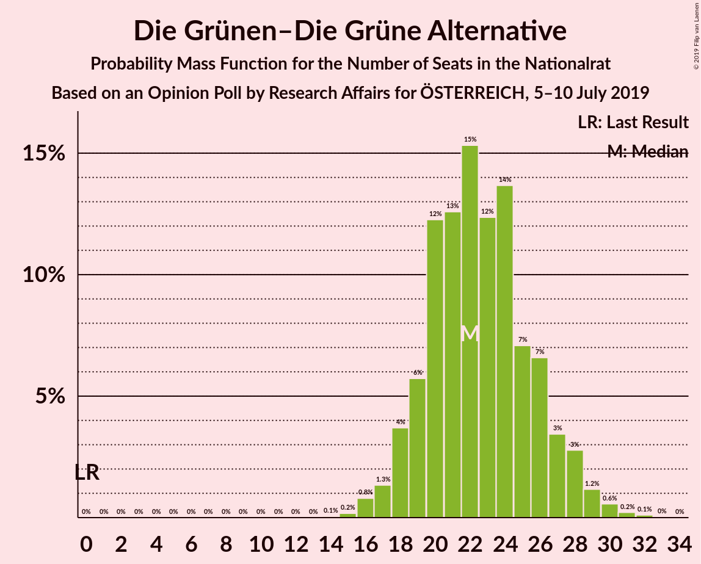
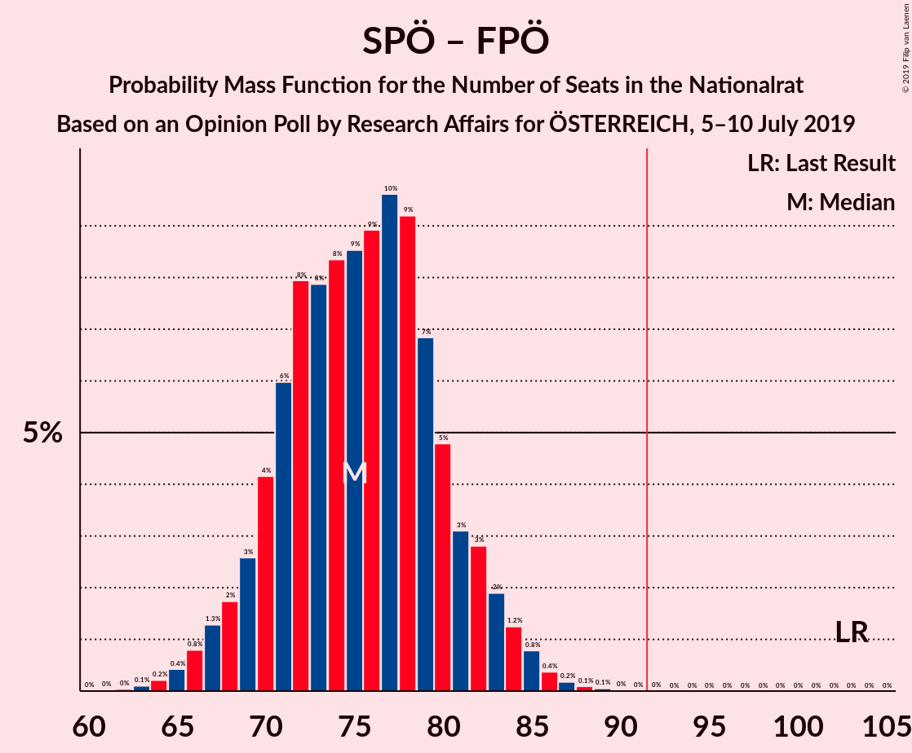

# Opinion Poll by Research Affairs for ÖSTERREICH, 5–10 July 2019

<a href="#voting-intentions">Voting Intentions</a> | <a href="#seats">Seats</a> | <a href="#coalitions">Coalitions</a> | <a href="#technical-information">Technical Information</a>

## Voting Intentions

### Confidence Intervals

| Party | Last Result | Poll Result | 80% Confidence Interval | 90% Confidence Interval | 95% Confidence Interval | 99% Confidence Interval |
|:-----:|:-----------:|:-----------:|:-----------------------:|:-----------------------:|:-----------------------:|:-----------------------:|
| Österreichische Volkspartei | 31.5% | 36.9% | 34.2–39.8% |33.5–40.6% |32.8–41.2% |31.5–42.6% |
| Sozialdemokratische Partei Österreichs | 26.9% | 22.0% | 19.7–24.5% |19.1–25.2% |18.5–25.8% |17.5–27.0% |
| Freiheitliche Partei Österreichs | 26.0% | 18.0% | 15.9–20.3% |15.3–21.0% |14.8–21.6% |13.9–22.7% |
| Die Grünen–Die Grüne Alternative | 3.8% | 12.0% | 10.3–14.0% |9.8–14.6% |9.4–15.1% |8.7–16.2% |
| NEOS–Das Neue Österreich und Liberales Forum | 5.3% | 8.0% | 6.6–9.8% |6.2–10.3% |5.9–10.7% |5.3–11.6% |
| JETZT–Liste Pilz | 4.4% | 1.0% | 0.6–1.8% |0.5–2.1% |0.4–2.3% |0.3–2.8% |

*Note:* The poll result column reflects the actual value used in the calculations. Published results may vary slightly, and in addition be rounded to fewer digits.

## Seats

### Confidence Intervals

| Party | Last Result | Median | 80% Confidence Interval | 90% Confidence Interval | 95% Confidence Interval | 99% Confidence Interval |
|:-----:|:-----------:|:------:|:-----------------------:|:-----------------------:|:-----------------------:|:-----------------------:|
| <a href="#österreichische-volkspartei">Österreichische Volkspartei</a> | 62 | 70 | 65–75 |63–77 |62–78 |60–80 |
| <a href="#sozialdemokratische-partei-österreichs">Sozialdemokratische Partei Österreichs</a> | 52 | 41 | 37–46 |36–47 |35–49 |33–51 |
| <a href="#freiheitliche-partei-österreichs">Freiheitliche Partei Österreichs</a> | 51 | 34 | 30–38 |29–39 |28–41 |26–43 |
| <a href="#die-grünen–die-grüne-alternative">Die Grünen–Die Grüne Alternative</a> | 0 | 22 | 19–26 |18–27 |18–28 |16–30 |
| <a href="#neos–das-neue-österreich-und-liberales-forum">NEOS–Das Neue Österreich und Liberales Forum</a> | 10 | 15 | 12–18 |11–19 |11–20 |10–22 |
| <a href="#jetzt–liste-pilz">JETZT–Liste Pilz</a> | 8 | 0 | 0 |0 |0 |0 |

### Österreichische Volkspartei

*For a full overview of the results for this party, see the [Österreichische Volkspartei](party-österreichischevolkspartei.html) page.*

| Number of Seats | Probability | Accumulated | Special Marks |
|:---------------:|:-----------:|:-----------:|:-------------:|
| 57 | 0.1% | 100% |  |
| 58 | 0.1% | 99.9% |  |
| 59 | 0.3% | 99.8% |  |
| 60 | 0.5% | 99.5% |  |
| 61 | 0.9% | 99.0% |  |
| 62 | 1.5% | 98% | Last Result |
| 63 | 3% | 97% |  |
| 64 | 3% | 94% |  |
| 65 | 5% | 91% |  |
| 66 | 6% | 86% |  |
| 67 | 8% | 79% |  |
| 68 | 9% | 72% |  |
| 69 | 10% | 63% |  |
| 70 | 9% | 53% | Median |
| 71 | 10% | 44% |  |
| 72 | 8% | 34% |  |
| 73 | 7% | 26% |  |
| 74 | 6% | 19% |  |
| 75 | 4% | 13% |  |
| 76 | 3% | 9% |  |
| 77 | 2% | 5% |  |
| 78 | 1.3% | 3% |  |
| 79 | 0.8% | 2% |  |
| 80 | 0.5% | 1.0% |  |
| 81 | 0.3% | 0.5% |  |
| 82 | 0.1% | 0.2% |  |
| 83 | 0.1% | 0.1% |  |
| 84 | 0% | 0% |  |

### Sozialdemokratische Partei Österreichs

*For a full overview of the results for this party, see the [Sozialdemokratische Partei Österreichs](party-sozialdemokratischeparteiösterreichs.html) page.*

| Number of Seats | Probability | Accumulated | Special Marks |
|:---------------:|:-----------:|:-----------:|:-------------:|
| 31 | 0.1% | 100% |  |
| 32 | 0.2% | 99.9% |  |
| 33 | 0.5% | 99.6% |  |
| 34 | 1.3% | 99.2% |  |
| 35 | 2% | 98% |  |
| 36 | 4% | 96% |  |
| 37 | 5% | 92% |  |
| 38 | 7% | 87% |  |
| 39 | 9% | 80% |  |
| 40 | 11% | 71% |  |
| 41 | 11% | 60% | Median |
| 42 | 12% | 49% |  |
| 43 | 10% | 38% |  |
| 44 | 9% | 28% |  |
| 45 | 6% | 19% |  |
| 46 | 5% | 13% |  |
| 47 | 3% | 8% |  |
| 48 | 2% | 5% |  |
| 49 | 1.1% | 3% |  |
| 50 | 0.8% | 1.4% |  |
| 51 | 0.3% | 0.7% |  |
| 52 | 0.2% | 0.3% | Last Result |
| 53 | 0.1% | 0.1% |  |
| 54 | 0% | 0.1% |  |
| 55 | 0% | 0% |  |

### Freiheitliche Partei Österreichs

*For a full overview of the results for this party, see the [Freiheitliche Partei Österreichs](party-freiheitlicheparteiösterreichs.html) page.*

| Number of Seats | Probability | Accumulated | Special Marks |
|:---------------:|:-----------:|:-----------:|:-------------:|
| 24 | 0.1% | 100% |  |
| 25 | 0.2% | 99.9% |  |
| 26 | 0.5% | 99.7% |  |
| 27 | 1.1% | 99.2% |  |
| 28 | 2% | 98% |  |
| 29 | 4% | 96% |  |
| 30 | 7% | 92% |  |
| 31 | 8% | 85% |  |
| 32 | 10% | 77% |  |
| 33 | 12% | 67% |  |
| 34 | 12% | 55% | Median |
| 35 | 12% | 43% |  |
| 36 | 9% | 31% |  |
| 37 | 7% | 21% |  |
| 38 | 6% | 14% |  |
| 39 | 4% | 9% |  |
| 40 | 2% | 5% |  |
| 41 | 1.2% | 3% |  |
| 42 | 0.7% | 1.3% |  |
| 43 | 0.4% | 0.7% |  |
| 44 | 0.2% | 0.3% |  |
| 45 | 0.1% | 0.1% |  |
| 46 | 0% | 0% |  |
| 47 | 0% | 0% |  |
| 48 | 0% | 0% |  |
| 49 | 0% | 0% |  |
| 50 | 0% | 0% |  |
| 51 | 0% | 0% | Last Result |

### Die Grünen–Die Grüne Alternative

*For a full overview of the results for this party, see the [Die Grünen–Die Grüne Alternative](party-diegrünen–diegrünealternative.html) page.*

| Number of Seats | Probability | Accumulated | Special Marks |
|:---------------:|:-----------:|:-----------:|:-------------:|
| 0 | 0% | 100% | Last Result |
| 1 | 0% | 100% |  |
| 2 | 0% | 100% |  |
| 3 | 0% | 100% |  |
| 4 | 0% | 100% |  |
| 5 | 0% | 100% |  |
| 6 | 0% | 100% |  |
| 7 | 0% | 100% |  |
| 8 | 0% | 100% |  |
| 9 | 0% | 100% |  |
| 10 | 0% | 100% |  |
| 11 | 0% | 100% |  |
| 12 | 0% | 100% |  |
| 13 | 0% | 100% |  |
| 14 | 0.1% | 100% |  |
| 15 | 0.2% | 99.9% |  |
| 16 | 0.8% | 99.8% |  |
| 17 | 1.3% | 99.0% |  |
| 18 | 4% | 98% |  |
| 19 | 6% | 94% |  |
| 20 | 12% | 88% |  |
| 21 | 13% | 76% |  |
| 22 | 15% | 63% | Median |
| 23 | 12% | 48% |  |
| 24 | 14% | 36% |  |
| 25 | 7% | 22% |  |
| 26 | 7% | 15% |  |
| 27 | 3% | 8% |  |
| 28 | 3% | 5% |  |
| 29 | 1.2% | 2% |  |
| 30 | 0.6% | 0.9% |  |
| 31 | 0.2% | 0.4% |  |
| 32 | 0.1% | 0.2% |  |
| 33 | 0% | 0% |  |

### NEOS–Das Neue Österreich und Liberales Forum

*For a full overview of the results for this party, see the [NEOS–Das Neue Österreich und Liberales Forum](party-neos–dasneueösterreichundliberalesforum.html) page.*

| Number of Seats | Probability | Accumulated | Special Marks |
|:---------------:|:-----------:|:-----------:|:-------------:|
| 8 | 0.1% | 100% |  |
| 9 | 0.3% | 99.9% |  |
| 10 | 1.4% | 99.6% | Last Result |
| 11 | 4% | 98% |  |
| 12 | 8% | 95% |  |
| 13 | 12% | 86% |  |
| 14 | 16% | 74% |  |
| 15 | 17% | 58% | Median |
| 16 | 15% | 40% |  |
| 17 | 11% | 25% |  |
| 18 | 7% | 14% |  |
| 19 | 4% | 7% |  |
| 20 | 2% | 3% |  |
| 21 | 0.9% | 1.4% |  |
| 22 | 0.3% | 0.5% |  |
| 23 | 0.1% | 0.2% |  |
| 24 | 0% | 0.1% |  |
| 25 | 0% | 0% |  |

### JETZT–Liste Pilz

*For a full overview of the results for this party, see the [JETZT–Liste Pilz](party-jetzt–listepilz.html) page.*

| Number of Seats | Probability | Accumulated | Special Marks |
|:---------------:|:-----------:|:-----------:|:-------------:|
| 0 | 100% | 100% | Median |
| 1 | 0% | 0% |  |
| 2 | 0% | 0% |  |
| 3 | 0% | 0% |  |
| 4 | 0% | 0% |  |
| 5 | 0% | 0% |  |
| 6 | 0% | 0% |  |
| 7 | 0% | 0% |  |
| 8 | 0% | 0% | Last Result |

## Coalitions

### Confidence Intervals

| Coalition | Last Result | Median | Majority? | 80% Confidence Interval | 90% Confidence Interval | 95% Confidence Interval | 99% Confidence Interval |
|:---------:|:-----------:|:------:|:---------:|:-----------------------:|:-----------------------:|:-----------------------:|:-----------------------:|
| Österreichische Volkspartei – Sozialdemokratische Partei Österreichs | 114 | 111 | 100% | 106–117 | 105–118 | 103–119 | 100–122 |
| Österreichische Volkspartei – Die Grünen–Die Grüne Alternative – NEOS–Das Neue Österreich und Liberales Forum | 72 | 107 | 100% | 102–113 | 100–114 | 99–116 | 97–118 |
| Österreichische Volkspartei – Freiheitliche Partei Österreichs | 113 | 104 | 99.8% | 98–109 | 97–111 | 95–112 | 93–114 |
| Österreichische Volkspartei – Die Grünen–Die Grüne Alternative | 62 | 92 | 57% | 87–98 | 85–99 | 84–101 | 82–103 |
| Österreichische Volkspartei – NEOS–Das Neue Österreich und Liberales Forum | 72 | 85 | 6% | 80–90 | 78–92 | 77–93 | 74–96 |
| Sozialdemokratische Partei Österreichs – Die Grünen–Die Grüne Alternative – NEOS–Das Neue Österreich und Liberales Forum | 62 | 79 | 0.2% | 74–84 | 72–86 | 71–87 | 68–90 |
| Sozialdemokratische Partei Österreichs – Freiheitliche Partei Österreichs | 103 | 75 | 0% | 70–81 | 69–82 | 67–84 | 65–86 |
| Österreichische Volkspartei | 62 | 70 | 0% | 65–75 | 63–77 | 62–78 | 60–80 |
| Sozialdemokratische Partei Österreichs | 52 | 41 | 0% | 37–46 | 36–47 | 35–49 | 33–51 |

### Österreichische Volkspartei – Sozialdemokratische Partei Österreichs

| Number of Seats | Probability | Accumulated | Special Marks |
|:---------------:|:-----------:|:-----------:|:-------------:|
| 97 | 0% | 100% |  |
| 98 | 0.1% | 99.9% |  |
| 99 | 0.1% | 99.9% |  |
| 100 | 0.3% | 99.7% |  |
| 101 | 0.4% | 99.5% |  |
| 102 | 0.8% | 99.1% |  |
| 103 | 1.4% | 98% |  |
| 104 | 2% | 97% |  |
| 105 | 3% | 95% |  |
| 106 | 4% | 92% |  |
| 107 | 5% | 88% |  |
| 108 | 7% | 83% |  |
| 109 | 8% | 75% |  |
| 110 | 9% | 67% |  |
| 111 | 9% | 58% | Median |
| 112 | 10% | 49% |  |
| 113 | 9% | 39% |  |
| 114 | 8% | 31% | Last Result |
| 115 | 6% | 22% |  |
| 116 | 5% | 16% |  |
| 117 | 4% | 10% |  |
| 118 | 3% | 7% |  |
| 119 | 2% | 4% |  |
| 120 | 1.0% | 2% |  |
| 121 | 0.6% | 1.3% |  |
| 122 | 0.3% | 0.6% |  |
| 123 | 0.2% | 0.3% |  |
| 124 | 0.1% | 0.1% |  |
| 125 | 0% | 0.1% |  |
| 126 | 0% | 0% |  |

### Österreichische Volkspartei – Die Grünen–Die Grüne Alternative – NEOS–Das Neue Österreich und Liberales Forum

| Number of Seats | Probability | Accumulated | Special Marks |
|:---------------:|:-----------:|:-----------:|:-------------:|
| 72 | 0% | 100% | Last Result |
| 73 | 0% | 100% |  |
| 74 | 0% | 100% |  |
| 75 | 0% | 100% |  |
| 76 | 0% | 100% |  |
| 77 | 0% | 100% |  |
| 78 | 0% | 100% |  |
| 79 | 0% | 100% |  |
| 80 | 0% | 100% |  |
| 81 | 0% | 100% |  |
| 82 | 0% | 100% |  |
| 83 | 0% | 100% |  |
| 84 | 0% | 100% |  |
| 85 | 0% | 100% |  |
| 86 | 0% | 100% |  |
| 87 | 0% | 100% |  |
| 88 | 0% | 100% |  |
| 89 | 0% | 100% |  |
| 90 | 0% | 100% |  |
| 91 | 0% | 100% |  |
| 92 | 0% | 100% | Majority |
| 93 | 0% | 100% |  |
| 94 | 0.1% | 99.9% |  |
| 95 | 0.1% | 99.9% |  |
| 96 | 0.2% | 99.8% |  |
| 97 | 0.4% | 99.5% |  |
| 98 | 0.9% | 99.1% |  |
| 99 | 1.3% | 98% |  |
| 100 | 2% | 97% |  |
| 101 | 3% | 95% |  |
| 102 | 3% | 92% |  |
| 103 | 5% | 89% |  |
| 104 | 7% | 84% |  |
| 105 | 9% | 77% |  |
| 106 | 10% | 68% |  |
| 107 | 9% | 58% | Median |
| 108 | 8% | 49% |  |
| 109 | 8% | 40% |  |
| 110 | 8% | 32% |  |
| 111 | 8% | 24% |  |
| 112 | 6% | 17% |  |
| 113 | 4% | 11% |  |
| 114 | 2% | 7% |  |
| 115 | 2% | 4% |  |
| 116 | 1.2% | 3% |  |
| 117 | 0.8% | 1.5% |  |
| 118 | 0.4% | 0.7% |  |
| 119 | 0.2% | 0.3% |  |
| 120 | 0.1% | 0.1% |  |
| 121 | 0% | 0.1% |  |
| 122 | 0% | 0% |  |

### Österreichische Volkspartei – Freiheitliche Partei Österreichs

| Number of Seats | Probability | Accumulated | Special Marks |
|:---------------:|:-----------:|:-----------:|:-------------:|
| 90 | 0% | 100% |  |
| 91 | 0.1% | 99.9% |  |
| 92 | 0.2% | 99.8% | Majority |
| 93 | 0.4% | 99.6% |  |
| 94 | 0.6% | 99.2% |  |
| 95 | 1.2% | 98.6% |  |
| 96 | 2% | 97% |  |
| 97 | 3% | 96% |  |
| 98 | 4% | 93% |  |
| 99 | 4% | 90% |  |
| 100 | 7% | 85% |  |
| 101 | 7% | 79% |  |
| 102 | 9% | 72% |  |
| 103 | 9% | 63% |  |
| 104 | 9% | 53% | Median |
| 105 | 10% | 44% |  |
| 106 | 8% | 35% |  |
| 107 | 7% | 26% |  |
| 108 | 6% | 19% |  |
| 109 | 4% | 13% |  |
| 110 | 3% | 9% |  |
| 111 | 2% | 5% |  |
| 112 | 1.4% | 3% |  |
| 113 | 0.9% | 2% | Last Result |
| 114 | 0.4% | 0.9% |  |
| 115 | 0.3% | 0.5% |  |
| 116 | 0.1% | 0.2% |  |
| 117 | 0.1% | 0.1% |  |
| 118 | 0% | 0% |  |

### Österreichische Volkspartei – Die Grünen–Die Grüne Alternative

| Number of Seats | Probability | Accumulated | Special Marks |
|:---------------:|:-----------:|:-----------:|:-------------:|
| 62 | 0% | 100% | Last Result |
| 63 | 0% | 100% |  |
| 64 | 0% | 100% |  |
| 65 | 0% | 100% |  |
| 66 | 0% | 100% |  |
| 67 | 0% | 100% |  |
| 68 | 0% | 100% |  |
| 69 | 0% | 100% |  |
| 70 | 0% | 100% |  |
| 71 | 0% | 100% |  |
| 72 | 0% | 100% |  |
| 73 | 0% | 100% |  |
| 74 | 0% | 100% |  |
| 75 | 0% | 100% |  |
| 76 | 0% | 100% |  |
| 77 | 0% | 100% |  |
| 78 | 0% | 100% |  |
| 79 | 0.1% | 99.9% |  |
| 80 | 0.1% | 99.9% |  |
| 81 | 0.2% | 99.8% |  |
| 82 | 0.5% | 99.5% |  |
| 83 | 0.8% | 99.1% |  |
| 84 | 1.4% | 98% |  |
| 85 | 2% | 97% |  |
| 86 | 3% | 95% |  |
| 87 | 4% | 92% |  |
| 88 | 5% | 88% |  |
| 89 | 7% | 83% |  |
| 90 | 9% | 76% |  |
| 91 | 10% | 67% |  |
| 92 | 9% | 57% | Median, Majority |
| 93 | 9% | 49% |  |
| 94 | 8% | 40% |  |
| 95 | 8% | 32% |  |
| 96 | 7% | 24% |  |
| 97 | 6% | 17% |  |
| 98 | 4% | 11% |  |
| 99 | 3% | 7% |  |
| 100 | 2% | 5% |  |
| 101 | 1.2% | 3% |  |
| 102 | 0.9% | 2% |  |
| 103 | 0.5% | 0.9% |  |
| 104 | 0.2% | 0.4% |  |
| 105 | 0.1% | 0.2% |  |
| 106 | 0% | 0.1% |  |
| 107 | 0% | 0% |  |

### Österreichische Volkspartei – NEOS–Das Neue Österreich und Liberales Forum

| Number of Seats | Probability | Accumulated | Special Marks |
|:---------------:|:-----------:|:-----------:|:-------------:|
| 71 | 0% | 100% |  |
| 72 | 0.1% | 99.9% | Last Result |
| 73 | 0.2% | 99.8% |  |
| 74 | 0.3% | 99.7% |  |
| 75 | 0.5% | 99.3% |  |
| 76 | 1.1% | 98.8% |  |
| 77 | 2% | 98% |  |
| 78 | 3% | 96% |  |
| 79 | 3% | 94% |  |
| 80 | 5% | 90% |  |
| 81 | 6% | 85% |  |
| 82 | 7% | 79% |  |
| 83 | 8% | 72% |  |
| 84 | 9% | 63% |  |
| 85 | 9% | 54% | Median |
| 86 | 9% | 45% |  |
| 87 | 8% | 35% |  |
| 88 | 7% | 27% |  |
| 89 | 6% | 20% |  |
| 90 | 5% | 14% |  |
| 91 | 4% | 9% |  |
| 92 | 2% | 6% | Majority |
| 93 | 1.4% | 3% |  |
| 94 | 0.9% | 2% |  |
| 95 | 0.5% | 1.1% |  |
| 96 | 0.3% | 0.6% |  |
| 97 | 0.1% | 0.3% |  |
| 98 | 0.1% | 0.1% |  |
| 99 | 0% | 0.1% |  |
| 100 | 0% | 0% |  |

### Sozialdemokratische Partei Österreichs – Die Grünen–Die Grüne Alternative – NEOS–Das Neue Österreich und Liberales Forum

| Number of Seats | Probability | Accumulated | Special Marks |
|:---------------:|:-----------:|:-----------:|:-------------:|
| 62 | 0% | 100% | Last Result |
| 63 | 0% | 100% |  |
| 64 | 0% | 100% |  |
| 65 | 0% | 100% |  |
| 66 | 0.1% | 100% |  |
| 67 | 0.1% | 99.9% |  |
| 68 | 0.3% | 99.8% |  |
| 69 | 0.5% | 99.5% |  |
| 70 | 1.0% | 99.0% |  |
| 71 | 1.5% | 98% |  |
| 72 | 2% | 97% |  |
| 73 | 3% | 94% |  |
| 74 | 4% | 91% |  |
| 75 | 6% | 86% |  |
| 76 | 7% | 80% |  |
| 77 | 8% | 73% |  |
| 78 | 10% | 64% | Median |
| 79 | 9% | 55% |  |
| 80 | 9% | 46% |  |
| 81 | 9% | 36% |  |
| 82 | 7% | 27% |  |
| 83 | 6% | 20% |  |
| 84 | 4% | 14% |  |
| 85 | 3% | 10% |  |
| 86 | 2% | 6% |  |
| 87 | 2% | 4% |  |
| 88 | 1.1% | 2% |  |
| 89 | 0.5% | 1.2% |  |
| 90 | 0.3% | 0.7% |  |
| 91 | 0.2% | 0.3% |  |
| 92 | 0.1% | 0.2% | Majority |
| 93 | 0% | 0.1% |  |
| 94 | 0% | 0% |  |

### Sozialdemokratische Partei Österreichs – Freiheitliche Partei Österreichs

| Number of Seats | Probability | Accumulated | Special Marks |
|:---------------:|:-----------:|:-----------:|:-------------:|
| 62 | 0% | 100% |  |
| 63 | 0.1% | 99.9% |  |
| 64 | 0.2% | 99.8% |  |
| 65 | 0.4% | 99.6% |  |
| 66 | 0.8% | 99.2% |  |
| 67 | 1.3% | 98% |  |
| 68 | 2% | 97% |  |
| 69 | 3% | 95% |  |
| 70 | 4% | 93% |  |
| 71 | 6% | 89% |  |
| 72 | 8% | 83% |  |
| 73 | 8% | 75% |  |
| 74 | 8% | 67% |  |
| 75 | 9% | 58% | Median |
| 76 | 9% | 50% |  |
| 77 | 10% | 41% |  |
| 78 | 9% | 31% |  |
| 79 | 7% | 22% |  |
| 80 | 5% | 15% |  |
| 81 | 3% | 11% |  |
| 82 | 3% | 7% |  |
| 83 | 2% | 5% |  |
| 84 | 1.2% | 3% |  |
| 85 | 0.8% | 2% |  |
| 86 | 0.4% | 0.7% |  |
| 87 | 0.2% | 0.4% |  |
| 88 | 0.1% | 0.2% |  |
| 89 | 0.1% | 0.1% |  |
| 90 | 0% | 0% |  |
| 91 | 0% | 0% |  |
| 92 | 0% | 0% | Majority |
| 93 | 0% | 0% |  |
| 94 | 0% | 0% |  |
| 95 | 0% | 0% |  |
| 96 | 0% | 0% |  |
| 97 | 0% | 0% |  |
| 98 | 0% | 0% |  |
| 99 | 0% | 0% |  |
| 100 | 0% | 0% |  |
| 101 | 0% | 0% |  |
| 102 | 0% | 0% |  |
| 103 | 0% | 0% | Last Result |

### Österreichische Volkspartei

| Number of Seats | Probability | Accumulated | Special Marks |
|:---------------:|:-----------:|:-----------:|:-------------:|
| 57 | 0.1% | 100% |  |
| 58 | 0.1% | 99.9% |  |
| 59 | 0.3% | 99.8% |  |
| 60 | 0.5% | 99.5% |  |
| 61 | 0.9% | 99.0% |  |
| 62 | 1.5% | 98% | Last Result |
| 63 | 3% | 97% |  |
| 64 | 3% | 94% |  |
| 65 | 5% | 91% |  |
| 66 | 6% | 86% |  |
| 67 | 8% | 79% |  |
| 68 | 9% | 72% |  |
| 69 | 10% | 63% |  |
| 70 | 9% | 53% | Median |
| 71 | 10% | 44% |  |
| 72 | 8% | 34% |  |
| 73 | 7% | 26% |  |
| 74 | 6% | 19% |  |
| 75 | 4% | 13% |  |
| 76 | 3% | 9% |  |
| 77 | 2% | 5% |  |
| 78 | 1.3% | 3% |  |
| 79 | 0.8% | 2% |  |
| 80 | 0.5% | 1.0% |  |
| 81 | 0.3% | 0.5% |  |
| 82 | 0.1% | 0.2% |  |
| 83 | 0.1% | 0.1% |  |
| 84 | 0% | 0% |  |

### Sozialdemokratische Partei Österreichs

| Number of Seats | Probability | Accumulated | Special Marks |
|:---------------:|:-----------:|:-----------:|:-------------:|
| 31 | 0.1% | 100% |  |
| 32 | 0.2% | 99.9% |  |
| 33 | 0.5% | 99.6% |  |
| 34 | 1.3% | 99.2% |  |
| 35 | 2% | 98% |  |
| 36 | 4% | 96% |  |
| 37 | 5% | 92% |  |
| 38 | 7% | 87% |  |
| 39 | 9% | 80% |  |
| 40 | 11% | 71% |  |
| 41 | 11% | 60% | Median |
| 42 | 12% | 49% |  |
| 43 | 10% | 38% |  |
| 44 | 9% | 28% |  |
| 45 | 6% | 19% |  |
| 46 | 5% | 13% |  |
| 47 | 3% | 8% |  |
| 48 | 2% | 5% |  |
| 49 | 1.1% | 3% |  |
| 50 | 0.8% | 1.4% |  |
| 51 | 0.3% | 0.7% |  |
| 52 | 0.2% | 0.3% | Last Result |
| 53 | 0.1% | 0.1% |  |
| 54 | 0% | 0.1% |  |
| 55 | 0% | 0% |  |

## Technical Information

### Opinion Poll

+ **Polling firm:** Research Affairs
+ **Commissioner(s):** ÖSTERREICH
+ **Fieldwork period:** 5–10 July 2019

### Calculations

+ **Sample size:** 501
+ **Simulations done:** 1,048,576
+ **Error estimate:** 2.38%

