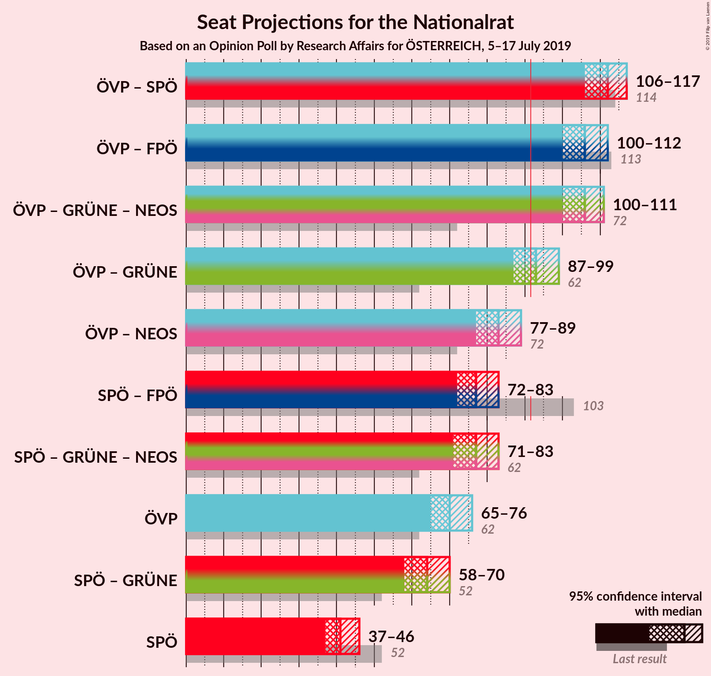
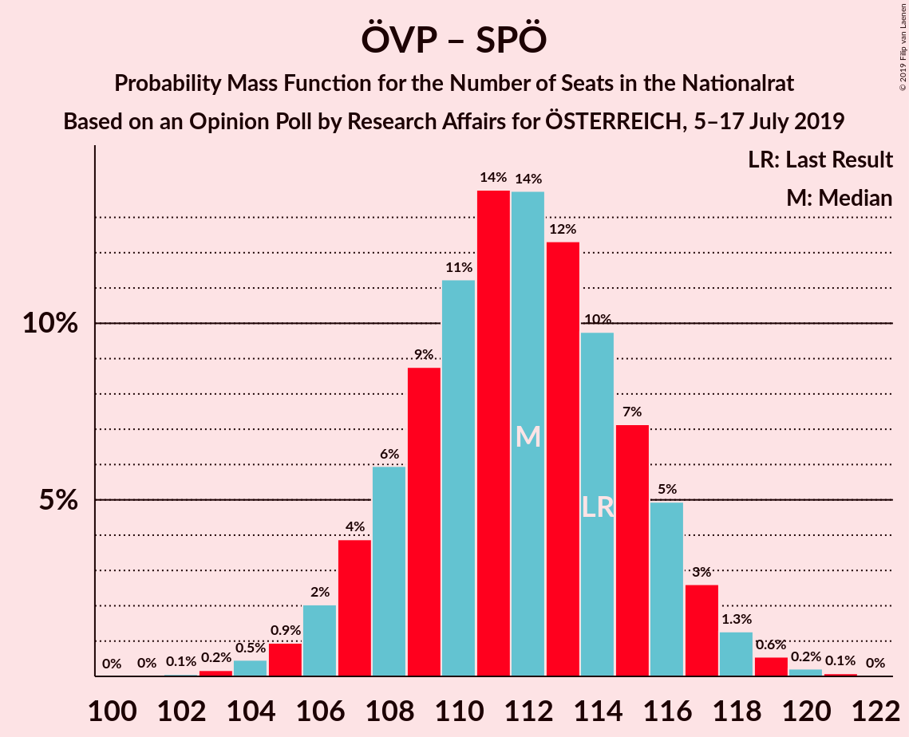

# Opinion Poll by Research Affairs for ÖSTERREICH, 5–17 July 2019

<a href="#voting-intentions">Voting Intentions</a> | <a href="#seats">Seats</a> | <a href="#coalitions">Coalitions</a> | <a href="#technical-information">Technical Information</a>

## Voting Intentions

### Confidence Intervals

| Party | Last Result | Poll Result | 80% Confidence Interval | 90% Confidence Interval | 95% Confidence Interval | 99% Confidence Interval |
|:-----:|:-----------:|:-----------:|:-----------------------:|:-----------------------:|:-----------------------:|:-----------------------:|
| Österreichische Volkspartei | 31.5% | 37.0% | 35.1–39.0% |34.6–39.6% |34.1–40.1% |33.2–41.0% |
| Sozialdemokratische Partei Österreichs | 26.9% | 22.0% | 20.3–23.7% |19.9–24.2% |19.5–24.6% |18.7–25.5% |
| Freiheitliche Partei Österreichs | 26.0% | 19.0% | 17.4–20.6% |17.0–21.1% |16.6–21.5% |15.9–22.3% |
| Die Grünen–Die Grüne Alternative | 3.8% | 12.0% | 10.7–13.4% |10.4–13.8% |10.1–14.1% |9.5–14.8% |
| NEOS–Das Neue Österreich und Liberales Forum | 5.3% | 7.0% | 6.1–8.1% |5.8–8.5% |5.6–8.7% |5.1–9.3% |
| JETZT–Liste Pilz | 4.4% | 1.0% | 0.7–1.5% |0.6–1.7% |0.5–1.8% |0.4–2.1% |

*Note:* The poll result column reflects the actual value used in the calculations. Published results may vary slightly, and in addition be rounded to fewer digits.

## Seats

### Confidence Intervals

| Party | Last Result | Median | 80% Confidence Interval | 90% Confidence Interval | 95% Confidence Interval | 99% Confidence Interval |
|:-----:|:-----------:|:------:|:-----------------------:|:-----------------------:|:-----------------------:|:-----------------------:|
| <a href="#österreichische-volkspartei">Österreichische Volkspartei</a> | 62 | 69 | 69–70 |69–71 |68–71 |67–80 |
| <a href="#sozialdemokratische-partei-österreichs">Sozialdemokratische Partei Österreichs</a> | 52 | 43 | 40–45 |40–45 |39–47 |37–47 |
| <a href="#freiheitliche-partei-österreichs">Freiheitliche Partei Österreichs</a> | 51 | 37 | 34–38 |34–41 |31–41 |31–41 |
| <a href="#die-grünen–die-grüne-alternative">Die Grünen–Die Grüne Alternative</a> | 0 | 23 | 19–24 |18–24 |18–24 |18–26 |
| <a href="#neos–das-neue-österreich-und-liberales-forum">NEOS–Das Neue Österreich und Liberales Forum</a> | 10 | 13 | 11–14 |11–14 |11–14 |10–16 |
| <a href="#jetzt–liste-pilz">JETZT–Liste Pilz</a> | 8 | 0 | 0 |0 |0 |0 |

### Österreichische Volkspartei

*For a full overview of the results for this party, see the [Österreichische Volkspartei](party-österreichischevolkspartei.html) page.*

| Number of Seats | Probability | Accumulated | Special Marks |
|:---------------:|:-----------:|:-----------:|:-------------:|
| 60 | 0.1% | 100% |  |
| 61 | 0% | 99.9% |  |
| 62 | 0% | 99.9% | Last Result |
| 63 | 0% | 99.8% |  |
| 64 | 0% | 99.8% |  |
| 65 | 0% | 99.8% |  |
| 66 | 0.1% | 99.8% |  |
| 67 | 0.8% | 99.7% |  |
| 68 | 3% | 98.9% |  |
| 69 | 75% | 95% | Median |
| 70 | 13% | 21% |  |
| 71 | 7% | 8% |  |
| 72 | 0% | 1.1% |  |
| 73 | 0% | 1.1% |  |
| 74 | 0% | 1.1% |  |
| 75 | 0% | 1.1% |  |
| 76 | 0% | 1.1% |  |
| 77 | 0% | 1.1% |  |
| 78 | 0.2% | 1.1% |  |
| 79 | 0.3% | 0.9% |  |
| 80 | 0.5% | 0.5% |  |
| 81 | 0% | 0% |  |

### Sozialdemokratische Partei Österreichs

*For a full overview of the results for this party, see the [Sozialdemokratische Partei Österreichs](party-sozialdemokratischeparteiösterreichs.html) page.*

| Number of Seats | Probability | Accumulated | Special Marks |
|:---------------:|:-----------:|:-----------:|:-------------:|
| 36 | 0.2% | 100% |  |
| 37 | 1.2% | 99.8% |  |
| 38 | 0% | 98.6% |  |
| 39 | 2% | 98.6% |  |
| 40 | 39% | 97% |  |
| 41 | 0% | 58% |  |
| 42 | 0% | 58% |  |
| 43 | 11% | 58% | Median |
| 44 | 1.0% | 47% |  |
| 45 | 42% | 46% |  |
| 46 | 0.2% | 3% |  |
| 47 | 3% | 3% |  |
| 48 | 0% | 0% |  |
| 49 | 0% | 0% |  |
| 50 | 0% | 0% |  |
| 51 | 0% | 0% |  |
| 52 | 0% | 0% | Last Result |

### Freiheitliche Partei Österreichs

*For a full overview of the results for this party, see the [Freiheitliche Partei Österreichs](party-freiheitlicheparteiösterreichs.html) page.*

| Number of Seats | Probability | Accumulated | Special Marks |
|:---------------:|:-----------:|:-----------:|:-------------:|
| 28 | 0% | 100% |  |
| 29 | 0% | 99.9% |  |
| 30 | 0% | 99.9% |  |
| 31 | 3% | 99.9% |  |
| 32 | 0.4% | 97% |  |
| 33 | 0.7% | 96% |  |
| 34 | 42% | 96% |  |
| 35 | 0% | 53% |  |
| 36 | 2% | 53% |  |
| 37 | 12% | 52% | Median |
| 38 | 34% | 40% |  |
| 39 | 0.1% | 6% |  |
| 40 | 0% | 6% |  |
| 41 | 6% | 6% |  |
| 42 | 0% | 0.2% |  |
| 43 | 0% | 0.1% |  |
| 44 | 0% | 0.1% |  |
| 45 | 0.1% | 0.1% |  |
| 46 | 0% | 0% |  |
| 47 | 0% | 0% |  |
| 48 | 0% | 0% |  |
| 49 | 0% | 0% |  |
| 50 | 0% | 0% |  |
| 51 | 0% | 0% | Last Result |

### Die Grünen–Die Grüne Alternative

*For a full overview of the results for this party, see the [Die Grünen–Die Grüne Alternative](party-diegrünen–diegrünealternative.html) page.*

| Number of Seats | Probability | Accumulated | Special Marks |
|:---------------:|:-----------:|:-----------:|:-------------:|
| 0 | 0% | 100% | Last Result |
| 1 | 0% | 100% |  |
| 2 | 0% | 100% |  |
| 3 | 0% | 100% |  |
| 4 | 0% | 100% |  |
| 5 | 0% | 100% |  |
| 6 | 0% | 100% |  |
| 7 | 0% | 100% |  |
| 8 | 0% | 100% |  |
| 9 | 0% | 100% |  |
| 10 | 0% | 100% |  |
| 11 | 0% | 100% |  |
| 12 | 0% | 100% |  |
| 13 | 0% | 100% |  |
| 14 | 0% | 100% |  |
| 15 | 0% | 100% |  |
| 16 | 0% | 100% |  |
| 17 | 0.4% | 100% |  |
| 18 | 7% | 99.6% |  |
| 19 | 10% | 93% |  |
| 20 | 0.3% | 82% |  |
| 21 | 0.2% | 82% |  |
| 22 | 1.1% | 82% |  |
| 23 | 34% | 81% | Median |
| 24 | 45% | 46% |  |
| 25 | 0.2% | 1.1% |  |
| 26 | 0.8% | 0.8% |  |
| 27 | 0% | 0.1% |  |
| 28 | 0% | 0.1% |  |
| 29 | 0.1% | 0.1% |  |
| 30 | 0% | 0% |  |

### NEOS–Das Neue Österreich und Liberales Forum

*For a full overview of the results for this party, see the [NEOS–Das Neue Österreich und Liberales Forum](party-neos–dasneueösterreichundliberalesforum.html) page.*

| Number of Seats | Probability | Accumulated | Special Marks |
|:---------------:|:-----------:|:-----------:|:-------------:|
| 10 | 1.0% | 100% | Last Result |
| 11 | 43% | 99.0% |  |
| 12 | 0.4% | 56% |  |
| 13 | 42% | 56% | Median |
| 14 | 12% | 14% |  |
| 15 | 0% | 1.1% |  |
| 16 | 0.8% | 1.1% |  |
| 17 | 0.2% | 0.3% |  |
| 18 | 0% | 0% |  |

### JETZT–Liste Pilz

*For a full overview of the results for this party, see the [JETZT–Liste Pilz](party-jetzt–listepilz.html) page.*

| Number of Seats | Probability | Accumulated | Special Marks |
|:---------------:|:-----------:|:-----------:|:-------------:|
| 0 | 100% | 100% | Median |
| 1 | 0% | 0% |  |
| 2 | 0% | 0% |  |
| 3 | 0% | 0% |  |
| 4 | 0% | 0% |  |
| 5 | 0% | 0% |  |
| 6 | 0% | 0% |  |
| 7 | 0% | 0% |  |
| 8 | 0% | 0% | Last Result |

## Coalitions

### Confidence Intervals

| Coalition | Last Result | Median | Majority? | 80% Confidence Interval | 90% Confidence Interval | 95% Confidence Interval | 99% Confidence Interval |
|:---------:|:-----------:|:------:|:---------:|:-----------------------:|:-----------------------:|:-----------------------:|:-----------------------:|
| Österreichische Volkspartei – Sozialdemokratische Partei Österreichs | 114 | 114 | 100% | 109–114 | 109–115 | 109–115 | 107–119 |
| Österreichische Volkspartei – Freiheitliche Partei Österreichs | 113 | 107 | 100% | 103–108 | 103–111 | 99–111 | 99–113 |
| Österreichische Volkspartei – Die Grünen–Die Grüne Alternative – NEOS–Das Neue Österreich und Liberales Forum | 72 | 104 | 100% | 103–105 | 102–105 | 102–106 | 102–111 |
| Österreichische Volkspartei – Die Grünen–Die Grüne Alternative | 62 | 92 | 83% | 89–93 | 89–93 | 89–93 | 88–97 |
| Österreichische Volkspartei – NEOS–Das Neue Österreich und Liberales Forum | 72 | 82 | 0.4% | 80–84 | 80–85 | 80–85 | 80–91 |
| Sozialdemokratische Partei Österreichs – Die Grünen–Die Grüne Alternative – NEOS–Das Neue Österreich und Liberales Forum | 62 | 76 | 0% | 75–80 | 72–80 | 72–84 | 70–84 |
| Sozialdemokratische Partei Österreichs – Freiheitliche Partei Österreichs | 103 | 79 | 0% | 78–80 | 78–81 | 77–81 | 72–81 |
| Österreichische Volkspartei | 62 | 69 | 0% | 69–70 | 69–71 | 68–71 | 67–80 |
| Sozialdemokratische Partei Österreichs | 52 | 43 | 0% | 40–45 | 40–45 | 39–47 | 37–47 |

### Österreichische Volkspartei – Sozialdemokratische Partei Österreichs

| Number of Seats | Probability | Accumulated | Special Marks |
|:---------------:|:-----------:|:-----------:|:-------------:|
| 105 | 0% | 100% |  |
| 106 | 0% | 99.9% |  |
| 107 | 2% | 99.9% |  |
| 108 | 0.1% | 98% |  |
| 109 | 34% | 98% |  |
| 110 | 5% | 64% |  |
| 111 | 0% | 59% |  |
| 112 | 0.1% | 59% | Median |
| 113 | 5% | 59% |  |
| 114 | 48% | 53% | Last Result |
| 115 | 4% | 5% |  |
| 116 | 0.5% | 1.1% |  |
| 117 | 0% | 0.6% |  |
| 118 | 0% | 0.6% |  |
| 119 | 0.4% | 0.6% |  |
| 120 | 0.1% | 0.2% |  |
| 121 | 0% | 0.1% |  |
| 122 | 0% | 0% |  |

### Österreichische Volkspartei – Freiheitliche Partei Österreichs

| Number of Seats | Probability | Accumulated | Special Marks |
|:---------------:|:-----------:|:-----------:|:-------------:|
| 98 | 0.1% | 100% |  |
| 99 | 3% | 99.9% |  |
| 100 | 0.2% | 97% |  |
| 101 | 0% | 96% |  |
| 102 | 0.2% | 96% |  |
| 103 | 42% | 96% |  |
| 104 | 0.7% | 54% |  |
| 105 | 0% | 53% |  |
| 106 | 0% | 53% | Median |
| 107 | 39% | 53% |  |
| 108 | 7% | 14% |  |
| 109 | 0% | 7% |  |
| 110 | 0% | 7% |  |
| 111 | 6% | 7% |  |
| 112 | 0.3% | 1.1% |  |
| 113 | 0.4% | 0.8% | Last Result |
| 114 | 0% | 0.4% |  |
| 115 | 0% | 0.4% |  |
| 116 | 0.3% | 0.4% |  |
| 117 | 0% | 0% |  |

### Österreichische Volkspartei – Die Grünen–Die Grüne Alternative – NEOS–Das Neue Österreich und Liberales Forum

| Number of Seats | Probability | Accumulated | Special Marks |
|:---------------:|:-----------:|:-----------:|:-------------:|
| 72 | 0% | 100% | Last Result |
| 73 | 0% | 100% |  |
| 74 | 0% | 100% |  |
| 75 | 0% | 100% |  |
| 76 | 0% | 100% |  |
| 77 | 0% | 100% |  |
| 78 | 0% | 100% |  |
| 79 | 0% | 100% |  |
| 80 | 0% | 100% |  |
| 81 | 0% | 100% |  |
| 82 | 0% | 100% |  |
| 83 | 0% | 100% |  |
| 84 | 0% | 100% |  |
| 85 | 0% | 100% |  |
| 86 | 0% | 100% |  |
| 87 | 0% | 100% |  |
| 88 | 0% | 100% |  |
| 89 | 0% | 100% |  |
| 90 | 0% | 100% |  |
| 91 | 0% | 100% |  |
| 92 | 0% | 100% | Majority |
| 93 | 0% | 100% |  |
| 94 | 0% | 100% |  |
| 95 | 0% | 100% |  |
| 96 | 0% | 100% |  |
| 97 | 0.1% | 99.9% |  |
| 98 | 0% | 99.9% |  |
| 99 | 0% | 99.8% |  |
| 100 | 0.1% | 99.8% |  |
| 101 | 0% | 99.7% |  |
| 102 | 5% | 99.7% |  |
| 103 | 12% | 95% |  |
| 104 | 42% | 83% |  |
| 105 | 37% | 40% | Median |
| 106 | 1.2% | 3% |  |
| 107 | 0.7% | 2% |  |
| 108 | 0.1% | 1.2% |  |
| 109 | 0.3% | 1.1% |  |
| 110 | 0% | 0.8% |  |
| 111 | 0.5% | 0.8% |  |
| 112 | 0.1% | 0.3% |  |
| 113 | 0.2% | 0.2% |  |
| 114 | 0% | 0% |  |

### Österreichische Volkspartei – Die Grünen–Die Grüne Alternative

| Number of Seats | Probability | Accumulated | Special Marks |
|:---------------:|:-----------:|:-----------:|:-------------:|
| 62 | 0% | 100% | Last Result |
| 63 | 0% | 100% |  |
| 64 | 0% | 100% |  |
| 65 | 0% | 100% |  |
| 66 | 0% | 100% |  |
| 67 | 0% | 100% |  |
| 68 | 0% | 100% |  |
| 69 | 0% | 100% |  |
| 70 | 0% | 100% |  |
| 71 | 0% | 100% |  |
| 72 | 0% | 100% |  |
| 73 | 0% | 100% |  |
| 74 | 0% | 100% |  |
| 75 | 0% | 100% |  |
| 76 | 0% | 100% |  |
| 77 | 0% | 100% |  |
| 78 | 0% | 100% |  |
| 79 | 0% | 100% |  |
| 80 | 0% | 100% |  |
| 81 | 0% | 100% |  |
| 82 | 0.1% | 100% |  |
| 83 | 0% | 99.9% |  |
| 84 | 0% | 99.9% |  |
| 85 | 0% | 99.9% |  |
| 86 | 0% | 99.9% |  |
| 87 | 0% | 99.8% |  |
| 88 | 0.7% | 99.8% |  |
| 89 | 16% | 99.1% |  |
| 90 | 0% | 83% |  |
| 91 | 0% | 83% |  |
| 92 | 36% | 83% | Median, Majority |
| 93 | 45% | 46% |  |
| 94 | 0.8% | 2% |  |
| 95 | 0% | 1.2% |  |
| 96 | 0% | 1.2% |  |
| 97 | 0.7% | 1.1% |  |
| 98 | 0% | 0.4% |  |
| 99 | 0% | 0.4% |  |
| 100 | 0.3% | 0.4% |  |
| 101 | 0.1% | 0.1% |  |
| 102 | 0% | 0% |  |

### Österreichische Volkspartei – NEOS–Das Neue Österreich und Liberales Forum

| Number of Seats | Probability | Accumulated | Special Marks |
|:---------------:|:-----------:|:-----------:|:-------------:|
| 72 | 0% | 100% | Last Result |
| 73 | 0% | 100% |  |
| 74 | 0% | 100% |  |
| 75 | 0.1% | 99.9% |  |
| 76 | 0% | 99.8% |  |
| 77 | 0.1% | 99.8% |  |
| 78 | 0% | 99.7% |  |
| 79 | 0.2% | 99.7% |  |
| 80 | 42% | 99.5% |  |
| 81 | 5% | 58% |  |
| 82 | 33% | 53% | Median |
| 83 | 6% | 19% |  |
| 84 | 5% | 13% |  |
| 85 | 6% | 8% |  |
| 86 | 0.5% | 2% |  |
| 87 | 0.2% | 1.3% |  |
| 88 | 0% | 1.1% |  |
| 89 | 0% | 1.1% |  |
| 90 | 0.1% | 1.1% |  |
| 91 | 0.5% | 1.0% |  |
| 92 | 0% | 0.4% | Majority |
| 93 | 0% | 0.4% |  |
| 94 | 0.4% | 0.4% |  |
| 95 | 0% | 0% |  |

### Sozialdemokratische Partei Österreichs – Die Grünen–Die Grüne Alternative – NEOS–Das Neue Österreich und Liberales Forum

| Number of Seats | Probability | Accumulated | Special Marks |
|:---------------:|:-----------:|:-----------:|:-------------:|
| 62 | 0% | 100% | Last Result |
| 63 | 0% | 100% |  |
| 64 | 0% | 100% |  |
| 65 | 0% | 100% |  |
| 66 | 0% | 100% |  |
| 67 | 0.3% | 100% |  |
| 68 | 0% | 99.6% |  |
| 69 | 0% | 99.6% |  |
| 70 | 0.4% | 99.6% |  |
| 71 | 0.3% | 99.2% |  |
| 72 | 6% | 98.9% |  |
| 73 | 0% | 93% |  |
| 74 | 0% | 93% |  |
| 75 | 7% | 93% |  |
| 76 | 39% | 86% |  |
| 77 | 0.1% | 47% |  |
| 78 | 0% | 47% |  |
| 79 | 0.7% | 47% | Median |
| 80 | 42% | 46% |  |
| 81 | 0.2% | 4% |  |
| 82 | 0% | 3% |  |
| 83 | 0.2% | 3% |  |
| 84 | 3% | 3% |  |
| 85 | 0.1% | 0.1% |  |
| 86 | 0% | 0% |  |

### Sozialdemokratische Partei Österreichs – Freiheitliche Partei Österreichs

| Number of Seats | Probability | Accumulated | Special Marks |
|:---------------:|:-----------:|:-----------:|:-------------:|
| 70 | 0.2% | 100% |  |
| 71 | 0.1% | 99.8% |  |
| 72 | 0.5% | 99.7% |  |
| 73 | 0% | 99.2% |  |
| 74 | 0.3% | 99.2% |  |
| 75 | 0.1% | 98.9% |  |
| 76 | 0.8% | 98.8% |  |
| 77 | 1.2% | 98% |  |
| 78 | 37% | 97% |  |
| 79 | 42% | 59% |  |
| 80 | 12% | 17% | Median |
| 81 | 5% | 5% |  |
| 82 | 0% | 0.2% |  |
| 83 | 0% | 0.2% |  |
| 84 | 0% | 0.2% |  |
| 85 | 0% | 0.2% |  |
| 86 | 0.1% | 0.1% |  |
| 87 | 0% | 0.1% |  |
| 88 | 0% | 0% |  |
| 89 | 0% | 0% |  |
| 90 | 0% | 0% |  |
| 91 | 0% | 0% |  |
| 92 | 0% | 0% | Majority |
| 93 | 0% | 0% |  |
| 94 | 0% | 0% |  |
| 95 | 0% | 0% |  |
| 96 | 0% | 0% |  |
| 97 | 0% | 0% |  |
| 98 | 0% | 0% |  |
| 99 | 0% | 0% |  |
| 100 | 0% | 0% |  |
| 101 | 0% | 0% |  |
| 102 | 0% | 0% |  |
| 103 | 0% | 0% | Last Result |

### Österreichische Volkspartei

| Number of Seats | Probability | Accumulated | Special Marks |
|:---------------:|:-----------:|:-----------:|:-------------:|
| 60 | 0.1% | 100% |  |
| 61 | 0% | 99.9% |  |
| 62 | 0% | 99.9% | Last Result |
| 63 | 0% | 99.8% |  |
| 64 | 0% | 99.8% |  |
| 65 | 0% | 99.8% |  |
| 66 | 0.1% | 99.8% |  |
| 67 | 0.8% | 99.7% |  |
| 68 | 3% | 98.9% |  |
| 69 | 75% | 95% | Median |
| 70 | 13% | 21% |  |
| 71 | 7% | 8% |  |
| 72 | 0% | 1.1% |  |
| 73 | 0% | 1.1% |  |
| 74 | 0% | 1.1% |  |
| 75 | 0% | 1.1% |  |
| 76 | 0% | 1.1% |  |
| 77 | 0% | 1.1% |  |
| 78 | 0.2% | 1.1% |  |
| 79 | 0.3% | 0.9% |  |
| 80 | 0.5% | 0.5% |  |
| 81 | 0% | 0% |  |

### Sozialdemokratische Partei Österreichs

| Number of Seats | Probability | Accumulated | Special Marks |
|:---------------:|:-----------:|:-----------:|:-------------:|
| 36 | 0.2% | 100% |  |
| 37 | 1.2% | 99.8% |  |
| 38 | 0% | 98.6% |  |
| 39 | 2% | 98.6% |  |
| 40 | 39% | 97% |  |
| 41 | 0% | 58% |  |
| 42 | 0% | 58% |  |
| 43 | 11% | 58% | Median |
| 44 | 1.0% | 47% |  |
| 45 | 42% | 46% |  |
| 46 | 0.2% | 3% |  |
| 47 | 3% | 3% |  |
| 48 | 0% | 0% |  |
| 49 | 0% | 0% |  |
| 50 | 0% | 0% |  |
| 51 | 0% | 0% |  |
| 52 | 0% | 0% | Last Result |

## Technical Information

### Opinion Poll

+ **Polling firm:** Research Affairs
+ **Commissioner(s):** ÖSTERREICH
+ **Fieldwork period:** 5–17 July 2019

### Calculations

+ **Sample size:** 1002
+ **Simulations done:** 1,024
+ **Error estimate:** 2.56%

