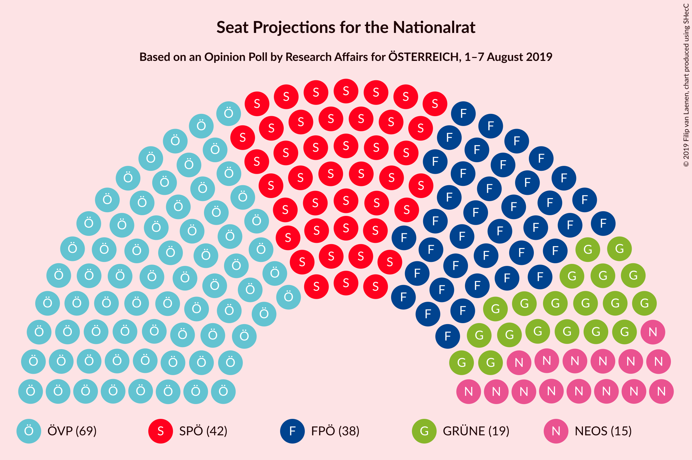
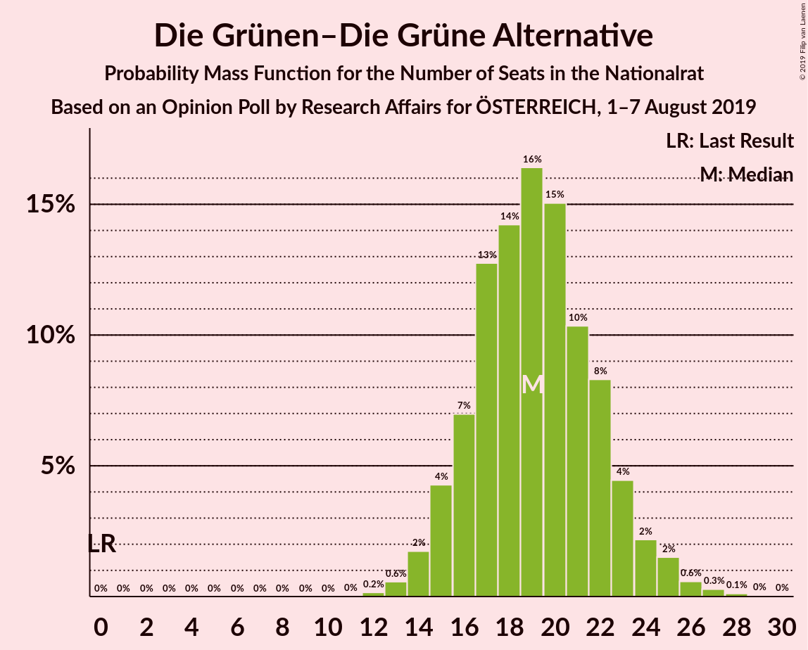
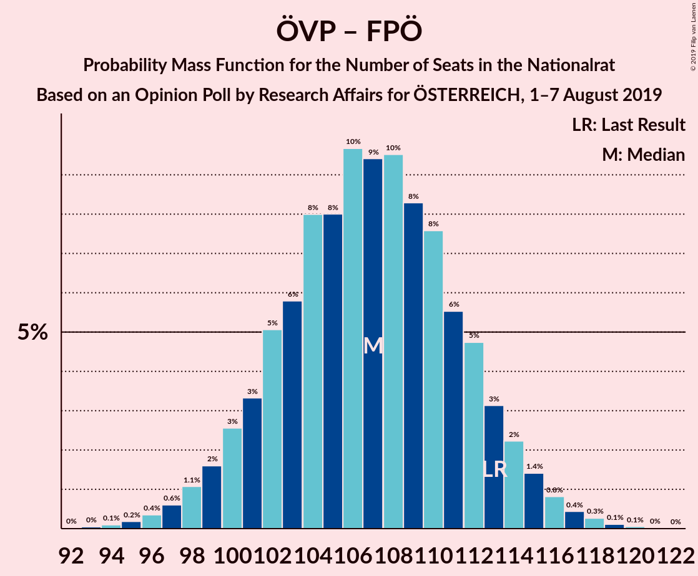
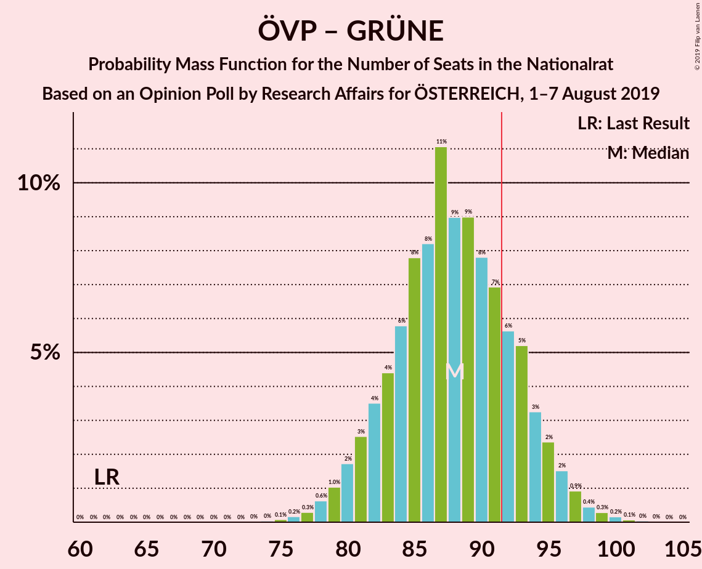
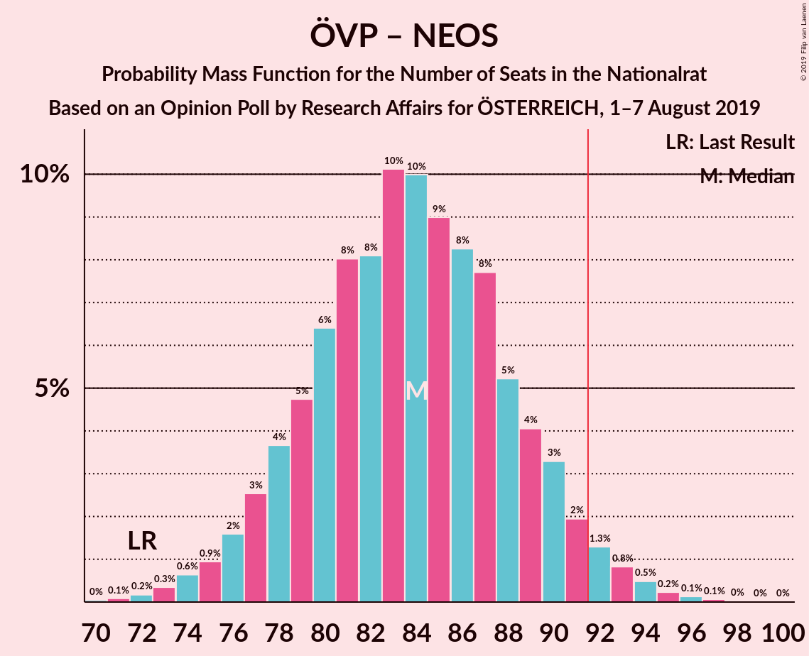
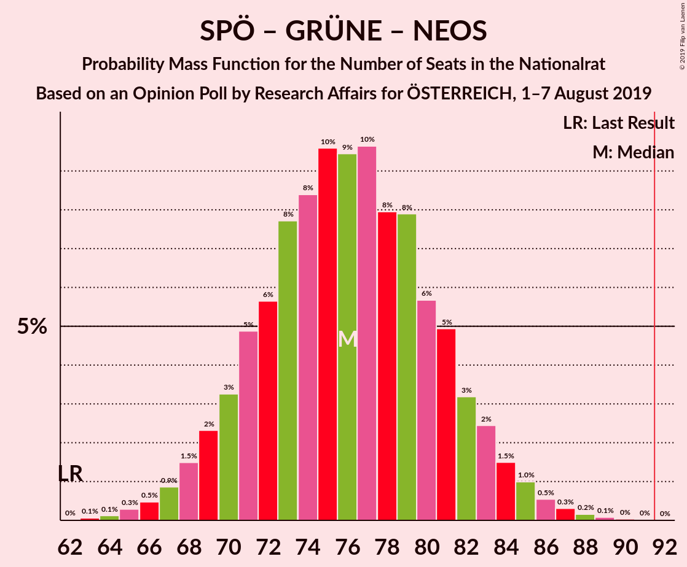

# Opinion Poll by Research Affairs for ÖSTERREICH, 1–7 August 2019

<a href="#voting-intentions">Voting Intentions</a> | <a href="#seats">Seats</a> | <a href="#coalitions">Coalitions</a> | <a href="#technical-information">Technical Information</a>

## Voting Intentions

### Confidence Intervals

| Party | Last Result | Poll Result | 80% Confidence Interval | 90% Confidence Interval | 95% Confidence Interval | 99% Confidence Interval |
|:-----:|:-----------:|:-----------:|:-----------------------:|:-----------------------:|:-----------------------:|:-----------------------:|
| Österreichische Volkspartei | 31.5% | 36.0% | 33.4–38.9% |32.6–39.6% |32.0–40.3% |30.7–41.7% |
| Sozialdemokratische Partei Österreichs | 26.9% | 22.0% | 19.8–24.5% |19.1–25.2% |18.6–25.8% |17.6–27.0% |
| Freiheitliche Partei Österreichs | 26.0% | 20.0% | 17.9–22.4% |17.3–23.1% |16.7–23.7% |15.8–24.9% |
| Die Grünen–Die Grüne Alternative | 3.8% | 10.1% | 8.6–12.0% |8.1–12.6% |7.8–13.0% |7.1–14.0% |
| NEOS–Das Neue Österreich und Liberales Forum | 5.3% | 7.9% | 6.6–9.7% |6.2–10.2% |5.9–10.6% |5.3–11.5% |
| JETZT–Liste Pilz | 4.4% | 2.0% | 1.4–3.0% |1.2–3.3% |1.1–3.6% |0.9–4.2% |

*Note:* The poll result column reflects the actual value used in the calculations. Published results may vary slightly, and in addition be rounded to fewer digits.

## Seats

### Confidence Intervals

| Party | Last Result | Median | 80% Confidence Interval | 90% Confidence Interval | 95% Confidence Interval | 99% Confidence Interval |
|:-----:|:-----------:|:------:|:-----------------------:|:-----------------------:|:-----------------------:|:-----------------------:|
| <a href="#österreichische-volkspartei">Österreichische Volkspartei</a> | 62 | 68 | 63–73 |61–75 |60–76 |58–79 |
| <a href="#sozialdemokratische-partei-österreichs">Sozialdemokratische Partei Österreichs</a> | 52 | 42 | 37–47 |37–48 |36–49 |33–52 |
| <a href="#freiheitliche-partei-österreichs">Freiheitliche Partei Österreichs</a> | 51 | 38 | 34–43 |33–44 |32–45 |30–47 |
| <a href="#die-grünen–die-grüne-alternative">Die Grünen–Die Grüne Alternative</a> | 0 | 21 | 15–23 |14–24 |14–25 |13–26 |
| <a href="#neos–das-neue-österreich-und-liberales-forum">NEOS–Das Neue Österreich und Liberales Forum</a> | 10 | 14 | 11–18 |11–20 |10–20 |9–22 |
| <a href="#jetzt–liste-pilz">JETZT–Liste Pilz</a> | 8 | 0 | 0 |0 |0 |0–7 |

### Österreichische Volkspartei

*For a full overview of the results for this party, see the [Österreichische Volkspartei](party-österreichischevolkspartei.html) page.*

| Number of Seats | Probability | Accumulated | Special Marks |
|:---------------:|:-----------:|:-----------:|:-------------:|
| 55 | 0% | 100% |  |
| 56 | 0.1% | 99.9% |  |
| 57 | 0.2% | 99.8% |  |
| 58 | 0.3% | 99.7% |  |
| 59 | 0.7% | 99.4% |  |
| 60 | 1.5% | 98.7% |  |
| 61 | 3% | 97% |  |
| 62 | 4% | 95% | Last Result |
| 63 | 4% | 91% |  |
| 64 | 6% | 87% |  |
| 65 | 6% | 81% |  |
| 66 | 9% | 74% |  |
| 67 | 12% | 65% |  |
| 68 | 10% | 54% | Median |
| 69 | 8% | 43% |  |
| 70 | 9% | 36% |  |
| 71 | 7% | 27% |  |
| 72 | 6% | 20% |  |
| 73 | 4% | 14% |  |
| 74 | 3% | 9% |  |
| 75 | 2% | 7% |  |
| 76 | 2% | 5% |  |
| 77 | 1.0% | 2% |  |
| 78 | 0.7% | 1.4% |  |
| 79 | 0.3% | 0.7% |  |
| 80 | 0.2% | 0.4% |  |
| 81 | 0.1% | 0.2% |  |
| 82 | 0.1% | 0.1% |  |
| 83 | 0% | 0.1% |  |
| 84 | 0% | 0% |  |

### Sozialdemokratische Partei Österreichs

*For a full overview of the results for this party, see the [Sozialdemokratische Partei Österreichs](party-sozialdemokratischeparteiösterreichs.html) page.*

| Number of Seats | Probability | Accumulated | Special Marks |
|:---------------:|:-----------:|:-----------:|:-------------:|
| 31 | 0.1% | 100% |  |
| 32 | 0.2% | 99.9% |  |
| 33 | 0.6% | 99.7% |  |
| 34 | 0.7% | 99.1% |  |
| 35 | 0.6% | 98% |  |
| 36 | 2% | 98% |  |
| 37 | 6% | 96% |  |
| 38 | 9% | 89% |  |
| 39 | 9% | 81% |  |
| 40 | 4% | 72% |  |
| 41 | 6% | 68% |  |
| 42 | 13% | 62% | Median |
| 43 | 18% | 48% |  |
| 44 | 12% | 30% |  |
| 45 | 4% | 19% |  |
| 46 | 2% | 14% |  |
| 47 | 4% | 12% |  |
| 48 | 5% | 9% |  |
| 49 | 2% | 4% |  |
| 50 | 0.6% | 1.3% |  |
| 51 | 0.2% | 0.7% |  |
| 52 | 0.2% | 0.5% | Last Result |
| 53 | 0.2% | 0.3% |  |
| 54 | 0.1% | 0.1% |  |
| 55 | 0% | 0% |  |

### Freiheitliche Partei Österreichs

*For a full overview of the results for this party, see the [Freiheitliche Partei Österreichs](party-freiheitlicheparteiösterreichs.html) page.*

| Number of Seats | Probability | Accumulated | Special Marks |
|:---------------:|:-----------:|:-----------:|:-------------:|
| 28 | 0.1% | 100% |  |
| 29 | 0.3% | 99.9% |  |
| 30 | 0.5% | 99.6% |  |
| 31 | 1.1% | 99.1% |  |
| 32 | 3% | 98% |  |
| 33 | 4% | 95% |  |
| 34 | 4% | 91% |  |
| 35 | 9% | 87% |  |
| 36 | 14% | 78% |  |
| 37 | 8% | 64% |  |
| 38 | 9% | 57% | Median |
| 39 | 15% | 48% |  |
| 40 | 12% | 33% |  |
| 41 | 4% | 21% |  |
| 42 | 5% | 17% |  |
| 43 | 6% | 12% |  |
| 44 | 3% | 6% |  |
| 45 | 0.7% | 3% |  |
| 46 | 0.7% | 2% |  |
| 47 | 0.9% | 1.3% |  |
| 48 | 0.2% | 0.4% |  |
| 49 | 0% | 0.1% |  |
| 50 | 0.1% | 0.1% |  |
| 51 | 0% | 0.1% | Last Result |
| 52 | 0% | 0% |  |

### Die Grünen–Die Grüne Alternative

*For a full overview of the results for this party, see the [Die Grünen–Die Grüne Alternative](party-diegrünen–diegrünealternative.html) page.*

| Number of Seats | Probability | Accumulated | Special Marks |
|:---------------:|:-----------:|:-----------:|:-------------:|
| 0 | 0% | 100% | Last Result |
| 1 | 0% | 100% |  |
| 2 | 0% | 100% |  |
| 3 | 0% | 100% |  |
| 4 | 0% | 100% |  |
| 5 | 0% | 100% |  |
| 6 | 0% | 100% |  |
| 7 | 0% | 100% |  |
| 8 | 0% | 100% |  |
| 9 | 0% | 100% |  |
| 10 | 0% | 100% |  |
| 11 | 0.1% | 100% |  |
| 12 | 0.3% | 99.9% |  |
| 13 | 1.5% | 99.6% |  |
| 14 | 3% | 98% |  |
| 15 | 6% | 95% |  |
| 16 | 5% | 89% |  |
| 17 | 5% | 84% |  |
| 18 | 4% | 79% |  |
| 19 | 6% | 76% |  |
| 20 | 12% | 70% |  |
| 21 | 20% | 58% | Median |
| 22 | 19% | 38% |  |
| 23 | 11% | 20% |  |
| 24 | 5% | 9% |  |
| 25 | 3% | 3% |  |
| 26 | 0.4% | 0.6% |  |
| 27 | 0.1% | 0.2% |  |
| 28 | 0% | 0% |  |

### NEOS–Das Neue Österreich und Liberales Forum

*For a full overview of the results for this party, see the [NEOS–Das Neue Österreich und Liberales Forum](party-neos–dasneueösterreichundliberalesforum.html) page.*

| Number of Seats | Probability | Accumulated | Special Marks |
|:---------------:|:-----------:|:-----------:|:-------------:|
| 8 | 0.1% | 100% |  |
| 9 | 0.6% | 99.9% |  |
| 10 | 2% | 99.3% | Last Result |
| 11 | 7% | 97% |  |
| 12 | 13% | 90% |  |
| 13 | 18% | 77% |  |
| 14 | 17% | 58% | Median |
| 15 | 12% | 41% |  |
| 16 | 8% | 29% |  |
| 17 | 6% | 22% |  |
| 18 | 6% | 16% |  |
| 19 | 4% | 10% |  |
| 20 | 3% | 6% |  |
| 21 | 1.4% | 2% |  |
| 22 | 0.8% | 1.1% |  |
| 23 | 0.2% | 0.3% |  |
| 24 | 0.1% | 0.1% |  |
| 25 | 0% | 0% |  |

### JETZT–Liste Pilz

*For a full overview of the results for this party, see the [JETZT–Liste Pilz](party-jetzt–listepilz.html) page.*

| Number of Seats | Probability | Accumulated | Special Marks |
|:---------------:|:-----------:|:-----------:|:-------------:|
| 0 | 99.2% | 100% | Median |
| 1 | 0% | 0.8% |  |
| 2 | 0% | 0.8% |  |
| 3 | 0% | 0.8% |  |
| 4 | 0% | 0.8% |  |
| 5 | 0% | 0.8% |  |
| 6 | 0% | 0.8% |  |
| 7 | 0.4% | 0.8% |  |
| 8 | 0.3% | 0.4% | Last Result |
| 9 | 0.1% | 0.1% |  |
| 10 | 0% | 0% |  |

## Coalitions

### Confidence Intervals

| Coalition | Last Result | Median | Majority? | 80% Confidence Interval | 90% Confidence Interval | 95% Confidence Interval | 99% Confidence Interval |
|:---------:|:-----------:|:------:|:---------:|:-----------------------:|:-----------------------:|:-----------------------:|:-----------------------:|
| Österreichische Volkspartei – Sozialdemokratische Partei Österreichs | 114 | 110 | 100% | 105–115 | 103–117 | 102–118 | 99–121 |
| Österreichische Volkspartei – Freiheitliche Partei Österreichs | 113 | 106 | 100% | 101–111 | 100–113 | 98–114 | 96–117 |
| Österreichische Volkspartei – Die Grünen–Die Grüne Alternative – NEOS–Das Neue Österreich und Liberales Forum | 72 | 103 | 99.6% | 98–108 | 95–110 | 94–111 | 92–114 |
| Österreichische Volkspartei – Die Grünen–Die Grüne Alternative | 62 | 88 | 22% | 83–94 | 81–95 | 80–97 | 77–99 |
| Österreichische Volkspartei – NEOS–Das Neue Österreich und Liberales Forum | 72 | 82 | 6% | 77–90 | 76–92 | 75–93 | 73–95 |
| Sozialdemokratische Partei Österreichs – Freiheitliche Partei Österreichs | 103 | 80 | 0.3% | 75–85 | 73–87 | 72–89 | 69–91 |
| Sozialdemokratische Partei Österreichs – Die Grünen–Die Grüne Alternative – NEOS–Das Neue Österreich und Liberales Forum | 62 | 77 | 0% | 72–82 | 70–83 | 68–85 | 66–87 |
| Österreichische Volkspartei | 62 | 68 | 0% | 63–73 | 61–75 | 60–76 | 58–79 |
| Sozialdemokratische Partei Österreichs – Die Grünen–Die Grüne Alternative | 52 | 63 | 0% | 56–68 | 54–69 | 53–70 | 50–72 |
| Sozialdemokratische Partei Österreichs | 52 | 42 | 0% | 37–47 | 37–48 | 36–49 | 33–52 |

### Österreichische Volkspartei – Sozialdemokratische Partei Österreichs

| Number of Seats | Probability | Accumulated | Special Marks |
|:---------------:|:-----------:|:-----------:|:-------------:|
| 96 | 0% | 100% |  |
| 97 | 0.1% | 99.9% |  |
| 98 | 0.2% | 99.9% |  |
| 99 | 0.2% | 99.7% |  |
| 100 | 0.5% | 99.4% |  |
| 101 | 0.8% | 99.0% |  |
| 102 | 1.5% | 98% |  |
| 103 | 3% | 97% |  |
| 104 | 3% | 94% |  |
| 105 | 4% | 91% |  |
| 106 | 7% | 87% |  |
| 107 | 7% | 80% |  |
| 108 | 9% | 74% |  |
| 109 | 7% | 64% |  |
| 110 | 11% | 58% | Median |
| 111 | 12% | 47% |  |
| 112 | 8% | 35% |  |
| 113 | 7% | 27% |  |
| 114 | 6% | 20% | Last Result |
| 115 | 5% | 14% |  |
| 116 | 3% | 9% |  |
| 117 | 3% | 6% |  |
| 118 | 1.4% | 3% |  |
| 119 | 0.9% | 2% |  |
| 120 | 0.5% | 1.0% |  |
| 121 | 0.2% | 0.5% |  |
| 122 | 0.2% | 0.3% |  |
| 123 | 0.1% | 0.1% |  |
| 124 | 0% | 0.1% |  |
| 125 | 0% | 0% |  |

### Österreichische Volkspartei – Freiheitliche Partei Österreichs

| Number of Seats | Probability | Accumulated | Special Marks |
|:---------------:|:-----------:|:-----------:|:-------------:|
| 92 | 0% | 100% | Majority |
| 93 | 0.1% | 99.9% |  |
| 94 | 0.1% | 99.9% |  |
| 95 | 0.3% | 99.8% |  |
| 96 | 0.6% | 99.5% |  |
| 97 | 0.8% | 99.0% |  |
| 98 | 1.2% | 98% |  |
| 99 | 2% | 97% |  |
| 100 | 4% | 95% |  |
| 101 | 4% | 92% |  |
| 102 | 7% | 88% |  |
| 103 | 7% | 81% |  |
| 104 | 8% | 74% |  |
| 105 | 7% | 66% |  |
| 106 | 13% | 59% | Median |
| 107 | 10% | 46% |  |
| 108 | 8% | 36% |  |
| 109 | 7% | 29% |  |
| 110 | 7% | 21% |  |
| 111 | 5% | 14% |  |
| 112 | 3% | 9% |  |
| 113 | 2% | 6% | Last Result |
| 114 | 2% | 4% |  |
| 115 | 1.0% | 2% |  |
| 116 | 0.6% | 1.3% |  |
| 117 | 0.4% | 0.7% |  |
| 118 | 0.2% | 0.4% |  |
| 119 | 0.1% | 0.2% |  |
| 120 | 0% | 0.1% |  |
| 121 | 0% | 0% |  |

### Österreichische Volkspartei – Die Grünen–Die Grüne Alternative – NEOS–Das Neue Österreich und Liberales Forum

| Number of Seats | Probability | Accumulated | Special Marks |
|:---------------:|:-----------:|:-----------:|:-------------:|
| 72 | 0% | 100% | Last Result |
| 73 | 0% | 100% |  |
| 74 | 0% | 100% |  |
| 75 | 0% | 100% |  |
| 76 | 0% | 100% |  |
| 77 | 0% | 100% |  |
| 78 | 0% | 100% |  |
| 79 | 0% | 100% |  |
| 80 | 0% | 100% |  |
| 81 | 0% | 100% |  |
| 82 | 0% | 100% |  |
| 83 | 0% | 100% |  |
| 84 | 0% | 100% |  |
| 85 | 0% | 100% |  |
| 86 | 0% | 100% |  |
| 87 | 0% | 100% |  |
| 88 | 0% | 100% |  |
| 89 | 0.1% | 99.9% |  |
| 90 | 0.1% | 99.9% |  |
| 91 | 0.1% | 99.8% |  |
| 92 | 0.5% | 99.6% | Majority |
| 93 | 0.9% | 99.1% |  |
| 94 | 2% | 98% |  |
| 95 | 2% | 97% |  |
| 96 | 2% | 95% |  |
| 97 | 3% | 93% |  |
| 98 | 4% | 90% |  |
| 99 | 10% | 86% |  |
| 100 | 8% | 77% |  |
| 101 | 10% | 69% |  |
| 102 | 9% | 59% |  |
| 103 | 6% | 50% | Median |
| 104 | 10% | 45% |  |
| 105 | 7% | 34% |  |
| 106 | 7% | 28% |  |
| 107 | 7% | 20% |  |
| 108 | 4% | 13% |  |
| 109 | 4% | 9% |  |
| 110 | 2% | 5% |  |
| 111 | 1.2% | 3% |  |
| 112 | 1.0% | 2% |  |
| 113 | 0.5% | 1.0% |  |
| 114 | 0.2% | 0.5% |  |
| 115 | 0.2% | 0.3% |  |
| 116 | 0.1% | 0.1% |  |
| 117 | 0% | 0% |  |

### Österreichische Volkspartei – Die Grünen–Die Grüne Alternative

| Number of Seats | Probability | Accumulated | Special Marks |
|:---------------:|:-----------:|:-----------:|:-------------:|
| 62 | 0% | 100% | Last Result |
| 63 | 0% | 100% |  |
| 64 | 0% | 100% |  |
| 65 | 0% | 100% |  |
| 66 | 0% | 100% |  |
| 67 | 0% | 100% |  |
| 68 | 0% | 100% |  |
| 69 | 0% | 100% |  |
| 70 | 0% | 100% |  |
| 71 | 0% | 100% |  |
| 72 | 0% | 100% |  |
| 73 | 0% | 100% |  |
| 74 | 0% | 100% |  |
| 75 | 0.1% | 99.9% |  |
| 76 | 0.1% | 99.9% |  |
| 77 | 0.3% | 99.7% |  |
| 78 | 0.6% | 99.5% |  |
| 79 | 0.8% | 98.9% |  |
| 80 | 1.4% | 98% |  |
| 81 | 2% | 97% |  |
| 82 | 3% | 95% |  |
| 83 | 4% | 91% |  |
| 84 | 5% | 87% |  |
| 85 | 8% | 82% |  |
| 86 | 7% | 74% |  |
| 87 | 10% | 67% |  |
| 88 | 9% | 57% |  |
| 89 | 9% | 47% | Median |
| 90 | 9% | 38% |  |
| 91 | 7% | 29% |  |
| 92 | 6% | 22% | Majority |
| 93 | 6% | 17% |  |
| 94 | 4% | 11% |  |
| 95 | 3% | 7% |  |
| 96 | 1.1% | 4% |  |
| 97 | 1.2% | 3% |  |
| 98 | 0.6% | 1.4% |  |
| 99 | 0.3% | 0.7% |  |
| 100 | 0.2% | 0.4% |  |
| 101 | 0.1% | 0.2% |  |
| 102 | 0% | 0.1% |  |
| 103 | 0% | 0% |  |

### Österreichische Volkspartei – NEOS–Das Neue Österreich und Liberales Forum

| Number of Seats | Probability | Accumulated | Special Marks |
|:---------------:|:-----------:|:-----------:|:-------------:|
| 70 | 0% | 100% |  |
| 71 | 0.1% | 99.9% |  |
| 72 | 0.2% | 99.8% | Last Result |
| 73 | 0.6% | 99.7% |  |
| 74 | 1.4% | 99.1% |  |
| 75 | 2% | 98% |  |
| 76 | 3% | 96% |  |
| 77 | 6% | 93% |  |
| 78 | 8% | 87% |  |
| 79 | 8% | 80% |  |
| 80 | 11% | 72% |  |
| 81 | 9% | 61% |  |
| 82 | 7% | 51% | Median |
| 83 | 7% | 44% |  |
| 84 | 7% | 37% |  |
| 85 | 5% | 30% |  |
| 86 | 3% | 24% |  |
| 87 | 4% | 21% |  |
| 88 | 4% | 17% |  |
| 89 | 3% | 14% |  |
| 90 | 2% | 10% |  |
| 91 | 2% | 8% |  |
| 92 | 2% | 6% | Majority |
| 93 | 1.3% | 4% |  |
| 94 | 1.2% | 2% |  |
| 95 | 0.6% | 1.1% |  |
| 96 | 0.2% | 0.5% |  |
| 97 | 0.1% | 0.2% |  |
| 98 | 0.1% | 0.1% |  |
| 99 | 0% | 0% |  |

### Sozialdemokratische Partei Österreichs – Freiheitliche Partei Österreichs

| Number of Seats | Probability | Accumulated | Special Marks |
|:---------------:|:-----------:|:-----------:|:-------------:|
| 66 | 0% | 100% |  |
| 67 | 0.1% | 99.9% |  |
| 68 | 0.2% | 99.9% |  |
| 69 | 0.2% | 99.6% |  |
| 70 | 0.5% | 99.4% |  |
| 71 | 1.1% | 98.9% |  |
| 72 | 1.3% | 98% |  |
| 73 | 2% | 97% |  |
| 74 | 4% | 94% |  |
| 75 | 4% | 91% |  |
| 76 | 8% | 87% |  |
| 77 | 8% | 79% |  |
| 78 | 7% | 72% |  |
| 79 | 10% | 65% |  |
| 80 | 6% | 55% | Median |
| 81 | 9% | 49% |  |
| 82 | 10% | 40% |  |
| 83 | 7% | 30% |  |
| 84 | 10% | 22% |  |
| 85 | 3% | 13% |  |
| 86 | 3% | 9% |  |
| 87 | 2% | 6% |  |
| 88 | 2% | 5% |  |
| 89 | 1.5% | 3% |  |
| 90 | 0.8% | 2% |  |
| 91 | 0.5% | 0.8% |  |
| 92 | 0.1% | 0.3% | Majority |
| 93 | 0.1% | 0.2% |  |
| 94 | 0% | 0.1% |  |
| 95 | 0% | 0.1% |  |
| 96 | 0% | 0% |  |
| 97 | 0% | 0% |  |
| 98 | 0% | 0% |  |
| 99 | 0% | 0% |  |
| 100 | 0% | 0% |  |
| 101 | 0% | 0% |  |
| 102 | 0% | 0% |  |
| 103 | 0% | 0% | Last Result |

### Sozialdemokratische Partei Österreichs – Die Grünen–Die Grüne Alternative – NEOS–Das Neue Österreich und Liberales Forum

| Number of Seats | Probability | Accumulated | Special Marks |
|:---------------:|:-----------:|:-----------:|:-------------:|
| 62 | 0% | 100% | Last Result |
| 63 | 0% | 100% |  |
| 64 | 0.1% | 99.9% |  |
| 65 | 0.2% | 99.8% |  |
| 66 | 0.4% | 99.6% |  |
| 67 | 0.6% | 99.2% |  |
| 68 | 1.1% | 98.6% |  |
| 69 | 2% | 97% |  |
| 70 | 2% | 96% |  |
| 71 | 3% | 93% |  |
| 72 | 5% | 90% |  |
| 73 | 7% | 85% |  |
| 74 | 8% | 78% |  |
| 75 | 8% | 70% |  |
| 76 | 10% | 63% |  |
| 77 | 13% | 53% | Median |
| 78 | 7% | 40% |  |
| 79 | 8% | 33% |  |
| 80 | 7% | 25% |  |
| 81 | 7% | 18% |  |
| 82 | 3% | 11% |  |
| 83 | 3% | 8% |  |
| 84 | 2% | 4% |  |
| 85 | 1.1% | 3% |  |
| 86 | 0.8% | 2% |  |
| 87 | 0.5% | 0.9% |  |
| 88 | 0.2% | 0.4% |  |
| 89 | 0.1% | 0.2% |  |
| 90 | 0.1% | 0.1% |  |
| 91 | 0% | 0% |  |

### Österreichische Volkspartei

| Number of Seats | Probability | Accumulated | Special Marks |
|:---------------:|:-----------:|:-----------:|:-------------:|
| 55 | 0% | 100% |  |
| 56 | 0.1% | 99.9% |  |
| 57 | 0.2% | 99.8% |  |
| 58 | 0.3% | 99.7% |  |
| 59 | 0.7% | 99.4% |  |
| 60 | 1.5% | 98.7% |  |
| 61 | 3% | 97% |  |
| 62 | 4% | 95% | Last Result |
| 63 | 4% | 91% |  |
| 64 | 6% | 87% |  |
| 65 | 6% | 81% |  |
| 66 | 9% | 74% |  |
| 67 | 12% | 65% |  |
| 68 | 10% | 54% | Median |
| 69 | 8% | 43% |  |
| 70 | 9% | 36% |  |
| 71 | 7% | 27% |  |
| 72 | 6% | 20% |  |
| 73 | 4% | 14% |  |
| 74 | 3% | 9% |  |
| 75 | 2% | 7% |  |
| 76 | 2% | 5% |  |
| 77 | 1.0% | 2% |  |
| 78 | 0.7% | 1.4% |  |
| 79 | 0.3% | 0.7% |  |
| 80 | 0.2% | 0.4% |  |
| 81 | 0.1% | 0.2% |  |
| 82 | 0.1% | 0.1% |  |
| 83 | 0% | 0.1% |  |
| 84 | 0% | 0% |  |

### Sozialdemokratische Partei Österreichs – Die Grünen–Die Grüne Alternative

| Number of Seats | Probability | Accumulated | Special Marks |
|:---------------:|:-----------:|:-----------:|:-------------:|
| 48 | 0.1% | 100% |  |
| 49 | 0.2% | 99.9% |  |
| 50 | 0.3% | 99.7% |  |
| 51 | 0.5% | 99.4% |  |
| 52 | 1.2% | 98.9% | Last Result |
| 53 | 2% | 98% |  |
| 54 | 2% | 96% |  |
| 55 | 2% | 94% |  |
| 56 | 3% | 91% |  |
| 57 | 4% | 88% |  |
| 58 | 5% | 84% |  |
| 59 | 5% | 79% |  |
| 60 | 7% | 75% |  |
| 61 | 8% | 67% |  |
| 62 | 6% | 59% |  |
| 63 | 7% | 54% | Median |
| 64 | 15% | 47% |  |
| 65 | 11% | 32% |  |
| 66 | 7% | 21% |  |
| 67 | 3% | 14% |  |
| 68 | 5% | 11% |  |
| 69 | 3% | 6% |  |
| 70 | 2% | 3% |  |
| 71 | 0.7% | 1.2% |  |
| 72 | 0.3% | 0.6% |  |
| 73 | 0.1% | 0.3% |  |
| 74 | 0.1% | 0.1% |  |
| 75 | 0% | 0% |  |

### Sozialdemokratische Partei Österreichs

| Number of Seats | Probability | Accumulated | Special Marks |
|:---------------:|:-----------:|:-----------:|:-------------:|
| 31 | 0.1% | 100% |  |
| 32 | 0.2% | 99.9% |  |
| 33 | 0.6% | 99.7% |  |
| 34 | 0.7% | 99.1% |  |
| 35 | 0.6% | 98% |  |
| 36 | 2% | 98% |  |
| 37 | 6% | 96% |  |
| 38 | 9% | 89% |  |
| 39 | 9% | 81% |  |
| 40 | 4% | 72% |  |
| 41 | 6% | 68% |  |
| 42 | 13% | 62% | Median |
| 43 | 18% | 48% |  |
| 44 | 12% | 30% |  |
| 45 | 4% | 19% |  |
| 46 | 2% | 14% |  |
| 47 | 4% | 12% |  |
| 48 | 5% | 9% |  |
| 49 | 2% | 4% |  |
| 50 | 0.6% | 1.3% |  |
| 51 | 0.2% | 0.7% |  |
| 52 | 0.2% | 0.5% | Last Result |
| 53 | 0.2% | 0.3% |  |
| 54 | 0.1% | 0.1% |  |
| 55 | 0% | 0% |  |

## Technical Information

### Opinion Poll

+ **Polling firm:** Research Affairs
+ **Commissioner(s):** ÖSTERREICH
+ **Fieldwork period:** 1–7 August 2019

### Calculations

+ **Sample size:** 505
+ **Simulations done:** 131,072
+ **Error estimate:** 0.76%

