# Opinion Poll by Kowarcz Marktforschung, 26 July–9 August 2019

<a href="#voting-intentions">Voting Intentions</a> | <a href="#seats">Seats</a> | <a href="#coalitions">Coalitions</a> | <a href="#technical-information">Technical Information</a>

## Voting Intentions

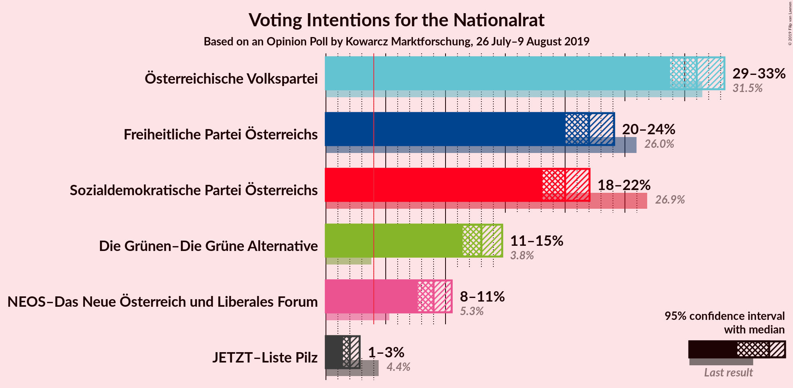

### Confidence Intervals

| Party | Last Result | Poll Result | 80% Confidence Interval | 90% Confidence Interval | 95% Confidence Interval | 99% Confidence Interval |
|:-----:|:-----------:|:-----------:|:-----------------------:|:-----------------------:|:-----------------------:|:-----------------------:|
| Österreichische Volkspartei | 31.5% | 31.0% | 29.5–32.5% |29.1–33.0% |28.8–33.3% |28.1–34.0% |
| Freiheitliche Partei Österreichs | 26.0% | 22.0% | 20.7–23.4% |20.3–23.8% |20.0–24.1% |19.4–24.8% |
| Sozialdemokratische Partei Österreichs | 26.9% | 20.0% | 18.8–21.3% |18.4–21.7% |18.1–22.0% |17.5–22.7% |
| Die Grünen–Die Grüne Alternative | 3.8% | 13.0% | 12.0–14.1% |11.7–14.5% |11.4–14.7% |11.0–15.3% |
| NEOS–Das Neue Österreich und Liberales Forum | 5.3% | 9.0% | 8.1–10.0% |7.9–10.3% |7.7–10.5% |7.3–11.0% |
| JETZT–Liste Pilz | 4.4% | 2.0% | 1.6–2.5% |1.5–2.7% |1.4–2.8% |1.2–3.1% |

*Note:* The poll result column reflects the actual value used in the calculations. Published results may vary slightly, and in addition be rounded to fewer digits.

## Seats

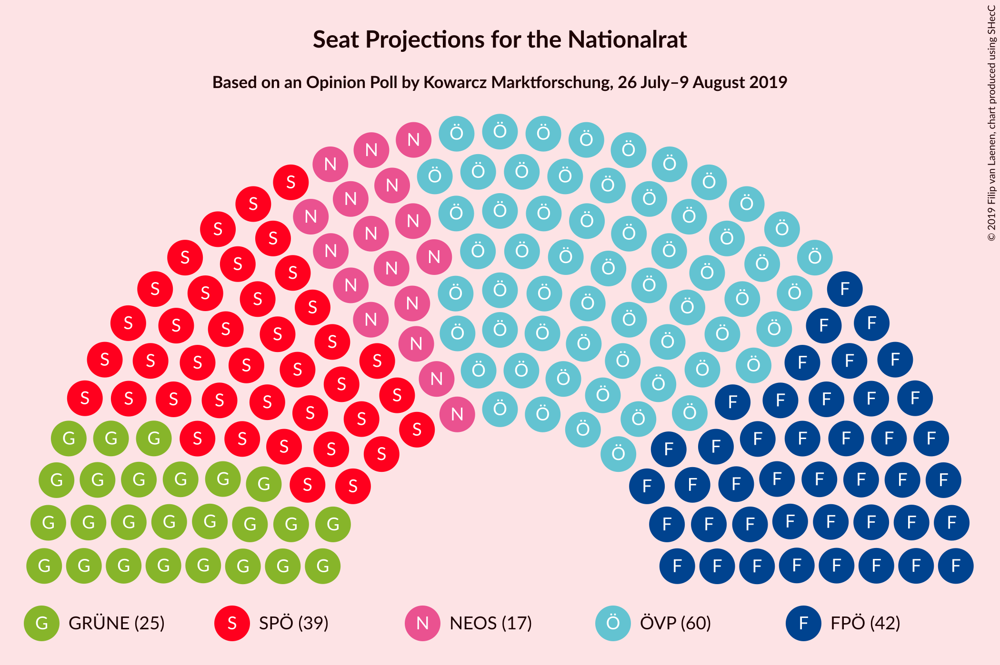

### Confidence Intervals

| Party | Last Result | Median | 80% Confidence Interval | 90% Confidence Interval | 95% Confidence Interval | 99% Confidence Interval |
|:-----:|:-----------:|:------:|:-----------------------:|:-----------------------:|:-----------------------:|:-----------------------:|
| <a href="#österreichische-volkspartei">Österreichische Volkspartei</a> | 62 | 60 | 57–63 |56–64 |56–64 |54–65 |
| <a href="#freiheitliche-partei-österreichs">Freiheitliche Partei Österreichs</a> | 51 | 42 | 40–45 |39–46 |39–46 |37–48 |
| <a href="#sozialdemokratische-partei-österreichs">Sozialdemokratische Partei Österreichs</a> | 52 | 39 | 36–41 |35–42 |35–42 |34–44 |
| <a href="#die-grünen–die-grüne-alternative">Die Grünen–Die Grüne Alternative</a> | 0 | 25 | 23–27 |22–28 |22–28 |21–29 |
| <a href="#neos–das-neue-österreich-und-liberales-forum">NEOS–Das Neue Österreich und Liberales Forum</a> | 10 | 17 | 15–19 |15–19 |15–20 |14–21 |
| <a href="#jetzt–liste-pilz">JETZT–Liste Pilz</a> | 8 | 0 | 0 |0 |0 |0 |

### Österreichische Volkspartei

*For a full overview of the results for this party, see the [Österreichische Volkspartei](party-österreichischevolkspartei.html) page.*

| Number of Seats | Probability | Accumulated | Special Marks |
|:---------------:|:-----------:|:-----------:|:-------------:|
| 52 | 0% | 100% |  |
| 53 | 0.2% | 99.9% |  |
| 54 | 0.4% | 99.8% |  |
| 55 | 1.3% | 99.3% |  |
| 56 | 6% | 98% |  |
| 57 | 12% | 92% |  |
| 58 | 7% | 80% |  |
| 59 | 11% | 73% |  |
| 60 | 24% | 62% | Median |
| 61 | 22% | 38% |  |
| 62 | 4% | 15% | Last Result |
| 63 | 4% | 11% |  |
| 64 | 5% | 7% |  |
| 65 | 2% | 2% |  |
| 66 | 0.2% | 0.3% |  |
| 67 | 0.1% | 0.2% |  |
| 68 | 0% | 0.1% |  |
| 69 | 0% | 0% |  |

### Freiheitliche Partei Österreichs

*For a full overview of the results for this party, see the [Freiheitliche Partei Österreichs](party-freiheitlicheparteiösterreichs.html) page.*

| Number of Seats | Probability | Accumulated | Special Marks |
|:---------------:|:-----------:|:-----------:|:-------------:|
| 36 | 0.1% | 100% |  |
| 37 | 0.5% | 99.9% |  |
| 38 | 2% | 99.4% |  |
| 39 | 5% | 98% |  |
| 40 | 10% | 93% |  |
| 41 | 19% | 83% |  |
| 42 | 18% | 64% | Median |
| 43 | 15% | 46% |  |
| 44 | 16% | 30% |  |
| 45 | 8% | 14% |  |
| 46 | 4% | 6% |  |
| 47 | 1.3% | 2% |  |
| 48 | 0.5% | 0.6% |  |
| 49 | 0.1% | 0.2% |  |
| 50 | 0% | 0% |  |
| 51 | 0% | 0% | Last Result |

### Sozialdemokratische Partei Österreichs

*For a full overview of the results for this party, see the [Sozialdemokratische Partei Österreichs](party-sozialdemokratischeparteiösterreichs.html) page.*

| Number of Seats | Probability | Accumulated | Special Marks |
|:---------------:|:-----------:|:-----------:|:-------------:|
| 32 | 0.1% | 100% |  |
| 33 | 0.4% | 99.9% |  |
| 34 | 2% | 99.5% |  |
| 35 | 4% | 98% |  |
| 36 | 8% | 94% |  |
| 37 | 12% | 86% |  |
| 38 | 19% | 74% |  |
| 39 | 23% | 55% | Median |
| 40 | 19% | 32% |  |
| 41 | 8% | 13% |  |
| 42 | 3% | 5% |  |
| 43 | 2% | 2% |  |
| 44 | 0.5% | 0.7% |  |
| 45 | 0.2% | 0.2% |  |
| 46 | 0% | 0% |  |
| 47 | 0% | 0% |  |
| 48 | 0% | 0% |  |
| 49 | 0% | 0% |  |
| 50 | 0% | 0% |  |
| 51 | 0% | 0% |  |
| 52 | 0% | 0% | Last Result |

### Die Grünen–Die Grüne Alternative

*For a full overview of the results for this party, see the [Die Grünen–Die Grüne Alternative](party-diegrünen–diegrünealternative.html) page.*

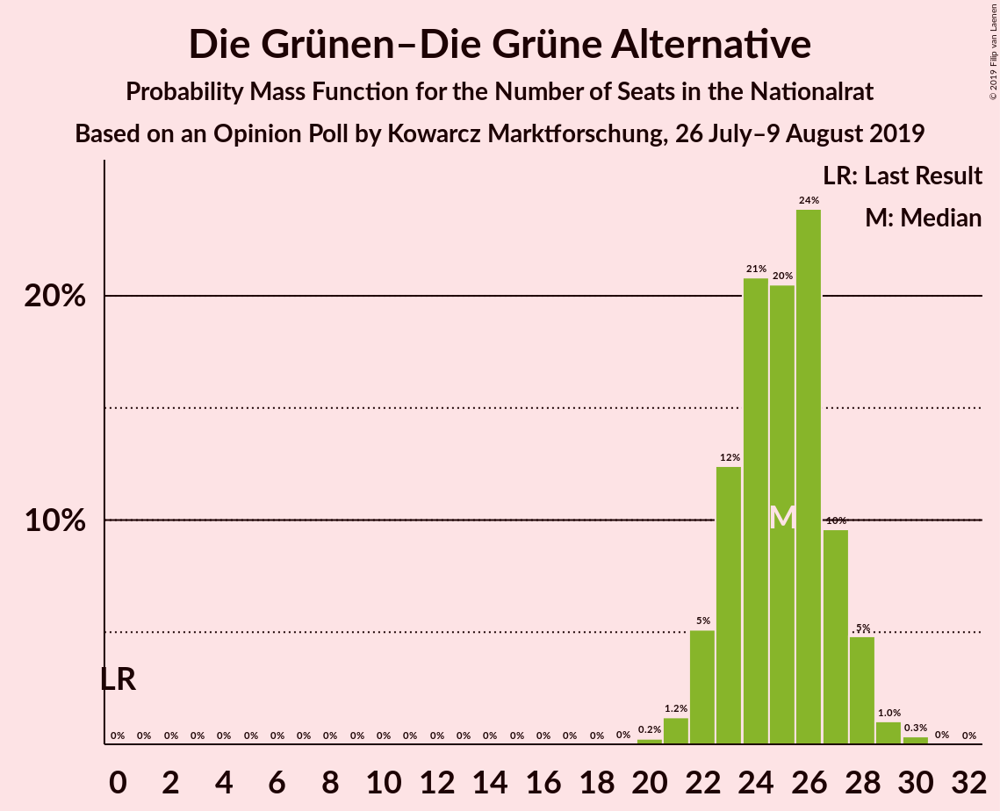

| Number of Seats | Probability | Accumulated | Special Marks |
|:---------------:|:-----------:|:-----------:|:-------------:|
| 0 | 0% | 100% | Last Result |
| 1 | 0% | 100% |  |
| 2 | 0% | 100% |  |
| 3 | 0% | 100% |  |
| 4 | 0% | 100% |  |
| 5 | 0% | 100% |  |
| 6 | 0% | 100% |  |
| 7 | 0% | 100% |  |
| 8 | 0% | 100% |  |
| 9 | 0% | 100% |  |
| 10 | 0% | 100% |  |
| 11 | 0% | 100% |  |
| 12 | 0% | 100% |  |
| 13 | 0% | 100% |  |
| 14 | 0% | 100% |  |
| 15 | 0% | 100% |  |
| 16 | 0% | 100% |  |
| 17 | 0% | 100% |  |
| 18 | 0% | 100% |  |
| 19 | 0% | 100% |  |
| 20 | 0.2% | 100% |  |
| 21 | 1.2% | 99.7% |  |
| 22 | 5% | 98.5% |  |
| 23 | 12% | 93% |  |
| 24 | 21% | 81% |  |
| 25 | 20% | 60% | Median |
| 26 | 24% | 40% |  |
| 27 | 10% | 16% |  |
| 28 | 5% | 6% |  |
| 29 | 1.0% | 1.4% |  |
| 30 | 0.3% | 0.4% |  |
| 31 | 0% | 0.1% |  |
| 32 | 0% | 0% |  |

### NEOS–Das Neue Österreich und Liberales Forum

*For a full overview of the results for this party, see the [NEOS–Das Neue Österreich und Liberales Forum](party-neos–dasneueösterreichundliberalesforum.html) page.*

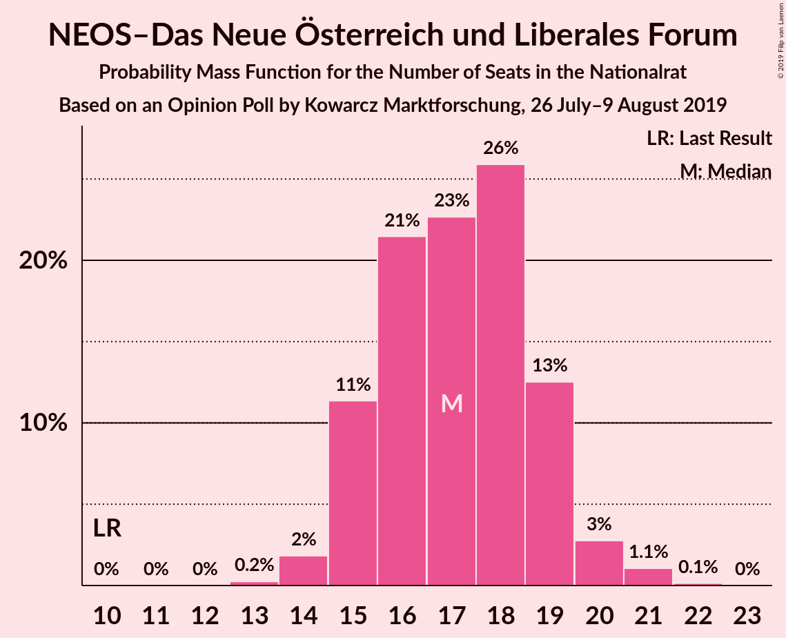

| Number of Seats | Probability | Accumulated | Special Marks |
|:---------------:|:-----------:|:-----------:|:-------------:|
| 10 | 0% | 100% | Last Result |
| 11 | 0% | 100% |  |
| 12 | 0% | 100% |  |
| 13 | 0.2% | 100% |  |
| 14 | 2% | 99.7% |  |
| 15 | 11% | 98% |  |
| 16 | 21% | 87% |  |
| 17 | 23% | 65% | Median |
| 18 | 26% | 42% |  |
| 19 | 13% | 16% |  |
| 20 | 3% | 4% |  |
| 21 | 1.1% | 1.2% |  |
| 22 | 0.1% | 0.2% |  |
| 23 | 0% | 0% |  |

### JETZT–Liste Pilz

*For a full overview of the results for this party, see the [JETZT–Liste Pilz](party-jetzt–listepilz.html) page.*

| Number of Seats | Probability | Accumulated | Special Marks |
|:---------------:|:-----------:|:-----------:|:-------------:|
| 0 | 100% | 100% | Median |
| 1 | 0% | 0% |  |
| 2 | 0% | 0% |  |
| 3 | 0% | 0% |  |
| 4 | 0% | 0% |  |
| 5 | 0% | 0% |  |
| 6 | 0% | 0% |  |
| 7 | 0% | 0% |  |
| 8 | 0% | 0% | Last Result |

## Coalitions

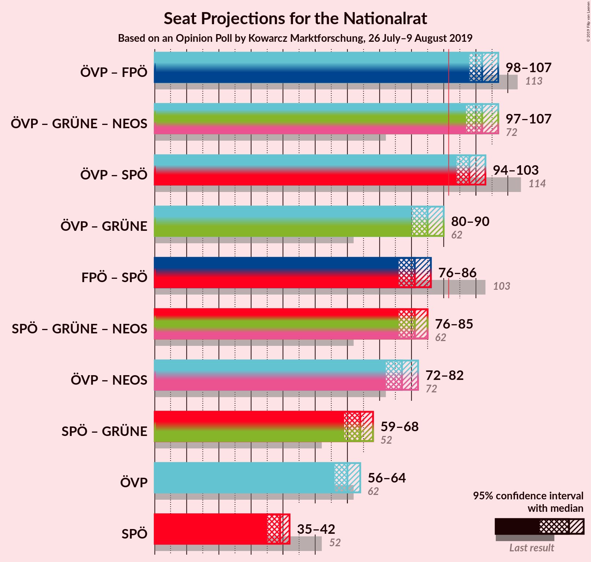

### Confidence Intervals

| Coalition | Last Result | Median | Majority? | 80% Confidence Interval | 90% Confidence Interval | 95% Confidence Interval | 99% Confidence Interval |
|:---------:|:-----------:|:------:|:---------:|:-----------------------:|:-----------------------:|:-----------------------:|:-----------------------:|
| Österreichische Volkspartei – Freiheitliche Partei Österreichs | 113 | 102 | 100% | 99–105 | 98–107 | 98–107 | 96–108 |
| Österreichische Volkspartei – Die Grünen–Die Grüne Alternative – NEOS–Das Neue Österreich und Liberales Forum | 72 | 102 | 100% | 99–105 | 98–106 | 97–107 | 95–108 |
| Österreichische Volkspartei – Sozialdemokratische Partei Österreichs | 114 | 98 | 99.7% | 95–101 | 95–102 | 94–103 | 92–105 |
| Österreichische Volkspartei – Die Grünen–Die Grüne Alternative | 62 | 85 | 0.3% | 81–88 | 81–89 | 80–90 | 78–91 |
| Freiheitliche Partei Österreichs – Sozialdemokratische Partei Österreichs | 103 | 81 | 0% | 78–84 | 77–85 | 76–86 | 75–87 |
| Sozialdemokratische Partei Österreichs – Die Grünen–Die Grüne Alternative – NEOS–Das Neue Österreich und Liberales Forum | 62 | 81 | 0% | 77–83 | 76–84 | 76–85 | 74–87 |
| Österreichische Volkspartei – NEOS–Das Neue Österreich und Liberales Forum | 72 | 77 | 0% | 74–80 | 73–81 | 72–82 | 71–83 |
| Sozialdemokratische Partei Österreichs – Die Grünen–Die Grüne Alternative | 52 | 64 | 0% | 61–66 | 60–67 | 59–68 | 57–69 |
| Österreichische Volkspartei | 62 | 60 | 0% | 57–63 | 56–64 | 56–64 | 54–65 |
| Sozialdemokratische Partei Österreichs | 52 | 39 | 0% | 36–41 | 35–42 | 35–42 | 34–44 |

### Österreichische Volkspartei – Freiheitliche Partei Österreichs

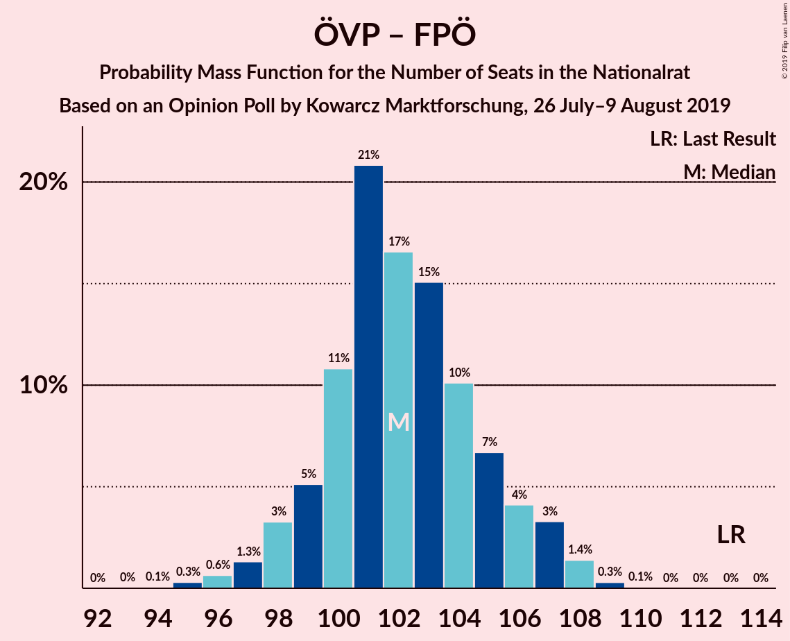

| Number of Seats | Probability | Accumulated | Special Marks |
|:---------------:|:-----------:|:-----------:|:-------------:|
| 94 | 0.1% | 100% |  |
| 95 | 0.3% | 99.9% |  |
| 96 | 0.6% | 99.6% |  |
| 97 | 1.3% | 99.0% |  |
| 98 | 3% | 98% |  |
| 99 | 5% | 94% |  |
| 100 | 11% | 89% |  |
| 101 | 21% | 78% |  |
| 102 | 17% | 58% | Median |
| 103 | 15% | 41% |  |
| 104 | 10% | 26% |  |
| 105 | 7% | 16% |  |
| 106 | 4% | 9% |  |
| 107 | 3% | 5% |  |
| 108 | 1.4% | 2% |  |
| 109 | 0.3% | 0.4% |  |
| 110 | 0.1% | 0.1% |  |
| 111 | 0% | 0% |  |
| 112 | 0% | 0% |  |
| 113 | 0% | 0% | Last Result |

### Österreichische Volkspartei – Die Grünen–Die Grüne Alternative – NEOS–Das Neue Österreich und Liberales Forum

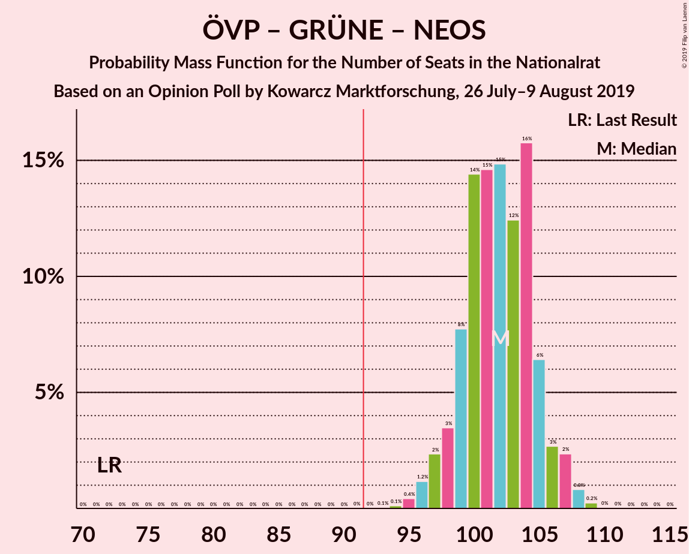

| Number of Seats | Probability | Accumulated | Special Marks |
|:---------------:|:-----------:|:-----------:|:-------------:|
| 72 | 0% | 100% | Last Result |
| 73 | 0% | 100% |  |
| 74 | 0% | 100% |  |
| 75 | 0% | 100% |  |
| 76 | 0% | 100% |  |
| 77 | 0% | 100% |  |
| 78 | 0% | 100% |  |
| 79 | 0% | 100% |  |
| 80 | 0% | 100% |  |
| 81 | 0% | 100% |  |
| 82 | 0% | 100% |  |
| 83 | 0% | 100% |  |
| 84 | 0% | 100% |  |
| 85 | 0% | 100% |  |
| 86 | 0% | 100% |  |
| 87 | 0% | 100% |  |
| 88 | 0% | 100% |  |
| 89 | 0% | 100% |  |
| 90 | 0% | 100% |  |
| 91 | 0% | 100% |  |
| 92 | 0% | 100% | Majority |
| 93 | 0.1% | 100% |  |
| 94 | 0.1% | 99.9% |  |
| 95 | 0.4% | 99.8% |  |
| 96 | 1.2% | 99.4% |  |
| 97 | 2% | 98% |  |
| 98 | 3% | 96% |  |
| 99 | 8% | 92% |  |
| 100 | 14% | 85% |  |
| 101 | 15% | 70% |  |
| 102 | 15% | 56% | Median |
| 103 | 12% | 41% |  |
| 104 | 16% | 28% |  |
| 105 | 6% | 13% |  |
| 106 | 3% | 6% |  |
| 107 | 2% | 3% |  |
| 108 | 0.8% | 1.1% |  |
| 109 | 0.2% | 0.3% |  |
| 110 | 0% | 0.1% |  |
| 111 | 0% | 0% |  |

### Österreichische Volkspartei – Sozialdemokratische Partei Österreichs

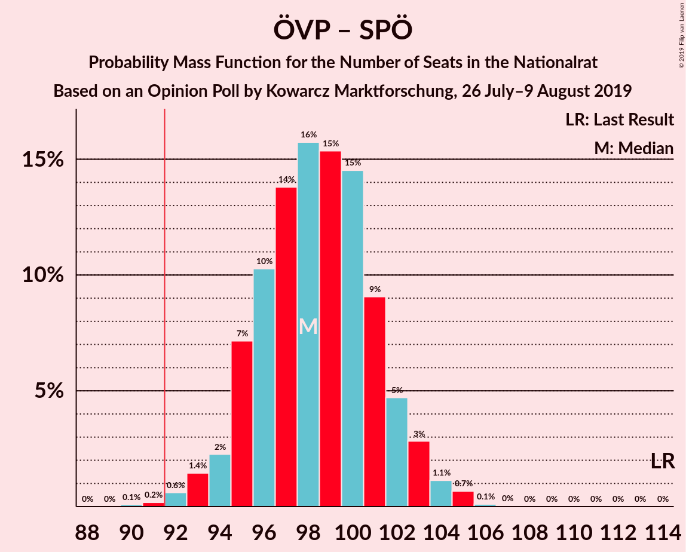

| Number of Seats | Probability | Accumulated | Special Marks |
|:---------------:|:-----------:|:-----------:|:-------------:|
| 90 | 0.1% | 100% |  |
| 91 | 0.2% | 99.9% |  |
| 92 | 0.6% | 99.7% | Majority |
| 93 | 1.4% | 99.1% |  |
| 94 | 2% | 98% |  |
| 95 | 7% | 95% |  |
| 96 | 10% | 88% |  |
| 97 | 14% | 78% |  |
| 98 | 16% | 64% |  |
| 99 | 15% | 48% | Median |
| 100 | 15% | 33% |  |
| 101 | 9% | 19% |  |
| 102 | 5% | 9% |  |
| 103 | 3% | 5% |  |
| 104 | 1.1% | 2% |  |
| 105 | 0.7% | 0.8% |  |
| 106 | 0.1% | 0.1% |  |
| 107 | 0% | 0% |  |
| 108 | 0% | 0% |  |
| 109 | 0% | 0% |  |
| 110 | 0% | 0% |  |
| 111 | 0% | 0% |  |
| 112 | 0% | 0% |  |
| 113 | 0% | 0% |  |
| 114 | 0% | 0% | Last Result |

### Österreichische Volkspartei – Die Grünen–Die Grüne Alternative

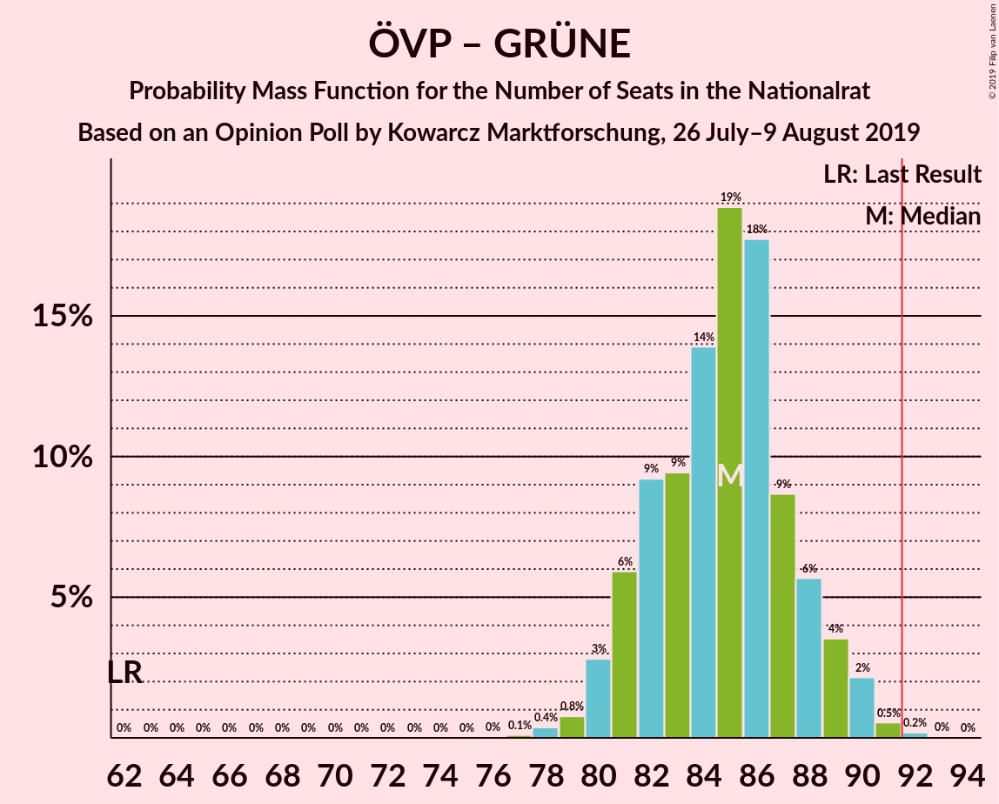

| Number of Seats | Probability | Accumulated | Special Marks |
|:---------------:|:-----------:|:-----------:|:-------------:|
| 62 | 0% | 100% | Last Result |
| 63 | 0% | 100% |  |
| 64 | 0% | 100% |  |
| 65 | 0% | 100% |  |
| 66 | 0% | 100% |  |
| 67 | 0% | 100% |  |
| 68 | 0% | 100% |  |
| 69 | 0% | 100% |  |
| 70 | 0% | 100% |  |
| 71 | 0% | 100% |  |
| 72 | 0% | 100% |  |
| 73 | 0% | 100% |  |
| 74 | 0% | 100% |  |
| 75 | 0% | 100% |  |
| 76 | 0% | 100% |  |
| 77 | 0.1% | 99.9% |  |
| 78 | 0.4% | 99.8% |  |
| 79 | 0.8% | 99.5% |  |
| 80 | 3% | 98.7% |  |
| 81 | 6% | 96% |  |
| 82 | 9% | 90% |  |
| 83 | 9% | 81% |  |
| 84 | 14% | 71% |  |
| 85 | 19% | 57% | Median |
| 86 | 18% | 39% |  |
| 87 | 9% | 21% |  |
| 88 | 6% | 12% |  |
| 89 | 4% | 6% |  |
| 90 | 2% | 3% |  |
| 91 | 0.5% | 0.8% |  |
| 92 | 0.2% | 0.3% | Majority |
| 93 | 0% | 0.1% |  |
| 94 | 0% | 0% |  |

### Freiheitliche Partei Österreichs – Sozialdemokratische Partei Österreichs

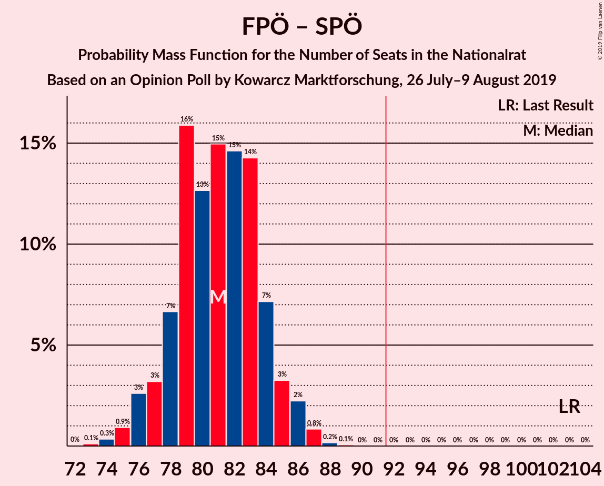

| Number of Seats | Probability | Accumulated | Special Marks |
|:---------------:|:-----------:|:-----------:|:-------------:|
| 73 | 0.1% | 100% |  |
| 74 | 0.3% | 99.9% |  |
| 75 | 0.9% | 99.5% |  |
| 76 | 3% | 98.6% |  |
| 77 | 3% | 96% |  |
| 78 | 7% | 93% |  |
| 79 | 16% | 86% |  |
| 80 | 13% | 70% |  |
| 81 | 15% | 58% | Median |
| 82 | 15% | 43% |  |
| 83 | 14% | 28% |  |
| 84 | 7% | 14% |  |
| 85 | 3% | 7% |  |
| 86 | 2% | 3% |  |
| 87 | 0.8% | 1.1% |  |
| 88 | 0.2% | 0.2% |  |
| 89 | 0.1% | 0.1% |  |
| 90 | 0% | 0% |  |
| 91 | 0% | 0% |  |
| 92 | 0% | 0% | Majority |
| 93 | 0% | 0% |  |
| 94 | 0% | 0% |  |
| 95 | 0% | 0% |  |
| 96 | 0% | 0% |  |
| 97 | 0% | 0% |  |
| 98 | 0% | 0% |  |
| 99 | 0% | 0% |  |
| 100 | 0% | 0% |  |
| 101 | 0% | 0% |  |
| 102 | 0% | 0% |  |
| 103 | 0% | 0% | Last Result |

### Sozialdemokratische Partei Österreichs – Die Grünen–Die Grüne Alternative – NEOS–Das Neue Österreich und Liberales Forum

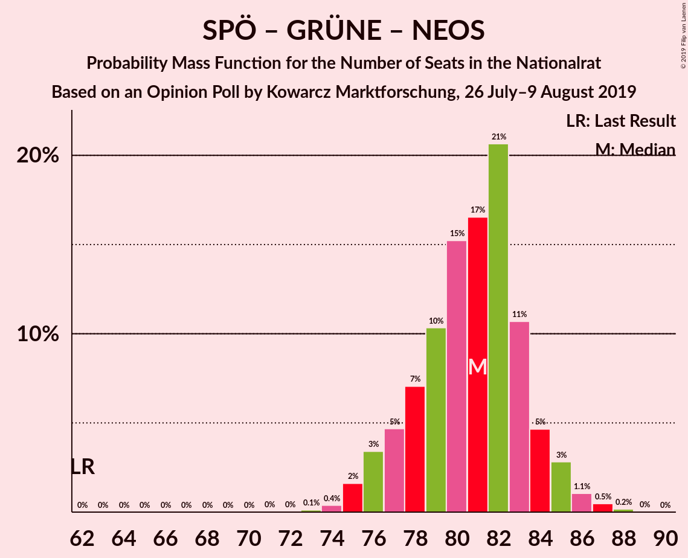

| Number of Seats | Probability | Accumulated | Special Marks |
|:---------------:|:-----------:|:-----------:|:-------------:|
| 62 | 0% | 100% | Last Result |
| 63 | 0% | 100% |  |
| 64 | 0% | 100% |  |
| 65 | 0% | 100% |  |
| 66 | 0% | 100% |  |
| 67 | 0% | 100% |  |
| 68 | 0% | 100% |  |
| 69 | 0% | 100% |  |
| 70 | 0% | 100% |  |
| 71 | 0% | 100% |  |
| 72 | 0% | 100% |  |
| 73 | 0.1% | 99.9% |  |
| 74 | 0.4% | 99.8% |  |
| 75 | 2% | 99.4% |  |
| 76 | 3% | 98% |  |
| 77 | 5% | 94% |  |
| 78 | 7% | 90% |  |
| 79 | 10% | 83% |  |
| 80 | 15% | 72% |  |
| 81 | 17% | 57% | Median |
| 82 | 21% | 41% |  |
| 83 | 11% | 20% |  |
| 84 | 5% | 9% |  |
| 85 | 3% | 5% |  |
| 86 | 1.1% | 2% |  |
| 87 | 0.5% | 0.7% |  |
| 88 | 0.2% | 0.2% |  |
| 89 | 0% | 0% |  |

### Österreichische Volkspartei – NEOS–Das Neue Österreich und Liberales Forum

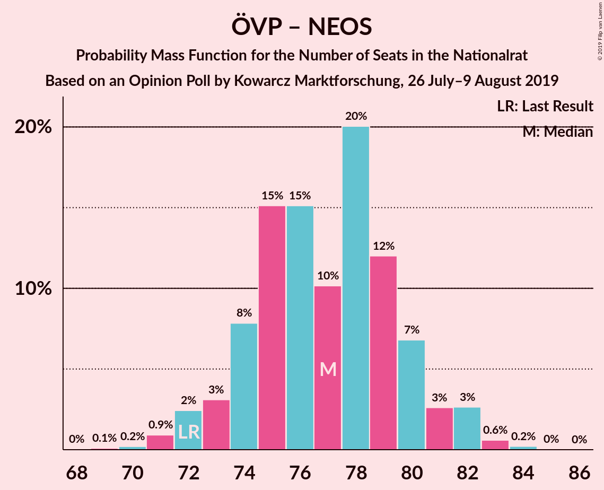

| Number of Seats | Probability | Accumulated | Special Marks |
|:---------------:|:-----------:|:-----------:|:-------------:|
| 69 | 0.1% | 100% |  |
| 70 | 0.2% | 99.9% |  |
| 71 | 0.9% | 99.7% |  |
| 72 | 2% | 98.8% | Last Result |
| 73 | 3% | 96% |  |
| 74 | 8% | 93% |  |
| 75 | 15% | 85% |  |
| 76 | 15% | 70% |  |
| 77 | 10% | 55% | Median |
| 78 | 20% | 45% |  |
| 79 | 12% | 25% |  |
| 80 | 7% | 13% |  |
| 81 | 3% | 6% |  |
| 82 | 3% | 4% |  |
| 83 | 0.6% | 0.9% |  |
| 84 | 0.2% | 0.3% |  |
| 85 | 0% | 0.1% |  |
| 86 | 0% | 0% |  |

### Sozialdemokratische Partei Österreichs – Die Grünen–Die Grüne Alternative

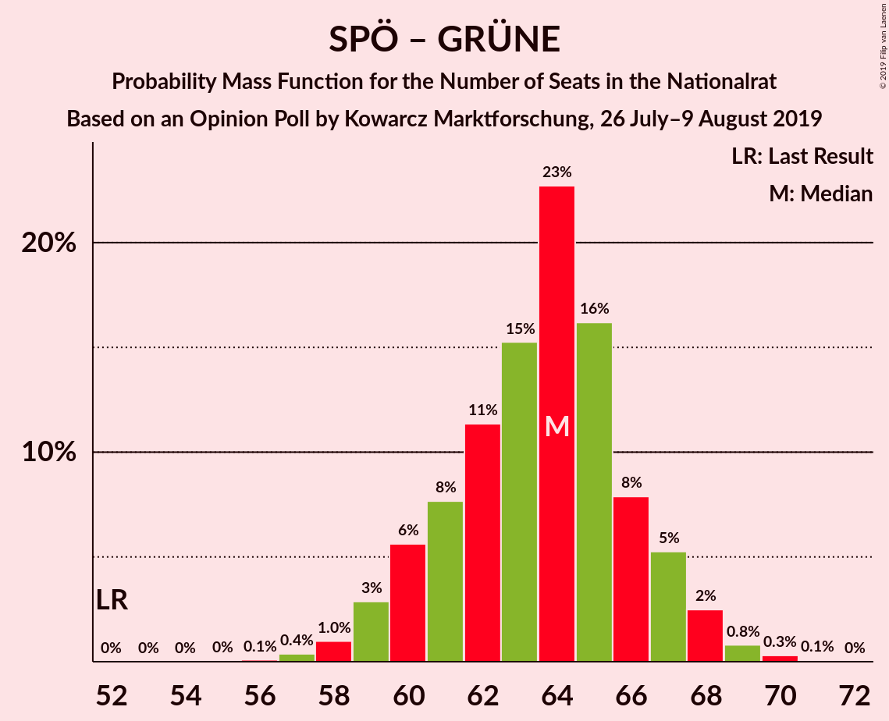

| Number of Seats | Probability | Accumulated | Special Marks |
|:---------------:|:-----------:|:-----------:|:-------------:|
| 52 | 0% | 100% | Last Result |
| 53 | 0% | 100% |  |
| 54 | 0% | 100% |  |
| 55 | 0% | 100% |  |
| 56 | 0.1% | 100% |  |
| 57 | 0.4% | 99.9% |  |
| 58 | 1.0% | 99.5% |  |
| 59 | 3% | 98.5% |  |
| 60 | 6% | 96% |  |
| 61 | 8% | 90% |  |
| 62 | 11% | 82% |  |
| 63 | 15% | 71% |  |
| 64 | 23% | 56% | Median |
| 65 | 16% | 33% |  |
| 66 | 8% | 17% |  |
| 67 | 5% | 9% |  |
| 68 | 2% | 4% |  |
| 69 | 0.8% | 1.2% |  |
| 70 | 0.3% | 0.4% |  |
| 71 | 0.1% | 0.1% |  |
| 72 | 0% | 0% |  |

### Österreichische Volkspartei

| Number of Seats | Probability | Accumulated | Special Marks |
|:---------------:|:-----------:|:-----------:|:-------------:|
| 52 | 0% | 100% |  |
| 53 | 0.2% | 99.9% |  |
| 54 | 0.4% | 99.8% |  |
| 55 | 1.3% | 99.3% |  |
| 56 | 6% | 98% |  |
| 57 | 12% | 92% |  |
| 58 | 7% | 80% |  |
| 59 | 11% | 73% |  |
| 60 | 24% | 62% | Median |
| 61 | 22% | 38% |  |
| 62 | 4% | 15% | Last Result |
| 63 | 4% | 11% |  |
| 64 | 5% | 7% |  |
| 65 | 2% | 2% |  |
| 66 | 0.2% | 0.3% |  |
| 67 | 0.1% | 0.2% |  |
| 68 | 0% | 0.1% |  |
| 69 | 0% | 0% |  |

### Sozialdemokratische Partei Österreichs

| Number of Seats | Probability | Accumulated | Special Marks |
|:---------------:|:-----------:|:-----------:|:-------------:|
| 32 | 0.1% | 100% |  |
| 33 | 0.4% | 99.9% |  |
| 34 | 2% | 99.5% |  |
| 35 | 4% | 98% |  |
| 36 | 8% | 94% |  |
| 37 | 12% | 86% |  |
| 38 | 19% | 74% |  |
| 39 | 23% | 55% | Median |
| 40 | 19% | 32% |  |
| 41 | 8% | 13% |  |
| 42 | 3% | 5% |  |
| 43 | 2% | 2% |  |
| 44 | 0.5% | 0.7% |  |
| 45 | 0.2% | 0.2% |  |
| 46 | 0% | 0% |  |
| 47 | 0% | 0% |  |
| 48 | 0% | 0% |  |
| 49 | 0% | 0% |  |
| 50 | 0% | 0% |  |
| 51 | 0% | 0% |  |
| 52 | 0% | 0% | Last Result |

## Technical Information

### Opinion Poll

+ **Polling firm:** Kowarcz Marktforschung
+ **Commissioner(s):** —
+ **Fieldwork period:** 26 July–9 August 2019

### Calculations

+ **Sample size:** 1600
+ **Simulations done:** 131,072
+ **Error estimate:** 0.59%

